# 5. 权益证明：未来的共识机制

`权益证明`算法用验证者取代了矿工，并使挖矿过程虚拟化。以太坊开发者一直想转向`权益证明`，但它带来了一些问题，开发者仍在努力解决。

`权益证明`算法基于一种不同的区块挖矿理念。

概括而言，该算法基于以下事实：

- 任何想要成为验证者的用户，都必须通过质押币在网络中注册为验证者。质押的价值随后被锁定并冻结。
- 这个币的赌注绝不能低于一定数量。实际上，质押必须大于他们从验证新区块中可能获得的收益。
- 为了正确运作，该算法必须通过削减质押来惩罚不诚实的验证者。这样，验证者从诚实行为中获得的收益将大于攻击区块链的收益。

在每个时间间隔，会从验证者池中选取一个验证者，负责验证并向区块链提供下一个区块。验证者的选择在每个时间间隔根据多种标准进行。

每个验证者投注的赔率会影响被选中的概率。赔率越高，被选中的可能性越大。

`权益证明`的每种实现都按照自身需求来定义这种选择机制。因此，它可能与传统工作量证明`PoW`向权益证明`PoS`的过渡有所不同。

通常，有两种方式进行此类选择：

- `随机选择区块`：通过最小哈希值与最大质押值之间的配对来选取验证者。然而，由于每个验证者的质押是公开的，这种选择可以被预测。
- `币龄选择`：验证者是根据其代币持有时间的长短来选择的。币龄根据币在质押中持有的天数计算。但是，每当验证者添加一个区块，币龄就会重置为 0。因此，必须等待一定的时间间隔才能验证新区块。
    - 这种方式有助于实现去中心化。
- 这可以防止拥有大量质押的节点主导验证过程，从而控制区块链。

这显然不排除新的选择方法。相反，每个人都可以通过项目自身的选择来实现其选择机制。

事实上，每个使用`PoS`的区块链都采用自己认为最合适的方法和技术。被选中的节点因此验证新区块、签名并将其添加到区块链上。

作为奖励，该节点会获得交易费用。

如果节点想要停止验证区块并撤回其质押，它也可以这样做。然而，它必须等待一段时间，以便网络验证其行为是否诚实。该算法实现了以下目标：

- `安全性`：质押作为一种财务激励，促使节点只验证有效区块和有效交易，从而拒绝无效交易。它还激励验证者在规范链上工作。如果行为不诚实，惩罚就是削减质押。
- `能源效率`：无需昂贵且专门的硬件来执行`PoW`所需的复杂计算。
- `激励性`：越来越多的用户将受到激励来管理验证工作。
- `去中心化`：由于验证者的选择具有伪随机性，避免了像`PoW`那样将验证权集中在少数组织手中。
- `币价稳定`：因为不再需要释放新币作为给矿工的奖励。

正因如此，只要质押金额高于奖励，验证者在行为不诚实的情况下，损失的币将超过其可能赚取的币。

要有效控制网络并验证欺诈性交易，验证者需要持有网络上总质押量的 51%。然而，即使这在数学上并非不可能，实际上也是不太可能的。事实上，要做到这一点，验证者必须控制网络，持有至少 51% 的当前流通供应量。存在两种类型的权益证明算法：

- `链式权益证明`：算法在每个时间片（每十秒周期可能代表一个时间片）内伪随机地选取一名验证者，并赋予该验证者生成一个区块的能力。这个区块必须引用某个先前的区块（通常是最长链上前一个链末端的区块）。因此，随着时间的推移，大多数区块会汇聚成一条持续增长的单一链条。
- `BFT（拜占庭容错）风格的权益证明`：验证者被随机赋予提出区块的权利，但通过多轮方法来确定哪个区块是规范链上的。在此基础上，每个验证者在每一轮中对某个特定区块进行投票，在过程结束时，所有（诚实且在线）的验证者就给定区块是否与链相连达成一致。请注意，区块仍然可以连接到链上；区别在于对区块的批准可以在区块内部发生，并且不依赖于其后链的长度或大小。

## 5.1 基于链的权益证明

本节讨论一种将`权益证明`与`工作量证明`相结合的算法。

比特币开发者提出的第一种替代`PoW`的区块生成方法的`PoS`技术，就是基于链的`PoS`。实际上，它是一种介于`PoS`和`PoW`之间的混合机制。它在中本聪共识的框架内，遵循以下原则：

- 点对点式的信息传播
- 区块验证规则
- 最长链规则
- 逻辑目标

第一个完整的基于链的区块链`POS`系统由 Nxt 和 Peercoin 实施并采用。基于链的`POS`的过程可以用下面的算法来描述。与`PoW`不同，`PoS`不依赖无用的哈希值来创建区块。矿工在每个时钟周期内只能找到一次解。

由于哈希难题的复杂度随着矿工质押金额的增加而降低，即使矿工的质押水平较高，其解决该难题所需的估算哈希尝试次数也可以大幅减少。

因此，`PoS`组件避免了如果使用`PoW`会出现的强力哈希并发，从而节省了大量能源。

我们首先提出`BlockGen()`方法，然后是共识算法。（见图 5-1。）

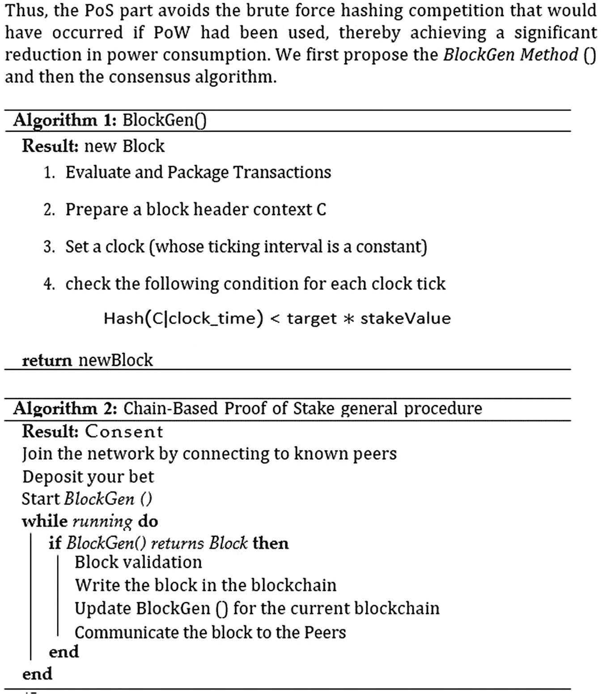

图 5-1 `BlockGen()` 和基于链的权益证明总体流程

### 5.1.1 基于委员会的权益证明

`基于链的`权益证明依然依赖哈希难题来创建区块。作为一种替代技术，基于委员会的权益证明遵循了更有序的流程：

- 根据质押权益建立利益相关者委员会。
- 允许委员会轮流创建区块。

在全局网络中，通常采用安全的多方计算（MPC）技术来推选这样的委员会。MPC 是一种分布式计算方式，其中从不同输入出发的不同部分会产生相同的结果。

基于委员会的权益证明中的 MPC 流程有效实现了以下功能：从所有股东瞄准的区块链当前状态中获取价值，并生成一个伪随机序列的股东（领导者序列），这些股东随后将组成提议委员会。（参见图 5-2。）

这个领导者序列对所有参与方而言都是相同的，并且拥有更高权威级别的参与方可以在该序列中占据多个位置。

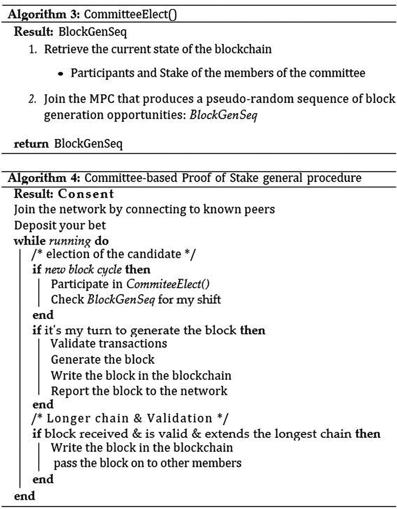

图 5-2 `CommitteeElect()` 与基于委员会的权益证明的通用流程

### 5.1.2 “无成本”难题

在许多早期的基于链的权益证明系统中，既没有惩罚也没有激励措施。（参见图 5-3。）

这会产生不良后果：如果多条链相互竞争，验证者的动机就是尝试在每条链上生成区块。这有两个基本原因：

- 与工作量证明不同，验证者可以免费在多个分支上验证交易。因为构建区块不需要工作量证明，所以在每个分叉上生成区块的计算成本很低。
- 验证者会在所有分叉上工作，因为这样对他们有利可图。如果验证者主要验证两条（或更多）链上的区块，他们将收集任意获胜分支上的交易费用。这增加了收集成功的概率。

因此，问题是如果验证者指向每一个分叉，区块链将更容易受到双重花费攻击。

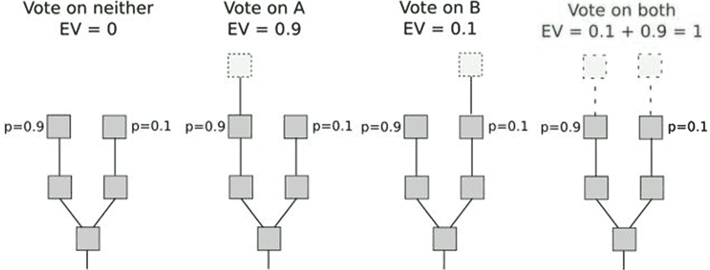

图 5-3 基于链的权益证明系统

在工作量证明中，同时挖多个链没有激励。如果矿工将其哈希算力（计算能力）分散到两条链上，并不会增加他们挖出区块的机会。

这个问题可以通过两种策略解决——`Slash` 机制和 `Dunkle` 机制。

#### 5.1.2.1 Slash 机制

这包括对同时在多条链上创建区块的验证者进行惩罚，以及提供作恶证据。在这种情况下，作恶验证者的保证金会被削减。激励结构因此发生改变。（参见图 5-4。）

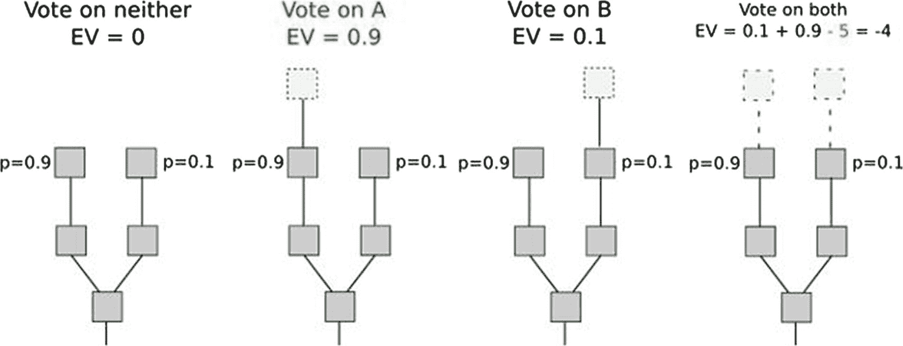

图 5-4 Slash 机制

然而，要使这项技术解决问题，两个分支上每个区块的验证者选择必须相同，这就需要在分叉之前进行验证者选择。该解决方案存在某些缺点：

- 节点必须频繁在线才能保持对区块链的安全视图。
- 对中程验证者存在共谋风险的开放性（例如，在 30 个验证者中，有 25 个提前串通，对前 19 个区块发起 51% 攻击的情况）。

#### 5.1.2.2 Dunkle 机制

第二种方法是简单地对在错误链上创建区块的验证者进行惩罚。假设两个对立的链 A 和 B。在 A 上构建区块的验证者会在 A 上获得 +R 的奖励，但该区块的头部可以包含在 B 中，而验证者会在 B 上受到 -F 的惩罚。换句话说，即使是试图“错误地”伪造链（次要链）的验证者也可能被惩罚。（参见图 5-5。）

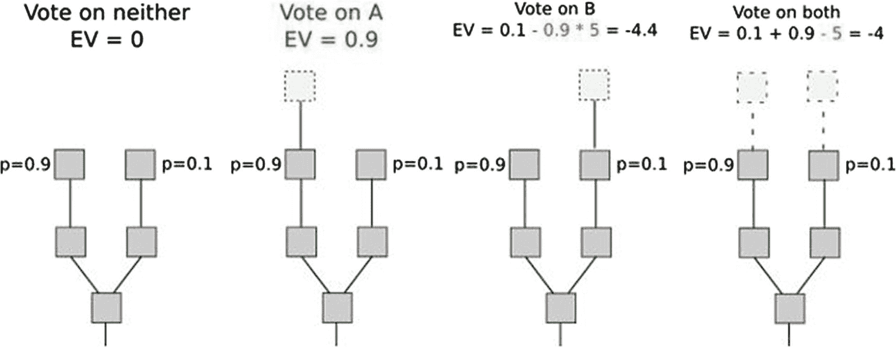

图 5-5 Dunkle 机制

这里的洞见在于，你可以在权益证明内复制工作量证明的经济机制。

在工作量证明中，在链上创建区块时犯错是有代价的，但这个成本隐藏在环境中。矿工必须消耗更多电力，并购买或租赁额外的硬件。或者，他们必须分割自己的计算资源，这并不方便。

在这里，制裁措施被明确陈述。这种技术的缺点是使验证者面临更大的风险。

由于这些原因，以太坊 2.0 正在计划其自己的权益证明机制，名为 Casper，采用 BFT（拜占庭容错）风格。

### 5.1.3 基于 BFT 的权益证明

由于仍然采用最长链规则来保证区块的概率性最终性，基于链的权益证明和基于委员会的权益证明在很大程度上遵循了中本聪共识结构。相比之下，基于 BFT 的权益证明整合了一个额外的共识层，该层提供了区块的确定性快速最终确认。

区块提议可以由任何权益证明机制（轮询、基于委员会等）执行，只要它向 BFT 共识层注入稳定的新区块流即可。

除了标准方法之外，还可以采用检查点机制来确保区块链的目标得以实现。（参见图 5-6。）

因此，最长链规则可以通过当前安全的检查点规则以安全的方式替代，以确定规范的主链。

其中 `BlockGen()`：

- 以与质押价值成正比的成功率选出提议的区块。
- 因此，提议区块 `BlockFi BTC()`。
- 参与将获胜区块最终化的共识 BFT 过程。

返回获胜区块。

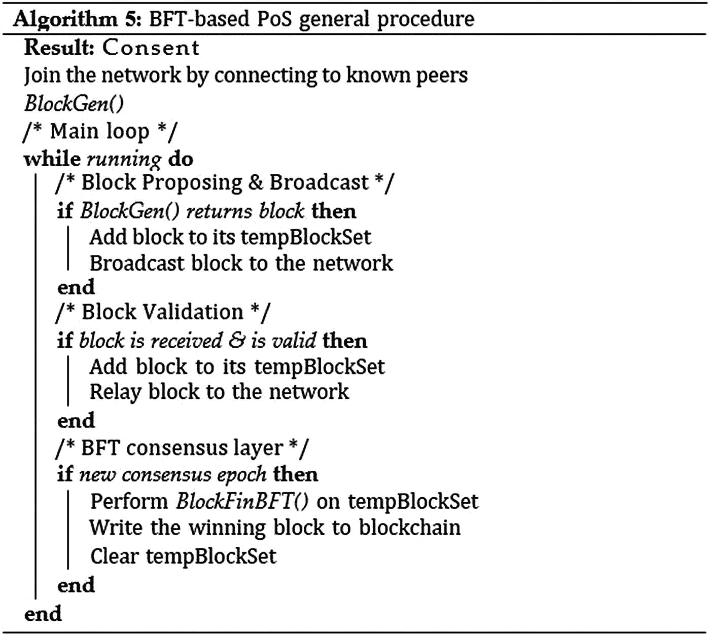

图 5-6 基于拜占庭容错机制的权益证明通用流程

## 5.2 以太坊 Casper

FT（部分同步）方法允许验证者使用权益证明技术对区块进行投票，这些技术会生成一种或多种形式的签名消息。其目标是达成共识，并识别和惩罚任何不诚实的验证者。

与 BFT 共识算法一样，其假设是：如果 2/3 的验证者正确遵循协议，那么无论网络延迟如何，算法都无法解决冲突区块。

Vitalik Buterin 指出，Casper 的目标之一是达到经济目的。我们可以将其定义如下：

当客户有证据证明 (i) `B1` 区块将永远成为规范链的一部分，或者 (ii) 那些导致 `B1` 被回滚的行为者确保会受到至少 `$X` 金额的经济处罚时，`B1` 区块即实现了经济最终确定性，并带有 `$X` 的加密安全边际。

显然，经济加密安全边际必须足够高。事实上，如果我们考虑 `X = 7000 万美元`，就能理解该区块是链的一部分，并且改变它的代价非常高昂。PoW（工作量证明）不具备这些保证。这是 PoS（权益证明）的一个特定特性。

其意图是让 51% 攻击变得极其昂贵，以至于大多数验证者即使联手也无法在不遭受巨大经济损失的情况下恢复已最终确定的区块。经济目的的实现方式是要求那些希望参与验证过程的人提交一份保证金。

如果协议判定某个验证者行为不诚实，违反了协议规则，那么他们将受到惩罚，其保证金将被没收。

协议中的这套规则被称为削减条件。削减条件使得能够在排除合理怀疑的情况下确定验证者何时行为不当（例如，同时为多个不同的区块投票）。

另一方面，对于遵守协议规则的验证者，则有保证他们不会违反任何规则，也不会受到任何处罚。

还存在最终性条件，这些条件描述了何时可以认为某个特定的最终哈希值已确定。当一个哈希值获得了当前活跃验证者存入的总余额中至少 2/3 的承诺时，该哈希值即被视为已最终确定。削减条件必须满足两个属性：

- `可追责的安全性`：如果两个冲突的哈希值都被最终确定，那么必须能够证明至少有 1/3 的验证者违反了某些削减条件。
- `可行的活跃性`：必须存在一组消息，使得 2/3 的验证者能够在不违反削减条件的情况下完成某些新哈希值的传输，除非至少有 1/3 的验证者违反了某些削减条件。

可追责的安全性带来了这种经济目的理念：如果两个冲突的哈希值被最终确定（即分叉），那么你就可以获得数学证明，表明有大量验证者必定违反了某些削减条件，你可以将此证据提交给区块链并对他们进行处罚。

可行的活跃性基本上意味着“不应该发生”。算法有可能被阻塞而无法最终确定任何东西。

## 5.3 Casper 实现

`Blocktree`（区块树）是一种树形数据结构，它与 Casper 中刚刚生成和接收到的区块相关。共识的实际对象是检查点树，它是 `blocktree` 的一个子树。

具体来说，在每个共识周期（`blocktree` 中每 100 高度或检查点树中每 1 高度），每个验证者向其对等节点发送一个针对某个区块的投票，将其视为一个检查点。

检查点是指创世区块以及 `blocktree` 中高度为 100 或 100 的倍数的每个区块。然而，高度为 100k 的区块的“检查点高度”就是 `k`。在 `blocktree` 中，区块的高度必须能被 100 整除。

为了更好地理解，请参见图 5-7 中的检查点树。

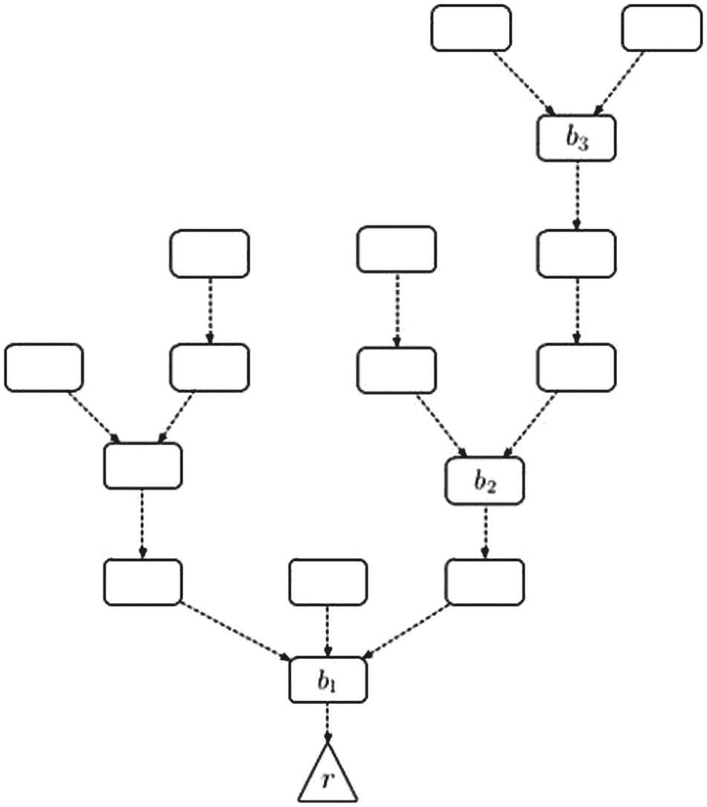

图 5-7 检查点树：虚线表示检查点之间的 100 个区块

高度函数如图 5-8 所示。

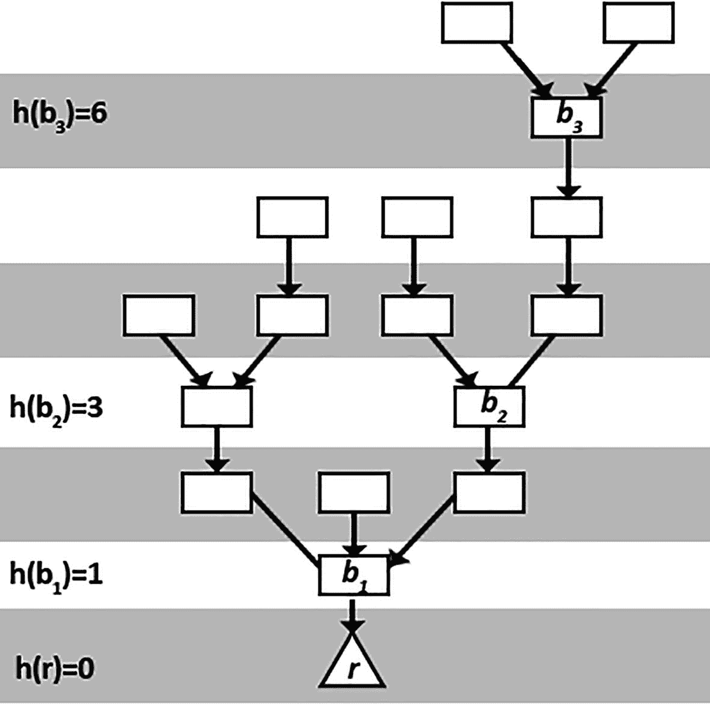

图 5-8 带有高度函数的检查点树

该等级由经过验证的源检查点（`CPs`）及其高度 `h(s)` 组成。一个目标门 `CPT` 及其高度 `h(t)`，以及验证者 `S` 的签名。必须满足 `h(t) > h(s)`。

因此，`<s; CPs; CPt; h(s); h(t)>` 就是验证者的投票。

每张投票都会被发送到网络，并根据签名者参与的价值（来自其质押）进行加权。

如果来源-目标控制点对 `<CP[s]; CP[t]>` 获得了总存款超过 2/3 的验证者的投票，那么 `CP[t]` 即被验证，而 `CP[s]` 则被完成。`CP[s]` 和 `CP[t]` 之间的所有区块也被完成。

Casper FFG 依赖于两条所谓的 Casper 戒律来确保共识的安全性：

1. 验证者不能对同一个检查点高度投两次票。
2. 验证者不需要投出新票，因为其现有投票的范围已经包含了源-目标。

违规者将面临严厉处罚，包括没收质押和暂时禁止投注。由于每张投票都使用验证者的私钥签名，并由验证者接收，因此 Casper FFG 可以轻松检测并应用削减规则。

此外，还适用以下条件：

- 超级多数链接被定义为检查点的有序对 `(a; b)`，也写作 `a -> b`，使得至少 2/3 的验证者（即其存款总和占总存款 2/3 的验证者集合）以 `a` 为源、`b` 为目标投了票。超级多数链接可以跳过检查点。因此，如果 `h(b) > h(a) + 1` 也是可以的。
- 两个检查点（`a` 和 `b`）被定义为冲突的，当且仅当它们是不同分支上的节点，也就是说，一个不是另一个的祖先或后代。
- 一个检查点被视为已验证，如果：
    - 它是创世检查点
    - 链接 `c0 -> c` 拥有超级多数支持

一个检查点 `c` 被视为已最终确定，如果存在一个超级多数链接 `c -> c0`，并且 `c0` 是 `c` 的一个显著子节点。同样地，`c` 被最终确定当且仅当 `c` 是已验证的。还必须存在一个超级多数链接 `c -> c0`，其中检查点 `c` 和 `c0` 不冲突，并且 `h(c0) = h(c) + 1`。（见图 5-9。）

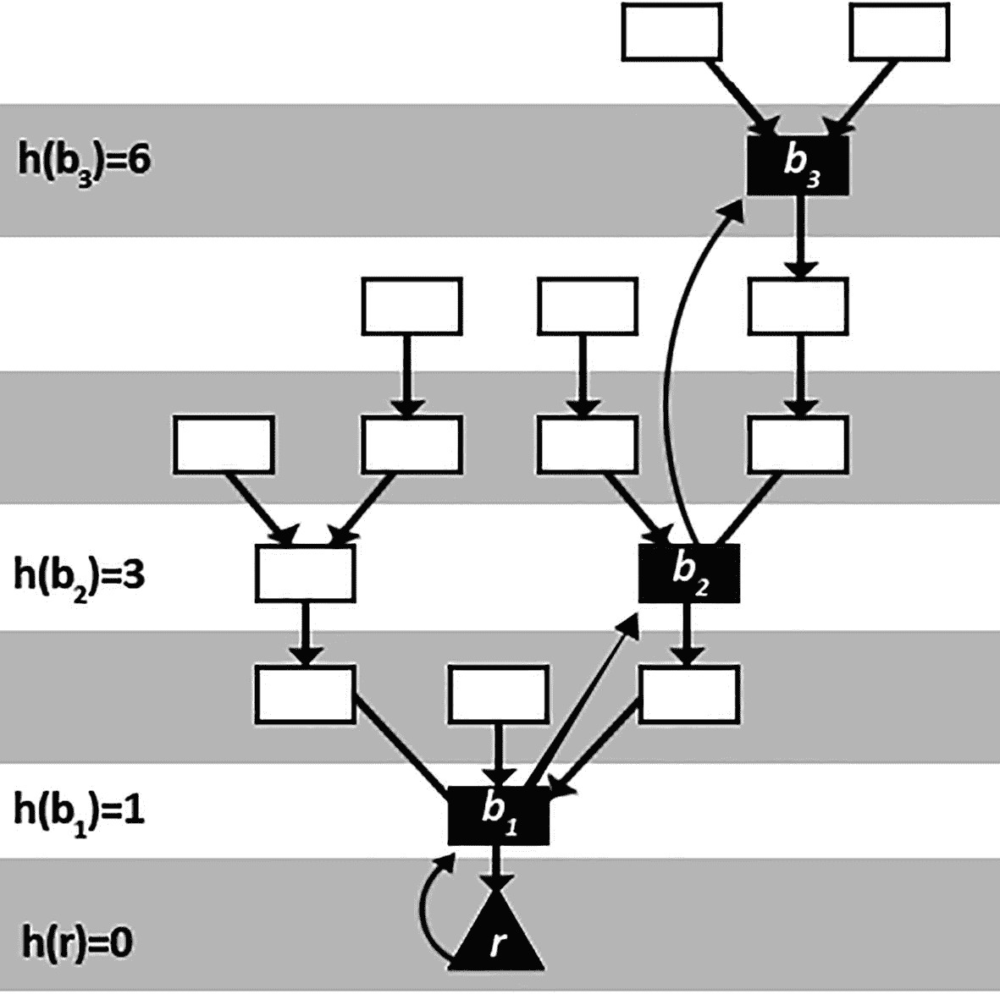

图 5-9 已验证的链 `r -> b1 -> b2 -> b3`

EIP 1011 包含关于 Casper FFG 当前智能合约的信息。利益相关者通过向承诺的智能合约注册而获得参与资格，该合约对 Casper FFG 进行了编码，并可通过以太坊交易访问。

这里我们报告了 `CheckpointTimes()` 函数（见图 5-10），然后是 Casper FFG（友好型最终性小工具）算法。

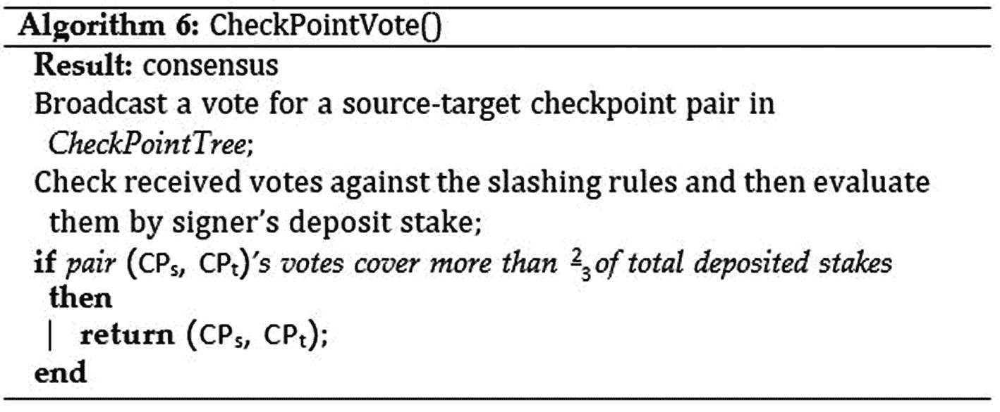

图 5-10 `CheckPointVote()`

然后我们报告 Casper FFG，如图 5-11 所示。

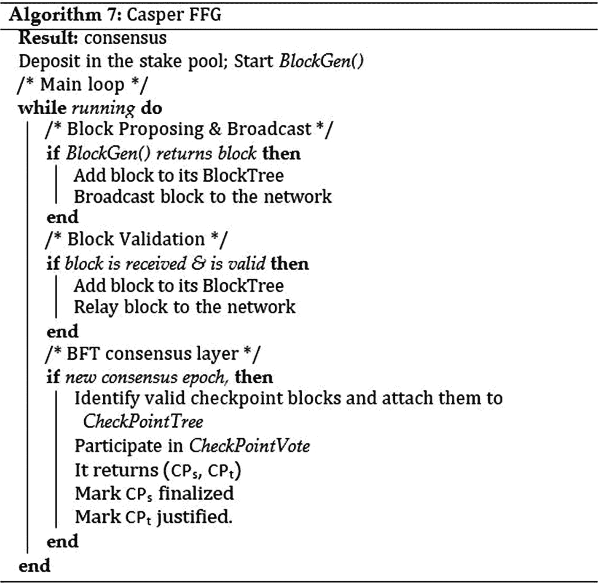

图 5-11 `CheckPointVote()`

## 5.4 本章小结

本章介绍了权益证明的未来发展前景，这种机制用验证者取代矿工，使挖矿过程虚拟化。同时，本章还讨论了基于链的权益证明，该机制采用区块系统运作。

像比特币和以太坊这样的公共区块链的普及，激发了对区块链技术及其在最前沿商业应用中作为分布式系统使用的兴趣。要在分布式系统中使用区块链，你需要理解`Hyperledger Fabric`的概念，它作为应用开发或模块化架构解决方案的基础。下一章将包含关于`Hyperledger Fabric`的更多细节。