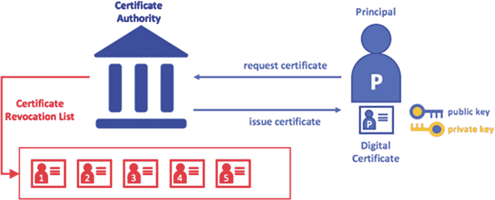
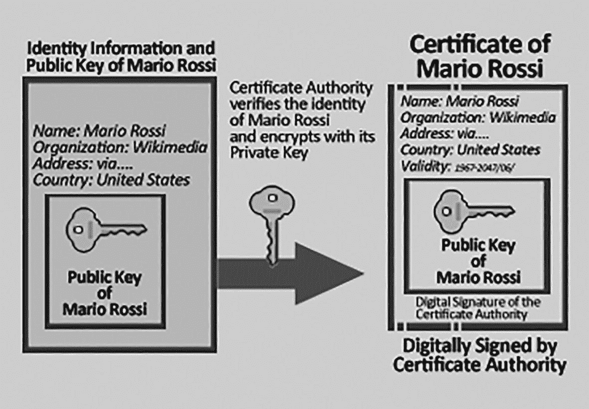

# 6. Hyperledger Fabric

像比特币和以太坊这样的公共区块链的成功，引发了人们对区块链技术及其在最具创新性的商业用例中作为分布式系统应用的日益增长的兴趣。

然而，企业的优先事项基于公有无许可区块链尚无法满足的原则和特性。

因此，私有许可区块链应运而生，能够满足商业上的折中需求。

事实上，私有许可区块链允许你设计出满足以下条件的系统：

-   网络是经过授权的
-   参与者是已知且可识别的
-   数据隐私和机密性有保障
-   交易确认延迟较低

因此，有许多不同的区块链项目被授权用于企业用途。`Hyperledger Fabric` 是一款基于分布式账本的自由软件企业会计系统，与其他著名的分布式账本及区块链系统相比，它拥有某些重要的变体。

然而，区分 `Hyperledger` 与 `Hyperledger Fabric` 至关重要。`Hyperledger` 项目是由 Linux 基金会发起的一个开源区块链项目。

`Hyperledger Fabric` 旨在作为应用开发或模块化架构解决方案的基础。`Hyperledger Fabric` 支持即插即用的组件，例如共识和成员服务。其模块化和适应性强的设计能够满足广泛的行业用例需求。它采用了一种新颖的共识方法，在保护隐私的同时实现了全规模性能。

正如 IBM 所推广的，它是一个面向多种用例应用开发的企业级解决方案，为各个应用领域提供了创新性和多功能性。

它是一个 `授权` 的解决方案，因此参与者是已知的，没有公共网络或无许可网络带来的问题。因此，参与者之间存在着信任。

这对共识产生了显著影响。在一个由可信机构授权和管理的系统中，共识并非必需。实际上，在这种情况下，共识在性能和速度方面将是低效的。

这使得 `Hyperledger Fabric` 平台具有高性能。该区块链经过特殊设计，具有高度模块化、可配置性和可定制性，能够满足各种业务需求。

## 6.1 高层次视角

本节通过提供一个高层次视角来介绍 `Hyperledger Fabric`。它包含以下组件：

-   一个负责通过确定交易顺序来建立系统共识，并因此向对等节点传输新区块的**排序节点**。
-   一个负责使用加密标识符验证网络身份的**成员服务提供者**。
-   一个额外的用于向其他对等节点广播排序服务结果区块的**点对点八卦消息通道**。
-   账本可以配置为与多种数据库管理系统协同工作。
-   每个应用都有**可定制的背书策略**。因此，平台的每个方面都是模块化和可配置的。
-   在 `Hyperledger Fabric` 中，智能合约被称为 `链码`。`Hyperledger Fabric` 的执行-共识架构被称为 `执行-排序-验证`。

实际上，它将交易流程分为三个阶段：

-   执行交易并验证其有效性，从而以这种方式批准交易。
-   使用可编程的共识协议对交易进行排序。
-   在将交易记录到账本之前，必须根据应用区块链的策略对它们进行验证。

`Hyperledger Fabric` 提供了一种**通道结构**。可以说，每个通道对应且仅对应一个区块链。因此，一个区块链仅与一个通道相关联。这意味着只有属于某个通道的组织才有权访问该通道自身的数据，进而也有权访问该通道对应区块链的数据。

这一点，连同私有数据的概念，为数据安全和隐私提供了一定保障。

对条目进行分类的任务被委托给一个模块化组件，该组件在概念上区别于那些执行交易和维护账本的对等节点。这就是排序过程的工作原理。

只要共识是模块化的，它就可以根据对特定分布或解决方案的信任度进行调整。

在讨论 `Hyperledger Fabric` 背后的概念和机制时，本章在尝试总结这些概念时，遵循并信赖网络上可获得的官方 `Hyperledger Fabric` 文档。因此，所有关于 `Hyperledger Fabric` 的叙述均源于对其官方文档的分析与研究。

## 6.2 资产

`Hyperledger Fabric` 允许你使用 `链码` 构建任何类型的资产，无论是有形资产（房产、商品、产品等）还是无形资产（合同条款、知识产权、文档等）。

在 `Hyperledger Fabric` 中，资产被定义为一组键值对，其状态变化作为交易存储在（与通道绑定的）账本上。资产可以采用二进制和/或 JSON 表示形式。

## 6.3 链码

`链码` 是一种定义业务逻辑的软件。换句话说，它定义了一个或一组活动，以及用于更改这些活动的交易指令。因此，`链码` 定义了改变活动状态的操作。它使用规则来读取或更改键值对。

一个交易提案会触发 `链码` 函数，这些函数在当前数据库账本上执行。当 `链码` 运行时，它会生成一组写入集，这些写入集可以在网络中广播，并添加到所有对等节点的账本中。

## 6.4 账本的特征

账本按顺序记录所有网络状态转换。各方提交的链码调用（交易）会产生状态转换。每个操作都包含一组针对账本中资源的会话密钥，这些资源会在账本中被创建、更新或删除。

账本由以下部分组成：

- 一个用于将不可更改的数据存储在区块中的链。
- 一个记录区块链当前状态的状态数据库。如前所述，每个通道都有自己的账本。对于每个参与的通道，每个节点都有一份数据副本。

以下是账本的一些特征：

- 执行基于键的搜索和查询，以及范围查询和通常依赖的查询。
- 使用复杂的查询语言执行只读问题（`CouchDB`）。
- 从历史记录中执行只读问题，并查询账本中某个键的记录，从而提供数据来源的选项。
- 交易包含每个批准该交易的节点的签名，然后才被转发到排序服务。
- 交易包含每个批准该交易的节点的签名，然后才被转发到排序服务。
- 条目被排序到区块中，并由排序服务“分发”给通道上的节点。
- 节点通过检查事件来执行批准策略。
- 在添加区块之前，会执行版本检查，以确认自链码代码执行以来，所读取资源的状态没有发生变化。
- 一旦交易被验证并提交，它就是不可变的。通道账本中的配置区块定义了策略、访问控制和其他相关信息。

通道是成员提供者实例，允许从多个认证机构获取加密材料。

## 6.5 隐私

我之前说过，账本仅存在于一个通道中，而一个通道中只有一个账本。因此，只有通道的成员才能访问该通道的账本。这允许你在确保隐私和机密性的同时完成许多事情。

例如，让我们想象一个供应商公司和多个客户公司的场景。如果供应商公司根据客户公司应用不同的价格，但不想透露此细节，那么通道就是解决方案。事实上，只需为每个商业关系实现一个通道，任何信息的机密性都能得到保证。

此外，在通道本身内部，还可以获得额外的机密性级别。事实上，链码可以定义改变资产状态的函数。那么，在这个领域，只有拥有该链码的节点才能读取与该链码相关的资产。

如果该通道中的一个组织子组需要保密财务数据，它们可以收集数据并将其存储在私有数据库中，该数据库在概念上独立于通道寄存器，并且仅限机构内部的有限人员访问。

通过这种方式，通道为网络的其他部分维护私有交易，而集合则维护通道组织子组之间的私有数据。

在将交易提交给排序服务并将区块添加到账户之前，链码的值可以使用加密方法进行加密，以进一步隐藏数据。只有拥有用于生成密文的对应密钥的用户，才能在加密数据被打印到账本后解密。

## 6.6 身份

一旦加密数据被解密，区块链由多个参与者组成：

- 节点
- 排序节点
- 客户端应用程序
- 管理方
- 用户

需要一个可信权威机构来验证身份。成员服务提供者（`MSP`）是 Fabric 中最受信任的权威机构。`MSP` 是一个元素，用于设置管理该组织授权身份的规则。默认实现使用标准 PKI（公钥基础设施）模型，该模型采用`X.509`身份证书。

### 6.6.1 公钥基础设施 (PKI)

*公钥基础设施*是一种安全架构，允许生成、管理和使用加密密钥和数字证书。因此，它是一组支持安全网络连接的技术。（见图 6-1。）

PKI 的元素包括：

- 证书颁发机构（CA）
- 公钥和私钥
- 数字证书
- 证书吊销

证书颁发机构（CA）负责颁发证书。`MSP` 确定特定组织中受信任成员的利益。

*图 6-1 CA 电子证书示例*

### 6.6.2 数字证书

数字证书是关于证书持有者的一组信息。

`X.509`数字证书的元素包括：

- 版本
- 序列号
- 算法 ID
- 颁发机构
- 有效期
- 主体
- 主体公钥信息
- 证书签名算法
- 证书签名

证书是加密的，因此可以防篡改。任何更改都会使证书失效。实际上，它使用证书颁发机构的私钥签名，因此可以通过同一机构的公钥进行验证。任何更改都会使验证过程无效。（见图 6-2。）

*图 6-2 CA 和数字证书示例*

它证明公钥与主体身份之间的唯一关联。

数字证书的目的是保证声明的公钥与声称拥有该公钥的主体的真实身份相关联。实际上，应用的签名证明了所声明的公钥是准确的。

实际上，应用的签名会检查证书的公钥是否与证书内容中指定的主题匹配。

因此，最初，如果马里奥·罗西想对文档进行数字签名，他必须向通信的其他参与者公开他的公钥。任何拥有该公钥的人都可以从他那里接收使用私钥签名的文档，然后使用上述公钥验证签名；但是，任何人都可以公开一个不同的公钥（他知道其对应的私钥），并声明它是马里奥·罗西的公钥。

为了避免这个问题，每个用户都将自己的密钥放入由可靠第三方（在 PKI 案例中，是证书颁发机构）签名的证书中。所有信任该第三方的人只需检查其签名即可确定公钥是否确实属于该用户。

