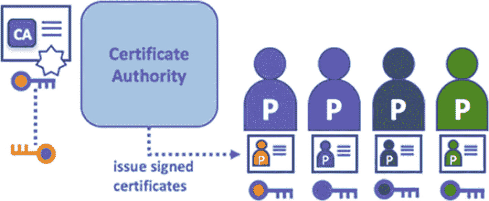

# 证书颁发机构

身份（公钥对和私钥）及证书由认证机构分发给各个参与者。这份将原告与参与者公钥关联起来的证书，由认证机构进行数字签名（并可选择附带完整属性）。因此，如果信任该 CA（且知晓其公钥），则可信任该个体参与者。由此，若信任 CA（并知晓其公钥），便可确信被识别的参与者与证书中提供的公钥相对应，并具备所列特征，从而验证原告证书上 CA 签名的真实性。CA 负责确保组织内所有参与者均拥有经过验证的数字身份。（见图 6-3。）

图 6-3  
证书颁发机构

