# 对等节点

区块链主要由相互通信的节点构成。由于对等节点拥有账本和智能合约，因此它们是网络的关键组件。账本以不可变的方式记录所有智能合约交易。可以对对等节点进行添加、移除、重启、重新配置和删除操作。

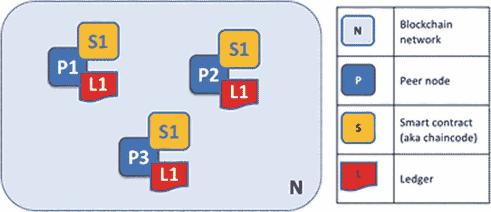
*图 6-4 账本与链码*

因此，一个对等节点拥有一个或多个账本实例，以及一个或多个不同链码的实例。（见图 6-4。）

实际上，对等节点可以参与不同的通道，从而拥有不同的账本实例（每个通道对应一个独立的账本）。此外，根据网络的配置方式及其设计目的，可能存在多个链码。因此，一个对等节点可以托管多个链码实例。

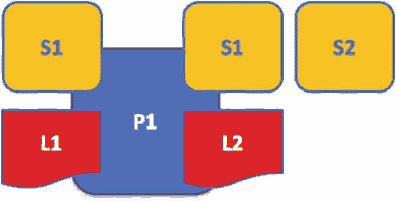
*图 6-5 应用程序与对等节点*

接着，为了获取对账本的访问权限，图中展示了应用程序如何与对等节点交互。（见图 6-5。）Hyperledger Fabric 为开发者提供了 Fabric API 软件开发工具包（SDK），使其能够与对等节点、链码以及账本进行交互。

应用程序可以通过对等节点连接，利用链码查询或更新账本。账本查询的提议交易结果会迅速返回，但账本更新需要应用程序、对等节点和排序节点之间进行更复杂的交互。图 6-6 以非常基础的方式展示了这一点。

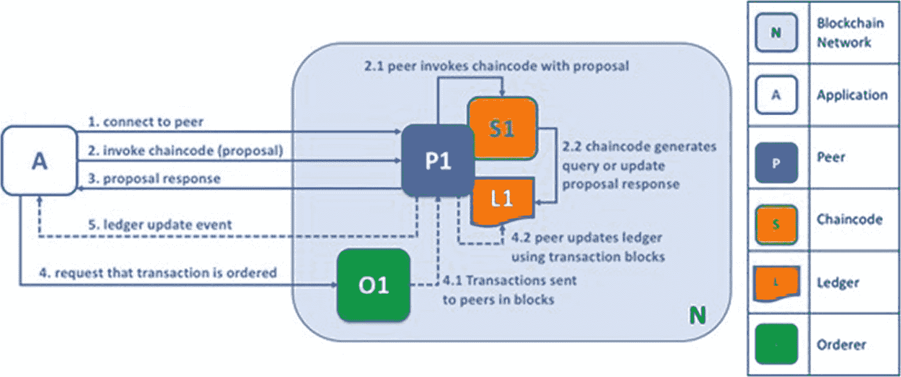
*图 6-6 应用程序连接对等节点*

在图 6-6 中，应用程序 A 连接到 P1，并使用链码 S1 查询或修改账本 L1。P1 向 S1 请求响应，S1 返回计划中的账本查询或更新的结果。应用程序 A 收到了提案响应，流程的查询阶段至此完成。

应用程序 A 根据所有更新回复生成一笔交易，并将其发送给 O1 进行排序。O1 从所有对等节点（包括 P1）收集交易并以区块形式分发。P1 在将交易提交至 L1 之前对其进行验证。一旦 L1 按照从 A 接收到的内容完成更新，P1 便生成一个事件以指示完成。

在大多数情况下，应用程序必须连接其所代表的对等节点，以使账本更新主节点获得批准。这一点在“交易流程”一节中进行了演示。

## 对等节点与组织

不同的公司控制着区块链网络，或者由单个公司统一管理。由于这些网络归各公司所有，对等节点在此类分布式网络的构建中至关重要。对等节点同时也是组织网络的连接点。

在此情形下，一个网络由四个贡献组织和八个对等节点构成。通过通道 `C` 相连的网络 `N` 中的五个对等节点分别是 `P1`、`P3`、`P5`、`P7` 和 `P8`。尽管这些公司的其他对等节点并未加入此通道，但它们通常至少是另一个通道的成员。由某公司开发的应用程序将连接该公司内部的员工以及来自其他公司的员工。为清晰起见，图 6-7 中未显示排序节点。

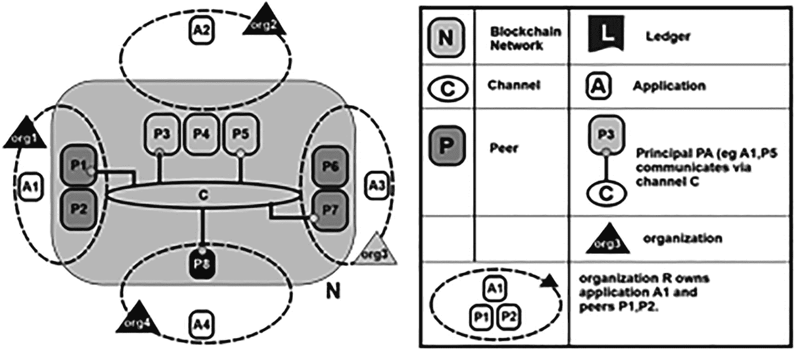
*图 6-7 连接组织与对等节点*

多个拥有资源的贡献组织共同建立并管理网络。本文主题中的资源指对等节点；然而，组织提供的资源远不止对等节点。如果没有那些向网络提供独特资源的组织，协作网络便不复存在。网络因这些成员实体所提供的资源而得以扩展或收缩。

## 对等节点与身份

对等节点通过某个认证中心颁发的数字证书来分配身份。当对等节点通过通道连接到区块链时，其对等节点的权限由通道配置中基于其身份的规则所决定。

因此，（通道）`MSP` 通过其数字证书来识别对等节点所属的组织。（见图 6-8。）

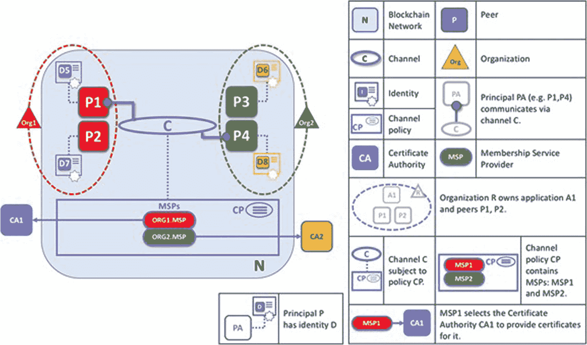
*图 6-8 对等节点的身份*

在此案例中，`CA1` 已向 `P1` 和 `P2` 提供了身份。由 `CA1` 颁发的身份通过 `ORG1.MSP` 与 `Org1` 关联，这是由通道 `C` 使用 `MSP` 通道来确定的。`ORG2.MSP` 同样将 `P3`/`P4` 识别为 `Org2` 的组成部分。

## 对等节点、共识与排序

为了确保网络区块链上的几乎所有对等节点都能保持其信息同步，想要修改账本的应用程序需要经过一个三步流程。

- 第一步，应用程序与一有限集合的支持节点进行交互，这些节点各自提供尚未应用到账本的提议响应。应用程序与之交互以更新账本的支持节点子集，由网络策略决定。
- 第二步，应用程序收集这些提议响应，并执行以下操作：
    - 验证其一致性。
    - 随后将交易发送至排序服务。
- 第三步也是最后一步，排序服务将所有传入的交易进行排序，组合成一个区块，然后将该区块发送给每个邻居节点，在那里每笔交易在被记录前都会得到验证。

因此，构成排序服务的排序节点是一切的核心。接下来的部分将更深入地审视这一过程。

# Hyperledger Fabric 共识

Hyperledger Fabric 中的共识经历三个阶段：

- 提案
- 交易的排序与打包入块
- 验证与提交

## 阶段 1：提案

首先，程序选择一组对等节点来生成对提议账本的更新。

背书策略（为某个链码设定）决定了哪些组织必须批准一项提议的账本交易，之后该交易才能被网络接受并因此得以记录。

达成共识的意义即在于此：每个相关的组织都必须同意提议的账本更新，之后该更新才能被任何对等节点的账本所接受。

应用程序开发出被提议的交易，并将其发送给每一个必须批准它的对等节点组。每个这样的对等节点都是独一无二的。随后，支持节点通过独立执行基于交易提案的链码，生成对结算提案的响应。此更新不会应用到账本主本上；相反，它会被签名并返回给应用程序。（见图 6-9。）

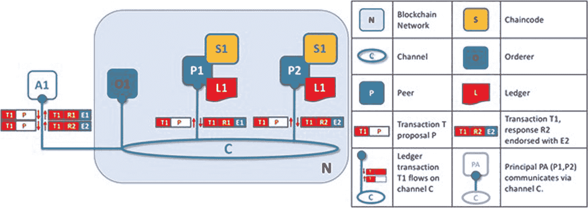
*图 6-9 提案*

对等节点通过使用其私钥对整个有效载荷进行签名并附上其数字签名，来接受一个提议的响应。此许可随后可用于证明某个特定响应是由公司内部的对等节点生成的。

当应用程序获得足够数量的对等节点响应时，阶段 1 即告结束。请注意，不同的对等节点可能会向应用程序返回不同的交易响应，从而导致结算提案出现矛盾。

可能有两个原因导致这种情况：或由于链码的非确定性（链码中应避免的特性），或由于对等节点之间的不一致。

如果应用程序试图用一组不一致的响应交易来更新账本，该更新将被拒绝。如果提案成功，则每个响应都是一致的，因此彼此等价。

## 阶段 2：交易被排序并打包成区块

交易工作流程继续进行到打包阶段。由于付款方接收包含各应用已接受结算提议回复的交易，并将其整理成片段，因此付款方在此过程中至关重要。

除此之外，授权官员负责收集拟议的交易变更，对其进行排序，并将它们打包成区块分发给对等节点。（见图 6-10。）

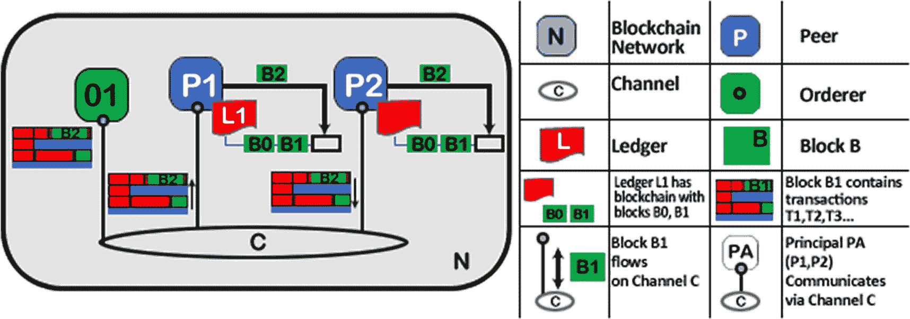
*图 6-10 排序交易*

阶段 3 从计算机将区块分发给与其连接的所有对等节点开始。当新区块生成时，对等节点会通过通道与排序节点相连，从而将新区块的副本分发给所有与发起节点相连的对等节点。每个对等节点会单独处理该区块，但处理方式与通道上所有其他对等节点相同。图 6-11 展示了如何以此种方式保持账本恒定。同样值得注意的是，并非所有对等节点都需要连接到计算机：对等节点可以通过八卦协议级联连接到其他对等节点。

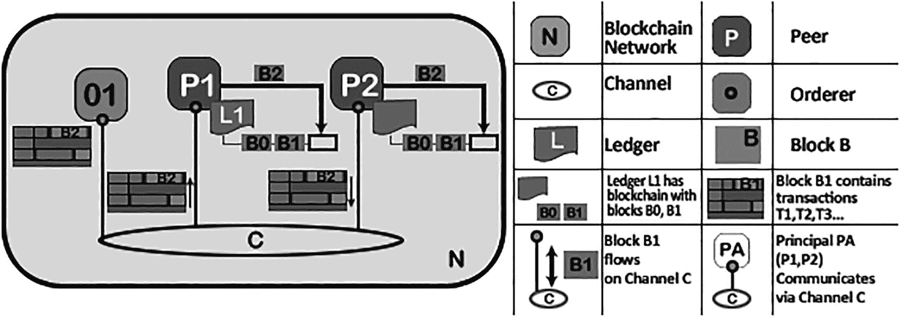
*图 6-11 验证与最终确定*

当对等节点收到一个区块时，它会按区块中交易出现的顺序处理每一笔交易。对于每笔交易，每个对等节点都会检查该交易是否已根据启动交易的链码的认可规则，获得了所请求组织的授权。（见图 6-11。）

例如，有些交易可能只需要一个组织的许可，而其他交易则可能需要多次批准才能被认定为有效。

这一验证过程确保了所有相关企业都产生了相同的结果。此验证不同于阶段 1 中的批准检查，在阶段 1 中，应用程序从其授权的对等节点接收回复，并决定是否发送拟议的交易。如果应用程序通过提交错误交易违反了批准规则，那么对等节点仍然可能在阶段 3（验证阶段）拒绝该交易。

如果交易已被正确接受，对等节点将尝试在区块链上执行它。为此，对等节点必须进行账本一致性检查，以确认账本主副本的当前状态与创建拟议更新时的账本状态一致。

即使交易已获得完全批准，这也并非总是可行的。例如，账本中相同资源的另一笔交易可能已被修改，以至于该交易更新不再适用，因此无法实施。由于通道内的所有对等节点都遵循相同的交易验证标准，因此账本得以保持恒定。

# 账本

Hyperledger Fabric 的 IA 账本由两个独立但相互关联的部分组成：区块链和全局状态。（见图 6-12。）

两者都代表一组业务对象的信息集合。

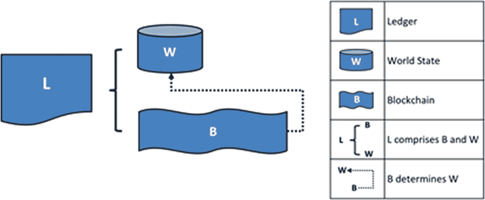
*图 6-12 账本*

首先是区块链的使用。交易日志记录了所有导致世界当前状态的事件。交易被收集到添加到区块链的区块中，这使您可以查看导致当前状态的事件路径。由于区块链一旦写入就不可更改，其数据结构与世界状态的数据结构有很大不同。

其次，存在一个全局状态。业务对象状态集合的当前值存储在一个数据库中。程序无需遍历整个交易寄存器来计算状态的当前值，而是可以直接通过世界状态访问它。默认情况下，账本状态表示为键值对。状态可以被创建、更新和删除，因此世界状态可以频繁更改。

因此，全局状态是从区块链的子集生成的。

## 区块链

区块链记录了导致资产当前状态的事件。

与使用数据库的状态不同，区块链始终以文件形式实现。（见图 6-13。）

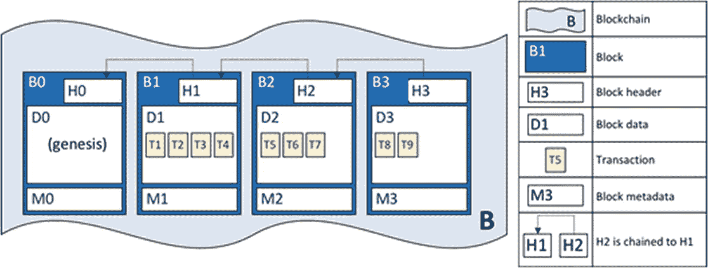
*图 6-13 带有数据库的账本*

账本的创世区块中包含一条提供通道初始网络状态的配置交易。区块结构是标准的，如你在“区块链基础”中所见。

## 交易

另一方面，交易的结构很有意思。其设计如图 6-14 所示。

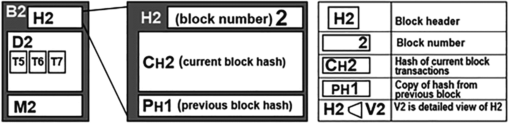
*图 6-14 带有交易的账本*

在此示例中，你可以看到以下字段：

*   **头：** 包含一些关键的交易元数据，例如交易的链码名称和版本。
*   **签名：** 由应用客户端生成的数字签名提供。此功能用于验证交易信息未被篡改，因为创建它需要应用的私钥。
*   **提案：** 将应用的输入参数编码到生成拟议账本更新的链码中。当链码被执行时，此提案提供一组输入变量，这些变量与当前世界状态相结合，生成新的世界状态。
*   **响应：** 包含世界状态的前后值。这是智能合约的结果，如果交易被正确验证，它将被添加到账本中以更新全局系统。
*   **认可：** 这是一个所有批准的交易答案的列表，必须符合每个公司的批准策略。如果足够多的签署人签署了一笔交易，全局状态将不会发生变化。

## 世界状态

*世界状态* 将业务对象属性的主要值反映为单一账本状态。大多数应用程序需要对象的当前值；测量整个区块链上某个物品的实际价值会很繁琐；相反，你可以直接从全局状态获取它。（见图 6-15。）

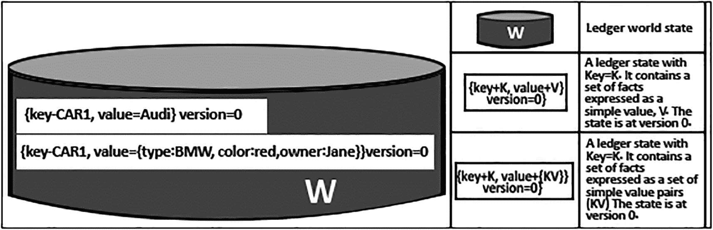
*图 6-15 状态*

数据库跟踪世界的当前状态。这是可以理解的，因为数据库提供了广泛的归档操作符以及快速的状态恢复。

对于全局状态数据库，有两个选项：`LevelDB` 和 `CouchDB`。每个链码都有自己的全局状态，该状态与所有其他链码的状态不同。这意味着世界状态存储在命名空间中，只有来自同一链码的智能合约才能访问该命名空间。因此，一个链码无法看到另一个链码的世界状态。

## 6.12 排序服务实现

Hyperledger Fabric 最新版本中的排序服务是一种崩溃容错提供者，称为 *Raft*。

Raft 采用了“领导者和追随者”范式，其中通道的排序节点会动态选举出一个领导者，由该领导者将消息复制到通道的追随者节点。Raft 具有崩溃容错性，因为它能够容忍部分节点（如领导者节点）的故障，只要大多数排序节点仍然正常运行（CFT）。

## 6.13 总结

本章详细讨论了 Hyperledger Fabric。首先介绍了 Hyperledger Fabric 的特性，然后加深了您对 Hyperledger Fabric 的理解。Hyperledger 概念之所以重要，原因如下：

-   许可区块链
-   性能良好且交易延迟低
-   可根据需求进行模块化和可配置化
-   数据库抽象化以加速与世界状态的交互
-   能够创建不同的通道，进而创建不同的账本
-   能够使用不同的编程语言开发应用和链码

该平台没有特别的缺点。在讨论 Hyperledger 时，您还必须考虑分布式系统，以及如何在分布式系统中使用 Hyperledger。这正是共识算法概念发挥作用的地方。下一章将重点介绍分布式环境中的共识算法。