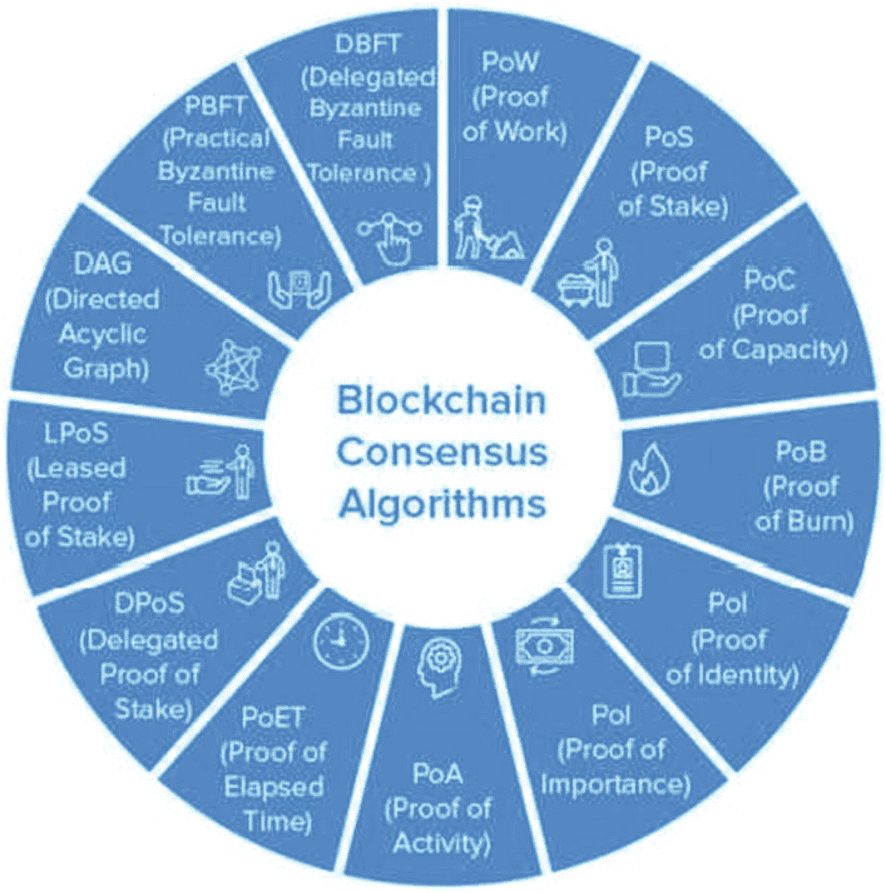
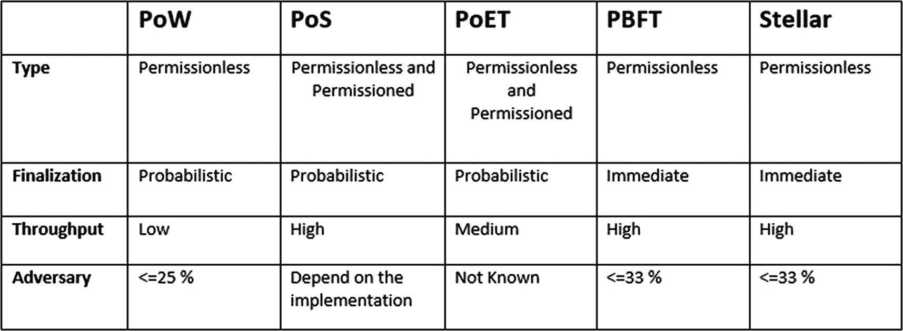

# 7. 区块链共识算法

`共识算法`是一种使人类或机器能够在分布式环境中协作的机制。即使某些节点发生故障，系统也必须能够就所有节点共同的真实来源达成一致。换句话说，系统必须能够容忍故障。

在中心化设计中，系统由单个实体控制。该系统在大多数情况下可以进行调整，因为没有复杂的治理机制来在多个管理员之间达成共识。

去中心化设置则完全是另一回事。假设您正在使用一个分布式数据库；您如何决定添加哪些条目？

为区块链铺平道路的最关键的发展是在互不信任的陌生人的环境中克服了这一困难。本章将探讨共识算法如何对加密货币和分布式账本的运作至关重要。

## 7.1 共识算法与加密货币

区块链是一个存储加密货币用户余额的数据库。至关重要的是，每个人（或者更确切地说，每个节点）都拥有该数据库的副本。否则，您将很快发现信息相互矛盾，从而破坏了加密货币网络的根本目的。

公钥密码学确保了用户不能互相花费对方的货币。然而，网络参与者仍然必须依赖单一的真实来源来确定资金是否已被花费。

为了协调参与，比特币的创造者中本聪提出了一种工作量证明方法。稍后我们将深入探讨`PoW`的工作原理；现在，我们先看看各种共识算法的一些共同特征。

首先，需要那些想要贡献区块的人（称为*验证者*）提供一份抵押品。抵押品是验证者必须提交的一笔资金，这可以阻止他们做出不诚实的行为。如果他们作弊，就会失去抵押品。计算能力、加密货币甚至声誉都是抵押品的例子。

他们为什么要拿自己的资产冒险？因为有经济激励。这通常包括其他用户支付的费用、新铸造的加密货币单位，或两者兼有，并且通常以协议的原生加密货币形式存在。

最后需要的是透明度。您必须能够识别出何时有人在说谎。对他们来说，创建区块的成本应该很高，但对任何人来说验证区块的成本应该很低。这确保了普通用户能够监督验证者。

群体中的个体成员使用共识算法来为整个群体做出并支持最佳选择。这是一种决策系统，其中个体必须支持整体选择，无论他们是否同意。

简单来说，这是一种让一群人可以做出决定的方法。例如，考虑一个由 10 人组成的团队，他们想要选择一个对所有人都有利的项目。他们每个人都可以提出建议，但大多数人会选择最有利于自己的那个建议。这个决定会影响其他人，无论他们是否同意。

想象一下在数万名参与者中做同样的事情。是不是会变得困难得多？

共识算法不仅与多数投票一致，而且还会寻求一个惠及所有人的解决方案。因此，网络始终是胜利的一方。

区块链上的共识模型是在网络世界中建立公平公正的方法。用于达成这种共识的机制被称为*共识定理*。

## 7.2 共识模型的目标

这些区块链共识模型有几个特定的目标，包括：

- **达成一致：** 该机制尽可能多地收集群体的一致意见。
- **协作：** 各方都力求达成一个对整体更有利的协议。
- **合作：** 每个人都像一个团队一样工作，将个人目标搁置一旁。
- **平等权利：** 在投票过程中，每个投票者都具有相同的价值，每个人的投票都很重要。
- **参与：** 网络中的每个人都必须参与投票。没有人会被排除在外，也没有人能够投弃权票。

## 7.3 不同类型共识算法

拜占庭问题的另一个非常困难的方面是达成一致。即使出现一个缺陷，节点也将无法达成妥协，或者会遇到更高的难度值。

使用共识算法，您不必处理这个问题。它们的主要目标是尽一切必要手段达成既定目标。拜占庭共识结构在可信度上远低于区块链共识模型。

因此，在可能存在冲突输出的分布式系统中，采用共识技术来获得更好或更高的结果是可取的。

共识算法是一种计算机工程方法，允许分散的流程或系统就*单一数据值*达成一致。共识方法用于具有多个故障节点的网络，以确保可靠性。在分布式计算和多智能体系统中，解决这个问题，即所谓的*共识问题*，至关重要。

共识算法必须假设某些进程和系统将不可用，并且某些通信将会丢失，以应对这种现实情况。因此，共识方法必须具备容错性。

共识方法用于具有多个故障节点的网络，以确保可靠性。它们必须确保系统中的节点能够就单一的真实来源达成一致。

## 7.4 区块链共识算法的类型

存在多种具有不同特性的区块链共识算法（见图 7-1）。以下各节将介绍其中许多算法。

### 7.4.1 工作量证明（PoW）

中本聪发明了`PoW`，这是区块链世界中最古老的共识机制。它也被称为挖矿，参与其中的节点被称为*矿工*。

在这种技术中，矿工必须运用大量算力来解决复杂的数学谜题。他们采用多种挖矿技术，包括图形处理器（`GPU`）挖矿、专用集成电路（`ASIC`）挖矿和现场可编程门阵列（`FPGA`）挖矿。最先解决难题的人将获得一个区块作为奖励。

图 7-1

共识算法的类型

多种加密货币——包括比特币、莱特币、ZCash、质数币、门罗币和垂直币——都采用了`工作量证明`机制。

`PoW`不仅对金融行业产生了影响，还波及了医疗保健、治理、管理等领域。事实上，它提供了通过一个地址进行多通道支付和多签名交易的选项，以提高安全性。

### 7.4.2 权益证明（PoS）

`PoS`是`PoW`共识机制最简单且最环保的替代方案。

在这种区块链系统中，区块的创建者并非扮演矿工角色，而是充当验证者。他们可以在所有人之上构建一个区块，这将节省能源和时间。为了验证该区块，他们必须投入一定数量的资金或权益。

此外，与`PoW`不同的是，由于该共识模型中没有奖励机制，矿工可以选择保留自己的交易手续费。

因此，像以太坊这样的公司被推动在其`以太坊 2.0`版本中将范式从`PoW`升级为`PoS`。它还帮助了达世币、点点币、Decred、ReddCoin 和 Piv X 等多个区块链生态系统的正常运行。

尽管`PoS`解决了之前困扰`PoW`的一些缺陷，但市场仍然面临诸多挑战。为了解决这些问题并提供更好的区块链生态系统，涌现出了多种类型的`PoS`。`权益证明`的两种主要变体是`PoSD`和`LPoS`，接下来将讨论它们。

#### 7.4.2.1 委托权益证明（PoSD）

在`PoSD`中，玩家质押他们的币并投票给一定数量的代表，其投入金额决定了他们所拥有的投票权重。例如，如果用户 A 向某代表投入 10 个币，而用户 B 投入 5 个，那么 A 的投票权比 B 更重要。

代表们还可以通过互换手续费或固定数量的比特币获得报酬。

由于其基于权益权重的投票方式，`PoSD`通常被视为一种数字民主，并且是运行最快的区块链共识算法之一。该区块链共识机制的一些实际应用包括 Steem、EOS 和比特股。

#### 7.4.2.2 租赁权益证明（LPoS）

`LPoS`是 Waves 平台上`PoS`共识机制的更新变体。

与传统的权益证明方法不同，该共识过程允许用户将其闲置的加密货币余额租赁给完整节点，而非仅仅出租整个余额。

出租最多的人有最大的机会创建区块。此外，出租者可以从完整节点收取的交易手续费中获得分成。

这种`权益证明`的变体提供了一种快速且安全的方式来构建公有加密货币。

### 7.4.3 拜占庭容错（BFT）

拜占庭错误是指系统中的参与者必须就避免灾难性故障的适当方法达成一致，但其中一些参与者却无法确定的情况。`PBFT`和`DBFT`是区块链行业中两种最常见的`BFT`共识模型。

### 7.4.4 实用拜占庭容错（Practical-BFT）

`Practical-BFT`是一种简单的方法，它通过允许用户完成计算来验证决策的有效性，从而对发送给他们的消息达成一致，以此来应对拜占庭将军问题。

该方随后将其决定通知其他节点，这些节点随后需要做出决定。最终的选择则基于从其他节点收集到的信息。

### 7.4.5 委托拜占庭容错（dBFT）

`dBFT`技术由 NEO 引入，NEO 币的持有者同样有权选举代表。

无论他们投入多少资金，这一点都成立。任何满足最低要求——包括经过验证的身份、足够的设备以及 1000 个 GAS——的人都可以担任代表。之后，代表中会随机选出一名发言人。

### 7.4.6 有向无环图（DAG）

`DAG`是一种简单但重要的区块链共识机制，每个处理区块链业务的移动应用开发公司都应熟悉它。

在这种类型的区块链共识架构中，每个节点都准备成为“矿工”。如果矿工被从等式中移除，交易由用户验证，那么与交易相关的成本将降至零。任意两个节点之间验证交易的过程变得更加容易，使其更轻量、更快速、更安全。

尽管这些是开发环境中最常见的共识模型，但其他几种区块链共识机制也开始受到关注，包括以下内容。

### 7.4.7 容量证明（PoC）

所遵循的方法是“绘图”。使用这种区块链共识技术的两种加密货币是 Burstcoin 和 SpaceMint。

它是如何工作的？首先你需要理解两个概念——绘图和挖矿——才能领会共识定理的本质。

- `PoC`算法使用的随机数（nonces）与比特币中使用的不同。在随机数被破解之前，你需要对你的 ID 和数据进行哈希运算。
- 硬盘“挖矿”是下一个概念。如前所述，你一次可以获取 0 到 4095 个“勺子”，然后将其存储在你的存储空间内。系统会给你一个严格的时间限制来解析这些随机数。这个时间线说明了创建一个区块需要多长时间。

如果你能比其他矿工更快地解析这些随机数，你将获得一个区块作为奖励。Burst 是采用`PoC`算法的知名公司案例。

### 7.4.8 燃烧证明（PoB）

`PoB`共识架构在能耗方面是`PoW`和`PoS`的替代方案。它的运作方式是让矿工燃烧/销毁虚拟加密货币代币，从而允许他们按照与燃烧货币成比例的方式生成区块。燃烧的币越多，他们每获得一个币赢得新区块的机会就越大。

然而，为了燃烧货币，他们必须将其发送到一个无法用于验证区块的地址。这通常用于分布式共识的场景。这种共识机制的最佳例子是 Slimcoin。

### 7.4.9 身份证明（PoI）

`PoI`类似于授权身份的概念。它是用户私钥的一段密码学确认信息，与每笔交易相关联。

每个经过身份验证的用户都可以创建和管理一个数据块，并与网络中的其他用户共享。

这种区块链的方法论确保了数据的有效性和完整性。因此，它是智慧城市应用的一个良好候选方案。

### 7.4.10 活动证明（PoA）

`PoA`结合了`PoW`和`PoS`共识模型的优点。

矿工们像在`PoW`中一样，使用特殊硬件和电能，竞相尽快解决一个密码学难题。然而，最终形成的区块只包含区块继承者的身份信息和奖励交易信息。

`活动证明`结合了`权益证明`和`工作量证明`共识技术。它使得合法交易和矿工之间的共识得以发生。`PoA`旨在解决`PoS`和`PoW`中存在的中心化问题。它也力求以资源节约的方式实现这一目标。

### 7.4.11 消逝时间证明（PoET）

`PoET`基于均匀分布并提高更大比例参与者获胜几率的原理。因此，每个参与节点都需要等待一个特定时间才能开始下一轮挖矿过程。等待时间最短的成员将被请求提议一个区块。

同时，每个节点自行选择进入休眠模式前的等待时长。

### 7.4.12 重要性证明（PoI）

`PoI`是 NEM 开发的`PoS`协议变体，考虑了验证者的角色。这不仅受其持有份额的数量和可能性影响，还受其他因素影响，例如声誉、总余额以及通过每个特定地址完成的交易数量。

图 7-2 中的表格比较了不同的共识算法。

图 7-2

算法对比表

## 7.5 分布式系统与区块链技术中的共识

区块链的两种主要形式是许可链，也称为授权区块链。在无许可链中，节点是匿名的。

添加一个新的经过修改的交易区块可能会导致分叉。当一个有效交易与一个无效交易不一致时，就会发生分叉。共识算法的主要目的是在节点间达成共识，以便每个节点能就一个真实值达成一致。在授权区块链中，节点不是匿名的，而是被视为已知实体。

此外，在定义共识系统时，需要考虑通信范式是同步的还是异步的。崩溃错误、瞬态错误、遗漏错误、安全错误、软件错误、拜占庭错误、时间错误和环境问题都是错误的例子。

当进程突然停止时，就会发生崩溃故障。在同步环境中，超时机制有助于发现这种故障，但在非同步环境中，故障很难被识别。

- **延续失败：** 非必然且持久的失败被称为*瞬态*失败。电池电量低或电涌可能导致硬件问题。这些软件缺陷可能是内部代码中的缺陷，这些缺陷很少出现，且在测试时未被发现。

- **可靠性失败：** 可靠性失败是由于安全攻击和身份冒充造成的。因此，数据有可能被损坏。

- **软件失败：** 软件失败是由于设计和建模中的错误导致的。这种失败可能导致其他类型的失败，例如崩溃或遗漏。

- **拜占庭失败：** 拜占庭失败是一种在系统每个成员身上表现各异的故障。它使得所有成员难以达成一致意见或共识。

这些错误使系统感到困惑，使其更难接受它们。例如，一个服务器在一个观察者看来可能已宕机，而在另一个观察者看来却运行正常。由于他们观点冲突，两个观察者将无法达成共识，并且该服务器不能被认定为失效。

- **时间失败：** 当错过截止时间时，就会发生时间失败。也就是说，可能得到了正确的结果，但为时已晚，已不再有用。在实时系统中，这类失败极其重要。

- **环境扰动：** 如果解决方案不能适应环境变化，它就会失败。环境的变化可能导致一个正确的结果变得不正确。

区块链是由去中心化账本构成的，不受中央机构管理。恶意行为者可能因试图引发故障而获得丰厚回报。因此，思考拜占庭问题及其解决方案对区块链至关重要。

拜占庭错误在系统的每个成员中表现各异。它阻止所有参与者达成一致或形成共识。这些错误使系统感到困惑，使其难以接受这些错误。

## 7.6 复习题

1.  “共识是分布式系统中的一个基本概念，但它是区块链独有的。” 这个说法正确还是错误？

2.  哪个说法是正确的？
    1.  共识算法是一种允许公司或机器在分散环境中进行协作的方法。
    2.  共识算法是一种阻止用户或机器在分布式环境中协作的方法。
    3.  共识算法阻止用户或机器在分布式环境中协作。
    4.  你可以使用共识过程来展示等价关系，这是一种机制。

3.  关于工作量证明的概念，以下哪个说法是正确的？
    1.  `PoW`系统允许知道秘密（通常是公钥）的参与者执行更快的计算。
    2.  `PoW`系统允许知道秘密（通常是私钥）的参与者执行更快的计算。
    3.  通过这个过程，矿工必须使用大量的计算能力来解决复杂的数学难题。
    4.  通过这个过程，矿工必须使用算法来解决复杂的数学难题。

4.  关于活动量证明，以下哪个说法是正确的？
    1.  就像在`PoW`中一样，矿工们竞相使用专门的硬件和电力尽快解决一个密码学难题。
    2.  矿工们使用特定的硬件和电能尽快解决一个密码学难题，就像在`PoW`中一样。
    3.  矿工们使用它，通过专门的软件和电能尽快解决一个密码学难题，就像在`PoW`中一样。
    4.  矿工们竞相使用专门的软件和能量尽快解决一个密码学难题，就像在`PoW`中一样。

5.  “在其运作中，`PoI` 是一个`PoS`版本，它考虑了股东和验证者的角色。” 你认为这个陈述是真的还是假的？

## 7.7 复习答案

1.  答：错误。共识是分布式系统中的一个主要概念，而不仅仅是区块链中的概念。
2.  答：A，共识算法是一种允许公司或机器在分散环境中进行协作的方法。
3.  答：C，在这种技术中，矿工必须使用大量的计算能力来解决复杂的数学谜题。
4.  答：A，就像在`PoW`中一样，矿工们竞相使用专门的硬件和电力尽快解决一个密码学难题。
5.  这个说法是正确的。

## 7.8 本章小结

区块链作为一种分布式账本，已激发出横跨众多行业的广泛兴趣。区块链技术正被用于多个领域，以创造各类产品和服务。要理解区块链对各种应用的影响和适用性，掌握其核心组件、功能特性和架构至关重要。

`比特币`这种加密货币，是区块链最广为人知的应用。由于区块链网络是一个分布式账本，它需要在节点之间达成共识机制，以确保其正常运作。

为了理解区块链对不同应用的影响和适用性，弄清其基本组件、功能特征和设计原理十分关键。现代世界已提出了多种共识算法，每种算法都具备独特的可靠性和可扩展性特征。单一共识算法无法满足所有企业的需求。评估不同共识算法的优势、弱点及应用场景是必要的。

本章识别并讨论了与区块链共识、隐私性和可扩展性相关的参数。针对这些因素，对各种共识技术进行了比较和对比分析。高效共识算法的开发以及现有算法的评估方面仍存在研究空白。本书将指导开发者和研究人员完成评估和创建共识算法的全过程。

由于存在多种明确的共识算法，区块链网络的本质极具灵活性。世上没有所谓的"完美"区块链共识算法。但我们认为，这正是技术的魅力所在：它总是在不断改进。由于本章详细解释了区块链和共识算法，你现在应该已经准备好基于这些技术启动一个项目了。下一章将介绍本书的第一个项目。