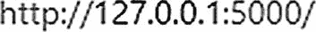

# 8. 区块链项目共识算法

本项目是一个用 Python 编写的基础区块链。它是一组以特定方式链接在一起的区块，使得其中存储的信息无法被修改（随着更多区块加入区块链，修改难度会越来越大）。

该区块链使用 PoW（工作量证明）算法来挖掘每个区块。其目的是找到满足特定条件的、区块中所有储存数据的哈希值。为此，每个区块都有一个名为 `nonce` 的可变数据，必须对其进行修改，直到发现所需的哈希值。

例如，比特币中所需的哈希值要求前 *X* 位数字为零。`X` 的值决定了挖矿的难度（`X` 越大，难度越高）。在这个区块链中，`X` 是区块链的一个属性，可以在其构造函数中设置。然而，在比特币和大多数其他币种中，这取决于支持网络的节点的挖矿能力。

## 8.1 启动项目

本项目有一个依赖项，名为 `hashlib`，它用于保护哈希值和消息摘要，即 `import hashlib`。

要运行该项目，请打开终端并输入以下内容：

```
python3 project1.py
```

`Create Transaction` 方法用于生成交易。所需输入包括发送地址、接收地址以及 FDC（物联网中的*联邦数据协作*）的数量。创建交易后，使用 `Mine Pending Transactions` 函数将其添加到区块链。此方法需要一个参数：区块矿工的地址，即未来将获得奖励的地址。你也可以使用 `Show Address Balance` 方法，将需要验证的地址名称作为参数，来检查每个地址的余额。

## 8.2 Python 代码

清单 8-1 展示了 Python 文件 `TransactionProject.py`。该文件将帮助我们完成以下任务：

1. 在区块链中创建交易
2. 挖掘交易
3. 验证交易
4. 在区块链中创建区块

```
import datetime
import hashlib
from pprint import pprint
class Transaction(object):
"""Transaction class
"""
def __init__(self, fromAddress, toAddress, amount):
self.fromAddress = fromAddress
self.toAddress = toAddress
self.amount = amount
class Block(object):
"""Block class
"""
def __init__(self, timestamp, transactions, previousHash=""):
self.timestamp = timestamp
self.transactions = transactions
self.previousHash = previousHash
self.nonce = 0
self.hash = self.calculateHash()
def calculateHash(self):
info = str(self.timestamp) + str(self.transactions) + str(self.previousHash) + str(self.nonce)
return hashlib.sha256(info.encode('utf-8')).hexdigest()
### Proof of work algorithm
def mineBlock(self, difficulty):
self.hash = self.calculateHash()
while(self.hash[:difficulty] != "0"*difficulty):
self.nonce += 1
self.hash = self.calculateHash()
class BlockChain(object):
"""Blockchain class
"""
def __init__(self):
self.chain = [self.createGenesisBlock()]
self.difficulty = 4
self.pendingTransactions = []
self.miningReward = 100
def createGenesisBlock(self):
return Block("20/03/2018", [], "0")
def getLatestBlock(self):
return self.chain[-1]
def minePendingTransactions(self, miningRewardAddress):
newBlock = Block(datetime.datetime.now(), self.pendingTransactions)
newBlock.previousHash = self.getLatestBlock().hash
### you can check if transactions are valid here
print("mining block...")
newBlock.mineBlock(self.difficulty)
print("block mined:", newBlock.hash)
print("block succesfully mined.")
self.chain.append(newBlock)
self.pendingTransactions = [Transaction(None, miningRewardAddress, self.miningReward)]
def createTransaction(self, transaction):
self.pendingTransactions.append(transaction)
def getBalanceOfAddress(self, address):
balance = 0
for block in self.chain:
for transaction in block.transactions:
if transaction.fromAddress == address:
balance -= transaction.amount
if transaction.toAddress == address:
balance += transaction.amount
return balance
def isBlockChainValid(self):
for previousBlock, block in zip(self.chain, self.chain[1:]):
if block.hash != block.calculateHash():
return False
if block.previousHash != previousBlock.hash:
return False
return True
def showBlockChain(self):
print("blockchain: fedecoin\n")
for block in self.chain:
print("block")
print("timestamp:", block.timestamp)
pprint("transactions:", block.transactions)
print("previousHash:", block.previousHash)
print("hash:", block.hash, "\n")
def showAddressBalance(self, address):
print(address, "balance:", self.getBalanceOfAddress(address))
fedecoin = BlockChain()
fedecoin.createTransaction(Transaction("address1", "address2", 100))
fedecoin.createTransaction(Transaction("address2", "address1", 50))
fedecoin.minePendingTransactions("fede_address")
fedecoin.createTransaction(Transaction("address1", "address3", 100))
fedecoin.createTransaction(Transaction("address2", "address1", 50))
fedecoin.minePendingTransactions("fede_address")
fedecoin.showAddressBalance("fede_address")
print("fedecoin is valid?", fedecoin.isBlockChainValid())
fedecoin.chain[1].transactions = Transaction("address1", "address2", 1000)
print("fedecoin is valid?", fedecoin.isBlockChainValid())
fedecoin.chain[1].calculateHash()
print("fedecoin is valid?", fedecoin.isBlockChainValid())
清单 8-1
TransactionProject.py
```

## 8.3 示例 2：在 Python 中使用 Flask

我们利用 Python Flask 框架创建了此区块链应用。该应用需要满足以下条件。

```
Python 3.0+
Flask and requests
安装方法
pip install Flask == 0.122 requests==2.18.4
```

步骤如下：

1. 实现一个基本的工作量证明。
2. 为区块链创建一个 API 接口。
3. 构建一个区块链矿工。
4. 与区块链进行交互。


好的，作为一名高级文档工程师和翻译员，我将严格遵循您提供的注意事项和示例格式，将英文文本翻译为中文。


### 8.3.1 第一步：创建一个简单的工作量证明

工作量证明（PoW）的目标是提供一个可以解决问题的数字。这个数字必须难以寻找，但网络上的任何其他人都应该能够验证它。由于该数字由加密签名组成，如果在其他地方提供了错误的数字，访问将被拒绝。PoW 方法允许你在无需信任任何个人或机构的情况下发送资金，因为区块链只关心加密签名。这就是 PoW 的基础。

比特币基于 PoW 构建。列表 8-2 展示了一个示例。

```python
from hashlib import sha256
x = 10
y = 0  # We don't know what y should be yet...
while sha256(f'{x*y}'.encode()).hexdigest()[-1] != "0":
y += 1
printf('The solution is y = {y}')
@staticmethod
def hash(block: Dict[str, Any]) -> str:
"""
Creates a SHA-256 hash of a Block
:param block: Block
"""
### We must make sure that the Dictionary is Ordered, or we'll have inconsistent hashes
block_string = json.dumps(block, sort_keys=True).encode()
return hashlib.sha256(block_string).hexdigest()
def proof_of_work(self, last_proof: int) -> int:
"""
Simple Proof of Work Algorithm:
- Find a number 0' such that hash(00') contains leading 4 zeroes, where 0 is the previous 0'
- 0 is the previous proof, and 0' is the new proof
"""
proof = 0
while self.valid_proof(last_proof, proof) is False:
proof += 1
return proof
@staticmethod
def valid_proof(last_proof: int, proof: int) -> bool:
"""
Validates the Proof
:param last_proof: Previous Proof
:param proof: Current Proof
:return: True if correct, False if not.
"""
guess = f'{last_proof}{proof}'.encode()
guess_hash = hashlib.sha256(guess).hexdigest()
return guess_hash[:4] == "0000"
```

`列表 8-2 ProofOfWork.py`

### 8.3.2 第二步：为区块链创建一个 API 端点

将列表 8-3 中显示的代码放在你的 Python 文件末尾。你的文件将因此段代码变成一个 API 端点。这将使你能够使用 Postman 在你的区块链中发送和接收请求。

```python
class Blockchain(object):
### Instantiate our Node
app = Flask(__name__)
### Generate a globally unique address for this node
node_identifier = str(uuid4()).replace('-', '')
### Instantiate the Blockchain
blockchain = Blockchain()
@app.route('/mine', methods=['GET'])
def mine():
return "We'll mine a new Block"
@app.route('/transactions/new', methods=['POST'])
def new_transaction():
return "We'll add a new transaction"
@app.route('/chain', methods=['GET'])
def full_chain():
response = {
'chain': blockchain.chain,
'length': len(blockchain.chain),
}
return jsonify(response), 200
if __name__ == '__main__':
app.run(host='0.0.0.0', port=5000)
@app.route('/transactions/new', methods=['POST'])
def new_transaction():
values = request.get_json()
### Check that the required fields are in the POST'ed data
required = ['sender', 'recipient', 'amount']
if not all(k in values for k in required):
return 'Missing values', 400
### Create a new Transaction
index = blockchain.new_transaction(values['sender'], values['recipient'], values['amount'])
response = {'message': f'Transaction will be added to Block {index}'}
return jsonify(response), 201
```

`列表 8-3 Apiendpoint.py`

### 8.3.3 第三步：创建一个区块链矿工

列表 8-4 中显示的代码将为你的服务器建立一个矿工，该矿工将挖掘交易并将其添加到区块链的区块中。在你的 IDE（Eclipse 或 PyCharm）的帮助下使用此代码。

```python
@app.route('/mine', methods=['GET'])
def mine():
last_block = blockchain.last_block
last_proof = last_block['proof']
proof = blockchain.proof_of_work(last_proof)
blockchain.new_transaction(
sender="0",
recipient=node_identifier,
amount=1,
)
block = blockchain.new_block(proof=proof, previous_hash=0)
response = {
'message': "New Block Forged",
'index': block['index'],
'transactions': block['transactions'],
'proof': block['proof'],
}
return jsonify(response), 200
```

`列表 8-4 Miner.py`

### 8.3.4 第四步：运行你的区块链项目

使用以下 IP 和端口地址确保服务器已启动：



（要退出，请按 `Ctrl`+`C`。）现在启动 Postman 并在屏幕顶部找到搜索栏。确保其左侧选中了 `GET` 按钮。

然后在地址栏中输入以下地址：


## 8.4 复习题

1. “只有当 51% 攻击成功时，才会产生孤块。”这个陈述是正确还是错误？

2. 区块链中的账本有什么作用？
   1. 识别所有者。
   2. 识别拥有的对象。
   3. 在所有者与对象之间建立映射。
   4. 识别所有者的姓名。

3. 以下哪项是存储比特币最常见的方法？
   1. 口袋
   2. 钱包
   3. 盒子
   4. 堆栈

4. 区块链区块的结构是什么？
   1. 交易数据
   2. 哈希指针
   3. 时间戳
   4. 以上所有

5. “对于比特币而言，每过 10 分钟，就会创建一个包含最新交易的新区块。”这个陈述是正确还是错误？

## 8.5 复习题答案

1. 答案：错误，这仅限于区块链。

2. 答案：C，在所有者与对象之间建立映射。

3. 答案：B，钱包。

4. 答案：D，以上所有。

5. 答案：正确。

## 8.6 总结

本章提供了两个示例来说明共识算法。这些示例是使用 Python 语言提供的。这些示例也有助于说明区块链的 PoW 系统。借助这些示例，你可以根据自己的需要构建应用程序。

当你考虑区块链技术时，你需要理解分布式系统管理，因为区块链技术广泛应用于分布式系统中。本书的主要目的是在分布式系统中实现区块链。下一章将介绍分布式系统中的时间管理。

