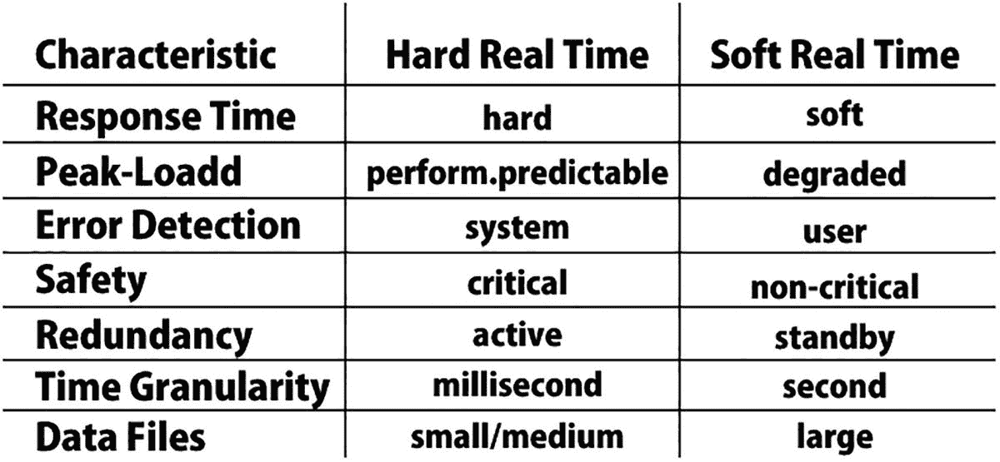
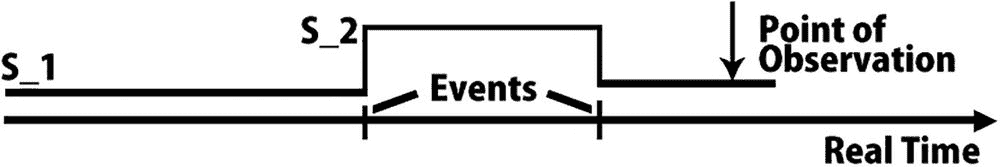

# 9. 实时系统

分布式实时系统（DRTS）由通过实时网络连接在一起的独立计算节点组成。这些节点协同工作，在预定的时间限制内实现共同目标。出于多种原因，需要分布式实时系统。

任何实时计算机控制系统都必须能够实时测量事件之间的时间，并在预定的实时时间间隔内对刺激做出反应。本章讨论了在实时分布式系统中包含此实时度量的一些意义。

术语“实时系统”指的是受实时约束的系统，即必须保证在某个时间限制内做出响应，或者系统必须满足特定的截止时间。示例包括飞行控制系统、实时监控系统等。

## 9.1 理解实时系统

具有时间限制的实时系统被分为硬实时系统或软实时系统。*硬实时系统*不能错过任何截止时间。错过截止时间的后果可能是灾难性的。如果延迟增加，硬实时系统结果的效用会急剧下降，甚至可能变为负值。延迟是指实时系统完成任务与其截止时间相比的延迟程度。硬实时系统的一个例子是飞行控制器系统。

另一方面，*软实时系统*偶尔可以以足够低的概率错过截止时间，使其可以接受。错过截止时间没有负面后果。随着延迟增加，软实时系统结果的效用会迅速降低。电话交换机是软实时系统的一个例子。

## 9.2 实时系统参考模型

该参考模型由三个组成部分来刻画特性：

-   **工作负载模型：**  用于确定系统所支持的应用程序。
-   **资源模型：**  用于描述程序可以访问的资源。
-   **算法：**  它们描述了软件应用程序将如何使用资源。

实时系统术语包括：

-   **作业：** 一个可以分配给处理器的小型任务，它可能需要使用资源，也可能不需要。
-   **任务：** 一组相互关联的作业，它们协同工作以提供系统功能。
-   **作业的释放时间：** 作业准备好执行的时间点。
-   **作业执行时间：** 作业完成执行所需的时间。
-   **作业截止时间：** 作业必须完成的最后期限。截止时间有两种类型：绝对截止时间和相对截止时间。（一个作业的**相对截止时间**是最大允许响应时间。一个作业的**绝对截止时间**是其相对截止时间与其释放时间之和。）
-   **作业响应时间：** 从作业被释放到作业完成所经历的时间。
-   **活动资源：** 处理器的另一种称呼，是成功完成任务所必需的。一个作业需要一个或多个处理器来执行并推进至完成。计算机和传输链路是其中的两个例子。
-   **被动资源：** 在作业执行期间，可能需要也可能不需要的资源。内存和互斥锁是其中的两个例子。也称为资源。如果两个资源可以互换使用，则它们是相同的；否则，它们是异构的。

图 9-1 描述了硬实时系统与软实时系统之间的关键区别。硬实时系统的响应时间要求为毫秒级或更短，如果达不到，可能导致灾难。另一方面，软实时系统的响应时间更长且要求不那么严格。在苛刻的硬实时系统中，必须预期峰值负载性能，并且不得违反规定的截止时间。在软实时系统中，可以接受在极少出现的峰值负载下功能降级。在所有情况下，硬实时系统都必须保持与环境状态的同步。

图 9-1

硬实时系统与软实时系统

### 9.2.1 故障安全系统与故障可运行系统

如果环境中存在一个在系统发生故障时可以到达的良好状态，则该系统被认为是故障安全的。列车信号系统就是一个例子。

在故障安全应用中需要高错误检测覆盖率。应用程序的故障安全性是其一个特性。如果应用程序没有提供安全状态的标识，则系统必须能够故障可运行，例如飞机上的飞行控制系统，这类系统在发生故障时必须保持运行。

### 9.2.2 可保证的及时性系统与尽力而为系统

即使出现故障，计算机系统也必须提供最低限度的服务。

## 9.3 实时系统分类

基于外部需求，考虑以下这些类别：

-   软实时与硬实时
-   故障安全与故障可运行
-   可保证的及时性与尽力而为
-   资源充足性
-   时间触发与事件触发

如果能够通过分析推理（在规定的负载和故障假设内）证明时间准确性，则系统实现可保证确定的及时性。如果无法提出这种关于时间正确性的理性论证，则系统实现是尽力而为的。

即使在规定的负载和故障假设内，对尽力而为系统的时间验证也依赖于概率性考虑。可保证的及时性应是硬实时系统的基础。

### 9.3.1 资源充足性

如果系统要提供可保证的及时性，其处理资源必须能够管理规定的峰值负载和故障场景。过去曾有一些应用认为资源充足性成本过高，令人望而却步。

由于硬件成本正在下降，实施资源充足的设计正变得越来越经济有效。在具有挑战性的实时应用中，资源充足的设计是唯一的选择。

### 9.3.2 罕见事件情况下的可预测性

罕见事件是指在系统生命周期内很少发生的重要事件，例如核反应堆中的管道爆裂。一个罕见事件可能引发一连串相关的服务请求（例如，警报风暴）。

在许多应用中，例如飞行控制系统，系统的价值取决于在罕见事件场景下的可预测性能。在大多数情况下，工作负载测试无法应对罕见事件场景。

### 9.3.3 状态与事件

图 9-2

状态事件

*状态*是实时中持续特定时间长度的一种条件，例如时间轴的一部分。*事件*是指瞬时发生的事件。参见图 9-2。

状态信息描述了观测点（其本身是一个事件）处状态的特性。事件信息提供了事件发生前后瞬间状态特性的变化，以及对事件发生时间点的估计。

### 9.3.4 时间触发系统与事件触发系统

如果实时系统中的控制信号纯粹源自事件的发生，例如任务的完成、消息的接收或外部中断的发生，则称该系统为事件触发系统。

如果控制指标（如消息的发送和接收）纯粹源自（全局）时间概念的演进，则称该实时系统为时间触发系统。

## 9.4 时间要求

对于实时系统，操作员看到的数据片段必须在时间上准确。刺激与反应之间的最大实时差距必须被确定并加以限制。即使是很罕见的情况，时间行为也应该是可预测的。参见图 9-3。

图 9-3

与实时数据相关的时间参数

## 9.5 调度算法分类

### 9.5.1 硬实时与软实时调度

在硬实时系统中，关键任务的截止时间必须在所有可能的方式下，并针对可预见的情况提前得到保证。这需要对系统资源进行仔细设计。如果您正在设计的是软实时系统，则可以接受低成本的调度器设计。

### 9.5.2 动态与静态调度器

如果调度器根据当前请求来做出运行决策，则称其为动态（在线）调度器。因此，动态调度器是灵活的，并能随着系统的演化而自适应。如果在调度器运行之前就已经做出决策，并且这些决策不可更改，则称该调度器为静态（预运行）调度器。这需要对要执行的任务有深入且完整的了解（最大执行时间、优先级、互斥约束、截止时间等）。正因为在执行阶段无需进行决策计算，这类调度器的运行开销很低。

### 9.5.3 可抢占/非可抢占调度器

在可抢占调度器中，一个任务在收到更高优先级任务的请求后可以被中断。然而，只有在某些断言未被违反（参见互斥）时，才允许抢占。在非可抢占调度器中，任务在执行完成前不会被中断。

### 9.5.4 静态调度

在静态调度中，任务的执行顺序是离线计算出来的。静态调度常见于时间触发型应用以及周期性任务中。

### 9.5.5 动态调度

动态调度器根据系统的当前状态，在事件到达时决定执行哪个任务。各种动态调度算法根据其所做的假设而有所不同。

### 9.5.6 独立任务调度

此类别假设任务之间没有任何依赖关系（例如互斥）。

## 9.6 复习题

1.  "分布式实时系统（DRTS）由通过实时网络连接的独立计算节点组成。" 这个说法正确还是错误？

2.  以下哪一项描述的是硬实时系统？
    1.  可以经常性地错过截止时间，可能性较低。
    2.  偶尔会错过截止时间，且有合理的可能性发生这种情况。
    3.  由于某种不可接受的低概率，偶尔会错过截止时间。
    4.  偶尔会错过截止时间，但概率较低。

3.  以下关于*状态*的陈述，哪一项是正确的？
    1.  状态是一种在实时时间内持续一定时间的条件。
    2.  状态是一种持续非实时时间跨度的条件。
    3.  状态是一种不会持续一段时间的条件。
    4.  状态是一种不可预测地变化并持续一段时间的条件。

4.  以下关于*事件*的陈述，哪一项是正确的？
    1.  事件是发生在特定状态下的事情。
    2.  事件是一次性的未发生事件。
    3.  事件是一次性的发生事件。
    4.  以上所有选项。

5.  参考模型由三个部分组成：
    1.  工作负载模型
    2.  资源模型
    3.  算法
    这个说法正确还是错误？

## 9.7 复习题答案

1.  答案：正确。分布式实时系统（DRTS）由通过实时网络连接的独立计算节点组成，并由通过实时网络连接的自洽计算节点构成。此类系统中的节点相互协作，以在规定期限内实现共同目标。

2.  答案：D，偶尔会错过截止时间，但概率较低。

3.  答案：A，*状态*是一种在实时时间内持续一定时间的条件。

4.  答案：C，*事件*是一次性的发生事件。

5.  答案：正确。实时系统模型的主要部分是工作负载模型、资源模型和算法。

## 9.8 总结

本章解释了分布式系统的时间管理。此外，还讨论了软实时系统和硬实时系统，它们阐述了参考模型。为了实现分布式系统，有必要理解这种时间管理系统。调度算法也是分布式系统的一个重要概念，因此下一章将解释分布式系统中的动态和静态调度算法。

