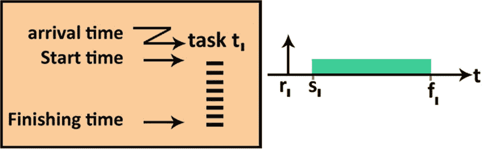
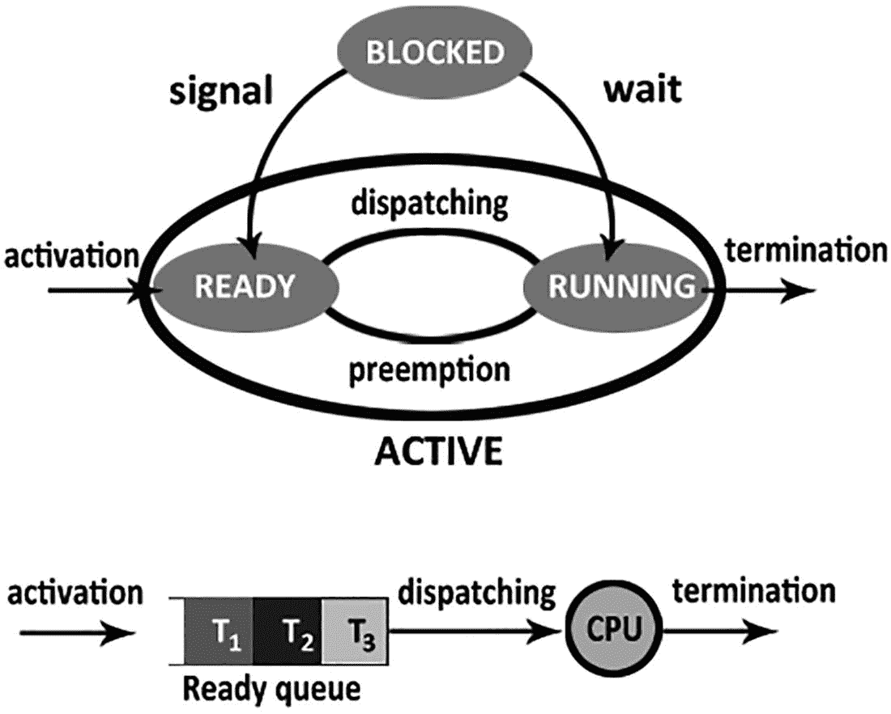
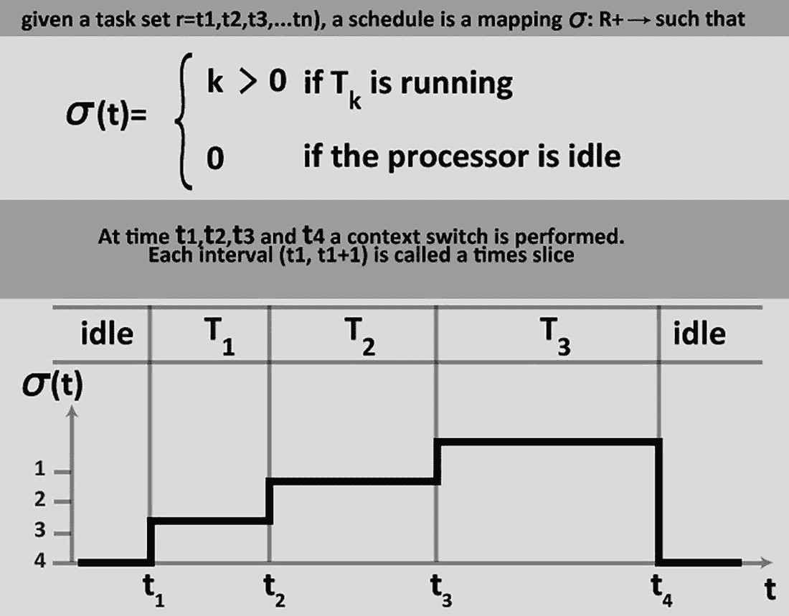
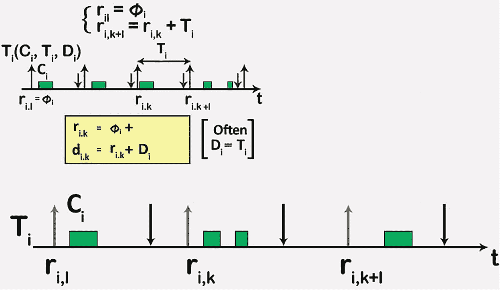
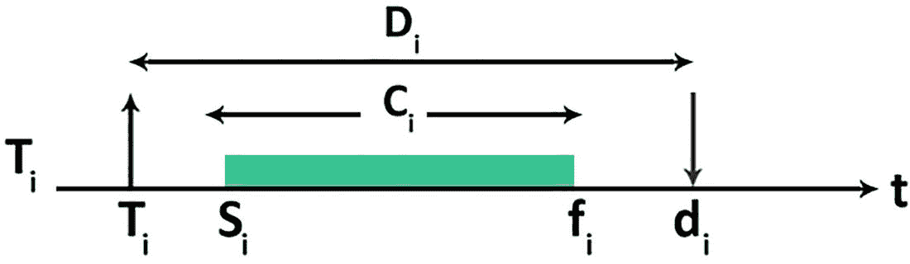
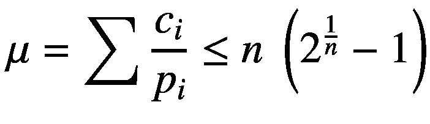
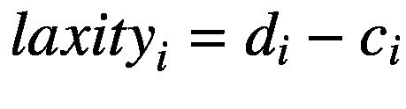

# 10. 实时系统中的调度

任务状态决定了任务在进程中的里程碑。默认状态如下：

-   任务已接收，正在等待被系统接纳。
-   任务已被分配的用户（或系统）接受。由于该任务已被锁定，其他用户和系统无法修改或完成该工作。
-   任务已完成。
-   已为用户分配了该任务。（仅限于人工任务。）
-   任务尝试在激活系统中生成工作单，但未成功。（仅限于激活任务。）

这些条件必须满足且不可更改。为了支持您的业务流程，您可以定义额外的状态（用户自定义状态）。如果一个任务无法按时完成，您可以将其状态设置为`suspended`。

在没有其他操作的情况下，处理器执行一系列指令直至完成。一个任务是一个实例（作业）的序列。

图 10-1 状态切换

就绪的任务保存在一个称为等待列表（`QUEUE`）的队列中。调度算法是一种用于选择在 CPU 上运行的任务的方法。

## 10.1 调度的概念

进程由调度算法组成：

图 10-2 状态转换与就绪队列

-   **可抢占的：** 工作可以短暂暂停，以便完成更关键的任务。
-   **非可抢占的：** 任务不能被中断。调度表是按特定顺序分配给处理器的一组任务列表。一个处理器的进程是已分配给该处理器的一组任务。

对于具有严格实时限制的应用，进程可能需要换出或分页到二级存储器。

当一个操作系统同时运行多个程序时，它就被称为*多任务*系统。区分作为“指令容器”的程序和作为“进行中”实体的程序非常重要。正在运行的程序称为进程（或任务）。

因此，虽然*程序*是描述要执行的操作的静态实体，但*进程*是代表这些操作执行的动态实体。操作系统采用来“并行”执行多个进程（并发进程）的机制称为*时间片轮转*。

它包括为每个进程分配一个称为`time-slice`的 CPU 时间片。当该时间到期时，该进程的执行被挂起，CPU 分配给另一个进程。这种技术称为*抢占式多任务*。

多任务系统最重要的问题是各种进程所需资源的分配。事实上，可能会发生多个进程同时请求一个特定的、无法共享的单一资源（例如打印机）。在这种情况下，请求资源的进程会立即被挂起，并放入等待队列。只有当资源被释放且队列中没有其他进程排在其前面时，它才能获取该资源并继续执行。

另一个问题涉及对外设的访问。由于设备的 I/O 操作相对于处理器速度来说极其缓慢，进程对 I/O 操作的请求会导致该进程挂起，直到操作完成（所涉及的硬件机制显然是中断）。

一个进程可以处于以下三种状态之一：

-   运行态：该进程拥有 CPU 并且正在运行（就绪态）。
-   挂起态：该进程因时间片到期而被挂起。
-   阻塞态：该进程因需要某个尚不可用的资源或正在等待 I/O 而无法继续执行。

管理就绪任务是通过一组队列来实现的，每个队列都有定义的优先级。每个进程都被分配一个优先级，这样当进程进入就绪状态时，它就会被放入具有相应优先级的队列中。

正在运行的进程是最高优先级队列中的第一个。如果该队列中没有等待的任务，则执行下一个优先级队列中的第一个任务，以此类推。

## 10.2 约束类型

转移限制（transition restriction）可防止数据因先前状态而进入不可能的状态。例如，一个人不应能从“已婚”状态切换到“未婚，从未结婚”状态。在“已婚”之后，唯一允许的状态是“离异”、“丧偶”或“死亡”。

图 10-3

任务处理器

转移约束（transitional constraint）是一种特性，它支配着信息安全形式模型中，从模型的一个状态到其后继状态的每一次合法转移。它可以被视为状态标准的补充，状态标准适用于整个状态，但对状态之间的转移没有影响。

一旦其目标地址已写入辅助存储器，且它不在等待特定任务，则该进程即可执行且可切换。如果一个进程正在等待某个任务，它将被置入睡眠状态，其整个地址空间将被写入辅助存储器。

关于约束，请注意以下几点：

图 10-5

任务激活

图 10-4

实时任务

- 类型包括抖动、触发、完备性和截止期限。
- 它们可以是显式的（包含在系统活动规范中）或隐式的（不包含在系统活动规范中）。
- 它们对资源的执行限制施加了逻辑顺序。
- 它们确保对互斥资源的访问是同步的。

### 10.2.1 独立任务调度约束

此类别假设任务之间没有任何依赖关系（例如互斥）。

*速率单调算法*是一种基于静态优先级进行抢占的动态算法，其假设如下：

1.  属于特定任务集的所有任务的请求（该任务集具有硬实时约束）都是周期性的。
2.  所有任务都是独立的（不存在互斥或依赖关系）。
3.  每个任务（`Ti`）的到期时间与其周期（`pi`）的持续时间一致。
4.  你预先知道每个任务的最大计算时间。
5.  上下文切换时间忽略不计。
6.  `n` 个任务的利用率因子之和的上限为：

其中：

`c[i]` = 第 i*个*任务的计算时间

`p[i]` = 第 i*个*任务的周期持续时间

该算法静态地分配优先级，并基于任务周期的持续时间。周期较短的任务将具有较高优先级，而周期较长的任务优先级较低。因此，在执行阶段，每次都会选择周期最短的任务。

对于*最早截止期限优先算法*，会选择到期时间最早的算法。对于*最小松驰度算法*，任务的优先级是基于截止期限与任务所需计算时间之间的差值来计算的。这个值越低，任务的优先级就越高。

### 10.2.2 调度依赖任务

在此类别中（更接近现实，因此也更有趣），我们假设任务之间存在依赖关系（例如互斥）。

由 Mok [2] 提出的*内核化监视器算法*，为不可中断的时间 `q` 分配处理器，并假设临界区可以在该时间限制内执行。调度时采用最早截止期限优先策略。

此协议中的调度分析需要为任务中出现的所有临界区的执行时间设定上限。实际上，这个量必须根据最长可执行临界区进行校准。由于这些上限可能过于悲观，使用内核化监视器协议可能会导致处理器利用率较低。

*优先级天花板协议*用于调度一组周期性任务，这些任务对受信号量保护的一个或多个公共资源具有排他性访问权。

该协议由 Sha、Rajkmar 和 Lehocky 于 1990 年创建，用于解决*优先级反转*问题。当高优先级任务必须等待另一个高优先级任务执行时，就会发生此问题，这通常是由于运行的任务正在使用其他资源。

如果有三个任务（`T1`、`T2` 和 `T3`），优先级为 `p1 > p2 > p3`，三者都使用资源 `R`，并且采用速率单调类型的调度算法。

假设 `T1` 和 `T3` 都需要访问与互斥锁 `S` 相关联的资源。

如果 `T3` 在 `T1` 开始之前开始处理并锁定（`S`），那么 `T1` 将被锁定一段不确定的时间，也就是说，直到 `T3` 执行解锁（`S`）释放资源 `S` 为止。事实上，如果没有 `T3` 持有的资源 `S`，`T1` 就无法继续执行。在这种情况下，尽管优先级顺序为 `p1 > p3`，但 `T1` 会因其而被 `T3` 所阻碍。

如果在 `T3` 解锁（`S`）之前，`T2` 开始运行，那么 `T3` 将被挂起，以便 `T2` 能够根据优先级 `p2 > p3` 被处理。在这种情况下，`T1` 将不得不等待 `T2` 停止处理。实际上，尽管优先级顺序为 `p1 > p2`，但 `T1` 被 `T3` 阻塞，而 `T3` 又反过来被 `T2` 阻塞。

所提出的算法基于以下几点：

- 仅当任务的优先级高于当前锁定资源的任务时，才允许该任务进入临界区。
- 当其使用完临界区后，它会释放临界区，并将优先级恢复为先前的状态。

## 10.3 复习题与答案

请尝试回答这些复习题以检验知识掌握情况。

### 10.3.1 复习题

1.  “一个任务是一组事件。”这个说法正确还是错误？

2.  什么是调度？
    1.  预防性：当前任务可以被暂停以便完成一个更重要的任务。
    2.  预防性：正在运行的任务可以被短暂暂停以便完成一个更关键的任务。
    3.  抢占式：当前正在执行的进程可以被用来临时执行另一个任务。
    4.  预防性：正在进行中的任务可以被短暂暂停以完成一个不那么关键的任务。

3.  下列关于任务的陈述，哪一个是正确的？
    1.  取决于操作系统，一个任务可以是一个进程或一个线程。
    2.  作业必须是一个程序或一个线程，具体取决于操作系统。
    3.  一个任务可能是一个进程或一个线程，具体取决于版本。
    4.  以上都不对。

4.  下列关于事件的陈述，哪些是正确的？
    1.  如果当前任务在完成之前不能被暂停，那么它就是非抢占式的。调度表是已分配给处理器的一系列任务。
    2.  非抢占式不是指正在进行的工作是否可以暂停直至完成。调度表是已分配给处理器的一系列任务。
    3.  非抢占式是指当前任务在完成之前不能被暂停。时间表是分配给特定事件的一组职责。
    4.  以上所有陈述都是正确的。

5.  “在没有其他活动的情况下，一个任务是由处理器持续执行的一组指令。”这个说法正确吗？

### 10.3.2 答案

1.  答案：错误，任务是多个事件组成的序列。
2.  答案：B，抢占式调度是指可以短暂暂停正在运行的任务，以便完成更关键的任务。
3.  答案：C，根据版本不同，任务可能是一个进程或一个线程。
4.  答案：A，如果当前任务在完成前无法被暂停，则为非抢占式。调度表是已分配给处理器的任务列表。
5.  答案：错误，任务是指处理器在没有其他操作干扰下执行直至完成的一组指令。

## 10.4 本章小结

本章解释了实时系统中的调度工作原理。当多个具有相同请求和时间约束的进程需要被调度策略高效服务时，就会产生同构进程调度问题。例如，在必须支持固定数量视频显示的视频服务器中就会出现这种情况，这些视频都具有相同的帧率、视频分辨率、数据传输频率等特征。

在这种情况下，一种简单有效的调度策略是轮转调度。实际上，所有进程同等重要，它们拥有相同的工作量，并在处理完当前帧后结束。调度算法可以通过添加定时机制进行优化，以确保每个进程以正确的频率运行。这种简单的先例模型在实践中很少出现。更现实的模型需要考虑多个进程竞争 CPU 使用的情况，每个进程都有自己的工作负载和截止时间。

下一章将聚焦建模，并讨论基于模型的工程如何助力分布式系统。对于分布式系统的实际实现，模型引导的工程是一个重要概念。

