# 11. 基于模型的工程

基于模型的工程是一种应用开发技术，它优先创建与特定领域概念更紧密相关的模型或抽象，而非计算或算法原理。该技术通过优化系统兼容性来提高生产力，简化设计流程，并促进个人与团队之间围绕系统的沟通与协作。

模型使技术人员和非技术人员能够拥有相同的愿景和理解，并促进和鼓励他们之间的互动。模型还有助于项目规划，通过提供对即将构建系统的更清晰视图，并允许基于客观标准进行项目管理。

## 11.1 面向区块链的模型驱动方法

近年来，区块链的概念在实践和研究中获得了极大关注，因为它为分散环境中涉及多方必须安全共享数据和协作的匿名性和问责制问题提供了实用的解决方案。然而，业务核心网络和配置对成功使用区块链技术的影响至今仍很大程度上未知。本书提供了一种模型驱动方法，通过结合本体论和分层模型，捕捉当前区块链驱动业务网络的特征。

这些层次有助于详细描述此类网络。书中还引入了区块链业务网络本体（`BBO`），它将区块链网络各组件的概念和特征形式化。我通过评估并将其应用于一个真实的区块链用例，论证了这项工作的实用性。

要开发区块链业务模型，你需要具备`模型驱动工程`的方法。

## 11.2 模型驱动开发

通过汇集具有不同抽象程度的各种视角，基于模型的方法有助于理解一个系统。“客户能够构建一个包含系统特征和特性的模型，然后可以在此上下文中使用该模型完全重建系统。”遵循模型驱动架构或设计，有助于以多种方式理解和描述一个系统。^(⁷)

-   各部分之间的联系及其描述，有助于对系统的广泛了解，同时也有助于开发可扩展的解决方案，因为模型是建立在明确定义的命名法和分类法之上的。
-   为了简化系统的开发，可以使用一个架构框架来混合和修改多个模型及解释层。
-   自动化可用于一组形式化的元模型，这些元模型随后可以被合并并转化为具有更详细信息的模型。
-   技术标准是扩大基于模型的工作的可接受性和实施的必要基础。

### 11.2.1 区块链分层模型

创建专门针对更大系统的不同方面的各种模型，有助于形成对该系统或现象的透彻理解。“可以使用这些模型来审视不同的抽象层次，然后可以将它们相互叠加，或者将其信息传递到其他层次，以便理解一个概念的全部范围。”¹

因此，我们定义了三个基本层次（见图 11-1），以便更合理、更全面地描述区块链驱动的网络。这些层次涵盖了从商业模式视角到基于代码的视角的所有内容。所有这些层次都至关重要，因为我们预期区块链技术将对每个层次产生独特的影响。

由于这些层次是相互关联的，技术实现会影响网络构成，进而影响商业模式。图 11-1 是分层区块链的一个示例。

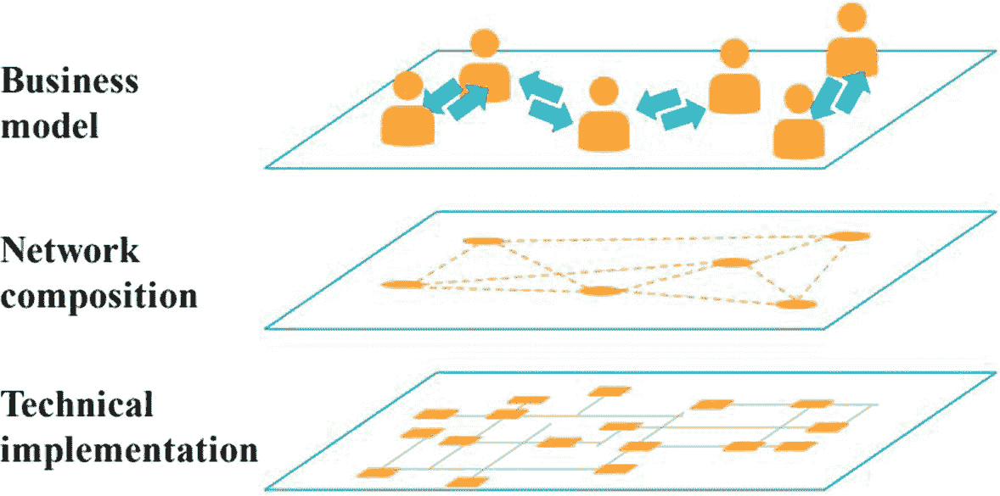

**图 11-1** 区块链层次

为了创建一种用于定义区块链交易和区块层次的模型驱动方法，你将看到如何借助模型和元模型在这些基础上进行构建。

### 11.2.2 模型与元模型

本节介绍支撑 `MDE` 的基本概念，如`系统`、`模型`、`元模型`及其相互关系。

在 `MDE` 的语境中，`系统`被定义为“一个通用概念，用于指代软件应用、软件平台或其他软件制品。”^(⁸) 一个`系统`也可以由多个子`系统`构成，如图 11-2 所示，并且它可以与其他`系统`交互。（`系统`可以与其他`系统`交互。）

`模型`是对现实世界现象的抽象：`元模型`是进一步的抽象，它突出显示`模型`本身的属性。`模型`遵循其`元模型`，就像计算机程序遵循其编写所用的编程语言的语法一样。

使用`元模型`的领域：

-   需要交换或存储的语义数据的模式
-   支持特定方法或流程的语言
-   用于向现有信息表达额外语义的语言

以下各节将详细介绍`模型`和`元模型`。

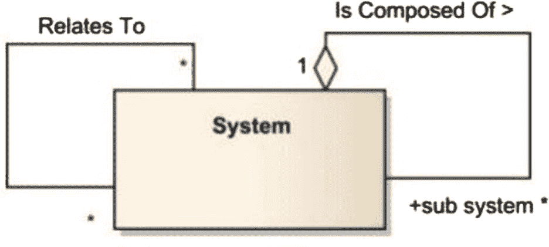

**图 11-2** `系统`定义

### 11.2.3 模型

`模型`描述了一个可能存在于今日或未来，也可能并不存在的`系统`。它是一个被视为有效范例或原型、值得效仿的参考术语。

`模型`之所以值得考虑，是因为它包含以下细节：

-   `模型`可以是关于所研究设备/`系统`的一系列断言的集合。
-   `模型`是为特定目标而构建的`系统`的最简化版本，并且应能够代替实际`系统`来回答问题。
-   `模型`是为特定目标而构建的`系统`的简化版本，并且能够为真实程序解答问题。

另一方面，`模型`本身也是一个`系统`，拥有自身的标识、复杂性、组成元素、连接关系等。

特别是，在考虑一个“`模型`的`模型`”时，你必须牢记，其中一个是另一个`模型`的`模型`，因此它本身也是一个`系统`。总而言之，“`模型`”是一个有助于描述和研究中的`系统`并提供答案，而无需直接观察该`系统`的`系统`，如图 11-3 所示。

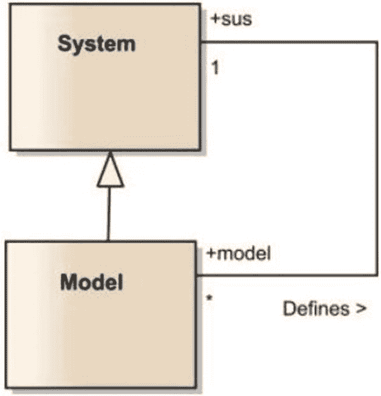

图 11-3 – `模型`与`系统`之间的关系

`模型`与`系统`之间也存在关系。借助`模型`，你可以设计一个`系统`。通过观察`模型`，你可以理解`系统`的工作原理。另一方面，你可以基于`系统`架构创建多个`模型`。这就是为什么可以说`模型`是`系统`的简化版本，并且是为特定目标而构建的。¹

### 11.2.4 元模型

`元模型`是一种基于先前研究来规定建模语言架构的`模型`。然而，必须从图 11-4 中理解以下事实。

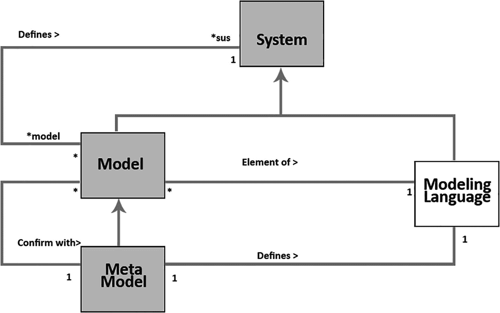

图 11-4 – `元模型`与`模型`之间的关系

我们可以说，建模语言将是一组`模型`的集合，这是由“`模型`”与“建模语言”之间的“属于”关系定义的（或者说，`模型`是建模语言的一个元素）。

我们也可以说，这种方法从其规则来源于对`模型`概念与`元模型`概念的区分。

一个 `UML` 模型是一种表示法，它从特定视角并在特定约束下，捕捉了你想要建模的一切事物的关键方面。`模型`以图表（`UML` 图）的形式构建，而图表是图形化表达手段。`模型`由三个基本部分组成：

-   **分类器：** 它们描述一组对象。对象是一个具有状态并与其他对象存在关系的独立实体。
-   **事件：** 它们描述一组可能的 occurence。Occurrence 是系统内发生并产生后果的事情。
-   **行为：** 它们描述一组可能的执行过程。执行代表根据一组规则完成某个算法。⁹

另一方面，`UML` 图包含表示`模型`元素的图形元素。例如，在一个包图中定义的两个关联类，是两种类型的分类器，由两个矩形符号和一条表示关联符号的连线来表示。

## 11.3 构建元模型与模型

如何构建第一个`元模型`是一个众所周知的、反复出现的元模型问题。`OMG` 官方规范通过按包分解架构来描述 `UML` 的语义。在每个包内，`模型`元素以半形式化的方式通过以下术语定义：

-   **抽象语法：** 通过使用 `UML` 符号表达的类图来呈现 `UML` `元模型`、其概念（即元类）、关系以及约束。此外，还附加了用自然语言（英语）编写的文本部分。
-   **内涵：** 以自然语言提供，包括对构成 `UML` `元模型`的元素及其关系的描述。
-   **形成规则：** 用于定义有效`模型`的规则和约束。这些规则和约束既使用形式化语言 `OCL`，也使用自然语言进行表达。

`UML` `元模型`的复杂性通过将其组织成三个包来管理：基础包、行为元素包和模型管理包。前两个包进一步分解为子包，每个子包包含语义相关的元素。以下是每个包的简要描述：

-   **行为元素：** 此包规定了定义`模型`动态行为所需的结构。它由五个子包组成。
-   **基础：** 此包代表了规定静态建模结构的语言基础设施。它分为三个子包。
-   **模型管理：** 此包定义了`模型`、包和子系统等，用于组织不同的`模型`，并将具有共同特征的元素分组。

## 11.4 建模语言的类别

根据专业人士的观点，定义建模语言还有其他一些方式。他们认为建模语言可以分为两种类型：通用型和领域特定型。二者的区别在于通用型拥有更多通用构件的数量，这使其更容易应用于各种领域。

由于 `UML` 和 `SysML` 提供了全面且丰富的结构和标记，用于定义和解释基于面向对象范式的软件应用，或系统工程学科所定义的任何类型的系统，因此它们是通用型和领域特定型的常见实例。¹

另一方面，`DSL` 通常使用更少的、与应用程序领域更直接相关的结构或概念。因为 `DSL` 使用领域概念进行定义，所以通常更易于理解、掌握、验证和交互，从而促进了开发人员与领域专家之间的协作。有人认为 `DSL` 可以提高生产力、可靠性、信赖性和可移植性。¹

然而，采用 `DSL` 也存在缺点，例如学习、创建和维护一种现代语言及其配套使用所需的生成工具的成本。

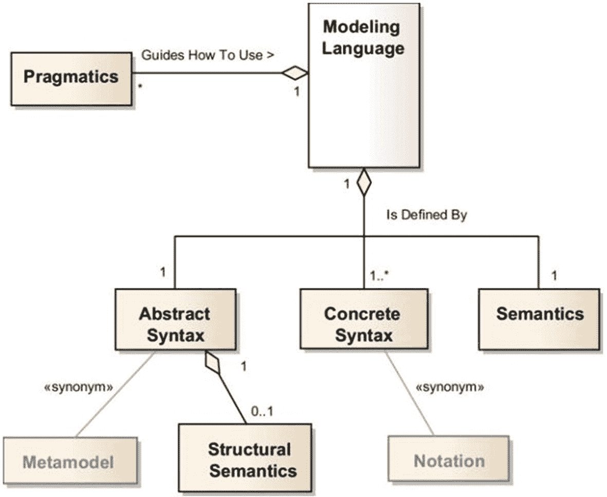

图 11-5 – 建模语言

另一些人则认为，由于当今语言工作台的高质量和复杂性，工具支持已不再是重大障碍。

此外，研究结果表明，软件语言工程师甚至不会评估他们自己的原生语言，这意味着在软件语言过程领域，特别是在设计、实现和评估的开发方面，需要进行更多研究。¹

如图 11-6 所示，建模语言可以根据其软件架构属性进行分类，并可以通过一个或多个视图进行组织。

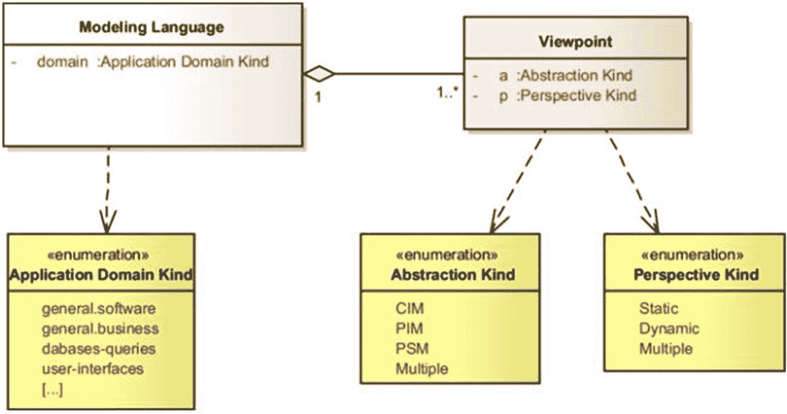

图 11-6 – 对建模语言及其相关视角进行分类

## 11.5 为信息物理系统设计元模型

信息物理系统是监控和调节物理环境，同时协助人类履行职责的复杂系统。`CPS` 是结合了软件和硬件的网络化混合系统。当程序员、工程师和科学家协作构建和实现此类系统时，他们会遇到种种障碍。来自多个领域的专家必须理解该系统才能进行协作，无论他们身处哪个领域。

我们提出了一个信息物理系统`元模型`和一种教育研究方法，程序员、工程师和科学家可以使用、重用和修改该方法，用于信息物理系统的新应用。数据科学家和程序员利用这个`元模型`来构建一个能够提供跨领域可理解的 `M1` `系统模型`的信息物理系统。该`元模型`既包含了智能物，也包含了人，这两者通常出现在任何信息物理系统的设计中。它采用复合架构，支持创建包含诸如叶子节点等智能元素的信息物理系统。

## 11.6 CPS 元模型示例

考虑以下示例：

- **交通运输**：用于空中交通管制和运输管理的系统。
- **健康医疗**：医疗设备、健康监测系统、远程机器人手术系统。
- **制造业**：汽车、飞机、工厂自动化系统、化工过程跟踪、自主机器人空间以及工业网络等都是工业网络的例子。
- **环境**：农业、环境和地质系统都是环境科学系统的例子。
- **航空航天**：太空探索系统。
- **建筑**：日常生活中的辅助生活和智能场所。
- **公共环境**：智能供水网络和应急管理。
- **信息物理公共系统**：这些 `CPS` 还会考虑人类理解力、技术能力以及社会文化因素。

下一节将介绍`元对象设施`，并以一个用于信息物理系统的`基础元模型`作为支撑。

### 11.6.1 元对象设施

`元对象设施`是对象管理组用于模型驱动工程的一个标准。它源于 `UML` 语言；对象管理组需要一个元建模架构来定义 `UML`^(¹⁰)。它使用对象建模方法来定义任何形式的元数据。尽管它通常与 `UML` 相关联，但它独立于 `UML`。为了指定任何类型的元数据，`MOF` 使用对象建模技术。尽管有时会与 `UML` 混淆，但它们并非同一事物。

我们使用 `UML` 的构造型机制来创建和扩展 `CPS` `元模型`上的智能对象。`M1` 定义的类可以利用这个`元模型`作为基础进行扩展和重用。这些类代表了一个`系统`。`M1` 上应用程序的顶层设计被称为顶层设计。

一个`系统的系统` 是一个由有限个独立且可运行的组成`系统`组合而成的`系统`，这些组成`系统`为了达成更高目标而在一段时间内通过网络连接在一起。一个 `SoS` 集成了多个 `CS`。

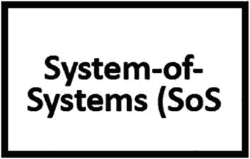

图 11-7

建模语言的分类及其伴随的视角

一个`组成系统` 包括一个计算机网络（网络`系统`）、一个受控对象（物理`系统`），以及可能的人机交互。一个 `SoS` 可以是：

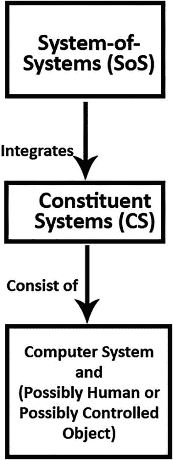

图 11-9

一个 `SoS`

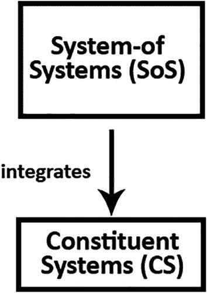

图 11-8

一个 `SoS` 集成一个 `CS`

- **定向 `SoS`**：一个具有集中化目标并拥有所有 `CS` 所有权的 `SoS`。一个无人火箭中的控制系统集合就是一个例子。
- **已识别 `SoS`**：`CS` 为独立拥有，但所有者之间达成合作协议以实现共同目标。
- **协作 `SoS`**：独立 `CS` 之间的自愿交互，目标是实现有利于单个 `CS` 的目标。
- **虚拟 `SoS`**：核心目标缺失且缺乏集中统一指挥。

每个 `CS` 都有一个接口，基于该接口的服务对其他 `CS` 可用，例如可靠接口，它作为一个 `CS` 的接口，通过该接口，`CS` 的服务对其他 `CS` 可用。`RUI` 由以下部分组成：

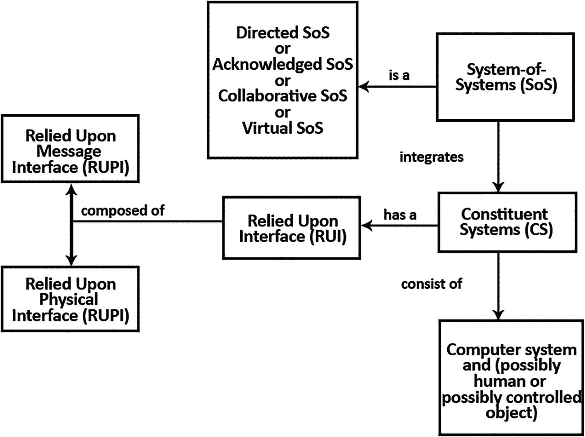

图 11-11

`RUMI` 和 `RUPI`

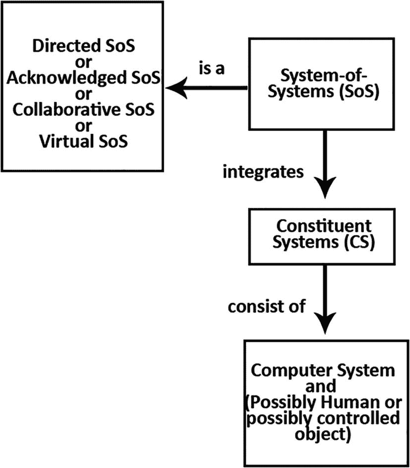

图 11-10

`SOS` 和 `CS`

- 可靠消息接口
- 可靠物理接口

## 11.7 复习题

1.  “模型驱动工程是一种软件开发方法，它强调创建比计算或代数概念更接近特定领域概念的模型或抽象。” 此陈述正确还是错误？

2.  建模语言由以下哪项确定？
    1.  由与所讨论的`元模型`相对应的所有可能`模型`的集合确定，该集合被称为`元模型`。
    2.  由一个`元模型`确定，该`元模型`是遵循所讨论的`元模型`的一组`模型`。
    3.  由`元模型`确定，该`元模型`是遵循特定元状态的所有可行`模型`的集合。
    4.  以上都不是。

3.  对于*事件*，以下哪项陈述是正确的？
    1.  虚拟 `SoS` 的特点是缺乏核心目标和集中统一指挥。
    2.  虚拟 `SoS` 缺乏目标和集中统一指挥。
    3.  虚拟 `SoS` 的特点是缺乏重点和统一指挥。
    4.  以上所有。

4.  “`元模型`包括 `UML` 和`公共仓库元模型`。” 此陈述正确还是错误？

## 11.8 复习题答案

1.  答案：正确。模型驱动工程是一种软件开发方法，它侧重于构建比计算或代数概念更紧密地与特定领域概念相关联的`模型`或抽象。

2.  答案：A。与所讨论的`元模型`相对应的所有可能`模型`的集合被称为`元模型`。

3.  答案：A。虚拟 `SoS` 的特点是缺乏核心目标和集中统一指挥。

4.  答案：正确。`UML` 和`公共仓库元模型`是`元模型`的例子。

## 11.9 总结

自从人类开始使用计算机以来，研究人员就一直致力于提高抽象层次。模型驱动工程（`MDE`）是这一趋势的自然延续，也是一种很有前景的方法，用于应对平台复杂性以及第三代语言无法减轻这种复杂性并有效表达主导概念的困境。

模型驱动工程（`MDE`）处于层次结构的顶端，因此抽象程度最高。它被公认为一种软件工程范式，不仅将`模型`视为辅助文档，更视其为任何工程学科和应用领域开发的核心焦点。模型驱动开发（`MDD`）在层次结构中略低于 `MDE`。该方法侧重于分析、设计、实现和需求等学科。

具体的 `MDD` 方法倾向于定义建模语言，以在不同抽象层次上描述所研究的`系统`。基于模型的测试（`MBT`）侧重于测试学科的自动化。测试`模型`用于表示所研究`系统`的预期行为。模型驱动架构（`MDA`）是由 `OMG` 提出的一种方法，主要侧重于`模型`的定义及其转换。

要创建有效的区块链应用，必须首先对`系统`进行建模。在建模`系统`时，必须包含前面提到的技术。当你在分布式`系统`中应用区块链技术时，作为分布式`系统`建模的一部分，你还需要对区块链层进行建模，以便清晰地了解`系统`架构和`系统`之`系统`（`SoS`）功能。所有这些`模型`都可以借助 `BLOCKLY 4SOS` 建模技术来完成。

作为模型驱动工程的一部分，你需要考虑使用 `BLOCKLY 4SOS` 来对 `SoS` `系统`进行建模。下一章将解释 `BLOCKLY 4SOS`。

脚注 1 2 3 4