# 12. BLOCKLY 4SOS

`BLOCKLY` 是一个库，允许你制作积木式编程应用。即使用户并不真正了解编程语言，积木式编程也能让他们使用图形块来构建脚本和程序。在拖拽式编辑器中，`BLOCKLY` 包含了定义和渲染积木所需的一切。每个积木代表一行可以轻松堆叠并转换为代码的代码。它可用于让用户自定义应用的各个元素并为其添加操作。

## 12.1 SoS 建模

在使用该工具时，它会生成一个名为 `ex-abundant` 积木的标准 `SoS-block` 来进行说明。左侧的工具箱包含了构建 `SoS` 设计所需的所有积木。这个概念模型将帮助 `SoS` 设计者。此外，`BLOCKLY` 中每个导出的积木都关联着一个视角积木，因此所有与通信视角相关的积木都可以在工具包的“通信”类别下找到。

用户必须点击并拖拽浮动面板或工具箱中的积木，才能在 `BLOCKLY` 中生成新的积木。一个针对 `BLOCKLY` 的 API 被设计出来，旨在提高易用性和准确性。`Field Dropdown()` 提供了一个合适的积木列表，这些积木可以链接到特定的积木，从而方便用户构建积木。

在添加“技术”积木后，该工具会显示如何添加其他合适的积木：故障预测、故障预防、故障消除和故障容错。“技术”积木是配置文件中的一个抽象积木，而上述四个积木都继承自它。

一个积木可以具有三个阶段，如下所示：

*   压缩视图
*   部分压缩视图
*   未压缩视图

通过减少屏幕上的积木数量，压缩显示使用户能够看到当前正在编辑的积木（见图 12-1）。由于部分折叠的积木只显示一个积木的非空特征，因此用户可以选择仅查看已声明的属性。使用“完整视图/未压缩视图”来查看积木的所有属性。用户可以通过双击积木在这三种视图之间切换。参见图 12-2。

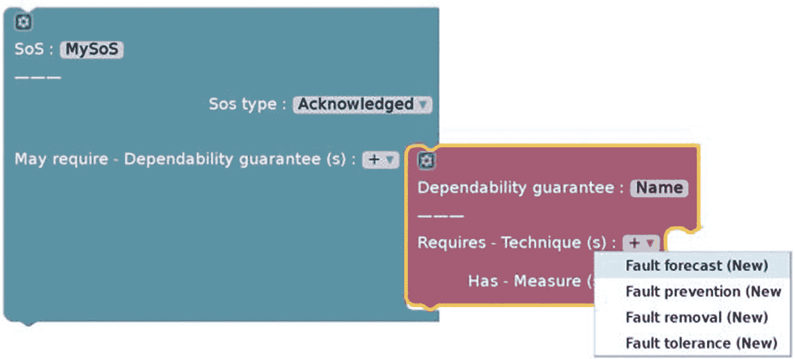

图 12-2 用户可以使用下拉菜单添加积木

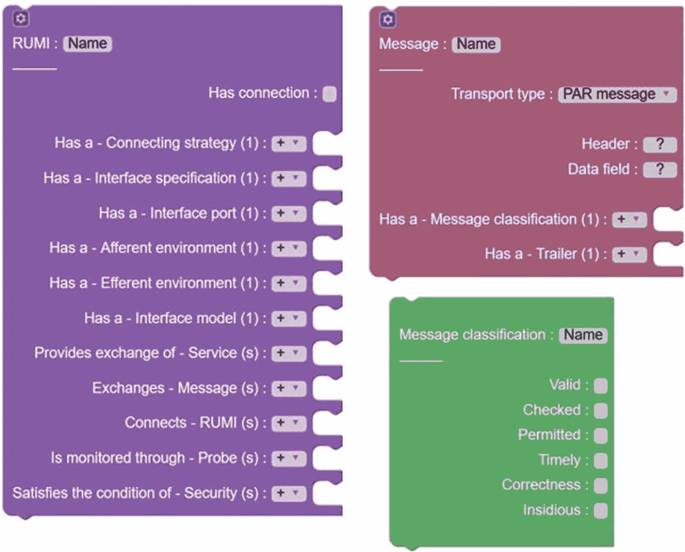

图 12-1 导入到 `BLOCKLY` 的 SysML

此外，如图 12-3 和 12-4 所示，与选定构建积木相关联的属性可以对每个积木进行显示。这是通过在每个积木的左上角放置一个变异按钮来实现的。

支持设施使用一个名为 `Type-Indicator 5` 的免费开源插件来创建直观的建模环境。该插件会高亮显示所有与当前正在移动的积木（`block cs4`）兼容的积木（以黄色显示）。

在 `SoS` 项目中，必须检查和管理需求的可追溯性，因此需求管理至关重要。可以根据视角和构建组件（例如架构、通信和可靠性）来分解需求。

因此，由于每个构建积木满足其所实现的需求集合，并且每个需求构建积木控制着维持它的构建积木集合，所以实现了完整的可追溯性。为了使设计更清晰，`BLOCKLY` 允许你向积木添加注释。

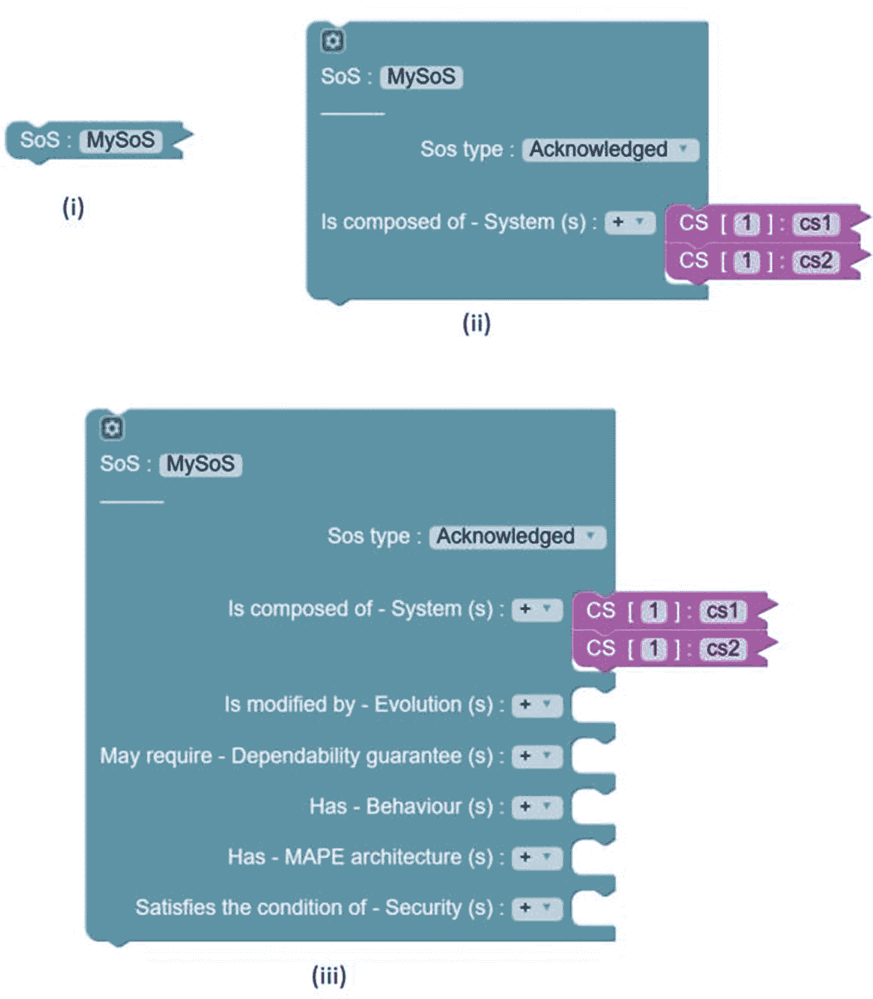

图 12-3 一个积木可以通过三种方式查看：折叠、部分折叠和未折叠

约束使用的一个示例显示在图 12-4 中。约束可用于寻找那些可能容易导致 `SoS` 出现涌现阶段的异常转折。你可以通过对模型进行适当的查询来获取这些情况。在处理大型模型时，查看整个 `SoS` 可能很困难，因此需要使用专门的视图。

`BLOCKLY` 不使用线条来显示积木之间的连接，而是使用折叠方法来隐藏 `SoS` 模型的复杂性。模型查询用于寻找满足一组条件的积木。

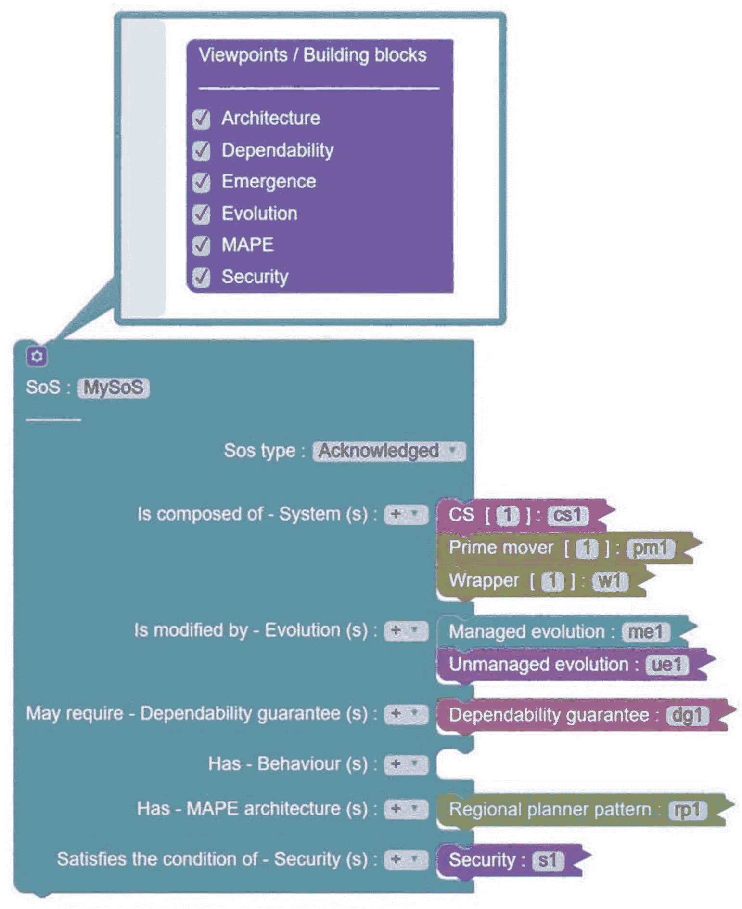

图 12-4 块的构建模块可被激活或禁用

它也可以用于从常规视角查看模型（例如，通过线条展示块与其他块之间的关系）。

若要查询某个模型，用户可右键点击工作区并选择 `显示查询图`。在查询图中，用户可以创建过滤器来查询模型。^(11)

例如，返回 `true` 表示无需过滤（即显示图 12-5 中所描绘模型的所有块）。此查询将生成图 12-5 中的图表，该图表使用以下过滤器高亮显示了所有类型为 `RUMI` 的块：

```
return b. of type == RUMI
```

模型查询有助于可视化自定义的 SoS 视图，并能帮助发现设计问题。

向块添加新连接是一个简单的过程。使用与现有块的连接是构建 SoS 的一种方法。创建连接/链接可以让你重用现有的块，但这与将块复制粘贴到 `BLOCKLY` 不同。被连接的块通过链接进行引用。例如，在工作区上，可以形成 CS，并且只有连接可以加入到 SoS 块中，如图 12-5 所示。

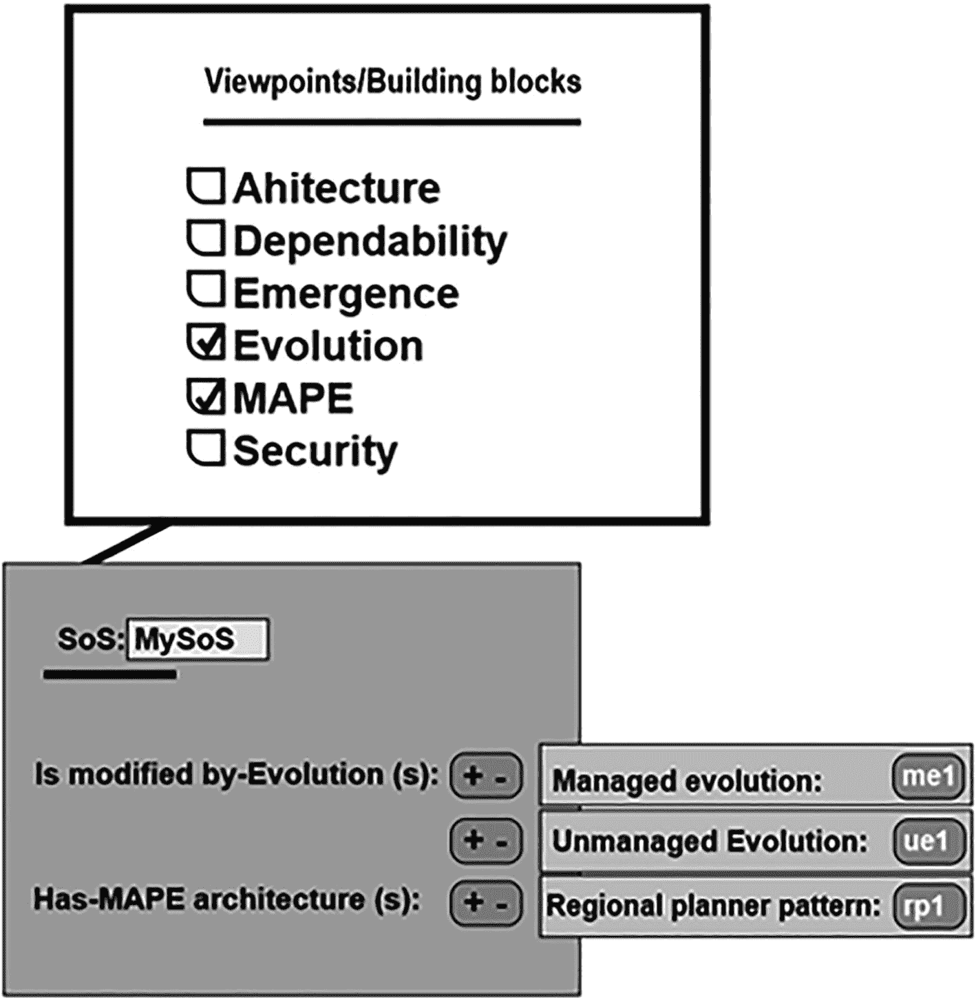

图 12-5 SoS 的过滤视图

模块化的 SoS 分组通过允许将合适的块组合在一起，实现了设计的模块化。例如，如图 12-6 所示，所有 CS 可以聚类在一起。分组块有助于将模型划分为有用的组。

每当提及某个组的块时，组名也会被包含在内，以将其与具有相似标题的其他块区分开来。

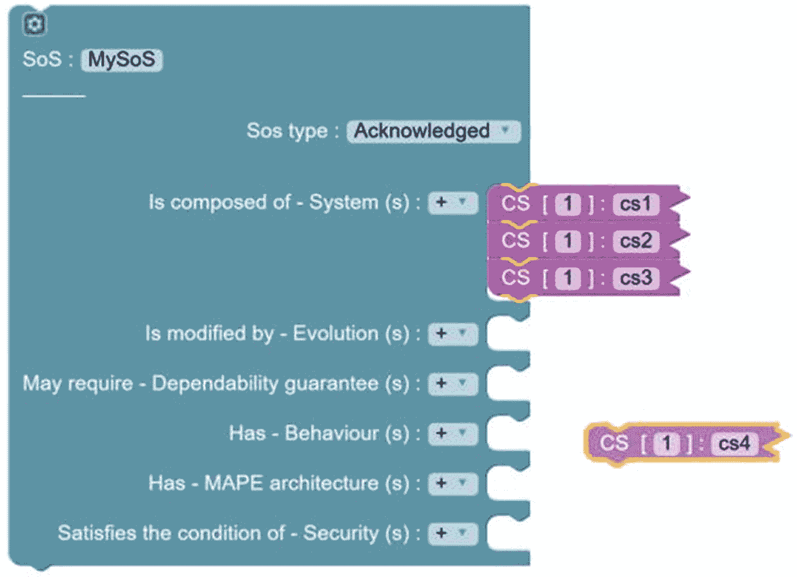

图 12-6 类型指示器 cs4 插件以黄色显示

## 12.2 SoS 行为仿真环境

在创建静态模型后，可以向任何块引入行为。用户可以通过右键点击受影响的块并选择 `添加行为` 来添加行为。可以使用 Python 编程语言编写行为，这代表了将在仿真过程中执行的代码（如图 12-7 所示）。

`init`、`start` 和 `run` 函数的标题可以指定，它们分别在上电启动时、块启动时和仿真执行时执行。服务块的 `run` 函数具有特定的含义，并作为 TCP-IP 服务器呈现。^([1])

在代码生成期间，为所有块创建的所有行为代码会合并到单个文件中。XML 和代码生成 模型可以在导入后，通过点击工具右上角的相应按钮，生成为 XML 和用于仿真的代码。^([1])

以下格式用于为所有块生成唯一的对象名称：

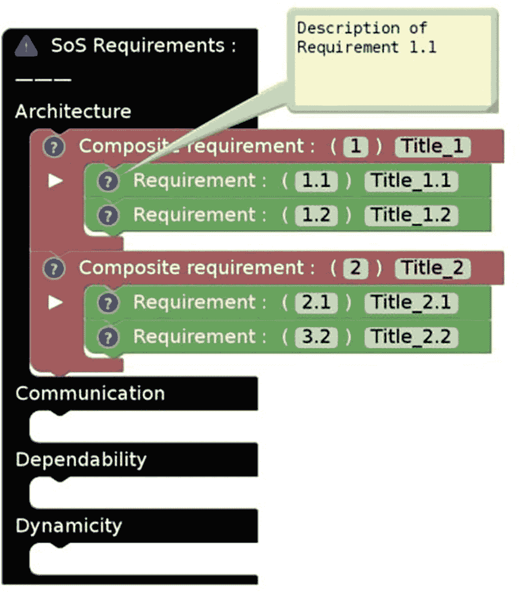

图 12-7 链接到需求管理的块是此类块的示例

- **仿真器的组件**。仿真器是一组用于运行设计者预期场景的 Python 脚本。仿真器的主要组件包括对象初始化器、目录、活动图、GUI、程序执行序列图、日志生成和时钟。

- **对象初始化器**。仿真使用模型中描述的每个块的构造函数来对其进行初始化。单个输入被视为文本、数字或对象，而多个输入则被视为数组。

在一些块（如 CS、Wrapper 或 CPS）中可以找到名为 `cardinality` 的成员。它指定了将要被仿真的项目数量。这是通过使用 Python 的 `deep_copy()` 方法对原始对象进行操作来实现的。每个实例都会被赋予一个唯一的 ID，范围从 1 到 *n*，其中 *n* 是模型的基数。

例如，以下模型生成了一个名为 `My_SoS` 的 SoS，其中包含 200 个名为 `cs_1` 的 CS。每个 CS 将拥有一个实例 ID 属性，其范围从 1 到 200。

日志是仿真器的关键组件之一。它是一种服务，用于跟踪 SoS 中各个 CS 提供的服务。CS 利用它来对特定服务进行分析。

注册表在仿真器中作为 TCP-IP 服务器应用，允许 CS 添加、删除和更新它们自己的相关详细信息。

通过拥有一个已知的公共注册表，可以在多个连接的计算机系统序列图集上执行仿真。用于序列图的相关块有助于创建明确的序列图，这些图可以直接转换为代码。在图表的情况下，仿真会复制用户创建的序列。

因此，当仿真器启动并初始化后，从序列图生成的代码（见图 12-8）会立即运行。为了模拟一个场景，会将一个序列图连接到模型（见图 12-9）；该序列图是使用支持结构工具构建的。

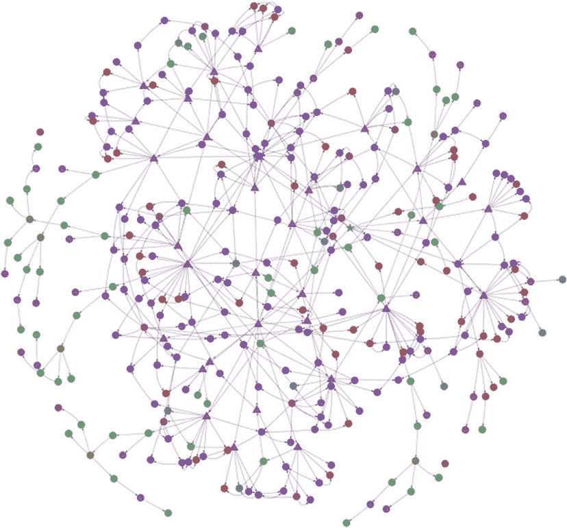

图 12-11 “return true” 查询的结果

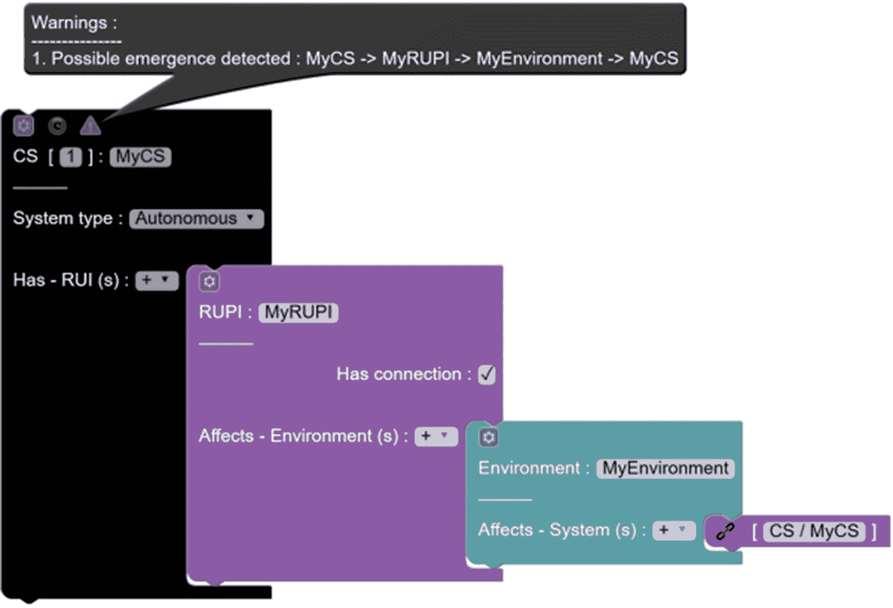

图 12-10 使用约束条件在模型中检测涌现

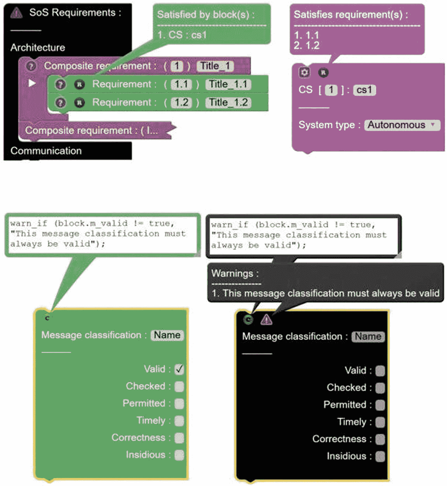

图 12-9 一个约束条件的示例，其中检查了成员变量 `m` 的有效性

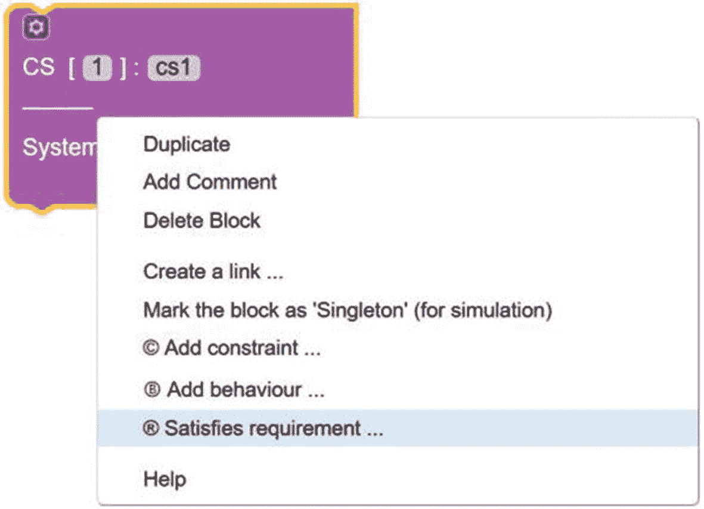

图 12-8 每个块可以满足某些标准

好的，作为高级文档工程师和翻译员，我将严格遵守您提供的注意事项和示例格式，对给定的英文文本进行专业、准确的翻译。

## 12.3 复习题

1. “`BLOCKLY`是一个用于通过积木创建应用程序的库。用户可以在积木编程中利用可视化积木来构建脚本和程序。” 这种说法是正确的还是错误的？

2. 以下哪一项描述了 `BLOCKLY 4SoS`？
    1. 每个积木代表一段可以分层并轻松转换为元模型的代码。
    2. 每个积木代表一段可以堆叠并轻松转换为算法的代码。
    3. 每个积木代表一个可以轻松堆叠和翻译的代码块。
    4. 以上所有选项。

3. 对于*模拟器*组件，以下哪项陈述是正确的？
    1. 模拟器是用于运行设计者预期场景的 Python 程序集合。
    2. 模拟器是为执行设计者规划的场景而设计的程序集合。
    3. 模拟器是用于运行设计者准备好的场景的 Java 应用程序集合。
    4. 以上都不是。

4. 对于*事件*，以下哪项陈述是正确的？
    1. `BLOCKLY`提供了在拖放编辑器中创建和渲染积木所需的一切。
    2. `BLOCKLY`提供了定义和显示积木所需的一切。
    3. `BLOCKLY`提供了在编辑器中创建和渲染积木所需的一切。
    4. 以上所有选项。

5. “需求管理是 SoS 架构的关键组成部分，因为它允许查看和监控需求可追溯性。可以使用视角和构建块来拆分需求。” 这种说法是正确的还是错误的？

## 12.4 复习题答案

1. 答案：正确，`BLOCKLY`是一个用于开发基于积木的应用程序的库。在积木编程中，用户可以使用可视化积木创建脚本和程序。

2. 答案：C，每个积木代表一个可以轻松堆叠和翻译的代码块。

3. 答案：B，模拟器是为执行设计者规划的场景而设计的程序集合。

4. 答案：A，`BLOCKLY`提供了在拖放编辑器中创建和渲染积木所需的一切。

5. 答案：正确，因为它允许查看和监控需求可追溯性，所以需求管理是 SoS 设计的一个关键组成部分。为了划分需求，可以采用视角和构建块。

## 12.5 本章小结

本章解释了`BLOCKLY 4SOS`工具。它是一个用于系统之系统建模、验证、查询和仿真的工具。AMADEOS 支持工具的目标是使使用 AMADEOS 理念和`BLOCKLY`工具设计 SoS 变得简单直观。该工具在设计分布式系统（网络物理系统）时非常有用。下一章将概述借助于 Kilobots 的第一个网络物理系统项目。

脚注 1