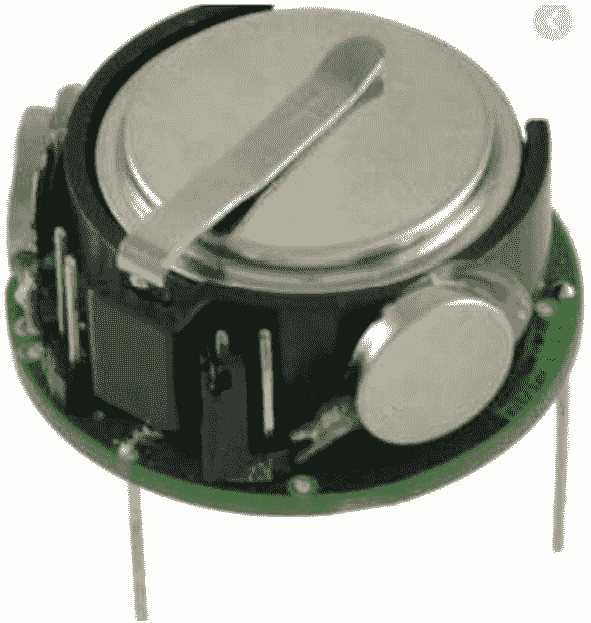
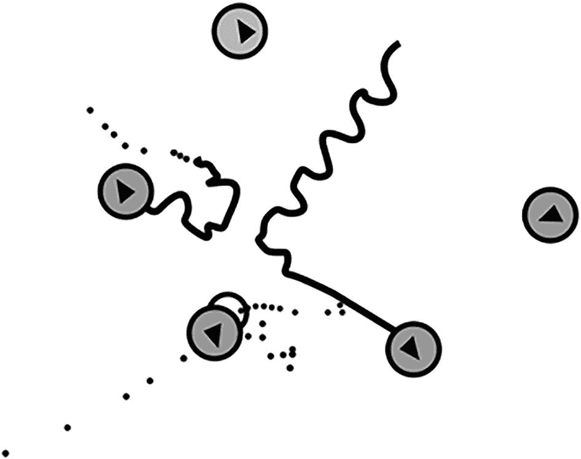
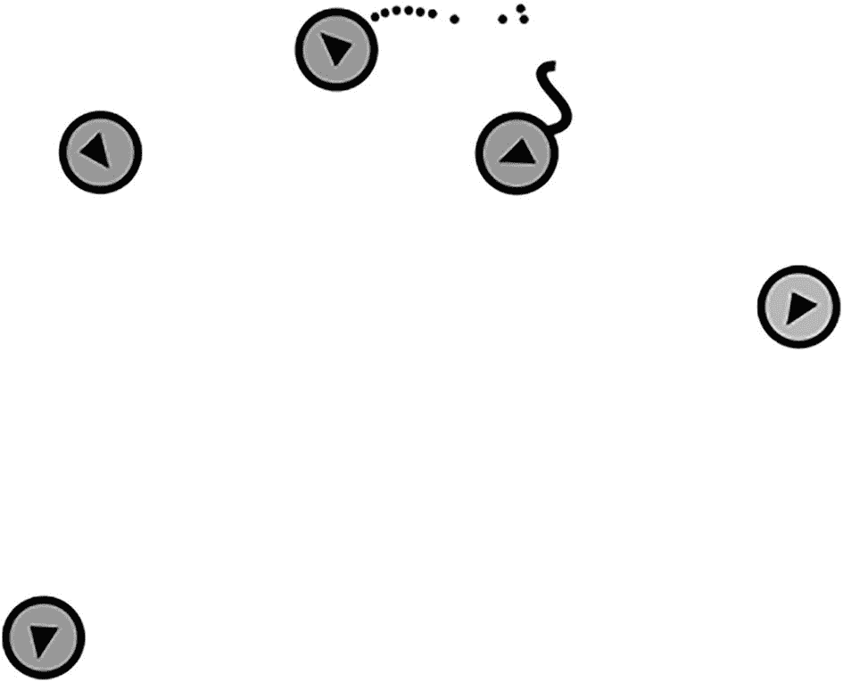
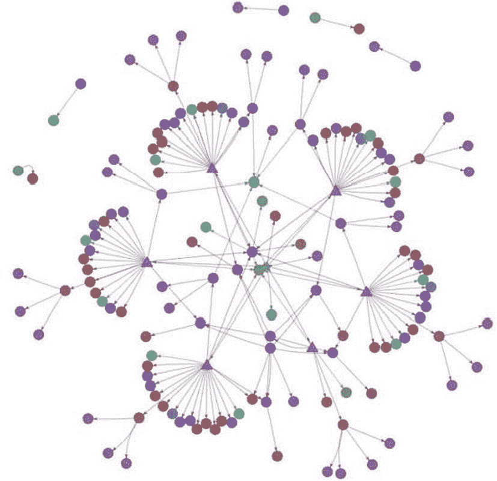

# 13. 网络物理系统项目

在本章中，您将学习如何基于一个名为“女巫喊颜色”的意大利游戏来开发一个网络物理系统。此游戏的规则如下：

-   挑选一名玩家作为女巫。
-   女巫喊出一种颜色，例如蓝色。
-   其他孩子随后跑去触摸该颜色的物体。（不包括衣服，且只能有一个人触摸一个物体。）
-   如果女巫抓住了一个没有触摸到该颜色的孩子，那么被抓住的孩子就成为下一任女巫。然后原来的女巫加入到其他孩子中。

您将借助 Kilobots 来实现这个项目。女巫的移动和颜色功能均在 Kilobots 中实现。

## 13.1 使用 Kilobots

`Kilobot`集群是一个由 1000 个机器人组成的集群，可用于创建自动化且具有长持续时间的集体行为。每个机器人拥有自主群体机器人的基本功能，但它由有限数量的部件组成，并主要由自动化系统组装。此外，系统设计允许单个人以高效且可扩展的方式操作一个大型 Kilobot 协作体，包括对其编程、启动以及为所有机器人补充能源。Kilobot 群体用于研究集体的“虚拟”智能，并测试将最低个人特质与集群特征联系起来的新理论。见图 13-1。通过使用混合概念技术，您可以获得关于鲁棒性、适应性、个性以及在有限个体群体中涌现现象的新算法理解。

### 13.1.1 Kilobots 的运动

以下列表展示了 Kilobots 的基本运动方式：

-   向上运动
-   旋转特性
-   与相邻单元保持联系
-   计算与相邻单元的距离
-   拥有足够的 RAM 来执行 Kilobots 程序

为了扩展其功能，对 Kilobot 添加了以下额外部分：



-   估算环境中光照强度的能力
-   使操作更加灵活

## 13.2 项目需求

### 13.2.1 架构

1.  Kilobots 将在至少 100x80 厘米的空间内运行。
2.  表面应为光泽且反光的材质，以便红外线正常工作。
3.  该 SoS 由至少五个 Kilobots 和一个控制器组成（一个女巫，两个玩家，两种颜色）。
4.  在程序执行开始时，为 Kilobots 分配好位置。
5.  每个 Kilobot 都有一个 ID、颜色和位置。
6.  游戏开始时，玩家搜索颜色，女巫搜索玩家。
7.  女巫和玩家 Kilobots 在等待彼此的奔跑信号。
8.  目标颜色由程序选择。
9.  游戏过程中，所有 Kilobots 都在互相搜索。
10. 游戏过程中，女巫试图抓住玩家，而玩家则在搜索颜色。如果女巫抓住了某个玩家，该玩家将在下一轮成为女巫。
11. 当 Kilobots 触及到目标颜色时，本轮结束。
12. 每个 Kilobot 都有两个独立的电机。
13. 每个 Kilobot 都有一个红外发射器和一个接收器。
14. Kilobots 可以估算与环境中其他机器人的相对距离。
15. Kilobots 将在至少三种状态之一运行：运行、引导加载或休眠。
16. 通过消息接口，每个 Kilobot 都可以与其它任何 Kilobot 通信。

### 13.2.2 项目通信

1.  Kilobots 可以接收来自顶部控制器的消息。
2.  Kilobots 在彼此相距 7.5 厘米范围内时进行通信。
3.  所有 Kilobot 之间的连接在每轮开始时建立。
4.  应有一个唯一的 Kilobot 作为中央通信协调器。

### 13.2.3 时间

每个 Kilobot 将拥有一个基于时间的内部时钟。对于发送的每条消息，Kilobots 可以在 10 秒内通过网络进行通信。

### 13.2.4 动态性

一个移动出通信范围的 Kilobot 将开始移动以寻找其他 Kilobot，以便重新成为网络的一部分。

### 13.2.5 可靠性

1.  可用性：Kilobots 需要充满电的电池。
2.  可靠性：Kilobots 只有能够与所有其他机器人通信时才能开始每一轮游戏，因为它们无法提供必要的服务。
3.  完整性：SoS 不处于不正确的状态以使其正常运行是至关重要的。

## 13.3 Blockly4SoS 模型

在该模型中，我们拥有一个由五个 Kilobots 机器人和一个顶部控制器组成的 SoS（系统之系统）。

1.  顶部控制器拥有一个 `RUMI`（可靠消息接口），用于向 Kilobots 发送它们必须进入的状态信息，或发送定义 Kilobots 行为的代码。
2.  `ID=0` 的 Kilobot 是通信中心节点；它有助于您定义更好的通信协议。
3.  每个 Kilobot 都有一个 `RUMI`，这是它们用来交换消息的接口，还有一个 `RUPI`（可靠物理接口），由红外传感器表示，用于从环境中捕获信息（例如，与其他机器人之间的距离）。消息通道在硬件层上基于红外传感器，但由于该传感器用于直接通信数据和交换消息，因此这些属于 `RUMI`。Kilobots 的 SoS 的每个特性都与一个需求相关。

## 13.4 实现项目

在本项目中，您需分配 Kilobots 的起始位置，并在 `endstate.json` 文件中进行指定。起初，一个 Kilobot 以螺旋方式移动，试图与其他 Kilobots 建立连接以接收信号。

在第一阶段，每个 Kilobot 发送一个 10 位数组，其中除了数组位置等于该 Kilobot ID 的那一位为 1 外，其余所有位均为 0。当每个 Kilobot 都拥有一个数组时，意味着每个 Kilobot 都以单向方式连接到所有其他 Kilobot，并且它们已准备好进行通信。第一阶段至此结束。

在第二阶段，所有 Kilobots 已形成一个网络，并作为一个 SoS 运行。它们选出一名“女巫”（witch），并通过 Kilobots 网络广播此信息。每个 Kilobot 会重新发送收到的消息，直到被选中的“女巫”收到该消息。接着，“女巫”选择要捕捉的目标颜色并广播此信息。

在下一阶段，Kilobots 尝试捕捉目标。每个 Kilobot 评估与目标 Kilobot 的距离，识别出哪个邻居的“到目标的距离”字段比其他所有邻居都小。通过将邻居的“到目标的距离”加上 Kilobot X 到其最近邻居的距离，可以估算出与目标的近似距离。此过程从实际与目标通信的 Kilobots 开始，因为只有它们才能获得到目标的真实距离。之后，此过程将递归进行，直至网络的最外层节点。

因此，通信范围内的每个 Kilobot 都能知道与目标的近似距离，以及为了到达目标所需的最近邻居。Kilobots 可能会超出通信范围。在这种情况下，它们会开始以螺旋方式移动，直到找到某个正在与目标通信的机器人。

这里存在一种涌现行为——一种意想不到且积极的行为——当一个 Kilobot 超出范围时，它会旋转 360 度并重新进入范围。

## 13.5 执行项目

在本项目中，您需分配 Kilobots 的起始位置，并在 `endstate.json` 文件中进行指定。现在，我们将根据您选择的设置（最重要的是 `randSeed = 2`）来描述模拟过程。

在图 13-2 中，您可以看到本次模拟中机器人的起始位置。机器人周围的圆圈表示它正在传输；两个机器人之间的连线表示它们正在通信。

因此，从图 13-2 可以看出，开始时只有一个机器人（`ID=1`）在传输。最初，机器人的目标是创建一个网络，使它们能够连接并能向任何机器人发送和接收消息，因此它们开始四处移动，只有在收到来自已连接至不断扩展网络的机器人（从机器人 1 开始）的消息时才会停止。机器人 1 保持静止。

在机器人创建网络后，它们利用这个通用信道就主要游戏参数达成一致，然后开始游戏。在此阶段，它们的任务是要么躲避其他机器人，要么捕捉那个拥有选定颜色的机器人。同样，此阶段开始时只有一个机器人在传输；这就是目标机器人，或称为“逃跑者”，它会持续发送自己的颜色以及其与目标的距离（当然，距离为 0）。

未收到消息的机器人开始四处移动寻找任何信号；而实际收到消息的机器人则尝试利用消息中包含的与目标机器人的距离信息来捕捉该“逃跑者”。参见图 13-3。





## 13.6 项目代码

以下是本项目的主要代码。该代码使用 C 语言开发。要执行此代码，您需要一个 C 语言编译器。机器人的旋转和移动（左、右、前进、后退）在代码的不同函数中定义。使用 `void setup_message()` 函数定义了每个机器人的消息处理。`orbit_tooclose()` 函数检查相邻机器人的移动情况（参见清单 13-1）。

```c
void smooth_set_motors(uint8_t ccw, uint8_t cw)
{
#ifdef KILOBOT
uint8_t l = 0, r = 0;
if (ccw && !OCR2A)
l = 0xff;
if (cw && !OCR2B)
r = 0xff;
if (l || r)
{
set_motors(l, r);
delay(15);
}
#endif
set_motors(ccw, cw);
}
void set_motion(motion_t new_motion)
{
switch(new_motion) {
case STOP:
smooth_set_motors(0,0);
break;
case FORWARD:
smooth_set_motors(kilo_straight_left, kilo_straight_right);
break;
case LEFT:
smooth_set_motors(kilo_turn_left, 0);
break;
case RIGHT:
smooth_set_motors(0, kilo_turn_right);
break;
}
}
void orbit_normal()
{
if (mydata->cur_distance < DESIRED_DISTANCE - 50) {
mydata->orbit_state = ORBIT_TOOCLOSE;
} else {
if (mydata->cur_distance >= DESIRED_DISTANCE)
mydata->orbit_state = ORBIT_NORMAL;
else
set_motion(FORWARD);
}
int EffectId;
int dist;
int id=10;
void loop() {
if(mydata->type==2)
{
set_color(RGB(0,1,0));
}
if(id<10)
{
message_t msg;
msg.type = NORMAL;
msg.data[0] = id;
msg.data[1] = mydata->typeEffect;
msg.crc = message_crc(&msg);
kilo_message_send(&msg, mydata->dist);
mydata->type=1;
set_color(RGB(1,0,0));
id=10;}
}
if(mydata->IdEffect<10)
{
switch(mydata->type)
{
case 1:{
if(mydata->typeEffect==2)
{
printf("this =>  %d    %d   %d\n",mydata->type,mydata->typeEffect,mydata->IdEffect);
if(mydata->nowDist<200)
{
mydata->IdEffect=10;
set_color(RGB(0,1,0));
mydata->type=2;
set_motion(RIGHT);
}
else   if(mydata->beforIdEffect==mydata->IdEffect)
{
if(mydata->nowDist>mydata->beforDist){
printf("befor :%d  now: %d   befordist:%d   nowdist:%d   move:%d\n",
mydata->beforIdEffect,mydata->IdEffect,mydata->beforDist,mydata->nowDist,mydata->move);
switch(mydata->move){
case 0:
set_motion(LEFT);mydata->move=1;
break;
case 1:set_motion(FORWARD);mydata->move=2;
break;
case 2:set_motion(RIGHT);mydata->move=0;
break;
}
}
}
mydata->beforIdEffect=mydata->IdEffect;
mydata->beforDist=mydata->nowDist;
mydata->IdEffect=10;
}
break;}
case 2:{
if(mydata->typeEffect==3)
{
if(mydata->nowDist<200)
{
if(mydata->beforIdEffect==mydata->IdEffect)
{
if(mydata->nowDist>mydata->beforDist){
switch(mydata->move){
case 0:
set_motion(LEFT);mydata->move=1;
break;
case 1:set_motion(FORWARD);mydata->move=2;
break;
case 2:set_motion(RIGHT);mydata->move=0;
break;
}
}
}
mydata->beforIdEffect=mydata->IdEffect;
mydata->beforDist=mydata->nowDist;
mydata->IdEffect=10;
}
if(mydata->typeEffect==3)
{
if(mydata->beforIdEffect==mydata->IdEffect)
{
if(mydata->nowDist>mydata->beforDist){
switch(mydata->move){
case 0:
set_motion(LEFT);mydata->move=1;
break;
case 1:set_motion(FORWARD);mydata->move=2;
break;
case 2:set_motion(RIGHT);mydata->move=0;
break;
}
}
}
mydata->beforIdEffect=mydata->IdEffect;
mydata->beforDist=mydata->nowDist;
mydata->IdEffect=10;
}
break;}
case 3:{break;}
}
}
else  if(mydata->beforIdEffect==10&&mydata->countmove>125){
mydata->countmove=0;
switch(mydata->move){
case 0:
set_motion(LEFT);mydata->move=1;
break;
case 1:set_motion(FORWARD);mydata->move=2;
mydata->countmove=100;
break;
case 2:set_motion(RIGHT);mydata->move=0;
break;
}
}
mydata->countmove=mydata->countmove+1;
}
}
}
void message_rx(message_t *m, distance_measurement_t *d) {
mydata->nowDist = estimate_distance(d);
mydata->dist = *d;
mydata->IdEffect= m->data[0];
mydata->typeEffect= m->data[1];
}
void setup_message(void)
{
switch(kilo_uid){
case 0:mydata->type=1; break;
case 1:mydata->type=2; break;
case 2:mydata->type=2; break;
case 3:mydata->type=3; break;
case 4:mydata->type=3; break;
}
mydata->transmit_msg.type = NORMAL;
mydata->transmit_msg.data[0] = kilo_uid & 0xff;
mydata->transmit_msg.data[1]=mydata->type;
mydata->transmit_msg.crc = message_crc(&mydata->transmit_msg);
}
message_t *message_tx()
{
return &mydata->transmit_msg;
}
void setup()
{
mydata->cur_distance = 0;
mydata->new_message = 2;
mydata->beforDist=125;
mydata->state=-1;
mydata->IdEffect=10;
mydata->beforIdEffect=10;
mydata->move=0;
mydata->typeEffect=10;
setup_message();
switch(kilo_uid){
case 0:set_color(RGB(1,0,0));
mydata->new_message = 0;
break;
case 1:set_color(RGB(0,1,0));
mydata->new_message = 1; break;
case 2:set_color(RGB(0,1,0));
mydata->new_message = 2;break;
case 3:set_color(RGB(0,0,1));
mydata->new_message = 3;break;
case 4:set_color(RGB(0,0,1));
mydata->new_message = 4; break;
}
switch(kilo_uid){
case 0:mydata->type=1; break;
case 1:mydata->type=2; break;
case 2:mydata->type=2; break;
case 3:mydata->type=3; break;
case 4:mydata->type=3; break;
}
}
#ifdef SIMULATOR
static char botinfo_buffer[10000];
char *cb_botinfo(void)
{
char *p = botinfo_buffer;
p += sprintf (p, "ID: %d beforIdeffect:%d ideffect:%d  beforDist:%d  nowDist:%d   type:%d\n",
kilo_uid,mydata->beforIdEffect,mydata->IdEffect,
mydata->beforDist,mydata->nowDist,mydata->type);
if (mydata->orbit_state == ORBIT_NORMAL)
p += sprintf (p, "State: ORBIT_NORMAL\n");
if (mydata->orbit_state == ORBIT_TOOCLOSE)
p += sprintf (p, "State: ORBIT_TOOCLOSE\n");
return botinfo_buffer;
}
#endif
int main() {
kilo_init();
kilo_message_rx = message_rx;
SET_CALLBACK(botinfo, cb_botinfo);
kilo_message_tx = message_tx;
kilo_start(setup, loop);
return 0;
}
```

**清单 13-1** `Orbit.c`

在接下来的项目中，我们为 Kilobots 分配了起始位置，并在 `endstate.json` 文件中指定了这些位置，如代码清单 13-2 所示。

```json
{
"bot_states": [
{
"ID": 0,
"direction": 0.24680567903004347,
"state": {},
"x_position": -223.0,
"y_position": -156.0
},
{
"ID": 1,
"direction": 5.8484504331042393,
"state": {},
"x_position": -258.0,
"y_position": 185.0
},
{
"ID": 2,
"direction": 4.8963292787052639,
"state": {},
"x_position": 56.320128808496456,
"y_position": -190.86350829767215
},
{
"ID": 3,
"direction": 4.3219605347985022,
"state": {},
"x_position": 32.498282727499863,
"y_position": -215.63645771384685
},
{
"ID": 4,
"direction": 5.5296756682271786,
"state": {},
"x_position": 248.0,
"y_position": -44.0
}
],
"ticks": 224
}
```

*代码清单 13-2* `endstate.json`

在这个项目中，Kilobots 的基本结构在 `kilombo.json` 文件中定义和指定，如代码清单 13-3 所示。

*代码清单 13-3.* `kilombo.json`

```json
{
"botName" : "Orbit bot",
"randSeed" : 1,
"nBots" : 5,
"timeStep" : 0.0416666,
"__note" : "0.04166 is 24 FPS which matches the movie frame rate",
"__timeStep" : 0.03225,
"simulationTime" : 0,
"commsRadius" : 100,
"showComms" : 0,
"showCommsRadius" : 0,
"distributePercent" : 0.8,
"displayWidth"  : 800,
"displayHeight" : 700,
"displayWidthPercent" : 80,
"displayHeightPercent" : 80,
"displayScale"  : 1,
"showHist" : 1,
"histLength": 4000,
"storeHistory": 1,
"imageName" : "./movie4/f%04d.bmp",
"saveVideo" :  0,
"saveVideoN" : 1,
"stepsPerFrame" : 1,
"finalImage" : null,
"stateFileName" : "simstates.json",
"stateFileSteps" : 0,
"colorscheme" : "bright",
"speed": 7,
"turnRate" : 22,
"GUI"  : 1 ,
"msgSuccessRate" : 0.8,
"distanceNoise" : 2
}
```

在接下来的项目中，orbit 的基本结构在 `orbit.h` 文件中定义和指定，如代码清单 13-4 所示。

*代码清单 13-4.* `orbit.h`

```json
{
"botName" : "Orbit bot",
"randSeed" : 1,
"nBots" : 5,
"timeStep" : 0.0416666,
"__note" : "0.04166 is 24 FPS which matches the movie frame rate",
"__timeStep" : 0.03225,
"simulationTime" : 0,
"commsRadius" : 100,
"showComms" : 0,
"showCommsRadius" : 0,
"distributePercent" : 0.8,
"displayWidth"  : 800,
"displayHeight" : 700,
"displayWidthPercent" : 80,
"displayHeightPercent" : 80,
"displayScale"  : 1,
"showHist" : 1,
"histLength": 4000,
"storeHistory": 1,
"imageName" : "./movie4/f%04d.bmp",
"saveVideo" :  0,
"saveVideoN" : 1,
"stepsPerFrame" : 1,
"finalImage" : null,
"stateFileName" : "simstates.json",
"stateFileSteps" : 0,
"colorscheme" : "bright",
"speed": 7,
"turnRate" : 22,
"GUI"  : 1 ,
"msgSuccessRate" : 0.8,
"distanceNoise" : 2
}
```

如果你将以下 GitHub 文件上传到 `https://blockly4sos.resiltech.com/latest/demos/amadeos/i.html`，你将获得此项目的 Blockly4Sos 图表。图 13-4 显示了输出结果。

`https://github.com/JosephThachilGeorge/Blockly4SoS`



*图 13-4* BlocklySoS 输出

## 13.7 本章小结

本章讨论了如何基于意大利游戏“女巫喊颜色”创建一个信息物理系统。该项目展示了信息物理系统的特性以及分布式系统所使用的通信方式。该项目借助 BlocklySoS 建模图进行建模。下一章将深入探讨一个更复杂的项目，这将帮助你更好地理解分布式系统架构。