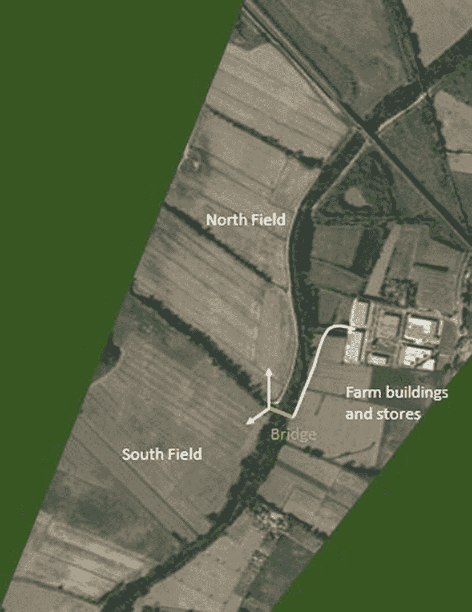
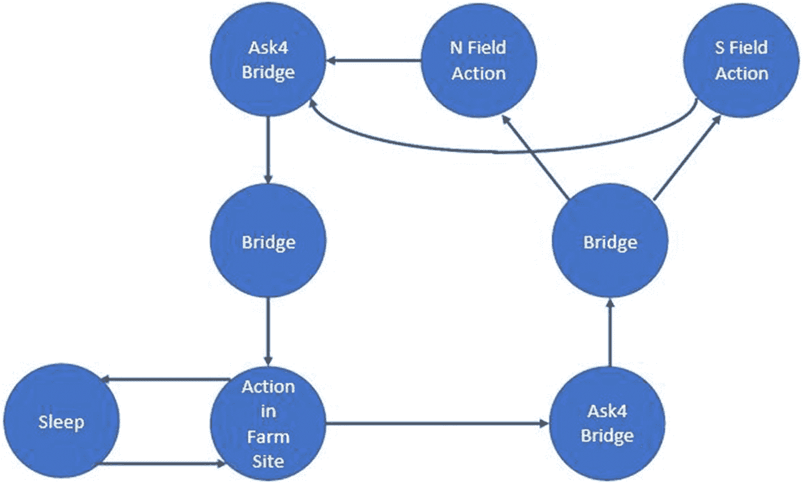
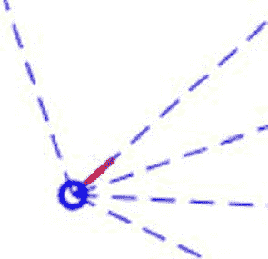
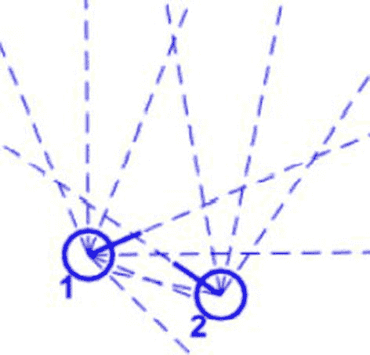
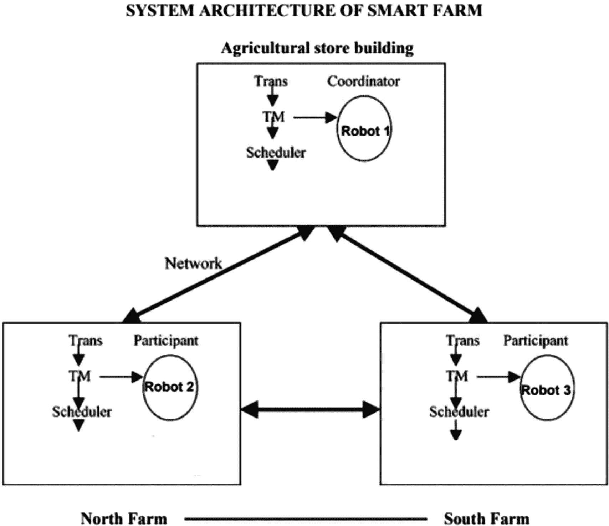
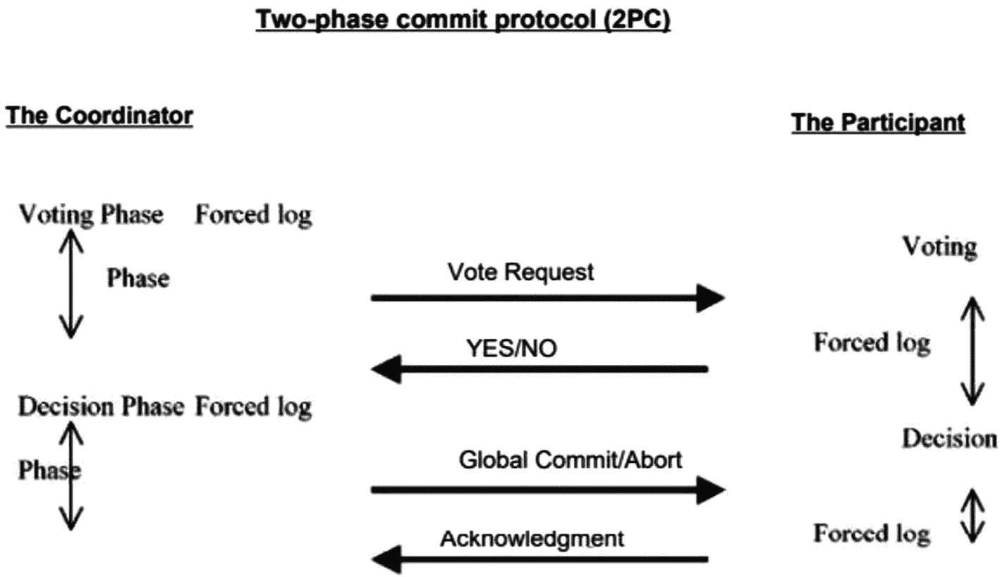
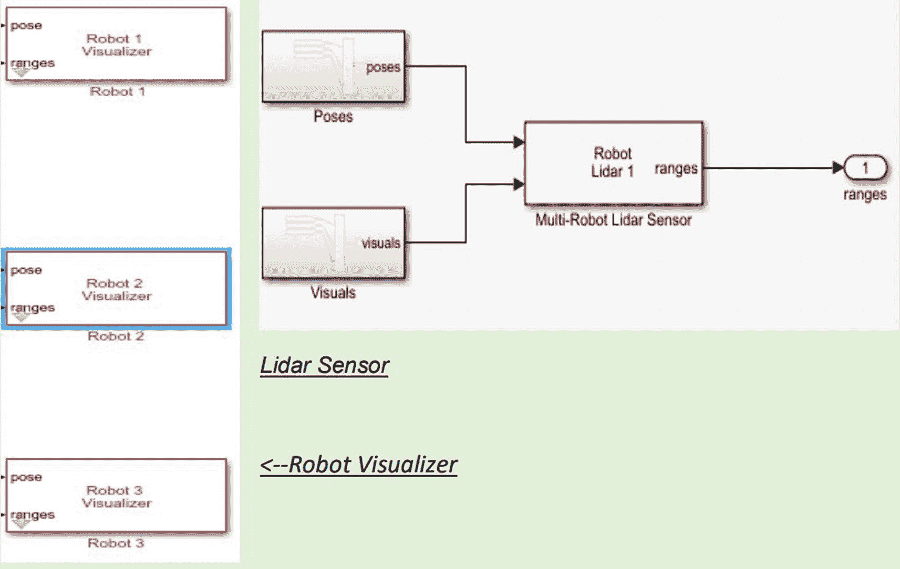
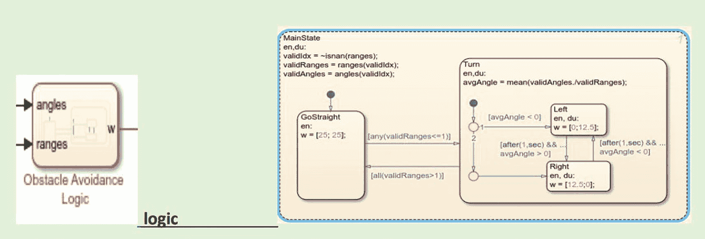
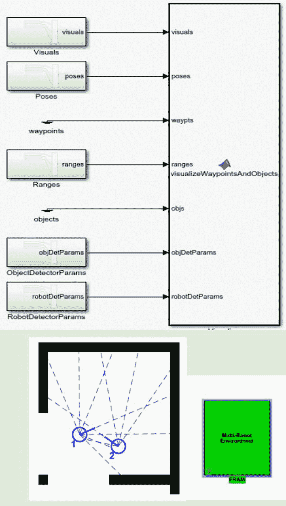

# 14. 使用 MATLAB 智能农场项目

本项目阐述了如何有效控制对共享资源的互斥访问。为了实现这种互斥性，项目在 MATLAB 中使用 Simulink 框架创建。项目名称为*智能农场*。在此项目中，一支自主机器人车队执行一系列农业任务，包括整地、浇灌植物以及收割已种植的植物。

## 14.1 智能农场项目描述

该项目探讨了一个关于对共享资源进行分布式互斥访问的案例研究。背景是一个*智能农场*，一支自主机器人车队负责整地、浇灌植物、收割植物产品等。

每个机器人在田地与主农场建筑和仓库之间循环移动。农场的地理布局是，有两个主要的生产田地（命名为北田和南田），通过一条乡村道路可从主农场区域到达，这条道路要经过一座横跨河流的小桥（见图 14-1）。同一时间只能有一个机器人使用桥梁，这意味着机器人需要通过 V2V 通信来协商对桥梁的独占访问权，且没有中央控制中心。

*图 14-1* 河上的桥

每个机器人可以被视为在多种操作模式之间循环切换，如图 14-2 所示。当机器人需要移动到田地或农场建筑时，它会进入 `Ask4Bridge` 模式，在此模式下它请求访问桥梁，并将此请求通信给其他处于 `Ask4Bridge` 或 `Bridge` 模式的机器人。

该项目的主要目标是定义允许对桥梁进行独占访问的分布式通信协议，以避免在桥梁上发生碰撞。

*图 14-2* 操作模式

### 14.1.1 项目需求

系统必须满足以下需求：

- *需求 1*：系统由数量非预先确定的相同机器人组成，它们通过无线连接相互通信。
- *需求 2*：每个机器人遵循图 14-2 所描述的循环操作模式行为。
- *需求 3*：不能有两个机器人同时访问桥梁（互斥性，安全性）。
- *需求 4*：一个未获得桥梁访问权限的机器人需要等待，直到桥梁被清空，然后才发出新的访问请求。
- *需求 5*：如果一个机器人发出了桥梁访问请求，那么它迟早会获得访问权限（*存活性*）。
- *需求 6*：如果桥梁访问权限被授予给一个从北田来的机器人，并且至少还有另外两个机器人 R1 和 R2 即将到来——R1 同样来自北田，R2 来自农场或南田——那么下一次访问权限不能授予给同样来自北田的 R1。此规则同样适用于机器人从南田或农场过桥的对称情况（*公平性*）。
- *需求 7*：该系统基于完全分布式的算法，没有任何中心化元素。
- *需求 8*：机器人不参照共同的时钟，每个时钟都是自主且非同步的。

好的，作为高级文档工程师和翻译员，我将严格按照您提供的注意事项和示例，对给定的英文文本进行专业翻译。

以下是翻译后的中文文档：

### 14.1.2 解决方案提示

机器人可被视为分布式系统的节点，将使用给定的规范形式进行建模。通常，每个节点将被建模为某种形式的*扩展有限状态机*，节点将利用该形式提供的机制交换数据，以实现不同状态机之间的通信。

节点（机器人）用编号标识，必要时可使用其标识符发送点对点通信。

作为建议，你可以基于 2PC（两阶段提交协议）算法（标准或线性）来组织解决方案，其中需要定义一个协调者，将它的提议发送给其他节点。

请求访问桥梁的机器人 `R1` 在每次运行中充当协调者。因此，它向其他机器人广播访问请求。接收到来自 `R1` 的这个请求的机器人，如果其工作模式不是 `Ask4Bridge` 或 `Bridge`，则简单地回复 `agree`。处于 `Bridge` 模式的机器人将回复 `abort`，因为它当前正占用桥梁。接收到来自 `R1` 请求且处于 `Ask4Bridge` 模式的机器人 `R2`，如果其标识符低于 `R1`，则回复 `abort`；否则回复 `agree`。但在这种情况下，`R2` 还必须中止它在进入 `Ask4Bridge` 模式时启动的算法运行。

离开 `Bridge` 模式的机器人向其他节点广播桥梁空闲的信息，以便处于 `Ask4Bridge` 模式的节点可以重试它们的请求。

请注意，一个节点应能启动自己的 2PC 运行，*同时*监听来自参与其他 2PC（两阶段提交协议）运行的其他机器人发来的消息。这需要使用一些并发线程，或*状态图*区域。

在第一阶段，你应该专注于 2PC 方案，考虑一个由三个或四个机器人组成的固定集合，并仔细研究它们的交互，忽略活性和公平性要求，仅考虑三种运行模式（`Ask4Bridge`、`Field Action` 和 `Bridge`）。

在第二阶段，你扩展模型以考虑其他运行模式、可能更多的机器人和/或活性/公平性要求。

请注意，通常，工具（为了能够模拟或形式化验证模型）需要通过物理复制粘贴来实例化固定数量的对象（节点）。

## 14.2 实施项目

该项目设计使用三个机器人在田野与主要农业建筑和仓库之间循环移动。农场的地理位置决定了有两个主要生产田（命名为北田和南田）。机器人的运动满足前述使用互斥实现分布式系统中并发控制的三个基本要求。

除此之外，该系统基于一个完全分布式的算法，没有任何集中化元素。机器人不参考公共时钟，每个时钟都是自治的且不同步。

该项目使用 MATLAB 实现，并借助 Simulink 工具设计机器人。实施需要以下 MATLAB 依赖项：

- Simulink
- Stateflow
- Robotics System Toolbox
- Navigation Toolbox

下一节将介绍 Simulink 中内置的、并在本项目中使用到的功能。

### 14.2.1 环境模型

MATLAB 内置的 Robotics Visualizer 使您能够在 2D 移动机器人环境中模拟和原型设计算法。多机器人生态系统还支持在 2D 多机器人移动机器人环境中开发和原型设计算法。这些功能可通过 MATLAB 和 Simulink 接口访问。

### 14.2.2 传感器模型

在本项目中，Lidar Sensor 模拟了用于可视化和算法原型设计的 2D 视线传感器。此功能可在 MATLAB 和 Simulink 界面中使用（见图 14-3）。

图 14-3
传感器

### 14.2.3 多机器人激光雷达传感器

除了前面列出的功能外，还使用了多机器人激光雷达传感器来模拟多机器人环境中的二维视线探测器。该传感器将测试占用地图以及对环境中使用有限半径的其他机器人的视线。此功能可在 MATLAB 和 Simulink 界面中使用。

## 14.3 系统架构

本项目将两阶段提交协议技术应用于机器人的移动。

在系统架构下，一次只能有一个进程运行关键部分（CS）。在分布式网络中，无法使用共享变量或本地内核实现互斥。创建分布式互斥的唯一方法是使用消息转发。通过分布式系统算法来处理不可预见的通信延迟和系统状态的部分信息（见图 14-4）。

图 14-4
多传感器

为了避免通过桥梁的机器人之间发生碰撞，架构的设计方式如下：当机器人需要移动到田地或农场建筑时，它进入 `Ask4Bridge` 模式。在那里，它请求访问桥梁，并将此请求传达给处于 `Ask4Bridge` 模式的机器人。分布式通信协议（两阶段提交协议）允许独占访问，以避免桥梁上的碰撞。

在上述架构中，事务被定义为一组操作。根据应用标准，每个事务都被赋予一个截止时间。操作被认为是牢固且真实的，并具有相同的严重级别。超过截止日期的事务将被立即取消。

当事务准备“提交”时，两阶段提交协议启动。由一个单独的协调机器（本例中为机器人 1）启动。机器人 2 和 3 是其他参与者，它们将等待来自监管者（机器人 1）的命令。

这种技术确保了事务的原子性：要么整个事务反映在系统的最终状态中，要么什么都不反映。即使只有一个参与者无法提交，该事务也将被终止。换句话说，每个参与者对事务都有“否决”权。两阶段提交协议的基本流程如图 14-5 所示。

图 14-5
智能农场的系统架构

## 14.4 系统建模

所有建模均在 MATLAB 的帮助下完成。使用 Simulink 工具，我为机器人的运动开发了一个 State flow 模型。为了移动机器人，该程序使用了 Robotics System Toolbox 和 Navigation Toolbox。（要执行此任务，请注意 MATLAB 中提供了免费的插件。）

### 14.4.1 机器人可视化工具和激光雷达传感器

机器人可视化工具用于开发机器人架构。此外，通过为每个机器人使用激光雷达传感器，可以验证机器人的运动。激光雷达传感器还可以模拟二维视线传感器，如图 14-6 所示。

图 14-6
两阶段提交协议（2PC）

### 14.4.2 避障逻辑与*两阶段提交（2PC）*协议概念

为防止机器人在状态转换过程中发生碰撞，本项目采用了**两阶段提交（2PC）协议**概念来实现过渡。为实现此概念，项目为机器人引入了一种基于投票的移动模式。当某个机器人想要转换到不同状态时，它会请求进入`Ask4Bridge`模式。随后，协调器会判断是否有其他机器人也请求了相同模式。若没有，则允许其继续移动。为了防止机器人在移动过程中相互碰撞，项目还使用了 MATLAB 中提供的避障逻辑。

### 14.4.3 北农场、南农场与仓库的架构

MATLAB 中有一项名为*多机器人环境*的功能，用于构建不同的场地，例如北农场、南农场和仓库。在此平台上，用户可以创建“n”个机器人并追踪其移动轨迹。

这是 MATLAB 中 Navigation Toolbox 插件内置的一项功能。MATLAB 对多机器人环境的定义如下：“多机器人环境使您能够在二维多机器人移动机器人场景中模拟和原型化算法。”（见图 14-7。）

图 14-7
机器人可视化器与激光雷达传感器

## 14.5 实现两阶段提交协议

当事务准备“提交”时，2PC 协议便开始生效。一个单一的主控系统（初始阶段为机器人 1）会启动该协议。

2PC 协议包含两个阶段，如下所示（假设在初始阶段，机器人 1 是协调器，机器人 2 和 3 是参与者）。

- **阶段 1：** 主控机器人 1 询问每个个体是否已完成其事务任务并准备好提交。每位成员给出“是”或“否”的答复。
- **阶段 2：** 组织者统计所有答复。如果所有工作节点都回答“是”，则事务将被完成；否则将中止。主控向每个工作节点发送最终提交选择的决定，并接收响应。

该技术确保操作具有原子性：要么整个操作反映在系统的最终状态中，要么完全不反映。即使只有一个参与方无法提交，事务也会被取消。换句话说，每个参与方对事务拥有*否决权*。

图 14-8
避障逻辑

它还确保了事务的长期可行性。在步骤 1 中回答“是”之前，每个参与方都会双重检查事务的所有写入操作是否已持久化写入存储。这使得主控能够就事务做出最终决定，而无需担心投票“是”的参与者后续会失败（见图 14-8）。

### 14.5.1 需求

本项目在实现互斥时满足了分布式系统并发控制的三个基本需求：

- 互斥与安全性
- 活性
- 公平性

允许多个进程以互斥的方式访问共享资源或数据源，具体如下：

- 分布式系统中没有可用于构建互斥和同步原语的公共变量。
- 共享信息的唯一途径是通过数据传输。

这三个基本需求的满足方式如下：

- **互斥与安全性：** 在任何给定时间，只有一个进程可以运行关键部分。
- **活性：** （无死锁或无饥饿。）两个或多个参与方不应无限期等待永远不会到达的通信。
- **公平性：** 每个进程都有平等的机会完成关键部分。原则上，公平性意味着关键部分执行请求按照它们到达系统的顺序被处理。

除上述需求外，我们还实现了以下需求：

- 系统由数量不定的相同机器人组成，它们借助激光雷达传感器和避障逻辑，通过无线连接相互通信。
- 每个机器人都借助机器人可视化器工具遵循循环操作模式行为。
- 未获得桥接授权的机器人会等待桥接通畅，然后才借助 2PC 协议概念发出新的访问请求。

系统基于一个完全分布式的算法，借助 2PC 协议概念，不存在任何集中化元素。

### 14.5.2 遇到的问题

在实施本项目时，出现了以下问题：

- 由于两阶段提交协议的阻碍特性，导致缺乏可扩展性。

  两阶段提交协议最大的问题在于它是一种阻碍性协议。如果主控永久性故障，某些参与方将无法完成其操作。在一个参与者向主控提交了同意消息后，它将会停顿，直到收到提交或回滚指令。

- 一旦参与者确认准备好提交，它必须能够在之后提交该事务，即使其中途崩溃。这需要将检查点写入持久化存储。

- 最糟糕的情况是主控本身也是一个参与者，并对协议的结果进行投票。那么，主控的崩溃可能会同时抹去它自身和一个成员，导致协议保持阻塞状态，即使只发生了一次故障。由于通信复杂度低，2PC 仍然是一种常见的共识协议。然而，在发生故障时，如果每个节点都自愿成为恢复节点，复杂度可能会上升到`O(n²)`。

尽管如此，2PC 可能因主控故障而阻塞，这是一个严重问题，会严重降低可用性。如果事务可以在任何时刻回滚，协议可以在节点超时时恢复；但如果提交决定必须被视为永久性的，那么单个故障就可能导致整个系统停滞。此外，已开发出三阶段提交协议，它以额外的消息延迟为代价，消除了 2PC 的阻塞问题（见图 14-9）。

图 14-9
北农场、南农场与仓库的模型架构

## 14.6 总结

在分布式计算机系统中，提交协议提供了全局原子性。这确保了跨计算机网络的事务不会在所有网络节点上结束，也不会在所有节点都失败时完全不执行（即要么全部成功，要么全部失败）。

分布式计算是一种利用联网的独立计算机协作完成项目的方法。根据这一范式，中央计算机拆分任务并将其交付给客户端计算机来完成。得益于提交机制，这种方法能够承受单个客户端故障。

*两阶段提交协议*的缺点是，如果协调者失败，所有客户端资源都可能被无限期冻结。提交的三阶段协议中使用超时转换来弥补这一缺陷。如果协调计算机发生故障，超时转换允许在预定时间释放资源。

本章涵盖了一种可用于设计分布式系统的基本协议。通过两个阶段——提交请求阶段和提交阶段——两阶段提交方法保证了原子性。在提交请求阶段，协调计算机向网络上每一台其他客户端计算机发送请求，然后等待来自每个客户端的响应消息。如果收到所有消息，则执行步骤 2；如果存在客户端错误且未收到所有消息，则执行步骤 1。所有客户端都会收到中断通知。

以这种方式使用 `MATLAB` 是分布式系统的一个绝佳示例。机器人的运动是借助 `MATLAB` 工具设计的。两阶段提交协议用于分布式系统中的消息事务处理。该项目是对共享资源实现分布式互斥访问的案例研究。场景是一个智能农场，其中一支自主机器人车队执行诸如整地、植物浇水、收获农作物等活动。

下一章介绍一个具有更多分布式系统特性的高级项目示例。该项目名为 *Platoon*。

