# 15. Platoon 项目

本章解释如何基于一个名为 *Platoon* 的游戏开发一个网络物理系统。

*Platoon* 是 Ocean Software 于 1987-1988 年发行的一款视频游戏，最初面向 8 位家用电脑，随后推出 16 位版本以及任天堂娱乐系统（NES）版本。该游戏受战争电影 *Platoon* 启发，由不同游戏机制的关卡组成，包含第三人称和第一人称视角。1988 年，Sunsoft 还开发了一款街机移植版本，名为 *Vs. Platoon*，基于 NES 和从任天堂获得许可的任天堂 Vs. 系列系统。根据维基百科，该游戏包含几个阶段。^(¹²)

该游戏由四个关卡组成：¹

*   *丛林与村庄:* “通过由垂直通道连接的横向卷轴环境迷宫，具有二维移动和第三人称侧视视角”。路径上遍布陷阱和越共。玩家一次控制一名士兵，但可以随时用其他士兵替换他，例如为了避免让已经受伤的士兵冒险。玩家可以跳跃、蹲伏、射击和投掷手榴弹，且弹药有限。在最后部分，玩家需要探索村庄的小屋（这些小屋会暂时变得透明），以寻找继续游戏所需的物品。

*   *游击队:* 游戏转变为第一人称射击游戏，小地图占据屏幕的一半。当你遇到也会从淹没隧道的洪水中出现的游击队时，移动会停止，你需要查看瞄准器。当你进入房间时，瞄准器变为指针用于检查物体；通过这种方式，你能找到继续游戏所需的元素——补给品和陷阱。

*   *碉堡:* 这是一个固定屏幕的瞄准器射击游戏；画面是黑暗的，只有枪口的闪光才能被敌人注意到，除非玩家用照明弹暂时照亮场景。弹药和照明弹有限。

*   *巴恩斯的丛林与碉堡:* 一个由固定 2.5D 第三人称画面组成的迷宫，玩家需要从屏幕底部穿越到顶部，避开障碍物并借助指南针射击敌人。弹药和总时间有限。最终 Boss 是巴恩斯，需要使用手榴弹攻击。

五名排成员每人可以承受四次攻击才会死亡。还有一个总体士气条，当无辜平民受伤或被击中时会下降，通过收集食物和药品可以补充。如果士气降至零，或者所有队员都阵亡，则游戏失败。

在本章中，你将学习如何借助 Kilobots 的移动来实现这个游戏。

## 15.1 游戏环境

1.  AE-1：Kilobots 将在白板上操作。
2.  AE-2：白板中央将放置一个障碍物。

### 15.1.1 SoS 组织

1.  ASoS-1：`SoS` 由 N 个 Kilobots 组成。
2.  ASoS-2：`SoS` 还包含一个控制器，负责将程序加载到 Kilobots 的内存中。
3.  ASoS-3：`SoS` 在组成 `SoS` 的 Kilobots 之间进行排级编队。
4.  ASoS-4：当 `SoS` 启动时，Kilobots 排成一条直线，彼此相距 D 厘米。
5.  ASoS-5：当 `SoS` 运行时，Kilobots 之间的距离保持在大约 D 厘米。
6.  ASoS-6：领导者在执行前确定。
7.  ASoS-7：所有 Kilobots 都知道领导者的 ID。

### 15.1.2 计算机系统级

1.  CCS-1：每个 Kilobot 都有一个 `RUMI` 用于交换消息。
2.  每个 Kilobot 都有一个 `RUMI` 用于与控制器通信。
3.  控制器有一个 `RUMI` 用于与 Kilobots 通信。
4.  每个 Kilobot 都有一个 `RUMI` 用于估计距离。

### 15.1.3 系统级组织

1.  CSoS-1：每个 Kilobot 将使用其 `RUMI` 来交换关于方向的信息，在加入排级编队时以及离开排级编队时。
2.  CSoS-2：当 `SoS` 启动时，每个 Kilobot 通过传输消息通知相邻的跟随者它是领导者。
3.  CSoS-3：每个 Kilobot 都有一个 `RUPI`，用于利用信号功率估计发送者和接收者之间的距离。

### 15.1.4 涌现观点

1.  E-1：多个 Kilobots 的交互导致了一个独特的排级编队。

### 15.1.5 动态性观点

1.  D-1：该排级编队允许任何 Kilobot 成为其成员。
2.  D-2：该排级编队至少由两个 Kilobots 组成。
3.  D-3：只允许在排级编队的尾部引入新的 Kilobot。
4.  D-4：该排级编队仅允许最后一个 Kilobot 离开。

### 15.1.6 时间观点

1.  T-1：Kilobot 将根据本地时钟 T-2 测量时间。时间相关的事件由消息交换触发。
2.  T-3：当一个 Kilobot 启动时，它将为电机准备 Mms（毫秒）的时间。

## 15.2 网络物理系统

Kilobots 将帮助你实现你的概念。Kilobots 被用来执行排级编队的移动。Kilobot 群体是一个由一万个机器人（1024 个）组成的群体，可用于开发和测试高增长群体中的集体行为。

每个机器人具备独立群体机器人的基本能力（可配置控制器、基本的移动能力和本地通信能力），但它们由低成本组件构成，并且主要由自动化系统制造。

此外，该系统的架构使得单个操作员能够简单灵活地控制一个庞大的 Kilobot 群体，包括对机器人的“免手动”编程、开机和充电。本项目利用 Kilobot 群体来研究集体的“人工”智能（例如同步、集体运输和身份识别），并测试将个体最低能力与群体行为联系起来的新构想。

本项目希望通过使用理论-实验混合方法，在鲁棒性、可扩展性、自组织和受限个体的涌现集体方面获得新的算法见解。

## 15.3 Kilobot 源代码


```c
#include <stdio.h>
#include "platoon.h"
#include <math.h>
#ifdef SIMULATOR
#include <stdio.h>  // 用于 printf
#include <stdlib.h>
#else
#include <avr/io.h>   // 用于微控制器寄存器定义
#endif

#define RED RGB(3,0,0)
#define GREEN RGB(0,3,0)
#define BLUE RGB(0,0,3)
#define WHITE RGB(3,3,3)
#define STRAIGHT 1
#define LEFT 2
#define JOIN 3
#define QUIT 4
#define OK 5
#define LEAVE 6
#define SPEED_DOWN 7
#define TURN_LEFT_DELAY 126
#define GO_STRAIGHT_DELAY 700
#define JOIN_DELAY 150
#define FOLLOW_DELAY 220
#define STANDARD_DISTANCE 80
#define NORMAL_SPEED 70
#define CAN_LEAVE 2
#define CAN_JOIN 3
#define LEAVE_TIME 2500
#define END_TIME 20000

REGISTER_USERDATA(USERDATA)

void message_rx(message_t *m, distance_measurement_t *d) {
    mydata->new_message = 1;
    mydata->received_msg = *m;
    mydata->dist = *d;
}

void setup_message(uint8_t data) {
    mydata->transmit_msg.type = NORMAL;
    mydata->transmit_msg.data[0] = kilo_uid & 0xff; // ID 的低字节，目前未实际使用
    mydata->transmit_msg.data[1] = data;
    mydata->transmit_msg.crc = message_crc(&mydata->transmit_msg);
}

message_t *message_tx() {
    return &mydata->transmit_msg;
}

void setupUserData() {
    mydata->cur_distance = 0;
    mydata->new_message = 0;
    mydata->turning = 0;
    mydata->joining = 0;
    mydata->following = 0;
    mydata->follower_id = kilo_uid + 1;
}

void setup() {
    setupUserData();
    if (kilo_uid == 0)
        set_color(WHITE); // 领队机器人的颜色
    else if (kilo_uid == CAN_JOIN) {
        mydata->my_leader = 255;
        set_color(BLUE); // 加入机器人的颜色
    } else {
        set_color(RED); // 移动机器人的颜色
        mydata->my_leader = kilo_uid - 1;
    }
}

// 领队代码
/*********************************************************************/

int checkDistance() {
    if (mydata->new_message && mydata->received_msg.data[0] == mydata->follower_id) {
        if (estimate_distance(&mydata->dist) > STANDARD_DISTANCE + 3)
            return SPEED_DOWN;
    }
    return -1;
}

void speedCorrection(int distance) {
    if (distance == SPEED_DOWN)
        set_motors(0, 0);
    else
        set_motors(kilo_turn_left, kilo_turn_right);
}

void leader() {
    mydata->myClock = kilo_ticks % (GO_STRAIGHT_DELAY + TURN_LEFT_DELAY);
    if (mydata->myClock < GO_STRAIGHT_DELAY) {
        speedCorrection(checkDistance());
        setup_message(STRAIGHT);
    } else {
        set_motors(kilo_turn_left, kilo_turn_right);
        setup_message(LEFT);
    }
}

// 跟随者代码
/*********************************************************************/

int handleMessage() {
    if (mydata->new_message && mydata->received_msg.data[0] == mydata->my_leader) {
        return mydata->received_msg.data[1];
    }
    return 0;
}

int handleOther() {
    if (mydata->new_message && mydata->received_msg.data[0] != mydata->my_leader) {
        return mydata->received_msg.data[1];
    }
    return 0;
}

int goStraight() {
    return (kilo_ticks - mydata->message_timestamp) > GO_STRAIGHT_DELAY;
}

int handleTurnLeft() {
    return (kilo_ticks - mydata->message_timestamp) > TURN_LEFT_DELAY;
}

int passedDelay() {
    return (kilo_ticks - mydata->message_timestamp) >= 346;
}

void leave() {
    mydata->my_leader = 255;
    set_color(GREEN);
    set_motors(kilo_turn_left, kilo_turn_right);
}

void join() {
    set_motors(kilo_turn_left, kilo_turn_right);
    setup_message(JOIN);
    if (mydata->new_message && mydata->received_msg.data[1] == OK) {
        mydata->my_leader = mydata->received_msg.data[0];
        mydata->joining = 1;
    }
}

void prepareToFollow() {
    mydata->follow_timestamp = kilo_ticks;
    mydata->joining = 0;
    mydata->following = 1;
}

void followPlatoon() {
    if (kilo_ticks - mydata->follow_timestamp < FOLLOW_DELAY) {
        set_motors(kilo_turn_left, kilo_turn_right);
        set_color(RED);
    } else mydata->following = 0;
}

int checkJoin() {
    if (mydata->following) {
        followPlatoon();
        return 1;
    }
    if (mydata->joining) {
        prepareToFollow();
        return 1;
    }
    if (kilo_ticks == LEAVE_TIME && kilo_uid == CAN_LEAVE) {
        leave();
        return 1;
    }
    if (kilo_ticks >= LEAVE_TIME + JOIN_DELAY && kilo_uid == CAN_JOIN && mydata->my_leader == 255) {
        join();
        return 1;
    }
    if (handleOther() == JOIN) {
        setup_message(OK);
        return 1;
    }
    return 0;
}

void follower() {
    if (checkJoin()) return;
    int message = handleMessage();
    if (mydata->turning == 0 && message == LEFT) {
        mydata->message_timestamp = kilo_ticks;
        mydata->turning = 1;
    }
    if (mydata->turning == 0 && message == STRAIGHT) {
        speedCorrection(checkDistance());
        setup_message(STRAIGHT);
    } else if (mydata->turning == 1) {
        mydata->turning = handleTurnLeft();
    }
}

/*********************************************************************/
// 公共代码
/*********************************************************************/

void loop() {
    if (kilo_ticks >= END_TIME) {
        set_color(RGB(0, 0, 0));
        set_motors(0, 0);
    } else {
        if (kilo_ticks < 32) spinup_motors();
        if (kilo_uid == 0) leader();
        else follower();
    }
}

void initMessageFunctions() {
    kilo_message_rx = message_rx;
    kilo_message_tx = message_tx;
}

int main() {
    kilo_init();
    initMessageFunctions();
    kilo_start(setup, loop);
    return 0;
}
```
**清单 15-1**  
**队列源程序**
```


```
{
"botName" : "Join Tail",
"randSeed" : 1,
"nBots" : 4,
"formation": "rline",
"timeStep" : 0.0416666,
"__note" : "0.04166 is 24 FPS which matches the movie frame rate",
"__timeStep" : 0.03225,
"simulationTime" : 0,
"commsRadius" : 100,
"showComms" : 1,
"showCommsRadius" : 0,
"distributePercent" : 0.8,
"displayWidth"  : 640,
"displayHeight" : 424,
"displayWidthPercent" : 80,
"displayHeightPercent" : 80,
"displayScale"  : 1,
"showHist" : 1,
"histLength": 4000,
"storeHistory": 1,
"imageName" : "./movie4/f%04d.bmp",
"saveVideo" :  0,
"saveVideoN" : 1,
"stepsPerFrame" : 1,
"finalImage" : null,
"stateFileName" : "simstates.json",
"stateFileSteps" : 0,
"colorscheme" : "bright",
"speed": 7,
"turnRate" : 22,
"GUI"  : 1 ,
"msgSuccessRate" : 0.8,
"distanceNoise" : 2
}
```
`清单 15-6` `kilombo.json`

```
#ifndef M_PI
#define M_PI 3.141592653589793238462643383279502884197169399375105820974944
#endif
// 声明运动变量类型
typedef enum {
STOP,
FORWARD,
LEFT,
RIGHT
} motion_t;
// 声明状态变量类型
typedef enum {
ORBIT_TOOCLOSE,
ORBIT_NORMAL,
} orbit_state_t;
// 声明变量
typedef struct {
uint8_t cur_distance;
uint8_t new_message;
distance_measurement_t dist;
message_t received_msg;
message_t transmit_msg;
uint8_t my_leader;
uint8_t joining;
uint8_t following;
int message_timestamp;
int turning;
int myClock;
int turn_timestamp;
int follower_id;
int follow_timestamp;
} USERDATA;
```
`清单 15-5` `platoon.h`

```
{
"bot_states": [
{
"ID": 0,
"direction": 1.57,
"state": {},
"x_position": 100.0,
"y_position": 0.0
},
{
"ID": 1,
"direction": 1.57,
"state": {},
"x_position": 20.0,
"y_position": 0.0
},
{
"ID": 2,
"direction": 1.57,
"state": {},
"x_position": -60.0,
"y_position": 0.0
},
{
"ID": 3,
"direction": 1.57,
"state": {},
"x_position": -210.0,
"y_position": 0.0
}
],
"ticks": 7292
}
```
`清单 15-4` `start-positions.json`

```
{
"botName" : "Join Tail",
"randSeed" : 1,
"nBots" : 4,
"formation": "rline",
"timeStep" : 0.0416666,
"__note" : "0.04166 is 24 FPS which matches the movie frame rate",
"__timeStep" : 0.03225,
"simulationTime" : 0,
"commsRadius" : 100,
"showComms" : 1,
"showCommsRadius" : 0,
"distributePercent" : 0.8,
"displayWidth"  : 640,
"displayHeight" : 424,
"displayWidthPercent" : 80,
"displayHeightPercent" : 80,
"displayScale"  : 1,
"showHist" : 1,
"histLength": 4000,
"storeHistory": 1,
"imageName" : "./movie4/f%04d.bmp",
"saveVideo" :  0,
"saveVideoN" : 1,
"stepsPerFrame" : 1,
"finalImage" : null,
"stateFileName" : "simstates.json",
"stateFileSteps" : 0,
"colorscheme" : "bright",
"speed": 7,
"turnRate" : 22,
"GUI"  : 1 ,
"msgSuccessRate" : 0.8,
"distanceNoise" : 2
}
```
`清单 15-3` `kilombo json`

```
{
"bot_states": [
{
"ID": 0,
"direction": 9.3774271885570943,
"state": {},
"x_position": 263.28312031961627,
"y_position": -153.00242098913
},
{
"ID": 1,
"direction": 9.2974330575267956,
"state": {},
"x_position": 272.14245496760822,
"y_position": -78.255749422064071
},
{
"ID": 2,
"direction": 4.7057699363876493,
"state": {},
"x_position": -324.34376414595039,
"y_position": -186.66926101606919
},
{
"ID": 3,
"direction": 2.785910791660513,
"state": {},
"x_position": 266.71626481529483,
"y_position": -17.907987160522111
}
],
"ticks": 4830
}
```
`清单 15-2` `endstate.json`

Kilobots 能够执行协作搬运，这意味着它们可以通过协同工作移动巨大的物体。Kilobot 群体也可以使用 `S-DASH` 来塑造各种形状，并在形状变形时进行修复。它们还可以根据类型调整自身的大小。

在一个程序中，它们模仿昆虫的行为，从一个作为静态 Kilobot 的“家”站点出发，遍布整个区域寻找“食物”（另一个静态 Kilobot）。当某个 Kilobot 发现“食物”后，它会返回“家”位置将其放下。

另一个程序引导一组机器人排成单列跟随一个领头机器人。机器人会小心地不超出其他机器人太远，以免掉队。它们还会借助传感器协调活动，例如闪烁灯光。用户可以使用红外控制器和红外接收器执行可扩展的任务。这意味着用户无需逐个访问每个机器人来执行诸如充电或编程等简单任务。

## 15.4 Kilobots 的运动

以下是 Kilobots 的一般运动流程：

1. 向前行进。
2. 机器人旋转。
3. 机器人与相邻单元保持联系。
4. 计算与相邻单元之间的距离。
5. 验证是否有足够的 RAM 来执行 `S-DASH`。

为了扩展 Kilobot 的应用，还添加了以下额外部件：

*   测量环境中光线强度的能力。
*   支持可扩展操作的能力。


## 15.5 赛博物理建模

你可以在 GitHub 仓库中找到这个模型。请在 [`https://github.com/JosephThachilGeorge/Platoon-Project`](https://github.com/JosephThachilGeorge/Platoon-Project) 中查找 `final-model.xml` 文件。

由于 XML 文件很大，本节仅解释代码的其中几个部分。

要添加模块建模图表，请遵循以下说明：

1.  用鼠标拖拽模块/工作区。
2.  双击模块可将其最小化/最大化/部分最小化。
3.  从左侧的“工具箱”中拖拽并放置新模块。
4.  点击 (+) 下拉菜单，将相关模块添加到此模块。
5.  右键点击模块/工作区以查看菜单。
6.  点击按钮关闭此评论。

正如你在项目开头所见，SOS 组织有各种需求。这些需求显示在 XML 文件中。以下是赛博系统体系（`CSoS`）的需求：

```
1. CSoS-1.4

CSoS-1.4

CS / Kilobot
CS : 3 : 1

joinPlatoon
+
满足需求：

1. CSoS-1.4
2. CSoS-1.6

CSoS-1.4,CSoS-1.6

CS / Kilobot
CS : 3 : 1

doNothing
+

CS / Kilobot
CS : 3 : 1

Send OK
 == JOIN
+
+
+
+

CS / Kilobot
CS : 3 : 1

State variable / received_msg
state_variable : 112 : 1

turn_check
==1
+
+
+
满足需求：

1. CSoS-1.5

CSoS-1.5

CS / Kilobot
CS : 3 : 1

State variable / is_turning
state_variable : 321 : 1

sendOk
+
满足需求：

1. CSoS-1.5

CS / Kilobot
CS : 3 : 1

doNothing
+

CS / Controller
CS : 2 : 1

/next>

doNothing
+

CS / Kilobot
CS : 3 : 1

AE-1
Whiteboard width x height
由模块满足：

```

消息传输借助 `RUPI`（可靠的物理接口）和 `RUMI`（可靠的消息接口）完成。本部分设计了从一个 Kilobot 到另一个 Kilobot 的消息传输过程。

```
1. RUMI : 消息交换

CCS-3
Controller RUMI
由模块满足：

1. RUMI : Kilobot 程序加载

CCS-4
RUPI kilobot
由模块满足：

1. RUPI : 计算距离

CSoS-1
kbot-kbot RUMI utilization
由模块满足：

1. RUMI : 消息交换

CSoS-2
Leader notification
由模块满足：

```

它还使用了一个自动地表观测系统（`ASOS`），用于观测附近的赛博物理系统组件。该系统拥有安全与内部时钟系统、一个控制器以及动态特性。此处示例如下：

```
1. ASoS-3

ASoS-3

Controller
autonomous
+
+
+
+
+
+
+
+
+
+
+
+
+
+
+
+
+
+
+
满足需求：

1. ASoS-2

ASoS-2

Kilobot program load
FALSE
+
+
+
+
+
+
+
+
+
+
+
满足需求：

```

XML 文件的另一部分是 `T1`、`T2`、`T3` 和 `T4`，它们是传输消息。它们有助于说明消息如何在 `CCS-1`、`CSoS-1`、`T-2` 或 `TI` 或 `T3` 或 `T4` 之间传输。

- `T-1`：Kilobots 根据本地时钟测量时间。
- `T-2`：与时间相关的事件由消息交换触发。
- `T-3`：当 Kilobot 启动时，它将为 Mms 准备电机。

这些需求是借助以下代码设计的：

```
3. T-2

CCS-1,CSoS-1,T-2

JOIN
PAR_message
  ?  
  ?  
+
+

LEAVE
PAR_message
  ?  
  ?  
+
+

DIRECTION
PAR_message
  ?  
  ?  
+
+

Leader Notify
PAR_message
  ?  
  ?  
+
+
满足需求：

1. CSoS-2

CSoS-2

LOAD_PRGRM
PAR_message
  ?  
  ?  
+
+

RUMI / Message Exchange
RUMI : 63 : 0

RUMI / Kilobot program load
RUMI : 65 : 0

起始位置 = 直线
+
+
满足需求：

1. T-3

起始距离 = 8 cm
+
+

运行距离在 7 cm 与 9 cm 之间
+
+

kilo_uid
  ?  
+

leader_uid

+
满足需求：

1. T-1

T-1

received_msg
  ?  
+

is_turning
  ?  
+

kilobot turning

动态服务 / JoinLeave
dynamic_service : 238 : 0

Platoon
+

开始
+

发送程序
+

CS / Controller
CS : 2 : 1

CS / Kilobot
CS : 3 : 1

初始化状态变量
+

CS / Kilobot
CS : 3 : 1

spinup_motors
+

CS / Kilobot
CS : 3 : 1

主程序
+

主循环

+
+
+
满足需求：

1. T-4

T-4

CS / Kilobot
CS : 3 : 1

State variable / kilo_ticks
state_variable : 250 : 1

LeaderPrgrm
  == 0
+
+
+
+

CS / Kilobot
CS : 3 : 1

State variable / kilo_uid
state_variable : 66 : 1

直线前进 Leader
+
```


# `StraightDelay`

`kilo_ticks mod 826`

---

**CS / Kilobot**
`CS : 3 : 1`

**状态变量 / kilo_ticks**
`state_variable : 250 : 1`

`goStraight`

---

**CS / Kilobot**
`CS : 3 : 1`

`sendStraight`

---

**CS / Kilobot**
`CS : 3 : 1`

### 左转领航者

---

## `TurnDelay`

`kilo_ticks mod 826 >= 700`

---

**CS / Kilobot**
`CS : 3 : 1`

**状态变量 / kilo_ticks**
`state_variable : 250 : 1`

`turnLeft`

---

**CS / Kilobot**
`CS : 3 : 1`

`sendLeft`

---

**CS / Kilobot**
`CS : 3 : 1`

`doNothing`

---

**CS / Kilobot**
`CS : 3 : 1`

# `FollowerPrgrm`

`!= 0`

---

**CS / Kilobot**
`CS : 3 : 1`

**状态变量 / kilo_uid**
`state_variable : 66 : 1`

### 直行跟随者

`== STRAIGHT && sender == LEADER`

---

**CS / Kilobot**
`CS : 3 : 1`

**状态变量 / received_msg**
`state_variable : 112 : 1`

`goStraight`

---

满足需求：

该项目的环境由 AE-1 和 AE-2 表示。在 AE-1 中，Kilobots 在白板上运行；在 AE-2 中，白板中间设置有一个障碍物。AE-1 和 AE-2 环境如下所示：

```
1. AE-1

AE-1

CS / 控制器
CS : 2 : 0

CS / Kilobot
CS : 3 : 0

障碍物
+
满足需求：

1. AE-2

AE-2

宽度

+

高度

+

障碍物宽度

+

障碍物高度

+

Kilobot 编队
已确认
+
+
+
+
+
这是工作区上一个名为“example_block”的系统之系统（SoS）模块示例。
```

接下来是关于动态性的需求，分别命名为 D1、D2、D3 和 D4。

-   D-1：编队将允许任何 Kilobot 成为成员。
-   D-2：编队至少由两个 Kilobot 组成。
-   D-3：仅允许在编队尾部引入新的 Kilobot。
-   D-4：编队只允许最后一个 Kilobot 离开。

这些需求通过以下代码实现：

```
1. D-4
2. D-5

D-4, D-5

状态变量 / leader_uid
state_variable : 67 : 0

状态变量 / kilo_uid
state_variable : 66 : 0

加入
+
满足需求：

1. D-1
2. D-3

D-1, D-3

状态变量 / kilo_uid
state_variable : 66 : 0

编队
+

唯一编队
满足需求：

2. D-2

ASoS-1, D-2

计算距离
FALSE
+
+
+
+
+
+
+
+
+
+
+
满足需求：
```

SoS 层的设计如下。CSoS-1：每个 Kilobot 在加入或离开编队时，会使用其 RUMI 来交换方向信息。CSoS-2：当 SoS 启动时，每个 Kilobot 通过发送消息通知其相邻的跟随者自己是领航者。CSoS-3：每个 Kilobot 都有一个 RUPI，用于根据信号强度估算发送方和接收方之间的距离。

以下代码解释了 CSoS 系统：

```
1. CSoS-2

CSoS-2

LOAD_PRGRM
PAR_message
  ?  
  ?  
+
+

RUMI / 消息交换
RUMI : 63 : 0

RUMI / Kilobot 程序加载
RUMI : 65 : 0

起始位置 = 直线
+
+
满足需求：

1. CSoS-1.2

CSoS-1.2

CS / Kilobot
CS : 3 : 1

doNothing
+

CS / Kilobot
CS : 3 : 1

左转跟随者
 == LEFT && sender == LEADER
+
+
+
+

CS / Kilobot
CS : 3 : 1

状态变量 / received_msg
state_variable : 112 : 1

turnLeft
+
满足需求：

1. CSoS-1.1

CSoS-1.1

CS / Kilobot
CS : 3 : 1

sendLeft
+
满足需求：

1. CSoS-1.1

CSoS-1.1

CS / Kilobot
CS : 3 : 1

doNothing
+

CS / Kilobot
CS : 3 : 1

kilo_ticks 检查
 > 2000
+
+
+
+

CS / Kilobot
CS : 3 : 1

状态变量 / kilo_ticks
state_variable : 250 : 1

离开
+

canLeave
== LAST_IN_PLATOON
+
+
+
+

CS / Kilobot
CS : 3 : 1

状态变量 / kilo_uid
state_variable : 66 : 1

sendLeave
+
满足需求：

1. CSoS-1.3

CSoS-1.3

CS / Kilobot
CS : 3 : 1

goAway
+
满足需求：

1. CSoS-1.3

CSoS-1.3

CS / Kilobot
CS : 3 : 1

doNothing
+

CS / Kilobot
CS : 3 : 1

doNothing
+

CS / Kilobot
CS : 3 : 1

加入
+

checkSequence
+

idCheck
  == 255
+
+
+
+

CS / Kilobot
CS : 3 : 1

状态变量 / leader_uid
state_variable : 67 : 1

sendingJoin
 != OK
+
+
+

CS / Kilobot
CS : 3 : 1

状态变量 / received_msg
state_variable : 112 : 1

sendJoin
+
满足
```

此 `xml` 代码列于以下 GitHub 仓库中：

[`https://github.com/JosephThachilGeorge/Platoon-Project/blob/main/final-model.xml`](https://github.com/JosephThachilGeorge/Platoon-Project/blob/main/final-model.xml)

请注意，要运行此代码，您可以使用任何接受 `xml` 文件的模型模拟器。

执行后，您将得到如图 15-1a 和 15-1b 所示的模型。

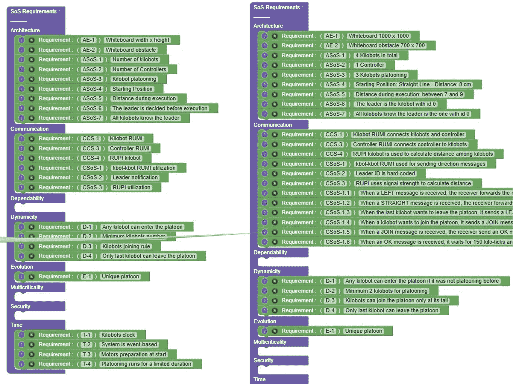

图 15-1b

模型（续）

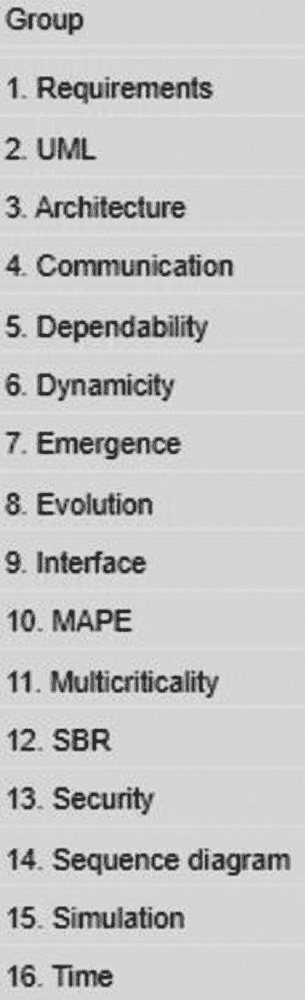

图 15-1a

模型

## 15.6 总结

该编队项目有助于您设计和实现信息物理系统。同样的概念可用于设计现实世界中的任何信息物理系统。Kilobot 的运动展示了信息物理系统的组成部分及其特性。本章总结了与信息物理系统相关的项目。到目前为止，您已经了解了如何开发区块链和分布式系统。在下一章中，您将学习区块链和分布式信息物理系统的未来。

脚注 1

# 16. 区块链技术与分布式系统的未来范围及 B-Coin 项目

区块链系统因其解决了分布式系统中的许多安全问题，已吸引了包括金融、医疗、公用事业、房地产和政府在内的众多行业利益相关者。随着商业、政府和军事部门对其更加熟悉，公有区块链将在网络安全和物联网（IoT）安全中发挥重要作用。同时，在将公有区块链集成到现有的核心云和物联网设备之前，需要解决其存在的安全和隐私问题。^(¹³)

区块链系统的发展将带来与智能物联网相关的新问题，包括信任、安全和隐私。学术界和商界正在合作创建区块链平台，以解决这些紧迫的云和物联网安全问题。¹

我们现在知道，区块链平台解决了云和物联网系统中的诸多问题，例如基于云的数据验证、信息共享、云存储、智能车辆、物联网公共交通安全性、攻击面分析、双重支付预防、去信任化平台安全性、故障共识协议、统计数据和性能指标。

军事和商业组织也已使用云计算技术来实现数据存储、按需计算和动态配置。云服务的生态系统多样且动态。由于它们集成了来自多个供应商的多种硬件和软件组件，因此需要互操作性。

## 16.1 区块链与物联网安全

车辆、基础设施、家庭监控、智能医疗成像和可穿戴电子设备都已将物联网（IoT）作为优化网络空间与物理世界之间互联的主要方式。在物联网环境中，安全性仍然是一个主要问题。尽管近年来信息技术领域的安全性取得了显著进步，但应用层面的安全性仍然是一个开放的研究课题。


### 16.1.1 区块链在物联网中的实现与用例

作为支持加密货币（尤其是比特币）的底层技术，分布式账本技术被称为区块链。它已被应用于多个行业，尤其是在零售业中，用于更轻松、更安全地推动商品在供应链中的流转；在医疗领域，则用于维护合同、临床研究以及药品本身的完整性。

通过将区块链融入这些及其他行业，产品质量得到了持续监控。此外，一个专注于区块链的研究中心已经成立，旨在推动该技术的开发与商业化，并挖掘其在变革物联网生态系统方面的潜力。

### 16.1.2 将区块链集成到物联网中的挑战

物联网区块链正获得越来越多的关注，但它并非没有挑战。首先，区块链的核心概念是已完成活动的链条。通过存储对先前操作的引用来创建链，在比特币中这些操作被称为*区块*。然而，创建区块是一项计算密集型任务，需要多个处理器和大量时间。由于单个区块本身就很难创建，操纵它将变得更加复杂——你必须伪造前一个区块，然后沿着你所创建的链条对其进行修改。

## 16.2 安全建议

如果管理得当，区块链可以显著降低成本并提高物联网系统的效率。然而，在支持物联网的工作场所中，技术采纳远未达到理想状态。例如，预计到 2020 年，运营中的区块链账本只有 10%会集成嵌入式技术。此外，大多数物联网系统在计算能力足以处理负载之前，还有很长的路要走。

物联网用户，无论是个人还是公司，都应寻求多层安全防护，即实现从网关到端点的端到端安全，能够防范潜在的网络攻击和入侵，同时及时进行软件升级以避免停机。这包括以下内容：

- **更改默认凭据**。已发现物联网僵尸网络使用制造商默认凭据来连接链接设备。为降低设备被入侵的风险，建议用户启用安全密码，并使用唯一且复杂的密码。
- **加强路由器安全**。弱路由器会使网络易受攻击。使用安全管理解决方案来保护路由器，有助于用户跟踪所有连接的设备，同时保护隐私和生产力。
- **配置安全设备**。必须评估并修改设备的默认设置以满足用户需求。为了提高安全性，个性化定制功能并关闭不需要的功能是个好主意。监控网络流量。主动监控互联网上的异常行为可以帮助消费者避免恶意攻击。安全解决方案提供的实时扫描也可以用于自动、有效地识别恶意软件。
- **实施额外的安全措施**。为提供额外保护，用户应激活防火墙并使用 Wi-Fi 保护访问 II 安全协议。基于网络信誉和应用程序控制的技术也能提供更大的网络可见性。

## 16.3 区块链安全与隐私

区块链网络可能被利用安全与隐私威胁。多个章节描述了攻击面，识别了共识协议中的漏洞，讨论了无需许可和需要许可的区块链所面临的隐私与安全威胁，诊断了防御双重支付的问题，并隔离了区块链技术采用或研究人员提出以降低风险的有效防御措施。

通过密码学，加密数字货币生态系统中的所有现有货币在任何时刻都拥有基于区块链的文档所有权。一旦交易被其他网络成员或节点确认并通过加密验证，它就会被存储在区块链上的一个“区块”中。

交易的时间、先前的交易以及交易详情都存储在一个区块中。事件按时间顺序保存，一旦作为区块录入就无法更改。自比特币诞生以及区块链技术首次应用以来，这项技术已刺激了更多加密货币和应用的发展。

由于去中心化，数据不像传统系统那样由单一组织验证和控制。相反，连接到网络的每个节点或计算机都会验证交易的真实性。在区块链技术中，密码学用于保护和验证交易与数据。

随着技术使用的增加，数据泄露也变得越来越普遍。个人数据和信息被存储、滥用和误用，对隐私构成了威胁。许多人倡导广泛使用区块链技术，因为它可以增强用户隐私、数据安全性和数据所有权。

## 16.4 未来展望

尽管市场上有许多区块链系统，并且针对特定的区块链方面正在进行大量的研究和开发，但还需要在以下类别中进行进一步的研究。

### 16.4.1 区块链架构：私有、公有或混合公有区块链设计

交易以去中心化的方式执行。然而，由于对隐私、性能和响应时间的担忧，商业企业不愿将公有区块链整合到其企业解决方案中。为了解决这些问题，需要在公有区块链系统中进行更多的研发。

与此同时，企业参与者正逐渐转向私有/许可共识机制。根据治理类型的不同，这种架构可能从单个成员到控制区块链平台的联盟不等。在这些区块链平台上验证交易的架构、协议或方法都包含管理组件。

### 16.4.2 激励机制

在比特币中，加入区块链平台有金钱激励；然而，在诸如溯源和身份管理等用例中，并没有金钱激励。为了实现最大程度的参与，激励结构必须包含在协议中。

为了确保区块链协议能够为用例最大化收益，激励设计机制可以从用例中生成。虽然公有区块链的信任管理可以防止操纵或欺诈，但在架构中纳入具有反欺诈或反操纵特性的激励机制至关重要。激励参与所涉及的过程需要开发理论模型。

### 16.4.3 数据隐私

由于区块链交易是公开的，可以使用数据分析技术来分析其中包含的海量数据。这项研究可能会泄露参与者的身份以及他们执行过的具体交易。隐身地址、同态加密和零知识证明是用于解决公有区块链系统中隐私问题的方法之一。要达到理想的匿名水平，需要综合运用多种方法。


## 16.5 对区块链持有现实预期

区块链技术受到关注已有一段时间，或许可以说，尽管这是一项复杂技术，但它已成为了一个“主流”话题。通常很少聚焦此类创新技术的大型报纸、广播和电视节目，也已着手探讨区块链技术问题。在许多情况下，区块链技术被当作传统技术从未真正满足过的问题与需求的“解决方案”。不仅企业，还有消费者，对区块链技术的期望都大大提高了。一方面，这种情况有利于讨论和增长；但另一方面，也造成了一种危险局面，因为当今被归功于区块链技术的某些“有益效果”，实际上是误解的结果。需要强调的是，区块链技术并不能解决我们所有的问题。以下章节将讨论其中的一些问题。

## 16.6 食品认证

在农业食品领域，区块链技术获得了越来越多的共识，这恰恰是因为它能为通常复杂且分散的供应链提供可靠性保障——这不仅源于企业规模，也源于相关组织或国家的文化。区块链技术保证了伴随生产全过程的数据的确定性、不可篡改性和透明性。

我们绝不能认为区块链本身就是一种质量保证，能够“自行”不仅保证认证，还保证产品质量。区块链技术为所有参与者认证数据，并保证其身份和透明度。但是，如果原始数据无法正确代表投入生产的产品，如果这些数据一开始就是“错误的”，区块链技术并不能纠正它。相反，区块链确保这些“错误”的数据在整个供应链中保持原样。正如俗话所说：“垃圾进，垃圾出”。

区块链的透明性是一个可能的纠正手段，因为每个人都能看到数据，每个人（如果有能力）都能查明其价值并提出更正。区块链技术为所有参与者保证了管理该数据的过程。

## 16.7 智能合约与公证人

*智能合约*在与传统合同规则比较时，可能会引起一些混淆。然而，通过简要回顾民法典所规范的合同基本要件，很容易发现大量相似之处，这些相似之处可能构成将智能合约纳入传统合同规则体系的法律基础。^(¹⁴)

可以说，该原则的作用空间与私人自治的作用空间是重合的；作为一项协议，合同的定义本身就是一种双方法律行为。然而，也存在一些可被归类于合同法律制度的单方法律行为。在这种情况下，它们是法律领域的非侵入性单方行为，因为它们“保持了相关主体在已创设情形下完全自我决定的权力”。^(¹⁵) 这类合同的例子包括授权委托书、遗嘱和弃权声明。

### 16.7.1 将区块链技术应用于智能合约

在此节点上，需要简要描述区块链技术如何与智能合约相关联，以及合约如何在物理上呈现出直接的技术形态，而非自然语言形态。

首先，重要的是要注意，从一开始就明确需要双方的参与。双方将通过共同协议决定合同的条件。其结构的核心可视为由三个主要元素组成：账户（也称为双方身份）、拥有的资产（资产）以及合约。

我们使用“账户”一词来指代一个地址，该地址可用于识别某人、某个实体或一组个人，他们将与本章节之前提到的所谓“账本”进行交互。而产品，通常被称为“资产”，则包含有形和无形物品，以及发票和转移的价值单位。

资产可以更广义地定义为一系列由一方或多方交易和持有的价值集合，这些方拥有允许结算合约的加密密钥。合约，定义为调解各方之间现金和数据传输的一系列逻辑活动，是最后一个先决条件（账户）。

这些账户通过向主账本发送更新（其中包含已批准的交易）来改变其状态。交易在被收集并排序成区块之前，会进行传输，并对其完整性和数据完整性进行验证。

网络上的账户持有者对所有账本上的交易进行数字签名。这赋予了账本三个区别于传统网络流量的关键特性：

-   **身份验证**：恶意活动无法冒用不属于该交易的账户。
-   **交易完整性**：交易一旦发生，其接收记录便无法更改。
-   **不可篡改性**：对交易的任何修改都将使发行者的签名无效，并使交易作废。

每条条款在被添加到链上之前，都经过双方协商和接受。一旦条款被接受，它就被放入第一个区块，并从明文语言转换为系统能够理解的加密语言。

双方的实际操作是，使用他们的加密密钥输入旨在履行合约的条款，以及在违约情况下系统将自动执行的行动。如果系统记录了条款中所提及事实的履行，合约将向前推进；反之，如果条款内容被违反，合约将采用技术手段，实施由各方单独或法律提供的补救措施。

如果你发现自己处于这样一种情况：一方声称拥有包含某些条款的合同，而另一方声称拥有相同合同，但条款不同，那么利用“备份”方法将是不可行的。与手机、电脑等其他日常技术一样，区块链也拥有数据存储机制。

毫无疑问，基于区块链技术的智能合约能够为企业、组织和公共管理部门带来巨大利益。前景是毋庸置疑的，保险、物流和采购等领域的行业已经从中获得了重要收益。在此，在从现实、物理世界向数字世界过渡的阶段，在确保主体、个人或公司提供正确信息的确定性方面，仍然存在一个需要极度关注的点。

如何管理这一过渡，其方案仍在争议之中。公证人的职能可以在为安全数据提供保证方面发挥重要作用。再次强调，区块链并不判定信息的“真实性”或质量。区块链保证其不可破坏性，保护数据免受可能的侵犯，并向所有相关参与者透明地公开变更。通过这种方式，区块链加速了对“错误”的任何识别，但它并非一个能够保证质量的“智能系统”。


### 16.7.2 在市场中开发区块链

区块链技术是近年来出现的一种现象，经历了一系列重要的加速发展，并引发了众多期待。与此同时，开发与实施区块链并非易事，没有任何一家公司能独立完成。对于所有参与者——生产者、企业以及用户组织而言，区块链是一种协作型的生态系统现象。

如果说一方面区块链受到的关注度非常高，那么另一方面，实际在企业与组织中投入生产的具体项目案例数量仍然相当稀少。

### 16.7.3 区块链的地缘政治

区块链具有革命性的特征，同时也具备颠覆性的特质，这可能会引发不稳定性。基于这一原因以及其他因素，各国对待区块链技术的方式大相径庭。有些国家或地区拥抱了它（例如迪拜、爱沙尼亚和新加坡），而另一些国家则采取非常审慎务实的做法，比如深入研究适用于管理此类创新现象的新法规（例如瑞士、奥地利和马耳他）。

此外还有欧洲，它正在寻找自己的定位，并通过一系列举措来实现这一目标，其中包括欧洲区块链合作伙伴关系。也有一些国家正以怀疑的态度看待区块链。

### 16.7.4 书籍、白皮书与区块链

随着区块链的出现，大量出版、研究和深度分析活动随之兴起，涌现出丰富的书籍和白皮书。在区块链书籍部分，你可以找到专门与区块链相关的著作。在书籍与白皮书部分，你将获取关于工业 4.0 与数字化转型潜力的信息，包括与企业数字化转型问题相关的精选文本。

## 16.8 比特币（B 币）示例项目

该项目展示了一种基于区块链技术、用 Python 实现的加密货币。这是一个简单的区块链加密货币，仅供教育用途使用。该区块链网络没有中央权威机构，其中的信息对所有人公开可见。回顾一下区块链技术的主要特性：

*   去中心化
*   透明性
*   不可篡改性

在这个简单的区块链实现中，B 币是构建在区块链实现之上的。你可以在原始论文中找到更多信息，该论文位于比特币原始代码库：[`https://github.com/bitcoin`](https://github.com/bitcoin)。

以下是项目的运行要求：

*   Python 3.1 或 3.2
*   Flask 或 Django
*   Requests 库
*   Postman

### 16.8.1 项目代码

以下任务使用 `bitcoin.py` 中的代码完成。其中包含一个名为 `blockchain` 的类。请注意，该类创建的区块包含五个字段——`index`、`timestamp`、`proof`、`previous_hash` 和 `transactions`。此外，我们还提供了一种用于挖掘区块的工作量证明机制。目标是使最终哈希值的前四位为零。（参见代码清单 16-1。）

它具有以下函数和方法：

```
#### 添加交易
#### 添加节点
#### 用最长链替换当前链
```

除了这些方法之外，它还具有用于管理区块链中区块的 `POST` 和 `GET` 方法。


#### 创建区块链

```python
class Blockchain:
    def __init__(self):
        # 整个区块链
        self.chain=[]
        # 交易列表
        self.transactions = []
        # 创世区块
        self.create_block(proof= 1 , previous_hash='0')
        # 网络中的节点应保持唯一
        self.nodes = set()
    """
    此类方法用于创建包含五个字段的区块
    索引、时间戳、工作量证明、前一个区块哈希、交易列表
    """
    def create_block(self, proof, previous_hash):
        block={'index' : len(self.chain) + 1,
        'timestamp' : str(datetime.datetime.now()),
        'proof' : proof,
        'previous_hash' : previous_hash,
        'transactions' : self.transactions}
        # 所有交易添加到区块后清空交易列表
        self.transactions = []
        self.chain.append(block)
        return block
    # 获取前一个区块
    def get_previous_block(self):
        return self.chain[-1]
    # 挖矿的工作量证明机制
    # 目标是生成的哈希值以四个零开头
    def proof_of_work(self,previous_proof):
        new_proof = 1
        check_proof = False
        # 创建哈希，检查 new_proof**2 - previous_proof**2 是否以四个 0 开头，否则递增 proof 并继续检查
        while check_proof is False:
            hash_operation = hashlib.sha256(str(new_proof**2 - previous_proof**2).encode()).hexdigest()
            if hash_operation[:4]=='0000':
                check_proof =  True
            else:
                new_proof +=1
        return new_proof
    # 哈希计算
    # json.dumps()将 JSON 对象作为输入并返回字符串
    # hex()函数将字符串转换为字节后返回十六进制字符串
    def hash(self,block):
        encoded_block = json.dumps(block, sort_keys = True).encode()
        return hashlib.sha256(encoded_block).hexdigest()
    # 验证区块是否有效
    def is_chain_valid(self, block):
        previous_block = self.chain[0]
        block_index=1
        while block_index  max_length and self.is_chain_valid(chain):
                max_length = length
                longest_chain = chain
        # 如果找到最长链，则将当前链替换为最长链
        if longest_chain:
            self.chain = longest_chain
            return True
        return False
    # 创建 Web 应用
    app = Flask(__name__)
    # 为节点创建端口 1000 地址
    # uuid4()随机生成全局唯一标识符（UUID - 使用同步方法生成，确保两个进程不会获取相同 UUID）
    node_address = str(uuid4()).replace('-', '')
    # 组装区块链
    blockchain=Blockchain()
    # 挖矿
    @app.route('/mine_block', methods = ['GET'])
    def mine_block():
        """
        使用前一个区块的工作量证明来计算新的工作量证明，然后利用该证明和之前哈希构建当前区块
        """
        previous_block = blockchain.get_previous_block()
        previous_proof = previous_block['proof']
        proof = blockchain.proof_of_work(previous_proof)
        previous_hash = blockchain.hash(previous_block)
        # 挖出区块后可奖励 Bcoin，可选择接收区块的矿工
        blockchain.add_transaction(sender = node_address, receiver = 'Bharathi', amount = 1)
        block = blockchain.create_block(proof, previous_hash)
        # 返回响应
        response = {'message' : '成功挖掘区块，恭喜！',
        'index' : block['index'],
        'timestamp' : block['timestamp'],
        'proof' : block['proof'],
        'previous_hash' : block['previous_hash'],
        'transactions' : block['transactions']}
        # 以 application/json MIME 类型返回所提供参数的 JSON 表示
        return jsonify(response), 200
    # 获取区块链
    @app.route('/get_chain', methods = ['GET'])
    def get_chain():
        # 返回响应
        response = {'chain' : blockchain.chain,
        'length' : len(blockchain.chain)}
        return jsonify(response), 200
    # 验证区块链是否有效
    @app.route('/is_valid', methods = ['GET'])
    def is_valid():
        is_valid = blockchain.is_chain_valid(blockchain.chain)
        if is_valid:
            response = {'message': '一切正常，区块链正确无误。'}
        else:
            response = {'message': '发现问题，区块链不可信。'}
        return jsonify(response), 200
    # 向区块链添加新交易
    @app.route('/add_transaction', methods = ['POST'])
    def add_transaction():
        # 以 JSON 格式向 Postman 发送交易，因此也以 JSON 格式接收
        json = request.get_json()
        # 检查是否包含所有键
        transaction_keys = ['sender', 'receiver', 'amount']
        if not all(key in json for key in transaction_keys):
            return '交易部分元素缺失', 400
        # 如果包含所有组件，则添加交易并返回已添加的响应
        index = blockchain.add_transaction(json['sender'],json['receiver'],json['amount'])
        response = {'message' : f'该交易将添加到区块 {index}'}
        return jsonify(response), 201
    # 区块链正在变得更加去中心化
    # 连接新节点
    @app.route('/connect_node', methods = ['POST'])
    def connect_node():
        # 手动连接所有其他节点
        json = request.get_json()
        nodes = json.get('nodes')
        # 如果节点字段为空则返回无节点
        if nodes is None:
            return '无节点', 400
        # 手动添加节点，对每个节点重复此操作
        # 由于节点是集合，单独添加每个节点只会包含唯一值
        for node in nodes:
            blockchain.add_node(node)
        # 显示节点并标记为全部连接完成
        response = {'message' : '所有节点现已连接。节点已成功添加到比特币区块链。',
        'total_nodes' : list(blockchain.nodes)}
        # http 201 已创建
        return jsonify(response), 201
    # 用最长链替换当前链
    @app.route('/replace_chain', methods = ['GET'])
    def replace_chain():
        # 如果存在更长链，则显示最长链，否则显示原链
        is_chain_replaced = blockchain.replace_chain()
        if is_chain_replaced:
            response = {'message': '由于节点不同，已使用最长链替换当前链。',
            'new_chain' : blockchain.chain}
        else:
            response = {'message': '一切正常，当前链即为最长链。', 'new_chain' : blockchain.chain}
        return jsonify(response), 200
    # 在端口上运行应用
    app.run(host = '0.0.0.0', port = 1001)
```

**清单 16-1** `bitcoin.py`

接下来的 Python 文件是 `bcoin-node-1001.py`、`bcoin-node-1002.py` 和 `bcoin-node-1003.py`。这些文件代表每个节点（比特币 1001、1002 和 1003）。

* `bcoin-node-1001.py`：包含一个名为 `Blockchain` 的类，用于管理区块链中的节点（或 `bitcoin node-1001`）。此外，它还包含创建区块、添加交易和验证区块的功能。除此之外，主块还包含 `GET` 和 `POST` 方法（参见清单 16-2）。

* `bcoin-node-1002.py`：包含一个名为 `Blockchain` 的类，用于管理区块链中的节点（或 `bitcoin node-1002`）。此外，它还包含创建区块、添加交易和验证区块的功能。除此之外，主块还包含 `GET` 和 `POST` 方法（参见清单 16-3）。

* `bcoin-node-1003.py`：包含一个名为 `Blockchain` 的类，用于管理区块链中的节点（或 `bitcoin node-1003`）。此外，它还包含创建区块、添加交易和验证区块的功能。除此之外，主块还包含 `GET` 和 `POST` 方法（参见清单 16-4）。

以下代码清单展示了三个不同比特币的 Python 代码。


```python
class Blockchain:
def __init__(self):
self.chain=[]
self.transactions = []
self.create_block(proof= 1 , previous_hash='0')
self.nodes = set()
def create_block(self, proof, previous_hash):
block={'index' : len(self.chain) + 1,
'timestamp' : str(datetime.datetime.now()),
'proof' : proof,
'previous_hash' : previous_hash,
'transactions' : self.transactions}
self.transactions = []
self.chain.append(block)
return block
def get_previous_block(self):
return self.chain[-1]
def proof_of_work(self,previous_proof):
new_proof = 1
check_proof = False
while check_proof is False:
hash_operation = hashlib.sha256(str(new_proof**2 - previous_proof**2).encode()).hexdigest()
if hash_operation[:4]=='0000':
check_proof =  True
else:
new_proof +=1
return new_proof
def hash(self,block):
encoded_block = json.dumps(block, sort_keys = True).encode()
return hashlib.sha256(encoded_block).hexdigest()
def is_chain_valid(self, block):
previous_block = self.chain[0]
block_index=1
while block_index  max_length and self.is_chain_valid(chain):
max_length = length
longest_chain = chain
if longest_chain:
self.chain = longest_chain
return True
return False
app = Flask(__name__)
node_address = str(uuid4()).replace('-', '')
blockchain=Blockchain()
@app.route('/mine_block', methods = ['GET'])
def mine_block():
previous_block = blockchain.get_previous_block()
previous_proof = previous_block['proof']
proof = blockchain.proof_of_work(previous_proof)
previous_hash = blockchain.hash(previous_block)
blockchain.add_transaction(sender = node_address, receiver = 'Meghna', amount = 1)
block = blockchain.create_block(proof, previous_hash)
response = {'message' : '你刚刚挖到了一个区块，恭喜！！',
'index' : block['index'],
'timestamp' : block['timestamp'],
'proof' : block['proof'],
'previous_hash' : block['previous_hash'],
'transactions' : block['transactions']}
return jsonify(response), 200
@app.route('/get_chain', methods = ['GET'])
def get_chain():
response = {'chain' : blockchain.chain,
'length' : len(blockchain.chain)}
return jsonify(response), 200
@app.route('/is_valid', methods = ['GET'])
def is_valid():
is_valid = blockchain.is_chain_valid(blockchain.chain)
if is_valid:
response = {'message': '一切正常。区块链是正确的。'}
else:
response = {'message': '我们遇到了问题。区块链不可信..'}
return jsonify(response), 200
@app.route('/add_transaction', methods = ['POST'])
def add_transaction():
json = request.get_json()
transaction_keys = ['sender', 'receiver', 'amount']
if not all(key in json for key in transaction_keys):
return '交易的部分元素缺失', 400
index = blockchain.add_transaction(json['sender'],json['receiver'],json['amount'])
response = {'message' : f'此交易将被添加到区块 {index}'}
return jsonify(response), 201
@app.route('/connect_node', methods = ['POST'])
def connect_node():
json = request.get_json()
nodes = json.get('nodes')
if nodes is None:
return '没有节点', 400
for node in nodes:
blockchain.add_node(node)
response = {'message' : '所有节点现已连接在一起。该节点已被添加到 Bcoin 区块链中。',
'total_nodes' : list(blockchain.nodes)}
return jsonify(response), 201
@app.route('/replace_chain', methods = ['GET'])
def replace_chain():
is_chain_replaced = blockchain.replace_chain()
if is_chain_replaced:
response = {'message': '由于节点不同，使用最长链替换当前链..',
'new_chain' : blockchain.chain}
else:
response = {'message': '一切正常。当前链是最长的。',
'new_chain' : blockchain.chain}
return jsonify(response), 200
app.run(host = '0.0.0.0', port = 1003)
***************************************************************************
清单 16-4
bcoin-node-1003.py
```

```python
class Blockchain:
def __init__(self):
self.chain=[]
self.transactions = []
self.create_block(proof= 1 , previous_hash='0')
self.nodes = set()
def create_block(self, proof, previous_hash):
block={'index' : len(self.chain) + 1,
'timestamp' : str(datetime.datetime.now()),
'proof' : proof,
'previous_hash' : previous_hash,
'transactions' : self.transactions}
self.transactions = []
self.chain.append(block)
return block
def get_previous_block(self):
return self.chain[-1]
def proof_of_work(self,previous_proof):
new_proof = 1
check_proof = False
while check_proof is False:
hash_operation = hashlib.sha256(str(new_proof**2 - previous_proof**2).encode()).hexdigest()
if hash_operation[:4]=='0000':
check_proof =  True
else:
new_proof +=1
return new_proof
def hash(self,block):
encoded_block = json.dumps(block, sort_keys = True).encode()
return hashlib.sha256(encoded_block).hexdigest()
def is_chain_valid(self, block):
previous_block = self.chain[0]
block_index=1
while block_index  max_length and self.is_chain_valid(chain):
max_length = length
longest_chain = chain
if longest_chain:
self.chain = longest_chain
return True
return False
app = Flask(__name__)
node_address = str(uuid4()).replace('-', '')
blockchain=Blockchain()
@app.route('/mine_block', methods = ['GET'])
def mine_block():
previous_block = blockchain.get_previous_block()
previous_proof = previous_block['proof']
proof = blockchain.proof_of_work(previous_proof)
previous_hash = blockchain.hash(previous_block)
blockchain.add_transaction(sender = node_address, receiver = 'Meghna', amount = 1)
block = blockchain.create_block(proof, previous_hash)
response = {'message' : '你刚刚挖到了一个区块，恭喜！',
'index' : block['index'],
'timestamp' : block['timestamp'],
'proof' : block['proof'],
'previous_hash' : block['previous_hash'],
'transactions' : block['transactions']}
return jsonify(response), 200
@app.route('/get_chain', methods = ['GET'])
def get_chain():
response = {'chain' : blockchain.chain,
'length' : len(blockchain.chain)}
return jsonify(response), 200
@app.route('/is_valid', methods = ['GET'])
def is_valid():
is_valid = blockchain.is_chain_valid(blockchain.chain)
if is_valid:
response = {'message': '一切正常。区块链是正确的。'}
else:
response = {'message': '我们遇到了问题。区块链不可信..'}
return jsonify(response), 200
@app.route('/add_transaction', methods = ['POST'])
def add_transaction():
json = request.get_json()
transaction_keys = ['sender', 'receiver', 'amount']
if not all(key in json for key in transaction_keys):
return '缺少某些交易组件。', 400
index = blockchain.add_transaction(json['sender'],json['receiver'],json['amount'])
response = {'message' : f'此交易将被添加到区块 {index}'}
return jsonify(response), 201
@app.route('/connect_node', methods = ['POST'])
def connect_node():
json = request.get_json()
nodes = json.get('nodes')
if nodes is None:
return '没有节点', 400
for node in nodes:
blockchain.add_node(node)
response = {'message' : '所有节点现已连接在一起。该节点已被添加到比特币区块链中。',
'total_nodes' : list(blockchain.nodes)}
return jsonify(response), 201
@app.route('/replace_chain', methods = ['GET'])
def replace_chain():
is_chain_replaced = blockchain.replace_chain()
if is_chain_replaced:
response = {'message': '由于节点不同，使用最长链替换当前链..',
'new_chain' : blockchain.chain}
else:
response = {'message': '一切似乎正常。这是最长的链。',
'new_chain' : blockchain.chain}
return jsonify(response), 200
app.run(host = '0.0.0.0', port = 1002)
清单 16-3
bcoin-node-1002.py
```


#### 这是区块链的 Python 类

```python
class Blockchain:
    def __init__(self):
        self.chain = []
        self.transactions = []
        self.create_block(proof=1, previous_hash='0')
        self.nodes = set()

    # 创建区块的函数
    def create_block(self, proof, previous_hash):
        block = {
            'index': len(self.chain) + 1,
            'timestamp': str(datetime.datetime.now()),
            'proof': proof,
            'previous_hash': previous_hash,
            'transactions': self.transactions
        }
        self.transactions = []
        self.chain.append(block)
        return block

    def get_previous_block(self):
        return self.chain[-1]

    def proof_of_work(self, previous_proof):
        new_proof = 1
        check_proof = False
        while check_proof is False:
            hash_operation = hashlib.sha256(
                str(new_proof**2 - previous_proof**2).encode()
            ).hexdigest()
            if hash_operation[:4] == '0000':
                check_proof = True
            else:
                new_proof += 1
        return new_proof

    def hash(self, block):
        encoded_block = json.dumps(block, sort_keys=True).encode()
        return hashlib.sha256(encoded_block).hexdigest()

    def is_chain_valid(self, block):
        previous_block = self.chain[0]
        block_index = 1
        while block_index < len(self.chain):
            block = self.chain[block_index]
            if block['previous_hash'] != self.hash(previous_block):
                return False
            previous_proof = previous_block['proof']
            proof = block['proof']
            hash_operation = hashlib.sha256(
                str(proof**2 - previous_proof**2).encode()
            ).hexdigest()
            if hash_operation[:4] != '0000':
                return False
            previous_block = block
            block_index += 1
        return True

    def add_transaction(self, sender, receiver, amount):
        self.transactions.append({
            'sender': sender,
            'receiver': receiver,
            'amount': amount
        })
        previous_block = self.get_previous_block()
        return previous_block['index'] + 1

    def add_node(self, address):
        self.nodes.add(address)

    def replace_chain(self):
        network = self.nodes
        longest_chain = None
        max_length = len(self.chain)
        for node in network:
            response = requests.get(f'http://{node}/get_chain')
            if response.status_code == 200:
                length = response.json()['length']
                chain = response.json()['chain']
                if length > max_length and self.is_chain_valid(chain):
                    max_length = length
                    longest_chain = chain
        if longest_chain:
            self.chain = longest_chain
            return True
        return False


app = Flask(__name__)
node_address = str(uuid4()).replace('-', '')
blockchain = Blockchain()


@app.route('/mine_block', methods=['GET'])
def mine_block():
    previous_block = blockchain.get_previous_block()
    previous_proof = previous_block['proof']
    proof = blockchain.proof_of_work(previous_proof)
    previous_hash = blockchain.hash(previous_block)
    blockchain.add_transaction(
        sender=node_address, receiver='Bharathi', amount=1
    )
    block = blockchain.create_block(proof, previous_hash)
    response = {
        'message': '恭喜，你刚刚挖掘了一个区块！',
        'index': block['index'],
        'timestamp': block['timestamp'],
        'proof': block['proof'],
        'previous_hash': block['previous_hash'],
        'transactions': block['transactions']
    }
    return jsonify(response), 200


#### 区块链的 GET 方法
@app.route('/get_chain', methods=['GET'])
def get_chain():
    response = {
        'chain': blockchain.chain,
        'length': len(blockchain.chain)
    }
    return jsonify(response), 200


#### 区块链的验证方法
@app.route('/is_valid', methods=['GET'])
def is_valid():
    is_valid = blockchain.is_chain_valid(blockchain.chain)
    if is_valid:
        response = {'message': '一切正常。区块链是正确的。'}
    else:
        response = {'message': '我们发现了一个问题。区块链不可信。'}
    return jsonify(response), 200


#### 区块链的 POST 方法
@app.route('/add_transaction', methods=['POST'])
def add_transaction():
    json = request.get_json()
    transaction_keys = ['sender', 'receiver', 'amount']
    if not all(key in json for key in transaction_keys):
        return '缺少某些交易组件。', 400
    index = blockchain.add_transaction(
        json['sender'], json['receiver'], json['amount']
    )
    response = {
        'message': f'此交易将被添加到区块 {index} 中'
    }
    return jsonify(response), 201


#### 连接到节点
@app.route('/connect_node', methods=['POST'])
def connect_node():
    json = request.get_json()
    nodes = json.get('nodes')
    if nodes is None:
        return '没有节点', 400
    for node in nodes:
        blockchain.add_node(node)
    response = {
        'message': '所有节点现已连接在一起。该节点已添加到比特币区块链中',
        'total_nodes': list(blockchain.nodes)
    }
    return jsonify(response), 201


#### 更换链的方法
@app.route('/replace_chain', methods=['GET'])
def replace_chain():
    is_chain_replaced = blockchain.replace_chain()
    if is_chain_replaced:
        response = {
            'message': '由于节点不同，因此使用最长的链来替换当前链。',
            'new_chain': blockchain.chain
        }
    else:
        response = {
            'message': '一切正常。区块链是正确的。当前链是最长的链',
            'new_chain': blockchain.chain
        }
    return jsonify(response), 200


app.run(host='0.0.0.0', port=1001)
```

*列表 16-2* `bcoin-node-1001.py`

示例节点地址（列表 16-5 中的`nodes.json`）和交易格式显示在`.json`文件（列表 16-6 中的`transaction.json`）中。

```json
{
    "nodes": [
        "http://127.0.0.1:1001",
        "http://127.0.0.1:1002",
        "http://127.0.0.1:1003"
    ]
}
```

*列表 16-5* `nodes.json`

要添加交易，请从`transaction.json`中复制内容，并以 JSON 格式`POST`到 Postman 中的`http://127.0.0.1:1001/add_transaction`，如列表 16-6 所示。

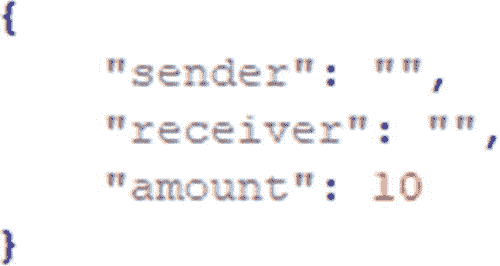

*列表 16-6* `transaction.json`

---

### 16.8.2 将区块链转变为加密货币

要将区块链转变为加密货币，请执行以下步骤。首先，您必须添加一笔交易：

```python
self.transactions = []  # 在创建区块函数之前要创建的交易
self.create_block Function
然后：add_transaction(self, sender, receiver, amount)
```

现在，创建一个共识机制：

```python
self.nodes = set()        # 这是用于 init 方法
add_node(self, address)   # 用于添加新节点的 add node 方法
replace_chain(self)       # 用长链替换当前链
```

现在，您必须去中心化区块链，并对其应用共识机制和交易。在这个示例币种中，有三个节点。它们使用以下列出的地址和端口（Flask）：

- 节点 1：`http://127.0.0.1:1001/`
- 节点 2：`http://127.0.0.1:1002/`
- 节点 3：`http://127.0.0.1:1003/`

为了去中心化比特币网络、挖掘区块、发送交易并应用共识机制，创建了代码（`bitcoin.py`）的副本：

- 节点 1：`bitcoin_node_1_1001.py`
- 节点 2：`bitcoin_node_2_1002.py`
- 节点 3：`bitcoin_node_3_1003.py`

一旦应用程序在 Flask 上运行，就会使用 Postman 请求来查询区块链、创建交易并应用共识机制。在此案例中，使用了端口 1001（节点 1）。

### 16.8.3 GET 方法

- 获取链：`http://127.0.0.1:1001/get_chain`
- 挖掘区块：`http://127.0.0.1:1001/mine_block`
- 更换链：`http://127.0.0.1:1001/replace_chain`

### 16.8.4 POST 方法

- 添加交易：`http://127.0.0.1:1001/add_transaction`
- 连接节点：`http://127.0.0.1:1001/connect_node`

源代码：`https://github.com/JosephThachilGeorge/Bitcoin`

通过查看这个项目，您已经了解了比特币的概念以及如何挖掘它。那么问题是，谁是矿工？


## 16.9 节点的功能

比特币网络由节点构成，这些节点是借助比特币开源软件相互通信的计算机。

节点可以具有不同的功能：某些节点验证交易是否符合规则，其他节点则将交易传播给其他节点。本文中关注的节点被称为“矿工”，它们负责创建被称为区块链的区块链条，所有交易都会被永久记录在其中。

现在，让我们看看矿工做些什么。挖矿节点由私人或公司拥有，他们投入巨大资源来解决一个只能通过反复尝试才能解决的数学问题。任何人都可以挖掘比特币；让我们看看你需要具备什么条件：

- 挖矿需要专门的设备；通常，用于视频游戏的显卡就足够了。然而，现在已有专门开发的强大处理器（`ASICS`），用于计算比特币的 `SHA-256` 方程，以提高获胜几率。

- 第二个条件是产生或购买大量电力，为计算机和相关的冷却设备供电；事实上，运行这些机器会使周围环境升温，你必须维持理想的温度以保持机器的物理完整性。

- 下一步是规划运行挖矿矿场需要多少小时。比特币矿场的员工还负责机器的维护和更换，这些机器在满负荷计算能力运行时，会迅速发生故障。

所有这些都发生与其他矿工竞争的过程中。

一旦操作开始，你的计算器只会一遍又一遍地计算同一个方程（`SHA-256`），从比特币网络获取数据作为输入，然后尝试向方程中添加一个新数字，看看输出是否符合协议的要求。结果是一个如下所示的十六进制数：


在第一次尝试时，挖矿机器将数字 1 插入到 `SHA-256` 方程中，并检查输出，看该数字前面有多少个零。第二次尝试时，它使用同一组交易重新计算 `SHA-256`，并添加数字 2。第三次尝试时，它添加数字 3，依此类推，直到获得一个以零开头的数字。结果完全是随机的。这些都是巨大的数字；实际上，大约每隔 10 分钟，世界上就有一台计算机会发现当时协议所要求的精确零位数。

当一个矿工发现一个可行的解决方案时，整个计算机网络容易遭受交易阻塞。由于该结论在数学上是可重复和可验证的，所有矿工都可以快速而简单地检查它。被挖掘区块中包含的交易是 100%合法的，并且可以添加到区块链中。

矿工是在其计算机上安装了比特币的节点或用户，但除了验证和传播交易之外，矿工还承担着消耗能量来解决数学难题的责任，该难题是获得区块链写入授权的基础。

这些特定的节点贡献出可用的能源资源，以赚取奖励，同时确保在没有中央协调机构的情况下，系统能够防范双重支付。

### 16.9.1  组合有效交易以创建新区块候选

一旦你发送交易，最近的节点会立即检查你是否有足够的资金进行花费。如果此验证通过，交易就会被排队等待矿工执行。一个矿工收集该笔交易，然后将其与以太坊（此处应指网络）中的其他交易组合，形成一个待添加到区块链的交易候选区块。在这个阶段，矿工的工作就是计算出以 0 开头的数字。

### 16.9.2  防御墙上的算力（哈希率）

因为投入系统的哈希算力（计算能力）完全致力于确保不存在欺诈性交易，所以即使是没有在最后一个区块中赢得比特币的矿工，也为比特币的安全做出了贡献。这道防护墙能够防御双重支付以及试图篡改区块链事实的入侵者。

理论上，每个矿工可以拥有一组不同的交易，而第一个使用其选择的交易找到解决方案的矿工，就能将自己的候选区块添加到区块链中。当网络就哪一个区块是最后一个有效区块达成一致后，寻找下一个区块的竞赛就开始了。

如果系统的处理能力足够好，以至于有效区块在不到 10 分钟内就能被发现，那么数学难题的复杂度就会通过增加待求解结果前面的零的个数来提高。如果系统的计算能力不足，并且要求新区块只能每 15 分钟被发现一次，那么系统会通过要求矿工寻找一个前面带有较少零的数字来简化解决方案。

这种技术会根据系统的计算能力调整难度。因此，当计算能力下降时，发现比特币会更容易，更多的人会受到激励去挖矿，从而使系统得以维持。然而，当挖掘比特币变得过于困难时，只有最高效的矿工会留在市场中。这表明，当比特币价格上涨时，哈希率也会随之上涨——价值越高，计算能力越强，安全性也越高。

## 16.10 创造新比特币

比特币是一种货币，为它的创造和维护做出贡献，你就可以通过努力赚取比特币作为回报。每四年，区块奖励会减半。经过十年不间断的活动，目前每 10 分钟产生 6.25 个比特币。除了比特币奖励外，一个成功的矿工还能获得与每笔交易相关的所有手续费。

如你所见，新比特币的数量持续减少；在撰写本文时，自 2009 年以来产生的比特币总数约为 1800 万。

按照这个数学序列继续下去，到 2140 年左右，2100 万个比特币将被全部挖出。


### 16.10.1 去中心化的概念

`矿工`是网络的组成部分和节点，其特殊职责是生成区块链区块并发行新的比特币，确保安全性以防双重支付尝试。

去中心化的概念，或者换句话说，你不需要一个中央协调者来验证所有参与方是否行为正确，这也许是比特币最具革命性的特征之一。

比特币的去中心化协调是如何工作的？答案是“工作量证明”，这是一种就余额状态达成共识的新方法。正如所述，这项工作包括收集交易、生成候选区块，并计算前面带有零的哈希值。`工作量证明`不过是一个巧妙的策略，迫使系统每 10 分钟就比特币余额的状态进行一次协调。

激励机制吸引了愿意投入资源来发现比特币的新矿工，而游戏中的任何参与者都不会有兴趣做出违背比特币网络利益的行为。

矿工们为了赚取比特币而进行大量投资，他们绝不会试图破坏协议的稳健性，因为这样做会导致他们失去所持比特币的全部价值。矿工们很少以低于生产成本的价钱出售他们的比特币。这意味着比特币有一个最低价格，由成功挖出一个比特币的成本决定。

矿工是诚实的，因为欺骗系统最初需要花费大量资金；据预测，重新排列区块链历史来攻击系统将花费 50 亿美元。其次，所有黑客攻击的尝试都将是徒劳的，因为每个节点都有权选择接受或拒绝对其区块链副本的更新。存在双重支付的区块永远不会被诚实节点接受。实际上，攻击者将处于主链之外的另一个区块链上，这个区块链由于包含欺诈数据而毫无价值。

## 16.11 总结

本章讨论了区块链技术和分布式系统的未来范围，并触及了如何利用区块链实现安全交易。B-Coin 项目展示了比特币的工作原理，以及如何利用比特币的概念实现安全交易。

我相信你现在已经理解了比特币的用途。这种数字货币的用途实际上可以是多方面的，并不仅限于围绕它进行的投机。区块链方法因其未来的发展前景也特别令人感兴趣，这些发展可能与我们生活的方方面面相关。既然你已经了解了比特币的工作原理，那么在发现加密货币的道路上，没有什么能阻止你了！

下一章将重点介绍自动驾驶车辆管理系统。

脚注 1 2 3

# 17. 人工智能与区块链监控的自动驾驶车辆管理项目

自动驾驶车辆管理系统是本章的主题。这涉及到在分布式环境中操作车辆或系统。`人工智能`和消息交换（区块链）都出现在这个场景中。同时，在自动驾驶车辆管理方面，我们必须防止灾难性的崩溃。

### 17.1 区块链与人工智能之间的联系

`区块链`和`人工智能`是当前最热门的两个技术发展。尽管它们的发展伙伴和实现方式截然不同，但科学家们一直在争论和研究这两项技术的融合。根据定义，区块链是一个分布式、去中心化、不可篡改的账本，用于存储加密数据。而`人工智能`则是能够基于获取的信息进行分析和判断的引擎或“大脑”¹⁶。

`人工智能`和区块链处于可以相互支持和受益的位置。因为这两项技术都可能以不同方式影响数据，将它们结合起来在逻辑上是合理的，并有可能将数据利用推向新的高度。同时，将机器学习和`人工智能`整合到区块链中，反之亦然，可以改善区块链的基础架构，同时增强`人工智能`的能力。区块链还可以使`人工智能`更加合乎逻辑和易于理解，让开发者能够追踪并理解为何做出特定的深度学习决策。区块链及其账本可以跟踪所有构成深度学习结论的数据和因素（见图 17-1）¹。

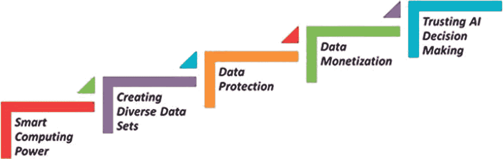

**图 17-1.** 区块链与人工智能

此外，`人工智能`可以比人类甚至传统技术更有效地提高区块链的效率。看一看区块链目前在传统计算机上是如何运行的就能证明这一点，即使完成最基本的活动也需要大量的计算能力¹⁷。

#### 17.1.1 应用中的 AI 与区块链

如今，道路上的汽车数量正在增加。因此，预防交通事故成为社会面临的一个问题。例如，`机器学习`技术在提高道路安全管理系统的整体性能方面特别有用。区块链使用共识方法和智能合约管理节点之间的通信，无需第三方中介。同时，`人工智能`有可能提供与人类思维相当的智能决策机器人²。

基本上，在应用开发和部署中使用区块链和`人工智能`时，我们需要考虑以下两个方面：

- **数据的货币化。** 通过共识算法和智能合约，区块链管理节点间的通信，无需第三方或中介机构的参与。此外，区块链技术促进了网络上的信息共享，这种网络是去中心化、安全、持久、匿名且可信赖的。²
- **利用 AI 进行决策。** `人工智能`，例如`机器学习`算法，对于提高整体车辆安全管理系统的性能非常有帮助。²

#### 17.1.2 AI 在制造实时智能决策机器中的角色

`人工智能`技术使机器能够独立思考，无需人工干预。`人工智能`方法在分析通过安装在车辆驾驶室内的`物联网`设备收集的数据时极为谨慎。在车辆中的实时决策操作中，多种机器学习技术都至关重要。

系统根据训练结果来评估驾驶员的不适宜或不舒适状态。然后，首先，它会与驾驶员进行沟通。之后，如果检测到车辆的异常身体语言，它会向预编程的网络发送报告。本章解释了如何在车辆系统管理中实施`人工智能`¹⁸。


## 17.2 区块链用于信息共享与交换

`Blockchain`对于物联网设备终端之间的数据共享与传输至关重要。它利用`BC`管理各个网络控制点、系统和服务器之间的无线通信网络。`BC`是一种物联网骨干技术，用于收集数据并将其分发至终端或最终节点。众所周知，`BC`在信息共享过程中为物联网节点和利益相关者提供了可追溯性、信任、隐私、安全性和透明度。

`Blockchain`允许服务提供商和互联网公司基于客户隐私数据共享数据并批准互操作性。它还共享数据共享记录，以授权数据访问。数据可追溯性对于确保数据交换的合法性、可控性、可审计性和规范性同样重要³。

信息应通过此区块链系统在终端之间以信任、安全和透明的方式进行通信。为获得数据访问权限，区块链共享数据共享记录。车辆驾驶员拥有自己的私有访问控制机制，以及共享或出售其数据的能力，如图 17-2 所示。在此，运营商或通信服务提供商（`CSP`）提供以下优势：(1) 不发送任何私有数据，(2) 确认信息可被验证和修改，(3) 信息可追溯且防篡改。³

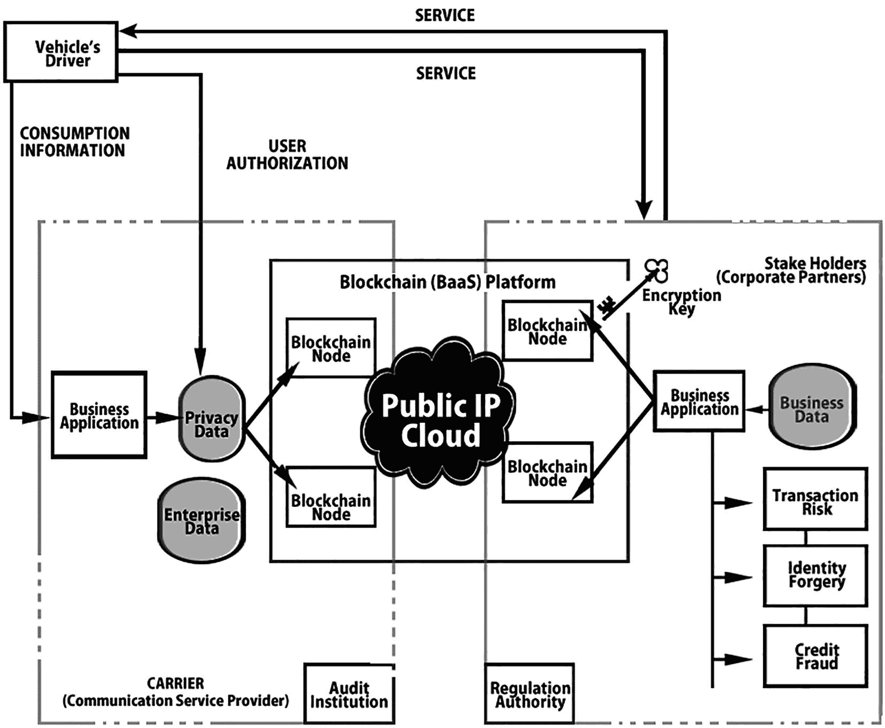

**图 17-2** 车辆管理系统中基于区块链技术的数据传输

### 备注

在本章中，我们创建了一个结合了人工智能和区块链技术的项目（自动驾驶车辆管理）。其目标是侧重于人工智能，因为前一章已经大量讨论了区块链技术。这是人工智能、区块链和物联网等最热门技术的组合。在西方国家，有很多将这两种技术应用于应用程序开发的例子。

在所有西方国家，自动驾驶汽车现已成为出行发展的主要支柱之一。欧盟委员会致力于支持任何能够帮助实现其智能与可持续出行计划中先前确立的可持续性和安全目标的互联与自动化出行解决方案。

公共交通领域目前已存在具备自动驾驶功能的城市有轨电车和列车选项。未来几年内，我们可能会看到配备数字汽车共享系统的自动驾驶出租车在有限区域内运营。在私人交通方面，生产完全无人驾驶汽车的目标仍然遥遥无期，尤其是在交通拥堵地区。然而，在未来几年内，配备越来越先进自动驾驶功能的汽车将可供购买。一些城市甚至可能在十年内提供必要的基础设施，以开发能够部署部分自动驾驶功能的环境数字系统。即使这一变革将是渐进的，让我们期待一条全新的道路。

目前，自动驾驶是汽车领域面临的最大挑战之一。开发其人工智能已进化到能够在无需人工干预的情况下驾驶，并且能够在千分之几秒内做出基本决策的汽车绝非易事。在对交通开放的公共道路测试阶段，涉及自动驾驶汽车的事故并不少见，但我们正一步步迈向无需人工干预的、越来越先进的车型。

### 自动驾驶车辆管理的优势包括：

* **多任务处理：** 驾驶员可以专注于完全不同的活动。
* **安全性：** 传感器和预测算法将使自动驾驶汽车能够评估，并在某些情况下预测风险。得益于安全驾驶，道路交通事故的数量将会减少。
* **效率：** 可以避免急刹车和突然加速，从而优化燃油消耗。
* **减少拥堵：** 一旦上路，车辆之间将不断通信，交换有关位置、行驶速度以及其他有助于交通合规的有用信息。
* **无排斥性：** 自动驾驶汽车也可供残障人士使用。事实上，它们不需要特别的体能技能。只需向你的无人驾驶司机指明目的地即可。

计算机现在在我们的文化中扮演着至关重要的角色。如今，这些系统被用于医学到航空电子等各个领域的多种应用，其中也包括相对较新的新兴技术——人工智能。

由于这些技术应用于新的领域，“计算机系统”的概念需要被重新定义。这些系统中的大多数必须在严格的时间限制内完成其任务，否则可能导致灾难性后果，包括大规模破坏、人身伤害甚至死亡。

当系统必须遵守严格的时间限制时，我们称之为*关键系统*。当一个系统的故障可能带来灾难性后果，对环境、基础设施或人员造成严重损害时，我们称之为*安全关键系统*。

在某些情况下，这些系统在物理环境中使用。自动驾驶汽车就是此类系统的一个例子：它由一个执行完成指定任务所需计算的计算机系统和一个物理组件组成，该物理组件通过改变环境和平台的状态来与环境交互。

由于这些系统如此普遍，而一旦失效又极其危险，因此在其设计和开发过程中满足并确保其（通常为）超高可靠性标准至关重要。系统的可靠性是衡量其“可信赖”程度或其提供准确服务能力的指标。

故障是导致给定服务中断的事件。关键系统的*可靠性*被定义为一组理论和实践指标。让我们更仔细地探讨最重要的指标。


## 17.3 可靠性与安全性

关键系统的*可靠性*被描述为一系列*定量*指标的集合。以下是一些较为重要的指标：

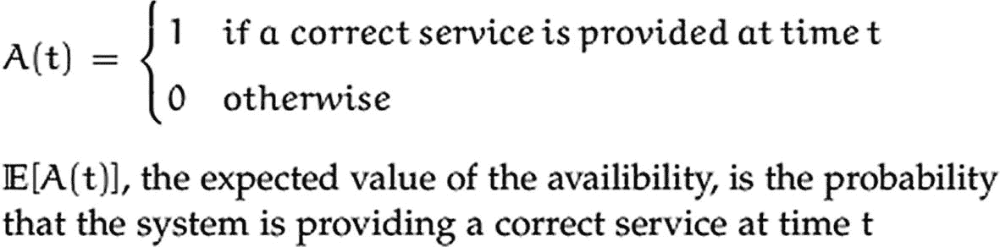

- *可用性* 是一种衡量正确服务与错误服务频率对比的指标。

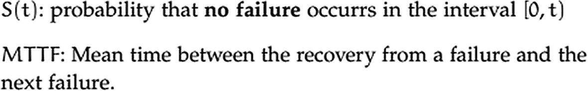

- *可靠性* 指系统提供持续服务的能力。
- *安全性* 被定义为在发生故障时避免灾难性后果。

由于安全标准需要可量化的度量，系统的安全性通常通过整合其他指标来描述，例如平均无灾难性故障时间。

- *可维护性* 指系统在发生故障后进行维护和恢复的能力。该因素会影响可用性。
- *覆盖率* 是衡量系统容错措施在预防、避免或纠正问题方面有效性的指标。

*风险* 是指任何威胁系统可靠性的事物：它是一个导致系统提供错误服务的“事件”。威胁可能形式多样，来源各异，例如错误的规范、需求的错误执行，或灾难。

在系统可靠性方面，我们需确保服务始终正确。当服务从正确状态转变为错误状态时，便发生了故障。在构建关键系统时，最小化从正常服务状态过渡到错误服务状态的可能性这一需求，主导着项目的部署。（见图 17-3。）


图 17-3

正确服务与错误服务

在评估安全关键系统的可靠性时，我们应区分良性和灾难性故障。对于良性故障，系统可能无法提供最佳服务，但仍能保持安全。当这些系统与人近距离交互时，不安全的服务可能导致灾难性后果，例如环境破坏、系统基础设施紊乱，甚至致命事故。以自动驾驶汽车为例。设想一种情况：汽车在“正常”条件下行驶，前方突然出现障碍物。

尽管急刹车并随后中断行驶是一种故障状态，但由于无人受伤，它被认为是良性故障。除此之外，车辆加速冲向障碍物（并最终撞上）的场景则被视为危险故障，因为车内人员可能会受重伤。（见图 17-4。）

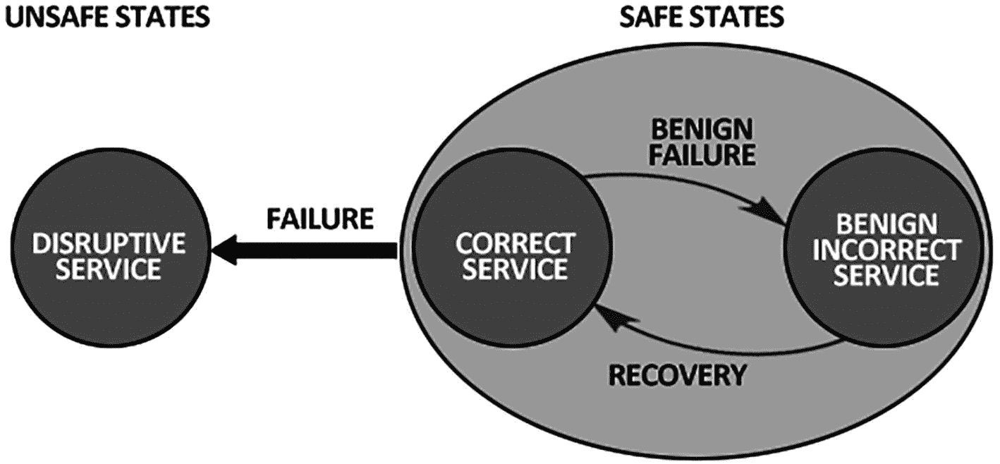

图 17-4

状态

我们希望发现所有可能的故障，以评估安全关键系统的可靠性。研究人员利用在学术界和决策者中广为人知的“故障-错误-失效链”来实现这一目标：

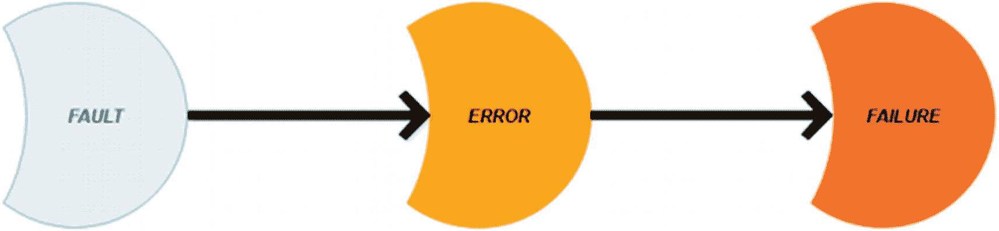

图 17-5

故障、错误和失效

- **故障 (Fault)：** 指已判定或推测出原因的缺陷。
- **错误 (Error)：** 系统状态中可能导致失效的一部分。
- **失效 (Failure)：** 错误进入服务接口，导致整个系统服务中断的情况。（见图 17-5。）

当错误发展到无法纠正的程度时，系统的可靠性取决于一套旨在预防或减轻潜在故障影响的四种方法：

- **故障预防：** 防止故障发生或被引入的方法。
- **故障容错：** 允许容忍缺陷的方法。即使发生故障，系统仍能提供正确服务。
- **故障排除：** 降低系统缺陷的数量或严重程度。
- **故障预测：** 使用统计方法估计当前缺陷数量、未来发生情况以及潜在影响。验证过程用于评估为满足系统可靠性要求所采取措施的有效性。

系统需求的确认是在整个开发阶段都必须遵循的方法，包括在设计过程开始时。对于系统开发过程的每个阶段，都可以选择多种验证技术：

- **数值建模：** 使用具有简单解析解的数值模型对系统能力进行建模的方法。换句话说，可以使用定量分析函数来表达系统的变化。这些模型包括顺序模型和基于状态的模型。
- **仿真：** 在模拟环境中对系统可靠性进行经验性估计。该方法允许测试某个特定容错机制能否在不损害真实系统的情况下运行。
- **测量：** 一旦系统原型就绪，可以在实际运行中进行监控并生成相关指标。

需要注意的是，这些技术并非相互排斥，在验证过程中都应予以考虑。

如前所述，验证必须贯穿项目的整个生命周期，从建模阶段开始，一直持续到实施之后。在某些阶段，本书中描述的一些方法更为适用：

- **规范阶段：** 通过描述可靠性标准来实现有效性，这些标准可以使用数值技术进行验证。使用组合设计等方法来确定系统组件的故障标准。故障被认为是相互独立的。
- **设计阶段：** 在设计阶段，适合使用基于状态的模型来表示系统的状态空间。这些模型的例子包括马尔可夫链和佩特里网。
- **实现阶段：** 当项目进展到一定程度时，可能可以构建一个可以密切监控的原型模型，以观察容错方法在提高系统可靠性方面的有效性。
- **运行阶段：** 系统安装后，可以在真实环境中进行测试。


## 17.4 系统追踪

系统监控是一种通过观察系统在其运行环境中的表现，并收集关于其特性的数据和证据的技术。目前，这被视为评估系统可靠性的有效方法，研究中已提出了多种实现该技术的方案。本章将采用这些书籍中介绍的方法。

此方法旨在持续监控最终环境中的系统，确保观察到的行为和性能满足特定需求。对监控活动中获取的数据进行验证是必要的：

- **离线：** 系统运行时，数据被收集并存储在某处，随后进行评估。
- **在线**（或实时）：数据在获取时即进行评估。在制定监控策略时必须考虑所有以下因素：
  - 确定系统中必须评估的关键事件、度量和特性，以判断系统的可靠性。
  - 数据标记，以便为原始测量添加更多信息。
  - 数据收集并传输到分析节点进行处理。
  - 根据感兴趣的指标进行数据过滤和分类。

在描述监控过程时，整个系统被称为目标系统。当追踪活动与特定的硬件、软件或系统组件关联时，会使用目标组件或最终应用。专家和学者们一致认为以下两种截然不同的技术是有效的：

- 黑盒分析。
- 白盒分析。

选择哪种策略取决于你对目标系统（尤其是其内部实现）的控制程度。

当实现细节未知时，例如监控动作由第三方系统执行，可以采用黑盒方法。在定义负载后，将任务提交给系统，并观察其输出。（见图 17-6。）

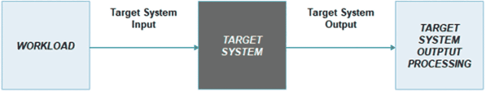

**图 17-6** 目标系统输出处理

如果目标系统的内部特性已知且易于访问，可以通过将探针直接连接到计算机，并在系统运行时观察其中间输出来“从内部”研究目标机器。由于这些探针直接连接到系统的内部组件，它们能提供比仅观察系统输出多得多的信息。

一方面，这种技术提供了关于系统行为的更多信息，但同时也需要在监控和系统探测方面更加谨慎。特别是必须遵循以下两个原则：

- **选择的代表性：** 为了成功执行监控活动，探针应能获取足够数量的相关事实。
- **非侵入性：** 探测不得改变系统行为；否则，获取的数据将毫无用处。

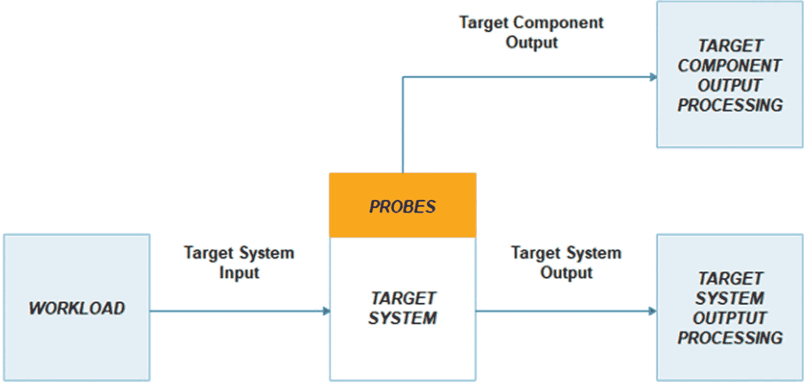

**图 17-7** 探针

监控系统的设计和开发需要额外的论证，特别是在探针如何实施方面。具体来说，我们可以区分以下几种方式：

包括硬件监控、软件监控和混合监控。由于其明显的最小侵入性，专用的硬件跟踪通道是观察系统的最佳方式。然而，随着系统变得日益复杂，安装硬件探针变得越来越困难，甚至极其困难。（见图 17-7。）

软件探针比硬件探针更强大，因为它们能访问更多相关数据，并能确定特定输出产生的上下文环境。指令数据提取和测量的指令可以包含在进程、操作系统中，或者可以创建一个新的探针进程。在混合技术中，硬件/软件探针可以同时使用，并特别关注减少每种技术的缺点。

## 17.5 本工作的动机与目标

一个负责驾驶汽车的`神经网络`，与一个提供容错机制以防止灾难性故障的系统监管器相互配合。考虑到自动驾驶汽车可能对未来系统发展产生的影响，它们是最新且最有前景的安全关键性技术之一。

这类技术通常具有极高且难以验证的容量需求。此外，软件架构涉及人工智能与非人工智能软件的交互，使得验证工作更加困难。

本研究的目的是提供一种评估此类复杂系统可靠性的实验技术，重点关注哪些指标适用于这些过程，以及哪些因素会影响分析过程。为了例证本书提出的原理，我们在一个逼真的仿真环境中进行了一项实验活动。

你无法直接接触系统监管器或训练好的神经网络。网络是从零开始开发的，该项目还包含创建一个基本系统监管器的工作。

需要强调的是，本文的目的并非对该论点进行全面阐述；而是开启对这些概念和困难的探索阶段，这需要在未来的设计中进一步验证和研究。

## 17.6 汽车应用

自动驾驶汽车是这十年来的流行趋势之一。使用机器学习技术经过实际训练来驾驶的 AI 已经表明计算机可以驾驶汽车。然而，如果这些系统发生故障，人员可能会受伤或死亡。同时，证明所要求的超高可靠性规格也颇具挑战。本章将回顾当今自动驾驶车辆安全方面存在的现代问题。


### 17.6.1 作为信息物理系统的自动驾驶汽车

汽车实现自动驾驶的能力需要使用适当的技术和软件。因此，自动驾驶汽车被归类为`信息物理系统`（CPS），其系统故障可能带来的毁灭性后果，使其被列入重要系统类别。

该系统通过从各种传感器收集数据，来感知并绘制局部环境地图。以下是一些最重要的传感器及其功能：

- **高精度 GPS 传感器：** 这类传感器有助于监测汽车自身状态以及周围物体随时间的变化。
- **摄像头：** 人脸识别软件和摄像头通常用于处理记录的图像。
- **激光雷达和雷达：** 激光雷达是传统雷达演进的下一步。从这些传感器收集的信息用于绘制周围环境地图，并检测车辆附近的障碍物和物体。

这些传感器的结果被整合后输入到汽车的控制系统中。图 17-8 描绘了该软件架构的简化版本。

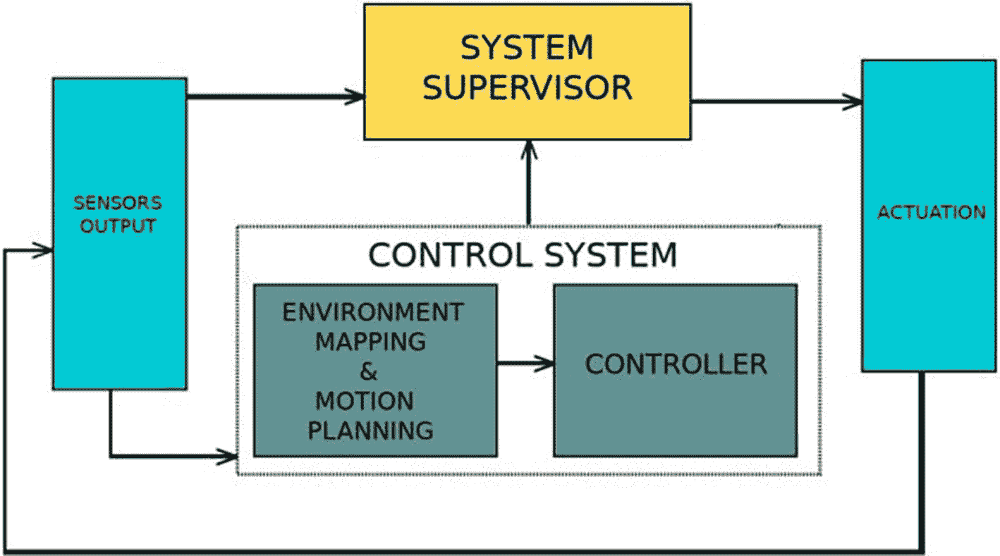

*图 17-8 系统软件架构的高层抽象*

传感器数据是管理系统的输入，该系统分为两部分。一部分输入直接从传感器收集数据，处理数据以生成用于绘制附近区域的占用网格，并生成一个系统物理模型，以便在避免碰撞的前提下沿着正确路径到达最终状态。另一部分输入也从传感器收集数据，处理数据以生成用于绘制附近区域的占用网格，并生成一个系统物理模型，以获取无碰撞到达最终状态的正確路径。

汽车的活动包括加速、制动和转向。由于这些任务的重要性，需要一个系统监管器。该系统负责检测潜在的硬件故障或错误的过程控制输出，并在必要时执行正确的操作。

系统监管器是这类系统的关键部件，可防止故障发生。毫无疑问，在分析数据时可以执行某些检查，但最终决定权在于系统的监控器，低估其重要性可能会导致灾难性后果，例如 2018 年亚利桑那州的一起悲剧，一名女性在一次自动驾驶汽车测试运行中被撞身亡。

进一步的检查发现，该车辆的雷达和激光雷达传感器在碰撞前约六秒就检测到了受害者，并且花了四秒推断出道路上存在需要紧急制动的障碍物。然而，在追求“更平稳行驶”的测试中，这个安全检查功能被禁用，从而导致了悲剧。

这类系统的高度复杂性引起了专家们的担忧，包括需要开发研究及测试其安全性的新视角，以及需要提高对安全的认识。

## 17.7 安全性与自动驾驶汽车

根据 SAE International（国际自动机工程师学会）提出的对自动驾驶汽车自主等级进行分类的提案，自动化程度可分为从 0 到 5 的六个等级。等级 0 表示无自主性：汽车完全由人操控；等级 5 表示无需人工干预，车辆不仅要能够在道路上安全行驶，还必须能够避免可能严重伤害人员的灾难性故障。一辆汽车要在开放道路上使用，其自主性越高，对可靠性的要求也越高。

证明一个设备的可靠性本身就是一项艰巨的任务，但对于像这样需要超高可靠性的系统来说，这变得更加困难。除了眼前的问题，证明自动驾驶汽车的可靠性还有两个额外的挑战：如何高效、安全地测试该系统，以及神经网络的存在——因此很难解释为什么给定输入`x`会产生输出`y`。

多项研究表明，道路测试车辆是不可能的。其中一项被称为 RAND 研究，该研究探讨了需要行驶多少英里才能使用传统统计推断来证明自动驾驶汽车的准确性。该研究估计，如果自动驾驶汽车的死亡率比人类驾驶员低 20 个百分点，那么使用“一支由 100 辆无人驾驶汽车组成的车队，每周 7 天、每天 24 小时全天候进行测试”，也需要超过五个世纪才能证实。

确认安全关键系统的超高可靠性标准是安全文献中的一个著名话题，而自动驾驶汽车的情况也属于此范畴。事实上，RAND 研究仅仅是 Littlewood & Strigini 在 1993 年论文中描述的问题的一个例子，该论文对相同的思想进行了探讨，并将其扩展到任何超高可靠性系统。

RAND 研究方法的基本缺陷在于，未来故障的频率不能仅基于观察到的故障来预测。这不仅是因为其不可能性的定量结论，还因为这种方法本身效率低下：一个观察到的故障频率是零的测试结果，如果使用这种方法，会导致乐观（且可能危险）的预测。幸运的是，正如赵等人所证明的，这个困境是可以解决的。

验证自动驾驶汽车的可靠性标准本身似乎就是一个艰巨的挑战。而这类汽车由神经网络控制的事实，则使问题变得更加困难。

近年来，机器学习领域受到的关注日益增加，催生了重要的科学进步。由于这些进步，自动驾驶汽车似乎已成为现实，因为人工智能凭借其能力取得了惊人成果，并且亚马逊、阿里巴巴等大型企业正在加大对人工智能相关研究的投资。这波新的 AI 研究浪潮正在极大地改变人们与计算机交互的方式，而神经网络也产生了令人惊讶的结果。

尽管神经网络已展现出巨大潜力，并且似乎是实现自动驾驶汽车等目标的唯一途径，但已有多次证据表明，当输入发生偏差时，网络的预测会变得多么古怪，以及置信区间会变得多么宽泛。缺乏针对此类软件的既定标准和认证，以及需要完全理解神经网络，都引发了人们对这些系统可靠性的担忧。随着领先的 AI 企业也在呼吁加强限制，目前对这一问题的认识正在不断提高。


## 17.8 控制器：检测器的问题

`control sys`（控制系统）与 `sys admin`（系统管理员）之间的连接是车辆运动的核心。`control sys`（控制系统）通常被称为*主要因素*，它是执行系统主要计算任务的软件，对于车辆运行至关重要。为避免在此情况下发生灾难性故障，需要采取诸如系统管理员之类的容错措施。由于这些系统的高可靠性要求，需要采用这种架构来尝试覆盖所有可能发生的故障。（见图 17-9。）

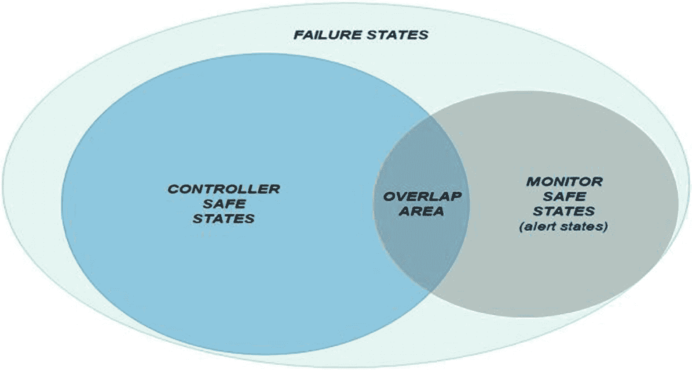

**图 17-9** 本图描绘了系统的安全状态

安全状态是指 `control sys`（控制系统）产生的输出不会导致车辆碰撞的状态。系统的安全程度可以表示为控制器和监督者故障区域的并集，其中存在一个重叠区域，在该区域中监督者对系统的性能确实是有害的。

设想一辆自动驾驶汽车在道路上行驶时，突然出现一个意想不到的障碍物。如果主控制器能正确识别障碍物，它应采取自我保护措施，以防止进入警报模式。

如果控制器未能检测到障碍物，或者检测到了但继续踩油门，则判定控制器发生故障，故障特征被激活，控制器从安全状态切换到警报状态。现在，`sys administrator`（系统管理员）有责任采取补救措施，使系统进入故障安全模式。因此，由于两个部件同时失效，管理员的一个错误将必然导致系统出现故障，从而进入故障状态。

*聚类算法*是一种独特的表格排列方式，能够可视化分类系统的性能，可用于展示系统监督者可能采取的行动。这是通过将世界分为两类：正类和负类来实现的。

假设我们正试图区分羊群中的白羊和黑羊。`Positive Class`（正类）将是黑羊所属的类。一只被正确识别为黑羊的羊被称为 `True +Ve`（真阳性）。白羊构成了 `-Ve`（负类），每只白羊都是一个 `True -Ve`（真阴性）。当一只白羊或黑羊被错误分类时，它被称为 `False Positive`（假阳性）或 `False Negative`（假阴性）¹。这种列联表的形式具有两个维度：实际值和预测值，如图 17-10 所示。

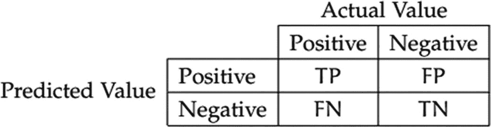

**图 17-10** 混淆矩阵表

在自动驾驶汽车领域，我们需要定义什么构成好的分类和坏的分类。请记住，我们将控制器的“故障”定义为从安全位置（在此状态下，监督者无需崩溃即可管理生态系统）向警报状态（在此状态下，如果没有管理员，系统最终会崩溃）的转换。

因此，`+ve` 类表示最终会导致控制器故障的事件集，而负类则表示控制器成功控制的事件集。我们将测试管理员区分安全状态和警报状态的决定。为此，我们对正面预测和负面预测使用了以下定义：

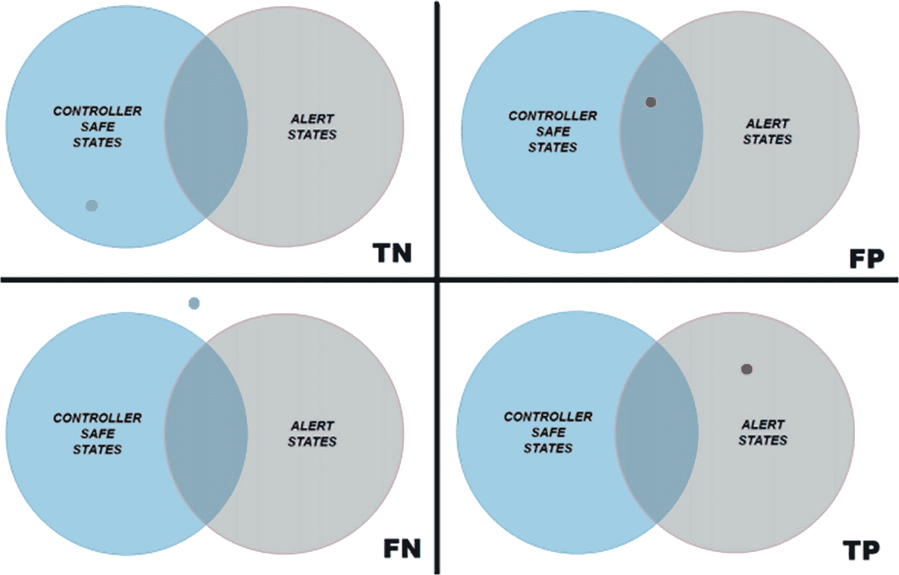

**图 17-11** 在 `sys`（系统）的状态空间中，真实和错误的预测以图形方式表示。圆点代表系统的当前状态。蓝点表示未发出警报，而红点表示监控器已触发警报。

- **真阳性 (TP):** 由于控制器故障，系统进入警报模式，该模式被控制器正确识别并阻止。
- **真阴性 (TN):** `sys`（系统）处于良好工作状态，控制器未发出警报。
- **假阳性 (FP):** 尽管 `sys`（系统）是安全的，但监控器发出了警报。
- **假阴性 (FN):** `sys`（系统）处于高度警报状态，而控制器未能识别威胁。

这些原始数字只是进行更复杂且有价值的测量的起点，这些测量通常以比率形式给出，并使用统计规律相互关联，从而使其在统计上具有可比性，并且在已知正确和错误预测的数量时易于计算。以下是这些指标的一些示例：


- **灵敏度（真正率）：** 计算被准确识别为真阳性的百分比。


- **特异性（真负率）：** 一种评估被准确分类为真阴性的百分比的指标。


- ***漏报率***（也称为 `假阴性率`）：被预测为负类的真实正类的百分比。


- ***假阳性率：*** 通过假阳性率来衡量被预测为正类的真实负类的比例。

这四个比率也可以结合起来，提供多种其他指标，以反映模型的预测性能。

以下是几个更常用的指标：

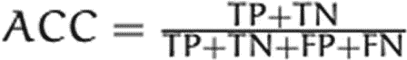

- *准确率* 是一个量化预测中系统性错误的指标。预测与其“真实”值之间的差异是由精度不足造成的。

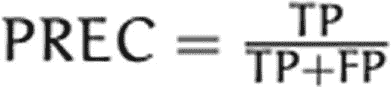

- *精确率* 是用于描述预测中随机错误的指标，它衡量用于预测的模型的统计变异。

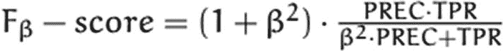

- *Fβ分数* 是衡量测试可靠性的准确率和灵敏度综合指标。其值范围从 0（最差值）到 1（最佳值），并且与真阳性直接相关。

马修斯相关系数是一个衡量整体预测质量的指标，它考虑了混淆矩阵中的每一个单元格。该指标范围从 -1（最差值）到 1（最高值），允许对模型的正确性进行更全面的评估。

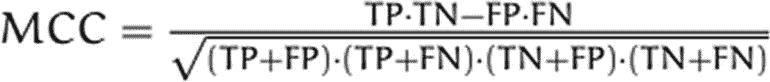

*ROC5 曲线图* 是二元分类器有效性的图形表示，其中 x 轴表示假阳性率，y 轴表示真阳性率，图表被 `y = x` 这条线分开。

这条线上方的点表示“优秀”的预测，下方的点表示“比随机猜测更差”的预测，而线上的点表示任意猜测。

如果已知正类和负类预测的实际数量，所有这些指标都可以计算并相互关联，从而可以轻松切换分析视角。我们想表明，通过使用这种技术，我们可以估算出计算更复杂的额外指标（如 `威胁分数` 和 `假发现率`）所需的所有量，这些指标取决于评估的需求。

这仅仅是计算机系统非对称容错架构在安全方面的一个扩展，其中主组件执行主要计算，而主检测器则检测（并纠正）主组件的任何缺陷。在出版物中，确定这些更简单系统可靠性的问题已得到充分研究。

在 Popov 和 Strigini 于 2010 年发表的一篇论文中指出，系统在给定输入（或输入集合）上发生故障的概率与主检测器的覆盖范围和次级检测器的覆盖范围都密切相关。

在自动驾驶汽车的情况下，我们希望主控制器覆盖尽可能多的区域。这是通过让将驱动汽车的神经网络接受大量训练来实现的。如果网络是“完全训练过的”，`control sys`（控制系统）必须能够处理大部分潜在的有害事件。有可能在某个时候，控制器学会了管理系统监督者的“警报状态”，从而降低了监督者对软件安全的整体贡献。（见图 17-12。）

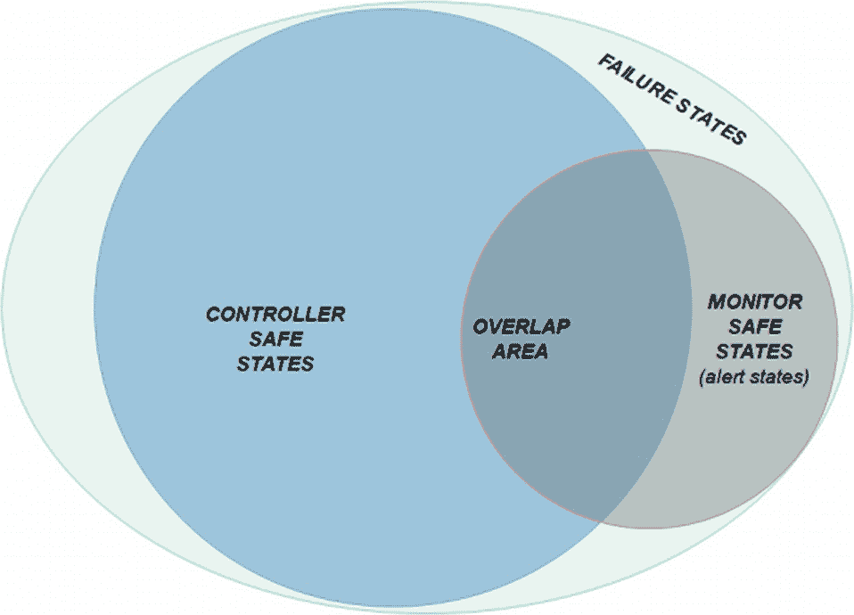

**图 17-12** 控制器现在捕获了之前所有被覆盖的状态，以及一些以前仅由监控器覆盖的状态

另一种情况是，在训练过程中，控制器覆盖的故障区域的一部分可能会暴露出来。这可能导致某些以前安全的状态不再安全。

由于在不修改其实现的情况下，系统监督者的覆盖区域无法改变，因此转换到这些状态之一将不可避免地以失败告终。（见图 17-13。）

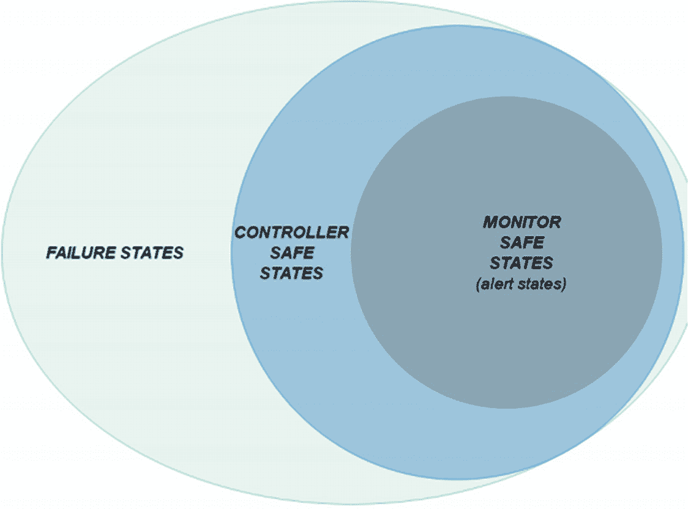

**图 17-13** 尽管训练中先前覆盖的一些状态不再被覆盖，但控制器现在捕获了监控器过去覆盖的所有状态

在自动驾驶汽车方面，我们希望主控制器覆盖尽可能多的区域。这是通过对将控制车辆的神经网络进行严格训练来实现的。只要网络是“完全受过训练的”，管理系统就应该能够处理大部分潜在的有害事件。

在接下来的章节中，将介绍并讨论一种用于检验这些要素的实验方法的创建和执行。


# 系统分析方法

### 初步阶段与介绍

本研究的目的是提供一种初步测试方法，用于监测控制系统与系统管理员交互时，在受控环境中出现的涌现相关特征。一款杀毒程序的软件设计被简化为仅包含两个组件：

- **控制器：** 一个通过强化学习方法训练来控制汽车的神经网络。
- **安全监督器：** 一个系统监督子模块，它利用激光雷达传感器数据判断车辆是否过快接近障碍物，并在必要时施加紧急制动。

本研究的目标是以全新视角审视该问题，并在受控的模拟环境中评估其可行性。由于该系统由控制与监测两个子系统构成，我们认为，从系统间相互作用所产生的涌现行为这一角度出发，可能会提升评估的标准。

本节阐述并探讨了一种策略，用于研究自动驾驶汽车随时间推移的安全水平，其中包括观察神经网络操作员的涌现行为，并在虚拟环境中对其进行安全评估。

所提出的框架专注于研究这两个组成网络相互作用所产生的涌现现象。

我们关注的是，随着神经网络的学习，监测器的效能如何变化，以及训练技术对安全监测器效能的影响。

通过数据集训练来增强神经网络的能力是其最吸引人的特点之一。训练的一个步骤涉及在 `n` 个阶段收集数据，并修正预测函数的权重。

函数的权重代表了网络在训练阶段结束后，某个时期的网络状态。经过“足够”多的时期后，神经网络应能产生令人满意的结果。随着所需时期数量的增加，任务难度也随之提升。驾驶汽车是一项艰巨的任务，保存每个时期的权重是不可能的。

因此，我们为神经网络 `N` 定义了一个断点，作为 `N` 的一个通用时期。假设 `N` 已经完成了数千个时期的训练。如果我们通常假设每 100 个时期保存一次权重，那么我们将得到十个检查点：

```
Checkpoint1 < checkpoint2 < : : : < checkpoint10
```

其中 `checkpoint1` 代表网络在第 100 个时期时的权重，`checkpoint2` 代表网络在第 200 个时期时的权重，以此类推。

设想一辆正在进行道路测试的自动驾驶汽车。其目标是尽可能长时间地在道路上行驶而不发生碰撞。随着汽车在行驶过程中前进，其周围的世界会发生变化。在特定的系统状态下，例如当有人突然横穿马路时，随后发生事故的可能性可能会急剧增加。当且仅当控制器的动作导致行人被撞时，我们才将其视为一次失败。如果行人确实被识别到，而汽车在试图躲避时撞上了其他物体，同样的逻辑也适用。

控制器任何可能导致碰撞的行为都被视为失败。当一个潜在的破坏性事件发生时，例如观察到碰撞的几率高于正常水平时，当且仅当控制器防止即将到来的失败的努力不成功，那么该控制器注定要失败。在此意义上，在项目的这个阶段，我们不区分增加事故几率的气候变化（例如，行人在街上漫步）和控制器的有害行为。

如果控制器出现故障，传感器的任务是运行安全程序以防止系统发生故障。

如果控制器失效，监测器不仅必须识别控制器是否成功，而且必须运行一个安全程序以防止整个系统失效。在这个初步的分析步骤中，我们认为监测器的动作总是安全的。也就是说：

- 如果控制器完成了安全程序中的所有阶段，网络将处于安全状态。
- 以下情况之一可能导致安全监测失败：
  - 未发现障碍物。
  - 障碍物已被识别，但程序未执行完毕。

如果管理器和安全监测器都崩溃了，导致失败，我们则评估系统已失效。

基于这个概念，我们可以将系统状态分为三组：

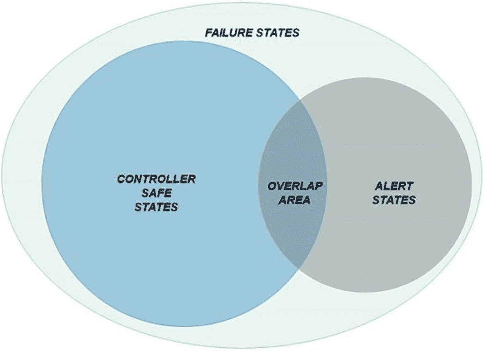

*图 17-14：系统的相空间示意图*

- **安全状态：** 控制器不需要监测器协助的状态。
- **警戒状态：** 需要监测器干预的情况。如果即将发生的意外被正确检测（并预防），系统将重新进入安全状态空间。
- **失效状态：** 已发生事故的区域。需要牢记的是，监测器无法识别所有情况。有些事故是无法避免的，没有任何监测手段能挽救系统，从而导致从安全状态直接转变为失效状态。（见图 17-14。）

关键在于发现系统失效的可能性，并找出如何降低这种可能性。同时，我们想观察随着控制器的学习，安全监测器的效能如何随时间演变。

这不仅有助于确保网络在学习过程中持续改进，而且也有利于控制器在积累经验后，能更好地理解监测器的用途。由于同一系统的多个检查点是在完全相同的条件下进行评估，以观察操作员的行为如何随时间变化，这对于实验活动来说是必要的。

需要多个检查点不仅是为了确保连接正在发展，也是为了追踪监测器的效能如何随时间变化。此外，正如你将在下一节中看到的，如果来自同一系统的多个检查点在相同情况下进行测试，就可以获得相关指标，并比较两个检查点在相同情况下的行为。

在分析开始之前，必须建立若干场景。一个场景是一组起始条件，汽车将在这些条件下进行测试（例如，汽车的生成位置、随机数生成器中使用的种子）。给定示例的难度级别由 `pedix h` 表示。这么做的原因是，我们希望除了一个方面之外，在相同的起始条件下测试汽车，这样我们就能更多地了解是什么原因导致系统更频繁地失效。随着时间的推移，`h` 变化应该变得越来越复杂，同时保持现实性。可以通过增加场景中汽车的数量或模拟气候变化来修改场景 `S`。

结合这两个版本，应该会产生一个难度更高的 `scenario1` 版本。必须记住，这些场景一旦建立就不应修改，因为它们将被用于测试所有检查点。这里收集的信息将有助于确定，对于某些系统而言，是什么因素使得一个场景比其他场景“更难”。


## 17.10 实验方法

本探索性研究的方法分为三个阶段：

- **阶段 1：** 给定神经网络的 `c` 个检查点以及 `nh` 种情境，操作员在所有情况下接受评估，并记录其运行日志。
- **阶段 2：** 将安全监控器连接到系统后，通过重复阶段 1 所执行的测试对其进行验证。
- **阶段 3：** 利用多种技术对网络进行重新训练，以提升其相对于先前检查点的效率。之后，在指定的所有情境中对更新后的控制器和安全监控器进行评估。

我们感兴趣的是在第一阶段确定神经网络及监控器的质量。这分两个步骤完成。第一步，在所有情境下对控制器的 `m` 个检查点进行测试。我们主要关注在此阶段中控制器的可靠性如何随这些检查点变化。

可重复性问题是对神经网络进行评估时最困难的方面之一。即便初始条件相同，同一个神经网络在多次运行中也几乎不可能表现相同。

由于网络的这一特性，在一次情境运行中出现的故障模式可能永远不会再次发生，或者再次出现所需的时间可能长得离谱。因为很难预见到所有可能的故障情景，我们认为这种类型的情境方法可能有助于解决该问题，它通过创造更具挑战性的运行条件，从而能够分析导致崩溃的变量。

为应对可重复性问题，针对运行的每个测试场景构建了一个黑盒。此方法会记录操作员的操作，以便能够进一步查看特定运行过程，从而发现控制器到底出了什么问题。然后，这些数据可用于找出控制器在检查点 `j` 时能防范哪些危险情况，以及在检查点 `--:j + x` 对网络进行复查时这些情景是否仍能得到保护。

### 17.10.1 控制器测试

控制器在各情境中、各难度级别下均会被孤立地进行评估，直至崩溃发生。当然，也仍有可能没有记录到任何故障。可接受的运行标准不在本研究的范围之内，但它们在学术界仍是一个争议点；不过，如前文所述，这个问题可以得到解决。

在方法开发阶段出现的一些困难促使我们决定将控制器隔离出来进行测试。主要的挑战在于一致性和非侵入性。如前所述，神经网络的可重复性问题通过创建一个保存每一帧车辆状态信息的黑盒来解决。由于监控器强制执行的刹车几乎肯定会改变模拟器运行期间的环境条件，我们将无法计算控制器的性能指标，因此不能同时测试整个系统（控制器和监控器）。

在隔离状态下测试控制器有助于解决这些困难，并为第二阶段做好预热。在所有已对控制器进行过各复杂度测试的情况下，至少需要计算以下指标：

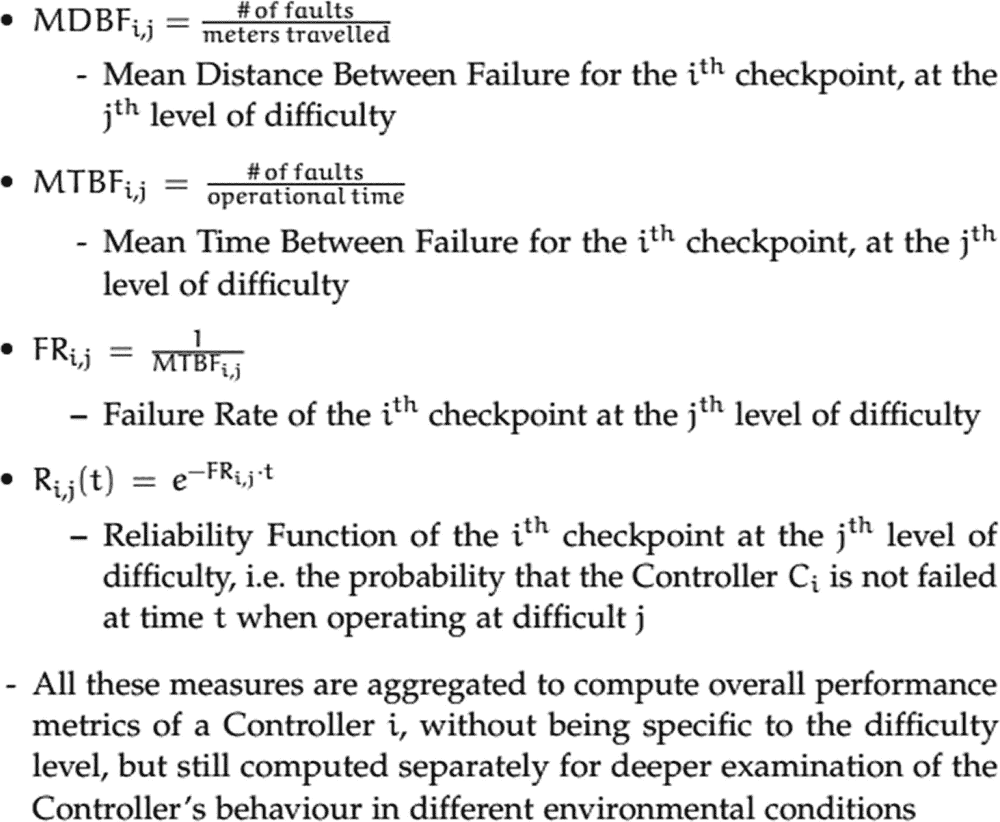

评估系统可靠性函数 `R(t)` 最重要的指标之一是平均失效时间，在模拟条件下该指标易于计算，并用于确定指数函数的速率。然而，汽车行业的统计数据通常以行驶距离来表示，例如平均失效行驶距离、每公里碰撞发生率等。如果参数和仿真硬件足够强大，能够按定义的时间步长进行计算，那么使用这种方法就可以非常容易地转换看待数据的视角。

只要神经网络被充分训练，我们预计以下不等式会持续成立：`Ri(t) 6 Rj(t)`，其中 `i` 和 `j` 是两个检查点，且 `i j`。这可以通过前面描述的数据收集方法轻松验证。

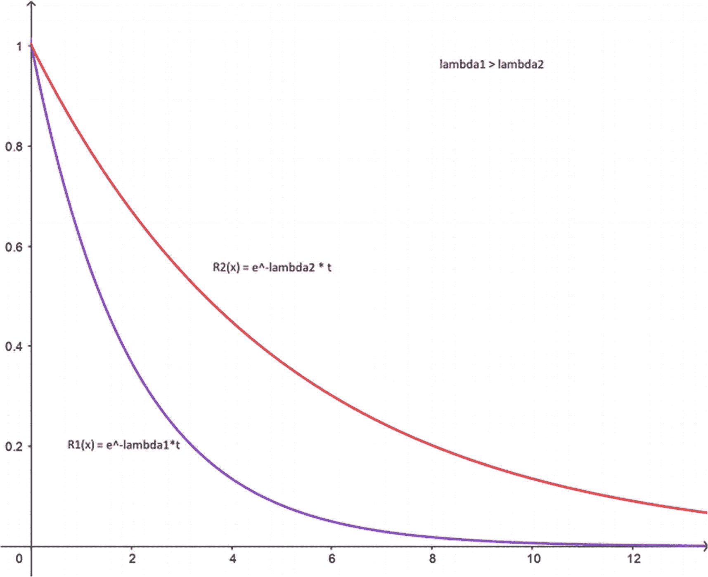

**图 17-15**

可靠函数决定了系统在时刻 `t` 继续正常工作的概率。我们预计，经验更丰富的驾驶员（对应更成熟的网络）能够完成比训练不足的网络更长的行程。

- 如果用于测试的模拟器允许，还应记录其他信息，以便加深对控制器行为的理解，例如：
  - 车辆的瞬时速度与加速度向量。
  - 汽车与什么发生了碰撞（另一辆车、行人）。
  - 设置一个或多个目标目的地，并追踪车辆是否到达。
  - 如果在时刻 `t` 发生碰撞，则确定时刻 `t-x` 时的环境条件。这些数据对于区分“安全”和“灾难性”故障至关重要。例如，如果以低于 10 公里/小时的速度撞上护栏，可能被视为比以相同速度撞人危害性更小的碰撞。

由于经过训练的驾驶员比新手引发的事故更少，我们预计随着控制器的学习，可靠函数会增大，从而提高平均故障间隔时间。

如果黑盒利用更优质的数据，那么也有可能追踪汽车行为相对于情境和难度级别的变化。例如，如果我们将情境中的汽车数量加倍，那么与其他障碍物碰撞的次数几乎肯定会增加。如果情况确实如此，则应进一步深入研究模拟结果，以便让训练策略朝着特定方向聚焦，因为控制器在试图避开其他汽车时，这可能会导致它们撞向墙壁。


### 17.10.2 监控器或观察测试

在操作员的运行记录完成后，即可开始监控器测试。在此阶段，我们不仅要评估安全监控器在防止崩溃方面的性能，还要寻找证据，以确定哪些情况对监控系统来说是“困难的”，哪些对控制器来说是“容易的”。

由于控制器现在涵盖了之前由屏幕揭露的所有故障，并且其新颖行为所带来的风险已大到监控系统无法察觉，随着互联网骨干网的成熟，控制器的行为可能会演变到监控器不再能够检测到即将发生的故障的程度。

另一方面，相反的情况也是一种可行的选择。例如，在早期阶段，控制器会“疯狂”地驾驶，进行许多突然的大角度转向并高速行驶。由于控制器的行为出乎意料，监控器将更难以预测未来状态。随着网络的学习，其运行会更加平稳，从而使监控器更容易发现潜在的事故。

主要问题在于，随着网络的学习，监控器的效能可能会下降，导致其成为一个完全无用的组件，甚至可能对系统的性能有害：操作员可能发展得足够强大，能够覆盖之前检查点由屏幕涵盖的所有损害，从而产生一个无用的组件。如果我们认为监控器的活动完全安全，系统的整体安全性可能不会受到威胁，但安全监控器的安全性将导致更少的平稳行程。

通过重复控制器测试阶段生成的运行来对监控器进行测试。起始条件也必须相同，并且必须保存在前一阶段的黑盒中。现在重复控制器的先前运行，同时将监控器连接到系统，并记录整个运行过程中发出的警告，以及它是否能够避免之前的碰撞。

在此阶段的研究中，主要问题是非侵入性。由于上述原因，我们不能仅仅通过添加安全监控器并观察事态进展来重新运行模拟。如果触发警报，安全监控器会覆盖控制器的动作，从而改变运行的下一部分。理论上，如果你能区分假阳性和真阳性，这不成问题。然而，如果不开发软件传感器来监控和映射环境，我们将无法预测技术错误会是什么。

因为这只是一个安全监控器，即使频率极低，也会有假阳性，因此这种方法无法解决问题。

目标是跟踪操作过程中发出的警告，同时避免启动安全程序。由于我们将重复第一阶段的运行，因此能够精确地确定在崩溃之前切换到警报状态的具体时间点`t`。因为我们知道了`t`，基于此信息，所有在`t`之前的警报都是假阳性或误报。通过允许监控器在此时刻之后启动安全程序，可以近似估算覆盖率。

如前一章所述，我们使用混淆矩阵来展示模型相对于真实值的预测值，以评估其在分类任务中的表现。然而，对于实时关键系统来说，测量所有指标即使不是不可能，也是非常困难的。尤其难以理解的是，当操作员避免了碰撞，但监控器却没有发出警报的情况。

这使得计算真阴性的数量极其困难，因为在大多数情况下，此类实例只有通过操作员审查每一次单独运行时才能被识别出来，这给真阴性等指标带来了一定程度的主观性。

例如，安全监控器的输入由一系列定时输入组成，这些输入可以被视为系统运行时环境的发展演变。因此，无法预测另一个状态会被警报还是被认为是安全的，因为我们不知道最终会导致崩溃的输入集合将从何时开始。

由于监控器需要一定数量的真阴性，因此可计算的指标和比率是有限的。同时，安全监控器对每一帧的系统状态进行分类，收集激光雷达数据，对其进行评估，并决定是否需要安全制动。考虑到系统的实时性，我们可以将监控器未发出警报的任何一帧视为真阴性。使用这种方法，我们可以计算统计分类模型中所有广泛使用的指标。

我们必须结合真假阳性和阴性，例如精确率和准确率，才能获得显著收益，因为由于前面所述的原因，真阴性的数量很可能远大于其他指标。由于假阳性率的公式为 `FP/(FP+TN)`，结果中会出现在第一个有效数字之前有许多零的数字。此外，为了提供一个可理解的假阳性比率度量，假阳性的数量是根据一次行程中行驶的距离来计算的。

正确和错误操作员预测的比率如前所述确定，并可用于比较不同检查点：

*   漏报率和警觉率
*   特异性和后果
*   正确率
*   精确率
*   马修斯相关系数
*   每米假阳性率
*   裁剪后的精确率-召回率曲线

准确度和可靠性是根据一项 ISO 标准来选择的。准确度的概念已被预测真实度的概念所取代，而精确度则被解释为表示包含需要高精密度和准确度的随机误差的组合。评估混淆矩阵最有用的指标是马修斯相关系数，它被计算为所有预测的总和，并且已被发现能提供比 F1 分数更准确的总体数据。

我们选择不使用 `Fi`，因为它通常在不平衡数据集上表现不佳，导致结论根据数据集大小而过于乐观。由于存在大量的真阴性，并且我们关注监控器的整体效用，因此我们选择使用 `MCC` 作为监控器性能的衡量标准。

`每米假阳性数` 用于预测如果控制器和安全系统同时开启并一起运行时系统的行为，并量化后者错误安全制动的影响。`ROC2` 曲线，即分类器工具诊断能力的图形表示，本可以提供传感器功效的快速可视化表示，但这种方法无法实现。其 x 轴由 `PR` 决定，y 轴由 `TPR` 决定。

由于我们数据集的严重不平衡（根据真阴性的分类方式，假阳性的数量可能低于 `10^-2`），该图将在左侧被压平。因此，根据每个难度级别下每个检查点获得的数据，我们使用高度精确的裁剪来生成图形平均值，即通过定义 x 轴为召回率、y 轴为精确率来生成的曲线。

由于监控器仅根据激光雷达传感器提供的数据实时将状态定义为安全或危险，我们无法在改变制动决策阈值并展示完整曲线的情况下构建一个测试集来评估监控器。因此，我们计算了每个难度级别的历史数据，并展示了这些数值，以探究难度与监控器效能之间的关系，并将图形裁剪到包含预期值的区域。


### 安全监控器测试与控制器重训练

在测试监控器时，最好对其进行全面检验，以便收集更多数据并建立数据间的关联。这一环节与上述难度等级无关，因为它涉及任何可能与环境相关、能证明监控器何时运行良好、何时出现问题的要素，并且更多涉及较高层面的故障注入。

安全监控器设置的可修改方式主要取决于其实现方法，而开发团队负责选择包含哪些问题以及包含多少问题。减少传感器读取的数据量或向观测结果中添加噪声是两种简单的选择。此阶段将教授如何更改软件的内部设置以获得"理想"版本，该版本将在整个控制器重训练过程中使用。

### 17.10.3 控制器重训练

至此，我们已经收集了关于监控器和控制器行为的信息。每当从最新的检查点保存神经网络时，我们将研究这些数值因所用学习技术不同而产生的差异。

如本章开头所述，我们正在研究一个由神经网络构建的控制器，该网络已使用强化学习技术进行训练。在这些方法中，利用奖励函数来告知网络其表现是"好"还是"坏"，并且该函数会在每个预测步骤进行计算。

训练函数需要关键参数，并在算法的每次迭代中重新评估：

- 网络的响应。
- 执行动作时系统的当前状态。
- 以特定方式完成任务所获得的奖励。

在本阶段，我们将研究不同的神经网络训练技术如何影响系统的整体行为，特别关注安全监控器的效能。

为开始研究此问题，我们确定了四种技术以及训练完成时的预期结果。这些结果是"预测"性的，因为我们不知道网络会对训练方法的修改做出何种反应，也不确定观察到的行为是否与预测一致。

使用这种技术所制定的策略主要取决于奖励函数和通道的行为：

- S1) 当汽车撞击到物体时，奖励函数更具惩罚性，但只要汽车未停止前进，刹车会获得稍高的奖励。
- S2) 安全监控器与系统相连，如果发出警报，监控器的响应优先于网络的响应（安全制动）。
- S3) 如果监控器发出警报，网络的活动将被监控器的活动所取代。由于像监控器一样行动，网络会获得一个良好的奖励。
- S4) 如果触发警报，训练阶段将终止，并且网络会获得一个较差的奖励。

我们估计，如果采用 S1，控制器故障间的平均时间/距离将会减少。对碰撞给予更高的负面激励，并对刹车（如果汽车未停止行驶）给予较低的正面奖励，应该会促使汽车选择刹车而非急转弯（这可能导致新的危险场景），从而增加故障间的时间和行驶距离。

S2 的目标是"训练"网络，使其在监控器发出警报时进行刹车。因此，原先由监控器覆盖的"战争状态"可能变为安全状态。

S3 在许多方面与 S2 类似。为像监控器一样行动提供正面激励，有望加速学习。

S4 是目前最有前景的方法，并且有可能带来最有趣的结果。当安全监控器发出警报时，无论它触发的是真警报还是假警报，一个负面奖励和训练步骤的改变应该会迫使网络完全避免监控器介入的情况。从根本上说，我们预计安全组件的效能会显著降低。

当四个控制器得到充分训练后，新设备将像第一阶段一样进行测试。对控制器和监控器估算相同的测量值，并将结果与实际检查点进行比较。

## 17.11 方法实现与结果

本章将回顾所使用的工具、软件架构和技术实现，以及在整个分析过程中收集的数据。一个 DDPG 代理（DDPG Agent）被训练在城市环境中驾驶。训练期间，记录网络状态的检查点以便进行比较。为了提供关于自动驾驶汽车（AV）行为的独特视角，这些网络检查点在使用和不使用简单安全监控器的情况下都进行了测试。

## 17.12 工具与软件


### 17.12.1 CARLA 模拟器

`CARLA`，由巴塞罗那大学的研究人员创建的开源模拟器，用于构建具有精确物理模拟和数据传感器的逼真环境。该模拟器的目标是提供一个环境，使 AI 智能体能够被训练驾驶，具备对模拟设置的高度控制，以及可以修改以改善或降低数据质量或插入错误的真实传感器模拟。

`CARLA` 设计为在客户端-服务器环境中工作。服务器本质上是一个使用 Unreal Engine 4 用 `C++` 创建的游戏。`C++` 的速度对服务器的功能至关重要：不仅必须模拟环境（包括行人/车辆移动、气候建模等），还必须模拟连接到系统的传感器所需的所有数据。

`CARLA` 目前的版本是 `0.9.7`，每个版本都带来了显著的改进，因其逼真度而进一步获得了专家的关注。不幸的是，当我们研究开始时，`CARLA 0.9` 刚刚发布，我们所需的工具尚未在线提供⁵。

由于为之前稳定版本 `CARLA` 完成的工作数量，最初使用了 `0.8.4` 版本。

`0.9` 之前的版本在您对模拟参数及其收集的数据的控制量上存在限制。这并不妨碍我们的研究，但确实在某种程度上限制了关于环境和系统的有用信息。其中一些缺陷在之前的模拟器版本中仍然存在，但在从 `0.8` 版本升级到 `0.9` 版本后，大部分问题已得到修复²。

最严重的问题之一被揭示是坐标系。在 `0.9` 版本之前，开发者使用了 `UE4` 的默认坐标系，尽管标准是右手坐标系，但它却是左手坐标系。这看起来是一个小问题，因为可以通过使用变换矩阵轻松解决。然而，由于时间限制，决定坚持使用开发者的方法，主要在分析阶段修改数据²。

此版本的 `CARLA` 包含四个传感器，它们都被用于实验中。由于 `Python` API，它们易于学习：

*   摄像头
    *   最终摄像头提供场景的图片。
*   深度图摄像头
    *   为了理解环境中的深度，深度图摄像头为物体分配 `RGB` 值。
*   语义分割摄像头
    *   语义分割通过根据其类别以不同颜色呈现视图中的不同物体来对其进行分类。
*   基于射线投射的激光雷达
    *   通过用激光束照射物体并测量反射光返回传感器所需的时间，光探测与测距（`LDR`）是一种检测环境并估计物体之间距离的技术。

在网络训练阶段使用了三种摄像头。三台场景最终摄像头安装在汽车上，使驾驶员能够观察周围环境。

得益于深度图摄像头，车辆可以获取场景中物体之间距离的彩色图。语义分割通过联系服务器获取地面实况信息来提供图片分类功能。这无疑是对真实系统的简化，在真实系统中，最强大的图片软件本质上是独立训练的其他神经网络。误分类也可以被视为控制系统错误。

如果检测到潜在威胁，安全监视器不会“修复”误解释，而是会迅速且安全地做出反应以避免后果；因此，这种简化不会影响整个方法。

此版本 `CARLA` 的另一个可用传感器是基于射线投射的激光雷达。该传感器的参数可以轻松调整，以模拟真实的激光雷达，如 `Velodyne Lidar`，或模拟诸如低数据质量、噪声数据或数据丢失等缺陷。数据以点云格式生成。

由于在模拟中需要高硬件资源来模拟真实的激光雷达，因此使用了 `Velodyne64` 激光雷达的显著修改版本，其参数如下：

*   通道数 = 64
    *   系统总激光束数量。这些激光器沿 `y` 轴均匀分布。激光器越多，扫描精度越高。
*   量程为 75 米
    *   激光器的以米为单位的测量范围。
*   旋转频率 = 15 Hz
    *   这些设置定义了扫描光束的旋转速率（以 `Hz` 为单位）。
*   每秒 1,000,000 个点
    *   传感器每张图片产生的点云数量。
*   垂直视场边界（上边界 = 24 米，下边界 = -2 米）。距离是相对于传感器位置测量的。
    *   扫描的最小和最大高度。

模拟器拥有用于修改传感器的 `Python` API，并且对模拟内容有大量控制，例如为生成、行人和车辆行为设置放样位置，以及场景中“参与者”的状态（如其位置和速度）。

所有这些信息以及地面实况值都由模拟器提供。可以使用与模拟相关的度量，例如模拟时间步长或每秒帧数。与参与者相关的度量包括车辆速度、碰撞严重程度和 `3D` 加速度向量。

在测试此工具期间，发现了一个激光雷达传感器数据的问题，该问题尚未解决。该问题导致车辆的边界框在移动时发生扭曲，从而导致数据质量非常差。经过大量调查，发现了一个更新版本的模拟器，其每辆车的边界框已被修改以生成正确数据。开发人员目前正在处理此问题，但如果没有人工干预源代码，则无法修复。


### 17.12.2 控制器设置

用于选择采取何种动作来移动汽车的神经网络，是控制器实现中最核心的要素。我们需要一个具备以下特性的框架。

-   提供训练用的代码。
-   代码库中没有重大缺陷。
-   创建一个能够使神经网络与 `CARLA` 进行通信的环境。
-   提供一套默认的训练方法。

在分析了 `CARLA` 的所有设备应用后，我们选择了英特尔人工智能实验室的强化学习平台 `Coach`。该框架满足以下所有标准：它以可编辑的 Python 包形式分发。项目开发团队向我们保证该产品将具有高质量。此外，还有多种预设配置可供选择作为起点。其中两个配置包括一个 `CARLA` 模拟器接口和一个预设的训练策略，这正是我们所需要的。

2015 年提出的深度确定性策略梯度方法在这些配置中得到了实现。正如原始工作中所展示的那样，该方法在车辆驾驶等任务中表现良好。

-   **P1**：第一种配置使用单个前置摄像头以及 `CARLA` 提供的额外数据增强摄像头来感知环境。此预设中的智能体很可能完全不具备普通摄像头提供的深度感，而仅依赖深度摄像头。
-   **P2**：由于车辆配备了三个常规摄像头以及上一节中描述的所有数据增强摄像头，此配置使用了 `CARLA` 中所有可用的摄像头，其设计要有趣得多。

使用数据增强摄像头使我们能够忽略对象误分类等问题，还能带来其他好处，例如估算对象间的距离。这是真实架构的一种简化形式，在真实架构中，物体识别单元是需要单独训练和评估的神经网络，正如上一节所述。

然而，误分类很可能会导致控制器以意想不到的方式行动，安全监控器必须能够检测到这些行为，并可能加以纠正。遗憾的是，即使车辆获得了正向奖励，初始配置也存在一个缺陷，会导致其停止加速。本来，测试这种配置并观察其如何影响安全监控器在网络数据访问方面的有效性，会是一件很有趣的事情。

需要着重指出的是，我们的目标不是创建“理想的”智能体或自动驾驶汽车。我们对代码库进行了检查，但由于时间限制，未能审查给定实现的所有细节。该框架只是本书中所讨论概念的示例。

### 17.12.3 安全监控器实现

为了启动研究，我们需要一款能够读取激光雷达数据、绘制环境地图并检测障碍物的软件。该软件还必须具备实时性，并且能与 `CARLA` 进行通信。后者是不言而喻的：每当警报被触发时，`CARLA` 服务器必须接收到“刹车”指令。前者则需要一些思考：可以设想预先捕获激光雷达数据，然后使用这些数据进行模拟。不幸的是，这种方法行不通，因为我们不仅关心预测的 100%准确性，还关心监控器安全措施的质量。

如果在两次不同的模拟中进行相同的测量，而结果略有不同，监控器的响应方式可能与使用模型实时提供的数据时的响应方式完全不同。如果测量的精度仅与研究模拟器相关，我们就不能忽视刹车对特定实验产生的影响。

为了构建一个合适的安全监控器，我们对最佳的“非神经网络”方法进行了调研，并对可用的开源工具进行了评估。为了处理点云数据，我们选择了 `Point Cloud` 库作为开源库。该库用 C++ 编写，以便在处理大量数据时实现上述目标。该库最初于 2011 年发布，后续每个版本都对其进行了增强，这在一定程度上归功于庞大的社区帮助测试和调试新功能。

该软件包包含一套实现最常见点云处理技术的方法。构建物体检测模块的步骤如下所述：

-   **下采样：** 单次检测可能产生 10 万条记录，其中包含大量冗余和噪声。作为第一步，通常需要进行下采样以去除所有“无用”的数据。经过深思熟虑，我们选择了 `Voxel Grid Filter` 来完成此步骤。
-   **地面分割：** 下采样（如果需要）之后，第一步要求是过滤掉对物体识别无价值的数据，例如与地面相关的点。为了将地面与我们想要识别的物体区分开来，必须过滤掉这些点。在我们的实现中，我们使用了 `RANSAC2` 算法，这是一种用于区分“内点”和“外点”的机制。
-   **聚类：** 最后这一步对于正确定义什么是场景中的物体以及哪些数据点与该物体相关联是必要的。基于点邻近度的聚类技术可用于实现此目的。由于这是一种基于欧几里得距离计算点之间距离的范围查找方法，并且假设密集的点表示同一个物体，因此我们选择了`欧几里得聚类技术`。
-   **物体跟踪与规避：** 在前三个组件中识别的物体需要随时间进行监控，以确定在两个连续阶段观察到的两个物体是否为同一实体。这通常通过将故障安全程序与物理模型（例如`卡尔曼滤波器`）相结合来实现，这些模型可以预测物体随时间的行为。

然而，为此类复杂模型开发`卡尔曼滤波器`会花费太多时间，迫使我们的研究停滞不前。因此，我们简化了物体识别和故障规避程序，如下所示：

-   仅保存汽车前方的数据。这是对该概念的一项重要改进，因为现在监控器只能识别车辆前方的障碍物。但是，尽管这无疑会影响安全监控器的有效性，但前一节讨论的想法仍然有效。
-   所采用的故障预防程序基于英特尔提出的 `Mobileye` 的`责任敏感安全`范式。当检测到物体时，计算该物体相对于系统的速度。如果系统在一秒钟内行驶的距离加上该距离大于物体行驶的距离加上系统与物体之间的空间，则会触发安全刹车。

由于安全监控器是用 C++ 编写的，因此创建了一个与 `CARLA` 进行数据通信的架构，这既是为了使用 `Point Cloud` 库，也是出于性能方面的考虑。`CARLA` 客户端的点云数据。这些数据按照与之前步骤相同的方式进行分析，如果需要，会向客户端发回警报。如果监控器收到警报消息，控制器的操作将被覆盖，并施加刹车。物体识别模块受到了 Engin Bozkurt 的开源项目的启发。为了根据我们的目的调整检测算法设置，并使其与 `CARLA` 接口，该软件经历了大量修改。


  
### 17.13 实验活动  

本章阐述前一章所创建的方法如何付诸实践，以及在此过程中出现的技术问题。  

为生成四个待评估的检查点，在城区环境中使用 Coach 的默认技术对控制器进行训练。  

`CARLA` 提供了 152 个生成点，用于创建场景。每个生成点均创建了一个基础配置及其三种变体：  

-   `h0`-默认设置：使用与控制器训练时相同的条件生成地图，包含 30 人和 15 辆汽车。  
-   `h1`-行人设置：生成地图时将行人数量从 30 增加至 60。  
-   `h2`-车辆设置：生成地图时将环境中汽车数量从 15 增加至 30。  
-   `h3`-该地图由`h1`和`h2`合并生成，形成包含 60 名行人和 30 辆汽车的情景。  

为确保各变体之间的一致性和可重复性，共生成了 152 对具有唯一随机种子的初始点，每对均对应不同的起点。这样，同一初始点可在多次迭代中重复使用相同的随机种子。  

为补充系统整体性能信息，汽车还被分配了一个待达成的目标目的地，该目标同样被记录以便重复测试。如果目标达成，系统记录成功，并为系统分配一个新的目标。  

在正常情况下，碰撞可能需要极长时间才会发生。因此，本工作设定了 15 分钟的最大运行时长来展示提出的原理，超过该时长则视系统任务为完成。  

在第一部分研究中，使用第 3 节概述的方法开发并评估了四个检查点。由于 Coach 项目是开源的，相关代码已公开。  

因此，我们能够利用软件探针监控控制器的活动。源代码被修改，增加了将每次运行所需数据写入独立文件的指令：  

-   场景的起始位置和随机种子  
-   控制器已执行的操作  
-   发生碰撞时的结果  
-   若达成目标，记录目标达成情况以及新目标坐标  

通常，修改源代码可能导致整体性能和结果准确性的下降。幸运的是，`CARLA`模拟器允许以特定时间步长运行仿真。为确保从服务器接收的所有数据正确且及时，时间步长设置为最小值：每秒十帧。由于无法控制可变时间步长，这可能会在数据中引入不确定性。这也为测试可重复性提供了基准。完成初始训练部分以及控制器测试大约花费了一个半月。  

在第二步中，在每个检查点评估安全监控器。源代码再次被修改，以建立两个独立并行的进程：一个从`CARLA`服务器获取激光雷达数据并发送至安全监控服务器，另一个等待安全监控器判断是否需要刹车。  

每一帧，`CARLA`系统都会生成激光雷达数据。由于数据生成的负载完全依赖于 CPU，执行时间显著变慢。不幸的是，如果 FPS 低于 10 帧，`CARLA`会出现问题，导致数据错误。为确保最低每秒十帧的约束，需要一台性能强大的机器。代码库中添加了软件探针以收集监控器警报信息，并再次修改源代码。在监控安全行为监控器的同时，重复执行第一步中的运行。测试期间，所有生成的警报均为误报。  

为评估真阳性数量，在碰撞发生前两秒激活紧急制动。这种方法使我们能够在运行环境中评估安全性能监控器。  

第一阶段完成后，处理所获得的数据，以计算机化前述章节中描述的测量指标。  

-   控制器的检查点：  
    -   故障间的平均时间  
    -   故障平均间隔时间（MTBF）  
    -   故障率  
    -   稳定性  
-   安全监控器：  
    -   混淆预测矩阵  
    -   阳性/阴性率（真/假）  
    -   完整性详情  
    -   马修斯相关系数  
    -   误报率  

使用前述方法从之前的检查点继续训练，并以相同方式执行测量过程。  

某些提及的方法需要安全监控器训练，导致执行时间极快。由于生成激光雷达数据的高计算负载，这一阶段耗时约三个月，此后训练停止。收集的数据可用于比较，评估网络是否正确学习，以及安全-有效性监控器随时间的变化情况。  

使用`Python`脚本收集并分析数据，以聚合数据并为控制器和安全整体监控器的功能提供指标。对于此类工作，数据聚合至关重要。然而，由于这些系统的复杂性及许多不利事件发生频率较低，在数据聚合之前，必须对单次运行进行评估和比较。  

由于获得的数据量庞大，我们在下一部分主要以聚合形式呈现收集到的结果。还存在关于“原始”数据的其他问题，这些问题未包含在本研究中，但已单独提供用于评估。  

### 17.14 结果  


### 17.14.1 测试控制器（第一阶段）

每次运行收集的数据会分别保存在不同文件中，本章指定的各项指标均通过 Python 代码计算得出。通过对比所获数据，可确定控制器的优劣，以及安全-效能监控器在神经网络各阶段所做的修改。

针对每种情景，绘制了行驶距离图，以判断步行米数是否在增加，以及是否存在对系统而言特别“有利”或“具有挑战性”的场景。

这是第一步，有助于测试人员区分重要场景和次要场景。如果在场景 `x` 中，控制器行驶的距离少于所有检查点中的通常行驶距离，那么有两种可能：

- 如果控制器在所有检查点爆炸前行驶的距离始终相同，则可能存在控制器尚未学会处理的危险。
- 如果行驶距离在很短时间内变化，碰撞的可能性可能由初始条件决定。无论如何，使用这种方法，很容易找出哪些情况会导致控制器快速崩溃，并且可以进一步分析每种情况。

需要注意的是，如果在测试不同检查点时出现某种模式，例如控制器表现异常出色或异常糟糕，在这两种情况下，都需要对特定实例进行研究。

基于这些原因，分析“糟糕”运行的理由是不言而喻的。然而，在相同情况下出现多次“良好”运行，这听起来可能违反直觉，但需要更加仔细地审视。需要分析性能与起始条件之间的关系，并且可以通过这种方法来证明或反驳这种关系。

当系统识别出一种“良好模式”时，例如，在一次运行中，汽车只是重复完全相同的序列，而没有在路上遇到任何其他车辆，就会出现一个更复杂的问题。

在正常难度下，检查点 1 和 4 的量级存在显著差异，并且在少数情况下，达到了为这些测试设定的最大长度。该方法的另一个有趣特点是，在 `C2` : : 4 中，行驶距离的下限限制在所有挑战中保持不变，始终为 22 米。

仔细观察行驶距离和运行时间会发现，存在一些控制器毫无进展的运行，这意味着触发碰撞的事件属于控制器无法处理的类型。在判断这些最短的运行是否共享某些可能导致控制器性能不佳的环境变量方面，这类结果无疑颇具研究价值。（见图 17-16。）

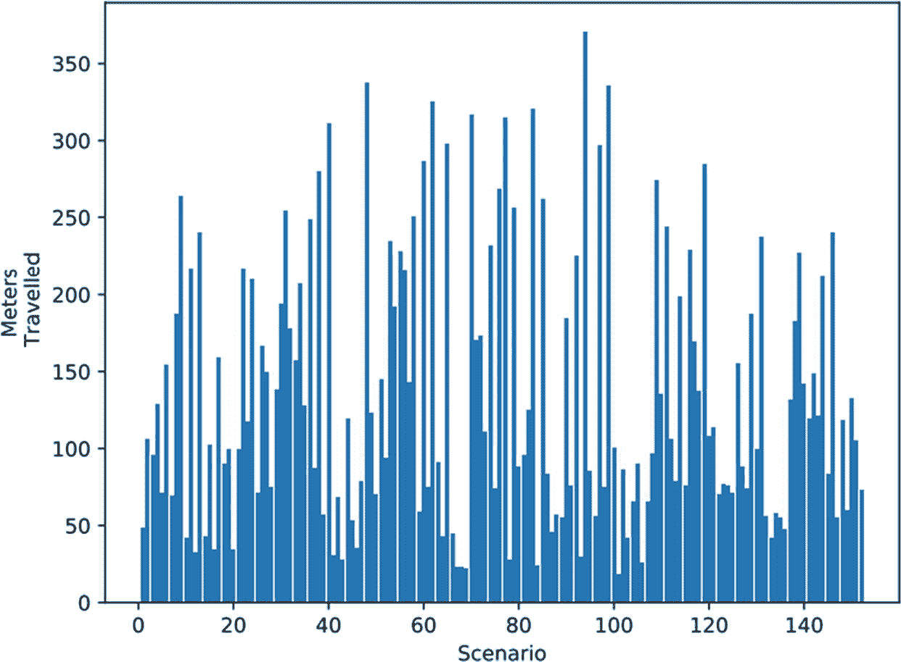

**图 17-16**
在正常难度下，控制器 `C1` 在每种情况下的行驶距离（米）

由于模拟两个阶段之间经过的模拟时间是已知且可计算的，因此可以获知两次连续动作之间的时间间隔：通过统计控制器执行了多少次动作，可以估算单次运行的实际总时长。（见图 17-17。）

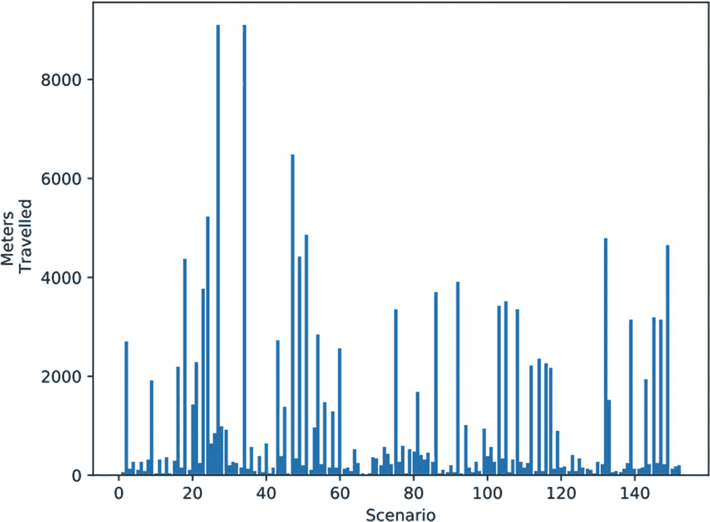

**图 17-17**
在正常难度下，控制器 `C4` 在每种场景下的行驶距离

通过这种方式，我们可以在每个难度等级下使用平均 `MTTF`，简单地近似计算出每个检查点的可靠性函数。

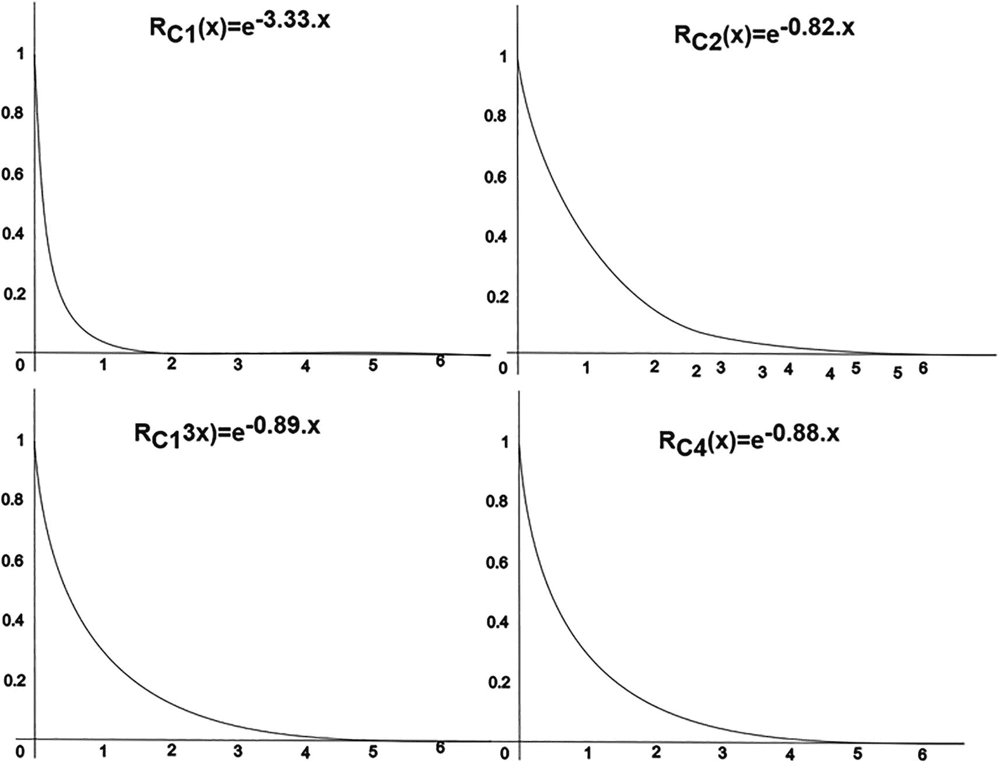

**图 17-18**
经过 `x` 分钟反应时间后，系统保持运行的概率 `y` 的图示

如预期的那样，初始检查点的 `MTTF` 相对较低（20 秒），并随着检查点数量的增加而增加。有趣的是，第二个检查点表现似乎优于第三和第四个检查点。尽管如此，对部分运行的分析显示，第二个检查点在崩溃时间和行驶距离方面取得了非常好的结果，但其驾驶方式远比另外两个危险，很可能导致一种不良的驾驶风格：汽车几乎每次都通过在最后一刻转向来避免碰撞。这也是 `C2` 并非总是优于 `C3` 和 `C4` 的另一个迹象。`C3`/`C4` 表明，明显的安全性提升很可能归因于上述意义上的“幸运模式”。

幸运的是，正如第三阶段的结果将显示的那样，控制器最终克服了这个问题。

检查点的行驶距离遵循类似的模式：更长的运行实际上意味着汽车行驶了更多米数。这确保了系统没有“作弊”：如果汽车根本不移动，执行时间会更长。通过计算每个检查点在每种危险等级下的平均行驶距离，我们可以估算出以行驶公里数计的耐久性函数（直到崩溃）。

此外，观察到的崩溃前行驶距离的进步趋势，往往与崩溃前运行时间的进步趋势一致，表明这两个指标是相互关联的。

由于 `CARLA` 允许记录发生碰撞的物体类型，因此可以为每个检查点、每种风险类别计算碰撞物体类型占总碰撞次数的比率。这种方法有很多好处：（见图 17-19。）

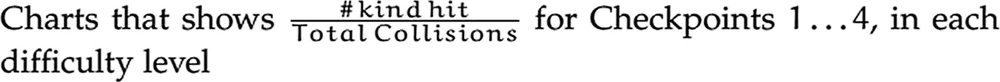

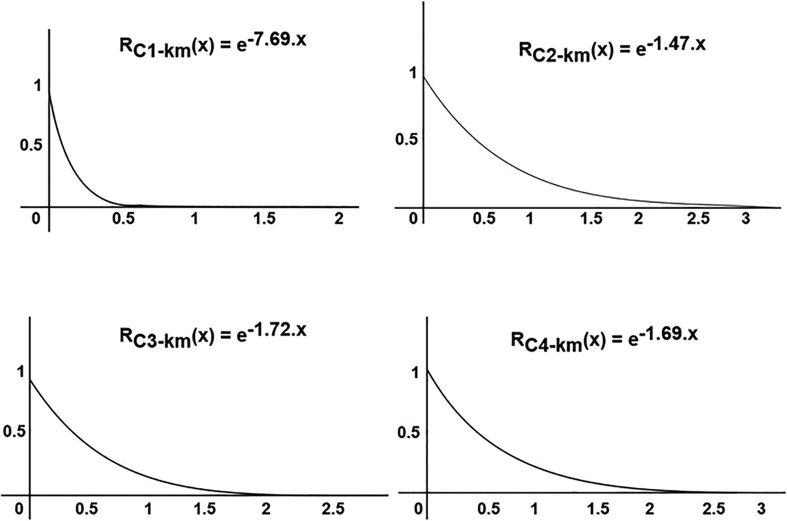

**图 17-19**
经过 `x` 公里后，系统保持运行的概率 `y` 的图示

- 用于观察汽车是否撞上墙壁、灯杆或围栏，从而判断其是否驶离道路。
- 用于观察汽车对不同难度等级的反应；例如，如果行人数量增加而与行人的碰撞减少，则系统可能具备防止撞人事故的能力。
- 用于识别系统在与特定物体交互时防止故障的能力。

这些图表可用于观察系统在训练过程中，随着情景复杂度的增加其性能如何变化，也可用于观察碰撞类型与安全检查之间是否存在任何关联。如预期的那样，初始检查点会与越野物体碰撞，这表明控制器的驾驶能力较弱。（见图 17-20。）

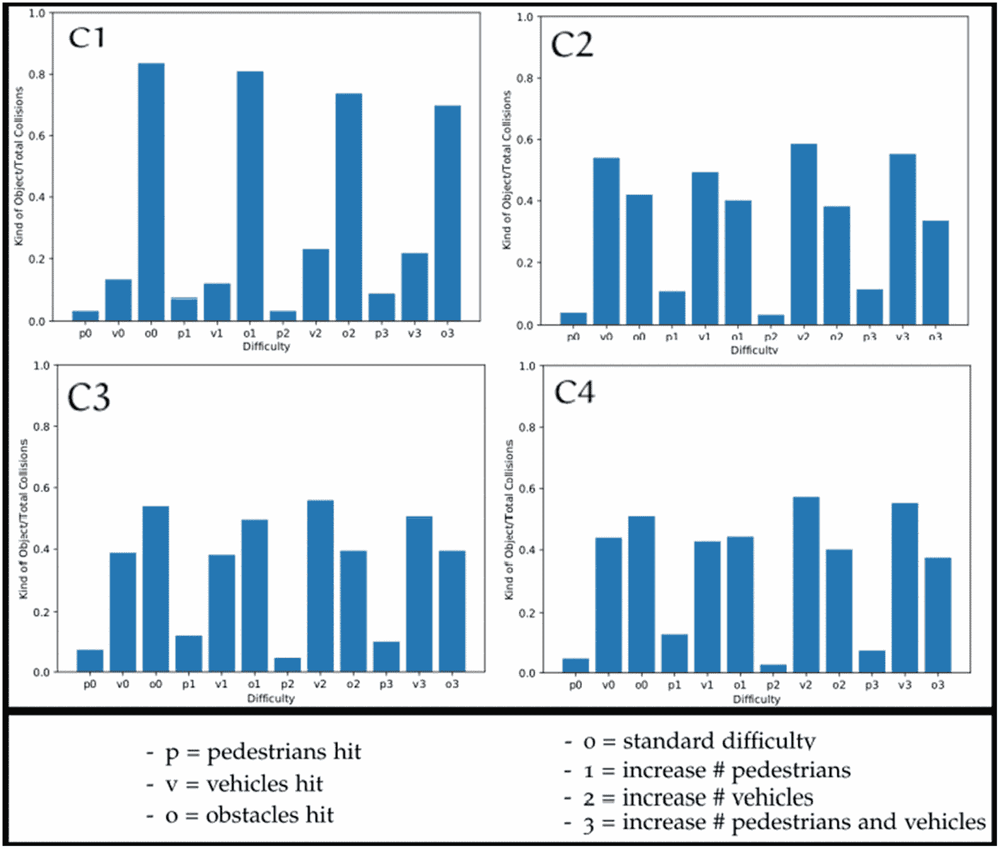

**图 17-20**
图表

此外，与普通障碍物碰撞的比例似乎有随着检查点总体成就而变化的趋势。将此图表与贡献度进行比较可以看出，`C1` 与障碍物碰撞的比例最高，而 `C2` 的比例最低。`C3` 增加了此类碰撞的频率，随之而来的结果是 `MTTF`/`MDTF` 的下降，而 `C4` 则降低了该频率。


#### 排版后的内容

尽管所描述的四个难度等级相对简单，但它们被证明是在训练环境之外评估系统性能的有效手段。在问题三和四中，`MTTF`和`MDTF`显著降低，表明高交通流量的场景更难以管理。同时，所选难度要素会影响特定类型物体的命中率增减。

这意味着报告的碰撞情况取决于周围环境。人口数量以及汽车数量的增加，会导致与这些“物体”的碰撞增多。随着人口和汽车数量的增长，与其他车辆的碰撞显然仍是事故的主要原因，这表明拥挤的交通会使控制器处于更危险的位置。

这些特征对于定义更困难的问题至关重要。这些指标还能用来检测不同类型碰撞的增减之间的关联。

通过采用第一步中提供的方法（包括场景开发、问题等级和所选指标），无需主动观察控制器的运行情况，就能了解其众多特征。此外，结合少数指定的度量指标，环境条件、初始状态和检查点之间的潜在关联可能会被忽略。

### 17.14.2 监控评估（第二阶段）

在控制器经过验证并记录其运行日志后，可以评估其安全性，以衡量其预测精度以及对整体系统安全的影响。

如前所述，每一帧都会收集激光雷达数据并传输至安全监控模块。然后，使用“传感器开发”章节中概述的算法对这些数据进行评估，并将包含车辆是否制动具体信息的消息发送回控制系统。与同类真实系统一样，这两个组件之间不存在协调：因为若存在协调将导致运行卡顿，控制器无法每帧都等待安全监控模块的响应。

采用以下方法来计算真正例、真反例、假正例和假反例的数量：

- 在安全操作模块与车辆连接后，复制启动阶段记录的控制系统运行过程。
- 允许安全操作模块发出警报，但仅在系统进入警报状态后经过时间 `t` 后才施加安全制动，如第 3 章所述。
- 由于选择“过早的” `t` 可能会对处理器已处理的操作施加制动，而选择“过晚的” `t` 则可能因安全制动启动过晚导致安全监控失效，因此 `t` 是影响观察结果可靠性的关键参数。当车辆从安全状态过渡到警报状态时，应尽快激活安全制动。遗憾的是，理解这一过渡发生的时刻并不总是可行的（在复杂运行中几乎不可能）。
- 基于汽车相对于速度限制的平均速度以及分析激光雷达数据并从安全监控模块获取响应所需的时间（本研究设定为两秒），在 `t` 之前产生的所有警告均被视为假正例。
- 真反例是指监控模块得出预测但未发出警报的所有帧。
- 如果系统在设定的单次任务最大持续时间内正常运行，但安全模块在时间 `t` 之后发出警报，则视为假正例警报。
- 因安全制动监控而成功避免事故（若发生）被视为真正例。
- 无论安全操作模块是否触发警报，只要发生碰撞，就归类为假反例。
- 在确定真正例、假正例、真反例和假反例的数量后，可以将它们组合成更精确的度量指标。

本研究提出的方法似乎是一种有效的策略，用于理解和验证控制器的行为假设，并监控监控模块自身的行为。监控模块的有效性似乎受控制器可靠性的影响。虽然真正例率稳定在 0.75 左右，但我们可以观察到，在 `C2` 之后，监控模块的精度下降，这引发了关于安全监控模块长期有效性的一些疑问。

精度的下降表明假正例增加，这使我们推测，由于控制器的新行为，监控模块无法准确识别系统的状态。每个检查点的马修斯相关系数支持这一观点，表现出与控制器学习过程相同的精度行为。我们有兴趣观察，一旦控制器在第三阶段受到约束，MCC 是否会降低，因为它是衡量监控模块整体性能的指标。

正如预期，该监控模块产生了大量假正例。这对所概述的监控方法的有效性没有影响，但确实有助于理解如果两个部分协同工作（即由于安全假监控模块的警报产生了大量“虚假”安全信号）时系统将如何表现。


  
查看精确率-召回率曲线能够快速直观地呈现安全性能监控器的衰退情况。这种监控方式与“简单”控制器配合良好，但当控制器经过更好训练后，则几乎会产生干扰。  

图 17-21 表明，尽管效率低下，监控器在最高难度设置下（即场景中行人与汽车数量翻倍时）表现最佳。控制器的次优表现出现在第二高难度设置下，即在`C1`之后，车辆数量有所增加的场景。尽管本研究无法完全探讨对控制器而言的“困难”与对观察者而言的“困难”之间的关联，但这些图表的绘制揭示了意料之外的行为，促使我们在未来的研究中对此进行更深入的探究。  

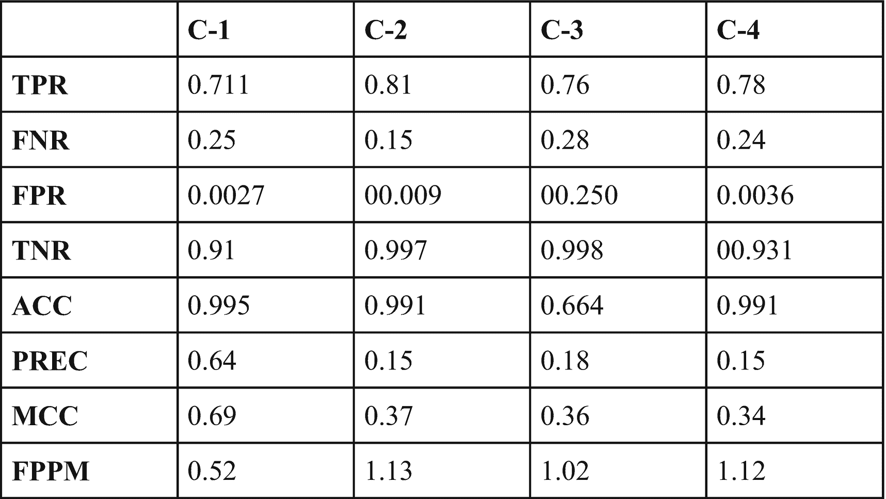  

**图 17-21** 控制点 1 至 4 的安全监控器预测率  

这些发现与收集和分析的数据一致：安全监控器在`C1`上表现良好，而`C2`至`C4`产生的结果几乎相同，其中`C2`的结果略优。  

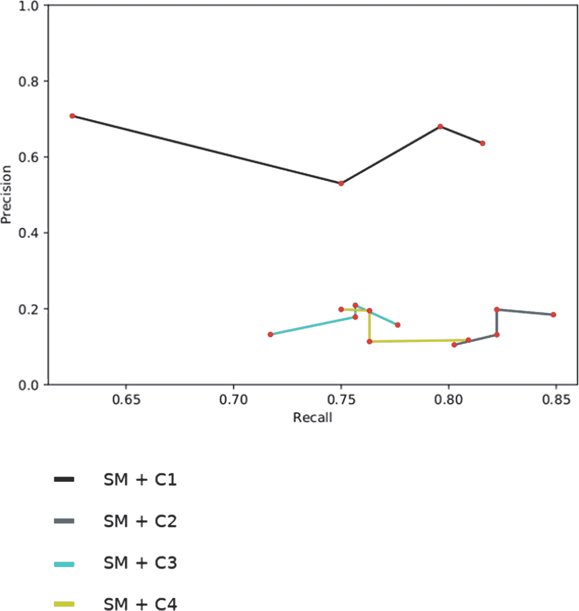  

**图 17-23** 比较`C1`至`C4`的精确率-召回率曲线  

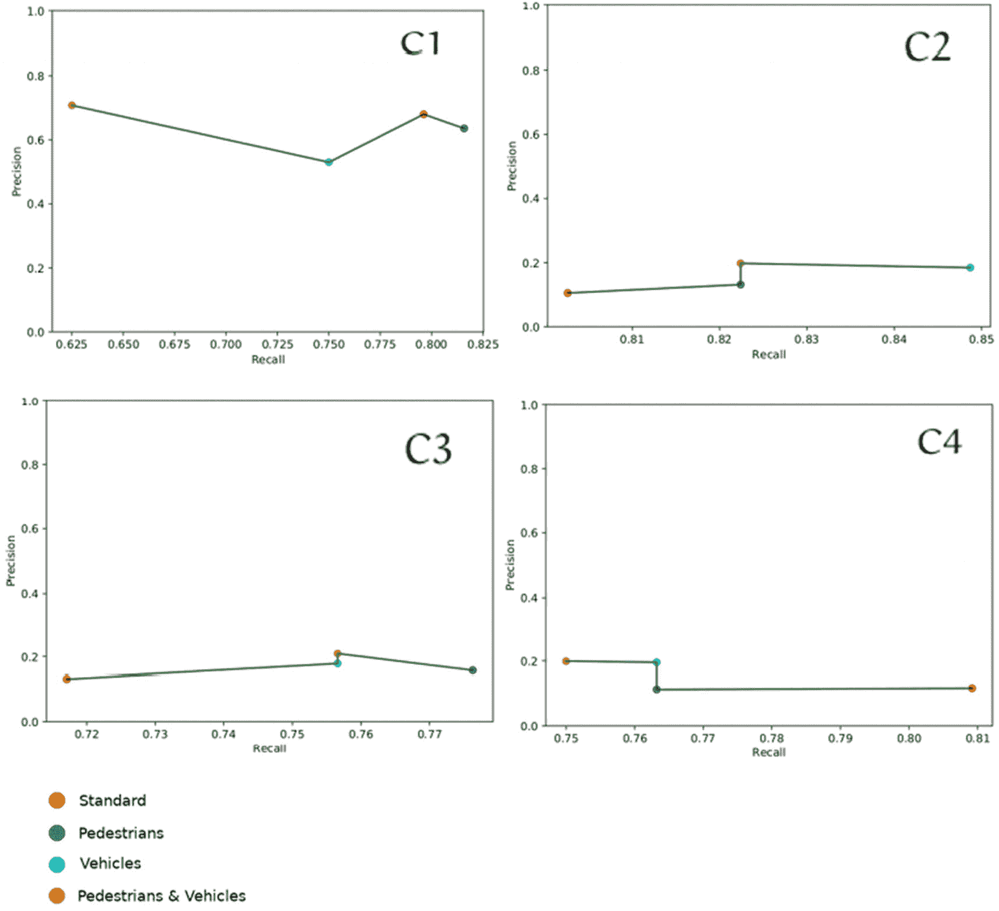  

**图 17-22** 基于各复杂度级别下的观测值，检查点`C1`至`C4`的精确率-召回率曲线  

为了理解安全监控器预测的结果，我们不得不亲自执行并观察第 1 阶段检查点`C2`的若干最佳运行轨迹。根据表中所示的假阳性原因比例，高速是导致`C2.7`监控器失效的主要原因。这类数据收集的另一个有趣方面是，随着网络学会处理新情况，安全监控器似乎会产生更多的误报，更重要的是，最终将导致碰撞的场景是监控器无法检测到的新型场景。  

图 17-24 中的表格展示了这种方法的运作方式，以及如何仅通过少量观测就能收集到大量关于系统行为的信息和证据。根据实际可用的硬件和仿真模型，可以获取并整合进一步的测量数据来补充这些信息。  

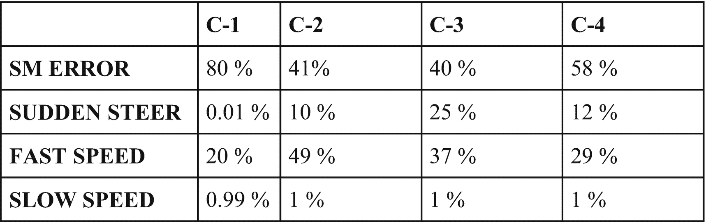  

**图 17-24** `C1`产生高比例的假阴性...`C4`  

正如我们项目开始时预期的那样，监控器的有效性似乎受到控制器行为方式的影响。最重要的是，有证据表明监控器的预测准确性与控制器的训练时长无关。使用不同技术重新训练网络，并对操作员使用相同的监控方法，可能会证实或反驳这一发现。  

### 17.14.3 重新训练与复检（第 3 阶段）  

如果第 2 阶段表明，同一安全监控器应用于不同检查点时效率不同，那么使用不同策略进行重构，并将通过这些方法训练出的控制器性能与默认方法训练的控制器进行对比，对于证实或反驳这一理论将至关重要。在此阶段，我们使用以下五种技术对`C4`进行了重新训练：  

*   **S0)** `Coach`框架的基础技术，用于训练`C1...C4`，优化方法根据整体神经网络质量计算。  
*   **S1)** 当汽车碰撞到物体时，惩罚函数形式现在更为严厉，但只要汽车不停车，刹车会得到稍高的奖励。  
*   **S2)** 安全监控器与系统相连，若触发警报，传感器的响应优先于网络的响应。  
*   **S3)** 若监控器触发警报，网络的行动将被监控器的行动替代。网络因表现得像监控器一样而获得正面激励。  
*   **S4)** 若触发警报，训练阶段终止，系统获得负面激励。  
*   结果为`{C5S0, C5S1, C5S2, C5S3, C5S4}`。  

遗憾的是，对于`S2`、`S3`和`S4`技术，基于安全监控器的方法并未产生预期结果。`S3`和`S4`导致控制器停止移动，而`S2`导致控制器在车辆前方有物体时（即使距离相当远）行驶几米后停止。由于不移动会获得低奖励，因此这些检查点都不会因其行为而意外获得高奖励。因此，神经网络陷入局部最小值与最大值之间的情形可能仍是一个理论，但我们认为训练时间过短。  

监控器极高的假阳性率很可能是罪魁祸首。以此方式进行长时间训练教会了车辆通过不移动来避免安全警报和监控器。尽管这些技术通过给予负收益惩罚来考虑车辆不移动的可能性，但这并不足以阻止车辆保持静止。  

我们认为`DDPG`算法的奖励函数定义良好，它考虑到了所有良好和不良行为，并且即时奖励是平衡的，因为不存在意外的高额回报。然而，由于网络应在各种困难和多样化的环境下驾驶车辆，调整所有奖励因子以避免出现我们所观察到的结果极其困难。最重要的是，我们无法得知这种行为是奖励函数设计的结果，还是需要更多训练才能观察到有趣的行为。  

训练中最重要的问题是时间投入；很难用`n`种技术训练`n`个智能体，然后等待它们训练完成再确定哪种方法产生了最佳结果。  

正如许多文献所证明的，网络参数的调整主要依赖于规则和启发式方法。然而，这些方法已被证明既耗时又容易出错。  

此外，目前试错法似乎是衡量奖励函数效率的唯一方法。由于训练数据仍在研究中，且自动驾驶汽车没有明确的规则，这个对这些算法而言独特的问题仍未解决。在学术界，为这些相对较新的算法设计奖励函数是一个热门话题，研究人员正试图找出如何提供合适的学习模型。  


好的，作为一名高级文档工程师和翻译员，我将严格按照您提供的注意事项和示例，将给定的英文文本翻译成中文。


同时，如前所述，与传统训练方法相比，强化学习训练需要大量数据，而这些数据常常难以获取或数量不足。存在多种框架用于设计相关性反馈的决策规则，但大多数似乎都侧重于如何加速学习过程，而非如何向这些网络中添加学习因子。

在控制器的再训练阶段之前，创建概率模型以帮助校准奖励系统参数，将是一种颇具吸引力的方法。由于防护性能指标得到了有效近似，本书中提出的技术将对这类模型的构建产生重大影响。

实际上，奖励函数无法事先知道每个状态应被赋予什么值。请记住，我们处于一个完全的空间状态，这很难描述，并且使得评估所有潜在的事件和转换变得困难，从而使我们的任务更加艰巨。

不幸的是，由于这些系统和技术的复杂性和独特性，需要更多的研究来解决这些问题，而开发一个模拟过程来辅助微调将在未来的工作中至关重要。

## 17.15 总结

本章探讨了如何对由控制器和系统管理员管理的自动驾驶汽车进行监控活动。

此类系统因其自身的复杂性及其所处生态系统的主要问题而需要特别关注。这项研究旨在作为定义如何监控此类系统的第一步。由于经常被用于军事活动，自动车辆并非一种新型设备。然而，由于自动驾驶汽车将在人类附近及城市环境中运行，在处理可能发生的各种事件时，将需要更加谨慎。

我们还质疑，当控制元件使用不同方法进行长时间训练时，其效能与相关安全监控元件的效能之间是否存在任何联系。我们在初始部分介绍了这些活动的基本原理，例如：

*   可靠性和安全性的定义，两者都是安全的关键组成部分。在自动驾驶汽车的背景下，我们审视了关键系统。
*   当前阻碍我们在城市区域部署自动驾驶汽车的问题。
*   对这些系统可靠性的错误/糟糕/乐观评估，在它们被部署时可能会产生怎样的灾难性后果。
*   分析因两个主要组成部件相互作用而产生的观察到的涌现行为时遇到的问题。

安全监控器的效能是否受到控制器行为的影响？如果是，又是如何影响的？受到训练时长和训练过程中所采用策略的影响。

在开发这种初始技术时，我们考虑了可用于此类活动的工具。我们不得不寻找开源替代方案，因为该领域的大多数解决方案都是私有的和专有的，这表明在非专业环境中进行这些研究是困难的。

激光雷达传感器问题本会使我们的研究不可行，如果没有庄的工作，这甚至可能是不可能的，因为我们当时唯一的选择是依赖地面观测，而这对于我们的研究是无用的。

虽然 Coach 框架是由英特尔人工智能实验室创建的，但它存在困扰开源项目的常见问题，其中最显著的是在阶段 1 中经过几轮训练后，两个 CARLA 代理中的一个无法移动。这个问题让我们怀疑，训练算法的架构中是否存在其他缺陷导致了 `C5S2:::4` 行为。

另一个阻碍该框架使用的问题是内存未能正确释放，导致其溢出并使正在运行的进程崩溃。因此，我们必须密切监控训练过程，并在每次事故后重新进行训练。

监控活动的设计考虑了以下主要特点：

*   **一致性：** 通过将每一帧中的控制器活动，以及随机数生成器种子、目标对象和每种情况的环境变量保存到文件中来实现。
*   **非侵入性：** 由于采用了客户端-服务器架构，代码插桩可能会提供非实时数据或不准确的测量结果。CARLA 解决了这个难题，它允许用户以固定的时间步长进行仿真。但硬件需要能够达到指定的时间步长。


*   **充分的代表性：** 监控自动驾驶汽车的主要问题之一是测试用例的代表性，因为危险事件可能非常复杂且数量众多，难以全面评估。在这方面，定义场景和难度级别有助于在相同情境下提供多样化的场景。为安全监控器生成的指标的预测价值引发了对数据集性质的担忧。我们解释并论证了在混淆矩阵中使用的指标选择，以及排除其他指标的原因。
*   **可用性：** 由于有大量可供选择的工具，其中许多工具存在显著的实际限制，为这项任务寻找合适的工具非常困难。然而，我们在本项目中使用的技术使我们能够完成这项任务。

同时，我们也不能忽视这些举措所面临的问题。这种方法已被证明是分析整个系统性能的有用工具，重点关注用于评估系统可靠性以及安全监控器有效性的知名指标。

情境和问题的创建对于确定外部因素是否会降低系统性能，以及创建和评估在构建特定安全案例时无法总是涵盖的“不常见”情况至关重要。

启发我们开展这项研究的主要假设是检验“静态”错误检查器的性能是否受到神经网络性能的影响，以及专门的训练方法是否也有影响。

根据收集到的数据，安全监控器对专家代理的有效性预计会发生变化，这促使我们进一步探究这一假设。那些使用安全监控器指导训练的失败方法（`S2`、`S3`、`S4`）并未为我们提供这一事实的证明，并且这个问题在本章开头已被强调。失败可能有两个原因：

*   奖励函数未被定义。
*   训练时间不足。

我们认为，由于训练好的代理并未因保持静止而意外获得巨大奖励，因此神经网络需要更多时间来理解安全监控器试图教导的内容。更大的仿真时间步长可以让我们以快于实时的速度运行仿真，从而节省时间。

我们无法长时间训练模型，也无法通过更改奖励参数来重新训练网络，因为这需要高性能硬件。与此同时，当安全监控器与通过修改训练方法从检查点`C4`获得的效果最佳的检查点结合使用时，其有效性较差。然而，当与使用`S0`方法训练的安全检查结合使用时，除了可能检查点`C2`之外，它具有相同的`TPR`（`0.75`）。

虽然如前几章所述，检查点`C2`无疑是一个特例，但对于`C5S1`也不能排除同样的理论。我们未来计划继续训练`C5S1`以验证这一事实。这项研究表明了在模拟环境中分析自动驾驶汽车的优势，它考虑并克服了在为这类系统计算相关指标时出现的许多困难，以及常见的监控问题。

下一章对全书进行总结，并给出区块链技术和分布式系统环境的概述。

脚注 1 2 3 4 5

# 18. 总结

本章总结了我们对区块链技术及其跨行业适用性进行考察后得出的主要结论。

区块链建立在一系列独特的属性之上，包括去中心化、防篡改、透明性、安全性和智能合约。由于没有中央权威机构来控制该系统，它非常适合抵御单点故障。在这方面，区块链中的记录是防篡改的，因为修改或删除交易记录极其困难。公共或开放区块链中的所有交易都是透明且可观察的。

所有交易都带有时间戳，这意味着诸如支付详情、合同、所有权转让等信息都公开地与特定日期和时间相关联。

然而，仍然存在许多未解决的难题，例如公共区块链的可扩展性和性能受限，这主要是由于使用现有`PoW`共识机制时交易量低或功耗过高。其他问题包括多数参与者可能串通入侵网络，以及网络高度依赖少数参与者。

密钥管理的额外责任是另一个主要的安全漏洞来源，这种责任可能简单到丢失一部手机或凭证备份，也可能严重到同样程度。

如何保护个人、敏感或机密信息是另一个需要更多研究的关键课题。

如果某些记录不需要透明，那么区块链中的透明数据就可能成为一个问题。因为错误或不一致而需要更新的公共可访问数据对区块链来说也是一个问题。

## 18.1 区块链在政策背景中的应用

欧盟（EU）已注意到区块链技术日益增长的受欢迎程度和关注度。最初的重点是加密货币和虚拟货币（如`Bitcoin`）的出现。在欧盟网站上，目前正在研究几项专注于区块链跨领域影响的举措。

欧盟在其近期工作中，与行业利益相关者、初创企业、政府、国际组织和民间社会密切合作，建立了区块链观察站和论坛，以及反假冒 Blockathon 论坛等重大项目。

欧洲议会（EP）也积极参与了此前及当前关于区块链跨领域潜力的讨论，并已通过一项关于虚拟货币的决议，这促成了`FinTech`工作组的成立。

此后，欧洲议会研究服务部发布了关于该主题的研究报告和其他材料。此外，还有两项决议，标题为“分布式账本和区块链技术：通过去中介化建立信任”。


### 18.1.1 避免公地悲剧

区块链不仅仅是一项信息与通信技术（ICT）的突破；它还催生了新的经济结构和治理形式。作者提出了两种区块链经济学的方法：以创新为中心和以治理为中心。作者认为，基于新制度经济学和公共选择经济学的治理方法是最有前景的，因为它将区块链视为一种形成自发组织或新型经济体的新技术。

文中将以一个基于以太坊的基础设施协议和平台作为案例研究来论证这一点。^(²¹)

基于这些论点，其核心理念是：区块链允许你以一种不可辩驳、永久且共享的方式，记录每个个体在公共资源中的访问情况，以及每个时间段内对其潜在收益的相对使用情况，同时提供该资源在同一或其他时间段内可用性的全部信息。

那么，访问的可能性可以基于一个协议进行先验条件设定，该协议在主体之间平均分配特定时间段内的资源可用性。此后，基于对高峰使用时段的共同认知，以及在资源未被使用的时段对其进行可能的强化。这种强化可以通过两种方式实现：

*   通过个人决定推迟其消费习惯至非高峰时段，前提是这样做能带来同等的效用。
*   为了社区的利益（从而实际创造公共价值），免费或通过既定的奖励（以称为`tokens`的代币形式），将其原本有权使用但无法或没有当前兴趣使用的资源部分重新投入流通。

第二点值得进一步思考。对公共资源生产的外部激励越大，该平台就越可能向市场逻辑极化，在这种逻辑中，行动的*外在*动机占据主导地位，或者至少会显著扭曲社区逻辑中的*内在*动机。例如 Backfeed 就是这种情况，它是一个基于区块链的创新性去中心化公共资源生产平台，提供了复杂的功能来开发与用户社区外部融资相关的激励措施，并通过可用于购买其他商品的加密货币来表达。通过这种方式，参与者根据一种类似于基于个人利益的交换机制被聚集和协调。

然而，要断言一种真正另类的逻辑，那么代币应该在社区内部“铸造”，其交换价值应根据同一公共资源或不同公共资源收益之间的价值来确定，而该价值又可基于其生产/利用所需的工作量/时间来确定。关于价值（劳动）来源的信息将以不可修改的方式（除非进行相当复杂的黑客活动）记录在代币数据中，该数据可以根据请求的优先优先级被接受并增值。

例如，假设安东尼奥和弗朗西斯都想用区块链加密货币购买一个苹果。维托里奥种植并销售苹果，需要代币来购买水。安东尼奥拥有用于购买水的代币，而弗朗西斯科拥有用于参观博物馆的代币。假设采集苹果和水所需时间相同，而参观当地博物馆所需时间是生产前两者所需时间的一半。安东尼奥的交换具有优先权，因为作为苹果种植者和销售者，维托里奥更偏好用于购买水的代币。而实际上安东尼奥只需花费一个代币就能得到一个苹果，弗朗西斯则必须先花费他的两个代币从安东尼奥那里购买一个水代币，然后他才能用水代币来换取弗朗西斯的苹果。

这个机制会产生对两个水代币（由维托里奥和弗朗西斯需求）的额外需求，这与两个博物馆代币（由弗朗西斯提供）和一个苹果（由维托里奥提供）的供给相对应。这将通过增加社区保护该资源的兴趣来提高水代币的价值。

我们注意到，总体上该系统为所有用户提供了完全的透明度，因为所有被认为与共同目标一致的行为都受到点对点评估，这进一步决定了网络/社区实际感知到的价值。我们还注意到，这种类型的交易验证协议基于一种所谓的价值证明（`Proof of value`），而不是像比特币区块链所谓的挖矿活动中那样基于解决数学难题（`Proof of Work`），这能显著节省计算能力和能源消耗。

在所假设的系统中，所有活动都可以被清晰地监控，从而对整个社区可见，与社区自身逻辑不一致的行为可以被识别、制裁，相关的持有者被边缘化。尽管是匿名且近乎虚构的，但在用户社区内可以建立起信任。

公地悲剧概念中隐含的假设，即共享资源者之间缺乏沟通的问题，可以被否定，而远程通信网络的广度可以将合作规模远远扩展到简单的本地层面以上。显然，即使对于区块链，如同任何其他远程通信活动一样，也无法完全避免与敏感数据不当使用、其一般性保护及其主权相关的风险，这些风险可能会显著抑制该技术的有效传播。

我们观察到，区块链在克服公地悲剧方面的作用并非源于它是一种“新”技术，而在于它有能力在功能上解决使用公共资源所隐含的决策协调问题。

因此，只有认识到这些问题并愿意处理它们，同时结合用户之间对沟通、互惠和共享的公共文化的认同，才能确保区块链提供的技术方案真正有助于构建一个自组织的生态系统，能够实现对公共资源的“冲突的愉快解决”。显然，区块链同时保证奖励机制的特性也与这种构建的可行性并非无关。

## 18.2 变革产业与市场

区块链技术预计将使众多行业、企业和公司受益，这些实体目前正在对其进行试验，或者其行业或企业可能在不久的将来受到其存在的影响。例如，基于区块链的解决方案可以使制造商、零售商、分销商、运输商、供应商和消费者等原本难以互相信任的参与者在全球化和分布式的供应链中更容易地连接起来。

从农场到餐桌，贯穿食品种植、储存、检验和运输的可追溯性和质量控制，可以提高所有利益相关者的责任感。原产地证明、遵守环境法规、有机标签、公平贸易等方面，可以帮助消费者做出明智的决定，并帮助企业向更可持续的商业模式转型。


### 18.2.1 政府与公共部门

为特定公民提供个性化服务、提升政府信任度、以及改进自动化、透明度和可验证性，这些都是区块链技术为公共部门带来的优势。在某些情况下，采用区块链技术执行公共服务可带来显著的额外效益，其中安全性提升便是一个例子。

例如，基于区块链的政府签发身份证明，能为公民、企业和政府在开发、管理和获取特定服务的身份信息方面节省时间和金钱。诸如养老金、缴款、补贴及其他款项等公共福利，可以受益于由区块链驱动的去中心化网络，从而无需额外的第三方或中介机构即可进行交易。

区块链可用于教育领域登记数字凭证，实现快速验证与确认，同时为教育机构和企业简化繁琐的行政流程。

总体而言，区块链尚未大规模融入现有系统以创造能够为公民提供更好保护的新功能。在提供财产数据或链接到特定个人或实体时，这项技术仍需依赖来自中心化或政府系统的输入。

此外，如何确保在没有法院参与的情况下，以电子方式发送的声明具有外部一致性，也是一个问题。尤其是需要利用智能合约处理的大量交易，是一项重大挑战。最后，建立、调整并维持众多不同企业之间的协作能力，对于区块链技术的采用至关重要。

### 18.2.2 数据管理

大多数企业和行业已在应用数字化数据管理，这一趋势在不久的将来很可能会持续。由谁处理、存储和拥有数据，以及他们这样做的原因和方式，是或将是任何公司的关键问题。区块链可以提供额外工具，作为防篡改账本，确保数据的有效性和可靠性。

## 18.3 安全建议

如果管理得当，区块链可以显著降低物联网系统的成本并提高效率。然而，技术融入物联网环境远非完美。例如，预计到 2021 年，只有 10%的生产用区块链账本会包含物联网传感器。此外，大多数物联网系统在计算能力上还远未达到能够处理大规模区块链实施的水平。

虽然单点故障问题尚未消除，但物联网安全基于为所有连接设备持续提供安全保障。物联网用户，无论是个人还是组织，都应寻求具有端到端保护的多层安全体系，该体系应覆盖从网关到终端的范围，并能防止潜在的网络漏洞和入侵。这包括以下章节中涵盖的问题。

### 18.3.1 隐私政策

区块链网络可能遭受安全和隐私攻击。本主题在多个章节中均有涉及，这些章节描述了攻击面，识别了共识协议中的漏洞，讨论了无需许可和需要许可的区块链面临的安全与隐私威胁，确定了防御重复支付的策略（无论是区块链技术自身发展的还是研究人员为减轻这些攻击影响而提出的方法），并探讨了可以采取哪些措施来减轻这些攻击的影响。

通过密码学，区块链在任何时刻都能记录加密货币生态系统中所有现存币的所有权。一旦交易被其他网络成员或节点验证并通过密码学确认，它就会被记录在区块链的一个“区块”中。交易的时间、之前的交易以及交易详情都存储在一个区块中。

交易按时间顺序保存，一旦作为区块被录入，便无法修改。自区块链技术的首个应用——比特币问世以来，该技术加速了新型加密货币和应用的发展。

由于去中心化，数据并非像传统系统那样由单一机构检查和处置。相反，连接到网络的每个节点或计算机都会验证交易的合法性。密码学在区块链技术中保护并验证交易与数据。随着技术使用的增加，数据泄露变得更加普遍。

个人数据和信息被保留、处理不当和滥用，对隐私构成威胁。许多人希望区块链技术能被广泛使用，因为它能提升用户隐私、数据安全性和数据所有权。

### 18.3.2 智能合约

另一个需要填补与区块链相关的空白和期望的重要领域是智能合约。基于区块链的智能合约能为公司、组织和公共管理部门带来巨大利益。

前景毋庸置疑，保险、物流和采购等行业已经收获了重要的好处。同样，在从现实世界、物理世界和数字世界的过渡阶段，一个极其重要的问题仍然存在，即确保由主体、个人或公司提供的、且已被正确识别的信息是准确无误的。

### 18.3.3 分布式计算系统

分布式计算系统用于解决计算密集型问题。该领域有两大类别：

- 集群计算
- 网格计算

*集群计算*涉及通常相似且位于同一区域的计算机，通过高速数据网络（局域网）连接。例如，你可以使用 Beowulf，它能够通过一台主计算机将一组进程分配到一组 Linux 机器上。

集群计算的一个应用领域是天气预报的计算。位于英国伯克郡雷丁市辛菲尔德公园的欧洲中期天气预报中心，由数十万个相似系统组成，这些系统通过一个极高速度的局域网（数量级达太比特）连接。

在*网格计算*的情况下，资源是异构的，并且可能属于不同的机构。由于属于不同机构，这些资源通过地理数据网络（通常是互联网）连接。

网格计算的一个例子是用于搜寻外星生命的 SETI 项目。分布式计算系统的编程需要使用某种特殊的库，这些库有助于利用物理基础设施。

在集群架构和网格架构之间进行选择的标准是评估节点之间需要交换的数据量。如果需要交换的数据量很大，则必须使用集群计算。然而，如果数据量稀疏，则可以使用网格计算。高性能计算本身就是一个独立的研究领域。


### 18.3.4 分布式信息系统

这些系统的目标是管理分布式信息。也就是说，我们拥有来自不同系统的信息片段，并希望以某种方式对其进行管理，使它们看起来像是全部存在于一个系统中。

经典例子：分布式数据库。可能存在以下实现方式：

- 分布式事务处理（或 TPS：事务处理系统）
- 企业应用集成（EAI）

**分布式事务处理。** 在事务系统中，ACID（原子性、一致性、隔离性、持久性）属性适用于数据库。

具体来说，原子性指的是能够执行一整块指令，否则就什么都不做。一致性意味着所有的约束条件都得到了遵守。隔离性意味着多个并行事务互不干扰。持久性意味着当事务被提交后，操作的结果是永久性的。

分布式事务系统比集中式系统具有更大的固有难点：它们可能会崩溃。试想我们正在处理多个数据库，每个数据库位于不同的系统中。如果在一个中间数据库中的任务失败，那么还需要取消所有先前已完成任务的数据库中的工作。

通常使用**事务处理监控器**（TPM：Transaction Processing Monitor）来实现分布式事务系统。基本上，它采用一个中央系统来收集请求，并将其分发到不同的系统，精确地验证各个操作的进展情况。这样，信息是分布式的，但控制逻辑是集中式的。

除了集成数据库，还可以考虑集成应用程序，从而接近企业应用集成的概念。

在这种情况下，会有一系列配备了对等通信接口的服务器。通过访问包含所需信息的各个服务器来构建所需信息，然后进行适当组装。这种方法比 TPM 复杂得多。例如，考虑带有服务访问接口的 Web 服务器。为了集成相关数据，需要对相关服务的响应进行处理。

### 18.3.5 分布式普适系统

普适分布式系统是我们周围环境的一部分。构成它们的设备需要发现服务并适应环境。

普适分布式系统的示例包括：

- 家庭系统
- 用于医疗保健的电子系统以及无线传感器网络

一个典型的家用系统具有以下特点：

- 自我管理
- 自我配置
- 个人空间

电子医疗保健系统由传感器组成，这些传感器检测患者的健康指标（运动传感器、心电图等），并通过体域网（BAN）将其传输到一个集线器，该集线器收集这些数据并将其重新传输到中央存储库。

另一种架构是通过持续的无线连接，将测量传感器连接到外部存储系统。与家庭系统不同，医疗保健系统不能采用单一服务器架构进行部署。

医疗保健系统需要网络内计算能力。无线传感器网络（WSN）是分布在物理空间中的自主传感器系统，它们协作监控物理或环境条件。

它们在以下方面受到严格限制：

- 处理能力
- 内存容量
- 供电能力

这些系统在以下方面尤其具有挑战性：

- 能耗
- 编程
- 安全性
- 路由
- 软件工程
- 中间件

通常需要获取从传感器网络收集到的信息。有多种可能的架构。

可以假设传感器之间不相互协作，也不存储收集到的数据，而只是将数据直接发送给操作员；或者，也可以采用能够处理并存储数据的传感器。作为对查询的响应，只有负责所请求数据的传感器才会发送答案。

这些解决方案并不太理想，因为：

- 能耗很高。
- 需要限制返回给操作员的响应数据。

由于这些原因，人们认为需要具备网络内处理能力。为此，可以使用发布/订阅（pub/sub）模式。

## 18.4 客户端与服务器架构剖析

### 18.4.1 客户端

客户端的功能是允许用户与服务器进行交互。此功能可以通过多种方式实现。客户端可以通过仅向用户提供界面来提供对服务器服务的直接访问。在此上下文中，服务器完成所有工作。这种客户端被称为**瘦**客户端。

一个例子是 X Window 系统机器，在这种系统中，客户端仅负责显示由服务器决定生成的图形。

客户端也可能托管一些超越了纯粹图形界面的软件组件，承担部分应用逻辑，并逐渐发展到极端情况，例如自动取款机（ATM）和电视机顶盒。在这些情况下，用户界面可能成为客户端软件中占比较小的部分，而本地处理与通信支持则可能成为主要组成部分。

到目前为止，我们讨论了软件的功能性需求。但也可能存在非功能性需求。

例如，数据访问的透明性通常通过在客户端上运行一个软件模拟器来实现，该模拟器提供与服务器相同的接口，从而屏蔽差异（数据和通信格式）。

租约、迁移和重定位通常通过命名系统并在客户端软件的配合下完成。例如，考虑一下你手机的工作方式。当你走路时，手机会测量它当前所连接小区的信号强度，并将其与它接收到的其他小区的信号强度进行比较。

当参考小区的信号强度下降过多时，手机（即客户端）会触发更换参考小区的过程，请求连接到可用信号中最强的那一个。

类似地，当处理嵌入式系统和多 TCP（传输控制协议）时，这意味着第四层（蜂窝网络）客户端会打开多个 TCP 通道（例如，通过无线网络和 WiFi）。它会将 TCP 流量路由到性能最佳的通道上。如果当前通道的信号因你离 WiFi 接入点太远而变差，你的手机会将 TCP 流量切换到无线网络。实际上，如果两个信号都很好，它可以在两个网络上进行负载均衡。这是一个服务重定位的例子。即使是通信错误的屏蔽通常也在客户端侧完成。


### 18.4.2 `Server`

一个*服务器*是实现特定服务以供一组客户端使用的进程。组织服务器有多种方式。迭代式服务器直接处理请求并响应客户端。并发式服务器不直接处理请求，而是将其传递给一个单独的线程或进程，之后它们会等待下一个请求。

并发式服务器使用线程或进程来实现。

服务器工作的端口要么是已编录的，要么是已知端口。存在一些超服务器，它们可以启动其他服务器。当超服务器看到针对特定服务器管辖端口的调用时，它会激活该服务器。有一些 UNIX 服务负责执行此工作。并且，超服务器仅适用于那些很少被调用的服务器。

可能有必要为服务器建立两个通道：一个用于正常工作，另一个带外通道用于发送控制信息。一个经典的例子是 FTP。

另一个需要考虑的方面是，可能有必要管理请求的状态。无状态请求的服务器被称为*无状态*服务器，而如果请求有需要处理的状态，则称为*有状态*服务器。

无状态服务器不需要存储执行客户端所请求服务所需的信息。它只需通过发送所请求的数据来做出响应。如果它存储了与过去相关的某些内容，这些内容对于处理所请求的服务并非必需。Web 服务器就是无状态服务器的一个例子。在这种情况下，如果需要保持状态信息，则必须将其保存在客户端（例如 Web 或 HTTP cookie）。

相反，有状态服务器需要为每个已连接的客户端维护处理所请求服务所需的信息。例如，文件服务器需要为每个客户端维护正在进行中的请求状态，以防止两个不同的客户端同时对同一个文件进行写入。

是否为每个客户端管理请求状态会产生非常显著的影响。无状态服务器的开发要简单得多。

不仅因为它们需要保持控制的数据较少，更主要的原因是，如果无状态服务器崩溃，你可以直接重启它。你不需要重建状态。

另一方面，如果有状态服务器发生故障，则有必要为每个客户端重建正在进行中的操作状态：这是一个复杂得多的操作。另一方面，有状态服务器通常速度更快，尽管更为复杂。

## 18.5 关于分布式系统的问题

### 18.5.1 中间件在分布式系统中的作用是什么？

中间件是位于操作系统和架构层之间的一个软件层。它可以提供关于数据访问的透明性。例如，一个用 C 语言编写的客户端必须与一个用 Java 编写的服务器进行交互。Java 虚拟机确保了对整数数据的统一定义。

相反，C 编译器会对整数数据的内存访问进行优化，因此通常来说，不同硬件系统上的数据结构会有所不同。就像小端硬件系统和大端系统之间的数据格式可能不同一样。中间件可以解决这些关于数据访问的差异。但它还可以提供其他服务，例如提供一个通用的 API 来编写其他服务。

中间件用于提高分布式系统的透明性，而这种透明性在网络操作系统中通常是缺失的。也就是说，中间件增强了分布式系统应有的统一视图。

### 18.5.2 什么是（分布式的）透明性？

分布式透明性是指向用户和应用程序隐藏系统具有分布式方面细节的能力。例子包括数据访问透明性、定位透明性、迁移透明性、重定位透明性、复制透明性、并发透明性、故障透明性和持久性透明性。

### 18.5.3 为什么在分布式系统中有时很难隐藏故障的发生及其恢复？

因为通常情况下，无法区分以下两种情况：由于服务器宕机而长时间等待响应，与由于服务器响应缓慢而导致的相同等待。因此，当服务器实际上只是需要时间来响应时，系统可能会声明该服务不可用。

### 18.5.4 在开发分布式系统时使用两种不同的编程语言是否可行？

一个用 C++ 编写的服务器程序提供了一个 `BLOB` 对象的实现，该对象可以被一个用 Java 编写的客户端程序访问。服务器和客户端可能有不同的硬件，但它们都连接到互联网。描述需要解决哪些问题，才能使客户端在服务器上调用一个对象的方法。

在硬件和软件层面都需要解决一些问题。硬件可能具有不同类型的数据存储方式（高位优先 `MSB` vs. 低位优先 `LSB`），而软件使用不同的结构来管理数据（`C++` 对象与用 `Java` 编写的相同对象不同）。因此，在这些情况下，有必要使用一个能够处理相关实现细节的框架。

拥有不同的硬件意味着在从客户端到对象的请求和响应消息中，数据可能有不同的表示形式。必须为每种在客户端和对象之间双向传输的数据类型定义一个共同的标准。

此外，计算机可能有不同的操作系统。因此，有必要处理不同类型的操作来发送和接收消息或执行方法调用。在 C++/Java 程序中会定义一个通用操作，该操作将被转换为所用操作系统内的特定操作。

由于使用了两种不同的编程语言 C++ 和 Java，因此有两种不同的表示数据结构的方式。有必要为每种要传输的数据结构定义一个共同的标准，并为每种语言定义一种解释该标准的方法。

### 18.5.5 缓存和复制之间的区别是什么？

*缓存*会复制部分数据，并且通常是在客户端进行。*复制*则会完整地复制一个节点，并且在服务器端进行。复制的一个好处是系统的可扩展性。

复制的一个缺点是，在数据频繁更新的情况下，更新副本所需的数据流量和时间可能会变得难以承受。

### 18.5.6 什么时候使用集群计算机比使用网格计算机更合适？

*集群*用于不同计算机之间通信速率要求高的场景。服务器通过高速数据网络连接。

网格计算面向客户端/服务器类型任务的执行：分配一个任务，然后执行它。服务器通过互联网连接，可以属于不同的组织，并且节点可以具有不同的功能。

### 18.5.7 如何区分不同类型的分布式系统？

*企业信息系统*管理分布在不同节点上的不同数据集，其目标是使整个数据集透明化，即就好像所有数据都集中在一个节点上一样。

*普适计算系统*是分布在环境中的一组自治节点，它们协作以实现共同的目标。


## 18.6 区块链的优势与劣势

需要注意的是，区块链技术的使用有许多应用场景和优势，其中包括：^(²²)

- `区块链`技术消除了交易中对第三方中间人的需求，允许交易参与方在没有监督交易的第三方介入的情况下进行交易，从而降低了双方违约的风险。
- 由于每个区块关闭时会确认交易的有效性，因此数据和信息质量很高。交易如果没有完成，就不会被纳入指定的区块。每个区块以及整个区块链中包含的信息均具备一致性、时序性和可信度，从而确保了高水平的数据质量。

另一个需要考虑的重要因素是该技术的持久性和可靠性，因为网络在本质上是去中心化且点对点的，没有中心节点。由于缺乏中心节点，去中心化有助于在系统发生故障甚至遭到黑客攻击时对其进行保护。每个“节点”都拥有一份数据副本，从而确保数据不会丢失。

区块链技术的另一个优势在于流程的完整性。用户必须确保交易将按照提议的条款完成，否则该交易将被作废。对于交易透明度而言，另一个重要方面是透明度、不可篡改性和可公开性，这些都与公有区块链相关。

将所有账本交易压缩到一个公共账本中的过程，体现了易收集性，同时也降低了每笔交易的成本。在没有第三方介入的情况下，相关支出和贸易产品也会减少。

采用区块链技术还对环境有益，因为它减少了打印的文档数量和文件存储空间。每份文档或每笔交易都可以被隐藏或转换为代码，并在账本中进行引用，这说明了区块链技术用途的广泛性。

其他有用的基于区块链的应用包括：

- **创建分散且自治的市场。** 据某位专家称，这类似于一个虚拟购物中心，将众多品牌和企业集中在一个地方。因此，区块链确保了资产以安全、保密和及时的方式进行转移，同时为出纳和资产管理提供了灵活性。
- **该技术具有自给自足的特性，无需使用第三方中间人。** 由于公开竞争和最优价格的存在，如果一家公司以真实性保证向潜在客户提供有价值的产品，这种联系便是有益的。
- **简化了商业交易。** 利用这项技术，成本管理变得更加容易，因为它允许企业建立供应商和合作伙伴网络，自动化合同，并在整个供应链中对其进行监控。此外，由于减少了人为接触，区块链最大限度地减少了交易错误或信息缺失，并提高了双方之间的敏捷性。
- **管理和保护去中心化的私人记录。** 每一条记录都是加密的，并且需要唯一的访问密钥，从而确保了数据的绝对安全，尤其是在教育机构和人力资源领域的企业中，无需担心被伪造。
- **监控产品和材料的来源。** 区块链可以确保产品的质量和安全，以及其投入品的可追溯性。

据 Garcia 称，使用区块链技术可以实现其优势之一，即`数字主权`，它使用户能够同时识别和控制其个人数据的存储和管理。

区块链技术的另一个内在优势是资产转移的速度，考虑到某些金融机构需要数天才能完成电汇，并且周末不营业。时区在国际贸易中起着作用。由于采用了区块链，交易可以全天候 24 小时进行，任何地点都能快速确认发货。还有什么困扰着对区块链技术及其商业应用感兴趣的人们呢？这就是问题所在。据 Wood 称，在公共网络上进行无许可的调用与在私有网络上进行需许可的调用之间没有区别。

在参与者已知的私有网络中，点对点网络中的节点结构决定了安全性。由成员共同验证允许的记账交易。私有区块链的运营者控制着每个节点可以做什么以及它们如何连接，并且每个节点都拥有一份持续更新的精确账本副本。一个活跃节点必须拥有一定数量的活跃连接才能被视为合法节点。

因此，在信息传输中表现出缺陷的节点应被识别并加以抑制，以维护系统的完整性。采用共识操作的高可用性策略来避免系统锁定。在工作量证明机制下，在授权创建新区块之前，需要经过一个验证步骤，这提高了流程的安全性和可靠性。

在公有网络的方式中，成员验证，也称为共识，平均每 10 分钟发生一次，用于选择领导节点验证者来执行账本更新，这一技术被称为`数据挖掘`。在这种环境下，交易在几个小时后才被认为是安全的。同时，在完成新更新后，交易可能会失效，这被称为`分叉操作`。对更早的记账交易运行分叉。

由于公有网络需要挖矿，据推测其安全比例无法达到 100%，但使用替代的共识算法方法可以决定谁像按比例投入的矿工一样，在区块链中投入尽可能多的资源。

此外，还需要指出区块链技术部署可能遇到的一些问题，包括：

- **矿工的速度：** 他们旨在敏捷地验证进入区块链的交易和信息，这需要高收入和高昂的设备投入。
- **国家监管：** 可以理解，对于这项技术的监管存在一些担忧，尤其是对于区块链中像比特币这样的`加密货币`。金融机构和国家本身失去了市场份额，导致了经济和政治不稳定。
- **电力消耗：** 区块链矿工需要花费时间和大量计算机资源来验证交易。
- **控制、安全与隐私：** 在没有国家监管的情况下，即使有智能合约，也无法控制或保障数据共享的安全性，因为合约可能被违反。
- **集成问题：** 区块链技术仍然较新且应用较少，网络的建立取决于各方是否接受承诺，以制定内部策略来大规模应用这项技术。在这种背景下，其范畴需要更广泛，才能将区块链视为去中心化网络。
- **成本：** 操作的价格和时机虽然降低了，但另一方面，应用所需的初始资本成本非常高。
- **应用复杂：** 该应用缺乏不同项目之间的协调，这可能会成为一项艰巨的任务。


## 18.7 区块链技术与成本削减

据拉莫尼尔称，2018 年，23%的组织计划在其业务中采用`区块链`技术。金融机构的占比最高，而 43%的企业虽然对此感兴趣，但尚未就这一主题进行研究。尽管在`区块链`得以应用前还需要更多研究，但它有能力管理大型企业并改变经济格局。

有必要定义`POC`（`概念验证`）的概念，这是`区块链`在测试阶段使用的一个术语。根据拉莫尼尔的说法，许多公司准备为这项技术的概念验证进行投资，而最近的一项民意调查显示，66%的专家和 CEO 认为`区块链`将成为下一次数字革命。

银行系统是`区块链`应用最成功的行业，它使得那些采用`区块链`安全性的新创公司能够从已建立的传统机构寻求投资，其中一些机构已经适应了这项技术。

`区块链`在该领域的应用，使金融服务在金融交易中具有更高的准确性和安全性，从而能够以极大的敏捷性为国内外客户提供更好的服务。

在金融服务领域内，其优势包括降低成本、加快结算时间、提高数据质量、实现简单透明的审计以及增强安全性。

一些机构已经开始自行研究数字资产。近期数据表明，这可能会通过降低实际利率、减少费用和货币交易成本，以及提高中央银行稳定经济周期的能力，来提升 GDP。支付、清算和结算方面的效率提升可能会因缺乏匿名性而被掩盖。

一家英国金融科技公司刚刚发行、批准、结算并注册了世界上第一只完全建立在公共`区块链`基础设施上的加密货币债券。这笔金额被合法记录为金融活动，这也是其另一个独特之处。沙盒监管机构负责对此进行监督。

在二级市场方面，据信涉及`区块链`技术的首批交易之一，是一家资产管理公司购买了一只使用该平台生成的巨灾债券。该公司表示，与传统的交易方式相比，相关的交易成本要低得多。

金融部门正在注意到`区块链`的独特特性，一些主要金融机构宣布他们正在试验这项技术。例如，全球 40 家主要银行参与了一项大规模试验，该试验使用多个`区块链`技术供应商来测试一个用于交易固定收益资产的系统。

在我们日益互联的世界中，`区块链`技术有潜力使彼此信任度不高的各方，能够在极少或没有中介的情况下，以点对点的方式交换任何类型的数字资产（货币、合同、土地、医疗和教育记录、服务或商品）。

`区块链`和分布式账本技术（`DLT`）存在许多可能性。除了这些`区块链`的应用之外，还有一些根本性的障碍阻碍着`DLT`在金融领域的广泛采用：

-   **性能和可扩展性：** 由于应用程序设计的复杂性，`区块链`技术的当前有效性受到限制，这可能导致系统延迟带来瓶颈。
-   **隐私性：** 所有信息在参与者之间共享是`DLT`的主要优势之一。然而，在金融交易中，这可能会导致保密性问题。密码学和零知识证明是应对这一挑战的两种实验性解决方案。
-   **过时的基础设施：** 旧的遗留基础设施必须与`DLT`进行接口对接，但由于底层技术的差异，转换起来可能很困难。
-   **更新和维护软件：** 在没有中央权威的情况下更改软件需要参与者达成一致，并且必须维持这种一致以避免链中断。
-   **实际应用：** 支付案例中只分析了一小部分参与者。大多数实际应用涉及加密货币投机。

## 18.8 总结

尽管`区块链`技术因支持比特币而最为人所知，但它正被用于广泛的应用场景中。这项技术是各方之间的共享永久性记录，展示了一种基于信息去中心化的安全机制，主要应用于金融领域。其职责范围已扩大到包括任何文件的安全保管²³。

全球化是`区块链`的主要优势之一，因为它不受数据、金融甚至政府等外部变量的影响。其技术用于跟踪交易记录，特别是金融交易，这些记录被保存在一个带有哈希值的区块中。当一个区块完成时，它会被哈希处理，表明该区块的交易是合法且不可篡改的，然后一个新的起始区块被创建。

这项技术使参与者，无论是企业还是个人，都能在不依赖中介来保障事件和设定业务规则的情况下，创建合同、执行交易和转移价值。

事实证明，银行已经在交易中研究`区块链`的应用，以降低成本并加速流动性流程。这项技术允许现金、股票、债券、证券、股份、合同和其他资产以安全且点对点的方式进行转移和存储。

缺陷和成本降低是金融机构、审计公司和银行投资于基于`区块链`的解决方案的主要原因，因为金融中介成本过高。

根据`区块链`领域创新公司进行的研究，Secure 可以降低`区块链`在金融环境中应用流程的风险。

所有经济参与者的费用削减将允许通过点对点网络进行广泛协作，这可能会影响我们现有的协议。

在线交易的增加要求对此技术所能提供的数据有更高的安全性。尽管具有新颖性，`区块链`为保存数据、文件和金融交易记录提供了充分保证，尤其是在安全性方面。

考虑到经济、金融和社会环境，由于`区块链`的颠覆性潜力比预期的要大，`区块链`对消费者与金融机构关系的影响可能体现在这些机构重点的转变上。`区块链`监管对于确保法律关系得以建立至关重要，但它同时也允许政府限制该技术的能力。

面对这种新的虚拟经济，`区块链`技术必须继续发展并赢得信任。在此背景下，需要进行新的研究，为`区块链`增值并维持其合法性，同时加强网络并积极影响全球经济。


脚注 1 2 3

## 索引

### A
- 绝对截止期限
- 抽象语法
- 活跃资源
- 农产品产业
- 警报状态
- 专用集成电路（ASIC）挖矿
- 人工智能
- 区块链制造实时智能决策机器
- Ask4Bridge 模式
- 资产
- Hyperledger Fabric
- 自动地面观测系统（ASOS）
- 汽车应用
- 自动驾驶汽车
- 自动驾驶车辆管理系统
- 优势
- 控制器
- 基于区块链技术的数据传输
- 可靠性和安全性
- 实验活动
- 实验方法
- 控制器再训练
- 控制器测试
- 监测或观察
- 测试方法
- 实现与结果
- 结果
- 控制器测试
- 监测评估
- 再训练与复核
- 安全与自动驾驶车辆
- 系统分析方法
- 追踪

### B
- 行为元素
- 基于 BFT 的权益证明
- 比特币
- 地址
- 区块
- 区块链结构
- 去中心化
- 数字签名 *vs.* 以太坊
- 栈
- 历史
- 分布式共识
- 链接时间戳与默克尔树
- 中本聪共识
- 参见中本聪共识
- 节点功能
- 私钥
- 将区块链项目转化为加密货币编码 GET POST
- 工作量证明
- 公钥
- 交易
- 参见比特币交易
- 黑盒方法
- 区块
- 比特币区块链
- 区块链
- 级联效应
- 区块头结构
- 区块链
- 优势
- 应用
- 架构
- 定义
- 历史
- 内在优势
- 市场问题
- 部署
- 现实期望
- 用例
- 区块链商业网络本体（BBO）
- 区块链去中心化应用
- 区块链研究中心
- `BlockGen()` 方法
- BLOCKLY
- 折叠方法
- 系统体系行为仿真
- 系统体系建模
- SysML 视图
- Blockly4SoS 模型
- 区块
- 分支节点
- 拜占庭共识结构
- 拜占庭错误
- 拜占庭故障
- 拜占庭容错（BFT）
- 拜占庭将军问题

### C
- 缓存
- 候选区块
- CARLA 模拟器
- Casper
- 以太坊
- FFG 实现
- `castVote()` 函数
- 认证机构（CA）
- 基于链的权益证明
- 基于 BFT 的
- `BlockGen()`
- 基于委员会的 PoS
- Dunkle 原则
- 流程
- Slasher
- 系统
- 链码
- 通道 MSP
- `CheckpointTimes()` 函数
- 检查点树
- `CheckPointVote()`
- 分类器
- 客户端
- 集群计算
- 聚类
- 聚类算法
- 币龄选择
- Coinbase 交易
- 协作式系统体系
- 基于委员会的 PoS
- 通信服务提供商（CSP）
- 压缩公钥
- 内涵
- 共识算法
- BFT 与加密货币
- DAG
- dBFT
- 描述
- 分布式系统与区块链技术
- PoA
- PoB
- PoC
- PoET
- PoI
- PoS
- PoW
- 实用拜占庭容错
- 项目创建
- `TransactionProject.py`
- 类型
- 共识模型
- 组成系统
- 约束
- 合约账户
- 控制器再训练
- 控制器设置
- 成本削减
- CPS 元模型
- 崩溃错误
- 崩溃故障
- 创建交易方法
- 关键部分（CS）
- 关键系统
- 加密货币共识算法
- 密码学
- 信息物理建模，队列
- 信息物理系统（CPS）
- 自动驾驶汽车
- Blockly4SoS 模型
- `endstate.json`
- Kilobots
- `kilombo.json`
- `Orbit.c`
- 队列项目编码
- 项目执行
- 项目实现
- 项目需求
- 架构
- 通信
- 可靠性
- 动态性
- 时间
- 系统之系统（CSoS）
- 密码朋克

### D
- 数据泄露
- 数据挖掘
- 数据隐私
- 基于区块链技术的数据传输
- 去中心化
- `deep_copy()` 方法
- 深度确定性策略梯度方法
- 委托拜占庭容错（dBFT）
- 数字证书
- 数字支付
- 数字签名
- ECDSA 签名
- 随机部分
- 恢复
- 公钥与交易
- 验证
- 数字树
- 有向无环图（DAG）
- 分布式计算系统
- 分布式共识
- 分布式信息系统
- 分布式账本技术（DLT）
- 分布式实时系统（DRTS）
- 分布式系统算法
- 分布式系统
- 缓存与复制
- 集群
- 故障与恢复
- 网格计算
- 中间件
- 作用
- 编程语言
- 透明性
- 类型
- 分布式事务处理
- 分布透明性
- 降采样
- 下拉菜单
- Dunkle
- 动态调度器

### E
- 最早截止期限优先算法
- ECDSA 签名
- 椭圆曲线数字签名算法（ECDSA）
- 涌现共识
- 加密密钥库
- `endstate.json`
- 能源行业
- 企业信息系统
- 环境扰动
- 错误
- 以太坊
- 账户
- 状态
- 地址
- 区块结构
- 叔块
- 交易收据
- Casper 共识
- 合约账户
- 定义
- 算力分布
- 加密密钥库
- 以太坊 2.0
- 外部拥有账户
- Gas
- 参见 Gas
- 消息
- 改进的默克尔帕特里夏树
- 开源公共区块链
- POW 算法
- 恢复公钥
- 简化版 GHOST
- 状态机
- 状态转换函数
- 交易数字签名流程
- 交易流程
- 内存池系统
- 智能合约
- 交易
- 交易状态
- 交易结构
- 世界状态
- 默克尔树
- 帕特里夏树
- 基数树
- 存储根树
- 基于以太坊的基础设施协议
- 以太坊虚拟机（EVM）
- 事件触发（ET）
- 扩展有限状态机
- 扩展节点
- 外部拥有账户（EOA）

### F
- 故障
- 故障状态
- 故障预测
- 故障消除
- 容错
- 联邦数据协作（FDC）
- 字段下拉菜单
- 现场可编程门阵列（FPGA）挖矿
- 有限状态机
- Python 中的 Flask
- `Apiendpoint.py`
- `Miner.py`
- 前提条件
- `ProofOfWork.py`
- 食品认证
- 分叉
- 分叉操作
- 构成规则
- 全节点

### G
- Gas
- 成本
- 失败交易
- 矿工收取佣金
- 佣金支付
- 目的
- 未使用 Gas 的退款
- 存储交易
- `gasLimit`
- 创世区块
- 区块链地缘政治
- `GetBlockValue` 函数
- GHOST 协议
- GitHub 仓库
- Gossip 协议
- 图形处理器（GPU）挖矿
- 网格计算
- 地面分割

### H
- 硬实时系统
- Hashcash
- 哈希函数
- 同质进程调度
- Hyperledger Fabric
- 资产
- 链码
- 通道结构
- 区块中的共识排序与交易
- 交易排序
- 提案验证与最终确定
- 文档
- 执行-排序-验证
- 高层视角
- 账本
- 参见账本
- 模块化架构
- 解决方案
- 排序服务
- 即插即用组件
- 隐私
- 软件企业会计系统

### I
- 独立任务调度约束
- 诱因
- 信息交换
- 信息共享
- 保险业
- 内部计算
- 物联网
- 安全
- 挑战
- 用例

### J
- Java 虚拟机（JVM）
- 作业截止时间
- 作业执行时间
- 作业响应时间

### K
- 内核化监测算法
- 密钥库
- Kilobots
- 集群移动
- 源代码
- 群体
- `kilombo.json`

### L
- 叶节点
- 租赁权益证明（LPoS）
- 最小宽松度算法
- 账本
- 区块链与数据库的特性
- 特性
- 交易
- 世界状态
- 激光雷达传感器
- 轻节点
- 轻量级节点
- 链接时间戳
- 本地内核
- 本地 MSP
- `Locktime` 变量

### M
- 机器学习技术
- 困惑度矩阵表
- 成员服务提供者（MSP）
- 通道
- 本地
- 存储数据
- 默克尔帕特里夏树
- 默克尔树
- 元模型
- 元对象设施
- 军事与商业组织
- 待处理交易挖掘函数
- 矿工节点
- 矿工
- 挖矿
- 挖矿节点
- 模型
- 模型驱动架构
- 模型驱动开发
- 区块链层
- 模型元模型
- 模型
- 建模语言类别
- 模型
- 改进的默克尔帕特里夏树
- 监测器测试
- 多方计算技术
- 多机器人环境
- 多机器人激光雷达传感器
- 多传感器
- 多任务处理

### N
- 中本聪共识
- 区块链分叉
- 区块头
- Coinbase 交易
- 矿工
- 工作量证明
- 目标值
- 中本聪的天才
- 导航工具箱
- 神经网络
- 公证
- 数值建模

### O
- 避障逻辑
- 遗漏错误
- 叔块
- Orbit 机器人
- `orbit_tooclose()` 函数
- 排序服务实现

### P
- 通过故障
- 被动资源
- 帕特里夏树
- 支付到公钥哈希（P2PKH）
- 2PC 协议概念
- 对等节点
- 应用程序
- 连接
- 共识、排序与身份
- 账本与组织
- 普适分布式系统
- 普适系统
- 队列
- 信息物理建模
- 信息物理系统
- 游戏环境
- CS 层
- SOS 层
- SoS 组织视角
- 动态性视角
- 涌现视角
- 时间
- Kilobots 移动
- `kilombo.json`
- 层级
- `Platoon.h`
- 源代码
- `start-positions.json`
- 指针
- 策略上下文
- 实用拜占庭容错
- 抢占式多任务处理
- 前缀
- 前缀树
- 主要因素
- 优先级上限协议
- 隐私，Hyperledger Fabric
- 隐私政策
- 私有数据
- 私钥
- 探针
- 活动量证明（PoA）
- 燃烧证明（PoB）
- 容量证明（PoC）
- 流逝时间证明（PoET）
- 身份证明（PoI）
- 重要性证明（PoI）
- 权益证明算法（POS）
- 区块
- 币龄选择
- 共识算法
- 去中心化
- 能效
- 实现
- 链上激励
- 随机选择区块
- 安全性
- 选择方法
- BFT 风格
- 委托权益证明（PoSD）
- 工作量证明（PoW）
- 基于提案的链码
- PubKey 脚本结构
- 公钥
- 公钥哈希
- 公钥基础设施（PKI）

### Q
- 等待队列（QUEUE）

### R
- 基数树
- Raft
- 随机选择区块
- RAND 研究方法
- 速率单调算法
- 实时系统
- 分类
- 罕见事件
- 资源充足性
- 状态事件
- 时间触发 vs. 事件触发系统
- 故障安全 vs. 故障运行系统
- 保证及时性 vs. 尽力而为系统
- 参考模型
- 调度算法
- 参见调度算法
- 时间需求
- 时序约束
- 实时任务
- 可识别系统体系
- 相对截止时间
- 可靠性故障
- 可靠接口（RUI）
- 依赖消息接口（RUMI）
- 复制
- 复制算法
- 资源模型
- 机器人系统工具箱
- 机器人可视化工具
- ROC5 曲线图

### S
- 安全状态
- 安全关键系统
- 安全监测预测率
- 安全监测实现
- 安全建议
- 安全监督员
- 调度算法
- 依赖任务
- 动态与静态调度器
- 动态调度器
- 硬实时与软实时调度
- 独立任务调度
- 进程调度器
- 带/不带抢占
- 状态转换与就绪队列
- 静态调度
- `scriptPubKey`
- 安全建议
- 分布式计算系统
- 分布式信息系统
- 普适分布式系统
- 隐私政策
- 智能合约
- 安全与隐私
- 安全错误
- 自动驾驶汽车
- 传感器模型
- 服务器
- 共享变量
- 股东证明算法
- 显示地址余额方法
- 简化支付验证（SPV）节点
- 仿真
- Simulink 工具
- 单数据值
- 罚没条件
- 智能合约
- 应用区块链技术
- 市场中的区块链
- 书籍与白皮书
- 安全建议
- 智能农场项目
- 描述
- 实现环境
- 模型
- MATLAB 依赖
- 多机器人激光雷达传感器
- 传感器模型
- 需求
- 解决方案提示
- 系统架构
- 系统建模
- 避障逻辑与 2PC 协议概念
- 机器人可视化工具与激光雷达传感器
- 仓库
- 软实时系统
- 软件开发工具包（SDK）
- 软件错误
- 软件故障
- 软件探针
- 系统之系统（SoS）
- 行为仿真
- 筛选视图
- 有状态服务器
- 状态机
- 以太坊状态转换函数
- 静态调度器
- 静态调度
- 存储根
- 将以太坊智能合约存储于网络
- 系统分析方法
- 系统定义

### T
- 目标值
- 目标系统输出处理
- 任务处理器
- 任务
- 激活
- 任务状态
- 时间故障
- 基于时间的内部时钟
- 时间错误
- 时间共享
- 时间触发（TT）
- 传统合同
- 比特币交易
- 手续费
- 流程
- 输入与输出（I&O）
- 输入侧
- 生命周期
- 输出侧
- P2PKH 结构
- 未花费交易输出
- 验证过程
- 交易日志记录
- 交易池
- 事务处理监控器（TPM）
- 行业与市场转型
- 数据管理
- 政府与公共部门
- 瞬时错误
- 状态转换，2PC 协议概念
- 转换约束
- 树
- 两阶段提交协议
- 实现
- 遇到的问题
- 并发控制需求
- 两阶段提交协议（2PC）

### U
- UML 元模型
- UML 模型
- 未压缩公钥
- UNIX 时间戳
- 未花费交易输出（UTXO）
- 比特币
- 描述
- 结构
- 交易输入

### V
- 虚拟系统体系
- `void setup_message()` 函数
- 投票确认事件
- 投票交易

### W, X, Y, Z
- 无线传感器网络（WSN）
- 工作负载模型
- 作业释放时间
