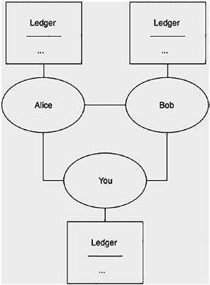
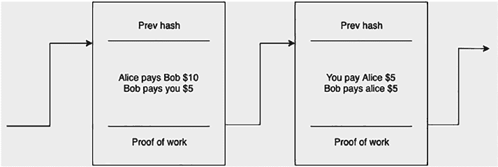
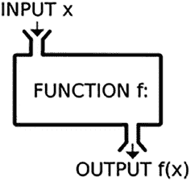
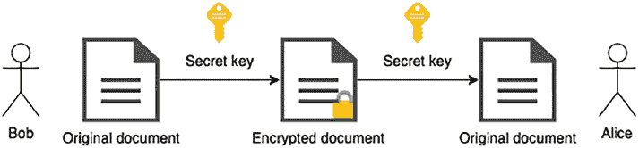
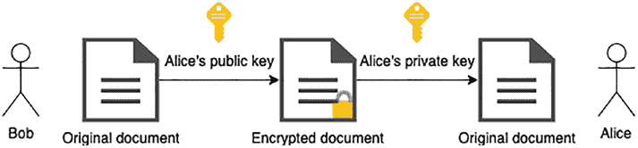

# 第一章：区块链简介

*本章全部内容摘自博罗·西特尼科夫斯基的《用 Lisp 引入区块链：使用 Racket 语言实现和扩展区块链》一书，经作者许可在此复用。*

*“链式”作者：菲利普·里佐夫*

© 斯皮罗·布扎罗夫斯基 2022

S. 布扎罗夫斯基，《用 Java 引入区块链》，[`doi.org/10.1007/978-1-4842-7927-4_1`](https://doi.org/10.1007/978-1-4842-7927-4_1)

在本章中，我们将了解区块链的一些定义和示例。我们将看到区块链具有哪些特性，它能让我们做什么，以及它的优势所在。

**定义 1-1** *区块链*是一种在连接成对等网络的多个计算机上维护交易记录的系统。¹

我们将给出一个示例作为引子，同时定义加密和哈希技术是什么，以及它们如何帮助我们构建系统。

请注意，本章节我们将跳过一些技术细节，因为它仅作为入门材料。技术细节将在我们开始构建区块链时再行介绍。

## 1.1 动机与基本定义

假设你经常和朋友之间进行资金往来，比如分摊晚餐或饮品费用。每次都交换现金可能很不方便。

一种可能的解决方案是记录下你和朋友们所有的账单。这被称为*账本*，如图 1-1 所示。

¹ 本书将沿用这一定义，但请注意，互联网上存在许多不同的定义。阅读完本书后，你应能区分各定义之间的细微差别与相似之处。

***图 1-1.** 一个账本和一组相连的朋友（对等节点）*

**定义 1-2** *账本*是包含交易记录的本子。

此外，每天结束时，你们会聚在一起，参照账本进行计算以结清账目。我们设想存在一个“资金池”来存放所有资金。如果你支出多于收入，就向资金池中投入相应金额；反之，则从中取出金额。

我们希望设计一个功能类似于常规银行账户的系统。钱包（银行账户）的持有者应只能从其钱包向其他钱包发送资金。因此，系统中的每个人都将拥有一个钱包，该钱包也可用于确定其余额。需要注意的是，在当前使用账本的设置下，我们必须遍历所有现有记录才能确定特定钱包的余额。

如果我们想避免遍历所有现有记录，可以通过*未花费交易输出（UTXO）* 来优化，这一点将在第三章中介绍。

可能出现的一个问题是*双重支付问题*，即鲍勃可以尝试同时将所有资金发送给爱丽丝和你，从而实际上将他发送的金额相对于其拥有的资金翻倍。

有几种方法可以解决这个问题，我们将提供的解决方案是对输入总和与输出总和进行简单检查。

这类系统可能出现的另一个问题是任何人都可以添加交易。例如，鲍勃可以在未经爱丽丝同意的情况下添加一笔交易，声称爱丽丝支付给他几美元。我们需要重新设计系统，使每笔交易都有办法进行验证/签名。

**定义 1-3** *数字签名*是一种验证数字消息或文档真实性的方法。

好的，这是根据您的要求翻译和排版后的 Markdown 文档。

为了签署和验证交易，我们将依赖数字签名（图 1-2）。现在，先假设任何向账本添加信息的人都会为每条记录添加一个签名，其他人无法修改该签名，只能验证它。我们将在“加密”部分详细介绍技术细节。

***图 1-2.** 我们的账本现在包含了签名*

## 第 1 章 区块链介绍

然而，假设由 Bob 保管账本，并且每个人都同意这一点。此时，账本存储在一个中心化的地方。但这样一来，如果到了每天结算的时候 Bob 无法到场，就没有人能查阅账本了。

我们需要一种去中心化账本的方法，使得任何人在任何时间都可以进行交易。为此，每个参与方都将自己保存一份账本副本，并在每天结束时碰头，同步各自的账本。

你与你的朋友相连，他们与你也相连。非正式地说，这就构成了一个点对点网络。

**定义 1-4** 当两台或多台计算机相互连接时，就形成了一个*点对点网络*。

例如，当你使用浏览器访问互联网上的一个网页时，你的浏览器是*客户端*，而你访问的网页由*服务器*托管。这代表了一个中心化系统，因为每个用户都从一个单一的地点——*服务器*——获取信息。

相比之下，在代表去中心化系统的点对点网络中，客户端和服务器之间的区别变得模糊。每个对等点既是客户端又是服务器。

有了这个系统（图 1-3），随着对等点（人员）列表的增长，我们可能会遇到信任问题。当每个人在一天结束时碰头同步他们的账本时，他们如何相信其他人账本中列出的交易是真实的？即使每个人都信任其他人的账本，如果一个新人想要加入这个网络怎么办？现有用户自然会让这位新来者证明自己值得信任。我们需要修改我们的系统以支持这种信任。实现这一点的一种方法是通过所谓的*工作量证明*，我们接下来将介绍它。

***图 1-3.** 一个去中心化的账本*

**定义 1-5** *工作量证明*是一种计算耗时、但易于他人验证的数据。

对于每条记录，我们还会包含一个特殊的数字（或称*哈希值*），它代表了工作量证明，用于证明该交易是有效的。我们将在“哈希”部分详细介绍技术细节。

在一天结束时，我们达成共识，我们将信任在账本上投入最多工作量的人。如果 Bob 有事要做，他可以在第二天通过信任网络中的其他对等点来赶上进度。

除此之外，我们希望交易是有序的，因此每条记录还将包含一个指向前一条记录的链接。这代表了实际的区块链，如图 1-4 所示。

***图 1-4.** 区块的链条：区块链*

如果每个人都同意将这个账本作为事实来源，那么完全不需要交换实物货币。每个人只需使用账本存入或取出资金即可。

为了理解数字签名和工作量证明的技术细节，我们将分别研究加密和哈希。

幸运的是，我们将要使用的编程语言内置了加密和哈希功能。我们不需要深入研究哈希、加密和解密的具体工作原理，但对它们有基本的了解就足够了。

观察我们是如何从一个简单的账本定义开始，逐步构建成一个复杂系统的。我们在编程中将采用同样的方法。

## 1.2 加密

我们从以下定义开始。

**定义 1-6** *加密*是一种对值进行编码的方法，使得只有授权人员才能查看原始内容。*解密*是一种对加密值进行解码的方法。

请注意，在本节中，我们将主要讨论数字，但字符和字母也可以使用相同的方法，通过使用字符的 ASCII[2] 值来进行加密/解密。

在讨论加密之前，我们首先需要回顾一下什么是函数，因为编码/解码值是通过使用函数来实现的。

### 1.2.1 函数

***图 1-5.** 一个函数*

**定义 1-7** *函数*是将唯一的输出分配给给定输入的数学实体。

例如，你可能有一个函数，它接受一个人作为输入，并返回此人的年龄或姓名作为输出。另一个例子是函数 `f(x) = x + 1`。这个函数可以接受许多输入：`1`、`2`、`3.14`。例如，当我们输入 `2` 时，它给出的输出是 `3`，因为 `f(2) = 2 + 1 = 3`。

> [!TIP]
> ASCII 表是一个为每个字符（例如 `!`、`@`、`a`、`Z` 等）分配唯一编号的表。

一种简单的理解函数的方式是表格形式。对于只接受一个参数 `x` 的函数 `f(x)`，我们有一个两列的表格，第一列是输入，第二列是输出。

对于接受两个参数 `x` 和 `y` 的函数 `f(x, y)`，我们有一个三列的表格，其中第一列和第二列代表输入，第三列是输出。因此，将前面讨论的函数以表格形式展示出来，看起来像这样：

| x | `f(x)` |
|---|--------|
| 1 | 2      |
| 2 | 3      |
| … | …      |

### 1.2.2 对称密钥算法

我们可以假设存在用于加密和解密的函数 `E(x)` 和 `D(x)`。我们希望这些函数具有以下属性：

- `E(x) ≠ x`，意味着加密后的值不应该与原始值相同。
- `E(x) ≠ D(x)`，意味着加密和解密函数产生不同的值。
- `D(E(x)) = x`，意味着对加密值进行解密应返回原始值。

例如，假设存在某种加密方案，比如 `E("Boro") = 426f726f`。我们可以“安全地”传递值 `426f726f` 而不会暴露我们的原始值，只有那些知道解密方案 `D(x)` 的人才能看到 `D(426f726f) = "Boro"`。

加密方案的另一个例子是让 `E(x)` 将 `x` 中的每个字符向前移位，而 `D(x)` 则将 `x` 中的每个字符向后移位。

这种方案被称为凯撒密码。要加密文本 `“abc”`，我们有 `E("abc") = "bcd"`；要解密它，我们有 `D("bcd") = "abc"`。

然而，所描述的方案构成了一种对称算法（图 1-6），这意味着我们必须与相关方共享函数 `E` 和 `D`，因此它们可能容易受到攻击。

***图 1-6.** 对称密钥算法*

### 1.2.3 非对称密钥算法

为了解决对称密钥算法带来的问题，我们将使用所谓的*非对称算法*或*公钥密码学*（图 1-7）。在这种方案中，我们有两种密钥：公钥和私钥。

我们将公钥与全世界共享，私钥则自己保留。

***图 1-7.** 非对称密钥算法*

这种算法方案有一个很好的特性：只有私钥能够解码消息，而公钥可以编码消息。

