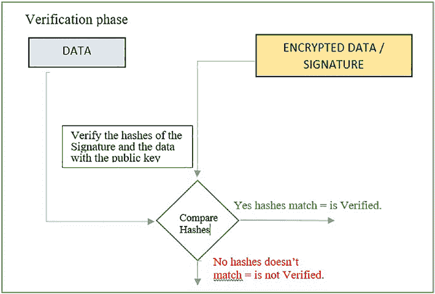

# 第 2 章 模型：区块链核心

第一个构造函数根据从数据库检索的数据设置类字段，并使用`Base64.Encoder`类将`byte[]`字段安全地转换为`String`。


第二个构造函数稍微复杂一些，因此我们将逐段详细解释它。首先，让我们看看不同的构造函数参数：`Wallet fromWallet`和`Signature signing`。我们将在下一节更详细地解释`Wallet`类，目前只需注意`fromWallet`参数包含交易发送者/创建者的公钥和私钥。我们使用了与前一节`Block`类的`isVerified`方法中相同的`Signature`类。

接下来，我们将解释构造函数的主体，以便了解在我们的案例中加密数据是如何工作的。图 2-1 所示的签名创建阶段概述了我们要实现的目标。

***图 2-1.** 签名创建*

第 2 章 模型：区块链核心

为了实现这一点，首先我们通过参数初始化类的字段来设置数据，并在第 44 到 50 行添加时间戳。现在，一旦我们有了想要加密的数据，我们在第 51 行通过语句将私钥设置到签名对象中。这告诉签名对象在加密时使用我们提供的私钥。在第 52 行，我们使用`toString()`方法将所有要加密的数据放入一个`String`对象中。在第 53 行，我们将所有要加密的数据提供给签名对象，在第 54 行，我们实际加密数据并将其赋值给我们的`signature`字段。

接下来是用于验证交易的方法，如下面的代码片段所示：

```
58 public Boolean isVerified(Signature signing)
59   throws InvalidKeyException, SignatureException {
60   signing.initVerify(new DSAPublicKeyImpl(this.
61   getFrom()));
62   signing.update(this.toString().getBytes());
63   return signing.verify(this.signature);
64 }
```

此方法将被其他对等节点用于验证每笔交易是否有效。在解释代码之前，让我们看看图 2-2 以及我们的方法试图实现什么。



第 2 章 模型：区块链核心

***图 2-2.** 验证阶段*

流程示意图非常简单；我们需要使用公钥比较签名哈希与类中包含的数据哈希。

现在，让我们回到`isVerified`方法，解释流程示意图中的工作流是如何实现的。作为参数，我们接收要验证的`Transaction`对象和`Signature`辅助类对象，该对象已像之前一样预先初始化为使用带有 DSA 算法的 SHA256。在第 60 行，我们设置用于解密签名的公钥。`new DSAPublicKeyImpl(byte[] encoded)`只是`sun.security.provider`包中的一个包装器，它将帮助将我们的公钥信息从`byte[]`转换为`PublicKey`对象。在第 61 行，我们设置要针对签名进行验证的交易数据。最后，在第 62 行（`Blockchaintransaction.java`），我们提供签名，比较/验证过程会执行，并自动为我们返回结果。

第 2 章 模型：区块链核心

我们使用通用的 getter、setter 以及`toString`、`equals`和`hash`方法完成类的其余部分，如下面的代码片段所示：

```
65 @Override
66 public String toString() {
67   return "Transaction{" +
68   "from=" + Arrays.toString(from) +
69   ", to=" + Arrays.toString(to) +
70   ", value=" + value +
71   ", timeStamp= " + timestamp +
72   ", ledgerId=" + ledgerId +
73   '}';
74 }
76 public byte[] getFrom() { return from; }
77 public void setFrom(byte[] from) { this.from = from; }
79 public byte[] getTo() { return to; }
80 public void setTo(byte[] to) { this.to = to; }
82 public Integer getValue() { return value; }
```


83 `public void setValue(Integer value) { this.value = value; }`

84 `public byte[] getSignature() { return signature; }`

86 `public Integer getLedgerId() { return ledgerId; }`

87 `public void setLedgerId(Integer ledgerId) { this.ledgerId = ledgerId; }`

89 `public String getTimestamp() { return timestamp; }`

91 `public String getFromFX() { return fromFX; }`

92 `public String getToFX() { return toFX; }`


**第 2 章 模型：区块链核心**

93 `public String getSignatureFX() { return signatureFX; }`

96 `@Override`

97 `public boolean equals(Object o) {`

98 `if (this == o) return true;`

99 `if (!(o instanceof Transaction)) return false;`

100 `Transaction that = (Transaction) o;`

101 `return Arrays.equals(getSignature(), that.getSignature());`

102 `}`

104 `@Override`

105 `public int hashCode() {`

106 `return Arrays.hashCode(getSignature());`

107 `}`

109 `}`

**重要提示！**

- 注意我们如何在此类中全程使用 `toString()` 方法来便捷地准备数据以进行比较。
- 注意在 `toString()` 方法中包含了所有确保交易唯一性的关键字段。


**第 2 章 模型：区块链核心**

**练习 2-1**

如果在我们的交易对象中，未能将时间戳作为验证过程的一部分，你能想到一种利用此漏洞的方法吗？

**2.3 Wallet.java**

像往常一样，让我们从以下代码片段中该类所需的导入语句开始：

```
1 package com.company.Model;

3 import java.io.Serializable;
4 import java.security.*;
```

在以下代码片段中，观察类的声明和字段：

```
6 public class Wallet implements Serializable {

8   private KeyPair keyPair;
```

由于我们希望能够将钱包存储到数据库中以及从数据库中导出/导入钱包，因此我们也将实现 `Serializable` 接口。

此类将包含一个字段，该字段是一个 `KeyPair` 类的对象。此类属于 `java.security` 包，包含我们在前几节中提到的公钥和私钥。


**第 2 章 模型：区块链核心**

**重要提示！**

- 注意，我们的区块链钱包不需要任何关于钱包持有者的信息。这是钱包持有者匿名性的基础。
- 我们的区块链钱包也不会包含任何存储钱包当前余额的字段。我们将在[第 6 章](https://doi.org/10.1007/978-1-4842-7927-4_6)中解释如何获取钱包余额。

接下来，让我们看看下一个代码片段中的前两个构造函数，当我们想要创建一个新钱包并为其分配一个新的密钥对时，将用到它们：

```
10 //生成新密钥对的构造函数
11 public Wallet() throws NoSuchAlgorithmException {
12   this(2048, KeyPairGenerator.getInstance("DSA"));
13 }
14 public Wallet(Integer keySize, KeyPairGenerator keyPairGen) {
15   keyPairGen.initialize(keySize);
16   this.keyPair = keyPairGen.generateKeyPair();
17 }
```

第一个无参构造函数将使用默认的 `keySize` 和一个设置为使用 DSA 算法生成密钥的 `KeyPairGenerator` 实例来调用第二个构造函数。第二个构造函数从第一个构造函数或应用程序的其他部分接收这些输入参数，并在第 15 行设置密钥的大小，在第 16 行生成密钥本身。

**第 2 章 模型：区块链核心**

当我们从数据库导入一个已有的密钥对后，第三个构造函数将用于创建我们的钱包。我们可以在以下代码片段中观察到它：

```
19 //仅用于导入密钥的构造函数
20 public Wallet(PublicKey publicKey, PrivateKey privateKey) {
21   this.keyPair = new KeyPair(publicKey,privateKey);
22 }
```

这里的代码只是接收公钥和私钥对象，并用它们创建一个新的 `KeyPair` 对象。


好的，作为高级文档工程师和翻译员，我已经仔细阅读了您的注意事项和示例。以下是根据您的要求完成的翻译：


最后，我们通过在以下代码片段中包含泛型的 getter 和 setter 方法来结束本课程和本章：

```
24 public KeyPair getKeyPair() { return keyPair; }
26 public PublicKey getPublicKey() { return keyPair.getPublic(); }
27 public PrivateKey getPrivateKey() { return keyPair.getPrivate(); }
28 }
```

## 2.4 总结

在本章中，我们涵盖了应用程序模型层的创建。这些类及其方法将作为整个应用程序其余部分的基本构建块。因此，现在很好地掌握它们将极大地帮助你理解后续章节中更复杂的逻辑。以下是到目前为止我们所涵盖概念的简要回顾：

**第 2 章 模型：区块链核心**

-   通过实现我们的 `Block.java` 类来表示区块链的单个区块
-   从现有区块链导入区块及创建区块链头块的 Java 实现
-   通过实现我们的 `Transaction.java` 类来表示区块链交易
-   用于导入交易和创建新交易的 Java 实现
-   加密和验证（创建签名及验证签名）的 Java 实现
-   通过实现我们的 `Wallet.java` 类来表示区块链钱包

**练习 2-1 的答案：** 某人可以复制并粘贴一个已签名的交易，该交易将通过验证检查，因为无法确保该交易在时间上是唯一的。


