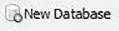
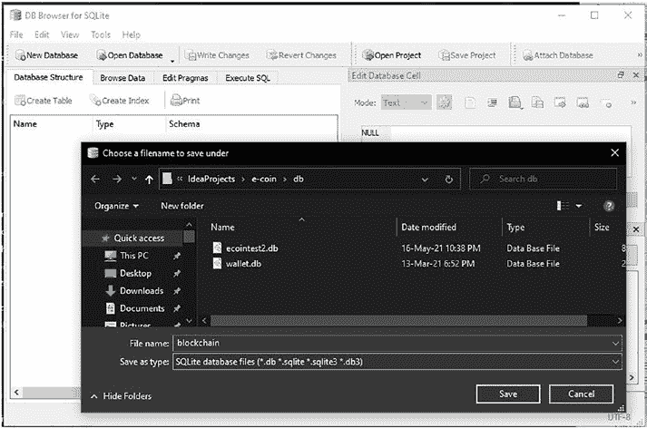
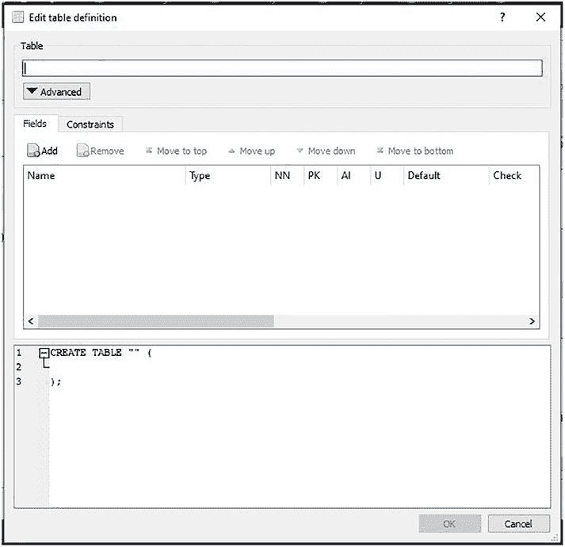
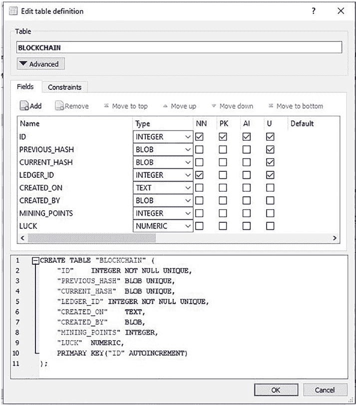
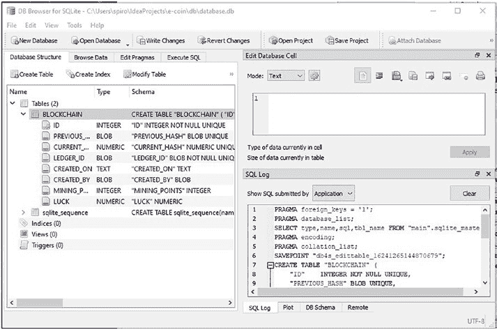
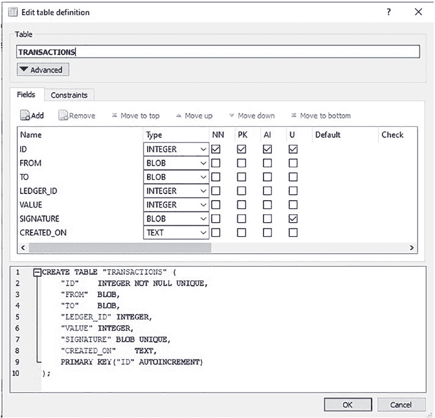
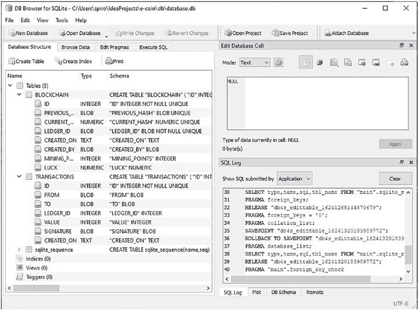
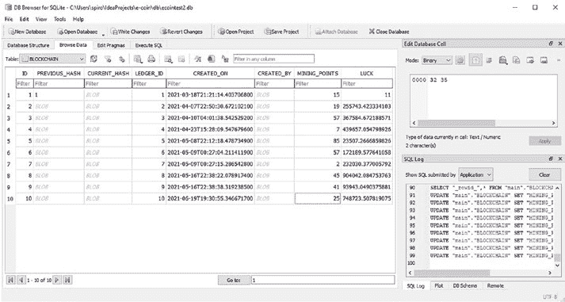
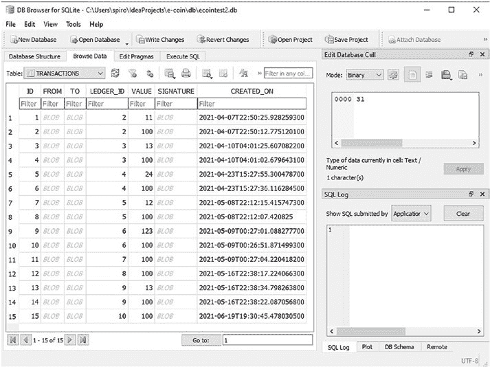

# 第 3 章 数据库设置

为了更好地可视化我们的区块链和钱包数据，我们选择实现一个 SQLite 数据库，而不是将其存储在原始文件数据格式中。我们的计划是为区块链设置一个数据库，为钱包设置另一个数据库，以便更好地分离关注点并提高安全性。在本章中，我们将学习如何从头开始设置数据库，并为我们的应用程序编写一个 `init()` 方法，该方法将使用 SQL 编写我们的表模式，并带有预设的默认值。为此，我们将使用 SQLite JDBC 驱动程序和 SQLite 数据库浏览器。

## 3.1 SQLite 数据库浏览器设置

首先，我们将从 <https://sqlitebrowser.org/dl/> 下载我们的 SQLite 数据库浏览器。只需为你的操作系统下载推荐版本，并使用推荐设置将其安装到你的机器上。运行它后，应用程序看起来应该类似于图 [3-1]。

**图 3-1.** *我们的应用程序*

这意味着你已经成功安装了数据库浏览器，我们可以继续设置我们的实际数据库了。

## 3.2 Blockchain.db

我们将实现的第一个数据库是用于存储区块链数据的数据库，我们将其恰当地命名为 `blockchain.db`。在本章中，我们将学习如何使用 SQLite 浏览器逐步设置我们的数据库。然而，在“编写你的应用程序 `init()` 方法”部分，我们将学习如何使用 SQL 和 SQL JDBC 驱动程序以编程方式设置我们的数据库。理想情况下，本章将通过数据库浏览器可视化区块链中包含的数据，并帮助缩小那些不熟悉 SQL 的人的知识差距。“编写你的应用程序 `init()` 方法”部分将为你提供 SQL 代码，并教你如何在将来以编程方式实现数据库设置。

我们首先点击 **新建数据库** 按钮，或者如果按钮栏没有显示，则转到 **文件**，然后点击 **新建数据库** 命令。这应该会打开一个类似于图 [3-2] 的屏幕，要求我们命名数据库并选择保存路径。

**图 3-2.** *命名并保存我们的数据库*

我选择在我的 `e-coin` 项目文件夹中创建一个名为 `db` 的文件夹，并将数据库命名为 `blockchain`。你可以为你的数据库选择不同的名称或位置；只需确保在以后的步骤中记住使用这些名称，而不是本书说明中的名称。点击 **保存** 后，我们会看到如图 [3-3] 所示的窗口，提示我们创建第一个表。

**图 3-3.** *创建表*

我们将表命名为 `BLOCKCHAIN`，并希望它存储我们所有的区块及其包含的数据。现在，在名为 **字段** 的选项卡的上方窗口中，我们将点击 **添加** 按钮来添加一个字段行。这些字段行将代表表的列，因此从现在起我们将这样称呼它们。当你开始在上方窗口中创建列时，你会注意到下方窗口中的 SQL 代码会自动修改以匹配你的选择。现在让我们看一下图 [3-4] 并相应地设置我们的表列。

**图 3-4.** *设置表列*

如果你注意到列的名称与 `Block.java` 类中的字段名称相似，那么做得很好；为每个类字段设置不同的列正是我们想要存储数据的方式。

我们 `BLOCKCHAIN` 表中的每一行将代表一个不同的区块，因此我们在这里还包含一个 `ID` 列，用于为我们的区块编号。为我们的列选择的类型

与 `Block.java` 类中的字段类型紧密对应，以维护数据的完整性。这对于我们所有字节数组类型的类字段尤其重要，它们必须存储为 `BLOB`；否则，转换为其他类型将改变原始信息，并使其中存储的公钥和签名无效。如果你有兴趣，可以在 <https://www.w3resource.com/sqlite/sqlite-data-types.php> 了解更多关于 SQLite 类型的信息。现在，一旦我们点击 **确定** 按钮，我们就创建了数据库中的第一个表，我们的数据库浏览器应该看起来像图 [3-5]。

**图 3-5.** *我们数据库中的第一个表*

我们的下一步是创建一个包含每个区块中交易的表。为此，我们点击 **创建表** 按钮，会弹出另一个窗口，与我们用来创建 `BLOCKCHAIN` 表的窗口完全相同。

#### **练习 3-1**

在学习我们如何操作之前，尝试自己创建下一个名为 `TRANSACTIONS` 的表。

**提示：** 像我们查看 `Block.java` 那样查看 `Transaction.java` 的字段。

如果你做到了，做得好！我们 `Transactions` 表的实现看起来像图 [3-6]。

**图 3-6.** *Transactions 表*

最后，完整的数据库模式应该看起来像图 [3-7]。

**图 3-7.** *完整的数据库模式*

现在，显然如果你点击 **浏览数据** 选项卡，表将是空的，但让我们通过查看图 [3-8] 和图 [3-9] 来结束本节，这些图包含一些虚拟数据，以便我们可以想象一旦完成应用程序的其余部分，一切将如何就位。

**图 3-8.** *包含虚拟数据的 BLOCKCHAIN 表*

**图 3-9.** *包含虚拟数据的 Transaction 表*

