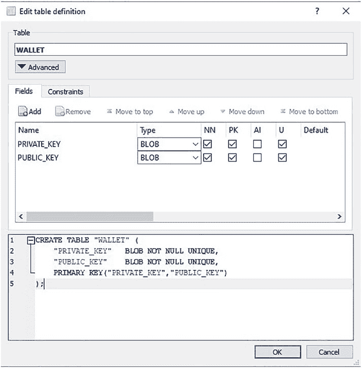
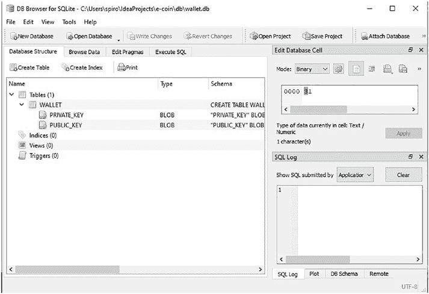
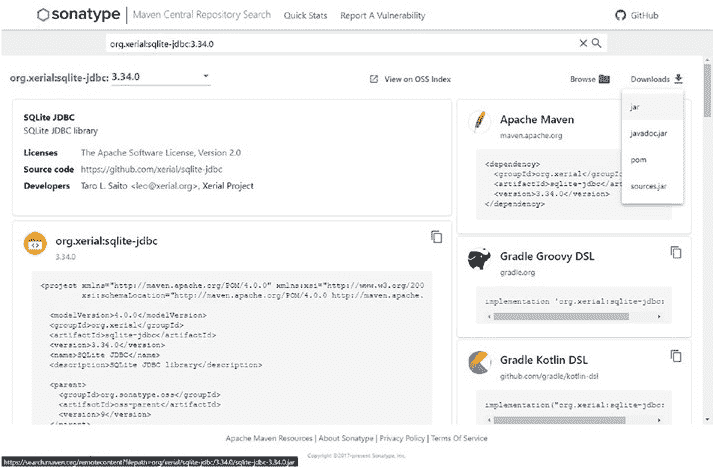
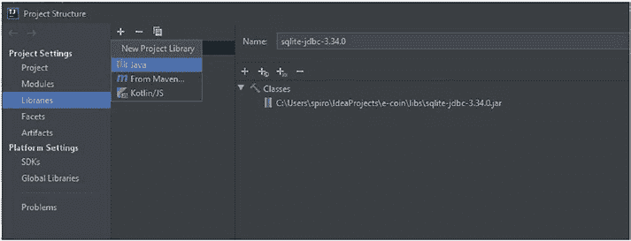
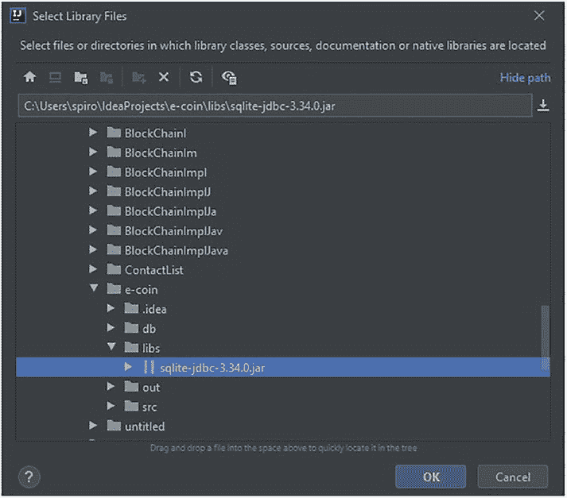

# 区块链表

对于图 3-8，e 中的`BLOCKCHAIN`表，每一行代表区块链中的一个不同区块。对于图 3-9 中的`Transactions`表，每一行代表一笔单独的交易。所有包含相同`LEDGER_ID`编号的交易代表它们都属于具有相同`LEDGER_ID`编号的单个区块。

## 3.3 Wallet.db

在我们按照基本相同的步骤创建`Wallet.db`之前，先解释一下设计决策：为什么我们要在单独的数据库中创建钱包，而不是在`blockchain.db`数据库中再创建一张表。这是因为这样做可以实现清晰的关注点分离。

区块链数据库中的所有数据都应在点对点网络上共享，而`Wallet.db`数据库中的所有数据则应对他人保密；因此，让应用程序分别建立与两者的独立连接也能提高安全性。另一个好处是，钱包或区块链的便携性只需将`blockchain.db`或`wallet.db`从当前机器简单地复制粘贴到另一台机器上即可，无需任何额外代码。当然，这并不是说应用程序无法通过单一数据库运行，也不是说仅凭这些就能确保一切安全。

### 练习 3-2

在查看我们的做法之前，请尝试自行创建下一个名为`WALLET`的表。

**提示** 遵循与“blockchain.db”部分相同的步骤。



*第 3 章 数据库设置*

如果你成功完成了操作，并意识到我们可能需要将`Wallet.java`类中的`keyPair`字段拆分为两列，每列对应一个密钥，那么恭喜你做得很好。如果没有，那么让我们重新回顾一下步骤。点击**新建数据库**按钮，将表命名为`WALLET`，并在其中创建两个列：`PRIVATE_KEY`和`PUBLIC_KEY`，它们将构成我们的密钥对。结果应类似于图 3-10。

***图 3-10.** 创建我们的密钥对*



*第 3 章 数据库设置*

我们的`wallet.db`数据库的完整数据库模式将如图 3-11 所示。

***图 3-11.** `wallet.db`的数据库模式*

## 3.4 SQLite 的 JDBC 驱动程序设置

现在让我们安装一个用于 SQLite 的 JDBC 驱动程序，以便在应用程序中使用 SQL 来设置相同的模式。访问 [`search.maven.org/artifact/org.xerial/sqlite-jdbc/3.34.0/jar`](https://search.maven.org/artifact/org.xerial/sqlite-jdbc/3.34.0/jar)，并从下载选项中手动下载 JAR 文件，如图 3-11 所示。





*第 3 章 数据库设置*

***图 3-12.** 下载 JAR 文件*

你可以在项目文件夹中创建一个`libs`文件夹，并将 JAR 文件保存在那里，就像我们在仓库中所做的那样。接下来选择**文件**，然后选择**项目结构**；接着转到**项目设置**中的**库**选项卡，点击加号添加新的项目库，选择**Java**，然后选择我们刚刚下载的 JAR 文件，最后点击**确定**。参考图 3-13 和图 3-14 以获取视觉帮助。

***图 3-13.** 选择 Java*



*第 3 章 数据库设置*

***图 3-14.** 选择 JAR 文件*

有了这个库，我们就可以开始编写`ECoin`类了，该类将包含我们的`main`方法和`init()`方法。

## 3.5 编写你的应用 `init()` 方法

在深入探讨`init()`方法之前，我们先简要地看一下`ECoin.java`类。我们的`ECoin.java`类位于仓库中`src.com.company`文件夹结构内。这是我们主应用程序类；换句话说，我们的应用程序从这里开始。接下来的代码片段展示了类的导入、类声明、`main`方法和`start`方法：

```
1 package com.company;

3 import com.company.Model.Block;

4 import com.company.Model.Transaction;
```


5 `import` `com.company.Model.Wallet`;

6 `import` `com.company.ServiceData.BlockchainData`;
7 `import` `com.company.ServiceData.WalletData`;
8 `import` `com.company.Threads.MiningThread`;
9 `import` `com.company.Threads.PeerClient`;
10 `import` `com.company.Threads.PeerServer`;
11 `import` `com.company.Threads.UI`;
12 `import` `javafx.application.Application`;
13 `import` `javafx.stage.Stage`;
15 `import` `java.security.*`;
16 `import` `java.sql.*`;
17 `import` `java.time.LocalDateTime`;

19 `public class ECoin extends Application {`

21 `public static void main(String[] args) {`
22 `    launch(args);`
23 `}`

25 `@Override`
26 `public void start(Stage primaryStage) throws Exception {`
27 `    new UI().start(primaryStage);`
28 `    new PeerClient().start();`
29 `    new PeerServer(6000).start();`
30 `    new MiningThread().start();`
31 `}`

在第 19 行，我们可以看到我们的类继承了`Application`类。  
`Application`是`javafx`包的一部分，通过继承它，我们表明我们将以 JavaFX 应用程序的形式运行我们的应用。由于`Application`类实际上是一个抽象类，继承它之后，我们需要实现`start(Stage s)`方法才能运行我们的应用。

在第 26 到 31 行，你可以看到我们对`start(Stage s)`方法的实现。方法体中的每一行（第 27-30 行）代表一个不同的线程，这些线程将在我们的应用程序中并行运行。第 27 行的线程将显示我们的用户界面并执行与之关联的命令。第 28 行的线程将充当客户端并查询其他对等节点。第 29 行的线程将充当服务器，并响应来自其他对等节点的传入查询。第 30 行的线程将持续运行区块链验证和共识任务。我们将在后续章节中讨论每个线程，并详细解释每个线程的工作原理。目前，对这些线程试图完成的任务进行说明已经足够，并且应该能让您对我们应用程序在实现目标方面的结构有一个清晰的概览。

现在终于到了讨论我们的`init()`方法以及我们将用它实现什么的时候了。`init()`方法在我们的应用程序`start(Stage s)`方法之前运行，其目的是检查并设置必要的先决条件，以便我们的应用程序能够运行。在我们的案例中，这些先决条件包括`wallet.db`和`blockchain.db`文件的存在、它们的模式以及内容。让我们看看下面的代码片段并开始解释代码：

33 `@Override`
34 `public void init() {`
35 `    try {`
36 `        //这段代码用于在钱包不存在时创建钱包，并提供一个 KeyPair。`
37 `        //我们将把它创建在单独的数据库中，以提高安全性并便于移植。`
38 `        Connection walletConnection = DriverManager`
39 `            .getConnection("jdbc:sqlite:C:\\Users\\spiro\\IdeaProjects\\e-coin\\db\\wallet.db");`
40 `        Statement walletStatment = walletConnection.createStatement();`
41 `        walletStatment.executeUpdate("CREATE TABLE IF NOT EXISTS WALLET ( " +`
42 `            " PRIVATE_KEY BLOB NOT NULL UNIQUE, " +`
43 `            " PUBLIC_KEY BLOB NOT NULL UNIQUE, " +`
44 `            " PRIMARY KEY (PRIVATE_KEY, PUBLIC_KEY)" +`
45 `            ") ");`
46 `        ResultSet resultSet = walletStatment.executeQuery(" SELECT * FROM WALLET ");`
47 `        if (!resultSet.next()) {`
48 `            Wallet newWallet = new Wallet();`
49 `            byte[] pubBlob = newWallet.getPublicKey().getEncoded();`
50 `            byte[] prvBlob = newWallet.getPrivateKey().getEncoded();`
51 `            PreparedStatement pstmt = walletConnection`
52 `                .prepareStatement("INSERT INTO WALLET(PRIVATE_KEY, PUBLIC_KEY) " +`
53 `                    " VALUES (?,?) ");`
54 `            pstmt.setBytes(1, prvBlob);`
55 `            pstmt.setBytes(2, pubBlob);`
56 `            pstmt.executeUpdate();`
57 `        }`
58 `        resultSet.close();`
59 `        walletStatment.close();`
60 `        walletConnection.close();`
61 `    }`


### 62 `WalletData.getInstance().loadWallet()`; 63

第 38 行和 39 行代表一条语句，它使用我们之前设置的`SQLDriver`来打开与`wallet.db`数据库的连接。`SQLDriver`会检查指定 URL 位置下`wallet.db`文件是否存在，并打开与其的连接。如果文件缺失，`SQLDriver`将自动创建一个空的`wallet.db`文件。

在第 40 行，我们使用已建立的与`wallet.db`数据库的连接来实例化`Statement`对象。每次我们使用这个`Statement`对象执行查询时，它都会在用于实例化它的连接所指向的数据库中执行这些查询。在本例中，该数据库就是`wallet.db`。在第 41 至 46 行，我们在名为`walletStatment`的`Statement`对象上使用`executeUpdate(String s)`方法，该方法接收一个`String`参数，并将其作为 SQL 语句在`wallet.db`中执行。除了在此添加的`IF NOT EXISTS`部分外，这个 SQL 字符串与我们手动创建`WALLET`表时生成的 SQL 完全相同，如图 3-10 所示。换句话说，我们这里的 SQL 语句表示：如果`WALLET`表不存在，则创建一个模式与我们之前在“Wallet.db”部分手动创建的表完全相同的表。

在接下来的代码行（第 47-58 行）中，我们将扩展应用的功能，使其能够识别`wallet.db`中是否已存在密钥对。如果为空，应用将生成一个新的密钥对并将其填充到`WALLET`表中。第 47 行查询`WALLET`表，并将结果保存在`ResultSet`对象中。第 48 行检查`resultSet`对象是否为空，如果为空，则第 49-57 行创建一个新的钱包并将其密钥导出到`Wallet`表中。让我们看看这一组功能能实现什么。我们可以在没有任何`wallet.db`的情况下运行应用，它会自动为其设置数据库并为我们创建一个新钱包。我们可以通过简单地复制`wallet.db`并替换目标机器上的`wallet.db`文件，将钱包移植到另一台机器上。我们的`init()`方法会识别出密钥对已存在，不会尝试覆盖它。最后需要注意的一点是第 65 行。在这里，我们将把`wallet.db`中的内容加载到`WalletData`单例类中。这会将我们的钱包数据存储到应用内存中，使其在整个应用的其余部分更易于访问。我们将在下一章中进一步讨论`WalletData`类。

现在让我们看看下面的代码片段中`init()`方法的下一部分：

```java
64 // 这将为区块链创建包含列的数据库表。
65 Connection blockchainConnection = DriverManager
66     .getConnection("jdbc:sqlite:C:\\Users\\spiro\\IdeaProjects\\e-coin\\db\\blockchain.db");
67 Statement blockchainStmt = blockchainConnection.createStatement();
68 blockchainStmt.executeUpdate("CREATE TABLE IF NOT EXISTS BLOCKCHAIN ( " +
69     " ID INTEGER NOT NULL UNIQUE, " +
70     " PREVIOUS_HASH BLOB UNIQUE, " +
71     " CURRENT_HASH BLOB UNIQUE, " +
72     " LEDGER_ID INTEGER NOT NULL UNIQUE, " +
73     " CREATED_ON TEXT, " +
74     " CREATED_BY BLOB, " +
75     " MINING_POINTS TEXT, " +
76     " LUCK NUMERIC, " +
77     " PRIMARY KEY( ID AUTOINCREMENT) " +
78     ")"
79 );
```

第 65 行和 66 行将检查`blockchain.db`文件是否存在，如果不存在则创建该文件，并与其建立连接，操作方式与我们之前为`wallet.db`在第 38 和 39 行所做的相同。第 67 至 79 行将准备并执行一条语句，检查`blockchain.db`中是否存在`BLOCKCHAIN`表，如果不存在则创建一个与图 3-4 所示相同的表。

在下一个代码片段中，我们将创建应用的功能，以便在区块链中尚不存在第一个区块时创建它。其逻辑与我们用于检查`wallet.db`是否包含任何数据的方法类似。


```java
80 ResultSet resultSetBlockchain = blockchainStmt.executeQuery(" SELECT * FROM BLOCKCHAIN ");
81 Transaction initBlockRewardTransaction = null;
82 if (!resultSetBlockchain.next()) {
83     Block firstBlock = new Block();
84     firstBlock.setMinedBy(WalletData.getInstance().getWallet().getPublicKey().getEncoded());
85     firstBlock.setTimeStamp(LocalDateTime.now().toString());
86     //helper class.
87     Signature signing = Signature.getInstance("SHA256withDSA");
88     signing.initSign(WalletData.getInstance().getWallet().getPrivateKey());
89     signing.update(firstBlock.toString().getBytes());
90     firstBlock.setCurrHash(signing.sign());
91     PreparedStatement pstmt = blockchainConnection.prepareStatement("INSERT INTO BLOCKCHAIN (PREVIOUS_HASH, CURRENT_HASH , LEDGER_ID," +
93             " CREATED_ON, CREATED_BY,MINING_POINTS,LUCK ) " +
94             " VALUES (?,?,?,?,?,?,?) ");
95     pstmt.setBytes(1, firstBlock.getPrevHash());
96     pstmt.setBytes(2, firstBlock.getCurrHash());
97     pstmt.setInt(3, firstBlock.getLedgerId());
98     pstmt.setString(4, firstBlock.getTimeStamp());
99     pstmt.setBytes(5, WalletData.getInstance().getWallet().getPublicKey().getEncoded());
100    pstmt.setInt(6, firstBlock.getMiningPoints());
101    pstmt.setDouble(7, firstBlock.getLuck());
102    pstmt.executeUpdate();
103    Signature transSignature = Signature.getInstance("SHA256withDSA");
104    initBlockRewardTransaction = new Transaction(WalletData.getInstance().getWallet(), WalletData.getInstance().getWallet().getPublicKey().getEncoded(), 100, 1, transSignature);
105 }
106 resultSetBlockchain.close();
```

第 80 行查询我们的 `BLOCKCHAIN` 表，第 82 行检查区块链是否存在；如果不存在，则执行第 83–105 行。第 83 行使用我们的第三个区块构造函数。第 84 行从 `WalletData` 单例类中检索我们的公钥，并将我们设置为初始区块的创建者/矿工。第 85 行设置时间戳。第 87 到 90 行实例化并使用 `java.security` 中的 `Signature` 类，通过区块创建者/矿工的私钥加密区块中包含的所有数据，并将其设置为我们当前的哈希值。同样的过程在图 2-1 中有所展示，并在其中进行了更详细的解释。第 91–102 行将初始区块的数据从应用程序导出到我们的 `BLOCKCHAIN` 表中。在第 103 和 104 行，我们为区块准备了初始区块奖励交易。我们暂不将其转移到 `TRANSACTIONS` 表，因为还不确定该表是否存在于数据库中。让我们看看下面处理 `TRANSACTIONS` 表的代码片段：

```java
108 blockchainStmt.executeUpdate("CREATE TABLE IF NOT EXISTS TRANSACTIONS ( " +
109         " ID INTEGER NOT NULL UNIQUE, " +
110         " \"FROM\" BLOB, " +
111         " \"TO\" BLOB, " +
112         " LEDGER_ID INTEGER, " +
113         " VALUE INTEGER, " +
114         " SIGNATURE BLOB UNIQUE, " +
115         " CREATED_ON TEXT, " +
116         " PRIMARY KEY(ID AUTOINCREMENT) " +
117         ")");
118 if (initBlockRewardTransaction != null) {
119     BlockchainData.getInstance().addTransaction(initBlockRewardTransaction, true);
120     BlockchainData.getInstance().addTransactionState(initBlockRewardTransaction);
121 }
122 blockchainStmt.close();
123 blockchainConnection.close();
124 } catch (SQLException | NoSuchAlgorithmException | InvalidKeyException | SignatureException e) {
125     System.out.println("db failed: " + e.getMessage());
126 } catch (GeneralSecurityException e) {
127     e.printStackTrace();
128 }
129 BlockchainData.getInstance().loadBlockChain();
130 }
131 }
```

在第 108 到 118 行，我们检查 `TRANSACTIONS` 表是否存在，如果不存在则创建它，方式与我们处理之前表格的方式非常相似。第 119 行检查我们是否已创建初始奖励交易，如果已创建，则第 120 和 121 行将其转移到数据库并设置我们的应用程序状态。第 130 行最后的声明显示，我们的单例类 `BlockData` 正在加载存储在 `blockhain.db` 数据库中的数据。在下一章中，我们将解释如何实现这一点。

## 3.6 总结

在本章中，我们介绍了如何创建两个不同的数据库来支持我们的应用程序。我们还创建了 `init()` 方法，其功能可轻松实现钱包的移植和创建。此外，我们确保了当区块链不存在时，应用程序能够创建区块链中的第一个区块。这是对我们目前所涵盖概念的简要回顾：

- 使用数据库浏览器程序创建数据库和表结构
- 创建应用程序的主类
- 创建我们的 `start(Stage s)` 方法
- 在 Java 中设置 SQLite 驱动，并使用它通过 Java 和 SQL 创建和查询数据库
- 通过使用 SQLite 驱动和 Java 为应用程序的 `init()` 方法创建业务逻辑


