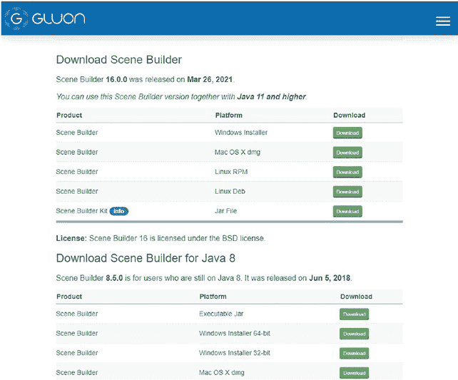
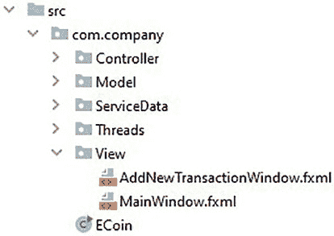
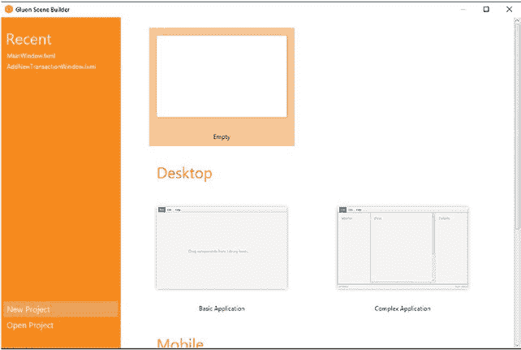
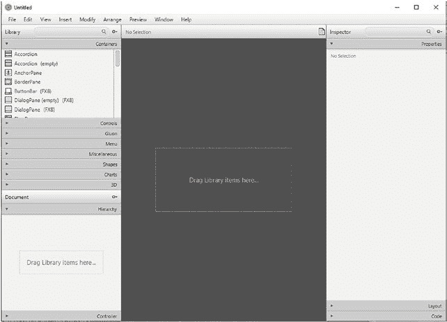
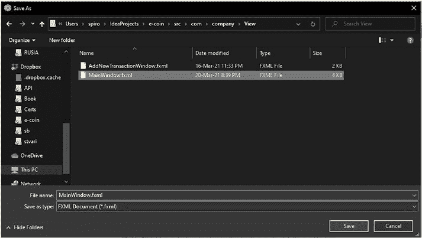
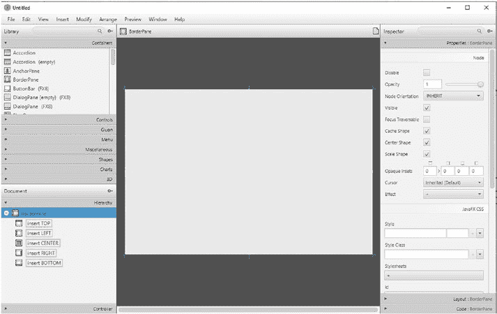

# 第 4 章 构建用户界面

*“界面” 作者：Filip Rizov*

© Spiro Buzharovski 2022

S. Buzharovski, *《用 Java 引入区块链》*, [`doi.org/10.1007/978-1-4842-7927-4_4`](https://doi.org/10.1007/978-1-4842-7927-4_4)

本章将介绍如何创建我们的用户界面。通过用户界面，我们将能够查看我们的硬币余额、显示我们的公共地址以便与他人分享、查看最近的交易以及向他人发送硬币。

为此，我们将使用 `Scene Builder`，这是一个 GUI 工具，可以帮助我们创建前端。对于控制器类，我们将使用 `Java` 和 `JavaFX`。最后，我们将解释如何创建单独的 UI 线程来监听我们的输入。

## 4.1 Scene Builder 快速设置

通过访问 [`gluonhq.com/products/scene-builder/`](https://gluonhq.com/products/scene-builder/) 下载 `Scene Builder`。页面将显示不同的选项，如图 4-1 所示。

**图 4-1.** `Scene Builder` 下载页面

只需根据您的操作系统选择相应的下载版本。按照提供的说明安装应用程序即可开始使用。

## 4.2 创建视图

在接下来的部分中，我们将解释如何使用 `Scene Builder` 创建视图。建议您在图 4-2 所示的文件夹结构中创建一个 `View` 文件夹。我们将在此文件夹中创建并存放视图类。

**图 4-2.** 创建文件夹结构

### 4.2.1 MainWindow.fxml

让我们创建 `MainWindow.fxml` 文件。首先启动 `Scene Builder` 并选择一个空场景，如图 4-3 所示。

**图 4-3.** 选择空场景

完成此操作后，您的下一个屏幕应如图 4-4 所示。

**图 4-4.** 空屏幕

这意味着我们已准备好开始创建 `MainWindow.fxml` 文件，但首先让我们解释一下在图 4-4 中看到的一些元素。

在屏幕的左上侧，我们可以看到用于创建视图的预制可视化元素，只需将它们拖放到屏幕中央或`Hierarchy`选项卡中即可。您还可以注意到，不同类型的元素被分组在不同的选项卡下，例如`Containers`、`Controls`等。在屏幕的左下角，我们可以看到`Hierarchy`选项卡；在这里，我们可以观察到场景的元素结构。在`Hierarchy`选项卡下方是`Controller`选项卡，我们可以在其中查看有关此视图控制器位置以及视图元素关联字段的信息。在中间，我们可以看到视图预览的样子。在屏幕的右侧，有三个选项卡：`Properties`、`Layout`和`Code`，我们可以在其中调整和自定义每个元素的属性。在开始向场景添加可视化元素之前，让我们先将此文件保存到`View`文件夹中，并将其命名为`MainWindow.fxml`，如图 4-5 所示。

**图 4-5.** 保存文件

