# 第 4 章 构建用户界面

让我们通过将 `BorderPane` 元素从 `Containers` 选项卡拖到屏幕中央来开始创建前端场景。您的屏幕应如图 4-6 所示。

### 图 4-6. 添加 `BorderPane`

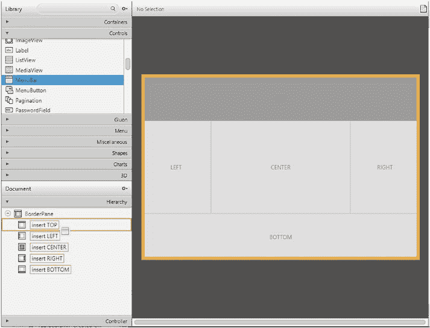

请注意 `Hierarchy` 选项卡中的 `BorderPane` 元素及其子元素。接下来，从 `Controls` 选项卡中拖出一个 `MenuBar`，并将其放入 `BorderPane` 的 `TOP` 子元素中，如图 4-7 所示。

### 图 4-7. 添加 `MenuBar`

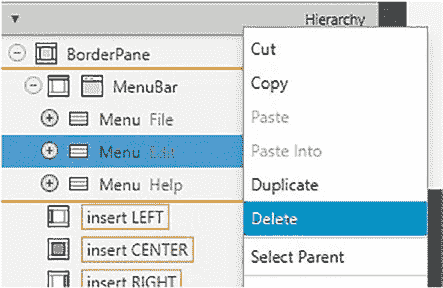

如果您点击 `MenuBar` 元素旁边的 `+` 号，您会注意到它自带了三个名为 `File`、`Edit` 和 `Help` 的菜单子元素。由于我们只使用 `File` 子元素，请右键点击 `Edit` 和 `Help` 子元素，并从下拉菜单中选择 `Delete` 来删除它们，如图 4-8 所示。

### 图 4-8. 删除部分子菜单

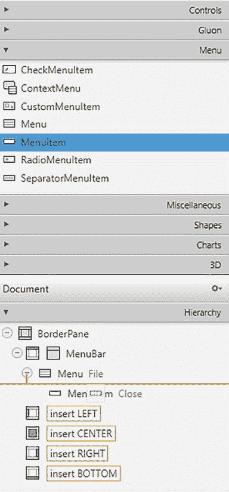

现在，让我们展开 `File` 子菜单。在这里，您会注意到我们有一个名为 `Close` 的嵌套 `MenuItem` 元素。让我们添加另一个 `MenuItem` 元素，并将其命名为 `Make Transaction`。为此，首先打开 `Menu` 选项卡，拖出另一个 `MenuItem` 元素，并将其放置在 `Close MenuItem` 正上方，如图 4-9 所示。

### 图 4-9. 添加元素

在拖拽 `MenuItem` 元素时，请注意橙色线条，它将帮助您可视化放置元素的位置。

您会注意到这个 `MenuItem` 默认被命名为 `Unspecified Action`。让我们通过在 `Hierarchy` 选项卡中点击它来选择此元素，然后展开 `Properties` 选项卡。您会注意到一个名为 `text` 的属性，其文本值为 `Unspecified Action`。让我们将此值更改为 `Make Transaction`，这将有效地重命名我们的元素。最终结果应如图 4-10 所示。

### 图 4-10. 重命名文本元素

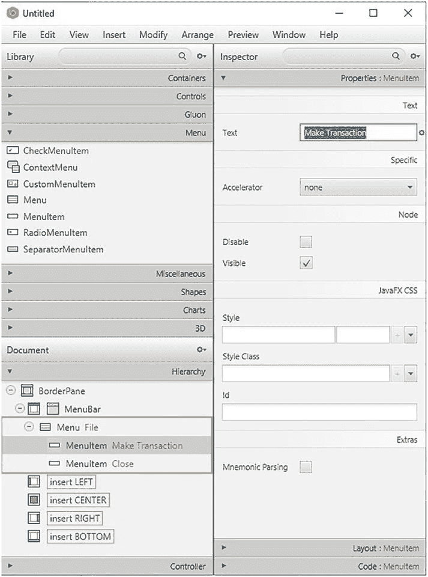


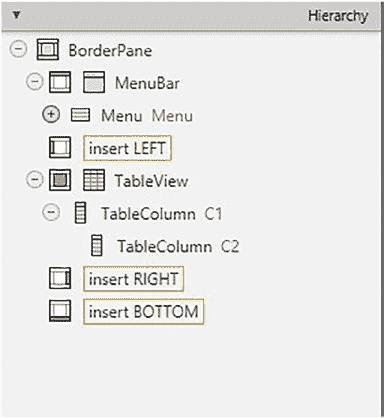

### 练习 4-1

将名为 `File` 的 `Menu` 元素重命名为 `Menu`，将 `MenuItem` 元素 `Close` 重命名为 `Exit`。

我们已经完成了 `MenuBar` 及其子元素的工作，现在继续往下进行。接下来，从 `Controls` 选项卡中添加一个 `TableView` 元素到 `BorderPane` 的 `CENTER` 子元素上。展开 `TableView` 元素后，您应该会找到两个名为 `C1` 和 `C2` 的嵌套 `TableColumn` 元素。将 `TableColumn C2` 拖入 `TableColumn C1`，这将使 `TableColumn C2` 成为 `TableColumn C1` 的子元素。如果操作正确，您的层次结构应如图 4-11 所示。

### 图 4-11. 两个嵌套的 `TableColumn` 元素

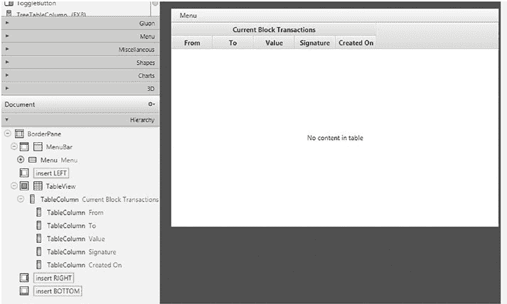

让我们再从 `Controls` 选项卡中添加四个 `TableColumn` 元素作为 `TableColumn C1` 的嵌套元素。在我们要创建的此表格视图中，我们希望能够显示当前的区块交易及其关联的详细信息，因此我们应该相应地重命名表格列：将 `C1` 重命名为 `Current Block Transactions`，然后按顺序将嵌套的表格列命名为：`From`、`To`、`Value`、`Signature` 和 `Created On`。如果一切操作正确，您的屏幕应如图 4-12 所示。

### 图 4-12. 完成的表格列

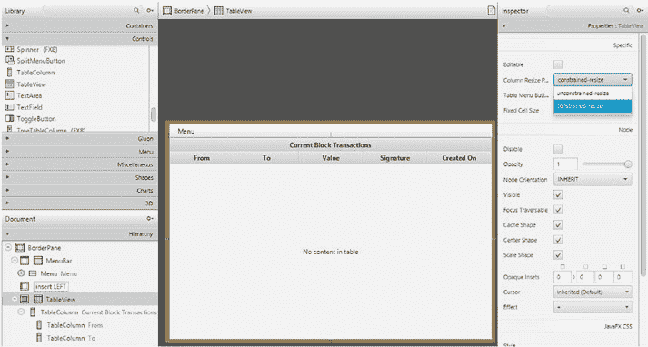

您很可能已经注意到，我们表格列的宽度并未覆盖整个屏幕区域。要修复表格列的宽度，请选择 `TableView` 元素，进入其 `Properties` 选项卡，找到 `Column Resize Policy` 属性，并选择 `constrained-resize`，如图 4-13 所示。

### 图 4-13. 调整表格列的大小

我们的下一个任务是添加一些元素，用于显示我们的硬币余额、公钥/钱包地址，以及一个用于刷新用户界面并检索有关交易和余额最新信息的按钮。我们将通过将另一个 `BorderPane` 从 `Containers` 选项卡拖入现有 `BorderPane` 的 `BOTTOM` 部分来实现此目的。

这个新的 `BorderPane` 将自带其自己的 `TOP`、`LEFT`、`CENTER`、`RIGHT` 和 `BOTTOM` 部分。换句话说，这个新的 `BorderPane` 将第一个 `BorderPane` 的底部区域细分为五个新区域，如图 4-14 所示。

### 图 4-14. 新 `BorderPane`

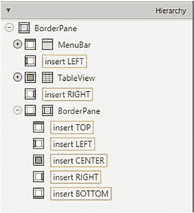

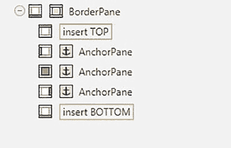

这将使我们能够将前面提到的元素放置到各自独立的部分中，这有助于组织我们的层次结构。

现在，让我们将 `AnchorPane` 从 `Containers` 选项卡插入到新 `BorderPane` 的 `LEFT`、`CENTER` 和 `RIGHT` 部分，如图 4-15 所示。

### 图 4-15. 插入 `AnchorPane`

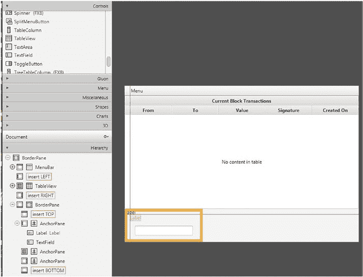


`AnchorPane` 允许我们只需将元素拖拽到不同位置，即可调整其视觉位置。现在，让我们将 `Label` 和 `TextField` 元素从 `Controls` 选项卡拖放到我们的 `LEFT` 部分的 `AnchorPane` 中。完成后，您会注意到可以通过在视图屏幕上直接拖拽来轻松地重新定位它们。图 4-16 展示了您的层次结构应如何呈现，以及在视图屏幕上拖拽和对齐元素的能力。

### 图 4-16. 重新定位元素

### 练习 4-2

将名为 `label` 的 `Label` 元素重命名为 `Your Balance:`，并重新定位它和 `TextField` 元素，使其在视觉上看起来更美观。

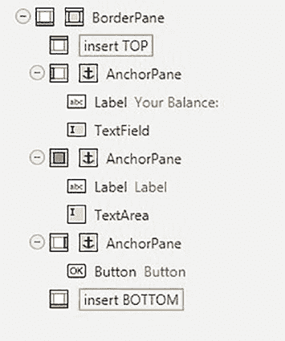


接下来，让我们将一个 `Label` 和 `TextArea` 元素从 `Controls` 选项卡拖放到 `CENTER` 部分的 `AnchorPane` 中，并将一个 `Button` 元素从同一选项卡拖放到 `RIGHT` 部分的 `AnchorPane` 中。您的层次结构应如图 4-17 所示。

### 图 4-17. 将 `Label` 和 `TextArea` 添加到 `CENTER`

### 练习 4-3

将名为 `label` 的 `Label` 元素重命名为 `Your Address / Public Key:`，将名为 `Button` 的 `Button` 重命名为 `Refresh`，然后重新定位它们，使其在视觉上更美观。

在图 4-18 中，您可以看到包含展开的层次结构的完整场景 UI/UX 设计。这是一张很好的图，可以供您检查自己的场景中是否遗漏了某些内容。

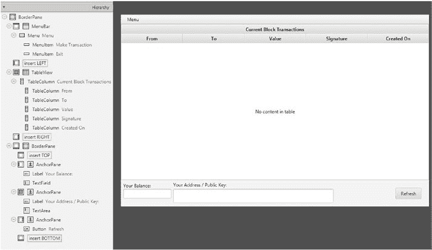

### 图 4-18. 场景的完整 UX/UI 设计

如果你现在从 IntelliJ 打开 `MainWindow.fxml` 文件，你会注意到 Scene Builder 已自动用相应的 FXML 代码填充了它。请记住，你需要先在 Scene Builder 中保存更改，FXML 文件中的代码才会生成。此外，如果你打算手动修改 FXML 文件，请确保在 Scene Builder 中保存最新更改并退出；否则，你可能会使 Scene Builder 的工作与本地文件不同步，从而丢失部分更改。

到目前为止，我们只处理了场景的视觉设计。

所有元素都已按照我们想要的方式定位，但我们现在缺少的是对后端方法和字段的引用，以便我们能够使用它们。首先，让我们添加此场景未来控制器类的文件路径。这将在应用程序中创建视图与其控制器之间的链接。换句话说，应用程序将尝试找到并运行/显示我们将在视图中引用的、来自其对应控制器类的任何方法或字段。要添加控制器类的文件路径，请打开屏幕左下角的 `Controller` 选项卡，并在 `Controller class` 文本字段中输入它，如图 4-19 所示。

### 图 4-19. 添加控制器类的文件路径

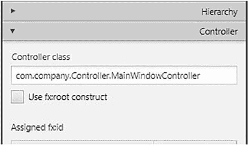

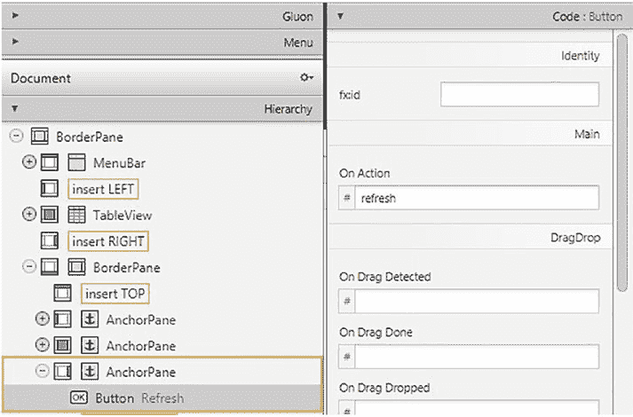

现在，让我们为刷新按钮添加一个方法引用，该方法将在我们点击按钮时被调用。为此，选择我们的刷新按钮，展开屏幕右下角的 `Code` 选项卡，并在 `On Action` 文本字段中输入方法名称，即 `refresh`，如图 4-20 所示。

### 图 4-20. 添加刷新按钮

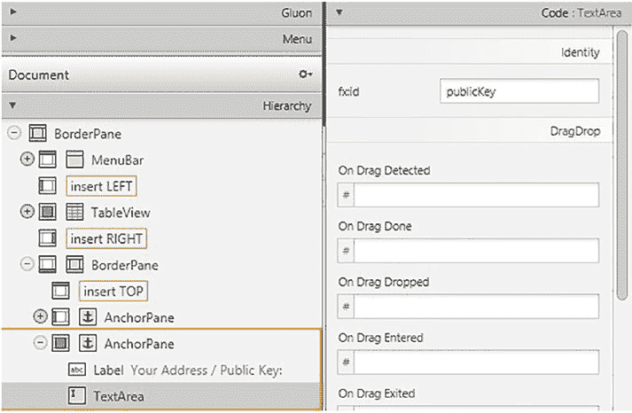

接下来，让我们添加对公钥字段的引用，以便我们可以在 `TextArea` 中显示它。选中 `TextArea`，然后在 `Code` 选项卡中找到 `fx:id` 字段；将其命名为 `publicKey`，如图 4-21 所示。

### 图 4-21. 添加对公钥字段的引用

我们将用于显示硬币余额的 `TextField` 命名为 `eCoins`，如图 4-22 所示。

### 图 4-22. 命名硬币余额字段

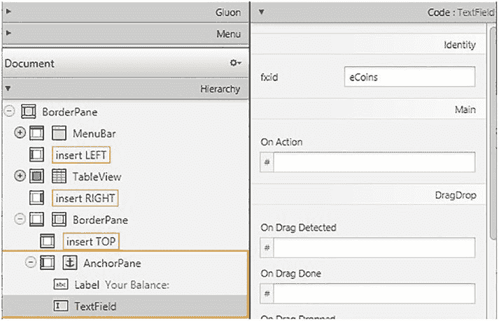


现在我们已经向你展示了如何添加控制器引用，你应该能够自己完成其余部分的添加。

### 练习 4-4

为第一个 `BorderPane` 的 `fx:id` 字段添加引用，命名为 `borderPane`；为 `tableView` 添加引用，命名为 `tableview`；为 `From` 列添加引用，命名为 `from`；为 `to` 列添加引用，命名为 `to`；为 `Value` 列添加引用，命名为 `value`；为 `Signature` 列添加引用，命名为 `signature`；为 `Created On` 列添加引用，命名为 `timestamp`。

**注意：** 这些值是区分大小写的，请确保完全按照所示添加。


### 练习 4-5

为 `Make Transaction` 菜单项的 `On Action` 字段添加引用，命名为 `toNewTransactionController`；为 `Exit` 菜单项添加引用，命名为 `handleExit`。

**注意：** 这些值是区分大小写的，请确保完全按照所示添加。

请仔细检查你的更改是否与以下代码片段中的 `MainWindow.fxml` 代码或我们仓库中的代码一致：

```xml
<?xml version="1.0" encoding="UTF-8"?>

<?import javafx.scene.control.Button?>
<?import javafx.scene.control.Label?>
<?import javafx.scene.control.Menu?>
<?import javafx.scene.control.MenuBar?>
<?import javafx.scene.control.MenuItem?>
<?import javafx.scene.control.TableColumn?>
<?import javafx.scene.control.TableView?>
<?import javafx.scene.control.TextArea?>
<?import javafx.scene.control.TextField?>
<?import javafx.scene.layout.AnchorPane?>
<?import javafx.scene.layout.BorderPane?>

<BorderPane fx:id="borderPane" maxHeight="-Infinity"
```