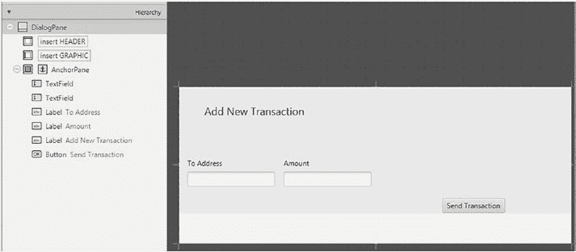
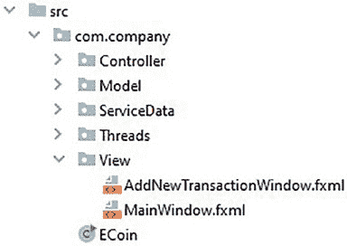
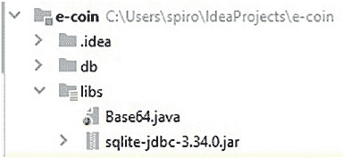

# 第 4 章 构建用户界面

`maxWidth="-Infinity"` `minHeight="-Infinity"` `minWidth="-Infinity"`

`prefHeight="500.0"` `prefWidth="800.0"`

`fx:controller="com.company.Controller.MainWindowController"`

```xml
<top>
    <MenuBar prefHeight="25.0" prefWidth="800.0" BorderPane.alignment="CENTER">
        <menus>
            <Menu mnemonicParsing="false" text="菜单">
                <items>
                    <MenuItem mnemonicParsing="false" onAction="#toNewTransactionController" text="发起交易" />
                    <MenuItem mnemonicParsing="false" onAction="#handleExit" text="退出" />
                </items>
            </Menu>
        </menus>
    </MenuBar>
</top>
<center>
    <TableView fx:id="tableview" prefHeight="406.0" prefWidth="800.0" BorderPane.alignment="CENTER">
        <columns>
            <TableColumn prefWidth="75.0" text="当前区块交易">
                <columns>
                    <TableColumn fx:id="from" prefWidth="160" text="来源" />
                    <TableColumn fx:id="to" prefWidth="160" text="去向" />
                    <TableColumn fx:id="value" prefWidth="160" text="数值" />
                    <TableColumn fx:id="signature" prefWidth="160" text="签名" />
                    <TableColumn fx:id="timestamp" prefWidth="160" text="创建时间" />
                </columns>
            </TableColumn>
        </columns>
        <columnResizePolicy>
            <TableView fx:constant="CONSTRAINED_RESIZE_POLICY" />
        </columnResizePolicy>
    </TableView>
</center>
<bottom>
    <BorderPane prefHeight="69.0" prefWidth="800.0">
        <center>
            <AnchorPane prefHeight="83.0" prefWidth="269.0" BorderPane.alignment="CENTER">
                <children>
                    <Label layoutY="4.0" prefHeight="17.0" prefWidth="149.0" text="你的地址/公钥：" />
                    <TextArea fx:id="publicKey" editable="false" layoutY="23.0" prefHeight="36.0" prefWidth="416.0" />
                </children>
            </AnchorPane>
        </center>
        <left>
            <AnchorPane prefHeight="56.0" prefWidth="136.0" BorderPane.alignment="CENTER">
                <children>
                    <Label layoutX="6.0" layoutY="6.0" prefHeight="17.0" prefWidth="84.0" text="你的余额：" />
                    <TextField fx:id="eCoins" editable="false" layoutX="6.0" layoutY="23.0" prefHeight="25.0" prefWidth="125.0" />
                </children>
            </AnchorPane>
        </left>
        <right>
            <AnchorPane prefHeight="200.0" prefWidth="200.0" BorderPane.alignment="CENTER">
                <children>
                    <Button layoutX="113.0" layoutY="20.0" mnemonicParsing="false" nodeOrientation="LEFT_TO_RIGHT" onAction="#refresh" prefHeight="30.0" prefWidth="67.0" text="刷新" textAlignment="CENTER" />
                </children>
            </AnchorPane>
        </right>
    </BorderPane>
</bottom>
```


完成练习后，我们的主窗口场景就彻底完工了。如果在 IntelliJ 中打开该文件，会显示一些错误提示，因为我们添加的引用尚不存在——不过我们将在后续章节中解决这个问题。

### 4.2.2 `AddNewTransactionWindow.fxml`

由于到目前为止，我们已经讲解了在 Scene Builder 中创建视图所需的一切知识，现在是时候通过完成以下练习，来创建本节所对应的场景了。

`练习 4-6`

在 Scene Builder 中新建一个文件，并将其保存到与之前场景相同的文件夹结构中。将该文件命名为 `AddNewTransactionWindow.fxml`。

`练习 4-7`

按照图 4-23 所示的层级结构和外观创建场景。将控制器类路径设置为 `com.company.Controller.AddNewTransactionController`。




***图 4-23.** 添加控制器类*

`练习 4-8`

将控制器类路径设置为 `com.company.Controller.AddNewTransactionController`。

`练习 4-9`

为以下控件的 `fx:id` 字段添加引用：接收地址 `textField` 命名为 `toAddress`，金额 `textField` 命名为 `value`。

### `练习 4-10`

将 `createNewTransaction` 的引用添加到 `发送交易` 按钮的 `On action` 字段中。

## 第四章 构建用户界面

请仔细检查您的更改是否与以下代码片段中的 `AddNewTransactionWindow.fxml` 代码一致，或者您可以在我们的仓库中找到该文件：

```xml
<?xml version="1.0" encoding="UTF-8"?>
<?import javafx.scene.control.Button?>
<?import javafx.scene.control.DialogPane?>
<?import javafx.scene.control.Label?>
<?import javafx.scene.control.TextField?>
<?import javafx.scene.layout.AnchorPane?>
<?import javafx.scene.text.Font?>
<DialogPane prefHeight="266.0" prefWidth="667.0"
xmlns:fx="http://javafx.com/fxml/1" fx:controller="com.company.Controller.AddNewTransactionController">
<content>
<AnchorPane minHeight="0.0" minWidth="0.0"
prefHeight="250.0" prefWidth="657.0">
<children>
<TextField fx:id="toAddress"
layoutX="14.0" layoutY="144.0" />
<TextField fx:id="value"
layoutX="178.0" layoutY="144.0" />
<Label layoutX="14.0" layoutY="121.0"
text="目标地址" />
<Label layoutX="178.0" layoutY="121.0"
text="金额" />
<Label layoutX="43.0" layoutY="28.0"
text="添加新交易">

<font>
<Font size="18.0" />
</font>
</Label>
<Button layoutX="447.0" layoutY="189.0"
mnemonicParsing="false"
onAction="#createNewTransaction"
text="发送交易" />
</children>
</AnchorPane>
</content>
</DialogPane>
```

## 4.3 创建视图控制器

一旦我们的视图类完成，就该创建它们的控制器了。我们将首先在与 `View` 文件夹相同的路径中添加一个名为 `Controller` 的文件夹，如图 4-24 所示。

**图 4-24.** 添加文件夹



在继续解释控制器中的代码之前，让我们快速下载并安装一个名为 `Base64` 的编码器库，它将帮助我们将以字节数组形式存储的公钥转换为字符串，反之亦然。这一点很重要，因为标准的 Java 编码器在将字节数组转换为字符串时会更改字节数组的内容，这会使它们作为公钥无效。要安装 `Base64` 库，请访问 [`migbase64.sourceforge.net/`](http://migbase64.sourceforge.net/) 并进行下载。下载后，我们需要解压并将其放置在与 `SQLite` 驱动程序相邻的 `libs` 文件夹中，如图 4-25 所示。

**图 4-25.** 安装名为 `Base64` 的编码器库

### 4.3.1 `MainWindowController`

让我们观察以下代码片段中 `MainWindowController` 类的导入部分：

```java
package com.company.Controller;

import com.company.Model.Transaction;
import com.company.ServiceData.BlockchainData;
import com.company.ServiceData.WalletData;
import javafx.application.Platform;
import javafx.fxml.FXML;
import javafx.fxml.FXMLLoader;
import javafx.scene.control.*;
import javafx.scene.control.cell.PropertyValueFactory;
import javafx.scene.layout.BorderPane;

import java.io.IOException;
import java.util.Base64;
import java.util.Optional;
```

接下来，让我们查看以下代码片段中的类字段并进行解释：

```java
public class MainWindowController {
    //这是一个只读的 UI 表格
    @FXML
    public TableView<Transaction> tableview = new TableView<>();
    @FXML
    private TableColumn<Transaction, String> from;
    @FXML
    private TableColumn<Transaction, String> to;
    @FXML
    private TableColumn<Transaction, Integer> value;
    @FXML
    private TableColumn<Transaction, String> timestamp;
    @FXML
    private TableColumn<Transaction, String> signature;
    @FXML
    private BorderPane borderPane;
    @FXML
}
```