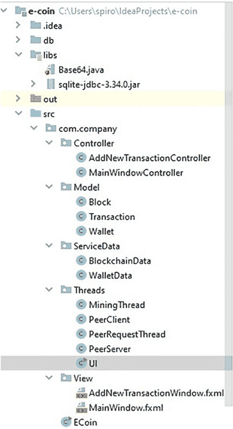

# 第 5 章 搭建网络与多线程

本章将介绍如何创建网络层；我们将解释多个线程各自的创建过程、功能以及它们如何融入我们的应用。在这里，我们会阐述每个线程存在的必要性，以及如何使用其中一些线程来创建一个点对点网络，在该网络中传输区块链数据并达成区块共识。本章将使用标准的 Java 和 Javafx 库，这将帮助你了解实现的每一个细节。在开始本章之前，如果你对 Java 线程的主题不熟悉，可以访问 [`www.javatpoint.com/thread-concept-in-java`](https://www.javatpoint.com/thread-concept-in-java) 查找一个快速教程，它将帮助你掌握基本概念。

## 5.1 UI 线程

由于我们在上一章讨论了 UI 的创建，那就先从 UI 线程开始吧。UI 线程的职责是加载 UI，然后等待并监听任何用户交互。为了使 UI 具有响应性，UI 线程需要主动监听用户输入。为了让 UI 线程能够进行等待和监听，我们必须将任何持续运行的操作（例如挖矿或向对等节点发送请求）转移到其他线程中。这个线程相当简单，主要包含一些来自 javafx 包的标准样板代码。让我们看看下面的代码片段：

```
1 package com.company.Threads;

3 import javafx.application.Application;
4 import javafx.fxml.FXMLLoader;
5 import javafx.scene.Parent;
6 import javafx.scene.Scene;
7 import javafx.stage.Stage;

9 import java.io.IOException;

11 public class UI extends Application {

13 @Override
14 public void start(Stage stage) {
15 Parent root = null;
16 try {
17 root = FXMLLoader.load(getClass()
18 .getResource("../View/MainWindow.fxml"));
19 } catch (IOException e) {
20 e.printStackTrace();
21 }
22 stage.setTitle("E-Coin");
23 stage.setScene(new Scene(root, 900, 700));
24 stage.show();
25 }
26 }
```


由于我们将在此线程中运行 `javafx` 应用程序的 `Stage` 对象，因此实际会继承 `javafx.application` 包中的 `Application` 类线程，而非 `java.lang` 库中的标准 `Thread` 类。在此线程中，我们只需重写 `start` 方法，并将剩余逻辑插入其中。`Stage` 对象将从我们的主 `ECoin` 线程传递过来。在第 17 行，我们使用从 UI 线程位置到首个屏幕（即 `MainWindow.fxml`）位置的相对文件夹路径来设置根路径。第 21–23 行用于设置并显示 UI 的初始场景。如图 5-1 所示，UI 和所有其他线程均位于 `Threads` 文件夹中。



**图 5-1.** *`Threads` 文件夹*

## 5.2 挖矿线程

挖矿线程的目标是处理应用程序的所有挖矿操作。只要应用程序在运行，它就需要持续运行，并确保在适当的时间间隔内创建新区块。此外，由于我们将使用挖矿积分作为达成区块共识的方法，因此该线程还需要跟踪积分。我们的挖矿线程首先会检查当前区块链是否为最新版本，然后在精确的时间间隔内启动新区块的挖矿。该线程将每两秒循环一次。

让我们看看下一个代码片段中 `MiningThread` 类的代码：

```
1 package com.company.Threads;
2
3 import com.company.ServiceData.BlockchainData;
4
5 import java.time.LocalDateTime;
6 import java.time.ZoneOffset;
7
8 public class MiningThread extends Thread {
9
10     @Override
11     public void run() {
12         while (true) {
13             long lastMinedBlock = LocalDateTime.parse(
14                 BlockchainData.getInstance()
15                     .getCurrentBlockChain().getLast()
16                     .getTimeStamp())
17                 .toEpochSecond(ZoneOffset.UTC);
18             if ((lastMinedBlock + BlockchainData
19                     .getTimeoutInterval()) <
20                     LocalDateTime.now().toEpochSecond(
21                         ZoneOffset.UTC)) {
22                 System.out.println("区块链过于陈旧，无法挖矿！请从对等节点更新");
23             } else if (((lastMinedBlock + BlockchainData
24                     .getMiningInterval()) -
25                     LocalDateTime.now().toEpochSecond(
26                         ZoneOffset.UTC)) > 0) {
27                 System.out.println("区块链为最新状态，挖矿将在 " +
28                     ((lastMinedBlock + BlockchainData
29                         .getMiningInterval()) -
30                         LocalDateTime.now()
31                             .toEpochSecond(ZoneOffset.UTC)) +
32                     " 秒后开始");
33             } else {
34                 System.out.println("正在挖取新区块");
35                 BlockchainData.getInstance().mineBlock();
36                 System.out.println(BlockchainData
37                     .getInstance().getWalletBallanceFX());
38             }
39             System.out.println(LocalDateTime
40                 .parse(BlockchainData.getInstance()
41                     .getCurrentBlockChain().getLast()
42                     .getTimeStamp())
43                 .toEpochSecond(ZoneOffset.UTC));
44             try {
45                 Thread.sleep(2000);
46                 if (BlockchainData.getInstance()
47                         .isExit()) { break; }
48                 BlockchainData.getInstance().setMiningPoints(
49                     BlockchainData.getInstance()
50                         .getMiningPoints() + 2);
51             } catch (InterruptedException e) {
52                 e.printStackTrace();
53             }
54         }
55     }
56 }
```

我们的 `MiningThread` 类继承自 `java.lang` 包中的 `Thread` 类。我们重写了 `run()` 方法来定义该线程将要运行的逻辑。在第 12 行，我们设置了一个带 `true` 参数的 `while` 循环，这意味着只要应用程序在运行，我们就会重复执行此方法中的操作。在第 13 和第 14 行，我们设置了一个字段，其值为上次挖出区块的日期（以秒为单位）。

为此，我们使用了 `BlockchainData` 类，该类属于我们的服务层，我们将在下一章解释如何创建它。为了避免代码负担过重，应用程序不会处理不同时区；因此，我们将使用标准的 `ZoneOffset.UTC` 常量。第 15 行的第一个 `if` 语句检查自上次挖出区块以来是否已超过 65 秒（即我们在 `BlockchainData` 类中设置的超时间隔，将在第 6 章讨论）。这意味着区块链过于陈旧，在获取最新版本之前尝试挖矿毫无意义。因此，在这种情况下，我们在控制台打印第 16 行的消息。如果第一个 `if` 语句为假，则第 17 行的 `else if` 语句检查自上次挖出区块以来是否少于 60 秒（即挖矿间隔，也将在第 6 章讨论）。如果为真，我们将打印到 60 秒之前的剩余时间。如果执行到第 20 行的 `else` 语句，则意味着我们处于自上次挖出区块后的 60 到 65 秒时间窗口内，是时候挖（创建）另一个区块了。第 22 行再次使用服务层调用挖矿方法，第 23 行再次通过服务层将新钱包余额打印到控制台。在第 25 和 26 行，无论之前控制流语句的结果如何，我们都会将上次挖出区块的时间打印到控制台，以保持清晰。

由于该线程无需尽可能快地循环，我们在第 28 行调用线程休眠两秒，这实际上使该线程每两秒重复一次。我们将挖矿积分的获取速率设置为每秒 1 分；因此，在第 29 行，每等待两秒，我们就增加两个挖矿积分。

**练习 5-1**

尝试提出一种更高效的方法来循环此线程。

**提示：** 尝试在多个位置使用不同时间的 `Thread.sleep()` 方法。

**注意：** 确保保持相同的挖矿积分获取速率。

## 5.3 P2P 网络线程

接下来的小节将解释如何创建用于运行对等网络的线程类。为了创建对等网络，我们需要应用程序同时充当客户端（向其他对等节点发送请求）和服务器（监听并响应其他对等节点的请求）。让我们先从 `PeerClient` 类线程开始。

出于本书的考虑，由于安全问题，我们不会将网络暴露到互联网；相反，我们将设置不同的本地端口，模拟网络中的不同对等节点。

### 5.3.1 PeerClient 线程

我们的 `PeerClient` 线程将遍历预定的对等节点列表，并尝试与它们共享我们的区块链。让我们看看下一个代码片段：

```
1 package com.company.Threads;
2
3 import com.company.Model.Block;
4 import com.company.ServiceData.BlockchainData;
5
6 import java.io.IOException;
7 import java.io.ObjectInputStream;
8 import java.io.ObjectOutputStream;
9 import java.net.Socket;
10 import java.net.SocketTimeoutException;
11 import java.util.LinkedList;
12 import java.util.Queue;
13 import java.util.concurrent.ConcurrentLinkedQueue;
14
15 public class PeerClient extends Thread {
16
17     private Queue<Integer> queue = new ConcurrentLinkedQueue<>();
18
19     public PeerClient() {
20         this.queue.add(6001);
21         this.queue.add(6002);
22     }
23 }
```


