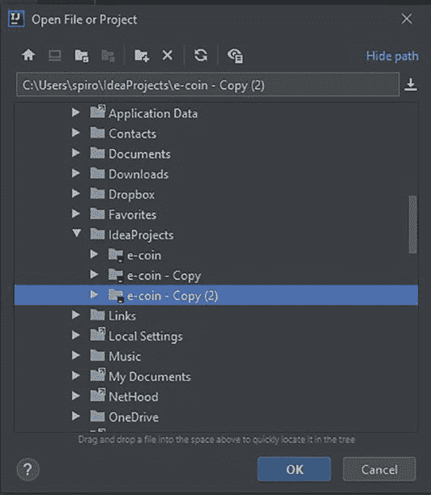
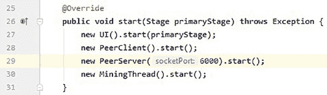
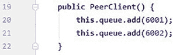
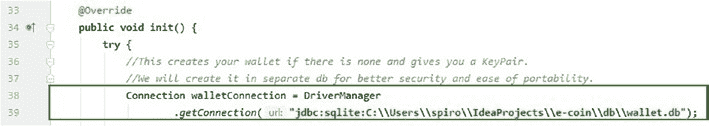
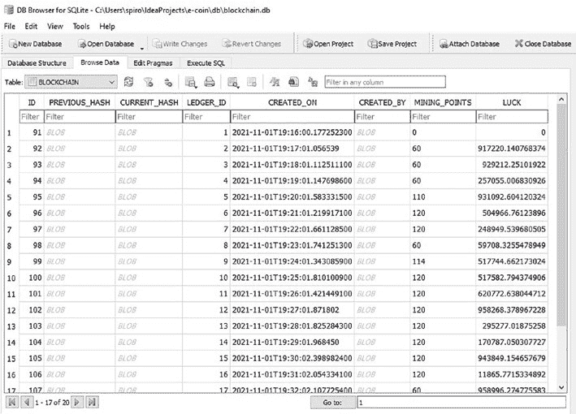
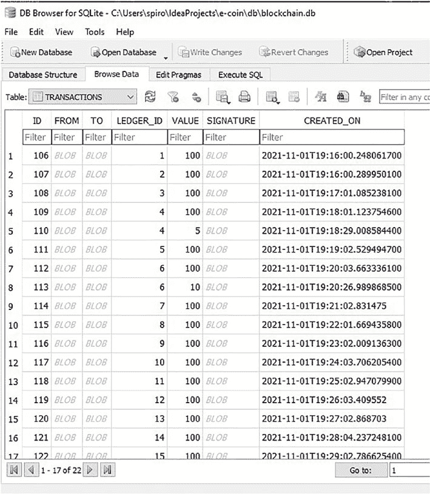
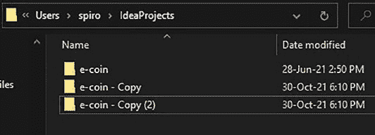

# 第 6 章 服务层

## 6.1 加载区块链

现在让我们回到`loadBlockChain()`方法，我们在解释`loadTransactionLedger`的使用时简要提到过它。每当我们想从数据库加载整个区块链并相应设置应用程序状态时，都会使用此方法。如果你还记得，此方法在应用程序的初始化方法中使用，并且在后续章节讨论共识算法时，你也会看到它在几种情况下被使用。该方法相当庞大，因此我们将将其拆分为接下来的两个代码片段：

```java
135 public void loadBlockChain() {  
136   try {  
137     Connection connection = DriverManager.getConnection(  
138       "jdbc:sqlite:C:\\Users\\spiro\\IdeaProjects\\e-coin\\db\\blockchain.db");  
139     Statement stmt = connection.createStatement();  
140     ResultSet resultSet = stmt.executeQuery("SELECT * FROM BLOCKCHAIN");  
141     while (resultSet.next()) {  
142       this.currentBlockChain.add(new Block(  
143         resultSet.getBytes("PREVIOUS_HASH"),  
144         resultSet.getBytes("CURRENT_HASH"),  
145         resultSet.getString("CREATED_ON"),  
146         resultSet.getBytes("CREATED_BY"),  
147         resultSet.getInt("LEDGER_ID"),  
148         resultSet.getInt("MINING_POINTS"),  
149         resultSet.getDouble("LUCK"),  
150         loadTransactionLedger(  
151           resultSet.getInt("LEDGER_ID"))  
152       ));  
153     }  
```

第 137 至 140 行是相当标准的JDBC代码。我们建立到数据库的连接，创建并执行查询以从`BLOCKCHAIN`（区块链）表中选择所有内容。接着我们遍历结果集，创建一个新的`Block`（区块）对象，并将其添加到此类的`currentBlockChain`（当前区块链）字段中。

需要注意的一点是第 150 行，我们使用`loadTransactionLedger`方法，传入结果集中的当前账本ID，以检索此区块的交易列表，并将其包含在`Block`对象的构造函数中。

让我们继续看这个方法的第二部分：

```java
154 latestBlock = currentBlockChain.getLast();  
155 Transaction transaction = new Transaction(  
156   new Wallet(),  
157   WalletData.getInstance().getWallet().getPublicKey().getEncoded(),  
158   100, latestBlock.getLedgerId() + 1, signing);  
159 newBlockTransactions.clear();  
160 newBlockTransactions.add(transaction);  
161 verifyBlockChain(currentBlockChain);  
162 resultSet.close();  
163 stmt.close();  
164 connection.close();  
165 } catch (SQLException | NoSuchAlgorithmException e) {  
166 System.out.println("Problem with DB: " + e.getMessage());  
167 e.printStackTrace();  
168 } catch (GeneralSecurityException e) {  
169 e.printStackTrace();  
170 }  
171 }
```

在此方法的这一部分中，我们将更新应用程序的状态，使其从此刻开始正常运行。为此，我们需要修改`latestBlock`和`newBlockTransactions`字段。在第 154 行，我们通过从`currentBlockChain`列表中获取最后一个区块来设置`latestBlock`字段（该列表已在方法的第一部分中被填充）。接下来，为了初始化`newBlockTransactions`列表，我们首先在第 155-157 行创建一个新的奖励交易对象。然后清空该列表并添加我们刚刚创建的新交易。这是为未来区块准备的奖励交易。最后一行重要的是第 160 行，在这里我们可以看到针对刚从数据库加载的`currentBlockChain`调用了`verifyBlockChain`方法。这是重要的一步，因为它能够处理当导入他人数据库时需要检查其有效性的情况。

## 6.2 挖矿功能

现在我们来探讨构成挖矿功能的各个方法。在接下来的代码片段中，让我们简要地看一下`mineBlock()`方法。

```java
200 public void mineBlock() {
201   try {
202     finalizeBlock(WalletData.getInstance()
203             .getWallet());
204     addBlock(latestBlock);
205   } catch (SQLException | GeneralSecurityException e) {
206     System.out.println("Problem with DB: " +
207             e.getMessage());
208     e.printStackTrace();
209   }
210 }
```

首先回忆一下，这是我们在`MiningThread`类中需要挖新区块时调用的方法。此方法只是调用了`finalizeBlock`和`addBlock`方法。`finalizeBlock`方法执行完成最新区块的必要步骤，并将其添加到`currentBlockChain`列表中。不同的矿工可能拥有包含不同交易的最新（未最终确定的）区块。`addBlock`方法则只需将区块添加到数据库中。

### 6.2.1 `finalizeBlock` 方法

我们先解释`finalizeBlock`方法，如下面的代码片段所示：

```java
210 private void finalizeBlock(Wallet minersWallet) throws GeneralSecurityException, SQLException {
211   latestBlock = new Block(BlockchainData
212           .getInstance().currentBlockChain);
213   latestBlock.setTransactionLedger(new ArrayList<>(
214           newBlockTransactions));
215   latestBlock.setTimeStamp(LocalDateTime.now()
216           .toString());
217   latestBlock.setMinedBy(minersWallet.getPublicKey()
218           .getEncoded());
219   latestBlock.setMiningPoints(miningPoints);
220   signing.initSign(minersWallet.getPrivateKey());
221   signing.update(latestBlock.toString().getBytes());
222   latestBlock.setCurrHash(signing.sign());
223   currentBlockChain.add(latestBlock);
224   miningPoints = 0;
225   //奖励交易
226   latestBlock.getTransactionLedger()
227           .sort(transactionComparator);
228   addTransaction(latestBlock.getTransactionLedger()
229           .get(0), true);
230   Transaction transaction = new Transaction(new Wallet(), minersWallet.getPublicKey().getEncoded(),
231           100, latestBlock.getLedgerId() + 1, signing);
232   newBlockTransactions.clear();
233   newBlockTransactions.add(transaction);
234 }
```

在此方法中，我们首先准备/最终确定`latestBlock`。

在第 211 行，我们创建一个新的`Block`并将其赋值给`latestBlock`。在第 212 行，我们将`newBlockTransactions`添加到`latestBlock`的账本中。

在第 213 行，我们将时间戳设置为当前时间。在第 214 行，我们设置自己的钱包地址，因为我们是此区块的挖矿者（`minedBy`）。

在第 215 行，我们设置当前累积的挖矿点数。如果需要回顾我们是如何累积挖矿点数的，可以重新查看第 5 章的“挖矿线程”部分。到这一步，`latestBlock`已经包含了除签名之外的所有数据，而签名在此将被设置为当前哈希值。回顾一下，这个签名实际上代表了我们区块中包含的所有数据的编码值。这就是为什么我们总是最后创建签名并设置当前哈希值。一旦完成，对区块的任何修改都会导致区块验证失败，因为用我们的公钥解码后的签名将与区块中的当前数据不匹配。

**重要提示！** 如果你需要更多帮助来理解我们如何创建和使用签名，请重新查看第 2 章。

接下来，在第 219 行，我们将`latestBlock`纳入`currentBlockChain`，因为我们已完全将其最终确定。然而，在完成此方法之前，我们还需要设置几个项目。在第 220 行，我们将挖矿点数重置为 0。在第 222 行，我们将刚最终确定的区块的奖励交易添加到数据库中，因为到目前为止，它只保存在我们复制到`latestBlock`中的`newBlockTransactions`列表里。完成后，我们创建一个新的奖励交易对象，清空`newBlockTransactions`列表（因为它包含已最终确定区块的旧交易），然后将新的奖励交易添加到`newBlockTransactions`中。预载了下一个奖励交易的`newBlockTransactions`列表现已准备好，它将填充新的交易，直到下一个挖矿周期。这个奖励交易是矿工成功挖出下一个区块后获得的奖励。

**练习 6-2**

添加奖励交易并对其进行跟踪看起来有些繁琐且多余。你能简化代码库，使得我们不必这样做吗？

**提示** 我们都知道区块的创建者会获得奖励。尝试修改`getBalance`方法，为相关地址创建的每个区块额外增加 100 个币。这样就不需要显式添加奖励交易了。

### 6.2.2 `addBlock` 方法

现在，一旦我们最终确定/挖出了区块，就需要将其也添加到数据库中。为此，我们提到使用`addBlock`方法。让我们查看下面的代码片段并进行解释：

```java
229 private void addBlock(Block block) {
230   try {
231     Connection connection = DriverManager.getConnection
232             ("jdbc:sqlite:C:\\Users\\spiro\\IdeaProjects\\e-coin\\db\\blockchain.db");
233     PreparedStatement pstmt;
234     pstmt = connection.prepareStatement
235             ("INSERT INTO BLOCKCHAIN(PREVIOUS_HASH, CURRENT_HASH, LEDGER_ID, CREATED_ON," +
236              " CREATED_BY, MINING_POINTS, LUCK) VALUES (?,?,?,?,?,?,?) ");
237     pstmt.setBytes(1, block.getPrevHash());
238     pstmt.setBytes(2, block.getCurrHash());
239     pstmt.setInt(3, block.getLedgerId());
240     pstmt.setString(4, block.getTimeStamp());
241     pstmt.setBytes(5, block.getMinedBy());
242     pstmt.setInt(6, block.getMiningPoints());
243     pstmt.setDouble(7, block.getLuck());
244     pstmt.executeUpdate();
245     pstmt.close();
246     connection.close();
247   } catch (SQLException e) {
248     System.out.println("Problem with DB: " + e.getMessage());
249     e.printStackTrace();
250   }
251 }
```

到目前为止，您应该已经熟悉了执行`JDBC`查询。该方法接受一个单一的`Block`对象参数，并使用它在数据库的`BLOCKCHAIN`表中创建一个新条目，该条目将代表我们最新挖掘的区块。最后需要注意的是，`addBlock`方法也将在我们接下来要解释的方法`replaceBlockchainInDatabase`中使用。

## 6.3 区块链替换

当我们需要用从其他对等节点接收到的区块链替换我们自己的区块链时，就需要用到此方法。在我们首先解释此方法之后，当讨论共识算法时，我们将涵盖这些原因。让我们看以下代码片段：

# 区块链替换与共识

```java
254 private void replaceBlockchainInDatabase(LinkedList<Block> receivedBC) {
255     try {
256         Connection connection = DriverManager.getConnection
257             ("jdbc:sqlite:C:\\Users\\spiro\\ IdeaProjects\\e-coin\\db\\blockchain.db");
258         Statement clearDBStatement = connection.createStatement();
259         clearDBStatement.executeUpdate("DELETE FROM BLOCKCHAIN");
260         clearDBStatement.executeUpdate("DELETE FROM TRANSACTIONS");
261         clearDBStatement.close();
262         connection.close();
263         for (Block block : receivedBC) {
264             addBlock(block);
265             boolean rewardTransaction = true;
266             block.getTransactionLedger().sort(transactionComparator);
267             for (Transaction transaction : block.getTransactionLedger()) {
268                 addTransaction(transaction, rewardTransaction);
269                 rewardTransaction = false;
270             }
271         }
272     } catch (SQLException | GeneralSecurityException e) {
273         System.out.println("Problem with DB: " + e.getMessage());
274         e.printStackTrace();
275     }
276 }
```

此方法接受一个`LinkedList<Block>`对象参数，该参数代表我们要导入数据库的区块链。该方法首先建立与数据库的连接，并在第 259 和 260 行执行清除表中现有数据的语句。

在第 263-271 行，我们遍历要导入的区块链的区块及其交易，并调用之前解释过的`addBlock`和`addTransaction`方法，将每个区块和交易写入数据库。

## 练习 6-3

在`replaceBlockchainInDatabase`方法中重用`addBlock`和`addTransaction`方法并不是将区块链导入数据库的高效方式。每次调用这些方法之一，都会打开和关闭一次数据库连接。您能编写一个更高效的实现来实现相同的目的吗？

### 6.2.1 区块链共识协议

终于，我们到达了在应用程序中执行共识算法的方法。在开始解释代码之前，我们需要先讨论一下区块链共识。

*区块链共识*，或者说，关于每个对等节点构建和共享的区块链的网络共识，是这项技术的核心。要实现每次都可靠地达成共识，需要解决的主要问题是所谓的拜占庭将军问题。这个术语源自一个寓言，用于描述这样一种情况：为了避免系统灾难性故障，系统的参与者必须就一项协调策略达成一致，但其中一些参与者是不可靠的。简而言之，拜占庭将军问题是这样描述的：一群拜占庭将军包围了一座敌军城市，正在决定是进攻还是撤退。无论做出什么决定，他们都必须遵循相同的决定。问题因将军们彼此隔离、仅通过消息进行通信而变得更加复杂。此外，有些将军可能是叛徒，可能会向其他将军散布关于他们意图的虚假信息，以制造更多混乱。

现在让我们回到正题，在将军问题和我们的区块链之间进行一些类比。关于我们的应用程序，这里的将军将是矿工/对等节点。它们之间达成共识的必要性是显而易见的；否则，我们最终会得到许多不同的、无用的区块链。此外，好的对等节点必须有能力发现并丢弃坏的行为者篡改区块链有效性的企图。如果在一个充满坏行为者造成的错误的区块链上达成共识，那将毫无用处。这意味着我们必须将每个对等节点都视为潜在的坏行为者和不可信来源。

为了探索共识解决方案面临的许多复杂性和问题，我们决定实现一个略微修改的比特币工作量证明算法版本。当然，我们的解决方案远不如比特币和其他加密货币实际使用的方案，但我们认为，它将作为更好的学习工具，帮助掌握共识算法面临的问题。

```java
278 public LinkedList<Block> getBlockchainConsensus(LinkedList<Block> receivedBC) {
279     try {
280         // 验证接收到的区块链的有效性。
281         verifyBlockChain(receivedBC);
282         // 检查我们是否收到了完全相同的区块链。
283         if (! Arrays.equals(receivedBC.getLast().getCurrHash(), getCurrentBlockChain().getLast().getCurrHash())) {
284             if (checkIfOutdated(receivedBC) != null) {
285                 return getCurrentBlockChain();
286             } else {
287                 if (checkWhichIsCreatedFirst(receivedBC) != null) {
288                     return getCurrentBlockChain();
289                 } else {
290                     if (compareMiningPointsAndLuck(receivedBC) != null) {
291                         return getCurrentBlockChain();
292                     }
293                 }
294             }
295         // 如果只有交易账本不同，则合并它们。
296         } else if (! receivedBC.getLast().getTransactionLedger().equals(getCurrentBlockChain()
297             .getLast().getTransactionLedger())) {
298             updateTransactionLedgers(receivedBC);
299             System.out.println("Transaction ledgers updated");
300             return receivedBC;
301         } else {
302             System.out.println("blockchains are identical");
303         }
304     } catch (GeneralSecurityException e) {
305         e.printStackTrace();
306     }
307     return receivedBC;
308 }
```

我们的`getBlockchainConsensus`方法接受一个`LinkedList<Block>`参数，该参数代表我们从对等节点接收到的区块链。我们将对我们的本地区块链和接收到的区块链执行验证检查和多次比较。首先，我们将解释方法的整体逻辑，然后深入解释我们尚未介绍的每个方法。在第 281 行，我们首先验证接收到的区块链的有效性。如前所述，我们不信任任何对等节点，因此我们总是验证从他们那里得到的任何内容。如果我们收到的方法未能通过验证检查，故事就此结束。我们的应用程序会抛出异常，并丢弃接收到的区块链。如果接收到的区块链通过验证，则我们继续进行比较。在第 283 行，我们执行第一个比较：比较我们自己的方法和接收到的那个。这里我们检查每个区块链的当前哈希值是否完全匹配。只有当我们的区块链完全匹配时，此检查才会为真。

让我们回顾一下我们的区块链与接收到的区块链的当前哈希值不匹配的情况。

这意味着两个区块链有不同矿工挖掘的最后一个区块。当发生这种情况时，意味着我们需要执行一些共识检查，以确定哪个矿工有权挖掘最后一个区块。

## 共识检查过程

我们的第一个共识检查是确定是否有任何区块链已经过时，即检查它们是否比一个完整的挖矿间隔更旧。我们将在后面进一步详细解释`checkIfOutdated`方法；现在仅提及它的功能。它简单地确定是否有任何方法过时并将其丢弃。如果接收到的区块链过时，则我们继续使用自己的。如果我们的区块链过时，则丢弃自己的并从此时开始使用接收到的。如果两者都过时，则我们不对共识做任何操作，并等待接收一个最新的区块链。如果两者都是最新的，则我们继续执行共识检查。

下一个检查在第 287 行，运行`checkWhichIsCreatedFirst`方法。此方法用于确定两个区块链是否具有相同的初始区块。如果不同，我们将使用最先创建的那个。在第 290 行的下一个检查是在两个区块链具有相同初始区块时到达的。这里我们运行`compareMiningPointsAndLuck`方法。当我们到达此方法时，已确定接收到的区块链是有效的，并且两个区块链都是最新的，且在最后一个区块之前完全相同。为了确定我们将使用哪个区块链的最后一个区块，我们将检查每个区块链记录的挖矿点数。如果出现平局，我们将根据它们记录的运气值（只是一个大的随机数）来确定结果。

现在让我们回到第 283 行，讨论区块链当前哈希值相同的情况。这意味着最后一个区块的矿工在此方法的先前运行中已经确定。回顾第 5 章，我们不断尝试将我们的区块链分享给其他对等节点，因此`getBlockchainConsensus`方法会重复运行。所以如果我们的当前哈希值相同，则继续执行到第 296 行。在第 296 行，我们比较区块链的交易账本。

有些情况下，我们在获取该区块期间发生的所有交易之前就已确定了正确的矿工。让我们设想一种情况：对等节点 1、对等节点 2 和对等节点 3 在刚刚挖出一个新区块后尝试分享它们的区块链。对等节点 1 具有最高的挖矿点数，因此我们期望其区块链在对等节点 2 和对等节点 3 的共识检查中获胜。然而，所有对等节点开始时只拥有它们自己记录在其区块上的交易。首先对等节点 1 将其区块链分享给对等节点 2，对等节点 2 接受对等节点 1 的最后一个区块，但也将其自己的交易添加到对等节点 2 已有的交易中。接下来，对等节点 1 将其区块链分享给对等节点 3，同样的事情发生。此时，对等节点 2 和对等节点 3 都包含对等节点 1 的最后一个区块及其交易。此时，当对等节点 2 尝试将其区块链分享给对等节点 3 时，它们将具有相同的当前哈希值，因为两者都有对等节点 1 的最后一个区块；然而，对等节点 2 缺少对等节点 3 的交易，反之亦然。这就是共识算法到达第 296 行并检查它们交易账本的时刻。由于它们的交易账本不相同，将调用第 298 行的`updateTransactionLedgers`方法。

**问题 6-1**

在前面的场景中，如果对等节点 3 尝试将其区块链分享给对等节点 1，接下来会发生什么？

**问题 6-2**

在前面的场景中，如果对等节点 2 再次尝试将其区块链分享给对等节点 3，接下来会发生什么？

*答案见本章末尾。*

对于最后一种情况，当两个区块链完全相同时，则在控制台打印第 302 行的消息，并在第 307 行返回接收到的区块链。

## 服务层方法详解

现在让我们回过头来详细讨论我们所提到的方法。首先从`checkIfOutdated`方法开始，如下面的代码片段所示：

```java
327 private LinkedList<Block> checkIfOutdated(
LinkedList<Block> receivedBC) {
328 //检查区块链有多旧。
329 long lastMinedLocalBlock = LocalDateTime.parse(
    getCurrentBlockChain().getLast()
        .getTimeStamp())
    .toEpochSecond(ZoneOffset.UTC);
330 long lastMinedRcvdBlock = LocalDateTime.parse(
    receivedBC.getLast().getTimeStamp())
    .toEpochSecond(ZoneOffset.UTC);
331 //若两者都已过时，则不做任何操作
332 if ((lastMinedLocalBlock + TIMEOUT_INTERVAL) < LocalDateTime.now().toEpochSecond(
    ZoneOffset.UTC) &&
333     (lastMinedRcvdBlock + TIMEOUT_INTERVAL) < LocalDateTime.now().toEpochSecond(
        ZoneOffset.UTC)) {
334     System.out.println("两者都已过时，检查其他对等节点");
335     //如果你的区块链已过时，但接收到的区块链是新的，则使用接收到的区块链
336 } else if ((lastMinedLocalBlock + TIMEOUT_INTERVAL) < LocalDateTime.now().toEpochSecond(
                 ZoneOffset.UTC) &&
337            (lastMinedRcvdBlock + TIMEOUT_INTERVAL) >=
338                 LocalDateTime.now().toEpochSecond(
339                     ZoneOffset.UTC)) {
340     //重置挖矿点数，因为我们之前未参与贡献。
341     setMiningPoints(0);
342     replaceBlockchainInDatabase(receivedBC);
343     setCurrentBlockChain(new LinkedList<>());
344     loadBlockChain();
345     System.out.println("接收到的区块链胜出，本地区块链已过时");
346     //如果接收到的区块链已过时，但本地区块链是新的，则向对方发送我们的区块链
347 } else if ((lastMinedLocalBlock + TIMEOUT_INTERVAL) > LocalDateTime.now().toEpochSecond(
                 ZoneOffset.UTC) &&
348            (lastMinedRcvdBlock + TIMEOUT_INTERVAL) < LocalDateTime.now().toEpochSecond(
                 ZoneOffset.UTC)) {
349     return getCurrentBlockChain();
350 }
351 return null;
352 }
```

该方法接收接收到的区块链作为参数。我们无需传递本地区块链，因为可以直接在方法内部访问它。第 329–331 行以秒为单位获取两条区块链中最后一个区块的创建时间。第 334 和 335 行通过比较最后一次挖出的区块（以秒计）并将超时间隔与当前时间相加，来检查两者是否都已过时。如果两者都过时，则第 336 行的消息会打印在控制台中，并返回第 352 行的 `null`。接下来的检查在第 338 和 339 行，判断本地区块链是否已过时，而接收到的区块链是否是最新的。如果是这种情况，则执行第 341–345 行。这意味着挖矿点数会被重置，因为之前我们一直在使用一条过时的区块链。然后我们将接收到的区块链添加到数据库中，并更新应用程序的状态以进行匹配。

在这种情况下，该方法同样返回 `null`。最后一种情况发生在第 347 和 348 行的检查为真时，这意味着接收到的区块链已过时，而我们的本地区块链是最新的。在这种情况下，我们返回本地区块链。

我们的下一个方法是 `checkWhichIsCreatedFirst` 方法。

# 共识机制代码解析

## 方法：`checkWhichIsCreatedFirst`

```java
355 private LinkedList<Block> checkWhichIsCreatedFirst(
    LinkedList<Block> receivedBC) {
356     //比较时间戳，判断哪条区块链先被创建。
357     long initRcvBlockTime = LocalDateTime.parse(
        receivedBC.getFirst().getTimeStamp())
358         .toEpochSecond(ZoneOffset.UTC);
359     long initLocalBlockTIme = LocalDateTime.parse(
        getCurrentBlockChain().getFirst()
360         .getTimeStamp()).toEpochSecond(
361             ZoneOffset.UTC);
362     if (initRcvBlockTime < initLocalBlockTIme) {
363         //重置挖矿点数，因为我们之前未参与贡献。
364         setMiningPoints(0);
365         replaceBlockchainInDatabase(receivedBC);
366         setCurrentBlockChain(new LinkedList<>());
367         loadBlockChain();
368         System.out.println("对等客户端区块链胜出，对等服务器区块链已过时");
369     } else if (initLocalBlockTIme < initRcvBlockTime) {
370         return getCurrentBlockChain();
371     }
372     return null;
373 }
```

在`compareMiningPointsAndLuck`方法中，首先以秒为单位检索初始区块的创建时间，如第 357–360 行所示。在第 361 行，检查接收到的区块链的创建时间（以秒为单位）是否小于本地区块链的创建时间。这意味着接收到的区块链先被创建。如果是这种情况，则执行第 363–367 行，并返回第 371 行的`null`。如果情况相反，即本地区块链先被创建，则直接返回本地区块链。

## 方法：`compareMiningPointsAndLuck`

让我们看看以下代码片段中的`compareMiningPointsAndLuck`方法：

```java
374 private LinkedList<Block> compareMiningPointsAndLuck(
        LinkedList<Block> receivedBC) 375 throws GeneralSecurityException {
376     //检查两个区块链是否具有相同的前一个哈希值，以确认它们都在
377     //争夺最后一个区块的挖矿权
378     //如果相同，则比较挖矿点数，若挖矿点数相等则比较运气值，以判断谁获胜
379     //of last block to see who wins
380     if (receivedBC.equals(getCurrentBlockChain())) {
381         //如果接收到的区块拥有更多挖矿点数，或者在平局时运气更好
382         //则将所有交易转移到获胜区块，并将其添加至数据库。
383         if (receivedBC.getLast().getMiningPoints() > getCurrentBlockChain()
384                 .getLast().getMiningPoints() ||
385                 receivedBC.getLast().getMiningPoints()
386                 .equals(getCurrentBlockChain()
387                         .getLast().getMiningPoints()) &&
388                 receivedBC.getLast().getLuck() > getCurrentBlockChain().getLast()
389                         .getLuck()) {
390             //从我们失败的区块中移除奖励交易，并
391             //将交易转移到获胜区块
392             getCurrentBlockChain().getLast()
393                     .getTransactionLedger().remove(0);
394             for (Transaction transaction :
395                     getCurrentBlockChain().getLast()
396                             .getTransactionLedger()) {
397                 if (!receivedBC.getLast()
398                         .getTransactionLedger()
399                         .contains(transaction)) {
400                     receivedBC.getLast()
401                             .getTransactionLedger()
402                             .add(transaction);
403                 }
404             }
405             receivedBC.getLast()
406                     .getTransactionLedger().sort(
407                             transactionComparator);
408             //由于我们的本地区块失败，此处返回挖矿点数
409             setMiningPoints(BlockchainData
410                     .getInstance().getMiningPoints() +
411                     getCurrentBlockChain().getLast()
412                             .getMiningPoints());
413             replaceBlockchainInDatabase(receivedBC);
414             setCurrentBlockChain(new LinkedList<>());
415             loadBlockChain();
416             System.out.println("接收到区块链获胜！");
417         } else {
418             //从他们失败的区块中移除奖励交易，并将
419             //交易转移到我们获胜的区块
420             receivedBC.getLast().getTransactionLedger()
421                     .remove(0);
422             for (Transaction transaction :
423                     receivedBC.getLast()
424                             .getTransactionLedger()) {
425                 if (!getCurrentBlockChain().getLast()
426                         .getTransactionLedger()
427                         .contains(transaction)) {
428                     getCurrentBlockChain().getLast()
429                             .getTransactionLedger()
430                             .add(transaction);
431                     addTransaction(transaction, false);
432                 }
433             }
434             getCurrentBlockChain().getLast()
435                     .getTransactionLedger()
436                     .sort(transactionComparator);
437             return getCurrentBlockChain();
438         }
439     }
440     return null;
441 }
```

如代码中的注释所述，该方法首先检查两个区块链是否包含相同的前一个哈希值。这意味着它们共享直到最后一个区块之前的相同区块。如果此检查失败，则返回第 440 行的`null`。第 383–386 行检查是否满足接收区块链的获胜条件。如果是这种情况，则执行第 389–402 行。

执行这些行代码的具体操作如下：我们从账本中移除奖励交易，合并账本，退还我们自己的挖矿积分，然后将获胜的区块链及其更新后的交易添加到数据库中，并相应地设置应用程序状态。

第 403 行的`else`表示接收到的区块链未满足获胜条件，这意味着我们本地区块链获胜。第 406–414 行从接收到的区块链中移除奖励交易，将其交易添加到我们自己的账本中，然后返回我们的区块链。

`getConsensus`方法中唯一需要解释的方法就是`updateTransactionLedgers`方法。让我们看看下面的代码片段：

# 第 7 章 附加内容

本章将介绍如何设置和运行我们的区块链应用程序。我们还将讨论扩展应用程序功能的主题和想法，并对本书进行总结。

## 运行应用程序

在前面的章节中，我们提到由于安全原因，不会将应用程序暴露到互联网上，而是决定在本地进行测试。为此，我们首先需要创建 `e-coin` 项目文件夹的多个副本，如图 7-1 所示。

**图 7-1.** 创建 `e-coin` 项目的副本*

下一步是在 `IntelliJ` 中打开每个项目。你可以通过选择“文件”，然后选择“打开项目”，选择其他文件夹，并在提示时选择在新窗口中打开来实现。你可以参考图 7-2 和图 7-3。

 

**图 7-2.** 导航到文件夹*

**图 7-3.** 打开项目*

完成此步骤并且所有副本都在 `IntelliJ` 中打开后，就该更改一些硬编码的值，以确保每个副本都是自己独立的对等节点了。首先更改 `PeerServer` 端口，因为每个对等节点都需要有自己的端口号。见图 7-4。

  

**图 7-4.** 更改 `PeerServer` 端口*

接下来，我们需要在 `PeerClient` 类的构造函数中，将其他对等节点的套接字端口号添加到彼此的 `PeerClient` 队列中，如图 7-5 所示。

**图 7-5.** 添加套接字编号*

最后，我们需要检查 `jdbc` 连接，并将文件路径更改为与副本的文件路径对应。图 7-6 显示了一个示例。

**图 7-6.** 更改文件路径*

其余的这些连接文件路径可以在 `ECoin` 类的 `init()` 方法以及服务层类 `BlockchainData` 和 `WalletData` 的多个方法中找到。最后这一更改将确保每个对等节点拥有自己独立的数据库来存储区块链和钱包。如果你想将钱包导出到另一个对等节点，只需将 `wallet.db` 数据库从一个对等节点的文件夹路径复制到另一个即可。同时请记住，如果你删除了 `wallet.db` 数据库并且没有备份副本，那么该钱包的访问权限和币将永久丢失，因为你将失去密钥对。除此之外，你只需在 `IntelliJ` 中运行每个副本，就能拥有一个运行中的点对点网络。

在运行应用程序之前，请确保你已经安装了 Java SE 8。如果你不确定自己安装的版本，可以在 `IntelliJ` 的控制台中输入 `java -version` 进行检查。

一旦你挖到了一些币，就可以通过从其他节点的 UI 中复制其地址，并在 `Add New Transaction` 窗口中输入该地址，来实际地将这些币发送给另一个节点，如图 7-7 所示。请注意，在当前区块达成共识之前，这些币不会出现在接收账户中。这可以防止双花问题，因为共识算法在将币分配给其他节点账户之前，会检查是否存在双花尝试。

**图 7-7.** 添加交易*



其他功能包括：停止其中一个节点，让其区块链变成旧状态（比其他人落后一到两分钟），然后重启该节点并观察一切如何同步。最后，你可以停止所有节点，并使用 `SQLite Developer` 检查数据库。这应该能为你提供关于数据如何存储的额外洞察和确认，并且你将对你刚刚创建的整个区块链有一个很好的概览。效果应类似于图 7-8 和图 7-9 所示。

**图 7-8.** 浏览数据*



**图 7-9.** 交易表*

## 7.2 未来改进方向

如果你决定继续对该应用进行开发，以下是一些供你参考的想法：

- 实现比特币的工作量证明算法用于共识。
- 实现权益证明算法。
- 实现智能合约。
- 实现对非同质化代币（`NFT`）的支持。
- 在 UI 中添加钱包功能，例如使用助记词导入/导出和创建钱包。
- 实现通过 UI 遍历整个区块链；目前只能通过浏览数据库来实现。
- 添加一个开关，可以在保持发送币功能的同时，开启/关闭挖矿。

## 7.3 结论

首先，我想感谢你阅读到本书的最后。本书所涵盖的内容远未穷尽所有关于区块链技术的知识，但我真诚地希望，本书为你提供了坚实的基础，并让你在使用基础 Java 的同时，对区块链有了更好的理论和实践理解。如你所见，这个应用绝不是一件成品，但它功能足够，可以成为一个不错的学习工具，供你进行实验和进一步自主学习。如果到现在为止，你已经产生了一些关于如何使用你喜欢的框架和库来改进和重写部分代码的想法，那么我认为这本书已经达到了它的目的。

---

## 前一章内容回顾（第6章）

### 6.1 服务层

此方法 `updateTransactionLedgers` 用于在本地和接收到的区块链的最后一个区块之间，共享可能缺失的任何交易。

```java
310 private void updateTransactionLedgers(LinkedList<Block> receivedBC) throws GeneralSecurityException {
311     for (Transaction transaction : receivedBC.getLast().getTransactionLedger()) {
312         if (!getCurrentBlockChain().getLast().getTransactionLedger().contains(transaction)) {
313             getCurrentBlockChain().getLast().getTransactionLedger().add(transaction);
314             System.out.println("current ledger id = " + getCurrentBlockChain().getLast().getLedgerId() + " transaction id = " + transaction.getLedgerId());
315             addTransaction(transaction, false);
316         }
317     }
318     getCurrentBlockChain().getLast().getTransactionLedger().sort(transactionComparator);
319     for (Transaction transaction : getCurrentBlockChain().getLast().getTransactionLedger()) {
320         if (!receivedBC.getLast().getTransactionLedger().contains(transaction)) {
321             receivedBC.getLast().getTransactionLedger().add(transaction);
322         }
323     }
324     receivedBC.getLast().getTransactionLedger().sort(transactionComparator);
325 }
```

在第 311 行，我们遍历接收到的区块链最后一个区块账本中的交易。在第 312 行，我们检查本地区块链的最后一个区块账本是否包含每个交易。如果不包含，则将其添加到本地区块链和数据库中。在第 319 行，我们进行第二次循环，遍历本地区块链最后一个区块的交易。在第 320 行，我们检查每个交易是否包含在接收到的区块链中。如果不包含，则将其添加到接收到的区块链中。

最后，在这个类中，我们有一些简单的 getter 和 setter 方法，如下面的代码片段所示：

```java
420 public LinkedList<Block> getCurrentBlockChain() {
421     return currentBlockChain;
422 }
424 public void setCurrentBlockChain(LinkedList<Block> currentBlockChain) {
425     this.currentBlockChain = currentBlockChain;
426 }
428 public static int getTimeoutInterval() { return TIMEOUT_INTERVAL; }
430 public static int getMiningInterval() { return MINING_INTERVAL; }
432 public int getMiningPoints() {
433     return miningPoints;
434 }
436 public void setMiningPoints(int miningPoints) {
437     this.miningPoints = miningPoints;
438 }
440 public boolean isExit() {
441     return exit;
442 }
444 public void setExit(boolean exit) {
445     this.exit = exit;
446 }
447 }
```

## 总结

在本章中，我们介绍了应用程序的完整服务层。我们讨论了单例类设计以及它如何适用于我们的应用程序。接着，我们介绍了支持钱包和区块链功能的方法。我们通过实现这些方法所使用的逻辑，了解了前几章的功能是如何实现的。我们介绍的最重要的内容之一就是区块链共识的实现。

以下是本章内容的简要回顾：

- 钱包功能
- 使用单例类
- 与 `JavaFX` 前端的接口
- 区块链功能
- 前几章功能的实现
- 区块链共识的实现

问题 6-1 的答案：第 298 行的 `updateTransactionLedgers` 方法将被调用。

问题 6-2 的答案：两个区块链是相同的；控制台会打印第 302 行的消息，并且接收到的区块链会在第 307 行被返回。



# 文档大纲

- 第 1 章：区块链简介
    - 1.1 动机与基本定义
    - 1.2 加密
        - 1.2.1 函数
        - 1.2.2 对称密钥算法
        - 1.2.3 非对称密钥算法
    - 1.3 哈希
    - 1.4 智能合约
    - 1.5 比特币
    - 1.6 示例工作流程
    - 1.7 总结
- 第 2 章：模型：区块链核心
    - 2.1 `Block.java`
    - 2.2 `Transaction.java`
    - 2.3 `Wallet.java`
    - 2.4 总结
- 第 3 章：数据库设置
    - 3.1 `SQLite` 数据库浏览器设置
    - 3.2 `Blockchain.db`
    - 3.3 `Wallet.db`
    - 3.4 为 `SQLite` 设置 `JDBC` 驱动
    - 3.5 编写你的 `App init()` 方法
    - 3.6 总结
- 第 4 章：构建用户界面
    - 4.1 场景构建器快速设置
    - 4.2 创建你的视图
        - 4.2.1 `MainWindow.fxml`
        - 4.2.2 `AddNewTransactionWindow.fxml`
    - 4.3 创建你的视图控制器
        - 4.3.1 `MainWindowController`
        - 4.3.2 `AddNewTransactionController`
    - 4.4 总结
- 第 5 章：设置网络与多线程
    - 5.1 UI 线程
    - 5.2 挖矿线程
    - 5.3 P2P 网络线程
        - 5.3.1 `PeerClient` 线程
        - 5.3.2 `PeerServer` 线程
    - 5.4 `PeerRequestThread`
    - 5.5 总结
- 第 6 章：服务层
    - 6.1 `WalletData`
    - 6.2 `BlockchainData`
        - 6.2.1 区块链共识协议
    - 6.3 总结
- 第 7 章：附加内容
    - 7.1 运行应用程序
    - 7.2 未来改进方向
    - 7.3 结论