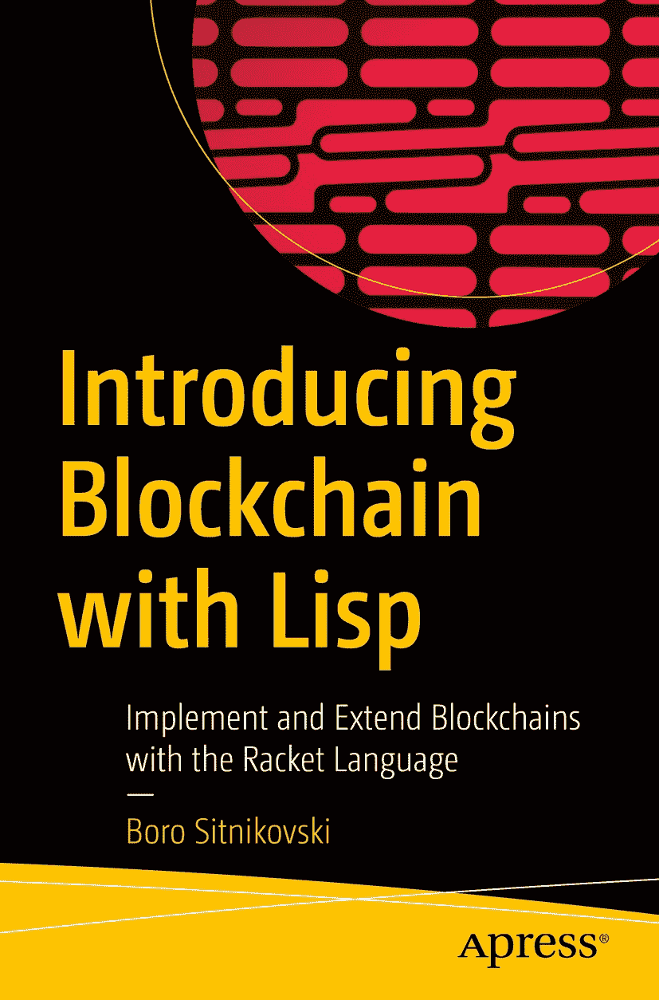

ISBN 978-1-4842-6968-8  
e-ISBN 978-1-4842-6969-5  
[`doi.org/10.1007/978-1-4842-6969-5`](https://doi.org/10.1007/978-1-4842-6969-5)

© Boro Sitnikovski 2021  
本作品受版权保护。所有权利均独家授权给出版商，涉及材料的全部或部分内容，特别是翻译、重印、再利用插图、朗诵、广播、微缩胶片复制或任何其他物理形式的复制权，以及信息存储与检索的传输权、电子改编、计算机软件或现在已知或未来开发的类似或不同方法的使用权。除非另有明确声明，否则本出版物中使用的通用描述性名称、注册商标名称、商标、服务标记等并不表示这些名称不受相关保护性法律和法规的约束，因此可自由用于一般用途。出版商、作者和编辑假定本书中的建议和信息在出版之日是真实准确的。出版商、作者或编辑均不对本书所含材料或可能存在的任何错误或遗漏提供明示或暗示的担保。出版商对所发表地图中的管辖权主张和机构隶属关系保持中立。本书通过 Apress Media, LLC（位于美国纽约州纽约市纽约广场 1 号，邮编 10004）向全球书商发行。电话：1-800-SPRINGER，传真：(201) 348-4505，电子邮件：`orders-ny@springer-sbm.com`，或访问`www.springeronline.com`。Apress Media, LLC 是加利福尼亚州的一家有限责任公司，其唯一成员（所有者）是 Springer Science + Business Media Finance Inc (SSBM Finance Inc)。SSBM Finance Inc 是一家特拉华州的公司。

