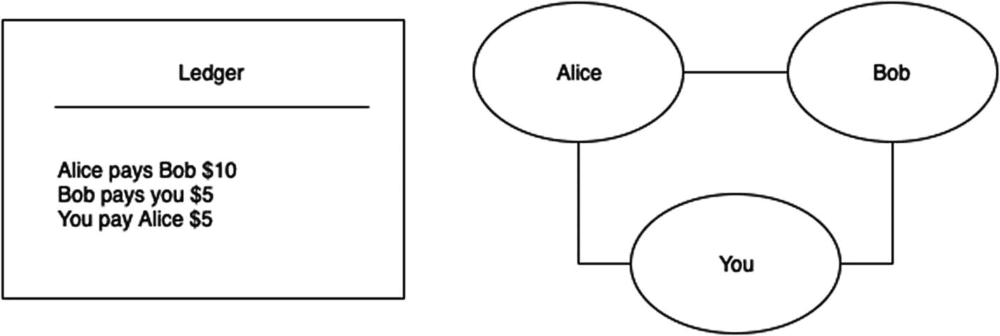
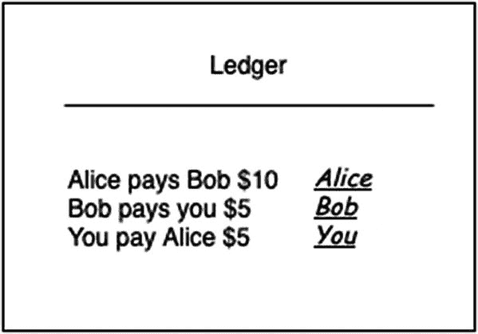
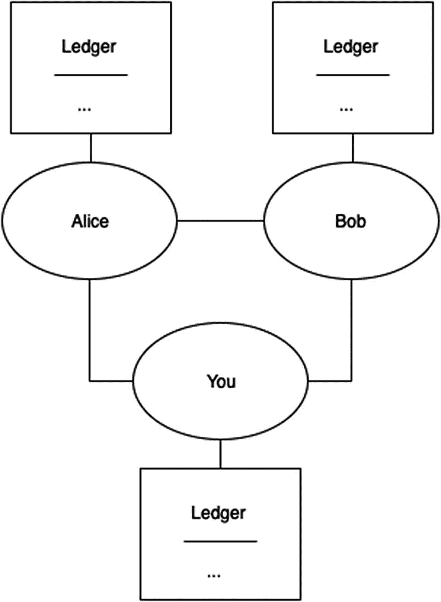
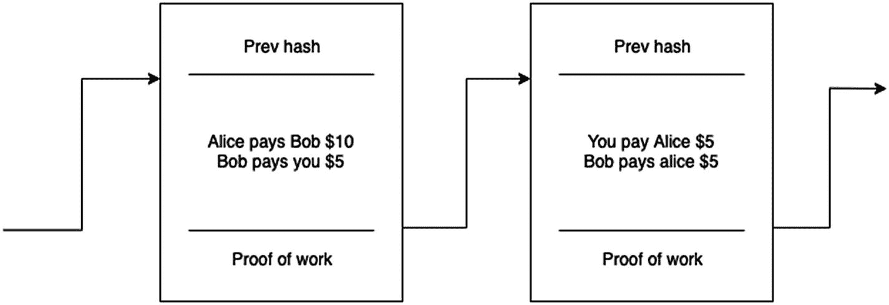
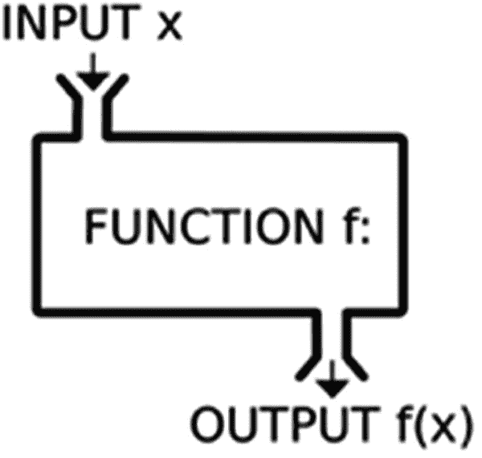
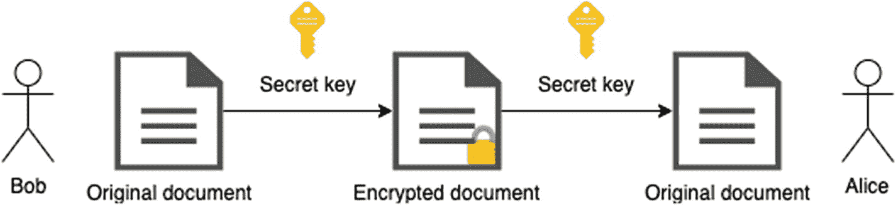
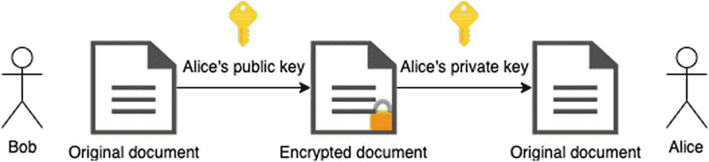

# 动机与基本定义

假设你和你的朋友经常互相转账，比如在支付餐费或酒水时。如果每次都交换现金，会很不方便。

一个可行的解决方案是记录下你和朋友们所有的账单。这被称为*账本*，如图 1-1 所示。



图 1-1

一个账本和一组相互关联的朋友（对等节点）

 定义 1-2

**账本**是一本包含交易记录的账簿。

此外，在每天结束时，你们会聚在一起，参照账本进行计算以结清账目。假设有一个资金池，所有钱都存放在那里。如果你花的钱比收到的多，你就往池子里存钱；否则，你就从池子里取钱。

我们希望设计一个功能类似于普通银行账户的系统。钱包（银行账户）的持有者只能将资金从自己的钱包发送到其他钱包。因此，系统中的每个人都会有一个“钱包”，它也可以用来确定他们的余额。请注意，在目前使用账本的设置下，我们必须查阅所有现有记录才能确定特定钱包的余额。

如果我们想避免查阅所有现有记录，有一种优化方法，即使用*未花费的交易输出*（UTXO），我们将在第 3.5 节中看到这一点。

可能会出现的另一个问题是所谓的*双重支付*问题，即 Bob 可以尝试同时将他所有的钱发送给 Alice 和你。这实际上会使他发送的金额翻倍，超过他实际拥有的金额。有多种方法可以解决这个问题，我们将提供的解决方案是对输入总额和输出总额（UTXO）进行一次简单的检查。

这类系统可能出现的另一个问题是任何人都可以添加交易。例如，Bob 可以添加一笔交易，声称 Alice 付给他几美元，而并未征得 Alice 的同意。我们需要重新思考我们的系统，使得每笔交易都得到验证/签名。

 定义 1-3

**数字签名**是一种验证数字消息和文档真实性的方法。

为了对交易进行签名和验证，我们将依赖数字签名（图 1-2）。目前，我们假设任何向账本添加信息的人也会为每条记录添加签名，其他人无法修改签名，但可以验证它。我们将在第 1.2 节中介绍技术细节。



图 1-2

现在我们的账本包含了签名

现在假设由 Bob 独自保管账本，并且大家都同意这一点。此时账本存储在一个所谓的*中心化场所*。如果 Bob 在大家聚在一起结账的当天结束时无法到场，那么就没有人能够查阅账本。

我们需要找到一种方法来*去中心化*账本，这样在任何时候，任何人都可以进行交易。为此，每个参与者都会自己保留一份账本副本，并且在一天结束时碰头同步各自的账本。

你与你的朋友相连，他们也同样与你相连。不严格地说，这就构成了一个对等网络。

 定义 1-4

**对等网络**由两台或多台相互连接的计算机组成。

例如，当你使用浏览器访问互联网上的网页时，你的浏览器是“客户端”，而你访问的网页托管在“服务器”上。这代表了一个中心化系统，因为每个用户都从一个单一的地方——即“服务器”——获取信息。

相比之下，在对等网络（它代表一个去中心化系统）中，“客户端”和“服务器”之间的区别变得模糊。每个对等节点同时既是“客户端”又是“服务器”。



图 1-3

一个去中心化的账本

在去中心化系统（见图 1-3）中，随着对等节点（人员）列表的增长，我们可能会遇到*信任*问题。当大家在一天结束时聚在一起同步账本时，他们怎么能相信其他人账本中列出的交易是真实的？即使每个人都信任其他人的账本，但如果有一个新人想要加入这个网络呢？现有用户自然会要求这个新人证明自己值得信任。我们需要修改我们的系统以支持这种信任。实现这一点的一种方法是通过*工作量证明*，我们接下来将介绍它。

 定义 1-5

**工作量证明**是一种计算耗时、但便于他人验证的数据。

对于每条记录，我们还将包含一个特殊的数字（或称哈希值），它将代表*工作量证明*，用于提供该交易是有效的证据。我们将在第 1.3 节中介绍技术细节。

在一天结束时，我们约定信任那个在其账本中投入最多工作量的人的账本。如果 Bob 有一些杂事要处理，他可以在第二天通过信任网络中的其他对等节点来赶上进度。

除此之外，我们还希望交易具有顺序，因此每条记录还将包含一个指向前一条记录的链接。这代表了真正的区块链，如图 1-4 所示。



图 1-4

一个由区块组成的链条，恰如其分地称为区块链

如果大家都同意将此账本作为事实的权威来源，那么就完全无需交换实物货币了。每个人都可以直接使用这个账本存入或取出资金。

为了理解数字签名和工作量证明的技术细节，我们将分别研究加密和哈希。幸运的是，我们将要使用的编程语言内置了加密和哈希的功能。我们不必深究哈希、加密和解密是如何工作的，因为基本的理解就足够了。

请注意，我们是如何从一个简单的账本定义开始，然后逐步构建出一个复杂的系统。我们在编程中也将采用同样的方法。

## 加密

我们将从定义加密和解密开始。

 定义 1-6

**加密**是一种对值进行编码的方法，使得只有授权人员才能查看原始内容。**解密**是一种对加密值进行解码的方法。

请注意，在本节中我们将主要讨论数字，但字符和字母也可以使用相同的方法，通过使用字符的 ASCII^(²) 值来进行加密/解密。

在讨论加密之前，我们首先需要回顾一下*函数*是什么，因为编码/解码值是通过使用函数来实现的。


### 1.2.1 函数

图 1-5 展示了函数的可视化表示。输入值进入函数，并产生一个输出值。



图 1-5 — 一个函数

 定义 1-7

**函数** 是将给定输入映射到唯一输出的数学实体。

例如，你可能会有一个函数，它接受一个人作为输入，然后返回这个人的年龄或姓名作为输出。另一个例子是函数 `f(x) = x + 1`。这个函数可以接受许多输入：1、2 和 3.14。例如，当我们输入 2 时，它给出的输出是 3，因为 `f(2) = 2 + 1 = 3`。

理解函数的一个简单方法是将其视为表格。对于一个接受单个参数 *x* 的函数 `f(x)`，我们有一个两列的表格，第一列是输入，第二列是输出。对于一个接受两个参数 *x* 和 *y* 的函数 `f(x, y)`，我们有一个三列的表格，其中第一列和第二列代表输入，第三列是输出。因此，将上面讨论的函数以表格形式展示出来，会是这样：

| **x** | ***f*(*x*)** |
| --- | --- |
| 1 | 2 |
| 2 | 3 |
| … | … |

### 1.2.2 对称密钥算法

我们可以假设存在函数 `E(x)` 和 `D(x)`，分别用于加密和解密。我们希望这些函数具有以下特性：

*   `E(x) ≠ x`，这意味着加密后的值不应与原始值相同。
*   `E(x) ≠ D(x)`，这意味着加密和解密函数会产生不同的值。
*   `D(E(x)) = x`，这意味着加密值的解密应返回原始值。

例如，假设存在某种加密方案，比如 `E("Boro") = 426f726f`。我们可以“安全地”传递值 `426f726f`，而不会暴露我们的原始值，并且只有知道解密方案 `D(x)` 的人才能看到 `D(426f726f) = "Boro"`。

加密方案的另一个例子是让 `E(x)` 将 *x* 中的每个字符向后移动，而 `D(x)` 则将 *x* 中的每个字符向前移动。这种方案被称为*凯撒密码*。要加密文本 `"abc"`，我们有 `E("abc") = "bcd"`，要解密它，我们有 `D("bcd") = "abc"`。

然而，这种方案构成了一个*对称算法*，如图 1-6 所示，这意味着我们必须与相关方共享函数 `E` 和 `D`。这使得它容易受到攻击。



图 1-6 — 对称密钥算法

### 1.2.3 非对称密钥算法

为了解决对称密钥算法带来的问题，我们将使用所谓的*非对称算法*或*公钥密码学*（图 1-7）。在这种方案中，我们有两种密钥：公钥和私钥。我们将公钥分享给世界，并将私钥留给自己。

该算法方案有一个巧妙的特性：只有私钥可以解密消息，只有公钥可以加密消息。

我们有两个函数，它们应具有与对称密钥算法相同的特性：

*   `E(x, p)` 使用公钥 *p* 加密消息 *x*。
*   `D(x', s)` 使用私钥 *s* 解密已加密的消息 *x'*。



图 1-7 — 非对称密钥算法

在我们的例子中，我们将依赖模运算。回忆一下高中知识，*a* mod *b* 表示 *a* 除以 *b* 的余数。例如，`4 mod 2 = 0`，因为 4 除以 2 没有余数，而 `5 mod 2 = 1`。

以下是一个基于加法和模运算的基本加密算法的例子：

1.  选择一个随机数，例如 100。这代表一个公共的可公开密钥。
2.  在 (1, 100) 范围内再选一个随机数，例如 97。这将代表私钥 *s*。
3.  公钥 *p* 通过从公共密钥中减去私钥得到：`100 - 97 = 3`。
4.  要加密数据，将其加上公钥，然后取模 100。`E(x, p) = (x + p) mod 100`。
5.  要解密数据，我们使用相同的逻辑，但使用我们的私钥，所以 `D(x', s) = (x' + s) mod 100`。

例如，假设我们要加密 5。那么 `E(5, 3) = (5 + 3) mod 100 = 8`。要解密 8，我们有 `D(8, 97) = (8 + 97) mod 100 = 105 mod 100 = 5`。

这个例子使用了一个非常简单的生成对：`(x + y) mod c`。但实际上，密钥对的生成算法要复杂得多，攻击者也更难破解。毕竟，算法计算的复杂性才是使其难以被攻破的关键。

我们可以使用类似的算法进行数字签名：

*   `S(x, s)` 使用私钥 *s* 对消息 *x* 进行签名（加密）。
*   `V(x', sig, p)` 使用签名 `sig` 和公钥 *p* 验证已签名的消息 *x'*（解密）。

正如我们之前所说，每条记录还将包含一个特殊的数字（或哈希）。这个哈希就是由 `S(x, s)`（加密）产生的，并且可以通过使用验证函数来确认记录的所有权（解密）。

钱包将包含一对公私钥。这些密钥将用于收款或发送货币。使用私钥，可以向区块链写入新的区块（或交易），从而有效地花费货币。使用公钥，其他人可以将其用于向该钱包发送货币并验证签名。

 练习 1-1

设计一个函数表，使其满足：

1.  输入是一个数字，输出是一个数字。
2.  输入是一个数字，输出是该数字对应的公司员工姓名。

 **练习 1-2**

检查对称密钥算法的三个属性，以确保凯撒密码与它们兼容。

 **练习 1-3**

基于数学替换，设计一个加密方案。

 **练习 1-4**

使用我们定义的非对称密钥算法来签名一条消息并验证它。

**提示**：这类似于我们展示的加密/解密示例。


## 1.3 哈希


**定义 1-8**

`哈希`是一种单向函数，它能够对文本进行编码，但无法通过编码结果还原原始值。

哈希比之前描述的加密方案更简单。哈希函数的一个例子是返回字符长度——`H`("abc") = 3，但`H`("bcd") 也等于 3。这意味着，除了使用返回值 3 之外，我们无法还原原始值。

正如我们之前提到的，使用这种技术的原因在于它拥有一些有趣的特性，例如能够为我们提供工作量证明。


**定义 1-9**

`挖矿`是验证交易的过程。成功挖矿的矿工会因此获得货币作为奖励。

`Hashcash` 是一种工作量证明系统^(³)，我们将用它来实现挖矿。我们将在后续章节实现该算法时，详细了解其工作原理。

哈希函数还有另一个有用的特性：它允许我们将两个或多个不同的区块连接起来，方法是在每个区块中包含当前区块的哈希值（`当前哈希`）和前一个区块的哈希值（`前一个哈希`）。例如，`block-1` 的哈希可能是 123456，而 `block-2` 的哈希可能是 345678。那么，`block-2` 的 `前一个哈希` 就会是 `block-1` 的 `当前哈希`，即 123456。这样，我们就将这两个区块连接起来，实际上创建了一个包含交易账本区块的链表。这种连接关系如图 1-4 所示。

区块的哈希值基于区块本身的数据，因此要验证一个哈希值，我们只需对区块数据进行哈希运算，然后将其与`当前哈希`进行比较即可。

两个或多个相连的区块（或交易）构成一个区块链。区块链的有效性取决于每笔交易的有效性。


**练习 1-5**

设计你自己的哈希函数。


**练习 1-6**

图 1-4 中描述的链表如何遍历？这种特性有什么意义？

## 1.4 智能合约


**定义 1-10**

`智能合约`是一种自执行合约，其中买方和卖方之间协议的条件直接由代码行表达。

如果交易条件本身可以由用户编程，那么区块链就是可编程的。例如，用户（不一定是程序员）可以编写一个脚本，在汇款前添加必须满足的要求。它可能看起来像这样：

```
1   if (用户拥有超过 10 货币)
2      then 批准交易
3      else 拒绝交易
```

智能合约作为在区块链上执行的计算来实现。我们将在后续章节中实现智能合约的非常基础的功能。

## 1.5 比特币

比特币是世界上第一个区块链实现。2008 年 11 月，中本聪撰写的题为“比特币：一种点对点电子现金系统”的论文在密码学邮件列表中发布。比特币的白皮书共九页，但主要是对设计的理论解释，因此对于新手来说可能有点难以理解。

比特币软件是开源代码，于 2009 年 1 月在 SourceForge 上发布。比特币的设计包括去中心化网络（点对点网络）、区块（`挖矿`）、区块链、交易和钱包，本书将详细介绍每一项。

尽管存在许多区块链模型，且每个模型在实现细节上各有不同，但我们在本书中将要构建的区块链将与比特币非常相似，只是部分内容进行了简化。

## 1.6 工作流程示例

我们将列出系统将要使用的几个重要工作流程。

*挖矿*（即创建新区块）使用 `Hashcash` 计算区块的 `当前哈希`。它还包含 `前一个哈希`，这是对区块链中前一个区块的链接。

*检查 A 的钱包余额*首先会筛选区块链中的所有区块（发送方 = A 或接收方 = A），然后将它们汇总以计算余额。随着区块链的增长，此操作所需的时间也会增加。为此，我们将使用未花费交易输出（UTXO）模型。该模型是一个交易列表，包含有关所有者和货币金额的信息。因此，每笔交易都将消耗此列表中的元素。

*向区块链添加区块*包括将货币从 A 发送到 B。一个前提是 A 有足够的货币。我们使用钱包余额工作流程来检查这一点。然后，我们创建一笔交易（发送方 = A，接收方 = B）并对其进行签名。接着，我们使用这笔交易挖掘一个区块，并使用奖励更新 UTXO。

## 1.7 总结

本章的目的是提供我们将要实现的系统的大致概念。在实现章节（第 3 章）中，一切都会变得更加清晰，那时我们必须明确定义每个组件。

以下是本章所学内容的简要总结：

*   系统的核心组件是区块。
*   一个区块包含（除其他数据外）交易。
*   我们有一个账本，它是所有有效区块的有序列表（即区块链）。
*   每个涉及账本的参与者都有一个钱包。
*   账本中的每条记录都由所有者签名，并且可以由公众验证（数字签名）。
*   账本位于去中心化的位置，即每个人都有一个副本。
*   信任基于工作量证明（挖矿）。

脚注 1 2 3

