# 2. Racket 编程语言


*结构，作者：D. Bozhinovski*

既然我们已经粗略解释了什么是区块链以及它的用途，那么下一步很自然的就是在计算机上实现这些计算，以便它们能自动执行。在本章中，我们将介绍一种工具，它将使我们能够精确地实现这些计算。


## 2.1 Lisp 简介

`Lisp` 语言源于 1958 年，代表 *列表处理*，是一个编程语言家族。与标准编程语言不同，它采用完全括号化的前缀表示法。例如，不写成 `1 + 2`，而是写成 `(+ 1 2)`。

在 `Lisp` 家族中有许多 `Lisp` 实现。其中一种实现是 `Racket`，本书将使用它，因为该实现对于入门级程序员来说特别容易上手。这种语言被用于多种场景，例如研究、计算机科学教育和通用编程。它也曾用于商业项目。一个著名的例子是 Hacker News^(⁴) 网站，该网站运行于 `Arc` 之上，而 `Arc` 是一种用 `Racket` 开发的编程语言。

`Lisp` 的实现以其简洁性而闻名。由于这种简洁性，在 `Lisp` 中构建区块链（或任何东西）意味着你可以轻松地在大多数其他编程语言中完成同样的工作。`Lisp` 语言倾向于函数组合——将两个函数链接在一起——例如，给定 *f*(*x*) 和 *g*(*x*)，一种组合是 *f*(*g*(*x*))。在本书后续内容中，我们将看到组合所带来的有趣特性，以及我们如何轻松地维护和扩展代码。

### 2.1.1 数据结构与递归

在 `Lisp` 中有三个重要的概念：

-   *原语* 或公理（起点或构建块）。例如，数字 1、2 等等，是我们无需自行实现的内容，因为它们已包含在编程语言中。另一个例子是对数字的操作，例如 `+` 和 `*`。
-   *组合* 或组合原语以执行复杂计算的方法。例如，我们可以按如下方式组合 `+` 和 `*`：`1 + (2 * 3)` 或使用前缀（`Lisp`）表示法：`(+ 1 (* 2 3))`。
-   *抽象* 或捕获原语的组合。例如，如果我们发现自己反复进行某项计算，那么将其捕获（抽象或封装）到一个易于重用的函数中会是个好主意。

我们在本书中会反复依赖这些概念，因为它们使我们能够构建复杂的结构。

 定义 2-1

**数据结构** 是一个值的集合、它们之间的关系，以及可应用于这些值的函数或操作。

数据结构的一个例子是数字及其加法和乘法函数。

从上一章的动机中，我们可以看到形成这样一个数据结构的必要性，例如，一个区块就是一个包含哈希值、所有者和交易金额的结构。

存在许多数据结构。有序列表就是一个例子，它按顺序表示数字（1、2、3）。此外，还有针对列表的各种操作，例如计算元素数量、合并两个列表等等。

我们在之前的列表示例中使用了数字 1、2 和 3——这些元素是*原语*。一个列表及其相关操作代表了一个*抽象*。将多个列表操作链接在一起则代表了*组合*。

现在我们已经可以转换某些数据结构（通过对其应用操作），能够根据某些特定规则重复转换一个数据结构将会很有用。例如，如果我们有一个区块链数据结构，我们可能想出一种方法来转换它，例如，在其中插入一个新块。这可能需要对同一个操作应用多次。

 定义 2-2

在数学和计算机科学中，当函数可以由以下两个属性定义时，它们表现出**递归**行为：

1.  一个简单的基准情形（或多个情形）——一个终止情形，该情形返回一个值而不使用递归
2.  一个（或多个）规则，能够逐步简化至基准情形

递归函数最常见的例子是阶乘函数，其定义如下：

```
fact(n) = { 1, 如果 n = 0; n * fact(n-1), 其他情况 }
```

例如，通过代入法我们可以看到 `fact(3)` 求值为 3 ⋅ `fact(2)`，即 3 ⋅ 2 ⋅ `fact(1)`，最终为 3 ⋅ 2 ⋅ 1 ⋅ `fact(0)`，结果就是 6。

我们刚才讨论的递归将同一个操作应用了多次，这引出了下一个定义。

 定义 2-3

**树** 是一种层次化的递归数据结构，它可以有两种可能的值：

1.  空值
2.  一个单一值，并附带有另外两个子树

家谱是树的一个例子。树的另一个例子是二叉树，其中左子树的值小于当前节点的值，右子树的值大于当前节点的值：

```
1     2
2    / \
3   1   3
```

树在 `Lisp` 语言中很重要，因为它们被用来表示程序的结构。我们将在下一节中对此进行更多讨论。


### 2.1.2 语言与语法

在本节中，我们将快速了解 Lisp 的基础知识，这将为你提供一个有关 Lisp 背后思想的高层次概述。

 定义 2-4

一种**语言**包含：

1.  符号，可以组合成句子
2.  语法，它是一组规则，告诉我们哪些句子是结构良好的

这个关于语言的定义同样体现在编程语言中，编程语言拥有一种特殊的语法结构。例如，C 编程语言就有特殊的语法——你在编写程序语句时必须遵循特定的规则。

 定义 2-5

**抽象语法树** 是用于呈现用编程语言编写的源代码的抽象语法结构的树状表示。

当你用编程语言编写程序时，会有一个中间步骤来解析程序的源代码并派生出抽象语法树。

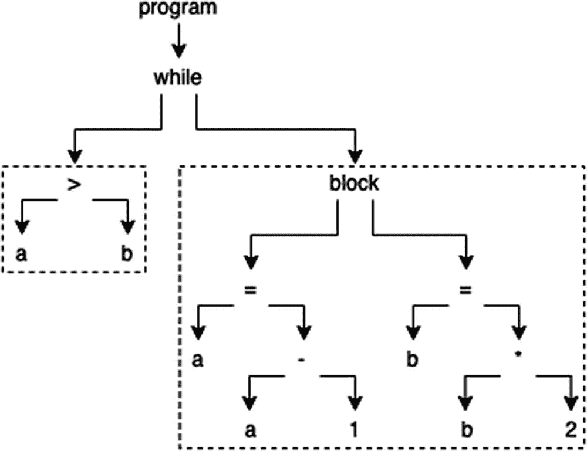

图 2-1

示例 1：抽象语法树

例如，图 2-1 中的图片展示了以下伪代码的抽象语法树：

```
1   while (a > b) {
2       a = a - 1;
3       b = b * 2;
4   }
```

另一个例子，图 2-2 中的图片展示了以下伪代码：

```
1   if (a == b && b == c) {
2       a = a - 1;
3       b = b * 2;
4   } else a = a * b * 2;
```

理解这些代码的功能并不重要，重要的是要理解这类程序在编程语言内部是如何表示的。

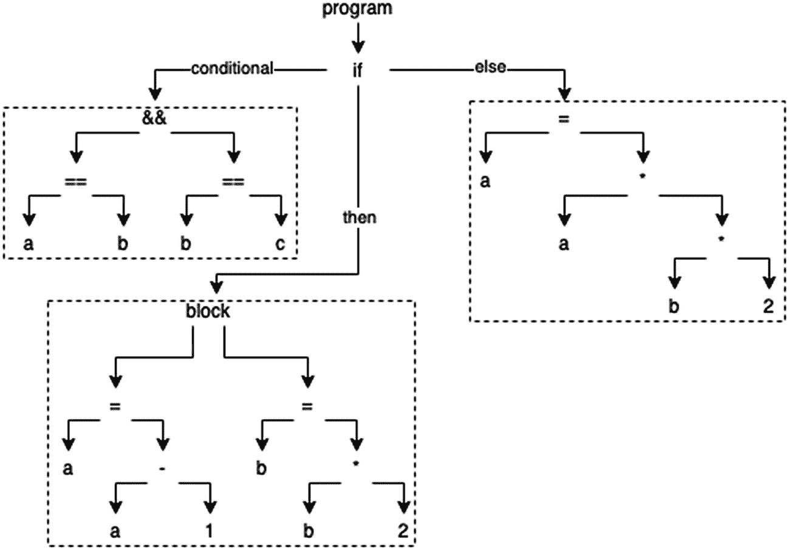

图 2-2

示例 2：抽象语法树

Lisp 并不像 C 那样受限于特殊的语法。我们编写的代码本身就是实际的抽象语法树。这就是 Lisp 依赖前缀表示法的原因。我们会看到 Lisp 是如何基于极简主义设计的，因为我们不会遇到其他许多语言那种具有特殊语法、有时甚至功能重叠所带来的额外负担。

 定义 2-6

Lisp 中的语法元素是符号**表达式**，或 S-表达式。一个 S-表达式可以是以下之一：

1.  一个符号（一串字符）
2.  一个由 S-表达式组成的结构良好的列表（括号匹配）

例如，`hello` 是一个合法的 S-表达式，`(hello there)` 也是一个合法的 S-表达式。但 `(hello(` 不是一个合法的 S-表达式，因为括号不匹配。在构建 S-表达式时，空格很重要。注意，`h ello` 不同于 `hello`。

一个 S-表达式当且仅当其抽象语法树是平衡的时，才是结构良好的。

与其他语言相比，语法在 Lisp 中有特殊的含义。借助作为核心语言一部分的宏，可以扩展这种语法^(⁵)。S-表达式构成了 Lisp 的语法。

 练习 2-1

我们曾将数值和加号函数视为一种数据结构。试想一下另一种数据结构。

 练习 2-2

给定以下定义，计算 `sum(3)`，`sum(5)` 和 `sum(1)` 的值：

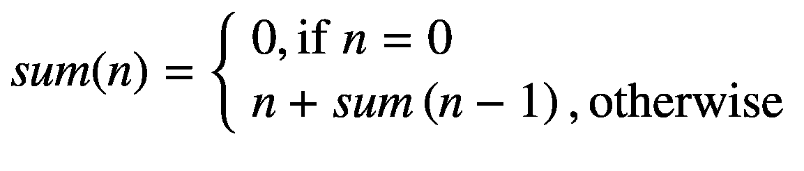

那 `sum(−1)` 呢？

 练习 2-3

以下哪些 S-表达式是合法的？

1. `hello`
2. `123`
3. `(hello 123)`
4. `(hello (123)`
5. `(+ 1 (* 2 3))`
6. `(+ (* 3 2) (/ 6 2))`

**提示**：为每个表达式绘制抽象语法树，可能会更清楚地看出哪个表达式合法，哪个不合法。

## 2.2 配置与安装

Racket 可通过 [`https://download.racket-lang.org`](https://download.racket-lang.org/) 下载并安装。它提供了适用于 Windows、Linux 和 Mac 的二进制文件。本书撰写时使用的是 Racket 版本 7，但其他版本可能也能正常使用。下载并安装完整软件包后，我们就可以运行 DrRacket。如果出现如图 2-3 所示的界面，那么恭喜你！这意味着安装成功。

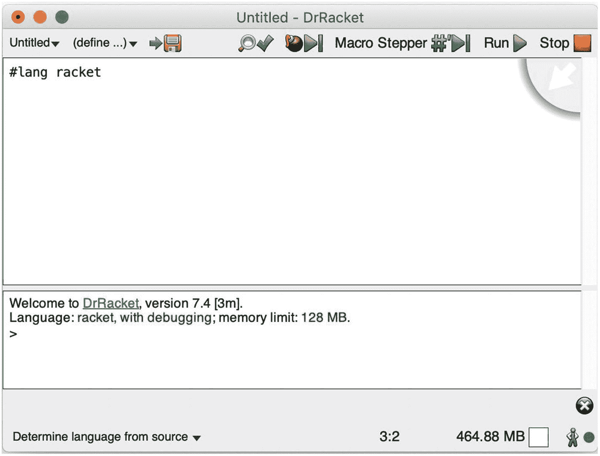

图 2-3

DrRacket

屏幕上方的文本区域是定义区，我们通常在这里编写定义。而下方则是交互区，我们在这里与定义进行交互。

**帮助台**（Help Desk）位于顶部菜单的 `Help > Help Desk` 下，其中包含快速介绍、参考手册和示例等有用信息。

使用 Racket 主要有两种方式：

*   使用图形用户界面（GUI），这是推荐的方式，也是本书通篇采用的方式
*   使用命令行工具（`racket` 是解释器/编译器，`raco` 是包管理器），这适用于高级用户


## 2.3 Racket 简介

Lisp 新手注意到的第一件事就是 Lisp 程序中有太多括号了。确实如此，但这直接源于我们正在用一种没有特殊语法规则的语言编写抽象语法树。

随着本书的深入学习，我们将体会到由此带来的强大表达能力。例如，一个优势是不需要特殊的运算顺序。在中学时，我们必须记住 `*` 和 `/` 要先于 `+` 和 `-` 求值。而在 Lisp 中则没有这种情况，因为求值顺序由我们编写程序的方式一目了然。

让我们来看表达式 `(+ 1 (* 2 3))`。正如我们提到的，空白字符是 S 表达式的重要组成部分，因此 `(+1 (* 2 3))` 与 `(+ 1 (* 2 3))` 是不同的。为了在脑海中将其转换为更熟悉的表示法，我们可以交换运算符，使其变成*中缀*表示法而非*前缀*表示法：`(+ 1 (* 2 3))` 等价于 `(1 + (2 * 3))`。现在我们看到这个表达式的值是 7。

接下来，让我们在 DrRacket 编辑器的交互区（下方文本区域）中输入这个表达式，然后按回车键：

```
1   > (+ 1 (* 2 3))
2   7
```

`>` 符号表示其后的命令需要在交互区中输入。

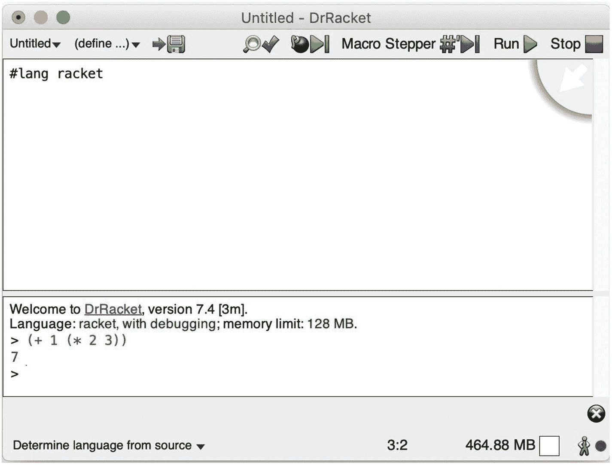

图 2-4

DrRacket 第一次计算

我们得到结果 7，如图 2-4 所示。我们在 Racket 中完成了第一次计算。

完成一次求值后，DrRacket 会再次等待新的命令。这是因为在交互区中，我们处于 REPL 模式，即读取-求值-打印-循环模式。也就是说，交互区会读取我们书写的内容，尝试对其进行求值（得出结果），打印结果，然后循环回到读取状态。

Lisp 的求值与数学中的替换非常相似。例如，`(+ 1 (* 2 3))` 的一种求值方式如下：

1.  `(+ 1 (* 2 3))`

2.  `(+ 1 6)`

3.  `7`

也就是说，在每一步中，我们都对表达式进行规约，直到无法进一步规约为止。我们立刻就能注意到替换作为一个概念有多么强大。

### 2.3.1 基本类型

在上述求值中，我们得到了一个数字作为结果——值 7 的类型是数字。虽然 Racket 中的值类型是隐式的，但我们仍然有办法检查值的类型，稍后我们将借助谓词来了解这一点。

Racket 有一些基本（内置）类型，例如：

-   符号，如 `hello, world`
-   列表，如 `(1, 2, 3)`
-   函数，如 `f(x) = x + 1`
-   数字，如 `1, 2, 3.14`
-   布尔值，如 `#t`（表示真）和 `#f`（表示假）
-   字符或单个字母：`#\A, #\B, #\C`
-   字符串或字符列表：`"Hello", "World"`
-   字节：根据 ASCII 码，我们可以用数字表示字符（例如 `72` 代表 `H`）
-   字节串，作为字节的列表：`#"Hello", #"World"`

```
1   > 123
2   123
3   > #t
4   #t
5   > #f
6   #f
7   > #\A
8   #\A
9   > "Hello  World"
10   "Hello World"
11   > (bytes 72 101 108 108 111)
12   #"Hello"
```

每个求值结果都附带一个特定的类型：

1.  第一个求值结果（`123`）的类型是数字。
2.  第二个（`#t`）和第三个（`#f`）求值结果的类型是布尔值。
3.  第四个求值结果（`#\A`）的类型是字符。
4.  第五个求值结果（`"Hello World"`）的类型是字符串。
5.  第六个求值结果（`(bytes 72 101 108 108 111)`）的类型是字节串，并且使用了 ASCII 表来表示字母。

我们将在后续章节中讨论符号、列表和函数。

### 2.3.2 列表、求值和引号

为了生成有序列表 `(1, 2, 3)`，我们可以让 DrRacket 在交互区中求值 `(list 1 2 3)`：

```
1   > (list 1 2 3)
2   '(1 2 3)
```

`list` 是一个内置函数，就像我们已经用过的 `+` 一样。`list` 接受任意数量的参数，并返回由这些参数生成的列表。返回的表达式 `'(1 2 3)` 只是一种特殊的表示法，它等价于表达式 `(quote (1 2 3))`，意思是告诉 Racket 返回实际的列表 `(1 2 3)`，而不是对其进行求值。

我们注意到括号是如何用来表示函数调用或求值的。通常，代码 `(f a_1 a_2 ... a_n)` 会按顺序向 `f` 传递 `n` 个参数进行函数调用。例如，对于函数 `f(x) = x + 1`，一个求值示例是 `f(1)`，我们写成 `(f 1)`，返回值为 2。

注意，`(list 1 2 3)` 返回了 `'(1 2 3)` 作为结果。让我们试着理解这里发生了什么。如果 `(list 1 2 3)` 返回了 `(1 2 3)`，那将毫无意义，因为（正如我们讨论过的）这种表示法会试图以 2 和 3 作为参数调用一个（不存在的）函数 1。相反，它返回了一个*被引用的*列表：`'(1 2 3)`。

为了理解这如何影响求值，让我们考虑一个例子：你对某人说以下两句话之一：

-   说出你的名字
-   说“你的名字”

在第一个例子中，你期望对方告诉你他们的名字。在第二个例子中，你期望他们说出“你的名字”这个词语，而不是他们的实际名字。

与这个例子类似，有一个名为 `quote` 的内置语法结构，我们可以将其用于任何一组符号：

```
1   > (quote hello)
2   'hello
```

这允许创建新的符号，并且对于宏的创建尤其重要。有一个特殊的列表，称为*空列表*，表示为 `(list)`，或 `(quote ())`，或简写为 `'()`。我们将在开始使用递归后理解为什么这个列表很特别。

要获取关于 `list`（或任何其他函数）的更多信息，你可以用鼠标点击该单词，然后按 F1 键。这将打开 Racket 的手册屏幕，允许你选择要了解信息的函数。通常，它是列表中的第一个匹配项。点击它应该会显示类似于图 2-5 的内容。

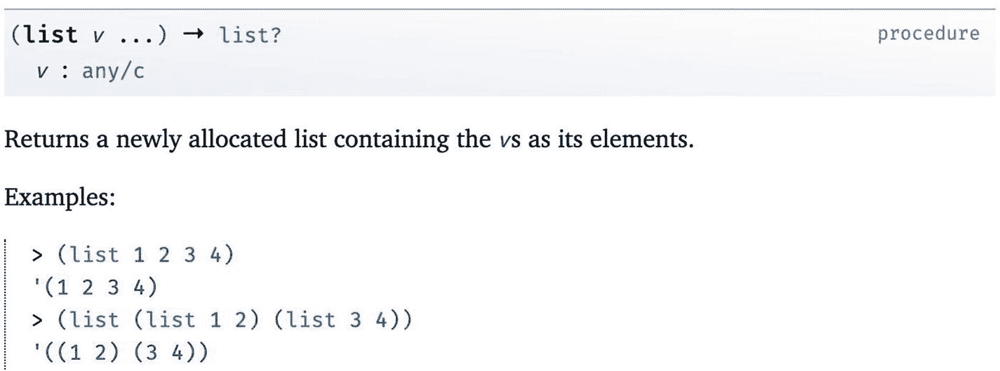

图 2-5

关于 `list` 的 Racket 手册

在 Racket 中，圆括号、方括号和花括号具有相同的效果。因此，`(list 1 2 3)` 等同于 `[list 1 2 3]` 和 `{list 1 2 3}`。这种视觉上的区别可能有助于在括号很多时对求值进行分组。

回想一下，S 表达式可以是符号或列表。由于我们在本节中讨论了求值、列表和符号，至此本书已经涵盖了构成 Lisp 核心的内容。

 练习 2-4

在 Racket 中创建一个列表，其中包含不同类型的混合元素（数字、字符串）。该列表至少应包含两个元素。

 练习 2-5

注意 `list` 是一个函数，而 `quote` 是一种语法结构。使用 F1 键阅读它们两者的手册。


### 点对

另一个内置函数是 `cons`，意为*构造*。该函数仅接受两个参数，并返回一个（引用的）对：

```
1   > (cons 1 2)
2   '(1 . 2)
```

可以将 `'(1 . 2)` 理解为包含两个数字（1 和 2）的序列。

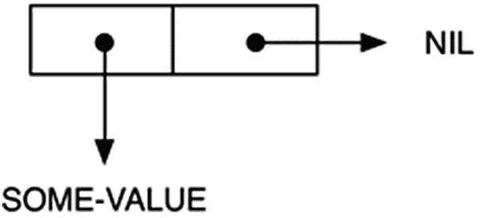

图 2-6

`(cons 'some-value 'nil)` 对

另外两个名为 `car` 和 `cdr` 的内置函数分别用于获取对的第一个和第二个元素：

```
1   > (car (cons 1 2))
2   1
3   > (cdr (cons 1 2))
4   2
5   > (car '(1 . 2))
6   1
7   > (cdr '(1 . 2))
8   2
```

注意我们在这里使用了函数组合，即在第一个例子中将 `car` 和 `cons`“组合”，在第二个例子中将 `cdr` 和 `cons`“组合”。

点对非常重要，我们可以用它们来编码任何数据结构。事实上，列表是一种特殊的点对，其中 `(list 1 2 3)` 等价于 `(cons 1 (cons 2 (cons 3 '())))`。参见图 2-7。

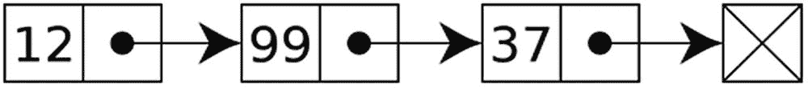

图 2-7

一个列表的示例

使用列表的动机在于，它允许我们，例如，将多个区块链接在一起以构成区块链。

Racket 也支持集合。在列表/点对中元素可以重复，但在集合中所有元素都是唯一的。此外，我们还可以对集合进行操作，例如并集（合并两个集合）、差集（移除在集合 2 中也出现的集合 1 中的元素）等。

例如，考虑以下使用了内置函数 `list->set`、`set-union` 和 `set-subtract` 的代码：

```
1   > (list->set '(1 2 3 4 4))
2   (set 1 3 2 4)
3   > '(1 2 3 4 4)
4   '(1 2 3 4 4)
5   > (set-union (list->set '(1 2 3)) (list->set '(3 4 5)))
6   (set 1 5 3 2 4)
7   > (set-subtract (list->set '(1 2 3)) (list->set '(3 4 5)))
8   (set 1 2)
```

我们注意到在 Lisp 中，仅依赖于少数几个原始概念（函数调用、点对和引号），就能实现抽象。我们将在第 2.3.13 节中进一步讨论这一点。

 练习 2-6

使用 `cons` 表示你在练习 2-4 中创建的同一个列表。

 练习 2-7

对练习 2-6 中的列表组合使用 `car` 和 `cdr`，以获取该列表中的第二个元素。

### 添加定义

到目前为止，我们只在 DrRacket 的交互区域中工作。让我们尝试在定义区域中做一些有用的事情。

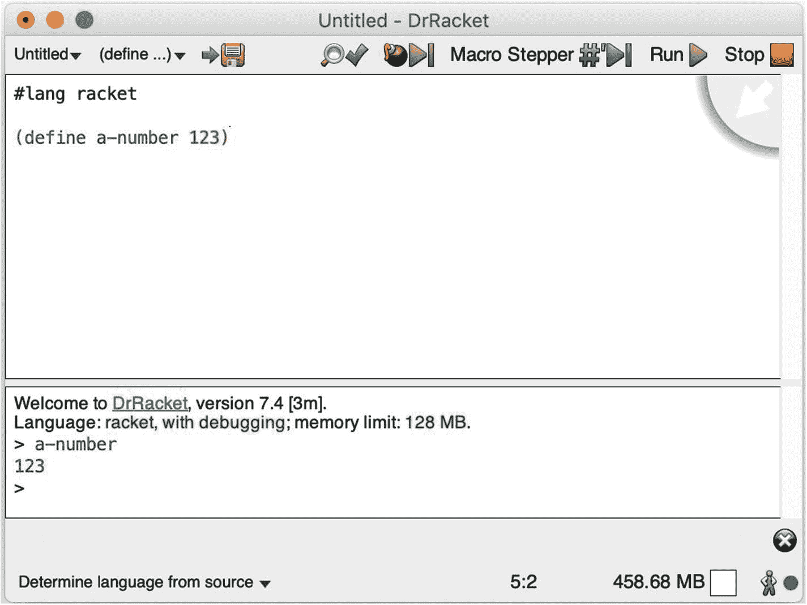

图 2-8

在 DrRacket 中添加定义

我们可以从图 2-8 的截图中注意到几件事：

*   在定义区域中，我们添加了一些代码。我们注意到使用了另一个名为 `define` 的内置语法，将一个值（`123`）绑定到一个符号/变量（`a-number`）上。

*   在交互区域中，我们与定义区域中已经定义的内容进行了交互。在这个例子中，交互就是通过引用其符号来显示定义的数值。

在本书中，每个 Racket 程序都会以 `#lang racket` 开头。这意味着我们将使用 Racket 的常规语法。这个指令可以接受不同的值；例如，我们可以使用专门用于绘制图形的语言，但这超出了本书的范围。

我们在定义区域中编写的所有内容也可以写在交互区域中，反之亦然。要使定义在交互区域中可用，我们需要通过顶部菜单选择 `Racket > 运行` 来运行程序。注意，当我们运行程序时，交互区域会被清空。

如果我们的定义引用了其他定义，我们可以用鼠标悬停在符号名称上，DrRacket 会画出一条指向该引用定义的线条（图 2-9）。对于大型复杂的程序，这有助于揭示函数的具体细节。

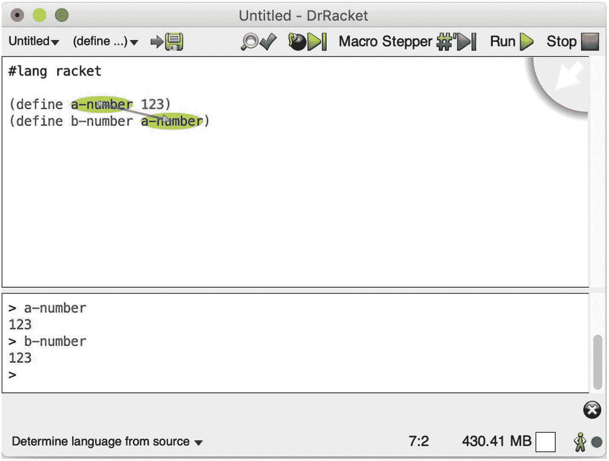

图 2-9

在 DrRacket 中跟踪引用

可以通过顶部菜单选择 `文件 > 保存定义` 将定义保存到文件中以供日后使用。

 练习 2-8

将练习 2-7 中的列表存储在定义区域中，然后在交互区域中对该列表使用 `car` 和 `cdr`。

### 过程与函数

在 Lisp 中，过程本质上是一个数学函数。当被调用时，它会返回一些数据。然而，与数学函数不同的是，某些 Lisp 表达式和过程会产生副作用。

例如，考虑两个函数：`add-1` 将数字加一，`get-current-weather` 从外部服务获取当前天气。第一个函数在任何时刻都会返回相同的值，而第二个“函数”在不同时刻可能返回不同的值。

因此，Lisp 的过程并不总是数学意义上的“纯”函数，但在实践中，它们也经常被称作“函数”（即使是那些可能有副作用的函数），以强调其总能返回一个计算结果。

基于前一段的论述，从此刻起，我们将避免使用“函数”这个词，而坚持使用“过程”。

有一个名为 `lambda` 的特殊内置语法，它接受两个参数并生成一个过程作为结果。第一个参数是该过程将接受的参数列表，第二个参数是一个表达式（体），用于对列表中的参数进行操作。

例如，`(lambda (x) (+ x 1))` 返回一个接受单个参数 `x` 的过程，当此过程被调用时，它会使参数的值加一：`(+ x 1)`。

对这个表达式求值会得到：

```
1   > (lambda (x) (+ x 1))
2   #
```

为了调用该过程，我们可以尝试传入一个参数：

```
1   > ((lambda (x) (+ x 1)) 1)
2   2
```

当然，这样编写和求值过程比较麻烦。相反，我们可以在定义区域中定义过程，然后在交互区域中与其交互：

```
1   (define add-one (lambda (x) (+ x 1)))
```

交互：

```
1   > (add-one 1)
2   2
3   > (add-one 2)
4   3
5   > (add-one (add-one 1))
6   3
```

为了简化操作，Racket 提供了用于定义过程的特殊语法，因此以下两种写法是等价的：

```
(define add-one (lambda (x) (+ x 1)))  (define (add-one x) (+ x 1))
```

过程也可以接受多个参数：

```
(define add (lambda (x y) (+ x y)))  (define (add x y) (+ x y))
```

 练习 2-9

在练习 2-7 中，你通过 `(car (cdr l))` 从列表中获取了第二个元素。定义一个过程，该过程接受一个列表并返回该列表中的第二个元素。


### 2.3.6 条件过程

有一些非常有用的内置过程，例如检查某个值是否为数字、判断一个数是否大于另一个数，等等。

```
1   > (number? 1)
2   #t
3   > (number? "hello")
4   #f
5   > (character? #\A)
6   #t
7   > (string? "hello")
8   #t
9   > (byte? 72)
10   #t
11   > (bytes? #"Hello")
12   #t
13   > (procedure? add-one)
14   #t
15   > (symbol? (quote hey))
16   #t
17   > (symbol? 1)
18   #f
19   > (> 1 2)
20   #f
21   > (= 1 2)
22   #f
23   > (= 1 1)
24   #t
```

`if` 是一种内置语法，它允许根据某个谓词的*真假值*来求值表达式。它接受三个参数：

-   待检查的条件
-   条件为真时要求值的表达式
-   条件为假时要求值的表达式

以下是使用示例：

```
1   > (if (= 1 1) "It is true" "It is not true")
2   "It is true"
3   > (if (= 1 2) "It is true" "It is not true")
4   "It is not true"
```

比 `if` 更通用的语法是 `cond`：

```
1   (cond (test-1 action-1)
2         (test-2 action-2)
3         ...
4         (test-n action-n))
```

作为可选，最后一个测试条件可以是 `else`，以便在没有其他条件匹配时执行特定的操作。

例如，下面是在定义中使用 `cond` 的一种方式：

```
1   (define (is-large x)
2     (cond ((> x 10) #t)
3           (else #f)))
```

与其交互：

```
1   > (is-large 5)
2   #f
3   > (is-large 10)
4   #f
5   > (is-large 11)
6   #t
```

正如我们所见，`=` 是一个用于检查两个数字是否相等的相等谓词。然而，它只适用于数字，如果用于其他类型会引发错误：

```
1   > (= 1 2)
2   #f
3   > (= 3.14 3.14)
4   #t
5   > (= '() '())
6   =: 合约违反
```

还有其他三个重要的相等谓词：

-   `eq?`：检查两个参数是否指向内存中的同一个对象。
-   `eqv?`：与 `eq?` 相同，但它也可以用于基本类型（例如数字、字符串）。
-   `equal?`：与 `eqv?` 相同，但它还可以用于检查参数是否具有相同的递归结构（例如列表）。

注意，在内存中只有一个空列表 `'()`，因此当检查空列表时，三个谓词都将返回相同的值。

为了展示 `eq?` 的局限性，我们将使用一个名为 `integer->char` 的内置过程，它将数字转换为字符（基于 ASCII 码）。

```
1   > (integer->char 65)
2   #\A
3   > (eq? '() '())
4   #t
5   > (eq? (integer->char 65) (integer->char 65))
6   #f
7   > (eq? '(1) '(1))
8   #f
```

正如所料，这对于空列表返回 true，但无法比较不引用相同内存位置的对象或包含元素的实际列表。

注意在这种情况下 `eqv?` 的区别：

```
1   > (eqv? '() '())
2   #t
3   > (eqv? (integer->char 65) (integer->char 65))
4   #t
5   > (eqv? '(1) '(1))
6   #f
```

最后，`equal?` 会递归地比较结构，支持列表：

```
1   > (equal? '() '())
2   #t
3   > (equal? (integer->char 65) (integer->char 65))
4   #t
5   > (equal? '(1) '(1))
6   #t
```

**练习 2-10**

我们已经使用 `cond` 语法定义了 `is-large`。请使用 `if` 语法重新实现它。

**练习 2-11**

使用 `cond` 表示以下逻辑：如果值是字符串或数字，则返回 `'foo`，否则返回 `'bar`。

### 2.3.7 递归过程

过程，就像数据结构（例如树）一样，可以是递归的。我们已经在阶乘过程的例子中看到，它通过调用自身来进行计算或循环。

例如，下面是在 Racket 中定义阶乘的方法：

```
1   (define (fact n)
2     (if (= n 0)
3         1
4         (* n (fact (- n 1)))))
```

调用它会产生以下结果：

```
1   > (fact 3)
2   6
3   > (fact 0)
4   1
```

作为一个更高级的例子，我们将定义一个计算列表长度（元素个数）的过程：

```
1   (define (list-length x)
2     (cond ((eq? x '()) 0)
3           (else (+ 1 (list-length (cdr x))))))
```

我们定义了一个名为 `list-length` 的过程，它接受单个参数 `x`，过程体包含以下条件：

1.  对于空列表，直接返回 `0`，因为空列表的长度是 `0`。
2.  否则，返回 `1` 加上 `(list-length (cdr x))` 的值。

用几个值进行测试：

```
1   > (list-length '(1 2 3))
2   3
3   > (list-length '())
4   0
5   > (list-length '(1))
6   1
```

回想一下，列表是用序对表示的：

```
1   > (car '(1 2 3))
2   1
3   > (cdr '(1 2 3))
4   '(2 3)
5   > (car (cdr '(1 2 3)))
6   2
7   > (cdr (cdr '(1 2 3)))
8   '(3)
```

换句话说，对列表应用 `cdr` 会返回移除了第一个元素后的同一列表。下面是 Racket 如何求值 `(list-length '(1 2 3))` 的过程：

```
1   (list-length '(1 2 3))
2   = (+ 1 (list-length '(2 3)))
3   = (+ 1 (+ 1 (list-length '(3))))
4   = (+ 1 (+ 1 (+ 1 (list-length '()))))
5   = (+ 1 (+ 1 (+ 1 0)))
6   = (+ 1 (+ 1 1))
7   = (+ 1 2)
8   = 3
```

我们刚刚看到了一个递归行为的例子，因为递归情况被简化为基本情况以得到结果。通过这个例子，我们可以看到递归的强大之处，以及它如何让我们以重复的方式处理值。

还有另一种编写 `list-length` 的方式：

```
1   > (define (list-length-iter x n)
2       (cond ((eq? x '()) n)
3             (else (list-length-iter (cdr x) (+ n 1)))))
4   > (list-length-iter '(1 2  3) 0)
5   3
```

它是这样求值的：

```
1   (list-length-iter '(1 2 3) 0)
2   = (list-length-iter '(2 3) 1)
3   = (list-length-iter '(3) 2)
4   = (list-length-iter  '() 3)
5   = 3
```

这两个过程都是递归的，并且产生相同的结果。然而，求值的本质却截然不同。

**定义 2-7**

递归过程可以产生一个**迭代**或**递归**的过程：

1.  递归过程是指计算的当前状态不被参数捕获，因此依赖于“延迟”求值。
2.  迭代过程是指计算的当前状态完全由参数捕获。

在前面的例子中，`list-length` 产生了一个递归过程，因为它需要先递归到基本情况，然后再回溯执行那些“延迟”的计算。相比之下，`list-length-iter` 产生了一个迭代过程，因为结果被捕获在参数中了。

这个区别很重要，因为求值的本质差异意味着一些事情。例如，迭代过程比递归过程求值更快。

相比之下，有些算法无法使用迭代过程编写，正如我们稍后将在左折叠和右折叠中看到的那样。

**练习 2-12**

我们实现 `fact` 的方式代表了一个产生递归过程的递归程序。请重新设计它，使其仍然是一个递归程序，但产生一个迭代过程。


### 2.3.8 返回过程的过程

我们可以构造出以其他过程为返回值的过程。例如：

```racket
1   > (define (f x) (lambda (y) (+ x y)))
2   > f
3   #<procedure:f>
4   > (f 1)
5   #<procedure>
6   > ((f 1) 2)
7   3
```

注意第 3 行的新语法。它表明上一行表达式的返回值是一个名为 `f` 的过程。然而，在第 4 行，当我们执行 `(f 1)` 时，得到了一个未命名过程。这是因为 lambda 是匿名函数，没有名称。

这个概念非常强大，以至于我们可以自己实现 `cons`、`car` 和 `cdr`：

```racket
1   (define (my-cons x y) (lambda (z) (if (= z 1) x y)))
2   (define (my-car z) (z 1))
3   (define (my-cdr z) (z 2))
```

求值过程如下：

```racket
1   > (my-cons 1 2)
2   #<procedure>
3   > (my-car (my-cons 1 2))
4   1
5   > (my-cdr (my-cons 1 2))
6   2
```

注意我们如何定义 `my-cons` 来返回另一个接受参数 `z` 的过程，然后根据该参数的值，返回第一个或第二个元素。

使用替换法，`(my-cons 1 2)` 求值为 `(lambda (z) (if (= z 1) x y))`。因此，这个 lambda（过程）在某种意义上“捕获”了数据。然后，当我们对该过程调用 `my-car` 或 `my-cdr` 时，只需分别传入 `1` 或 `2` 就能获得第一个或第二个值。

 **练习 2-13**

实现一个过程，使得该过程被求值时，返回一个返回常数的过程。

**提示**：`(lambda () 1)` 是一个不接受参数并返回常数 1 的过程。

### 2.3.9 通用高阶过程

通过上面的例子，我们已经看到 Racket 如何将过程作为返回值（输出）。然而，它也可以接受过程作为参数（输入）。

 **定义 2-8**

**高阶过程**接受一个或多个过程作为参数，或返回一个过程作为结果。

有三个常见的内置高阶过程：`map`、`filter` 和 `fold`。

为了进行本例示范，我们将依赖以下定义：

```racket
1   (define my-test-list '(1 2 3))
2   (define (add-one x) (+ x 1))
3   (define (gt-1 x) (> x 1))
```

`map` 接受一个单参数过程和一个列表作为输入，并返回一个新列表，其中所有成员都应用了该过程：

```racket
1   > (map (lambda (x) (+ x 1)) my-test-list)
2   '(2 3 4)
3   > (map  add-one  my-test-list)
4   '(2 3 4)
```

如果对 `(map add-one my-test-list)` 使用替换法，我们会得到 `(list (add-one 1) (add-one 2) (add-one 3))`。不过，最好自己实现这些过程以理解其工作原理。`map` 接受一个变换过程 `f` 和一个列表 `l`。我们需要处理两种情况：

- 对于空列表，直接返回空列表。
- 否则，提取第一个元素，应用变换过程，然后对剩余元素递归执行 map 操作，从而重构列表。

```racket
1   (define (my-map f l)
2     (cond ((eq? l '()) '())
3           (else (cons (f (car l)) (my-map f (cdr l))))))
```

另一个高阶过程 `filter` 接受一个单参数谓词和一个列表作为输入，并只返回列表中谓词求值为真的那些成员：

```racket
1   > (filter gt-1 my-test-list)
2   '(2 3)
```

重新实现 `filter` 时，注意它接受一个谓词 `p` 和一个列表 `l`。共有三种情况：

- 对于空列表，和之前一样，直接返回空列表。
- 否则，如果谓词匹配当前元素，则将其包含在新列表的生成中，并对剩余元素递归进行过滤。
- 否则，跳过当前元素并将其加入到列表中的步骤，仅对剩余元素递归进行过滤。

```racket
1   (define (my-filter p l)
2     (cond ((eq? l '()) '())
3           ((p (car l)) (cons (car l) (my-filter p (cdr l))))
4           (else (my-filter p (cdr l)))))
```

最后，`fold` 接受一个组合过程（接受两个参数：当前值和累加器）、一个初始值和一个列表作为输入。`fold` 返回通过该过程组合后的值。有两种类型的 fold：右折叠和左折叠，分别从右侧和左侧进行组合：

```racket
1   > (foldr cons '() '(1 2 3))
2   '(1 2 3)
3   > (foldl cons '() '(1 2 3))
4   '(3 2 1)
```

`foldr` 接受一个组合运算符（过程）`op`，以及初始值 `i` 和列表 `l`。需要处理两种情况：

- 对于空列表，返回初始值。
- 否则，将组合运算符应用于当前元素，并对列表剩余部分进行折叠操作。

```racket
1   (define (my-foldr op i l)
2     (cond ((eq? '() l) i)
3           (else (op (car l)
4                     (my-foldr op i (cdr l))))))
```

`foldl` 略有不同。我们定义一个具有两种情况的过程：

- 对于空列表，返回初始值。
- 否则，再次调用 fold，将初始值更改为与当前元素组合后的结果，并处理列表剩余部分。

```racket
1   (define (my-foldl op i l)
2     (cond ((eq? '() l) i)
3           (else (my-foldl op (op (car l) i) (cdr l)))))
```

这个过程的工作方式与 `foldr` 类似，不同之处在于结果被捕获在过程的参数中。例如，以下是 `(my-foldl + 0 '(1 2 3))` 的展开过程：

```racket
1   (my-foldl + 0 '(1 2 3))
2   = (my-foldl + 1 '(2 3))
3   = (my-foldl + 3 '(3))
4   = (my-foldl + 6 '())
5   = 6
```

注意，右折叠展示了递归过程（思考 `my-length`），而左折叠则展示了迭代过程（思考 `my-length-iter`）。

 **练习 2-14**

实现一个过程，使其调用作为参数传入的过程。

**提示**：`(... (lambda () 1))` 应返回 `1`。

 **练习 2-15**

使用 DrRacket 的追踪定义功能，跟踪 `my-map`、`my-filter`、`my-foldr` 和 `my-foldl` 的执行过程，以更好地理解它们的工作原理。

 **练习 2-16**

选择一些运算符和谓词，将它们与 `my-map`、`my-filter`、`my-foldr` 和 `my-foldl` 一起应用于列表，观察它们的求值结果。


### 2.3.10 包

 **定义 2-9**

一个**包**（`package`）在 Racket 中类似于某人为其他人使用而编写的一组定义。

例如，如果我们想使用哈希过程，我们会选择一个实现了这些功能的包并使用它。这使我们能够专注于系统设计，而不是从头开始定义一切。

包可以在[`https://pkgs.racket-lang.org`](https://pkgs.racket-lang.org/) 上浏览。它们可以通过 DrRacket 的图形界面安装。当我们尝试使用一个包时，只要它在包仓库中可用，我们就会获得安装它的选项。或者，也可以通过命令行使用 `raco pkg install <package_name>` 来安装包。我们将在后续内容中利用这些包。

为了从包中导出对象（变量、过程等），我们使用 `provide` 语法。例如，让我们创建几个过程，然后将其定义保存到一个名为 `utils.rkt` 的文件中，方法是通过顶部菜单选择 `File > Save Definitions`。

```
1   (define (sum-list l) (foldl + 0 l))
2   (define (add-one x) (+ x 1))

4   (provide sum-list)
```

我们将在与 `utils.rkt` 相同的文件夹中创建另一个名为 `test.rkt` 的文件。我们将使用 `require` 语法：

```
1   (require "utils.rkt")

3   (define (add-two x) (+ x 2))
```

现在我们可以与 `test.rkt` 进行交互：

```
1   > (sum-list '(1 2 3))
2   6
3   > (add-two 1)
4   3
5   > (add-one 1)
6   add-one: undefined;
```

请注意，`add-one` 是未定义的，因为只有我们在特殊语法 `(provide ...)` 中提供的过程才可供那些需要该包的人使用。

### 2.3.11 作用域

首先，让我们考虑以下定义：

```
1   (define my-number 123)
2   (define (add-to-my-number x) (+ my-number x))
```

我们创建了一个名为 `my-number` 的变量，并将数字 `123` 赋值给它。我们还创建了一个名为 `add-to-my-number` 的过程，它将一个作为参数传入的数字与 `my-number` 相加。

 **定义 2-10**

**作用域**（`Scope`）指的是某些特定定义的可见性，或者说程序的哪些部分可以使用这些定义。

`my-number` 与 `add-to-my-number` 定义在同一个“层级”，因此它在 `add-to-my-number` 的作用域内。但是 `add-to-my-number` 中的 `x` 仅在过程定义的主体中可访问，而不能被其外部的任何内容访问。

使用 `let` 语法，我们可以引入仅在某个特定部分可见的变量：

```
1   (let ([var-1 value-1]
2         [var-2 value-2])
3   ... our code ...)
```

这会创建变量 `var-1` 和 `var-2`，它们仅在 `our code` 部分可见。

```
1   > (let ((x 1) (y 2)) (+ x y))
2   3
3   > x
4   . . x: undefined;
5   > y
6   . . y: undefined;
```

`letrec` 语法与 `let` 非常相似，区别在于变量在自身的变量作用域内也是可见的：

```
1   > (letrec ((x 1) (y (+ x 1))) y)
2   2
```

 **定义 2-11**

**变量“遮蔽”**（`Variable “shadowing”`）发生在一个作用域内定义的变量与外部作用域中定义的变量同名时。

例如，比较以下两个求值的结果：

```
1   > (let ((x 1)) x)
2   1
3   > (let ((x 1)) (let ((x 2)) x))
4   2
```

在第二个例子中，我们有一个 `let` 嵌套在另一个 `let` 中。内部的 `let` 定义了一个 `x`，外部的 `let` 也定义了一个 `x`。然而，内部 `let` 中的 `x` 将在内部 `let` 的主体中使用。

最后，让我们考虑另一个例子：

```
1   (define a-number 3)
2   (define (test-1 x) (+ a-number x))
3   (define (test-2 a-number) (+ a-number a-number))
```

交互结果：

```
1   > (test-1 4)
2   7
3   > (test-2 4)
4   8
```

`test-1` 使用了全局作用域中的 `a-number`。`test-2` 对 `my-number` 使用了变量遮蔽，因此它等同于 `(define (test-2 x) (+ x x))`。

 **练习 2-17**

使用 DrRacket 的“跟随定义”功能来检查 `test-1` 和 `test-2`。

### 2.3.12 突变

 **定义 2-12**

**突变**（`Mutation`）允许用不同的值重新定义变量。

突变可以通过使用 `set!` 语法来实现。考虑以下定义：

```
1   (define x 123)
2   x
3   (define x 1234)
4   x
```

该定义会产生一个错误，提示 `module: identifier already defined in: x`。然而，下一个定义：

```
1   (define x 123)
2   x
3   (set! x 1234)
4   x
```

会顺利打印出 `123` 后跟 `1234`。

尽管突变看起来很强大，但良好的 Lisp 实践建议尽可能避免使用突变。原因是突变会导致副作用，而副作用会使程序的推理变得更加困难。为了说明这个问题，请考虑以下定义：

```
1   (define some-number 123)

3   (define (add-one)
4     (+ 1 some-number))

6   (define (add-one-mutation)
7     (begin
8       (set! some-number (+ 1 some-number))
9       some-number))
```

`begin` 允许我们将多个表达式按顺序组合执行。

现在让我们与它进行交互：

```
1   > (add-one)
2   124
3   > (add-one)
4   124
```

到目前为止，一切正常。没有副作用，因为每次调用 `add-one` 都会返回相同的值。然而：

```
1   > (add-one-mutation)
2   124
3   > (add-one-mutation)
4   125
5   > (add-one)
6   126
```

这就是使程序难以推理的原因——当某些值被修改时，某些过程可能会对相同的输入返回不同的值。因此，在使用突变时必须谨慎。不过，我们稍后会在点对点（peer-to-peer）实现中使用突变，这将使事情稍微简单一些。


### 2.3.13 结构体

 定义 2-13

**结构体**是一种复合数据类型，它定义了一组变量列表，并将其归置于同一名称之下。

在 Racket 中，特殊语法 `struct` 允许我们捕获数据结构并创建一种新的抽象。从某种意义上说，我们已经知道如何用 `car`、`cons` 和 `cdr` 来捕获抽象。然而，`struct` 要方便得多，因为它会自动提供用于构造数据类型和检索其值的函数。

请参考以下示例代码：

```
1   (struct document (author title content))
2   (define a-document
3     (document
4      "Boro Sitnikovski"
5      "Introducing Blockchain with Lisp"
6      "Hello  World"))
```

根据第 1 行的表达式，我们会自动获得以下函数：

*   `document-author`、`document-title`、`document-content` 用于从对象中提取值。
*   `document` 用于构造该类型的对象。
*   `document?` 用于检查给定对象是否属于该类型。

然后，使用第 3 行的 `document`，我们可以构造一个使用此数据结构的对象。

接下来，我们可以使用自动生成的函数从使用此数据结构的对象中提取值：

```
1   > (document-author a-document)
2   "Boro Sitnikovski"
3   > (document-title a-document)
4   "Introducing Blockchain with Lisp"
5   > (document-content a-document)
6   "Hello World"
7   > (document? a-document)
8   #t
9   > (document? "test")
10   #f
```

还有一种声明可变结构体的方式，如下所示：

```
1   (struct document (author title content) #:mutable)
```

`#:mutable` 关键字会为结构体中的每个属性自动生成 `set-<field>!` 函数。

现在我们可以进行如下交互：

```
1   > (document-author a-document)
2   "Boro Sitnikovski"
3   > (set-document-author! a-document "Boro")
4   > (document-author a-document)
5   "Boro"
```

 练习 2-18

创建一个包含名字、姓氏和年龄的 person 结构体。

### 2.3.14 线程

 定义 2-14

**线程**是可以并行执行的一系列指令。

Racket 有一个内置函数 `thread`，它接受一个函数作为参数，该函数将并行运行，而不会按顺序阻塞下一条指令。

我们将展示一个演示线程的示例。我们将实现一个名为 `detailed-fact` 的函数，它与 `fact` 类似，但会增加打印当前处理过程的步骤。

```
1   (define (detailed-fact n)
2     (begin
3       (display "Calculating factorial of ")
4       (displayln n)
5       (if (= n 0)
6           1
7           (* n (detailed-fact (- n 1))))))
```

`display` 是一个打印文本的函数，`displayln` 功能相同，但它还会打印一个换行符。

```
1   > (begin (detailed-fact 1) (detailed-fact 2))
2   Calculating factorial of 1
3   Calculating factorial of 0
4   Calculating factorial of 2
5   Calculating factorial of 1
6   Calculating factorial of 0
```

这段代码代表顺序执行，其结果是有序的。然而，现在我们转向并行执行，看看会发生什么：

```
1   > (begin (thread (lambda () (detailed-fact 1))) (thread (lambda ()
2     (detailed-fact 2))))
3   Calculating factorial of 2
4   Calculating factorial of 1
5   Calculating factorial of 0
6   Calculating factorial of 1
7   Calculating factorial of 0
```

注意我们使用的是 `(thread (lambda () ...))` 而不是 `(thread ...)`。如我们所说，`thread` 期望一个函数，但如果求值到最后，得到的会是某个数字（例如 3）的阶乘结果，所以 `(thread 3)` 是没有意义的。

在这种并行执行中，输出不像之前那样有序。这意味着 `thread` 内部的 `lambda` 正在并行执行，因此无法保证执行顺序。

在后面的点对点实现中，我们将使用线程来进行并行处理。届时，每个对等点都会有一个线程，这样当我们在服务一个对等点时，就不会阻塞对其他对等点的服务。

## 2.4 创建可执行文件

生成可执行文件的目的在于，你可以无需安装 DrRacket 即可在其他计算机上运行它，也无需共享原始代码。在后续章节中，我们将创建一个可执行文件，以便他人能够使用和共享区块链。

要创建一个示例可执行文件，我们从以下代码开始：

```
1   #lang racket
2   (print "Hello")
3   (read-bytes-line)
```

这段代码只会打印文本 `Hello`。`print` 函数用于打印一些文本（类似于 `display`），而 `read-bytes-line` 用于等待用户输入。如果我们不使用 `read-bytes-line`，程序会在我们读到文本之前就打印并立即退出。

接下来，选择 `Racket > Create Executable`。选择 `Distribution`，然后点击 `Create`。执行此操作后，可执行文件应创建在目标文件夹中。

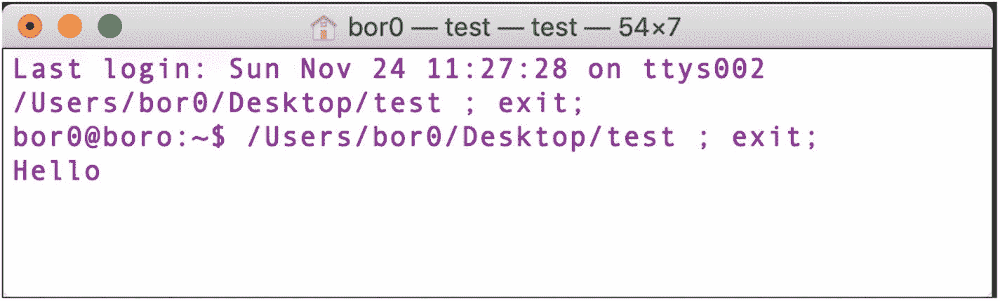

图 2-10

运行可执行文件

运行该可执行文件应该会显示类似于图 2-10 的内容。按下回车键将退出程序。

## 2.5 总结

本章的重点是让您对 Racket 编程语言有一个基本的了解。以下是我们在本章中学到的内容：

*   Lisp 是一个编程语言家族，Racket 属于 Lisp 家族。
*   与标准编程语言相比，Lisp 没有特殊的语法，其语法是通过 S-表达式以不同方式定义的。
*   Lisp 的求值过程与数学中的代入替换非常相似。
*   有几种基本类型：符号、布尔值、字符、字符串和列表。
*   列表是特殊类型的序对。
*   函数是捕获抽象的一种方式。它们可以接受和返回任何类型的值，包括函数本身。它们也可以是递归的。
*   包允许我们重用代码，这些代码可以是自己编写的，也可以是他人编写的。
*   生成的可执行文件可以分享给朋友，这样每个人都能使用它们。

脚注 1   2   3


