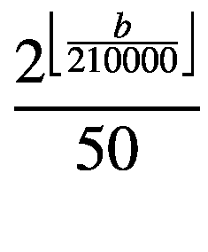

# 3. 区块链实现


*通往抽象的网关，作者：D. Bozhinovski*

既然我们已经掌握了编写计算机程序的能力，接下来将实现区块链的各个组件（数据结构与操作）。在本章中，我们将使用一些新的过程。对于其中部分过程，我们会给出简要说明；若你对其他过程感到好奇，可查阅 Racket 官方手册以获取更多细节。

本章每一节都强调动手实践，这意味着你需要在阅读过程中同步实现相关代码。提供的练习旨在确保你理解所构建过程的用法。开始之前，请回忆上一章提到的内容：必须在每个文件顶部添加 `#lang racket`。

与之前一样，以 `>` 开头的代码片段应在 REPL 中求值，不要将它们的定义保存在目标文件中。

我们首先定义序列化。在下一章中，当节点之间相互发送信息时，我们将大量依赖这一技术。你可以将其视为一种将数据结构转换为易于在节点间传输对象的简洁方式。

定义 3-1

**序列化**是将对象转换为字节流以存储该对象，或将其传输到内存、数据库或文件的过程。**反序列化**则是相反的过程——将字节流转换为对象。

## 3.1 wallet.rkt 文件

在本节中，我们将实现钱包。它们将在后续交易中用于确定资金的发送方和接收方。

如前所述，钱包是一个包含公钥和私钥的结构体。钱包的形式如下：

```
1   (struct wallet
2     (private-key public-key)
3     #:prefab)
```

`#:` 运算符表示一个**可选关键字参数**——本质上，它是一个可以通过参数名称来设置值的参数。相比之下，对于普通参数，我们必须依靠其顺序来设置值。例如，在 `(lambda (x y z) ...)` 中，我们必须先为 `x` 和 `y` 传递值，然后才能为 `z` 传递值。

`#:prefab` 部分是新内容。预构（"previously fabricated"）结构类型是 Racket 打印器已知的内置类型。我们可以打印/显示该结构及其所有内容。此外，我们还可以序列化/反序列化这类结构。

定义 3-2

**RSA** 是一种用于加密和解密消息的非对称密钥算法，其性质与第 1.2.2 节中描述的算法类似。

我们将创建一个过程，通过生成随机公钥和私钥来创建钱包，该过程将依赖 RSA 算法。

```
1   (define (make-wallet)
2     (letrec ([rsa-impl (get-pk 'rsa libcrypto-factory)]
3              [privkey (generate-private-key rsa-impl '((nbits 512)))]
4              [pubkey (pk-key->public-only-key privkey)])
5       (wallet (bytes->hex-string
6                (pk-key->datum privkey 'PrivateKeyInfo))
7               (bytes->hex-string
8                (pk-key->datum pubkey 'SubjectPublicKeyInfo)))))
```

我们使用的所有过程都来自 `crypto` 包：

*   `get-pk` 返回 RSA 实现算法。
*   `generate-private-key` 根据给定算法（此处为 RSA）生成私钥。
*   `pk-key->public-only-key` 根据公钥/私钥返回公钥。
*   `pk-key->datum` 返回公钥/私钥，使其便于通过本列表中的下一个过程进行序列化。
*   `bytes->hex-string` 将十六进制字符串（例如数字）转换为字节，例如 `"0102030304" -> "Hello"`。

我们需要引用必要的包：

```
1   (require crypto)
2   (require crypto/all)
```

然后导出所有内容，以便该过程可以作为包使用。

```
1   (provide (struct-out wallet) make-wallet)
```

`struct-out` 语法用于导出 `struct` 及其生成的过程。

以下是一个生成钱包的示例：

```
1   > (make-wallet)
2   '#s(wallet
3       "3082015502010030..."
4       "305c300d06092a86...")
```

现在我们有了为区块链创建钱包的方法。

练习 3-1

使用 `make-wallet` 创建一个钱包，并通过 `define` 将其存储在一个变量中。

练习 3-2

提取之前创建的钱包的私钥和公钥。代码应类似于 `(wallet-?? (make-wallet))`。

练习 3-3

通过阅读手册，简要了解 `crypto` 包中使用的过程。

**提示**：如果本地文档中没有关于 `crypto` 包的信息，请参考 [`https://docs.racket-lang.org`](https://docs.racket-lang.org/)。

## 3.2 block.rkt 文件

回顾一下，区块链本质上是一个区块列表，如图 1-4（第 1 章）所示。因此，区块是区块链的构建单元，在本节中，我们将提供区块的实现。

### 3.2.1 构造

一个区块应包含当前哈希值、前一个哈希值、数据以及生成时的时间戳：

```
1   > (struct block
2   (current-hash previous-hash data timestamp)
3   #:prefab)
```

使用哈希算法可以让我们确认区块的有效性。

通常，区块可以包含任何数据，不限于交易，但目前我们将其限制为交易。我们还会为 Hashcash 算法添加一个 `nonce` 字段。稍后我们将看到这个字段的用途：

```
1   (struct block
2     (current-hash previous-hash transaction timestamp nonce)
3     #:prefab)
```

我们的区块还包含一个大致形式如下的交易：

```
1   > (struct transaction
2     (signature from to value)
3     #:prefab)
```

我们将在后面详细实现交易。

以下是生成区块的一种方式：

```
1   > (block "123456" "234" (transaction "BoroS" "Boro" "You" 123) 1 1)
2   '#s(block "123456" "234" #s(transaction "BoroS" "Boro" "You" 123)
3   1 1)
```

例如，这个区块发起了一笔从 `"Boro"` 到 `"You"`、价值 `123` 的交易，时间戳和 `nonce` 均为 `1`。


### 3.2.2 哈希计算与验证

接下来，我们将实现一个计算区块哈希值的过程。我们将使用 **SHA** 哈希算法。


**定义 3-3**

**SHA** 是一种哈希算法，它接收输入并生成一个哈希值。

该过程如下所示：

```
1   (define (calculate-block-hash previous-hash timestamp transaction nonce)
2     (bytes->hex-string (sha256 (bytes-append
3              (string->bytes/utf-8 previous-hash)
4              (string->bytes/utf-8 (number->string timestamp))
5              (string->bytes/utf-8 (~a (serialize transaction)))
6              (string->bytes/utf-8 (number->string nonce))))))
```

这里有一些需要注意的点：

*   我们期望结构体中的每个字段都是 `string` 类型。这会让后续操作（例如将区块链存储到数据文件中）变得更加简单。
*   如果你查阅 `sha256` 的文档，你会注意到它接受的是字节数据。这意味着我们必须使用 `string->bytes/utf-8` 将每个字段转换为字节，然后在哈希前将所有字节拼接在一起。
*   `number->string` 将数字转换为字符串，例如 `3 -> "3"`；`~a` 功能相同，但它也能将对象转换为字符串。
*   我们对交易使用 `serialize`。这个过程接受一个对象并返回一个包含相同内容的 S-表达式。并非所有对象都能被序列化；不过，在此例中，我们使用 `#:prefab`，它额外使结构体变得可序列化。
*   最后，我们将哈希值存储为十六进制字符串。可以将十六进制理解为一种将字符串从可读字符存储为数字的方式，例如 `"Hello" -> "0102030304"`。

举个例子，下面是我们如何计算之前示例区块的哈希值：

```
1   >  (calculate-block-hash  "234"  1  (transaction  "BoroS"  "Boro"  "You"
2   "a book") 1)
3   "5e2889a76a464ea19a493a74d2da991a78626fc1fa9070340c2284ad92f4dd17"
```

现在我们有了计算区块哈希值的方法，同时也需要一种验证方法。为此，我们只需再次对区块内容进行哈希，然后将这个哈希值与存储在区块中的哈希值进行比较：

```
1   (define (valid-block? bl)
2     (equal? (block-current-hash bl)
3             (calculate-block-hash (block-previous-hash bl)
4                                   (block-timestamp bl)
5                                   (block-transaction bl)
6                                   (block-nonce bl))))
```

### 3.2.3 Hashcash 算法

至此，我们已经拥有了实现 Hashcash 算法所需的一切。

```
1   (define difficulty 2)
2   (define target (bytes->hex-string (make-bytes difficulty 32)))
```

我们将 `difficulty` 设置为 `2`，这样 `target` 将包含 `difficulty` 数量的字节，这是通过名为 `make-bytes` 的内置过程实现的。

在给定的难度下，如果哈希值与目标值匹配，则该区块被视为已挖出：

```
1   (define (mined-block? block-hash)
2     (equal? (subbytes (hex-string->bytes block-hash) 1 difficulty)
3             (subbytes (hex-string->bytes target) 1 difficulty)))
```

这里也有几点需要注意：

*   `hex-string->bytes` 是将十六进制字符串（例如 `"0102030304"`）转换为字节（`#"\1\2\3\3\4"`）的方法。
*   `subbytes` 接收一个字节列表、起始点和结束点，并返回该子列表。
*   因此，给定一个随机哈希值，如果它的前两个（在此例中，根据 `difficulty`）字节与 `target` 匹配，我们就认为该哈希值是有效的。

实际的 Hashcash 过程如下：

```
1   (define (make-and-mine-block
2             previous-hash timestamp transaction nonce)
3     (let ([current-hash (calculate-block-hash
4                   previous-hash timestamp transaction nonce)])
5       (if (mined-block? current-hash)
6           (block current-hash previous-hash transaction timestamp nonce)
7           (make-and-mine-block
8            previous-hash timestamp transaction (+ nonce 1)))))
```

这个过程会不断增加 `nonce`，直到区块有效为止，此时返回该区块。也就是说，我们不断改变 `nonce`，直到 `sha256` 生成一个与目标值匹配的哈希值。这定义了挖矿（工作量证明）的基础。

例如，下面是我们如何挖出之前给出的示例区块：

```
1   > (define mined-block (make-and-mine-block "234" 1 (transaction "BoroS"
2     "Boro" "You" "a book") 1))
3   > (block-nonce mined-block)
4   337
5   > (block-previous-hash mined-block)
6   "234"
7   > (block-current-hash mined-block)
8   "e920d627196658b64e349c1d3d6f2de1ab308d98d1c48130ee36df47ef25ee9a"
```

请注意，为了满足挖矿条件，`nonce` 必须增加到 `337`。这就是所需的“工作量”。在某些情况下，这个值会更小，在另一些情况下则会更大。

最后，我们需要一个小的辅助过程：

```
1   (define (mine-block transaction previous-hash)
2     (make-and-mine-block
3      previous-hash (current-milliseconds) transaction 1))
```

`current-milliseconds` 返回自 UTC 时间 1970 年 1 月 1 日午夜以来的当前时间（以毫秒为单位）。

我们提供这些结构体和过程：

```
1   (provide (struct-out block) mine-block valid-block? mined-block?)
```

并确保引入所有必要的包：

```
1   (require (only-in file/sha1 hex-string->bytes))
2   (require (only-in sha sha256))
3   (require (only-in sha bytes->hex-string))
4   (require racket/serialize)
```

`only-in` 语法仅从我们指定的包中导入特定对象，而不是导入所有内容。

至此，除了能够创建和签署钱包之外，我们现在还有了创建和挖掘区块所需的过程。


**练习 3-4**

使用 `block`（和 `transaction`）创建一个区块（带有一笔交易），并使用 `define` 将其存储在一个变量中。然后，使用 `calculate-block-hash` 计算它的哈希值。


**练习 3-5**

对你生成的区块使用 `make-and-mine-block`。`nonce` 计数是多少，即挖出该区块需要多少“工作量”（处理过程）？


**练习 3-6**

对上一个练习中的区块使用 `valid-block?`。现在，对该区块使用 `valid-block?`，但将其 `nonce` 设为 `1`。

**提示**：要基于一个名为 `bl` 的现有区块生成一个“新”区块，你可以使用：

```
1   (block (block-current-hash bl)
2          (block-previous-hash bl)
3          (block-transaction bl)
4          (block-timestamp bl)
5          (block-nonce bl))
```


好的，作为高级文档工程师和翻译员，我将遵循您提供的注意事项和示例，将给定的英文文本翻译成中文。


## 3.3 `utils.rkt` 文件

该文件将包含其他组件会使用到的公共过程。

我们将会经常使用的一个过程是 `true-for-all?`。如果某个谓词对列表中的所有成员都成立，则返回真（true），否则返回假（false）：

```
1   (define (true-for-all? pred list)
2     (cond
3       [(empty? list) #t]
4       [(pred (car list)) (true-for-all? pred (cdr list))]
5       [else #f]))
```

以下是一个用法示例：

```
1   > (true-for-all? (lambda (x) (> x 3)) '(1 2 3))
2   #f
3   > (true-for-all? (lambda (x) (> x 3)) '(4 5 6))
4   #t
```

接下来，我们将需要一个过程来将 `struct` 导出到文件：

```
1   (define (struct->file object file)
2     (let ([out (open-output-file file #:exists 'replace)])
3       (write (serialize object) out)
4       (close-output-port out)))
```

`open-output-file` 会返回一个内存中的对象，我们可以使用 `write` 向其写入数据。当我们这样做时，它会将数据写入到打开的文件中。`close-output-port` 会关闭这个内存中的对象。这个过程会将一个 `struct` 序列化，然后将序列化后的内容写入到一个文件中。

下面的过程与 `struct->file` 相反：给定一个文件，它通过打开文件、读取其内容并反序列化其内容，来返回一个 `struct`。

```
1   (define (file->struct file)
2     (letrec ([in (open-input-file file)]
3              [result (read in)])
4       (close-input-port in)
5       (deserialize result)))
```

这里有一些说明：

- `read` 会从 `in` 读取并返回数据（`write` 的反向操作）。
- `open-input-file` 类似于 `open-output-file`，不同之处在于它用于使用 `read` 从文件中读取数据。
- `deserialize` 是 `serialize` 的反向操作。

我们提供了这些过程：

```
1   (provide true-for-all? struct->file file->struct)
```

并确保我们引入了所有必要的包：

```
1   (require racket/serialize)
```

现在，我们有了将区块链数据写入文件系统（并从文件系统读取）的方法。这样，我们的区块链数据就可以持久化了。

 练习 3-7

对某个区块使用 `struct->file` 将其存储在一个文件中。然后，对同一个文件使用 `file->struct`。你得到的是同一个区块吗？接下来，使用文本编辑器打开你创建的文件。文件内容是什么样的？

## 3.4 交易

在本节中，我们将实现用于签名和验证交易的过程，如图 1-2（第 1 章）所示。

### 3.4.1 `transaction-io.rkt` 文件

`transaction` 结构体将由一个 `transaction-io` 结构体（交易输入/输出）组成。交易输入将代表发送资金的区块链地址，而交易输出将代表接收资金的区块链地址。

该结构体包含一个哈希值，以便我们能够验证其有效性。它还有一个值（value）、一个所有者（owner）和一个时间戳（timestamp）。

```
1   (struct transaction-io
2     (transaction-hash value owner timestamp)
3     #:prefab)
```

与区块类似，我们将使用相同的代码来创建哈希，并且同样依赖于序列化：

```
1   (define (calculate-transaction-io-hash value owner timestamp)
2     (bytes->hex-string  (sha256  (bytes-append
3              (string->bytes/utf-8 (number->string value))
4              (string->bytes/utf-8 (~a (serialize owner)))
5              (string->bytes/utf-8  (number->string  timestamp))))))
```

`make-transaction-io` 是一个辅助过程，它也会初始化 `timestamp`：

```
1   (define (make-transaction-io value owner)
2     (let ([timestamp (current-milliseconds)])
3       (transaction-io
4        (calculate-transaction-io-hash value owner timestamp)
5        value
6        owner
7        timestamp)))
```

如果 `transaction-io` 结构体的哈希等于其值、所有者和时间戳的哈希，则该结构体是有效的：

```
1   (define (valid-transaction-io? t-in)
2     (equal? (transaction-io-transaction-hash t-in)
3             (calculate-transaction-io-hash
4              (transaction-io-value t-in)
5              (transaction-io-owner t-in)
6              (transaction-io-timestamp  t-in))))
```

以下是一个用法示例：

```
1   > (make-transaction-io 123 "Some person")
2   '#s(transaction-io "df652a3c15feba2eb9071cfdd810130c971f7fe7494a4710ee62
3   2fca11f0d83e" 123 "Some person" 1573765357289)
4   > (valid-transaction-io? (transaction-io "df652a3c15feba2eb9071cfdd81013
5   0c971f7fe7494a4710ee622fca11f0d83e" 123 "Some person" 1573765357289))
6   #t
7   > (valid-transaction-io? (transaction-io "badhash" 123 "Some person"
8   1573765357289))
9   #f
```

最后，我们导入必要的包并导出这些过程：

```
1   (require (only-in sha sha256))
2   (require (only-in sha bytes->hex-string))
3   (require racket/serialize)
4
5   (provide (struct-out transaction-io)
6             make-transaction-io valid-transaction-io?)
```

现在我们有了存储交易输入/输出的方法，就可以继续进行实际的交易实现了。

### 3.4.2 `transaction.rkt` 文件

该文件将包含用于签名和验证交易的过程。它也会使用交易输入和输出，并将它们存储在一个单一的交易中。

以下是我们需要 `require` 的所有内容：

```
1   (require "transaction-io.rkt")
2   (require "utils.rkt")
3   (require (only-in file/sha1 hex-string->bytes))
4   (require "wallet.rkt")
5   (require crypto)
6   (require crypto/all)
7   (require racket/serialize)
```

一个交易包含一个签名、发送方、接收方、值以及一个输入和输出列表（`transaction-io` 对象）。

```
1   (struct transaction
2     (signature from to value inputs outputs)
3     #:prefab)
```


**定义 3-4**

在 Racket 中，一个**加密工厂**由特定的加密算法实现组成。

除了代码之外，我们需要使用所有加密工厂。它们将允许我们使用某些过程，例如 `hex<->pk-key`：

```
1   (use-all-factories!)
```

我们将需要一个过程来创建一个空的、未签名的、未处理的（没有输入输出）交易。这个过程稍后将在我们发送资金或创建第一个（创世）交易时使用。

```
1   (define (make-transaction from to value inputs)
2     (transaction
3      ""
4      from
5      to
6      value
7      inputs
8      '()))
```

#### 3.4.2.1 数字签名

接下来，我们需要一个过程来对交易进行签名。它类似于我们之前编写的使用哈希的过程，即我们从结构中获取所有字节并将它们拼接起来。在这种情况下，不同之处在于我们将使用数字签名来对数据进行签名和验证。

为了创建数字签名，我们使用一个哈希过程（在这个例子中，它使用的是 SHA 算法）。然后使用私钥对生成的哈希进行加密。这个加密后的哈希就代表了数字签名。

```
1   (define (sign-transaction from to value)
2     (let ([privkey (wallet-private-key from)]
3           [pubkey (wallet-public-key from)])
4       (bytes->hex-string
5        (digest/sign
6         (datum->pk-key (hex-string->bytes privkey) 'PrivateKeyInfo)
7         'sha1
8         (bytes-append
9          (string->bytes/utf-8 (~a (serialize from)))
10          (string->bytes/utf-8 (~a (serialize to)))
11          (string->bytes/utf-8 (number->string value)))))))
```

`digest/sign` 是执行哈希和加密的过程。它接受一个私钥、一个算法^(⁷)和字节数据，并返回加密后的数据。


#### 3.4.2.2 处理交易

接下来，我们实现一个用于处理交易的过程，该过程将：

- 对 `inputs-sum` 内的所有输入进行求和。
- 计算 `leftover`（剩余金额），即 `inputs-sum` 与当前交易 `value` 的差值。
- 根据交易的 `value` 和 `leftover` 生成新的输出。
- 将旧输出（`outputs`）和新输出（`new-outputs`）合并到新生成的交易中（输入保持不变，将在后续的 UTXO 实现中使用）。
- 使用 `foldr + 0 l` 计算数字列表 `l` 的总和。

换句话说，基于某些交易输入，该过程将创建包含交易 `value` 和 `leftover` 金额的交易输出：

```
1   (define (process-transaction t)
2     (letrec
3         ([inputs (transaction-inputs t)]
4          [outputs (transaction-outputs t)]
5          [value (transaction-value t)]
6          [inputs-sum
7           (foldr + 0 (map (lambda (i) (transaction-io-value i)) inputs))]
8          [leftover (- inputs-sum value)]
9          [new-outputs
10           (list
11            (make-transaction-io value (transaction-to t))
12            (make-transaction-io leftover (transaction-from t)))])
13       (transaction
14        (sign-transaction (transaction-from t)
15                          (transaction-to t)
16                          (transaction-value t))
17        (transaction-from t)
18        (transaction-to t)
19        value
20        inputs
21        (append new-outputs outputs))))
```

我们还需要一个检查交易签名有效性的过程：

```
1   (define (valid-transaction-signature? t)
2     (let ([pubkey (wallet-public-key (transaction-from t))])
3       (digest/verify
4        (datum->pk-key (hex-string->bytes pubkey) 'SubjectPublicKeyInfo)
5        'sha1
6        (bytes-append
7         (string->bytes/utf-8 (~a (serialize (transaction-from t))))
8         (string->bytes/utf-8 (~a (serialize (transaction-to t))))
9         (string->bytes/utf-8 (number->string (transaction-value t))))
10         (hex-string->bytes (transaction-signature t)))))
```

`digest/verify` 与 `digest/sign` 相反，它不是用于签名，而是用于判断签名是否有效。

最后，我们需要一个过程，用于在以下条件下判定交易的有效性：

- 其签名有效：`valid-transaction-signature?`
- 所有输出有效：`valid-transaction-io?`
- 输入总和大于或等于输出总和：`>= sum-inputs sum-outputs`。这解决了双重支付问题。

```
1   (define (valid-transaction? t)
2     (let ([sum-inputs
3            (foldr + 0 (map (lambda (t) (transaction-io-value t))
4                            (transaction-inputs t)))]
5           [sum-outputs
6            (foldr + 0 (map (lambda (t) (transaction-io-value t))
7                            (transaction-outputs t)))])
8       (and
9        (valid-transaction-signature? t)
10        (true-for-all? valid-transaction-io? (transaction-outputs t))
11        (>= sum-inputs sum-outputs))))
```

`(and ...)` 语法会在所有传入的值均为 `#t` 时返回 `#t`，否则返回 `#f`。相反，`(or ...)` 则在至少有一个传入值为 `#t` 时返回 `#t`，否则返回 `#f`。

最后，我们导出以下内容：

```
1   (provide (all-from-out "transaction-io.rkt")
2            (struct-out transaction)
3            make-transaction process-transaction valid-transaction?)
```

`all-from-out` 语法指定了我们从目标导入（并导出）的所有对象。在本例中，除了导出 `transaction` 结构及其相关过程的文件外，它还导出了 `transaction-io.rkt` 中的所有内容。

除了钱包和区块，我们的实现还支持交易的创建与处理。


**练习 3-8**

创建一个交易，使用上述过程对其进行处理并验证。

**提示**：分别使用 `make-transaction`、`process-transaction` 和 `valid-transaction?`。

## 3.5 blockchain.rkt 文件

现在我们将实现最后一个组件——区块链。需要 `require` 一堆内容：

```
1   (require "block.rkt")
2   (require "transaction.rkt")
3   (require "utils.rkt")
4   (require "wallet.rkt")
```

回想一下，UTXO 只是一个 `transaction-io` 对象的列表，它代表未花费的交易输出。在某种意义上，它类似于钱包的初始余额。因此，该结构将包含一个区块列表和 UTXO：

```
1   (struct blockchain
2     (blocks utxo)
3     #:prefab)
```

### 3.5.1 初始化

我们需要一个用于初始化区块链的过程。它应接受创世交易、创世哈希和 UTXO：

```
1   (define (init-blockchain t seed-hash utxo)
2     (blockchain (cons (mine-block (process-transaction t) seed-hash) '())
3                 utxo))
```

初始化区块链的一种方法如下：

```
1   > (define coin-base (make-wallet))
2   > (define wallet-a (make-wallet))
3   > (define genesis-t (make-transaction coin-base wallet-a 100  '()))
4   > (define utxo (list
5   >              (make-transaction-io 100 wallet-a)))
6   > (define blockchain (init-blockchain genesis-t "1337cafe"  utxo))
```

### 3.5.2 奖励

在原始的比特币实现中，第一个区块的奖励从 50 个币开始，之后每 210000 个区块减半。这意味着，直到第 210000 个区块，每个区块奖励 50 个币，而从第 210001 个区块开始，奖励变为 25 个币。换句话说，奖励通过以下公式计算，其中 *b* 是区块数量：



我们遵循相同的算法。初始奖励为 50 个币，之后每 210000 个区块减半。

```
1   (define (mining-reward-factor blocks)
2     (/ 50 (expt 2 (floor (/ (length blocks) 210000)))))
```


### 3.5.3 添加交易

接下来的步骤将向区块链添加一笔交易。该过程应：

1.  挖掘一个区块。
2.  根据处理过的交易输出、输入以及当前的`UTXO`创建一个新的`UTXO`。
3.  通过添加新挖掘的区块来生成一个新的区块列表。
4.  根据当前`UTXO`计算奖励。

此外，`UTXO`将被视为一个集合，以便我们可以轻松地移除特定输入，并使用集合运算附加新的交易。

```
1   (define (add-transaction-to-blockchain b t)
2     (letrec ([hashed-blockchain
3               (mine-block t
4                (block-current-hash (car (blockchain-blocks b))))]
5              [processed-inputs (transaction-inputs t)]
6              [processed-outputs (transaction-outputs t)]
7              [utxo (set-union processed-outputs
8                               (set-subtract (blockchain-utxo b)
9                                             processed-inputs))]
10              [new-blocks (cons hashed-blockchain (blockchain-blocks b))]
11              [utxo-rewarded (cons
12                              (make-transaction-io
13                               (mining-reward-factor new-blocks)
14                               (transaction-from t))
15                              utxo)])
16        (blockchain
17         new-blocks
18         utxo-rewarded)))
```

关于`add-transaction-to-blockchain`还有一点需要注意：给定一个区块链和一笔交易，它会返回一个新的、更新后的区块链。这个新返回的区块链将成为应使用的最新版本，因为之前的区块链不会包含这笔新交易。这样，我们就避免了修改之前的区块链。

接下来，我们将创建一个过程，用于确定钱包的余额——即匹配的所有者的所有未花费交易的总和：

```
1   (define (balance-wallet-blockchain  b  w)
2     (letrec ([utxo (blockchain-utxo b)]
3              [my-ts (filter
4                      (lambda (t) (equal? w (transaction-io-owner t)))
5                      utxo)])
6       (foldr + 0 (map (lambda (t) (transaction-io-value t)) my-ts))))
```

我们还需要一个过程，通过发起交易并将其添加到区块链进行处理，从而将资金从一个钱包发送到另一个钱包。`my-ts`将包含当前接收者的交易输入。最后，只有当交易有效时，我们才将其添加到区块链。

```
1   (define (send-money-blockchain b from to value)
2     (letrec ([my-ts
3               (filter (lambda (t) (equal? from (transaction-io-owner t)))
4                       (blockchain-utxo b))]
5               [t (make-transaction from to value my-ts)])
6       (if (transaction? t)
7           (let ([processed-transaction (process-transaction t)])
8             (if (and
9                  (>= (balance-wallet-blockchain b from) value)
10                  (valid-transaction? processed-transaction))
11                 (add-transaction-to-blockchain b processed-transaction)
12                 b))
13           (add-transaction-to-blockchain b '()))))
```

### 3.5.4 验证

现在，我们将介绍一个过程，该过程在以下条件下确定区块链的有效性：

- 所有区块均使用`valid-block?`验证有效。
- 通过使用`equal?`检查，比较所有区块（最后一个除外）的上一哈希与所有区块（第一个除外）的当前哈希，确保上一哈希匹配。
- 所有交易均使用`valid-transaction?`验证有效。
- 所有区块均使用`mined-block?`验证已挖掘。

```
1   (define (valid-blockchain? b)
2     (let ([blocks (blockchain-blocks b)])
3       (and
4        (true-for-all? valid-block? blocks)
5        (equal? (drop-right (map block-previous-hash blocks) 1)
6                (cdr (map block-current-hash blocks)))
7        (true-for-all?
8         valid-transaction? (map
9                            (lambda (block) (block-transaction block))
10                            blocks))
11         (true-for-all?
12         mined-block? (map block-current-hash blocks)))))
```

最后，我们导出所有内容：

```
1   (provide (all-from-out "block.rkt")
2            (all-from-out "transaction.rkt")
3            (all-from-out "wallet.rkt")
4            (struct-out blockchain)
5            init-blockchain send-money-blockchain
6            balance-wallet-blockchain valid-blockchain?)
```

现在我们拥有了所有必要的组件：管理钱包、区块、交易，以及最终的区块链。

 练习 3-9

创建两个集合，并对它们使用`set-subtract`、`set-union`和`set-intersect`。观察结果。

 练习 3-10

使用`init-blockchain`初始化一个区块链，并使用`add-transaction-to-blockchain`向其添加一笔交易。

 练习 3-11

对上一练习中的区块链使用`valid-blockchain?`（在添加新交易之前进行一次，添加新交易之后再进行一次）。

 练习 3-12

使用`send-money-blockchain`在区块链中执行一次转账。

## 3.6 集成组件

在本节中，我们将把所有不同的部分整合到一个统一的点，并展示如何轻松地使用它们。


### 3.6.1 `main-helper.rkt` 文件

该文件会导入`blockchain.rkt`和`utils.rkt`中的所有内容，并会提供一些打印过程。

```
(require "blockchain.rkt")
(require "utils.rkt")
```

接下来这个过程会将一个交易对象转换为可打印的字符串。它会使用`substring`仅打印哈希值的一部分（因为哈希可能太长），同时也会使用`format`，这是一个字符串格式化过程，它会按顺序将字符串中的每个`~a`替换为传入的参数。

```
(define (format-transaction t)
  (format "...~a... sends ...~a... an amount of ~a."
          (substring (wallet-public-key (transaction-from t)) 64 80)
          (substring (wallet-public-key (transaction-to t)) 64 80)
          (transaction-value t)))
```

接下来这个过程会打印一个区块的详细信息。`printf`与`print`类似，区别在于它可以像`format`那样使用：

```
(define (print-block bl)
  (printf "Block information\n=================
Hash:\t~a\nHash_p:\t~a\nStamp:\t~a\nNonce:\t~a\nData:\t~a\n"
      (block-current-hash bl)
      (block-previous-hash bl)
      (block-timestamp bl)
      (block-nonce bl)
      (format-transaction (block-transaction bl))))
```

除了显式使用递归外，还有一个内置的`for`语法也支持重复计算。为了打印区块链，我们将使用`for`语法遍历所有区块，将其打印到标准输出，然后使用`newline`添加一个换行符，使每个区块的间隔清晰可见：

```
(define (print-blockchain b)
  (for ([block (blockchain-blocks b)])
    (print-block block)
    (newline)))
```

我们以类似方式打印钱包：

```
(define (print-wallets b wallet-a wallet-b)
  (printf "\nWallet A balance: ~a\nWallet B balance: ~a\n\n"
          (balance-wallet-blockchain b wallet-a)
          (balance-wallet-blockchain b wallet-b)))
```

并导出这些过程：

```
(provide (all-from-out "blockchain.rkt")
         (all-from-out "utils.rkt")
         format-transaction print-block print-blockchain print-wallets)
```


**练习 3-13**

创建一个交易并使用`format-transaction`查看其输出。对区块（`print-block`）、区块链（`print-blockchain`）和钱包（`print-wallets`）重复相同的操作。

### 3.6.2 `main.rkt` 文件

在这里我们将把所有组件整合到一起并使用它们。首先，我们通过使用`file-exists?`来检查`blockchain.data`文件是否存在。如果存在，该文件将包含之前区块链的内容。如果不存在，我们就创建一个全新的区块链。

```
(require "main-helper.rkt")

(when (file-exists? "blockchain.data")
  (begin
    (printf "Found 'blockchain.data', reading...\n")
    (print-blockchain (file->struct "blockchain.data"))
    (exit)))
```

我们使用了`when`，它类似于`if`，区别在于省略了`else`分支。

接下来，我们初始化钱包：

```
(define coin-base (make-wallet))
(define wallet-a (make-wallet))
(define wallet-b (make-wallet))
```

我们通过创建创世交易来初始化交易：

```
(printf "Making genesis transaction...\n")
(define genesis-t (make-transaction coin-base wallet-a 100 '()))
```

我们初始化未花费交易——即创世交易：

```
(define utxo (list
              (make-transaction-io 100 wallet-a)))
```

最后，我们通过挖矿创世交易来初始化区块链：

```
(printf "Mining genesis block...\n")
(define blockchain (init-blockchain genesis-t "1337cafe" utxo))
(print-wallets blockchain wallet-a wallet-b)
```

进行第二笔交易：

```
(printf "Mining second transaction...\n")
(set! blockchain (send-money-blockchain blockchain wallet-a wallet-b 2))
(print-wallets blockchain wallet-a wallet-b)
```

进行第三笔交易：

```
(printf "Mining third transaction...\n")
(set! blockchain (send-money-blockchain blockchain wallet-b wallet-a 1))
(print-wallets blockchain wallet-a wallet-b)
```

尝试进行第四笔交易：

```
(printf "Attempting to mine fourth (not-valid) transaction...\n")
(set! blockchain (send-money-blockchain blockchain wallet-b wallet-a 3))
(print-wallets blockchain wallet-a wallet-b)
```

检查区块链的有效性：

```
(printf "Blockchain is valid: ~a\n\n" (valid-blockchain? blockchain))
```

打印区块链中的每个区块：

```
(for ([block (blockchain-blocks blockchain)])
  (print-block block)
  (newline))
```

并将区块链导出到`blockchain.data`中，该文件以后可以重复使用。

```
(struct->file blockchain "blockchain.data")
(printf "Exported blockchain to 'blockchain.data'...\n")
```

一旦我们创建了`main.rkt`，就可以从`Racket > Run`菜单运行它。它应该会显示如下输出：

```
Making genesis transaction...
Mining genesis block...

Wallet A balance: 100
Wallet B balance: 0

Mining second transaction...

Wallet A balance: 130
Wallet B balance: 20

Mining third transaction...

Wallet A balance: 140
Wallet B balance: 60

Attempting to mine fourth (not-valid) transaction...

Wallet A balance: 140
Wallet B balance: 60

Blockchain is valid: #t

Block information
=================
Hash:   e720bb198279a76057280bdf8eb667fe1883d0ae263c5d5d1be08697a2f534d1
Hash_p: 38200563c1f807be2a5d10ec42dd53acae1f6f804b4c93016b87c974817f065d
Stamp:  1529923610574
Nonce:  216
Data:   ...bb6... sends ...896... an amount of 10.

Block information
=================
Hash:   38200563c1f807be2a5d10ec42dd53acae1f6f804b4c93016b87c974817f065d
Hash_p: 6a20fbe4038bb3b83090e7f767bb24af5164218bba5c751a1858262df2a2a847
Stamp:  1529923610405
Nonce:  752
Data:   ...896... sends ...bb6... an amount of 20.

Block information
=================
Hash:   6a20fbe4038bb3b83090e7f767bb24af5164218bba5c751a1858262df2a2a847
Hash_p: 7365656467656e65736973
Stamp:  1529923610332
Nonce:  220
Data:   ...58d... sends ...896... an amount of 100.

Exported blockchain to 'blockchain.data'...
```

## 3.7 小结

我们一步步地逐个构建了每个组件。有些组件是*正交*的——它们彼此独立。例如，`钱包`的实现不会调用来自`区块`的任何过程，并且`区块`可以不依赖于`钱包`而独立使用。当我们将所有组件组合在一起时，就得到了一个区块链系统。

这种设计使我们能够轻松扩展系统。在下一章中，我们将为系统添加点对点和智能合约功能，而无需更改基本组件。

**脚注**

1

