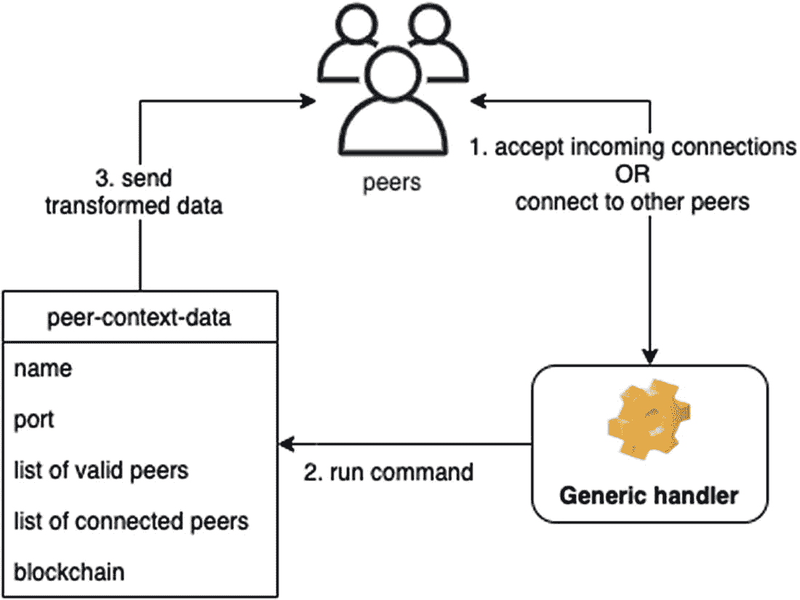

# 4. 扩展区块链


*扩展，作者：D. Bozhinovski*

在上一章中，我们实现了区块链的基本组件。在本章中，我们将通过智能合约和点对点支持来扩展区块链。

## 4.1 智能合约实现

比特币的区块链是可编程的，这意味着用户可以对交易条件本身进行编程。例如，用户可以编写*脚本*（简短的代码片段）来添加完成交易前必须满足的要求。

在 2.4 节中，我们创建了一个可执行文件并发送给朋友，但他们无法更改该可执行文件，因为他们没有原始代码。即使他们有原始代码，也并非所有用户都具备编程技能。

智能合约的意义在于，允许非编程人员在不修改原始代码的情况下，调整交易流程的行为。

### 4.1.1 文件 `smart-contracts.rkt`

其理念是实现一种用户可以使用的小型语言。我们的实现将依赖于交易：

```racket
(require "transaction.rkt")
```

我们需要扩展原始的 `valid-transaction?`，使其在计算有效性时也考虑合约：

```racket
(define (valid-transaction-contract? t c)
  (and (eval-contract t c)
       (valid-transaction? t)))
```

现在，我们将实现一个过程，它接收一个交易、一个合约、一种脚本语言（实际上只是一个 S-表达式），并返回某个值。返回的值可以是 true、false、数字或字符串。

```racket
(define (eval-contract t c)
  (match c
    [(? number? x) x]
    [(? string? x) x]
    [`() #t]
    [`true #t]
    [`false #f]
    [`(if ,co ,tr ,fa) (if co tr fa)]
    [`(+ ,l ,r) (+ l r)]
    [else #f]))
```

我们在这里使用了新语法，叫做 `match`。它类似于 `cond`，区别在于它可以直接比较对象的结构。例如，`? <expr> <pat>` 在 `<expr>` 为 true 时匹配成功，并将值存储在 `<pat>` 中。在上面的代码中，如果我们传入一个数字，它会返回这个数字本身。此外，如果我们传入值 `true`（即 `c` 匹配 `true`），它会返回 `#t`。另一个例子是，如果 `c` 匹配形如 `(if X Y Z)` 的结构（已引用^(⁸)），那么它将返回 `(if X Y Z)` 的求值结果。

以下是一些使用示例：

```racket
> (define test-transaction (transaction "BoroS" "Boro" "You" "a book"
  '() '()))
> (eval-contract test-transaction 123)
123
> (eval-contract test-transaction "Hi")
"Hi"
> (eval-contract test-transaction '())
#t
> (eval-contract test-transaction 'true)
#t
> (eval-contract test-transaction 'false)
#f
> (eval-contract test-transaction '(if #t "Hi" "Hey"))
"Hi"
> (eval-contract test-transaction '(if #f "Hi" "Hey"))
"Hey"
> (eval-contract test-transaction '(+ 1 2))
3
```

然而，我们还没有在语言中使用任何交易的值。让我们用更多的命令来扩展它：

```racket
...
     [`from (transaction-from t)]
     [`to (transaction-to t)]
     [`value (transaction-value t)]
...
```

现在我们可以这样做：

```racket
> (eval-contract test-transaction 'from)
"Boro"
> (eval-contract test-transaction 'to)
"You"
> (eval-contract test-transaction 'value)
"a book"
```

我们将实现更多运算符，使脚本语言更具表达力：

```racket
...
     [`(* ,l ,r) (* l r)]
     [`(- ,l ,r) (- l r)]
     [`(= ,l ,r) (equal? l r)]
     [`(> ,l ,r) (> l r)]
     [`(< ,l ,r) (< l r)]
     [`(and ,l ,r) (and l r)]
     [`(or ,l ,r) (or l r)]
...
```

然而，该语言实现存在一个问题。考虑对 `(+ 1 2)` 和 `(+ (+ 1 2) 3)` 的求值：

```racket
> (eval-contract test-transaction '(+ 1 2))
3
> (eval-contract test-transaction '(+ (+ 1 2) 3))
. . +: contract violation
```

问题出在匹配子句 `[`(+ ,l ,r) (+ l r)]` 上。当我们匹配 `'(+ (+ 1 2) 3))` 时，最终得到 `(+ '(+ 1 2) 3)`，而 Racket 无法将带引号的列表与数字相加。这个问题的解决方案是*递归地*求值每个子表达式。因此匹配从 `[`(+ ,l ,r) (+ l r)]` 变为 `[`(+ ,l ,r) (+ (eval-contract t l) (eval-contract t r))]`。

在这种情况下，求值过程如下：

```racket
(eval-contract t '(+ (+ 1 2) 3))
= (eval-contract t (list '+ (eval-contract t '(+ 1 2))
                            (eval-contract t 3)))
= (eval-contract t (list '+ (+ 1 2) 3))
= (eval-contract t (list '+ 3 3))
= (eval-contract t '(+ 3 3))
= (eval-contract t 6)
= 6
```

记住带引号列表和不带引号列表之间的区别很重要；后者会尝试求值。在这个例子中，我们巧妙地运用了引号来产生所需的结果。

我们需要重写所有运算符：

```racket
...
     [`(+ ,l ,r) (+ (eval-contract t l) (eval-contract t r))]
     [`(* ,l ,r) (* (eval-contract t l) (eval-contract t r))]
     [`(- ,l ,r) (- (eval-contract t l) (eval-contract t r))]
     [`(= ,l ,r) (= (eval-contract t l) (eval-contract t r))]
     [`(> ,l ,r) (> (eval-contract t l) (eval-contract t r))]
     [`(< ,l ,r) (< (eval-contract t l) (eval-contract t r))]
     [`(and ,l ,r) (and (eval-contract t l) (eval-contract t r))]
     [`(or ,l ,r) (or (eval-contract t l) (eval-contract t r))]
...
```

语言中的 `if` 实现也存在同样的问题。所以我们也需要修改它：

```racket
...
     [`(if ,co ,tr ,fa) (if (eval-contract t co)
                        (eval-contract t tr)
                        (eval-contract t fa))]
...
```

因此，最终的过程变为：

```racket
(define (eval-contract t c)
  (match c
    [(? number? x) x]
    [(? string? x) x]
    [`() #t]
    [`true #t]
    [`false #f]
    [`(if ,co ,tr ,fa) (if (eval-contract t co)
                           (eval-contract t tr)
                           (eval-contract t fa))]
    [`(+ ,l ,r) (+ (eval-contract t l) (eval-contract t r))]
    [`from (transaction-from t)]
    [`to (transaction-to t)]
    [`value (transaction-value t)]
    [`(+ ,l ,r) (+ (eval-contract t l) (eval-contract t r))]
    [`(* ,l ,r) (* (eval-contract t l) (eval-contract t r))]
    [`(- ,l ,r) (- (eval-contract t l) (eval-contract t r))]
    [`(= ,l ,r) (= (eval-contract t l) (eval-contract t r))]
    [`(> ,l ,r) (> (eval-contract t l) (eval-contract t r))]
    [`(< ,l ,r) (< (eval-contract t l) (eval-contract t r))]
    [`(and ,l ,r) (and (eval-contract t l) (eval-contract t r))]
    [`(or ,l ,r) (or (eval-contract t l) (eval-contract t r))]
    [else #f]))
```

现在用户可以提供脚本代码，例如 `(if (= (+ 1 2) 3) from to)`：

```racket
> (eval-contract test-transaction '(if (= (+ 1 2) 3) from to))
"Boro"
> (eval-contract test-transaction '(if (= (+ 1 2) 4) from to))
"You"
```

最后，我们提供输出，即交易的有效性检查：

```racket
(provide valid-transaction-contract?)
```

### 4.1.2 更新现有代码

现在我们已经实现了智能合约的逻辑，接下来需要解决的是前端问题——用户如何使用其功能。为此，我们将更新实现，使其支持从文件中读取合约。如果存在名为 `contract.script` 的文件，我们将使用 `read` 读取并解析它，然后运行代码。

我们将重写 `blockchain.rkt` 中的货币发送过程，使其接受合约。该过程与之前相同，只是我们使用 `valid-transaction-contract?` 代替了 `valid-transaction?`。

```racket
(define (send-money-blockchain b from to value c)
  (letrec ([my-ts
            (filter (lambda (t) (equal? from (transaction-io-owner t)))
                    (blockchain-utxo b))]
            [t (make-transaction from to value my-ts)])
    (if (transaction? t)
        (let ([processed-transaction (process-transaction t)])
          (if (and
               (>= (balance-wallet-blockchain b from) value)
               (valid-transaction-contract? processed-transaction c))
               (add-transaction-to-blockchain b processed-transaction)
               b))
        (add-transaction-to-blockchain b '()))))
```

接下来，我们将更新 `utils.rkt`，添加这个用于读取合约的辅助过程：

```racket
(define (file->contract file)
  (with-handlers ([exn:fail? (lambda (exn) '())])
    (read (open-input-file file))))
```

这里，我们使用了 `with-handlers`，它接受一个过程来处理可能出错的情况——在本例中，是 `read` 或 `open-input-file` 出错的情况。

最后，确保将 `file->contract` 添加到 `utils.rkt` 的 `provide` 列表中。此外，在 `main.rkt` 中，更新所有对 `send-money-blockchain` 的调用，额外传入 `(file->contract "contract.script")` 作为参数，以便处理从 `contract.script` 文件读取的合约。

我们还需要更新 `blockchain.rkt` 和 `main.rkt`，因为它们现在依赖于智能合约包中实现的过程。我们将在这两个文件中添加 `(require "smart-contracts.rkt")`。


### 练习 4-1

想出几个有效的表达式，并使用 `eval-contract` 对其进行求值。


### 练习 4-2

重复上一个练习，但这次使用 `contract.script` 文件。

**提示**：此练习可能需要您创建一个可执行文件。

## 4.2 点对点实现

在第 3.6.2 节中，我们使用 `DrRacket` 来执行区块链实现。这在测试时是可以的。但是，如果我们想与其他用户共享该实现并让他们执行它，就会有点不方便，因为无法在不同用户之间共享数据。

在本节中，我们将实现点对点支持，以便对我们实现感兴趣的用户可以加入系统/社区。

在我们深入实现之前，图 4-1 展示了我们将要构建的架构的高级概览。



**图 4-1** 点对点架构

每个对等节点（连接到系统的用户）的列表将由以下部分组成：

-   **对等节点上下文数据**：例如与其他对等节点的关系、已连接的对等节点列表等信息。
-   **通用处理器**：转换对等节点上下文数据。

此外，将有两种方式与其他对等节点建立通信：

-   一个对等节点将接受来自其他对等节点的新连接。
-   一个对等节点将尝试连接/建立与其他对等节点的新连接。

每当建立连接时，对等节点将通过通用处理器相互通信，解析和评估诸如同步/更新区块链、更新对等节点列表等命令。

考虑这个示例场景：假设有三个对等节点——节点 1、节点 2 和节点 3。节点 1 和节点 2 在线，节点 3 当前离线。节点 1 拥有以下有效对等节点列表：(节点 1, 节点 2, 节点 3)。节点 2 的对等节点列表为空。根据图示，节点 1 将接受新连接并尝试连接其他对等节点。因此，节点 1 将尝试连接节点 2。此连接将成功，下一步是节点 1 向节点 2 发送一些数据（例如，有效对等节点列表）。

节点 2 的对等节点列表之前是空的，但现在将与节点 1 的列表合并，因此它将变为 (节点 1, 节点 2, 节点 3)。节点 1 和节点 2 相互连接，并且它们将持续尝试连接节点 3。一旦节点 3 变为可用，将执行相同的算法，节点 3 将加入网络。

通过这种方法，目标是构建一个类似于图 1-1 和图 1-3（第 1 章）中高层描述的系统。

构建这种类型的通信系统自然很复杂。建议您查阅 Racket 手册（按 `F1` 键）以了解将要使用的每个过程。

### 4.2.1 `peer-to-peer.rkt` 文件

首先，我们将为区块实现添加依赖项，并依靠序列化来向其他对等节点发送数据：

```racket
(require "blockchain.rkt")
(require "block.rkt")
(require racket/serialize)
```

#### 4.2.1.1 对等节点上下文结构

我们将实现保存对等节点信息的结构体，以便拥有一个用于将数据发送到正确目标的引用。`peer-info` 结构体包含一个对等节点的 `ip` 地址和 `port`。可以将 IP 地址和端口类比为街道地址和门牌号。

```racket
(struct peer-info
  (ip port)
  #:prefab)
```

`peer-info-io` 结构体额外包含了用于在对等节点之间发送和接收数据的 IO 端口（可以看作是通信通道）：

```racket
(struct peer-info-io
  (peer-info input-port output-port)
  #:prefab)
```

我们将 `peer-info` 和 `peer-info-io` 分开的原因是，稍后在 `main-p2p.rkt` 中，我们可能没有输入/输出端口的上下文（在连接到对等节点之前），这样分离可以让我们灵活地重用结构体。

最后，`peer-context-data` 包含单个对等节点所需的所有信息，即：

-   有效对等节点列表
-   已连接的对等节点列表
-   区块链的引用

```racket
(struct peer-context-data
  (name
   port
   [valid-peers #:mutable]
   [connected-peers #:mutable]
   [blockchain #:mutable])
  #:prefab)
```

有效对等节点列表将根据从已连接的对等节点检索到的信息进行更新。已连接的对等节点列表是 `valid-peers` 的一个（不一定严格的）子集。区块链将使用从所有节点组合的数据进行更新。我们将这些字段设置为可变，因为这提供了一种简单的数据更新方式。

#### 4.2.1.2 通用处理器

通用处理器将是一个 `handler` 过程，它将被服务器（图中“接受新连接”部分）和客户端（图中“连接到新对等节点”部分）共同使用。它将是一个接受命令（与智能合约的 `eval-contract` 实现性质类似的命令）并根据命令执行相应操作的过程。

以下是对等节点之间相互发送的命令列表：

| **请求** | **响应** | **说明** |
| --- | --- | --- |
| `get-valid-peers` | `valid-peers:X` | 对等节点可以请求有效节点列表。响应为 `X`（有效节点列表）。注意此响应应自动触发 `valid-peers` 命令。 |
| `get-latest-blockchain` | `latest-blockchain:X` | 对等节点可以向另一个节点请求最新区块链。响应为 `X`（区块链最新版本）。这应触发 `latest-blockchain` 命令。 |
| `latest-blockchain:X` | | 当对等节点收到此请求时，如果区块链有效，则会更新它。 |
| `valid-peers:X` | | 当对等节点收到此请求时，会更新有效节点列表。 |

此表中的命令允许对等节点之间同步数据。现在我们将提供处理器的实现。它接受一个 `peer-context` 和输入/输出端口。基于这些参数，它将读取输入（命令）并向对等节点发送相应的输出（求值后的命令）：

```racket
(define (handler peer-context in out)
  (flush-output out)
  (define line (read-line in))
  (when (string? line) ; it can be eof
    (cond [(string-prefix? line "get-valid-peers")
           (fprintf out "valid-peers:~a\n"
                    (serialize
                     (set->list
                      (peer-context-data-valid-peers peer-context))))
           (handler peer-context in out)]
          [(string-prefix? line "get-latest-blockchain")
           (fprintf out "latest-blockchain:")
           (write
            (serialize (peer-context-data-blockchain peer-context)) out)
           (handler peer-context in out)]
          [(string-prefix? line "latest-blockchain:")
           (begin (maybe-update-blockchain peer-context line)
                  (handler peer-context in out))]
          [(string-prefix? line "valid-peers:")
           (begin (maybe-update-valid-peers peer-context line)
                  (handler peer-context in out))]
          [(string-prefix? line "exit")
           (fprintf out "bye\n")]
          [else (handler peer-context in out)])))
```

这里我们使用了一些新过程：

-   输出缓冲区（与对等节点的输出通信通道）通常填充了字节。每次发送消息时，我们需要刷新（清空）此缓冲区，以避免重发之前的消息。我们通过 `flush-output` 实现这一点。
-   `read-line` 类似于 `read`，不同之处在于它一旦遇到换行符就会停止读取。
-   `string-prefix?` 用于检查一个字符串是否以另一个字符串开头。
-   `fprintf` 类似于 `printf`，不同之处在于我们可以额外提供第一个参数来指定消息的发送目标。
-   `set->list` 将集合转换为列表。

在 `latest-blockchain` 的 cases 中有一个小技巧——我们使用了 `write` 而不是 `(fprintf out "latest-blockchain:~a\n")`。原因是 `print`（以及 `printf` 和 `fprintf`）不能可靠地用于需要以特定格式输出的内容。例如，`print` 会打印带引号的字符串（使打印的数据对用户更易读），这在我们尝试反序列化接收到的数据时会造成混乱，因此我们希望以“原始”格式发送数据。

下一步是实现更新区块链和有效节点列表的过程，条件是区块链有效且其工作量大于我们当前的工作量。

```racket
(define (maybe-update-blockchain peer-context line)
  (let ([latest-blockchain
         (trim-helper line #rx"(latest-blockchain:|[\r\n]+)")]
        [current-blockchain
         (peer-context-data-blockchain peer-context)])
    (when (and (valid-blockchain? latest-blockchain)
                (> (get-blockchain-effort latest-blockchain)
                   (get-blockchain-effort current-blockchain)))
      (printf "Blockchain updated for peer ~a\n"
              (peer-context-data-name peer-context))
      (set-peer-context-data-blockchain! peer-context
                                         latest-blockchain))))
```

我们首次使用了 `#rx"..."`——这用于指定一个正则表达式。可以将其视为一种在字符串中定义搜索模式的方法。

例如，`#rx"(latest-blockchain:|[\r\n]+)"` 匹配以下字符串：

-   `latest-blockchain:a\n`
-   `latest-blockchain:b\n`
-   一般形式：`latest-blockchain:...\n`

上述过程仅在区块链有效且工作量高于当前区块链时才会更新区块链。我们将工作量定义为所有区块的 `nonce` 之和：

```racket
(define (get-blockchain-effort b)
  (foldl + 0 (map block-nonce (blockchain-blocks b))))
```

更新有效节点列表就是将当前有效节点列表与新接收的列表合并，从而改变 `peer-context` 结构：

```racket
(define (maybe-update-valid-peers peer-context line)
  (let ([valid-peers (list->set
                      (trim-helper line #rx"(valid-peers:|[\r\n]+)"))]
        [current-valid-peers (peer-context-data-valid-peers
                              peer-context)])
    (set-peer-context-data-valid-peers!
     peer-context
     (set-union current-valid-peers valid-peers))))
```

我们还使用了一个辅助过程，它会从字符串中移除命令（前缀），使我们能够专注于输入。例如，当我们收到 `valid-peers:X` 时，它会移除 `valid-peers:`，从而让我们轻松提取出 `X`。

```racket
(define (trim-helper line x)
  (deserialize
   (read
    (open-input-string
     (string-replace line x "")))))
```

至此，`handler` 的实现部分结束。现在有了一个可被对等节点用于接受命令并更新节点列表和区块链的过程。在下一节中，我们将实现对等节点之间的通信——它们应使用我们实现的这些命令相互通信。

#### 4.2.1.3 服务器端实现

当一个节点连接到另一个节点（服务器）时，应当执行以下流程：

1.  服务器应等待传入节点发送某个命令。
2.  服务器应使用 `handler` 过程来处理必要的数据。
3.  服务器应将处理后的数据发送回传入节点。

然而，如果连接了多个节点，该过程将发生“阻塞”，即第二个节点必须等待第一个节点被处理，第三个节点必须等待第二个节点，依此类推。

为了解决这个问题，我们采用线程。`accept-and-handle` 是为主传入节点服务的主要过程。该过程接受一个连接（监听器对象）和一个节点上下文，并为每个传入连接在线程中启动 `handler`：

```racket
(define (accept-and-handle listener peer-context)
  (define-values (in out) (tcp-accept listener))
  (thread
   (lambda ()
     (handler peer-context in out)
     (close-input-port in)
     (close-output-port out))))
```

我们使用了一个名为 `tcp-accept` 的新过程，它接受一个连接并返回输入端口（用于读取数据）和输出端口（用于发送数据）。通过 `define-values` 语法，我们存储了这两个值。

`peers/serve` 是主要的服务器监听器。这部分直接复制自 Racket 文档，有兴趣的读者可以查阅文档了解更多实现细节。简而言之，*custodian*（监管者）是一种容器，它能确保内存中没有虚假的线程或输入/输出端口，并为我们处理这一切。

```racket
(define (peers/serve peer-context)
  (define main-cust (make-custodian))
  (parameterize ([current-custodian main-cust])
    (define listener
      (tcp-listen (peer-context-data-port peer-context) 5 #t))
    (define (loop)
      (accept-and-handle listener peer-context)
      (loop))
    (thread loop))
  (lambda ()
    (custodian-shutdown-all main-cust)))
```

`tcp-listen` 过程会持续监听特定端口，等待新的传入连接。

## 4.2.1.4 客户端实现

接下来，我们将实现`connect-and-handle`——一个尝试连接其他节点的过程，而我们之前构建的是为传入节点服务的过程。这个过程与`accept-and-handle`类似，但功能上是相反的，因为它不接受新连接，而是尝试建立新连接：

```
(define (connect-and-handle peer-context peer)
  (begin
    (define-values (in out)
      (tcp-connect (peer-info-ip peer)
                   (peer-info-port peer)))
    (define current-peer-io (peer-info-io peer in out))
    (set-peer-context-data-connected-peers!
     peer-context
     (cons current-peer-io
           (peer-context-data-connected-peers peer-context)))
     (thread
      (lambda ()
        (handler peer-context in out)
        (close-input-port in)
        (close-output-port out)
        (set-peer-context-data-connected-peers!
         peer-context
         (set-remove
          (peer-context-data-connected-peers peer-context)
          current-peer-io))))))
```

这个过程比较长，因此需要进行一些解析：

1. `tcp-connect`过程尝试连接到特定的 IP 地址和端口（我们从`peer-info`结构中提取这些值）。
2. 连接成功后，`tcp-connect`会返回输入和输出端口，我们可以分别用它们来读取数据和写入数据。
3. 接着，当前上下文的已连接节点列表将被更新。
4. 最后，我们启动一个线程，使用`handler`来处理通信。连接结束时，我们进行清理，并将该节点从节点列表中移除。

下一个过程是确保我们与所有已知节点保持连接。我们再次使用线程，原因与服务器端相同——我们不希望这个过程在尝试连接一个节点的过程中阻塞程序，使其无法连接到其他客户端。这个逻辑与`peers/serve`形成对应关系，`tcp-connect`则与`tcp-accept`形成对应关系。我们使用`sleep`在处理前等待几秒钟，以使过程具有更高的性能。

```
(define (peers/connect peer-context)
  (define main-cust (make-custodian))
  (parameterize ([current-custodian main-cust])
    (define (loop)
      (let ([potential-peers (get-potential-peers peer-context)])
        (for ([peer potential-peers])
          (with-handlers ([exn:fail? (lambda (x) #t)])
            (connect-and-handle peer-context peer))))
      (sleep 10)
      (loop))
    (thread loop))
  (lambda ()
    (custodian-shutdown-all main-cust)))
```

为了实现`get-potential-peers`，我们首先从节点上下文中获取已连接且有效的节点列表。那些不在已连接节点列表中的有效节点，就是我们可以建立新连接的潜在节点。

```
(define (get-potential-peers peer-context)
  (let ([current-connected-peers
         (list->set
          (map peer-info-io-peer-info
               (peer-context-data-connected-peers peer-context)))]
        [valid-peers (peer-context-data-valid-peers peer-context)])
    (set-subtract valid-peers current-connected-peers)))
```

## 4.2.1.5 整合各部分

接下来的过程将向所有节点（无论是连接到我们的还是我们连接的）发送 ping，以尝试同步区块链数据并更新其他内容，例如有效节点列表：

```
(define (peers/sync-data peer-context)
  (define (loop)
    (sleep 10)
    (for [(p (peer-context-data-connected-peers peer-context))]
      (let ([in (peer-info-io-input-port p)]
            [out (peer-info-io-output-port p)])
        (fprintf out "get-latest-blockchain\nget-valid-peers\n")
        (flush-output out)))
    (printf "Peer ~a reports ~a valid and ~a connected peers.\n"
            (peer-context-data-name peer-context)
            (set-count
             (peer-context-data-valid-peers peer-context))
            (set-count
             (peer-context-data-connected-peers peer-context)))
    (loop))
  (define t (thread loop))
  (lambda ()
    (kill-thread t)))
```

以下过程是入口点，所有功能在此一并启动：

```
(define (run-peer peer-context)
  (begin
    (peers/serve peer-context)
    (peers/connect peer-context)
    (peers/sync-data peer-context)))
```

最后，我们导出必要的对象：

```
(provide (struct-out peer-context-data)
          (struct-out peer-info)
          run-peer)
```

## 4.2.2 更新现有代码

我们需要修改`main-helper.rkt`以包含点对点实现：

```
; ...
(require "peer-to-peer.rkt")
; ...
(provide (all-from-out "blockchain.rkt")
          (all-from-out "utils.rkt")
          (all-from-out "peer-to-peer.rkt")
          format-transaction print-block print-blockchain print-wallets)
```

### 4.2.3 `main-p2p.rkt` 文件

这里我们将把所有组件整合在一起并使用它们。我们希望这个实现能够接受一些输入参数，例如区块链数据库文件以及每个节点的 IP 和端口地址。

一旦我们创建了可执行文件，就可以通过使用命令行参数将输入传递给它。例如，如果我们的可执行文件名为`blockchain`，我们可以通过运行`./blockchain <param1> <param2> <...>`来向其传递额外的数据。Racket提供了一个名为`current-command-line-arguments`的内置过程，它会将这些参数读入一个向量（类似于列表），然后我们使用`vector->list`将其转换为列表以供进一步处理。

```
(require "main-helper.rkt")

(define args (vector->list  (current-command-line-arguments)))

(when (not (= 3 (length args)))
  (begin
    (printf "Usage: main-p2p.rkt db.data port ip1:port1,ip2:port2...")
    (newline)
    (exit)))
```

`string-to-peer-info`是一个辅助过程，用于对节点信息进行额外的解析：

```
(define (string-to-peer-info s)
  (let ([s (string-split s ":")])
    (peer-info (car s) (string->number (cadr s)))))
```

接下来，我们解析参数：

```
(define db-filename (car args))
(define port (string->number (cadr args)))
(define valid-peers
  (map string-to-peer-info (string-split (caddr args) ",")))
```

然后，我们使用`file-exists?`检查数据库文件是否存在。如果存在，该文件将包含来自上一个区块链的内容。如果文件不存在，我们将继续创建一个新文件。

```
(define db-blockchain
  (if (file-exists? db-filename)
      (file->struct db-filename)
      (initialize-new-blockchain)))
```

我们提供了创建新区块链的功能：

```
(define wallet-a (make-wallet))

(define (initialize-new-blockchain)
  (begin
    (define coin-base (make-wallet))

    (printf "Making genesis transaction...\n")
    (define genesis-t (make-transaction coin-base wallet-a 100 '()))

    (define utxo (list
                   (make-transaction-io 100 wallet-a)))

    (printf "Mining genesis block...\n")
    (define b (init-blockchain genesis-t "1337cafe" utxo))
    b))
```

接下来是初始化当前节点的代码——它被命名为`Test peer`，并包含来自解析后的命令行参数的数据（端口、有效节点等）。

```
(define peer-context
  (peer-context-data "Test peer"
                     port
                     (list->set valid-peers)
                     '()
                     db-blockchain))
(define (get-blockchain) (peer-context-data-blockchain peer-context))

(run-peer peer-context)
```

我们持续导出数据库，以便在用户退出应用时拥有最新的信息。

```
(define (export-loop)
  (begin
    (sleep 10)
    (struct->file (get-blockchain) db-filename)
    (printf "Exported blockchain to '~a'...\n" db-filename)
    (export-loop)))

(thread export-loop)
```

最后，我们创建一个过程来持续挖掘空区块。请注意，点对点实现在线程模式下运行，因此如果我们持续运行此过程，不会发生阻塞。

```
(define (mine-loop)
  (let ([newer-blockchain
         (send-money-blockchain (get-blockchain)
                                wallet-a
                                wallet-a
                                1
                                (file->contract "contract.script"))])
    (set-peer-context-data-blockchain! peer-context newer-blockchain)
    (printf "Mined a block!")
    (sleep 5)
    (mine-loop)))

(mine-loop)
```

我们可以继续创建一个可执行文件并与我们的朋友分享。如果我们知道他们的 IP 地址（或者他们知道我们的），我们就可以建立连接，从而形成一个系统。

## 4.3 总结

恭喜！在本章中，我们为区块链实现添加了两个重要的新特性：智能合约和点对点支持。至此，本书的区块链实现部分已结束。