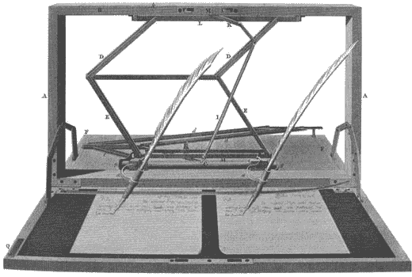

# 钱包作为一种计算隐喻

`钱包`是用于桌面或移动设备的软件应用程序，用于保存你访问 EVM 的`密钥`。这些密钥对应一个`账户`，该账户由一个长账户地址标识。在以太坊中，账户不存储你的姓名或任何其他个人信息。它们是化名的。任何人都可以通过任何以太坊客户端（如 Mist）连接到网络来生成一个以太坊账户。你可以根据需要生成任意数量的账户。

如果你已经在电脑或手机上安装了以太坊钱包或全节点，系统可能会提示你创建一个账户。钱包应用程序可能还要求你创建一个密码，用加密方式保护你的密钥。正如你所了解的，这些密钥是发送和接收以太币的重要组成部分。

让我们从查看你的账户地址开始，这个地址也称为`公钥`。你的公钥有一个与之匹配的`私钥`，用于访问你的账户。这个私钥必须保密，并且不得在任何地方公开。

比特币和以太坊中的账户都由长的十六进制地址表示。一个以太坊地址看起来像这样：

```
0xB38AA74527aD855054DC17f4324FE9b4004C720C
```

在比特币协议中，原始的十六进制地址以 base58 编码，并包含内置的版本号和校验和，但底层看起来与以太坊地址类似。以下是一个比特币地址示例：

```
1GDCKfdTo4yNDd9tEM4JsL8DnTVDw552Sy
```

要接收以太币或比特币，你必须向发送方提供你的地址，这就是它被称为`公钥`的原因。当然，这些字符串并不好记。如果你刚接触编程，你可能会好奇这到底是怎么回事；为什么会有这么难处理的字母数字乱码？有经验的程序员可能已经知道，这些公钥和私钥是非对称密钥密码学的一部分。

## 你的地址是什么？

为什么账户地址——这些地址本应是公开的，有些人甚至将其列在自己的网站上——由如此长且晦涩的字符串组成？为什么我们不能直接使用用户名？

答案是，在不久的将来，你很可能能够生成纯英文的用户名，但它们的功能更像是今天的顶级域名。你将从一个去中心化的网络注册商那里租用一个名称，它会重定向到你真实的账户地址，就像顶级域名重定向到 IP 地址一样。

以太坊网络有很多计划正在推进中，最终将复制我们今天所知的 HTTP Web 的便利性。要了解更多关于以太坊路线图的信息，请跳转到第 11 章。

#### 注意

一个`账户`是一个数据对象：区块链账本中的一个条目，通过其地址索引，包含该账户状态的数据，例如其余额。一个`地址`是属于特定用户的公钥；它是用户访问其账户的方式。在实践中，从技术上讲，地址是公钥的哈希值，而不是公钥本身，但为简单起见，最好忽略这一区别。

在 EVM 中，网络使用非对称密码学来生成和识别有效的以太坊地址，并“数字签名”交易。在安全通信中，非对称密码学用于`加密`私人通信，这样即使被敌人截获，也无法被读取。在区块链中，原理是相同的；这是一种确保消息（以 EVM 交易请求的形式）来自实际地址持有者、而非试图劫持资金的闯入者的方法。

## 我的以太币在哪里？

需要注意的是，以太币并不存储在任何特定的机器或应用程序中。任何运行以太坊节点或钱包的计算机都可以查询你的以太币余额，也可以发送或接收以太币。即使存放你 Mist 钱包的计算机被毁，也无需害怕：你只需要你的私钥，就可以从另一个节点访问你的以太币。

然而，如果你将私钥交给别人，那个人就可以访问 EVM 并提取你的资金，而你却毫不知情。就网络而言，*任何拥有你私钥的人就是你*。

因为 EVM 是一个全球性的机器，它无法知道你会从哪个节点创建交易。与今天的 Web 应用程序不同，以太坊不会寻找“受信任”的计算机；它无法区分你的手机和其他手机。如果这听起来不寻常，可以把它想象成一个银行 ATM 系统，它为任何持有你借记卡号码和四位 PIN 码的人提供账户访问权限。

正如第 1 章所述，如果你的手机或电脑被偷或损坏，*并不意味着你失去了你的钱*，前提是满足以下条件：

-   你已经备份了你的私钥。
-   你没有将私钥交给任何人。

备份私钥就像将其复制并粘贴到文本文件中，然后保存在 U 盘上一样简单。或者写在一张纸上。你将在本章后面找到更多备份私钥的方法。

## 银行柜员隐喻

从某种角度来说，使用钱包或全节点就像坐到银行柜员的办公桌后面，自己掌控自己的资金。这并不是说你可以拿到纸质现金，而是说银行柜员*控制着银行计算机系统中的一个节点，该节点可以在一个全球交易数据库中执行交易*。柜员控制着银行的数据库，该数据库与其他银行数据库相连。

在传统银行业中，延伸开来，纸质支票是一种书面指令，指示银行柜员使用银行的计算机系统进行交易。支票上有你的账号和路由号码。（我们将在下一章中更详细地讨论传统银行系统。）

目前，只需要指出一点很重要：需要一整栋楼的人（加上大量的计算资源）才能将你的纸质支票转换为电子交易，将交易发送给另一方，然后更新双方的余额。在加密货币中，这种传统的银行系统——一种人工和计算机流程的混合体——通过使用运行在对等计算机网络上的算法共识引擎而被完全取代。交易的结算和清算在交易被节点数字签名并广播后的几秒钟内（或者在比特币中是几分钟内）就在网络本身上完成。因此，可以说在加密货币交易中，“结算即是交易”。


### 在加密货币领域，你自主持有资产

加密货币与传统银行使用的中心化法定货币不同。你的代币是虚拟的，你的余额（以及所有其他持有以太币的人的余额）由区块链网络记录。没有有形的以太币或比特币货币，尽管有第三方创建了预装加密货币的“收藏币”。

对任何提供持有、存储或托管以太币、比特币或其他加密货币的在线服务或组织，都要极度警惕。分布式公共系统的优势在于消除交易中的对手方风险，并使各方能够点对点进行交易。关键在于，你可以在没有托管人的情况下安全地持有这些资产。

话虽如此，我们仍生活在一个法定货币的世界。即使加密货币确实是未来（正如你将在这本书中看到的，有大量证据表明它们就是未来），但或许几年或更长时间将是一个过渡期，在此期间人们同时拥有加密货币钱包和传统银行账户。

总结一下：*不要使用任何代你持有私钥的钱包或在线服务*。只使用那些将私钥存储在你设备上的应用程序。在本章的后面部分，你会找到关于桌面和移动钱包的建议。让我们回到解释 Mist 作为你进入 EVM 的第一个网关的目的。

### 可视化以太坊交易

对于新的以太坊程序员来说，可视化区块链概念的最佳方式是将它想象成一个纸质交易账本，该账本可以与世界上其他纸质交易账本同步。

当钱包应用程序试图对数据库进行更改时，最近的以太坊节点会检测到该更改，然后在整个网络中传播这个更改。最终，所有交易都会被记录在每一个账本上。

从抽象的角度来看，其工作原理类似于约翰·艾萨克·霍金斯于 1803 年获得专利的复写机。这是第一台“复印机”，尽管如今它的名字被用来指代所谓的测谎设备。这种复写机被托马斯·杰斐逊誉为当时最伟大的发明，如图 2-1 所示。就像复写机一样，区块链是一种允许许多“机器”近乎同时以相同方式更改账本状态的机制。



###### 图 2-1. 复写机在原理上与区块链相似：许多机器协同工作，将相似的数据写入相似的本地数据库。在比特币和以太坊中，技术创新在于这些状态变更可能由于网络延迟而顺序错乱，而网络能够将它们协调统一到单个账本中。

如前所述，你的地址有时被称为你的*公钥*，但一个更好的比喻是一个带有唯一序列号的保险箱。私钥是整个系统中唯一命名合理的部分：它解锁你的账户并允许你将以太币转出。

*以太币*到底是什么？它只是你账户中的一个余额。当你发送和接收以太币时，实际上并没有任何东西被发送或接收。

在 EVM 中，当一个账户余额增加时，系统会确保这是因为另一个账户进行了支付，从而减少了相同的金额。这是一个封闭的系统。给自己凭空创造免费以太币几乎是不可能的，至少这种伪造账本的尝试得不偿失。以太坊使用经济激励和惩罚措施来保证安全，正如你将在第 7 章中看到的那样。

## 与银行业历史的决裂

以太坊协议最有趣的方面之一是其发行机制，这将在后面讨论。目前，只需指出一点很重要：与比特币一样，没有任何个人有权创造更多的以太币。这一特性与过去 400 年金融市场和央行行长们的历史形成了鲜明对比，那段历史读起来就像是一部大规模诈骗犯的编年史。

自 17 世纪末伦敦交易巷的股票投机时代以来，企业家和骗子（当时被称为*股票策划者*）就一直在出售合法或非法的企业股权。他们常常在股价上涨时秘密向自己和同伙增发新股——这在 19 世纪被美国人称为股票*掺水*。

随着时间的推移，股票投机成为大西洋两岸各个年龄段和背景的人们的消遣，现代股票市场应运而生，其流程和*对手方*作为中间人确保交易的可靠性。但即使在大萧条后通过了银行监管法规，不诚实的企业家仍然找到了方法，秘密设立股票资金池，或在公众不知情的情况下抛售所持股票——然后套现离场，任凭企业倒闭。

在现代历史上，很少有投机泡沫像 1929 年美国市场崩盘那样摧毁了如此多的财富和人类进步。然而，美国和欧洲类似的萧条时期（包括 1873-1879 年的恐慌）都是由某些因素引起的，无论是央行还是投资者自身，在大型市场中操纵了货币、股票或债券的基础数量。


