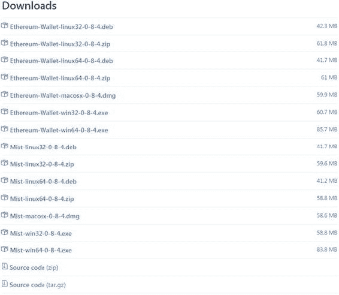
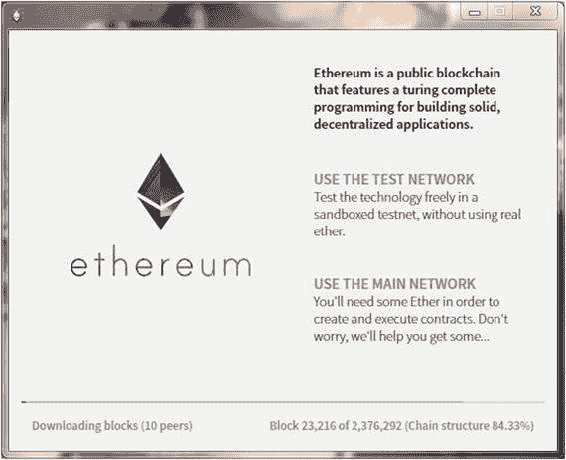
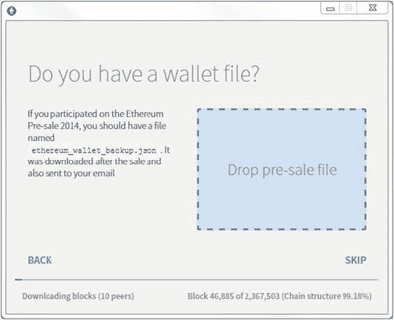
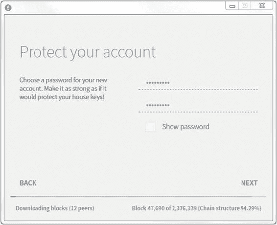
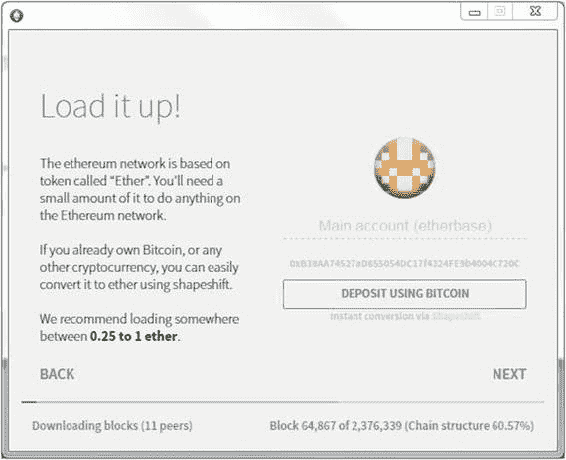
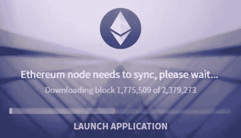
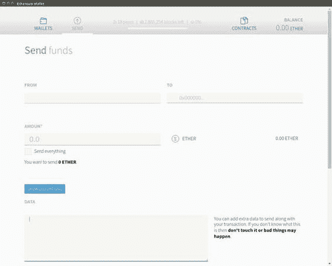
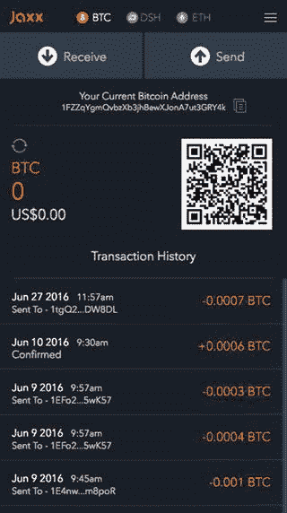

# 加密技术如何构建信任

第 1 章略过了对密码学的实质性讨论，而集中阐述了加密网络的影响。但一个由众多陌生人的电脑协同组成的网络安全可靠，这听起来有些不可思议。为什么一颗老鼠屎无法入侵网络并偷走每个人的以太币？要回答这个问题，首先需要回顾区块链使用的以下方法：

-   `非对称密码学`
-   `密码学哈希`
-   `点对点`分布式计算

让我们花点时间简要讨论一下列表中的第一项：`非对称密码学`，它有时被广义地称为`公钥密码学`。在此稍作迂回，将有助于我们更好地理解一个公共网络是如何保障安全的。我们将在第 6 章讨论另外两个要素。

`非对称密码学`是一种在网络上来回发送安全消息的方法，发送方和接收方不信任通信渠道。在以太坊虚拟机（EVM）的语境下，这些消息就是交易，它们被签名并发送到网络，以改变某些账户的状态。之所以称为“非对称”，是因为每一方都有一对不同但数学上相关的密钥。

`公钥密码学`最初是为战时通信开发的，如果使用得当，可以做到极为安全。与`对称密码学`不同，公钥密码通信不需要双方之间存在安全渠道。这一点在比特币和以太坊中至关重要，因为任何运行该协议的计算机都可以加入网络，而无需任何审查。然而，加密数据所涉及的计算复杂性使其仅适用于小型数据对象，比如形成你的私钥的字母数字字符串。这就是加密必须谨慎使用的原因。

从高层次来看，可以说以太坊使用加密技术来验证和确认，对以太坊虚拟机中账户余额所做的任何及所有更改都是合法的，并且没有账户被错误地增加（或减少）。

如果你刚接触计算机科学，加密的具体机制可能还比较模糊。为了便于理解，下面给出几个有助于后续学习的定义：

-   `对称加密`：这是一种将一段纯文本（通常包含在文档中）与一个较短的数据字符串（称为`密钥`）混合在一起，生成密文输出的过程。接收方可以逆转（即`解密`）这个输出，前提是他们也拥有同样的密钥。在没有密钥的情况下试图解码消息，从计算角度来说，极其耗时且成本高昂——以至于某些类型的加密技术即使动用庞大的计算资源，也被认为是几乎不可破解的。

-   `非对称加密`：这种信息加密方式要求程序同时生成两个密钥，一个公开，一个保密。公钥之所以公开，是因为你可以将其列在网站或社交资料上，就像电子邮件地址一样。（在通信时，双方可以使用彼此的公钥来加密信息，如下所述。）

-   `安全消息传递`：在我们的第一个例子中，爱丽丝使用鲍勃的公钥加密了一条消息。当鲍勃收到密文后，他可以用自己配对的私钥解密，确保只有鲍勃能阅读这条消息。这被称为安全消息传递。但这留下了一个危险的可能性：任何人都可以冒充爱丽丝给鲍勃发送消息。鲍勃如何确定爱丽丝是消息的真正发送者呢？

-   `安全且签名的消息传递`：如果爱丽丝想让鲍勃确信她是真正的发件人，她会采取不同的做法。首先，她用自己的私钥加密原始文本消息。然后，她再用鲍勃的公钥对结果再加密一次。当鲍勃收到消息后，他先用他的私钥解密，但得到的仍然是密文。他必须再用爱丽丝的公钥解密一次。这第二层加密确保了他确定爱丽丝就是发件人，因为按理说，除了爱丽丝，没有人拥有她的私钥。这被称为“安全且签名”的消息传递。

-   如果爱丽丝只用自己的私钥加密原始文本，那么任何拥有她公钥的人都可以解密。这被称为“开放消息格式”，因为它虽然证明了发送者的身份，但任何人都可以解密。

-   `数字签名`：为了最大程度的安全，爱丽丝还会再采取一步：她对消息的原始文本进行哈希处理，并将哈希值附在消息后面。然后她用自己私钥加密这整个数据包，再用鲍勃的公钥加密一次。当鲍勃接收并解密密文后，他可以用爱丽丝使用的相同哈希算法对爱丽丝的原始文本消息进行哈希运算。如果出于某种原因，消息的指纹结果不同，那就意味着实际的消息文本在传输过程中被破坏或篡改了。

正如你在涵盖挖矿内容的第 6 章中将更深入了解的那样，各笔交易广播到以太坊虚拟机的方式与上述数字签名的描述相似，交易内容在广播给对等节点之前会先进行哈希处理和加密。既然你已经理解了以太坊网络的安全性，那么让我们进入 Mist 安装的实质部分。

## 系统要求

大多数用户会选择 Mist 浏览器，但本节也列出了其他开发人员可能同样感兴趣的工具。Mist 可以方便地发送和接收以太币。它同时包含一个用于快速简便执行智能合约的界面。我们将在第 4 章更详细地讨论如何在 Mist 中运行合约。

Mist 在现代计算机上运行良好，要求至少 2 GB 内存和 30 GB 空闲硬盘空间。对于性能较低的机器，可以尝试使用 MetaMask Chrome 扩展。本节稍后会对其进行介绍。

你可以在以太坊项目 GitHub 网站（https://github.com/ethereum/）上找到 Mist 的最新版本。

### 关于 Eth.guide 与本书的更多信息

由于以太坊是一个快速发展的新项目，部分项目和文档链接可能会在本书出版后发生变化。为此，本书常用的链接和参考资料也列在 http://eth.guide，并会定期用新内容进行更新。同样，所有脚注链接都按章节索引在此页面上，并在链接发生变化时进行更新。

为了使该网站作为参考更有用，我们为热门主题创建了子域名。您将在正文中看到这些快捷方式的提及。

Eth.guide 网站链接到本书的 GitHub 项目，因此您也可以在同一个 URL 找到本书的示例代码项目。本书 GitHub 项目的完整 URL 是 https://github.com/chrisdannen/Introducing-Ethereum-and-Solidity。

如果你是一位刚想入门基础知识的非技术读者，请直接跳到名为“最后，进入 Mist！”的小节。开发人员请继续阅读，看看在这个以太坊旅程的阶段还有哪些其他工具值得研究。


### 面向开发者的工具

开发者除了 `Mist`，还应关注以下三种工具：

-   `MetaMask` Chrome 扩展程序（对所有人均有用）
-   `Geth`（对中级开发者有用）
-   `Parity`（对高级开发者有用）

Chrome 扩展程序 `MetaMask` 是上手使用以太坊最简单的方式。它让你无需运行完整的以太坊节点，就能直接在浏览器中执行智能合约和交易。`MetaMask` 能够创建账户、发送和接收以太币。你可以通过谷歌浏览器插件菜单下载 `MetaMask`，或访问其项目网址 [`metamask.io/`](https://metamask.io/)。

尽管 `MetaMask` 非常方便，但它不会将整个区块链下载到你的电脑上，也无法挖掘交易并赚取以太币。不过，对于只想快速上手使用以太坊的用户来说，这些都是小缺点。

`MetaMask` 由 `ConsenSys` 公司的 Aaron Davis（又名 Kumavis）构建。`ConsenSys` 是一家以太坊开发和咨询公司，在这个新兴的以太坊区块链领域，你会经常遇到其提供的免费工具。`ConsenSys` 是一家位于纽约布鲁克林的 60 人以太坊风险工作室和咨询公司，由以太坊项目联合创始人 Joseph Lubin 运营。

`MetaMask` 的部分资金来自以太坊基金会的开发资助（`DEVgrants`）。这些资助面向所有从事以太坊项目的人，且不要求项目创建者放弃任何股权。要了解更多关于 `DEVgrants` 的信息，请访问该计划的 `Gitter` 频道 [`gitter.im/devgrants/public`](https://gitter.im/devgrants/public)，或关注其 Twitter 账号 `@devgrants`。

### 命令行节点

如果你已经确定要开始使用 `Solidity` 进行开发，请下载一个完整的命令行节点。以太坊网络中最流行的命令行界面（CLI）节点是用 Go 和 C++ 编写的，它们被命名为 `Geth` 和 `Eth`（或者称为 `go-ethereum` 和 `cpp-ethereum`）。

#### 注

由于存在适用于各种操作系统的多种以太坊客户端，本书使用最直接的开发环境：运行 `Geth` 的 Ubuntu 14.04。Mac 或 Windows 用户可能想尝试安装一个可以运行 Ubuntu 实例的虚拟机，例如 `VirtualBox`。

高级开发者可能还想将 `Geth` 与 `Parity` 结合使用，`Parity` 是一个用 Rust 编程语言编写的超快速以太坊客户端。在第 6 章中，我们将讨论基本的 `Geth` 命令。

## 推荐：将 Parity 与 Geth 结合使用

`Ethcore.io` 是一家私有的以太坊开发公司，由几位曾为以太坊项目贡献过的前成员组成，其中包括另一位以太坊项目联合创始人 Gavin Wood，他创建了 `Solidity` 语言并撰写了以太坊黄皮书。¹

他和他的团队创建了一个用 Rust 编程语言编写的功能强大的节点。`Parity` 可在 macOS、Windows、Ubuntu 以及 `Docker` 实例上运行。你可以通过查看 GitHub 项目 [`github.com/ethcore/parity`](https://github.com/ethcore/parity) 了解更多信息。

#### 注

如果你计划通过你的 `Parity` 节点使用 `Mist` 钱包，你需要在打开 `Mist` 之前手动启动 `Parity`。否则，`Mist` 将通过其自身节点连接。在底层，`Mist` 浏览器运行着一个 `Geth` 节点。

关于如何设置后端的 `Parity` 与 `Mist` 钱包配合使用的详细分步说明，可在 YouTube 上由 `Ethcore` 团队提供（[www.youtube.com/watch?v=sta-p5d1blQ](http://www.youtube.com/watch?v=sta-p5d1blQ)）。

## 最后，进入 Mist！

既然你已经更清楚以太坊客户端的功能，那就让我们在电脑上安装一个吧。`Mist` 浏览器兼容 Linux、macOS 和 Windows 操作系统的 32 位和 64 位架构。如果你不知道电脑是 32 位还是 64 位，请检查系统硬件配置。大多数较新的系统都是 64 位的。

### 下载与安装 Mist

首先，从 [`github.com/ethereum/mist/releases`](https://github.com/ethereum/mist/releases) 下载 `Mist`，如图 2-2 所示。



###### 图 2-2。在 GitHub 上的以太坊项目中，点击下载适用于你操作系统的可执行文件，或下载源代码自行编译

你可以在以下网址找到这个下载链接，它与其他客户端下载链接位于同一页面：

```
http://clients.eth.guide
```

在 Windows 上，双击下载的可执行文件。在 macOS 上，打开下载的磁盘映像文件，并将以太坊钱包拖到你的“应用程序”文件夹中。在 Ubuntu 上，下载 Debian 包或解压 zip 文件并打开进行安装。

#### 注

同时运行多个节点既不可能也无优势。例如，如果你在 `Mist` 已经运行的情况下尝试打开 `Geth`，将会收到一个错误提示，告知你机器上已有一个节点在运行。


### 配置 Mist

下载并打开安装程序后，您将看到一个欢迎界面，如图 2-3 所示。（其中包含了第 1 章中提到的那些宏伟承诺！）



###### 图 2-3. 主网络也称为主链。测试网络则是一个沙盒环境，用于使用假以太币进行测试和调试合约。

在这里，系统会询问您要连接到哪条链或哪个网络。在这个阶段，选择哪个并不重要；您之后也可以切换网络。但出于我们的目的，让我们为您创建一个真实的钱包地址：点击 `Use the main network`。

请注意窗口底部，它显示的是 *downloading blocks*。此应用程序在以太坊网络上运行一个全节点；这意味着它会保留区块链的一份本地副本，并且在真正开始操作之前，必须首先下载它。这将花费很长时间，因为区块链包含了以太坊链上所有交易的记录。

接下来，您将看到图 2-4 所示的界面，如果您没有参与 2014 年的以太坊众筹，可以直接跳过。如果您参与了，请按照说明赎回您的以太币。



###### 图 2-4. 以太坊众筹于 2014 年举行，参与者有权获得代表以太币的文件。如果您未参与，请点击“跳过”选项。

在图 2-5 中设置好密码后（请记下来或记住它），您将看到一个需要解释的提示。



###### 图 2-5. 接下来，选择一个密码

#### 注意

以太坊网络中没有 `Forgot Password` 功能。这是因为您的密码仅用于 Mist 钱包的本地实例；它不会保存在以太坊区块链上。实际上，您只需要私钥就可以在任何其他运行 Mist 的计算机上重建此账户。您创建的密码仅用于保护账户，防止有人使用您的计算机并通过 Mist 界面盗用您的资金。如果您的计算机未加保护，它无法阻止任何人从您计算机的文件系统中窃取您的私钥。请采取预防措施，例如在您的 Mac、Linux 或 Windows PC 上关闭`开机自动登录`功能。

在下一个界面（图 2-6）中，您将首次看到您的 *etherbase* 地址。只要此节点及其数据完好无损，这个地址就像是这台机器的原始地址。如果您从系统库中删除了 Mist 应用程序及其数据，这个公私钥对——您的 `etherbase`——也将被删除。因此，备份您的账户是必要的，我们将在本章末尾介绍具体方法。



###### 图 2-6. 在此处您可以看到新地址。您还可以存入比特币，通过 Shapeshift.io API 将其转换为以太币。

最后，当区块链同步到您的计算机时，您将看到图 2-7 所示的界面。如果点击 `Launch Application`，Mist 界面将加载。如果您的账户没有立刻显示出来，请不要担心。当节点完全同步后，它就会显示。



###### 图 2-7. 这需要一些时间。完成后您的账户将显示出来。

### 查找您的新地址

您可以创建更多地址，但它们都将存在于这个 `etherbase` 地址的保护伞下，这使备份变得更容易。

如果您点击浏览后续界面，您会发现它们只是让您在下载区块链时了解以太坊的等待内容。如果您好奇，可以点击这些界面中的任何示例来查看合约代码。

### 发送和接收以太币

发送以太币首先需要持有一些以太币。在主网络上，代币要么需要花钱购买，要么可以通过挖矿获得。然而，对于大多数以太坊初学者来说，这是一个难以入门的方法。

我们已为您在主网络上创建了一个账户，以防您出于投机价值而想持有真实以太币，或者您已经有朋友和同事用它进行支付。对于大多数读者来说，使用测试以太币（您可以在名为 `Ropsten` 的测试网上免费生成）比花钱在主网络上购买真实以太币更好。关于如何连接到 `Ropsten` 的说明将在第 5 章中介绍。

现在，不通过实际操作，而是描述以太币如何发送和接收是值得的，因为这有助于阐明底层系统的工作方式。以太币通过 `Send` 对话框发送，如图 2-8 所示。



###### 图 2-8. Mist 中的“发送”对话框使您无需使用命令行界面即可轻松发送、接收和检查以太币余额。

发送以太币的步骤如下：

1.  在实际操作中，向接收方索要其以太坊地址。
2.  打开 Mist。点击 Mist 钱包顶部栏中的 `Send`。`Send` 对话框将打开。
3.  选择您要用来发送的钱包。
4.  粘贴接收方的地址。
5.  输入金额。
6.  点击 `Send`。

您会注意到两个可以切换的选项：一个用于输入额外文本的数据字段（例如，订单号或感谢语），以及一个用于选择交易费的滑块。交易费的目的将在第 6 章中阐述得更清楚。现在，将滑块保持在默认位置，您的交易就能顺利进行。

#### 注意

出于实际目的，在发送以太币时，您的 Mist 钱包必须完全同步。这意味着您可能需要等待一段时间让 Mist 下载区块链，然后才能确保您的交易不会出错。正如您稍后将看到的，这在技术上并非必需；最近离线的节点确实能够发起交易，但仅限于用户在命令行中创建交易，并使用关于该账户的最新信息。²

要接收以太币，您的节点不必同步。如果您想查看余额，可以安全地点击 `Launch Application` 并跳过 Mist 启动时的同步过程。


### 理解以太坊账户类型

用户通过账户与以太坊区块链交互。用以太坊的行话来说，人类创建和使用的账户称为*外部账户*。这与*合约账户*相对，后者是指由智能合约占用的地址。

> **注意：** 外部账户并非总由人类控制。有时它们由其他地方的受信任端点控制。关键在于，它们位于`EVM`之外。

如果这种区分令人困惑，请记住，合约可以代替人在以太坊网络中执行操作。你可以向他人发送价值（以太币），也可以将其发送给智能合约，智能合约将自动执行某些操作。例如，一个汇款合约可能会接收发送者的存款，将其分成三份，并分别发送给三位不同的亲属。通过这种方式，合约可以代替人类，在去中心化组织内自动执行任务，或在原本需要对手方的个人之间调解交易。

> **注意：** 合约账户和外部账户都是状态对象。*合约账户*同时拥有账户余额状态和合约存储；*外部账户*仅拥有余额状态。然而，需要注意的是，社区目前正在审查一项开发提案，旨在为`EVM`增加更多抽象层。其目的是通过将所有账户转变为智能合约自身，来抽象化当前存在的双重性。这样一来，用户就可以自由定义自己的安全模型。

回顾一些基础知识：
- 注册新账户时，会生成一个密钥对。
- 你可以注册任意数量的账户。
- 任何以太坊节点（即使处于离线状态）都可以创建账户（密钥对）。
- 地球上不存在任何密钥对或账户的主列表。
- 账户编号与你的身份、标识或计算机无关。
- 你可以在任何运行以太坊节点的计算机上，使用私钥访问以太坊网络。

### 备份与恢复密钥

在`Mist`浏览器中，当`Mist`完成与区块链同步后，请前往操作系统的“文件”菜单，选择“账户”菜单，然后点击“备份账户”。这会打开一个文件夹。文件夹内包含一些文本文件，它们的文件名很长，并以创建日期开头，例如`UTC--2016-09-01 (...)`。这些纯文本文件每个都代表一个账户。

通过将此`keystore`文件夹压缩并放置在安全位置（如`USB`密钥或加密硬盘）来备份它。

如果你打开其中一个文本文件，你会发现你的私钥和公钥对，以特定格式呈现。

要在不同于创建账户的节点上恢复账户，只需按照之前描述的方法找到`keystore`文件夹。在`Mist`中恢复以太坊账户并非复制已有的文件，而是将一个包含私钥的文本文件复制到`keystore`文件夹内，然后重启`Mist`。完整教程请访问[`backup.eth.guide`](http://backup.eth.guide)和[`restore.eth.guide`](http://restore.eth.guide)。

如果你想通过终端在硬盘上找到`keystore`文件夹，它通常位于以下目录：
-   **Mac：** `~/Library/Ethereum/keystore`
-   **Linux：** `~/.ethereum/keystore`
-   **Windows：** `%APPDATA%/Ethereum/keystore`

上述过程只会备份你的普通账户。钱包合约存储在数据文件夹中，因此（在完成后续章节的练习后）也请备份该文件夹：
-   **Mac：** `~/Library/Application Support/Mist/`
-   **Linux：** `~/.config/Mist`，或在更早版本中为`~/.config/Chromium/Mist`（该文件夹为隐藏状态）
-   **Windows：** `C:\Users\<你的用户名>\AppData\Roaming` 或 `~\AppData\Roaming\Ethereum\keystore`

每次在`Mist`中创建新账户后，务必获取密钥文件并进行备份！

### 使用纸钱包

你可能在前一节中已经注意到，以太坊节点无需在线即可创建账户。这与以太坊网络生成地址的方式有关；它可以近乎零概率地创建一个新的有效密钥对（避免重复）。

系统的这种特性使其能够提供大多数网络应用无法提供的功能：“纸质”账户。诸如`MyEtherWallet`（[www.myetherwallet.com](https://www.myetherwallet.com)）之类的网站允许用户直接在浏览器中创建密钥对，并将其存储在本地机器上。该网站还可以方便地将密钥对打印在纸上，以便安全保管。

这被称为*纸钱包*，因为它包含一个快速响应（`QR`）码，人们只需扫描纸上的`QR`码即可向你的以太坊账户存款。理论上，你可以通过这种方式收取以太坊付款，但你需要将该私钥导入`Mist`（或其他客户端）的实例中才能访问这些以太币并将其发送到其他地方。

### 使用移动钱包

目前有越来越多的针对`iOS`和`Android`平台的移动钱包应用程序，它们将私钥存储在移动设备本身。迄今为止最受欢迎且最可靠的是`Jaxx`，如图 2-9 所示，它由一家名为 Decentral 的加拿大软件公司开发。该软件可在 Mac、Linux、Windows 以及包括 Firefox 和 Chrome 在内的其他平台上运行。Decentral 由以太坊项目联合创始人 Anthony Di Iorio 运营。



> **图 2-9.** `Jaxx`可能是你在`iOS`和`Android`平台上能找到的最佳钱包应用程序。它支持比特币、以太币以及其他多种加密货币。

你在图 2-9 中看到的基本界面布局已成为钱包应用程序中相当标准的`UI`。用户会看到自己的钱包地址，并且可以以`QR`码的形式查看相同的地址。`QR`码使线下发送以太币或比特币变得更加容易，这很像 Snapchat 使用`QR`码让用户只需扫描对方的代码即可互相关注。这里有一份值得信赖的钱包应用列表：[`wallets.eth.guide`](http://wallets.eth.guide)。

在进一步讨论之前，值得一提的是，参与加密经济只需理解`QR`码即可。如果你想用移动钱包向某人发送以太币或比特币，只需点击“发送”，扫描对方的`QR`码（或粘贴其公钥），然后输入金额。他们将在几秒钟内收到以太币。


