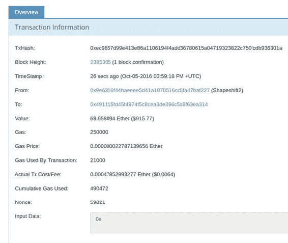

# 加密货币中的匿名性

`比特币`和`以太币`并非匿名支付工具。任何知道您公钥的人都可以查看区块链，了解您账户交易进出日期和金额。通过这些数据，他们或许能拼凑出交易模式，从而推断出您的活动。联邦当局已开始利用机器学习交易来解码诸如`AlphaBay`等暗网市场的消费模式。

新手通常会将加密货币的匿名性、保密性和隐私性混为一谈，有时会酿成灾难性后果。比特币和以太坊地址本质上是假名的；它们与您的真实姓名或信息没有关联。但您发送的每一笔交易都是公开的，从某种意义上说，任何人都可以在区块链上看到交易。这就是公共区块链因其透明度而备受推崇的原因；如果您知道某人的公钥，就可以查询其所有交易。

智能合约内部的数据是经过编码但未加密的。加密仅用于对大型数据集进行哈希处理以及验证交易发送方和接收方。不过，如果您希望以私密方式使用公共以太坊链，可以在将数据放入以太坊智能合约之前自行加密。

正如您稍后将看到的，每笔以太坊交易都为名为`Input Data`的额外文本数据负载留出了空间。除非您计划加密它们，否则不要试图在此处存储秘密内容以保安全。即便如此，在以太坊区块链上存储密码或账户 PIN 码之类的字符串通常也是坏主意，因为它是公开的且永远无法删除。任何人都可以通过一个称为*区块链浏览器*的网页访问应用程序来探索诸如以太坊之类的区块链。

## 区块链浏览器

与比特币一样，进出`EVM`的每一笔交易都会被公开记录。图 2-10 中显示的交易是以太坊区块链上的典型交易。点击发送方或接收方地址，您可以查看该地址自创建以来的所有交易。此截图来自`Etherscan`（`https://etherscan.io`），但任何人都可以为公共以太坊链制作区块链浏览器。

###### 图 2-10. 所有以太币和比特币交易都是公开的。一些用户通过为每笔交易创建新账户来避免其公钥与身份关联。另一些用户则多年使用同一个公钥，将其用作接受捐赠或其他形式贡献的渠道。

### 注意

区块链浏览器会向您展示网络中所有交易的历史记录，并允许您串联出一笔交易历史。无需手动记录您的交易详情！

如图 2-10 所示，交易具有相当多的属性。我们将在第 3 章中进一步讨论这些字段的含义，但现在需要记住的重点是：发送和接收以太币对参与方及其告知的任何人而言是*私密的*，因为公钥本质上是假名的——但这些交易并非严格意义上的*秘密*，因为所有交易在区块链上都是公开可见的。追踪资金从一个账户跳转到另一个账户很容易。

## 总结

到目前为止，我们的进度很快。在本章中，您学习了更多关于钱包和以太坊客户端的内容。如果您在读本章时就开始同步您的`Mist`实例，很可能现在都还没完成！

与此同时，让我们为部署智能合约做好准备。

虽然下一章不需要您访问`Ubuntu`机器，但提前为第 4、5、8 和 9 章做好准备也是值得的。现在，请继续阅读下一章，您将学习`以太坊虚拟机`的工作原理。