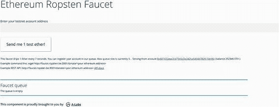
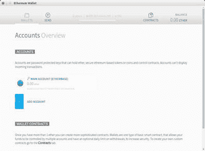
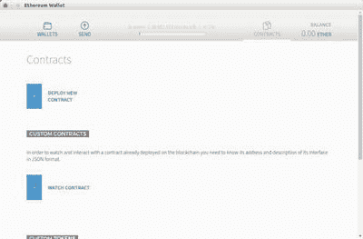
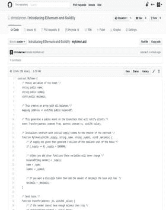
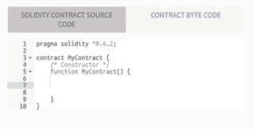
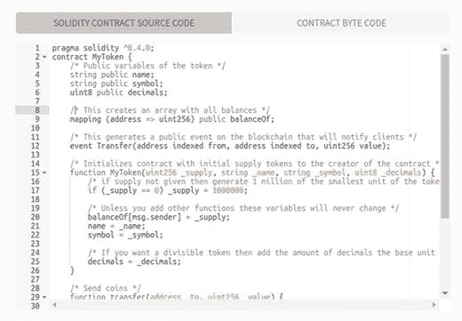
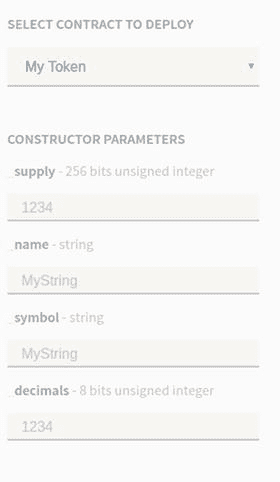
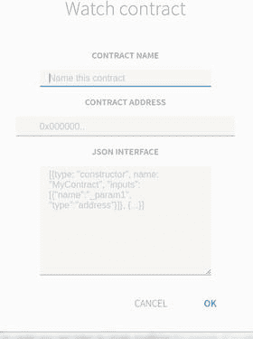
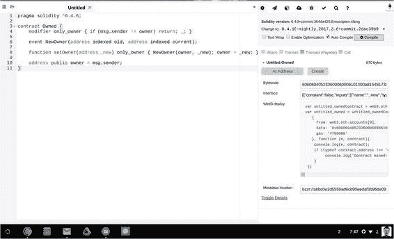

# 代币是智能合约的一种类别

总的说来，以太坊协议以其**无特性化**而自豪，这也是代币（作为概念）与智能合约（作为概念）高度重叠的原因之一。代币只是智能合约功能在`EVM`上的一种应用。

> **注意**
> 在本章中，你将部署自己的代币。代币是智能合约的一种特定（且流行）的应用。因此，`Mist`钱包让创建代币变得格外简单。目前，`Mist`中还没有其他类别的智能合约能以这种方式得到支持。

话虽如此，以太坊确实为智能合约的一种常见用例——即*子货币*（又称代币）——提供了支持。为了让用户能够快速上手运行，以太坊开发者们在`Mist`钱包中内置了一个易于使用的模板，用于快速发布你自己的代币。可以预见，未来还会有其他常见智能合约的模板。但目前，我们开箱即用的功能是在`EVM`内创建一种可以像以太币一样流通的自定义价值单位。

如果你要把这种用户友好的代币创建过程，包装成面向用户的电梯演讲，那它听起来大概会是这样的：“一种作为服务交付、具备自动账本平衡功能的超安全数字货币系统。”

现在，你已经初步领略了以太坊和比特币在开创加密收藏品与智能设备新纪元方面的历史潜力，让我们回到正题，来实际操作一下如何在现实世界中部署一个代币。

> **注意**
> 本章包含使用你在第 2 章安装的`Mist`钱包的练习。在你的机器上安装后，它可能显示为“以太坊钱包”。本书将其称为`Mist`，以区别于当前桌面和移动设备上可用的其他众多以太坊钱包。

## 作为社会合约的代币

正如你在第 3 章所学，代币有时被称为*币*。你还学到了代币本身就是智能合约。（经过足够的重复，希望这些术语能在本书结束时融入你的常用词汇！）

但代币本身（如同所有形式的货币）也可以被视为社会合约，或用户群体之间的协议。用简单的话来说，一个群体使用代币的隐含协议是这样的：“我们都同意这种代币是我们社区的货币。”这也是一种不伪造、不破坏系统的心照不宣的协议！

目前，我们拥有的最接近软件形式社会合约的东西，可能是用户在 Facebook、Twitter、iTunes 或 Gmail 等服务上创建账户时签署的最终用户许可协议（`EULAs`）。该协议通常包含禁止诸如向其他用户发送垃圾邮件等行为（这些行为会降低用户体验）的条款。

通过这种方式思考，我们可以想象，如今的数字媒体和数字商品如何可能变成未来社交网络中讨论、营销、销售和展示的*数字收藏品*，届时，像自拍和播客这样的线上产品可以以任意大小的费用进行出售、授权或出租。

## 代币是绝佳的入门应用

在创建代币时，请记住，它的价值取决于使用它的社区认为它有多大的价值。因此，向一个已经使用某种货币或代金券进行交易的现有社区发行代币要容易得多。

然而，创建子货币并非*加密资产*的唯一用途。资产的概念是非常广义的。以金融合约或智能合约形式存在的资产，可以用来代表股权份额、彩票，或者仅仅是本地经济中的代金券。其价格可以由市场决定，也可以与另一种资产挂钩。规则很大程度上由你自行决定。

> **注意**
> *代金券*一词源自*订阅*。它在历史上有多种定义，但主要指一种`IOU`（借条）。它也可以指私人货币，例如航空里程或奖励积分。本书用它来表示一种通用的记账单位：即`EVM`庞大的去中心化“算盘”所使用的“珠子”！

在以太坊中，代币存在于公共区块链之上并依赖它：你可以创建以太币的*子货币*，但以太币始终是用于支付矿工费用和燃料费的特权代币。如果你想要一个完全独立的区块链网络，你可以创建自己的私有区块链，并与主以太坊链完全断开连接。

创建子货币更简单，并且能满足大多数好奇开发者的用例。如果你所在机构有兴趣使用自己的区块链，不必担心：你将在第 8 章学习如何创建独立于以太坊公共链的私有链和加密经济体系。

## 在测试网上创建代币

在部署合约之前，你需要连接到`Ropsten`测试网，并熟悉如何发送以太币。

> **注意**
> `Ropsten`测试网以前被称为`Morden`，因此在较旧的文档中你可能仍会看到该名称。

在你的桌面电脑上启动`Mist`钱包。导航到`Mist`钱包的`Develop`菜单，你应该会找到允许你选择测试网的`Network`菜单，如图 5-2 所示。


*图 5-2. 连接到测试网*

一旦你使用测试网，你应该会看到`Mist`浏览器中高亮显示的红色警报，如图 5-3 所示。


*图 5-3. 一旦连接到测试网，你会在`Mist`用户界面中看到一个指示器*

### 从水龙头获取测试以太币

在以太坊中，设置一个*水龙头*来吐出你可以在`Ropsten`测试网上使用的假以太币是很容易的。在本节中，你不会设置自己的水龙头，而是使用一个第三方水龙头，如图 5-4 所示，其网址为`http://faucet.ropsten.be:3001/`。


*图 5-4. 以太坊测试网提供了测试以太币的发放功能，可用于编写或调试合约*

你还可以通过 [`faucet.eth.guide`](http://faucet.eth.guide) 找到指向该水龙头的实时短链接。

按照以下步骤从水龙头接收测试网以太币：

1.  在确认你的 Mist 钱包已按照上述步骤切换到测试网后，如果尚未创建地址，请先创建一个地址。将该长十六进制地址（以 `0x...` 开头）复制到系统剪贴板，然后粘贴到地址栏中。

2.  要获取以太币，请点击标有“发送我 1 个测试以太”的按钮。

如果你想测试以太币的转账功能，可以通过将测试以太币从 Mist 钱包中的一个地址转移到另一个地址来实现。具体操作是：返回 Mist，在首页视图中创建一个新的钱包地址。然后使用“发送”对话框，将以太币从一个钱包地址发送到另一个钱包地址。无论是向自己转账，还是向世界另一端的某人转账，速度几乎相同；这便是分布式系统的美妙之处。

测试网还配备了一个区块链浏览器，你可以通过它查看所有测试网交易。只需在以下测试网区块链浏览器的搜索框中输入你的一个测试网 Mist 地址，就能看到所有列出的交易记录：[`testnet.etherscan.io/`](https://testnet.etherscan.io/)。

既然我们已经在 Ropsten 链上体验了测试以太币的操作，那么接下来，让我们迈向下一步：无需编写任何代码，创建你自己的以太币子货币（也称为代币）。

#### 注意

测试网与主网络有何区别？它们是不同的链。就像一台拥有多个硬盘的计算机，你的以太坊节点可以连接到多条链。

在下一节中，你将通过复制粘贴的方式，迈向“货币即网络服务”的未来。换句话说，你将使用模板代码，创建属于自己的定制化记账与价值转移系统——一个由公共以太坊链保护的自有资产数据库！

#### 练习：无需代码创建自定义代币

创建你自己的代币大约只需 5 分钟。你只需要之前在第 2 章下载的 Mist 浏览器，以及一个文本编辑器。如果你使用 macOS、Windows 或 Ubuntu，你的计算机自带文本编辑应用，也可以选择第三方应用，例如 Sublime Text。

提醒一下，所有以太坊客户端应用（包括 Mist）的下载链接均可在 [`clients.eth.guide`](http://clients.eth.guide) 找到。

> **注意**
> 在本练习中，你将先在测试网上创建代币。请记住，所有智能合约（包括代币）在 `EVM` 上部署都需要花费费用（以太币）。在主网络上创建代币并非特别危险，但你需要支付少量真实以太币进行部署，而浪费真实货币毫无意义——无论金额多小！

如果你以前编写过程序，就会知道大多数开发环境都要求你在集成的应用套件中创建应用程序。而在以太坊协议中，你只需使用计算机的文本编辑器和 Mist 钱包，即可编写和部署应用程序。这相当惊人！

准备阶段：打开以太坊 Mist 钱包。点击右上方的“合约”标签页，如图 5-5 所示。


*图 5-5. “合约”标签页用于粘贴和部署你的合约*

1.  点击“部署新合约”选项，如图 5-6 所示。

    
    *图 5-6. 点击“部署新合约”选项以输入合约代码*

2.  导航到本书的 GitHub 项目页面 ([`github.com/chrisdannen/Introducing-Ethereum-and-Solidity/`](https://github.com/chrisdannen/Introducing-Ethereum-and-Solidity/))，找到 `mytoken.sol` 文件。复制该文件中的代码。代码内容如图 5-7 所示。

    
    *图 5-7. 在 GitHub 中查看的示例项目代码*

3.  复制这段代码。然后返回 Mist 钱包，在“部署”视图的标记为 `Solidity Contract Source Code` 的框中粘贴代码，如图 5-8 所示。粘贴时请务必替换所有内容；此处显示的内容是占位文本。

    
    *图 5-8. 粘贴合约源代码时，请替换所有占位文本*

4.  现在代码应类似于图 5-9 所示。

    
    *图 5-9. 粘贴合约代码后，你应看到屏幕右侧出现一个新的下拉菜单*

5.  现在你会看到合约名称自动加载到右侧的菜单中，名称应为 `My Token`。选中它。如图 5-10 所示的字段将会出现。

    
    *图 5-10. 粘贴合约代码后，你需要输入你的代币参数*

    > **注意**
    > 请注意每个标签后的浅灰色文本，回顾我们在第 4 章关于类型的讨论。你会看到供应量和小数位字段必须为 `uint` 类型（即正数）；其余字段可以是任意文本或数字字符串。

6.  接下来，填写这些字段：

    *   `Supply`：你想创建多少个代币？
    *   `Name`：这个代币应该叫什么名字？
    *   `Symbol`：使用键盘上的任意符号作为你的“美元符号”。
    *   `Decimals`：你是否希望像美元和美分一样，将 1 个代币分为 100 个子单位？还是 1,000 个？或是 10,000 个？

7.  设置好参数后，滚动到底部并点击“Deploy”（部署）按钮。费用滑块可保持默认值；你的代币部署未消耗的费用将被退还。

8.  在“钱包”标签页中，向下滚动到最近的交易记录，你应该能看到刚部署的合约地址。

要查看你的代币余额，你需要“关注”此代币。这是下一个练习的主题。

创建代币后，你可以将其发送给任何拥有 Mist 钱包的人，只要对方提供了他们的钱包地址。为了让对方看到代币，你需要告诉他们“关注”该代币。关于这些细节的更多信息如下所述。

#### 练习：关注代币

无论是你自己创建的代币，还是某个大型组织创建的代币，在以太坊系统中所有代币都是平等的。除非你明确指示，否则你的 Mist 钱包会忽略它们。就像你的 iPhone 不会下载 App Store 中的每一个应用一样，Mist 允许你搜索并下载你需要的代币。

从图 5-11 中的“关注合约”对话框可以看出，跟踪一个代币并不需要太多步骤。让我们开始吧。


*图 5-11. 了解代币的基本信息后，`Mist`就能跟踪你在该代币中的余额*

智能合约上传至 `EVM` 后，全世界就都可以访问它了。在`Mist`钱包的范式下，无需下载应用，尽管合约代码会被写入每个区块，从而被动下载到任何挖矿的机器上。

由于所有智能合约既作为服务提供，又大致在同一时间本地执行，这几乎就像你机器上已经拥有了整个应用商店，只需调用某个应用即可。

调用特定应用或合约最常见的场景，就是你正在探索的代币类应用。用代币术语来说，这称为*关注*一个代币。因为代币是智能合约非常常见且实用的应用，你会在`Mist`钱包中找到现成的代币关注界面。其工作原理如下：

1.  返回`Mist`中的“合约”选项卡。

2.  点击“关注代币”。

3.  粘贴代币地址。如果该代币有名称，请填写其名称。

4.  无需在 JSON 框中输入任何内容，因为`Mist`自带代币前端界面。在本章稍后部署定制合约时，你才需要在此处输入数据。

5.  点击“关注”按钮。现在，你应该能在`Mist`钱包主仪表盘中看到该代币的余额。

关注其他合约需要在区块链浏览器中搜索合约地址。以太坊链上有许多可用的区块链浏览器，你可以在[`explorer.eth.guide`](http://explorer.eth.guide)找到它们。

在本章的练习中，你将在测试网上部署合约，因此它们不会在上述浏览器中可见。浏览器类似于数据库读取器，而测试网是与主网络不同的数据库（或链），主网络用于交易真实的以太币，绝大多数区块链浏览器为其提供界面。

### 注册你的代币

只要你在诸如`Etherscan`的区块链浏览器上注册你的代币，并符合`ERC`代币标准，代币就是公开可发现的。`ERC`代表以太坊征求意见稿，它借鉴了互联网主要技术开发和标准制定机构使用的通用惯例——RFC（征求意见稿）。

除`ERC`文档外，以太坊社区开发还由以太坊改进提案（或`EIP`）主导。你可以在[`github.com/ethereum/EIPs/issues/20`](https://github.com/ethereum/EIPs/issues/20)查看标准代币可访问的所有预编程标准化函数列表。以太坊风险工作室`ConsenSys`也在[`github.com/ConsenSys/Tokens`](https://github.com/ConsenSys/Tokens)发布了免费开源的标准智能合约代码。这两个 URL 也链接在[`tokens.eth.guide`](http://tokens.eth.guide)。

## 部署你的第一个合约

以太坊协议启动时确实包含几个标准合约，但大多已弃用。截至写作时，只有代币实现了标准化，正如你刚才在`Mist`浏览器中使用代币向导部署代币所证明的那样。

不过，感谢 Gavin Wood，你有一组在 Apache 2 许可证下发布的简单合约可供实验。下面，我们将部署其中一个合约，你可以在 [`github.com/ethcore/contracts`](https://github.com/ethcore/contracts) 找到其余合约。虽然不再被视为“标准”，但下面的合约是一个有用的学习工具，因为它有效地展示了你在第 4 章中看到的智能合约所具备的某些自主性——特别是，它们如何持有你的以太币，并且只有当你提前指示时才会归还。

### 注意

回想一下，以太坊中有两种账户：第一种是智能合约账户，第二种是外部拥有账户，由密钥对控制，通常由人类或外部服务器持有。

如果没有标准合约库感觉很奇怪，不必担心。大量第三方团队正在创建标准智能合约库，其中一些甚至专门针对特定行业。包括`Solidity`示例合约、最佳实践、指南、教程和合约库在内的许多资源，都列在 [`solidity.eth.guide`](http://solidity.eth.guide)。

在首次部署合约前，请务必再次确认你确实在测试网上！无论你使用的是 macOS、Windows 还是 Ubuntu，你都会在顶部菜单栏看到“开发”菜单，如图 5-12 所示（Ubuntu 14.04 环境）。另请注意，`Mist`可以在测试网上执行挖矿。这使你能在本地测试合约。下一节将对此进行更详细的说明。


图 5-12. 再次确认你在测试网上

### 练习：5 分钟内部署一个简单合约

`Owned`合约可能是最流行的智能合约学习工具。因为它确立了 EVM 中一种基本关系：外部拥有账户与合约账户之间的关系。请明确：这些账户是独立的实体，但合约账户与外部账户之间的关系是可编程的。

回想一下，合约账户如果编程不当，可能会锁定发送给它的资金，并且无法提供任何追回资金的途径。合约没有后门，即使对创建者而言也是如此。EVM 在这方面相当不近人情！这也是为什么我们使用测试网和从水龙头获取的假以太币，在这个沙盒环境中创建合约。

你可以在 [`github.com/chrisdannen/Introducing-Ethereum-and-Solidity/`](https://github.com/chrisdannen/Introducing-Ethereum-and-Solidity/) 找到合约代码。

鉴于合约的风险特性，练习编写可由你（程序员）控制的合约非常重要。这就是`Owned`合约名称的由来：它教你如何编写一个由其他`Solidity`代码控制的小型以太币类。让我们看一下`owned.sol`：

```
//! Owned 合约。
//! 作者：Gav Wood (Ethcore)，2016 年。
//! 根据 Apache 许可证 2 发布。
pragma solidity ⁰.4.6;
contract Owned {

modifier only_owner { if (msg.sender != owner) return; _; }
event NewOwner(address indexed old, address indexed current);
function setOwner(address _new) only_owner { NewOwner(owner, _new); owner = _new; }

address public owner = msg.sender;
}
```

**注意** 在部署智能合约之前，不要忘记将 Solidity 版本杂注作为第一行添加。这不是严格必要的，但有助于避免编译器错误。

稍后你将部署`Owned`合约，届时 EVM 会返回一个合约地址。一旦上传到测试网，你可以将此合约地址粘贴到`Mist`钱包的“至”字段，并向其发送一些以太币以激活它。这会使你的外部账户成为`msg.sender`，从而成为该合约的所有者。

这意味着什么呢？该合约将永久托管在 EVM 上，并具有一个功能：它属于在该特定地址上调用它的任何个人或合约。请记住，如果其他人复制此合约并自行部署，它虽然位于同一个 EVM 上，但会存在于不同的地址。它将是同一个合约的一个独立实例。

### 同一栋房屋，不同地址

在计算领域，我们可以说，两个人在同一以太坊虚拟机（EVM）上部署完全相同、但地址必然不同的合约，大致相当于按照同一张蓝图建造两栋房屋。它们无法占据同一物理空间，但只是现实世界中同一类（或蓝图）的实例。

`Owned.sol` 是智能合约中的金毛寻回犬：调用它，它就会立刻跑过来，将自身所有权分配给你——无论你是操作外部账户的人类，还是仅仅是以编程方式调用`owned.sol`的另一个智能合约。

如果爱丽丝从印度将`owned.sol`上传到以太坊虚拟机，它可以作为一个本地脚本被访问，并因此被你从纽约上传到以太坊虚拟机的合约所扩展。很酷吧？

在最后一次部署（代币合约）中，你只是粘贴了 Solidity 代码，让 Mist 完成工作。这很酷，但有点太简单了。为了更深入地了解底层原理，让我们使用在线编译器手动将 Solidity 代码编译为以太坊虚拟机字节码。提醒一下，你可以在 [`compiler.eth.guide`](http://compiler.eth.guide) 找到该在线编译器。

在浏览器中打开编译器后，请返回本书的 GitHub 页面 ([`github.com/chrisdannen/Introducing-Ethereum-and-Solidity/`](https://github.com/chrisdannen/Introducing-Ethereum-and-Solidity/))。让我们编译并测试`Owned`合约。在 GitHub 仓库中找到名为`owned.sol`的 Solidity 脚本，打开它并完成以下步骤：

#### 注意

复制文件中的所有文本。这包括顶部的版本编译指示头。这告诉编译器该合约是用哪个版本的 Solidity 语言编写的。

1. 将此合约的文本复制到电脑剪贴板。（在 Windows 或 Linux 上使用`Ctrl+C`，在 Mac 上使用`Command+C`。）
2. 将你的代码（`Ctrl+V` 或 `Command+V`）粘贴到浏览器编译器的主文本框中。如果那里有一些示例代码，请先全部清除。你不希望那些垃圾代码出现在你干净整洁的合约中。它应该看起来像图 5-13 那样。

   

   图 5-13. 将合约代码粘贴到浏览器编译器窗口中

3. 点击“编译”按钮，你的合约将被编译。选择字节码字段中出现的字节码并将其复制到剪贴板。
4. 返回 Mist 浏览器。
5. 重复代币合约中的合约部署过程：在 Mist 钱包中，转到右上角的“合约”选项卡，然后点击“部署新合约”。将你的新字节码粘贴到“合约字节码”框中。
6. 滚动到底部并点击“部署”按钮。
7. 在“钱包”选项卡中，向下滚动到最新交易，你应该能看到刚刚部署的合约地址。
8. 像处理代币合约时一样，完成同样的“监视合约”流程。将从交易记录中获得的合约地址粘贴进去，并将合约命名为`Owned`。这次，你需要在该框中添加一些 JSON 代码。
9. 接下来，返回浏览器-Solidity 编译器，复制页面“JSON 接口”部分的内容。这会为你的合约提供一个基本的前端，基于编译器从你的 Solidity 代码中能提取到的信息。

## 与合约交互

现在你的合约已部署并在 Mist 中拥有接口，你可以激活它。要在以太坊虚拟机中调用合约，你不一定需要发送任何以太币；你可以通过向合约地址发送零以太币来调用它。砰，现在你就是所有者！如果这不起作用，请确保合约已上传到测试网络，并且你用于发送零以太币交易的 Mist 也处于同一测试网络。

对于`Owned`合约，激活是一个“是或否”的问题。你可以用零以太币或 100 个以太币调用它。在更复杂的合约中，你发送的金额对于合约被调用后的行为至关重要。

`Owned`只是一个参考合约，它可能长期存在于以太坊虚拟机中，成为一个关键的公共资源合约，接收大量的传入引用。

通过使用一个小型智能合约，你可以看到智能合约是如何被零星地组合起来构建整个去中心化应用的，这些应用通常大量使用样板代码或公共使用的实例，使最终程序员只需编写最具定制化的功能，从而减少出错空间。

## 总结

在本章中，你成功部署了两个独立的智能合约。在此过程中，你了解了可以为以太坊虚拟机编写的最基本应用——代币合约。通过使用`owned.sol`，你还思考了分布式程序的一些独特属性。现在，你应该开始看到以太坊协议有多强大，以及部署利用网络力量的合约是多么简单和容易。

接下来，值得进一步了解以太坊虚拟机网络数据库如何达成共识：一个被称为工作量证明挖矿的过程。这是下一章的主题。