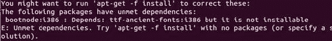
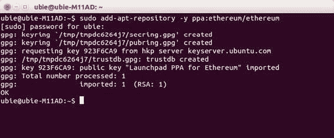
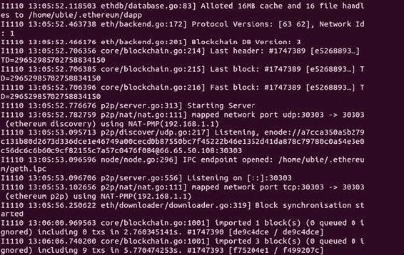
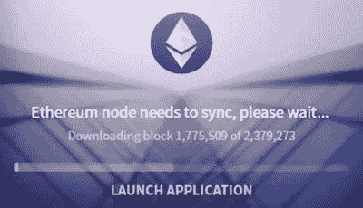

# 在 Ubuntu 14.04 上安装 Geth

要在 Ubuntu 上安装 `Geth`，请先打开终端并输入以下命令，然后按回车键：

```
sudo apt-get install software-properties-common
```

根据硬件配置的不同，此安装过程有一个注意事项：某些 Ubuntu 用户可能需要安装一个字体库，否则 `Geth` 安装会报错。你可以在 [`community.linuxmint.com/software/view/ttf-ancient-fonts`](https://community.linuxmint.com/software/view/ttf-ancient-fonts) 或 `clients.eth.guide` 找到这个字体库。错误信息如图 6-1 所示。



**图 6-1.** 部分 Ubuntu 用户可能会遇到此错误

只需安装这个字体包，一切就会顺利进行。

然后输入以下命令：

```
sudo add-apt-repository -y ppa:ethereum/ethereum
```

程序会要求你输入密码。密码可能不会显示在屏幕上，甚至看起来像是什么都没输入，但请忽略这一点，直接按回车键。你应该会看到类似图 6-2 的结果。



**图 6-2.** 输入密码以完成安装，你会看到这个结果

在终端命令前添加 `sudo` 可以以 root 用户（即 Unix 架构中权限最高的用户角色，可访问所有文件和命令）的身份执行命令。接下来，在提示符后输入以下命令并按回车键：

```
sudo apt-get update
```

然后再输入以下命令并按回车键：

```
sudo apt-get install ethereum
```

输入你计算机的管理员密码（通常是计算机启动后用于登录的密码）。当程序询问是否允许安装占用硬盘空间时，键入 `Y`（表示是）并按回车键。

接下来，让我们运行 `Geth`。安装完成后，你可以在命令提示符下输入其名称来启动 `Geth`：

```
geth
```

你会看到一些代码飞速闪过，如图 6-3 所示。



**图 6-3.** `Geth` 正在同步

如果你放任不管，这个过程会一直持续下去。按下 `Control+C` 停止同步，你将被带回到原来的命令行提示符下。至此，你已经退出了 `Geth`。

那么这里到底发生了什么？`Geth` 并没有挖矿，而是通过下载过往区块来与区块链同步。这样做是为了向你显示账户的最新余额，并像 Mist 一样快速发送和接收交易。事实上，Mist 也会进行这种同步操作，还记得吗？如图 6-4 所示。



**图 6-4.** 当 `Geth` 同步时，它执行的操作与你在 Mist 钱包中看到的相同，如图所示

然而，`Geth` 相当“笨拙”；它一次只能做一件事：同步。你无法在这里运行任何 `EVM` 代码。为了获得一些控制权，你需要利用 `Geth` 内置的 JavaScript 控制台，它允许你通过计算机终端直接在 `EVM` 中执行命令。这有多酷？