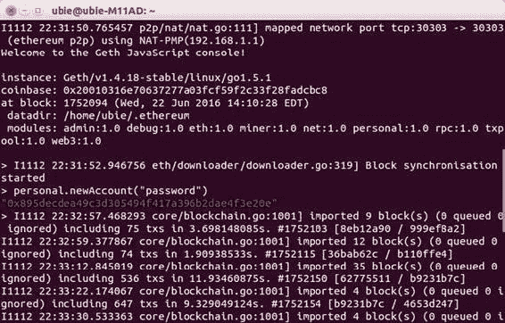
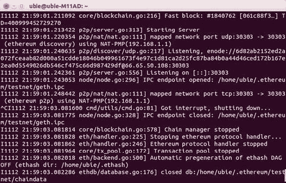
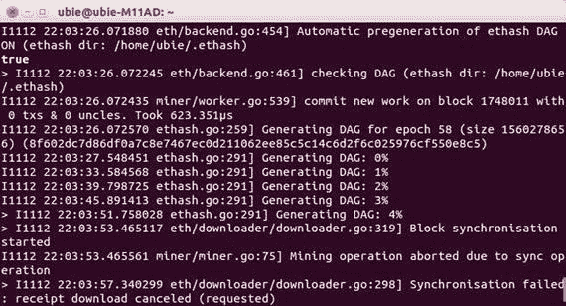

# 通过 Geth 控制台在 EVM 中执行命令

你可以在终端中使用 `Geth` 命令来执行以太坊网络上的许多基本功能。`Geth` 命令的格式如下：

```
geth [options] command [command options] [arguments...]
```

你可以在 [`github.com/ethereum/go-ethereum/wiki/Command-Line-Options`](https://github.com/ethereum/go-ethereum/wiki/Command-Line-Options) 找到命令、选项和参数的完整列表。不过，由于以太坊网络的终极目标是实现真正的分布式应用，我们将专注于通过 `Geth` 中可打开的控制台来使用以太坊 JavaScript API。这个控制台实际上是一个 JSRE，即运行在 `Geth` 内部的*JavaScript 运行时环境*。以太坊的 JSRE 暴露了完整的 `Web3.js` JavaScript dapp API，这将在第 8 章中更详细地介绍。JSRE 可以交互式使用（在控制台中），也可以非交互式使用（通过编写脚本）。

除了 dapp API，`Geth` 还支持一整套管理 API，用于远程管理你的以太坊节点。例如 `personal` 和 `admin` API，它们提供了访问文件系统、执行命令以及远程监控节点的方法。这些 API 遵循与 dapp API 相同的约定。你可以在以下地址了解更多关于管理 API 的信息：[`github.com/ethereum/go-ethereum/wiki/JavaScript-Console#management-apis`](https://github.com/ethereum/go-ethereum/wiki/JavaScript-Console#management-apis)。

> **注意：** 同时运行 `Geth` 和 Mist 会导致错误。一台机器上只能运行一个网络守护进程。

要重新启动 `Geth` 并打开控制台，请输入以下命令：

```
geth console
```

如果已经运行了 Mist 并且同步完成，你可以通过以下命令启动 `Geth`，让它使用 Mist 的节点进行连接。如果你的机器本地已经存储了大部分区块链数据，这样可以避免等待 `Geth` 重新同步：

```
geth attach
```

你可以依次调用 `console` 和 `attach`。这有什么用处呢？如果你有一个已完全同步的 Mist 客户端在运行，就可以立即开始在 `Geth` 中使用 JavaScript 控制台。目前这并不重要，但如果你使用 `Geth` 向公共区块链发送和接收真实交易，你可能需要等待它同步完成，之后才能正确返回余额查询结果。

接下来，我们将在控制台中使用一些 JavaScript API 调用。这些调用的完整指南请参考：[`github.com/ethereum/go-ethereum/wiki/JavaScript-Console`](https://github.com/ethereum/go-ethereum/wiki/JavaScript-Console)。下面，我们将通过交互式调用一些 JavaScript 方法来学习如何处理账户和余额。要了解更多关于非交互式使用 JSRE 的信息，请访问 [`github.com/ethereum/go-ethereum/wiki/JavaScript-Console#non-interactive-use-jsre-script-mode`](https://github.com/ethereum/go-ethereum/wiki/JavaScript-Console#non-interactive-use-jsre-script-mode)。

#### 注意

这些 `Geth` 命令连接到主网络。请记住，测试网拥有可用于测试的虚假以太币，而主网络则需要您在交易所购买以太币。如今通过挖矿获取以太币并非易事，但为了趣味性，我们仍将尝试一下。

您的 `Geth` 客户端应在启用控制台的情况下运行，并提供一个命令提示符。让我们通过使用 JavaScript API 调用来创建一个账户。在脑海中选定一个密码。在控制台中输入以下内容，然后按回车键：

```
personal.newAccount("your_new_account_password_here")
```

将引号内的文本替换为您选择的密码。默认情况下，您的主账户是账户 0。系统将返回一个公钥，以绿色字体显示，如图 6-5 所示。



###### 图 6-5. 在 JavaScript 控制台中创建新账户再简单不过了。您的新公钥以绿色显示。别忘了您的密码！

您可以通过输入以下命令在控制台中查看所有账户：

```
personal.listAccounts
```

毫无疑问，余额将返回为零。但没关系：此新账户的私钥将与您创建的其他私钥一起存储，存放在您在第 2 章查看过的同一目录中；当您备份其他私钥时，此处添加的任何价值都将被备份。要回顾备份流程，请访问以下链接：

```
http://backup.eth.guide
```

回想一下本节开头关于将 `Geth` JSRE 描述为以太坊 JavaScript API 网关的内容。此 API 是 `Web3.js` 库的一部分，必须在您的机器上安装该库才能使用许多命令。它可以作为 Node Package Manager（`npm`）模块、`Meteor.js` 包以及其他形式提供。您可以在 [`github.com/ethereum/web3.js/`](https://github.com/ethereum/web3.js/) 上了解更多关于此库的信息。有关 JavaScript Dapp API 调用的完整列表，请查看 [`js.eth.guide`](http://js.eth.guide) 或访问以太坊 JavaScript API [`github.com/ethereum/wiki/wiki/JavaScript-API`](https://github.com/ethereum/wiki/wiki/JavaScript-API)。

对于拥有 JavaScript 编程经验的开发者来说，`Geth` 中的 JS 控制台可能比使用我们在第 4 章描述的全局变量和函数编写 Solidity 脚本更直观。`web3` 对象提供了对各种方法的访问，这些方法会让 JavaScript 开发者感到熟悉。花些时间浏览控制台维基，了解可在本地机器上运行的脚本类型，以便自动化在 `Geth` 中执行的操作。接下来，您将学习如何使用 `Geth` 连接测试网，最后，您将在主网络上启动矿工，甚至尝试挖掘一个带有自定义签名的区块。

## 使用标志启动 Geth

在 `Geth` 命令行中完成任务的另一种流行方式是使用特定标志启动 `Geth`。完整的选项列表及其对应的标志位于：[`github.com/ethereum/go-ethereum/wiki/Command-Line-Options`](https://github.com/ethereum/go-ethereum/wiki/Command-Line-Options)。

要在测试网上启动 `Geth`，请输入以下命令：

```
geth --testnet
```

您将看到类似于图 6-6 屏幕的文本输出，但此处的挖矿发生在测试网上。按 `Control+C` 停止。



###### 图 6-6. 测试网输出

如需快速访问 CLI 选项，也可使用此短链接：[`cli.eth.guide`](http://cli.eth.guide)。

截至本文撰写时，网络难度相当高，单人矿工可能需要很长时间才能找到一个区块。但在下一节中，我们仍将开始向我们的新钱包地址挖矿，以了解保护网络安全的矿工的体验。

## 启动您的矿工！

`Geth` 不会自动开始挖矿；您需要发出命令来启动或停止挖矿。在这些示例中，您将使用机器的 CPU 进行挖矿。使用 GPU 挖矿效率更高，但设置稍复杂，且更适合专门的矿机。我们将在本章后面讨论这些。

要在主网络上开始挖矿，请打开一个新的终端窗口，并通过输入以下命令进入 JavaScript 控制台：

```
geth console
```

您将看到节点开始同步，但很快会返回一个命令行提示符，您可以在 `Geth` 后台工作时输入命令。

#### 注意

在控制台中，如果挖矿或同步的输出文本似乎覆盖了您的命令，请不要担心；这只是显示问题。当您在控制台中按回车键时，您的命令将照常执行，即使它看起来已经断成了几行。

为了获得报酬，您需要告诉您的节点用于接收挖矿付款的以太坊地址。请记住，因为 EVM 是一个全球性的虚拟机，它不关心您输入的以太坊地址（或公钥）是在您的本地计算机上创建的，还是当前与其关联的。一切都相对于 EVM 而言。

要设置您的 `etherbase` 作为付款接收地址，请在控制台中输入以下命令：

```
miner.setEtherbase(eth.accounts[your_address_here])
```

要最终开始挖矿，请输入以下命令：

```
miner.start()
```

砰！您的矿工将开始工作。万一您找到了一个区块，您的付款将发送到您上面设置的地址，但如果需要几天甚至几周，请不要感到惊讶。您将看到节点生成 DAG 文件并开始挖矿过程，如图 6-7 所示。为什么以太币挖矿不是立竿见影的赚钱方式？这很大程度上与您的硬件有关，如下所述。



###### 图 6-7. 矿工准备挖矿

您可以通过输入以下命令停止此过程：

```
miner.stop()
```

接下来，您将为您挖到的区块添加个人标记，仅此而已。

#### 练习：将您的名字添加到区块链

使用 JavaScript 控制台，您可以添加额外数据——总共 32 字节，足以写入一些纯文本或输入一些密文供他人阅读。

在控制台中，您的矿工应已停止。现在输入以下 JavaScript 命令，在引号内填入您的姓名或一条消息：

```
miner.setExtra("My_message_here")
```

然后输入以下命令：

```
miner.start()
```

控制台将返回 `true` 并开始挖矿。如果您找到了一个区块，它将被标记上您的签名，您可以在任何区块链浏览器（如 Etherchain [`etherchain.org`](https://etherchain.org)）上查看。

#### 练习：检查您的余额

按照上一节的描述安装 `Web3.js` 库（[`github.com/ethereum/wiki/wiki/JavaScript-API#adding-web3`](https://github.com/ethereum/wiki/wiki/JavaScript-API#adding-web3)），以尝试一些以太坊 JavaScript API 调用。这些调用包括检查余额、发送交易、创建账户以及各种其他与数学和区块链相关的函数。例如，如果您的 `etherbase` 私钥保存在您的机器上，您可以通过在控制台中输入以下命令来获取余额：

```
eth.getBalance(eth.coinbase).toNumber();
```

希望到现在为止，您对挖矿已经有了一个实用的理解，并且亲眼目睹了它的发生。实际上，观察挖矿如何推动状态转换和执行合约的最有效方式是在测试网上进行操作。