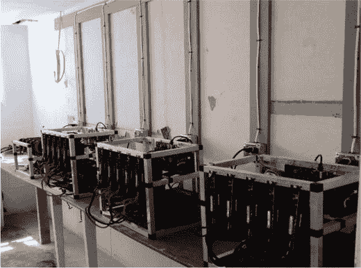

# GPU 挖矿设备

大多数以太币挖矿是由专门的 GPU 矿机完成的，如图 6-8 所示，这些矿机由作者本人操作。图中所示的两台机器运行着 Claymore Dualminer，这是一款由 Bitcointalk.org 论坛成员 Claymore 编写的自定义挖矿程序，它可以在多 GPU 设备上同时挖掘以太币和另一种加密货币。你可以在 [`bitcointalk.org/index.php?topic=1433925.0`](https://bitcointalk.org/index.php?topic=1433925.0) 了解更多关于 Claymore Dualminer 的信息。



###### 图 6-8. 作者地下室中运行的四台以太坊矿机

图中显示的第三和第四台设备运行的是 ethOS，这是一个专门为挖掘以太坊、Zcash 或门罗币的设备创建的 Linux 发行版。如果你是从零开始搭建，这是一个简单得多的解决方案。你可以在 [`ethosdistro.com`](http://ethosdistro.com) 了解更多关于 ethOS 的信息。

Windows、macOS 和 Ubuntu 上都有一些软件补丁可以支持多 GPU 挖矿。不过，在 Ubuntu 上实现最为简单。

如果你运行的是 Ubuntu 并且想用多个 GPU 挖矿，使用 AMD 硬件是最简单的。一旦你的显卡物理安装好，只需几条简单的命令即可。在 Ubuntu 14.04 中，打开终端并输入以下内容：

```
sudo apt-get -y update
sudo apt-get -y upgrade -f
sudo apt-get install fglrx-updates
sudo amdconfig --adapter=all --initial
```

然后重启。接下来，通过输入以下终端命令启用 OpenCL：

```
export GO_OPENCL=true
export GPU_MAX_ALLOC_PERCENT=100
export GPU_SINGLE_ALLOC_PERCENT=100
```

你可以再次打开终端并输入以下内容来检查配置是否成功：

```
aticonfig --list-adapters 
```

你应该会看到一个列出了你 AMD 显卡的列表。带有星号（`*`）的显卡是电脑的默认视频输出。如果你看到黑屏，你的显示器可能接错了显卡。

## 在矿池中使用多 GPU 挖矿

现在才开始认真考虑通过挖矿盈利可能有点晚了。本章开头已经介绍了网络难度的概念。正如我们已经讨论过的，网络难度已经相当高，以太坊的有效挖矿期将在 2017 年或 2018 年的某个时候结束。挖矿奖励的竞争非常激烈。你可以将你的矿机找到主区块的几率视为你的矿机算力与网络难度的比值。以盈利为目的的矿工试图通过使用强大的硬件来获得优势，从而提高他们的成功率。

随着以太坊越来越流行，时间的推移以及网络上挖矿算力的增加，挖矿对大多数用户来说变得越来越没有吸引力。然而，学习以太坊挖矿的工作原理仍然可以是有趣和有用的，即使只是为了将来挖掘新的加密货币。如果你有可用的硬件，没有理由不尝试一下挖矿，尽管在某些地方直接购买以太币可能比挖矿更便宜。

如果你访问 [`mining.eth.guide`](http://mining.eth.guide) ，你会看到有几个矿池，但为了方便起见，我们将使用一个名为 QtMiner 的程序，它适用于 Ubuntu 14.04，你可以从 [`ethpool.org/downloads/qtminer2.tgz`](http://ethpool.org/downloads/qtminer2.tgz) 下载。

下载完成后，解压存档并使 `qt.miner` 脚本可执行：

```
tar zxvf qtminer.tgz
cd ./qtminer
chmod +x qtminer.sh
```

最后，使用以下命令启动 QtMiner，其中 `address` 是你希望接收挖矿奖励的以太坊地址，`name` 是这个特定挖矿设备的名称：

```
./qtminer.sh -s us1.ethermine.org:4444 -u address.name -G
```

要查看你的收益而无需打开同步可能需要很长时间的 Mist，请前往 Ethermine.org 并在右上角的搜索框中输入你之前包含的同一个以太坊地址。

## 总结

在本章中，你处理了以太坊协议中最复杂的方面：挖矿过程。你了解了矿工如何获得报酬、报酬是多少，以及系统如何确保没有任何一个拥有先进设备的单个矿池能够主导网络。你安装了 Geth 并开始在命令行执行 JavaScript 方法。你从测试网络挖矿开始，逐步发展到在矿池中进行多 GPU 挖矿。如果你想查看所有这些因素在实时链上工作的动态画面，请访问 [`ethstats.net`](https://ethstats.net) 。

让我们通过一个从头到尾的简短总结，将你本章学到的内容整合到前几章中：

以太坊中的一个区块是给定 12 到 15 秒间隔内发生的交易记录。每次节点与网络同步时，它都会从附近节点下载区块，然后将它们组装成一个数据结构，以便计算和验证根哈希。因此，它可以信任自己拥有准确的区块链历史，并且可以安全地开始挖掘新区块或发送新交易。这就是你在安装 Mist 和 Geth 时瞥见的同步过程。

在下一章中，你将了解使工作量证明挖矿如此能够抵御攻击的经济激励和抑制因素。这个新兴领域被称为*加密经济学*。


