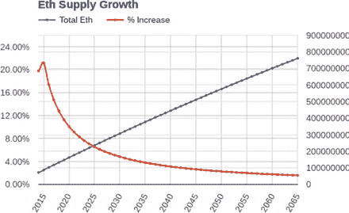

# 以太币发行方案

以太币由网络产生，用于支付给矿工。然而，部分以太币在 2014 年中期进行了预售，以启动网络资金。大约有 6000 万个`ETH`以每个比特币兑换 1000 到 2000 个`ETH`的价格售出。（其中约 10%分配给了以太坊基金会，另外 10%在预售时作为储备保留。）

从预售开始，系统将每年以矿工奖励的形式发行 1560 万个以太币。以太币的发行永远不会停止，但每年发行的数量占总体供应量的百分比会越来越小。如图 7-1 所示，曲线在 2014-2015 年间的微小上升指示了预售期。

### 图 7-1. 以太币的供应是通胀性的，但这未必会反映在价格上

因此，以太币的发行方案在数量上（而非价格上）直到大约 2025 年都是通胀性的，此后数量上将转为通缩性。以太币的价格由市场决定，主要取决于对 EVM 计算时间的需求。就像汽油一样，价格波动更多地与人们的使用量有关——或者是谁在通过交易操纵价格！