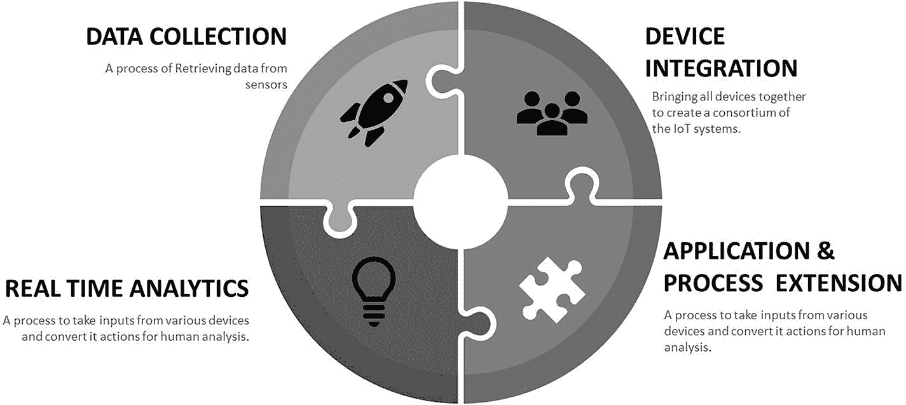
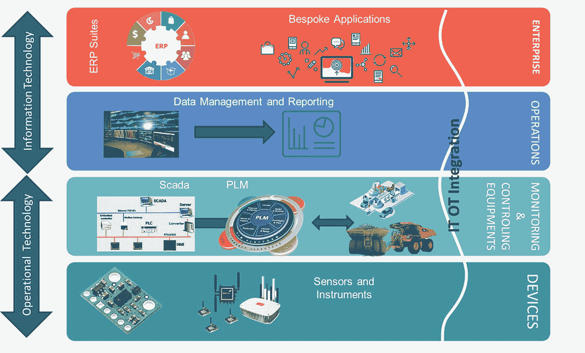

# 1. 入门指南

技术已经存在多年，随着时间的推移，新时代的技术彻底改变了 IT 行业。现代社会被称为“数字时代”，因为越来越多的技术相互叠加，并发展成更强大的形态。随着未来技术的进一步发展，消费者和企业都期待看到更多的增长机会。

对于某些企业而言，“数字化”仅仅关乎技术。对于另一些企业来说，数字化是一种与客户互动的新方式，而对于极少数企业，它则代表着一种全新的业务模式。尽管所有这些关于数字化的定义在各自语境下都是正确的，但这种多元化的视角常常让领导团队感到困扰，因为这反映出他们在企业需要前进的方向上缺乏一致性和共同愿景。这往往会导致零散的计划或错误的努力，从而错失良机、表现欠佳，甚至遭遇起步挫折。

企业和业务高管需要清晰、一致地理解数字化对他们究竟意味着什么，以及他们想要实现什么目标。因此，他们需要理解数字化对其业务的意义，并在此基础上定义相应的数字化战略或数字化转型举措，以推动业务绩效。数字化转型的目标是利用现代技术改善业务运营，或提升运营模式的效率。

尽管数字化正成为许多企业的主流趋势，但必须认识到，对于许多企业来说，遗留系统将继续存在，且无法被完全消除。数字化的核心是运用现代技术（也称为数字技术），并将其与遗留系统集成，使现代与遗留部分能够协同工作，以交付业务成果。例如，工厂中的遗留设备在未来几十年内仍会继续使用，企业应能通过数字技术，在尽可能少改动的前提下，将这些现代技术与遗留设备相结合，从而创造价值。

实现数字化要求企业以开放的态度重新审视其整个业务模式，理解新的价值前沿在哪里，以及技术如何在加速展现这种价值方面发挥关键作用。企业的数字化，本质上是重新思考如何利用新的能力、工具和技术来改善客户服务体验，同时降低 IT 成本，并提升整体运营效率。

举例来说，为了理解如何更好地服务客户，需要审视客户购买旅程的每一个步骤——无论通过何种渠道——并思考数字能力如何能够在业务的各个环节设计和交付最佳体验。例如，供应链对于开发必要的灵活性、效率和速度，以客户想要的方式交付正确的产品至关重要。同样，数据和指标可以专注于提供有关客户的洞察，进而推动营销和销售决策。

为了提高效率，企业可以利用数字技术了解当前的运营状况并引入自动化。例如，利用物联网实时监控能源消耗，使制造商能够检测非高峰时段的能耗、优化生产排程、识别异常，并抓住节省成本的机会。再比如，通过对同类设备或相似场地进行基准比较，制造商可以发现运行不正常的系统，从而识别出隐藏的运营低效和能源浪费问题。

在降低 IT 成本方面，企业需要了解现有 IT 格局在价值与成本之间的对比情况，以及市场上存在哪些因素可以降低其资本支出和运营支出，例如，云计算是实现这一目标的最大机遇。除了降低成本，自动化在确保运营效率持续提升方面也发挥着关键作用。随着越来越多的自动化得以实现（无论是在客户旅程、业务流程流自动化、运营还是开发领域），企业都将看到业务效率的提升和总拥有成本的降低。人为错误导致的缺陷将减少，企业将从主动监控转向主动审计。最终，这意味着人类在日常服务监控上投入的精力将减少，而更多的时间将用于审计以确保一切正常运行。

### 定义

-   `主动监控` 意味着有一个全职团队持续监控错误。与主动监控相对，`主动审计` 意味着在预定义的特定时间间隔内检查错误。`主动审计` 不需要专门的团队，因为大多数检查是自动化的并由机器执行。如果发现错误，会自动进行修复，以确保未来不再发生同样的错误。
-   `开发` 是创建新软件、产品或基础设施的过程。这包括规划、创建、测试和部署信息系统的过程。
-   `维护` 或 `运维` 是维护已开发的软件、产品或基础设施的过程。运维不仅仅是修复缺陷，还包括在交付后修改软件产品或基础设施以纠正故障，以及改进性能。一些小的功能增强也作为运维的一部分进行。

数字化并非一次性交付某个客户旅程，或一次性改善总拥有成本。它是一个持续改进的过程，在这个过程中，流程和能力会根据行业或客户的输入不断演变。这有助于培养持续的产品或服务忠诚度，而为了实现这一点，企业需要创建正确的数字基础，以使组织能够实现其业务目标。数字基础的核心在于利用技术和组织流程，让企业能够以完全的敏捷性开展业务。

## 为未来设计业务

在评估业务转型战略时，有四个关键支柱对于指导组织的思考至关重要。它们如下所示：

-   **正确的商业模式** – 实现数字化并非简单地将现有产品或客户互动及体验迁移到线上。在数字经济中取得持久成功意味着从根本上重新思考当今的业务运作方式。组织通过集中化目录将产品推向市场，并转向提供全新的消费模式（例如普及的数字服务和订阅，而非一次性购买），再加上消费者如今购买和使用产品的方式，这些都是基础性的变革。
-   **正确的合作伙伴** – 与跨行业边界的数字伙伴合作的企业，在不断变化的数字世界中能实现远超任何单个企业独自所能达成的成就。为了实现这一点，企业现在必须与众多现有系统和第三方系统集成，精简并简化业务流程，并开发能降低运营风险和支出的高效改进措施。共享知识和独特经验以开发新的应用程序、产品和服务将变得至关重要。
-   **正确的技术** – 并非所有平台生来平等，那些未能明智而勇敢地做出选择的企业将痛苦地认识到这一点。当数字竞争对手以极低的成本运营时，遗留系统基础设施的维护、集成和运营成本将变得高得令人望而却步。然而，并非所有遗留系统都能被替换，每个企业都需要在遗留系统与数字系统之间找到恰当的平衡点。
-   **正确的心态** – 无论客户是谁，从消费者到供应商再到合作伙伴，提供不断演进的客户体验对于数字化成功至关重要，但这只是成功的一半。为了生存并（最重要的是）蓬勃发展，数字文化必须融入组织的各个层级，以灌输数字经济所要求的敏捷性和持续学习的心态。这需要改变企业员工队伍和运营模式。

数字化转型没有放之四海而皆准的方法；每个组织的战略都将是独一无二的。然而，专注于在这四个支柱之间平衡活动，为成功转型提供了指南针。

## 物联网作为数字化推动力

物联网（`IoT`）是讨论最广泛的数字技术之一，它承诺为企业带来巨大价值。物联网的核心是通过互联网连接设备，使它们能够相互通信，并与众多不同的系统、应用程序等进行交互。一个典型的例子是智能冰箱。利用物联网，冰箱可以告诉我们牛奶没了，如果其内置摄像头看到没牛奶了或牛奶盒已过保质期，它还可以发短信通知我们。所有这些都通过物联网成为可能，这也是物联网日益普及的原因之一。当我们谈论物联网时，它涉及到硬件和软件之间的相互通信。

物联网系统中使用的硬件包括用于远程仪表盘的设备、用于控制的设备、服务器、路由设备和传感器。这些设备管理关键任务和功能，如系统激活、动作规范、安全性、通信和检测，以支持特定的目标和行动。

物联网中使用的软件包括从硬件设备收集数据的系统。物联网软件通过平台、嵌入式系统和中间件来处理网络和行动的关键领域。这些单独的应用程序负责数据收集、设备集成、实时分析以及物联网网络内的应用程序和流程扩展。它们利用与关键业务系统（例如，订单系统）的集成来执行相关任务。这些术语将在后面进一步解释。

工业物联网（`IIoT`）和医疗物联网（`IoMT`）是物联网领域另外两个最广泛使用的术语。`IIoT` 是制造业技术中自动化和数据交换的当前趋势。它包括信息物理系统、物联网和云计算。工业 4.0 创造了所谓的“智能工厂”。`IoMT` 则是指医疗物联网。`IoMT` 是一个由医疗设备、软件应用程序以及健康系统和服务组成的互联基础设施。

无论我们谈论的是 `IIoT` 还是 `IoMT`，将 IT 系统与运营技术整合总是首要任务。简言之，这被称为 `IT-OT` 融合。

高德纳咨询公司（Gartner, Inc.）预测，企业和汽车物联网市场^(¹) 将在 2020 年增长至 58 亿个端点，比 2019 年增长 21%。到 2019 年底，预计将有 48 亿个端点投入使用，比 2018 年增长 21.5%。从物联网的角度来看，端点是一种物理计算设备，它作为互联网连接产品或服务的一部分执行某项功能或任务。例如，端点可以是可穿戴健身设备、工业控制系统、汽车远程信息处理单元，甚至是个人无人机单元。

公用事业将是物联网端点的最大用户，2019 年总计达到 11.7 亿个端点，并在 2020 年增长 17%，达到 13.7 亿个端点。据预测，住宅和商业领域的智能电表将推动物联网在公用事业中的应用。物理安全将成为 2020 年第二大物联网应用场景，其中建筑入侵检测和室内监控的用例将驱动其数量增长。^(²)

构成物联网生态系统的四个核心要素如图 1-1 所示。

**图 1-1** 物联网生态系统中的四个核心要素

**数据收集** – 这是从传感器等来源检索数据的过程。它使用某些协议来帮助传感器连接实时、机器对机器网络。然后，它从多个设备收集数据，并根据设置进行分发。它也反向运作，将数据分发到设备上，系统最终将所有收集的数据传输到中央服务器。

**设备集成** – 设备集成软件将所有设备整合在一起，形成物联网系统的联合体。它确保了设备间的必要协作与稳定联网。

**实时分析** – 这些应用程序从各种设备获取数据或输入，并将其转化为可执行的操作或清晰的人类可分析模式。它们基于多种设置与设计分析信息，随后手动或自动执行相应操作。

**应用与流程扩展** – 应用程序扩展了现有系统和软件的范围，以实现更广泛、更高效的系统。它们为特定目的集成预定义设备，例如允许某些移动设备或工程仪器接入。这有助于提升生产力并实现更精确的数据采集。

根据以上讨论，不难看出物联网不仅涉及设备本身，更是信息技术与运营技术的融合。

### 定义

`车间` 是指工厂、机加工车间等场所中人们操作机器的区域，或是零售场所中商品销售给消费者的空间。

运营技术（`OT`）侧重于对工业运营进行管理、监控与控制，重点关注车间中用于产品生产的实体设备与流程。

信息技术（`IT`）涵盖计算机、存储、网络设备及其他实体设备与基础设施的使用，以及用于创建、处理、存储、安全保护和交换各类电子数据的流程。

### 运营技术概述

`OT` 关注的是（重型）机械、人员安全等方面。对于停机、错误和安全问题几乎采取零容忍态度。这也是 `OT` 始终以高度规避风险方式运行的核心原因之一。`OT` 的另一个特点是工厂部署的机械设备无法像 IT 系统那样以相同速度升级或更换，一旦购买便会使用多年。这成为在这些机械上部署创新理念以提升效率的阻碍。另一方面，大多数机械设备全年无休、每天 24 小时运行，为了升级或改造而停机几乎是不可能完成的任务。

在面向消费者的 `OT` 领域，过去几年取得了巨大进步。例如，过去我们使用模拟手机，现在几乎人人都在用智能手机。以前我们开手动挡汽车，而现在许多人已改用电动车或自动挡汽车。

然而，非面向消费者的 `OT` 领域几乎毫无改变——例如在采矿业，几十年前人们使用锤子、凿子、镐头和铁锹，至今依然如此。同样，在制造业，多年前使用传送带、喷漆机器人、焊接机器人等设备，时至今日仍是同样的设备。变革未能发生的三个关键原因是：

-   **安全性** – 安全是为了预防或降低工伤、疾病和死亡风险，因此在 `OT` 领域至关重要。安全意味着让人们免受身体伤害，对安全妥协零容忍。
-   **可靠性** – 可靠性定义为组件（或整个系统）在其设计环境中运行时，在规定时间内执行其功能的概率。
-   **变更或升级的成本与风险** – 机械变更成本相当高，且由于机械设备几乎不容许停机，升级也难以管理。其次，升级失误可能导致可靠性问题。这也是 `OT` 领域倾向于避免快速补丁、软件更新等操作的原因之一，因为它们可能引发安全或可靠性隐患。

对 `OT` 系统（如制造业或采矿设备）进行改造面临诸多挑战。然而，随着企业从物联网中获益越来越多，他们渴望变革，但安全和安保是不可妥协的要求。一个规划不当的变更（甚至简单如杀毒软件更新）都可能给工业网络带来足够大的中断风险，令 `OT` 专家胆战心惊，因为管理不当的变革可能危及人员生命。

`IT/OT` 融合或 `IT-OT` 集成是指信息技术（`IT`）系统与运营技术（`OT`）系统的整合。`IT` 系统用于以数据为中心的计算；`OT` 系统则监控事件、流程和设备，并对企业和工业运营进行调整。

`OT` 设备与 `IT` 设备的主要区别在于：`OT` 设备控制物理世界，而 `IT` 系统管理数据。

`IT` 团队即信息技术团队，由数据分析师、数据科学家、开发人员和测试人员等角色构成。`OT` 团队则可能是工厂经理、生产经理，甚至农业从业者。他们是生产食物、控制石油与天然气流程、从地下抽取石油，或负责维护公司卡车车队的人员。

从长远来看，不进行必要的变革（如升级）且不采用物联网，可能会增加黑客蓄意破坏的风险。一个著名的破坏案例是伊朗的震网（Stuxnet）攻击。2010 年 1 月，国际原子能机构的检查人员在参观伊朗纳坦兹铀浓缩工厂时，发现用于浓缩铀气体的过滤器以前所未有的速度出现故障。原因完全是个谜，伊朗技术人员更换了过滤器。五个月后，一起看似无关的事件发生了。白俄罗斯一家计算机安全公司被请来排查伊朗一系列反复崩溃和重启的计算机。研究人员在其中一台系统上发现了一些恶意文件，并发现了震网病毒。另一个更近期的案例发生在去年（原文指 2014 年）的德国，黑客利用恶意软件入侵了一家钢铁厂的控制系统，并对其造成严重破坏，导致无法正常关闭。幸好没有造成人员伤亡。这两个例子表明 `OT` 系统并非完全安全，需要定期升级。另一方面，对于所有希望在市场上保持竞争力的企业而言，`IT-OT` 集成是必不可少的。

### 信息技术与运营技术融合

时至今日，`OT`（运营技术）与`IT`（信息技术）的集成程度依然非常有限。其根本原因在于，`OT`主要关注机械、人员安全以及产品制造。如今，越来越多的组织开始采用物联网技术，例如智能电表和自监控变压器。我们也看到生产线和农业设备都配备了传感器。

这些新技术的兴起，使得组织需要优化机器、应用程序和基础设施收集、传输及处理数据的方式。如果实施得当，`IT-OT` 融合将使企业能够更快地解决关键问题，做出明智的商业决策，并在物理和虚拟系统中扩展流程。图 1-2 描绘了一个物联网生态系统如何工作的简单框图。

**图 1-2** `IT-OT` 融合参考图

前两个模块是信息技术层，企业资源规划套件（如客户关系管理和销售应用程序）位于此处。来自这些工具和软件的数据被路由到数据与报告层，用于报告目的。底部两层是运营技术层。在监控与控制设备（`MCE`）层，实际的产品生产或加工过程发生。例如，汽车制造或采矿作业就在此进行，所有这些过程都由监控与数据采集（`SCADA`）系统控制。`SCADA`是一个由软件和硬件元素组成的系统，它允许工业组织：

-   在本地或远程地点控制工业流程
-   监控、收集和处理实时数据
-   通过人机界面（`HMI`）软件直接与传感器、阀门、泵、电机等设备交互
-   将事件记录到日志文件中

与`SCADA`一起，产品生命周期管理工具也是`MCE`层的一部分。产品生命周期管理（`PLM`）指的是在产品整个生命周期及供应链中，管理用于设计、工程、制造、销售和服务过程中的数据与流程。

作为物联网的一部分，所有四个层面相互集成，从而实现 `IT` 与 `OT` 之间无缝的数据和信息交换。

## 物联网面临的三大挑战

物联网项目失败的原因有几个，其中之一是缺乏针对物联网项目实施的业务战略。另一个原因是对安全性和互操作性缺乏周密的考量。尽管自过去几年以来，为解决物联网这三大挑战已做出了大量努力，但值得注意的是，我们在这些领域距离完美还有很长的路要走。

### 业务战略

一些企业通过识别物联网用例并选择技术来实现这些用例，从而开启了物联网之旅。这种零敲碎打的物联网实施方式注定会失败。物联网实施并非一项技术举措，而是一项利用技术实现的业务举措。业务举措源自业务战略。

### 物联网安全

物联网意味着融合 `IT` 和 `OT`，这是 IT 行业的一个新兴趋势，并且日益普及。在未来几年内，物联网将成为每个人的标准。然而，安全性和隐私性是当今面临的最大挑战，因为物联网涉及大量设备和传感器，这些设备和传感器收集了大量关于个人和企业的个人数据，然后将这些数据传递给 IT 系统。例如，智能电表可以知道一个人何时在家，以及个人正在使用哪些电子设备及使用时间。所有这些信息都会与其他设备共享，并由公司保存在数据库中。一些专家认为，在物联网生态系统发展的早期阶段，在构建安全性和隐私性方面做得还不够。为了进一步证实他们的观点，一些人甚至入侵了一系列设备，从[联网婴儿监视器](https://www.yahoo.com/parenting/nanny-freaks-as-baby-monitor-is-hacked-109405425022.html)到[自动照明系统](http://www.bbc.co.uk/news/technology-28208905)和[智能冰箱](http://www.theguardian.com/technology/2014/jan/21/fridge-spam-security-phishing-campaign)，乃至全市范围的系统，如交通信号灯。

2018 年的一项研究表明，55%的 IT 专业人士将物联网世界中的安全性列为首要任务。这是根据 451 Research 进行的一项调查得出的结论^(³)。从企业服务器到云存储，网络犯罪分子正在 `IT-OT` 生态系统中的许多节点寻找利用信息的方法。截至 2021 年，这些 IT 专业人士提到的许多安全挑战已得到解决，但仍有很长的路要走。

`关键基础设施`是指那些至关重要的系统、网络和资产集合，其持续运行对于确保特定企业、其经济以及员工的健康和/或安全是必需的。

有趣的是，到目前为止，黑客并未花费太多时间或精力来破解 `OT` 设备，因为还没有太多企业或个人完全使用物联网，因此这对他们来说不值得付出努力。然而，随着企业开始在日常业务中利用物联网，这将成为网络犯罪分子的一个新关注领域。安全性是物联网实施中需要解决的最重要要素之一。好消息是，在这一领域已经发展出了几种成熟的做法。我们将在后续章节中更详细地讨论这些内容。

### IoT 互操作性

`互操作性` 是指产品或系统在现在或未来，无论是在实现方式还是访问方式上，能够与其他产品或系统不受限制地协同工作的特性。

`互操作性` 仍然是 `IoT` 世界中的主要挑战之一。由于异构性，`IoT` 中的互操作性问题可以从不同角度来审视。异构性并非新概念，也不局限于某个领域。即使在物理世界中也存在多种异构性，例如，人们说着不同的语言，但仍然可以通过翻译（人或工具）或使用通用语言进行交流。同样，构成 `IoT` 的多种元素（设备、通信、服务、应用等）应无缝协作并相互通信，以充分发挥 `IoT` 生态系统的潜力。

`IoT` 环境下的`互操作性`涵盖从设备互操作性到网络互操作性、语法互操作性、语义互操作性和平台互操作性。尽管 `IoT` 供应商提供了多种解决这些互操作性问题的方案，但我们距离完美还很远，挑战依然存在。

业界试图通过标准化来应对 `IoT` 互操作性挑战。已经出现了多项努力，旨在建立标准，以提供不同提供商拥有的 `IoT` 设备、网络、服务和数据格式之间的互操作性。欧盟近期也在 `H2020` 计划下资助了多个专注于 `IoT` 平台联合的研究项目。然而，相关标准要完全达成共识并被接受（如果能够实现的话），可能需要很长时间。

好消息是，如果一个 `IoT` 项目规划得当，互操作性问题是可以解决的，从而确保当前构建的解决方案能够适应未来发展。为了设定合理的期望，互操作性应针对特定行业而非跨行业，否则将导致 `IoT` 实施的灾难。这意味着，属于 `IoT` 架构一部分的不同硬件和软件，应能在特定行业领域（如制造业、零售业或制药业）内实现互操作，以实施用例。例如，为 `IoMT`（医疗物联网）构建的`网关`应能与为医院构建的传感器和设备通信，而无需与制造业使用的传感器和设备互操作。

#### 设备互操作性

`IoT` 由各种设备组成，甚至比传统互联网还多。这些被称为“智能对象/物品”的设备，可能包含高端设备或低端设备。高端 `IoT` 设备拥有充足的资源和计算能力，例如智能手机。另一方面，低端 `IoT` 设备在能源、处理能力和通信能力方面资源受限，例如 `RFID` 标签以及微型低成本传感器等。

这些设备的关键互操作性挑战源于它们使用的各种通信协议。一些设备使用 `Wi-Fi` 技术和 `3G/4G` 蜂窝通信进行通信，而其他设备（如可穿戴设备）使用 `蓝牙`，还有像环境传感器一类的设备则使用 `Zigbee` 标准。

#### 网络互操作性

网络互操作性是指在互连网络之间持续发送和接收数据的能力，提供最终用户期望的质量水平，且不对发送和接收网络产生任何负面影响。

`IoT` 设备将要运行的网络将继续保持异构、多业务、多厂商且高度分布的特点。与台式计算机不同，`IoT` 设备通常依赖各种短距离无线通信和网络技术，这些技术更不稳定、更不可靠。

网络级互操作性涉及用于通过不同网络（网络的网络）实现系统间无缝消息交换以实现端到端通信的机制。为了使系统具有互操作性，每个系统都应能通过各种类型的网络与其他系统交换消息。由于 `IoT` 中动态且异构的网络环境，网络互操作性层面应处理诸如寻址、路由、资源优化、安全、`QoS` 和移动性支持等问题。

#### 语义互操作性

语义互操作性意味着不同的代理、服务和应用能够在 Web 上或 Web 之外以有意义的方式交换信息、数据和知识。^(⁴)

`IoT` 设备生成的数据格式各异，这阻碍了应用程序和平台的互操作性，因为它们无法解释其他设备生成的数据。

更准确地说，关于环境的有形资产生成的数据可能有定义好的数据格式（例如 `JSON`、`XML` 或 `CSV`），但其他设备的数据格式通常不同且不总是兼容。这是 `IoT` 系统面临的最大挑战。

在此背景下，迫切需要能够描述该环境中数据含义的通用词汇。为了实施能够最大程度减少 `IoT` 环境中互操作性问题的解决方案，正在定义多种标准、语言和方法，例如语义网所定义的。这些标准将确保信息交换是有意义的且含义可理解。这包括通过添加自描述信息包来实现数据中的语义。语义互操作性用于确保来自不同供应商的 `IoT` 设备具有互操作性。

尽管物联网的采用正在逐渐增加，但阻碍其成为真正普适技术的一个重大障碍仍然存在：设备能明确无误地以共享含义交换数据的能力。在这方面，万维网联盟开发了 Web 的物架构以提供语义数据交换。然而，这种架构并未涵盖所有可能的用例，并且仍然存在重要局限性。

许多平台仍未解决语义互操作性问题，这是企业在选择 `IoT` 解决方案之前需要验证的重要领域之一。

#### 语法互操作性

语法互操作性指的是数据的封装和传输机制。

与语义互操作性相比，数据不仅要在两个或多个系统之间交换，还要能被每个系统理解。语法互操作性可被视为语义互操作性的一个子集，它允许两个或多个系统进行通信和交换数据；然而，接口和编程语言可能不同，并且彼此之间无需理解对方。

语法互操作性指的是异构 `IoT` 系统实体之间交换的任何信息或服务中所用格式和数据结构的互操作。需要为每个资源定义一个接口，根据某种模式公开某些结构。`WSDL` 和 `REST` `API` 就是例子。消息内容需要序列化才能通过信道发送，并需要确定序列化格式（如 `XML` 或 `JSON`）。消息发送方使用某种语法规则（在某种语法中指定）将数据编码到消息中。消息接收方使用相同或另一种语法中定义的语法规则对接收到的消息进行解码。当发送方的编码规则与接收方的解码规则不兼容时，就会出现语法互操作性问题，导致消息解析树不匹配。

#### 平台互操作性

物联网中的平台互操作性问题源于设备与数据所涉及的多样化操作系统（OS）、编程语言、数据结构、架构以及访问机制。目前有许多专为物联网设备开发的操作系统，例如 `Contiki`、`RIOT`、`TinyOS` 和 `OpenWSN`，每个系统都有多个版本。此外，物联网平台提供商，如 Apple HomeKit、Google Brillo、Amazon AWS IoT 和 IBM Watson，也提供了不同的操作系统、编程语言和数据结构。例如，Apple HomeKit 支持其自身的开源语言 `Swift`，Google Brillo 使用 `Weave`，而 Amazon AWS IoT 则为嵌入式 C 和 `Node.js` 提供了 SDK。这种不统一性给应用开发者开发跨平台、跨领域的物联网应用造成了障碍，也导致企业陷入供应商锁定困境。

目前，还没有单一的解决方案可以解决平台互操作性问题。然而，`BIG IoT`（弥合物联网互操作性差距）项目旨在定义一种标准化的物联网生态系统，作为欧洲平台倡议的一部分。作为该项目的一部分，研究人员已经设计出一种物联网生态系统架构以实现平台互操作性，并且我们可以预期在未来几年内，将有一些符合该架构的平台被开发出来。在当前局限下，企业需要选择一个能为自身行业的特定用例提供全面解决方案的平台。

## 总结

本章我们讨论了物联网是数字化转型的最大推动因素之一。物联网的核心在于通过网络连接设备，使它们能够相互通信，并能与众多不同的系统、应用程序等进行交互。构成物联网生态系统的四个核心元素是：

1. **数据收集** – 这是从设备中提取数据的过程。
2. **设备集成** – 这指的是整合所有设备的数据。
3. **实时分析** – 这指的是具备实时分析数据的能力。
4. **应用与流程扩展** – 这指的是将物联网数据与其它应用程序进行集成。

我们还讨论了物联网项目失败的三个主要原因。第一个原因是缺乏针对物联网项目实施的商业战略，另外两个原因是缺乏对安全性和互操作性的周全考虑。尽管过去几年已为解决物联网领域的这三个挑战付出了大量努力，但我们距离完美状态仍然相差甚远。因此，企业在开启物联网之旅时，必须在可能的情况下部署特定解决方案，尽最大努力解决这些问题。在本章中，我们还讨论了工业物联网（`IIoT`），它涉及制造业中设备的自动化与数据交换，并包含信息物理系统、物联网和云计算。我们还讨论了医疗物联网（`IoMT`）。`IoMT` 是一个由医疗设备、软件应用程序以及健康系统和服务组成的互联基础设施。在下一章中，我们将讨论制定成功商业战略的重要性，以及像物联网这样强大的技术如何帮助实现这一战略。

脚注 1 2 3 4