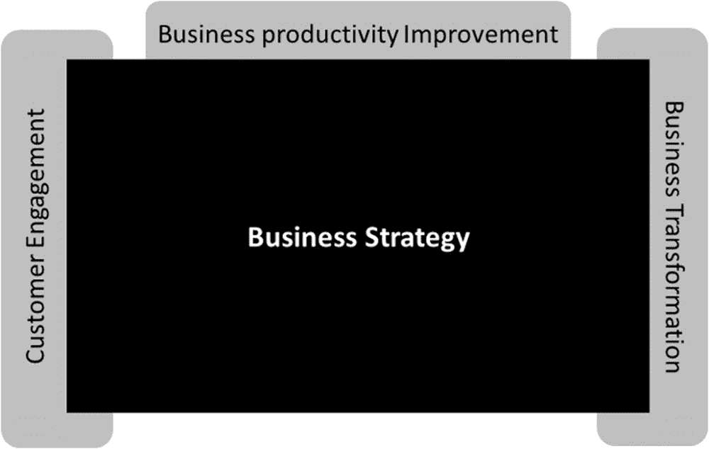
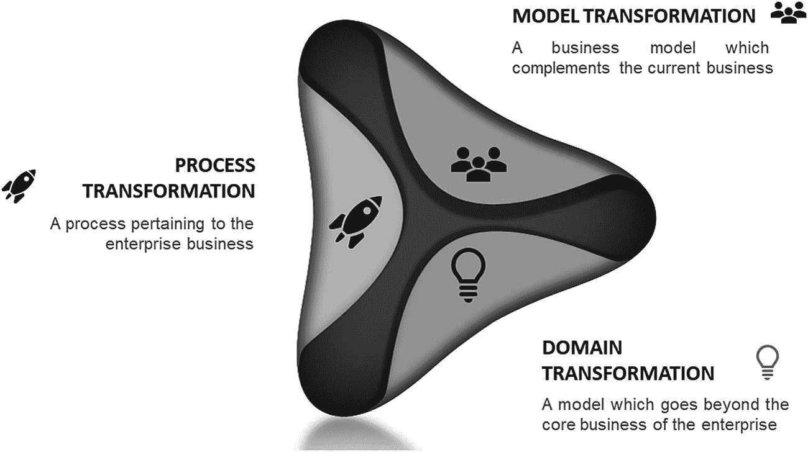

# 2. 物联网商业战略

市场上存在着技术的演进，如移动、分析、云计算、物联网等，每一项技术都在以各自的方式重新定义着“数字化”的内涵。有趣的是，如果这些技术一次只实施一项，实现它们并不算什么难事。这些技术都很不错，并为企业创造了一些新的机遇，但任何企业踏上数字化转型之旅的主要原因，都是为了被人们视为一家伟大的公司。而要成为一家伟大的公司，它们需要打好基础，然后利用这些新技术让自己变得更加卓越。因此，在技术演进的过程中，每个人都必须明白，让一家企业变得伟大或与众不同的并非某一项单独的技术，而是这些技术的融合，为企业创造了改变以往商业模式、并在未来更具竞争力的机会。凭借当今市场上的技术，我们过去所面临的技术限制已被消除，因此企业可以更高效地运营。

我观察到许多公司对待技术的方式是，它们发现了一项新技术，就认为自己可以制定一个新战略。于是，企业推出了移动战略、大数据战略、社交媒体战略、物联网战略、云计算战略和认知计算战略，这也是许多公司至今在每项技术上各自为政的运作方式，这是一个非常糟糕的想法。说它糟糕，并非因为这些企业想要采用新技术，而是因为在这些技术背后缺乏一个商业战略作为支撑——例如，一个移动战略并不能让一家企业取得成功。

要让一家企业取得成功，需要一个商业战略，并且这个战略应该与技术战略相结合，而技术战略必须对该企业及其业务最有意义。例如，一个商业战略目标是提高客户满意度的零售商，可能会使用物联网解决方案来改善店内整体客户体验。

数字化转型的核心在于改变企业传统的业务运营方式。这种变革源于数字技术的应用，无论是来自市场新进入者还是既有竞争对手——而这些竞争对手可能根本不是你以前的竞争者。这可能意味着，一家杂货店进入了服装行业，或者同一家杂货店进入了截然不同的业务领域，例如云计算，就像亚马逊那样。这类竞争对手会削弱你产品或服务组合的生存能力，或者你的市场进入策略。换句话说，它们通过为客户提供新的关系类型、新的产品或服务组合，或者比您更好的客户体验，来让你的客户比你更满意。这被称为业务颠覆。

这意味着，企业若要在市场中保持相关性，就需要制定一个由强大技术驱动的综合性商业战略，以便能够对不断变化的市场做出反应，而物联网正是这样一种强大的技术。为了实现这一目标，每个企业都需要采用初创公司的心态，并基于此开始思考与当前不同的战略。这能使企业持续应对不断变化的市场状况。

这意味着传统的战略制定方法——企业设定每股收益目标，或决定进入哪些新市场、收购哪些公司——已不再具有意义。在新的数字化转型世界中，业务战略在于定义企业如何使自己在市场上变得独特，以及如何为客户创造价值。这就是业务转型模型的基本概念，我们将在后续章节中讨论。

数字化转型围绕企业的业务战略展开。基于该战略，通过识别那些能让企业在市场中（与竞争对手）脱颖而出的业务流程，或能改善客户参与度、提升企业效率的流程，来制定由物联网主导的数字化转型路线图。

在当前市场环境下，企业要维持其市场地位，可采用三种业务战略：第一是客户参与战略，第二是业务转型战略，第三是业务效率提升战略。如图 2-1 所示。

图 2-1
业务转型模型

从物联网的角度来看，实现成功有多种途径。一些公司专注于连接现有产品，使其对客户更具吸引力和实用性，这就是客户参与战略。另一些公司则利用机会进行运营改进，以提高效率、降低成本。还有一些公司更大胆地向前推进，利用连接性创造全新的产品或重塑商业模式（甚至涉足独立的物联网业务）。根据我的经验，那些在物联网领域实现规模化发展的企业，通常是通过多种战略组合来实现的——并且都取得了一定程度的成功。然而，当我们更仔细地审视这些收益时，我发现最成功的公司往往善于发挥自身优势，而非押注于不熟悉的市场或新产品。从物联网中获得最大经济效益的企业，是那些将物联网连接添加到现有产品中，而不是进入新市场或创造全新物联网产品或服务的企业。

## 客户参与战略

客户参与战略，也称为市场进入战略，其核心是加强客户关系。它强调建立在信任和忠诚度基础上的客户关系——理想情况下，是建立在热忱之上。这意味着企业需要转变其市场进入战略，将客户关系和客户满意度作为其开展业务和参与市场竞争的核心驱动力。

过去，企业与客户之间的互动仅限于销售环节。因此，企业不得不通过客户调查、产品退货、产品评论以及零散的反馈来收集数据，以了解客户的需求、偏好和行为。这意味着企业往往采取被动式的客户参与，而非主动式的客户参与。

幸运的是，企业正在利用物联网技术，以更积极的方式改变其客户参与实践，这使得企业能够更容易地与客户互动，并以非侵入式的方式收集数据。

宝马救援服务系统是实现物联网客户参与的一个经典案例。宝马救援服务系统（也以“MINI 救援服务系统”为品牌名）是宝马提供的一项远程信息处理道路救援服务。该系统类似于通用的 OnStar 或梅赛德斯-奔驰的 mbrace 服务，利用蜂窝网络和全球定位遥测技术，基于物联网定位或导航车辆。宝马救援服务系统提供逐向导航、车辆诊断、安全气囊展开通知、被盗车辆追踪以及拖车或补胎服务。它的另一个主要功能是远程解锁——如果客户把钥匙锁在车里，可以致电宝马救援服务系统，而不用找锁匠。在很多情况下，客户只需回答几个简单的问题，宝马车就能远程解锁车门。这个例子说明了物联网技术不仅能提升客户参与度，还能改善客户的生活。

过去，利用物联网提升客户参与度主要局限于工业应用。如今，企业对消费者（B2C）公司也意识到了物联网在转变客户参与方面的潜力。

企业利用物联网技术为客户打造个性化场景。物联网设备可以根据收集到的关于用户环境的信息，来改变和优化其功能与服务。

通过管理和分析联网设备提供的实时数据的新能力，企业现在能够以前所未有的速度和规模，深入了解产品性能、消费趋势和购买行为。例如，可口可乐从其 Freestyle 售货机及其他自动售货机获取的数据，使其能够深入了解客户在何处、何时以及如何购买和消费其产品的模式。例如，通过联网自动售货机，可口可乐报告称，在某些电视节目播出前，大学校园内的饮料消费会出现峰值——这一具体洞察不仅能更好地理解客户人口统计特征，也为精准营销提供了机会。

另一个例子是一家大型发动机制造商，其发动机内装有传感器，用于反馈发动机性能数据。该公司利用这些数据来改进发动机设计，并检测现有设计中的任何缺陷。通过这种方法，公司能够进一步优化其产品的性能和可靠性，从而推出更好的产品。如果只是配置上的变更，它们会通过物联网设备，经由互联网自动将更新发送到发动机上。这确保了客户始终拥有产品的最佳更新配置。

通过利用物联网进行产品改进，企业可以显著提升客户满意度，并对与客户的关系产生巨大影响。此类附加服务有助于企业更长久地留住客户。

这就是客户参与战略的全部内容。如果客户参与不是企业的业务战略，那么下一个要考虑的就是业务转型战略。

## 业务转型战略

业务转型战略意味着企业不应仅仅局限于思考其正在销售的产品和服务。它们需要思考客户的需求和问题，以及如何通过重新定义自身业务来解决这些问题，并在必要时进入新的领域或业务范围。业务转型战略大致分为流程转型、模式转型和领域转型，如图 2-2 所示。

图 2-2
业务转型战略

### 流程转型

流程转型涉及对实现特定目标所需步骤的审视，旨在消除重复或不必要的步骤，并尽可能实现自动化操作。其最终目标是提高客户或员工满意度，同时降低成本、提升效率。

我们已在生产车间目睹过流程转型，例如空客公司采用头戴式显示眼镜来提高员工对飞机检查的质量。在客户体验方面，我们也看到了流程转型，比如达美乐披萨通过引入“AnyWare”系统，彻底重新构想了订餐概念，使顾客能够从任何设备订购餐点。这项创新极大地提升了客户便利性，帮助公司销售额超越必胜客。我们还了解到，制造企业已经认识到，依赖人工输入数据的传统制造管理软件（如`MES`平台）无法跟上现代制造环境的步伐。每一次人工输入都伴随着成本，无论是劳动力成本、生产损失成本，还是准确性成本。通过将软件直接连接到测量生产参数（温度、压力、速度、开关状态等）的传感器以及机器输出和`RFID`芯片，企业可以实时收集和分析数据，从而通过预测性维护节省数百万美元。

以全球领先的制造领域跨国公司 ABC Productions 为例。ABC Productions 专门制造销往世界各地的各种消费品。该公司运营着多个仓库，不同类别的产品在这些设施中被包装到特定的运输或展示纸箱中。由于大多数`CPG`业务具有高产量（产品制造、交易数量、产品存储）和低利润的特点，优化每项操作并有效利用资源是其盈利的主要杠杆。ABC Productions 在生产工厂和仓库面临的关键问题是，当机器发生故障或出现闲置时间时，缺乏可见性，从而导致交付延迟。

我们的任务是实施实时生产线监控和预警系统，以掌控停机时间，并在制造单元和仓库内实施改进措施。该项目的技术规范包括实施：

*   一套基于无线传感器的复杂跟踪系统，用于监控生产线性能，搭配即插即用的传感器和硬件，且安装开销最小。
*   一个基于云的、多租户托管的平台，作为跨仓库和制造单元数据的单一存储库。
*   制造单元内极高的准确性和可靠性，因为该系统将用作参考点。
*   一个高度定制化的应用程序，用于跟踪业务关键绩效指标（KPI），并提供一个能够轻松与现有 IT 系统集成的平台。

我们在 ABC 的仓库和生产单元安装了无线传感器和硬件通信网关。在云端部署了一个物联网平台和定制的业务应用程序。利用物联网平台的预制接口，与包括`ERP`在内的所有依赖系统进行了集成。

该实施为 ABC Productions 带来了多项好处，部分列举如下：

*   **生产力提升**——运营技术团队能够实时洞察影响生产线生产力的参数，如生产线速率、损耗以及多层面的质量分析。凭借这些洞察，实施了预测性维护，使生产线生产力提升了超过 35%。
*   **机器健康监控**——ABC 能够监控和分析对机器健康至关重要的参数。他们能够通过在故障发生前进行预测，从而优化机器停机时间。
*   **优化耗材**——ABC 能够分析生产过程中的能源及其他耗材使用情况，并发现优化利用率的方法。

这个案例研究清晰地表明，流程转型能够创造巨大价值，而利用物联网进行数字化转型在这些领域正变得越来越普遍。这些流程转型往往将努力集中在企业层面的特定业务领域，因此通常由首席信息官（CIO）、首席商务官（CBO）和首席数字官（CDO）联合领导才能成功实施。^(⁵，) ^(⁶)

### 模式转型

流程转型侧重于业务中的有限领域，而模式转型则着眼于行业价值交付的基本构建块。这类创新的例子广为人知，从 Netflix 重塑视频分发，到苹果重塑音乐交付（iTunes），再到优步重塑出租车行业。然而，这种转型应该发生在每个行业，而物联网可以支持这种转型。好事达（Allstate）等保险公司正在利用物联网、数据和分析技术，将保险合约分拆，并按英里数向客户收费，这是对汽车保险业务模式的重大改变。尽管尚未成为现实，但业内也在进行大量努力，试图利用物联网将采矿业彻底转变为全机器人作业，无需人类到地下作业。

业内正在讨论的另一个极具吸引力的模式是资产共享模式，该模式允许企业创建新的业务模式，以提高其资产利用率，并进入全新的业务领域。

资产共享模式允许企业将其昂贵的、支持物联网的资产与其他业务实体或用户共享。资产共享模式的一个明显例子是现在英国街头出现的电动滑板车。物联网连接的设备与消费者按使用量付费（按次付费）相结合，是当今世界越来越普遍的模式。共享资产的组织可以根据使用量、使用时间和使用性质来收取资产费用，这类似于成果业务模式。在这种模式下，客户租用资产，但他们未使用的部分则被反馈回系统中。与将设备租给单个客户不同，通过资产共享，客户在特定时间段内拥有该资产的使用权。这样，产品能更快地在市场中流通，并且产品能从多个客户的充分使用中获益。这同时也能确定资产闲置、未被使用的时间有多长。在这种用例中，客户不是拿走资产并只为使用时间或产出付费，而是租用资产一段固定时间，用完后再传递给下一个客户。借助物联网系统，资产连接到互联网，以确保它们不被盗，并且可以轻松跟踪其使用情况和磨损程度。

自动驾驶汽车、智能或虚拟发电厂、共享无人机和微电网都是资产如何被转移的例子。东芝利用人工智能和物联网网络开发了一个虚拟发电厂，在虚拟层面映射发电厂以控制输入和输出，并在停电期间利用任何多余的能源供应。这些虚拟发电厂并不拥有能源资产；他们拥有的是网络中每个设备之间传输的数据。

这些机遇的复杂性和战略性要求战略层面的参与和领导。通过改变价值的基本构建块，实现模式转型的公司将为增长开辟重大的新机遇。

### 领域转型

当今行业中鲜有关注、但蕴藏巨大机遇的一个领域是**领域转型**。

`领域转型`是指进入企业此前从未涉足的市场，即新市场或相邻市场。

新技术正在重新定义产品和服务，模糊行业边界，并催生出全新的非传统竞争者。许多企业并未认识到这些新技术能为其在现有服务市场之外开辟全新业务的真正潜力。而正是这类转型往往能带来创造新价值的最大机遇。`领域转型`的一个典型例子是线上零售商亚马逊。亚马逊通过推出亚马逊云服务（`AWS`）拓展至新的市场领域，如今该服务已成为全球最大的云计算服务提供商，进入了此前由微软、IBM 等 IT 巨头掌控的领域。亚马逊之所以能够进入这一领域，得益于其在存储、计算数据库方面构建的强大数字化能力（这些能力原本用于支撑其核心零售业务），以及其与数千家年轻成长型企业建立的关系基础——这些企业日益需要计算服务来扩张。`AWS`对亚马逊而言并非简单的业务延伸或相邻拓展，而是在一个根本不同的市场空间中开展的全新业务。

## 业务生产力提升

从正式意义上讲，生产力指的是组织将投入（如劳动力、材料、机器和资本）转化为商品和服务（即产出）的效率。但如今，它已不再局限于衡量投入与产出的比率。提升生产力本质上就是更聪明地工作，企业可以在几乎任何环节寻找提升效率的机会——有些企业可能将优化现有运营或生产线以降低成本视为生产力提升策略，另一些企业则希望通过减少人工干预来改进现有运营，从而提高质量并降低故障成本。物联网技术带来了自动化的可能性。智能办公环境利用大量互联设备来监控、控制和管理企业内的各项运营。利用这些设备自动化原本由员工执行的重复性任务，可以提高效率，并释放员工的时间，让他们专注于更复杂的工作。

除了提升员工生产力，物联网还能帮助企业更有效地利用资源，尽量减少不必要的开支。一个例子是智能供暖和照明系统的应用。像 Nest 恒温器这样的系统，可以帮助降低因过度使用空调和供暖而产生的能源消耗。

在供应链领域，物联网使企业能够追踪产品的运输和交付，帮助他们更精确地监控到达时间和物流状况。智能标签和传感器有助于实时跟踪库存水平，甚至可以追踪物品在仓库或商店中的具体位置。这使得补货更加高效，从而改善企业的现金流。更精确的库存跟踪也意味着企业能够减少过量订购，并确保最受欢迎的产品有库存，以实现利润最大化。

在制造业领域，基于物联网的生产流程使得监控工厂资产比以往任何时候都更容易。智能传感器能够实时检测并通知任何问题，其速度远超任何人。当单个组件发生故障时，企业可以根据其发送的数据立即定位，并在造成更大损害前轻松更换。这对于运行复杂的运营尤其有益，因为当意外问题出现时，停机的代价可能非常高昂。

## 在客户互动、业务转型与业务生产力提升策略之间做出选择

每家企业都需要根据具体情况，选择前述合适的业务策略，并以此为基础，利用物联网来定义数字化转型路线图。虽然`业务生产力提升`可以作为一项独立的业务策略，但我看到许多企业之所以能取得可衡量的成果，是因为他们将`业务生产力提升`与`客户互动策略`或`业务转型策略`结合使用。

必须认识到，单靠物联网本身无法实现期望的业务成果，但它在达成业务成果方面确实扮演着重要角色。让我通过一个案例研究来说明这一点。

一家名为 ABC Retail 的美国大型奢侈品百货连锁店选择了`客户互动`和`业务生产力提升`作为其业务策略。该公司最初是一家鞋店，后来发展成为一家经营服装、鞋类、手袋、珠宝、配饰、化妆品和香水的全品类零售商。

在我居住在美国期间，这是我最喜欢的商店，原因是这家公司多年来一直以卓越的客户服务而闻名。ABC Retail 自创立之初就以提供最佳客户服务为核心，在客户服务方面没有其他公司能与之竞争。

任何第一次光顾 ABC Retail 的顾客都会被询问是否同意 ABC 从互联网上获取他们的（顾客）社交信息数据，并承诺为顾客提供最佳客户体验。这伴随着明确的承诺：不会将任何机密数据存储在 ABC Retail 的本地系统中，也不会与任何第三方分享。

ABC Retail 围绕客户互动构建了特定的 IT 能力，销售人员可以检索到客户的特定数据，从而更好地服务客户。例如，顾客 A 走进商店，告诉销售人员他需要买几条新裤子和新鞋。几分钟后，销售人员拿来了几条深蓝色裤子和几双尖头黑色鞋，这些正好是顾客 A 的尺码和最喜欢的颜色。这并非魔法。销售人员能够做到这一点，是因为 ABC Retail 为他提供了相关能力。ABC Retail 建立了一个完全透明的供应链能力体系，其每一位销售人员都能访问顾客过去的活动和购买记录。基于这些洞察，在这个具体例子中，销售人员了解到顾客 A 找到了一份新工作。根据过去一年的购买模式，他还知道了顾客 A 的鞋码、服装尺码以及最喜欢的颜色，并据此找到了顾客 A 合适的尺码和喜欢的颜色。这正是我们所谈论的，在 ABC Retail 通过技术实现的客户体验。

另一方面，我们为 ABC Retail 实施了几个物联网用例，以提供更加个性化的购物体验，提高客户忠诚度和满意度，促进销售，并改进库存管理。其中一个物联网用例旨在通过在产品区域安装传感器（这些传感器会因顾客的行为而被触发）来提升个性化体验。ABC Retail 会根据顾客在店内的购物位置或他们以往的购买习惯，直接将即时折扣、详细的产品描述或替代商品推荐发送到顾客的手机上。

我们还部署了物联网解决方案，以帮助 ABC Retail 进行库存控制和追踪：在包裹和产品上安装智能标签，这些标签能追踪供应链中的每一件商品（包括退货），从而使 ABC Retail 能够精准地跟上客户需求的变化。

