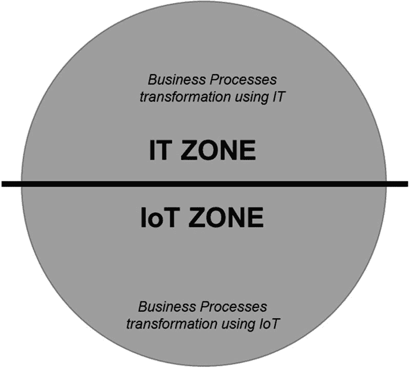
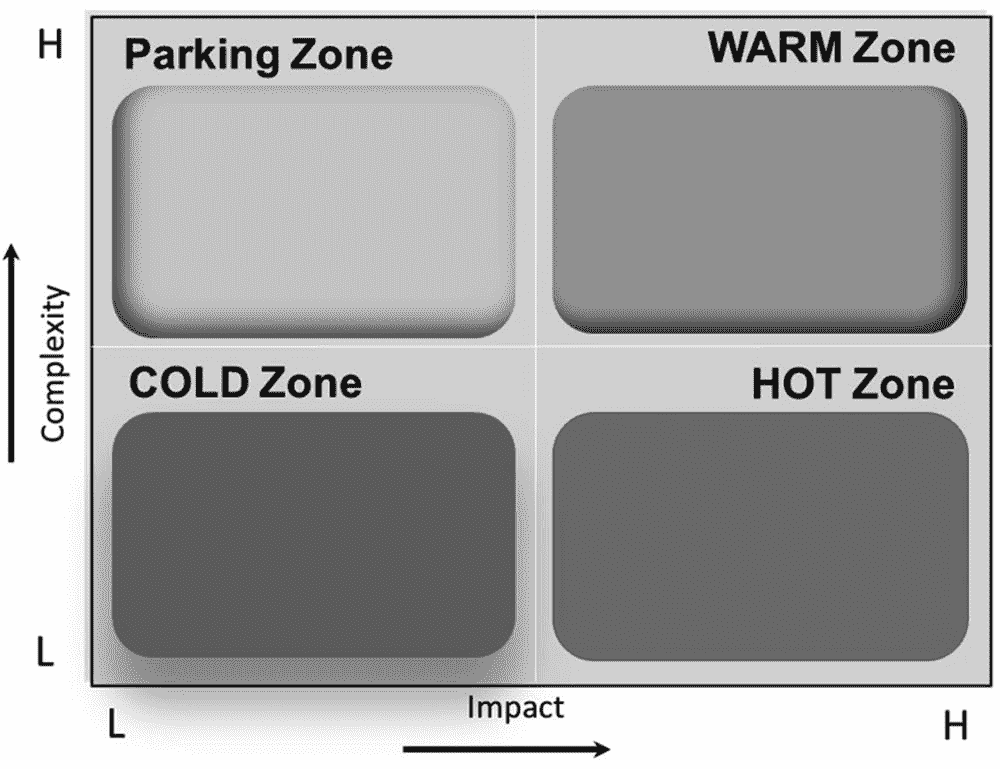

# 3. 物联网标准业务转型模型

几十年来，成本优化一直是 IT 行业的驱动因素，大多数企业都在寻找方法，在不牺牲服务质量的前提下，尽最大努力降低成本。如今，随着数字化的兴起，企业不仅实现了成本优化目标，还能提升交付速度并超越客户体验。

成本优化是企业考虑数字化转型的驱动因素之一，而`物联网`确实在其中扮演着重要角色。然而，重要的是要认识到，数字化转型之旅不应仅仅为了优化企业成本而开启。数字化转型的启动，源于企业需要以不同的方式开展业务，并以最敏捷的方式适应不断变化的业务需求。业务转型意味着改变企业与客户或业务的互动方式，同时改进运营，使其变得更快、成本更低。

随着数字技术深刻重塑各行各业，许多企业正在推行大规模变革，以抓住这些趋势带来的红利，或者仅仅为了在市场中生存。拥抱动态格局至关重要，因为对于需要快速构建并扩展稳健环境的组织来说，新的经济机遇不断涌现。彻底转型企业的整个运营极其复杂，如果执行不当，可能会带来巨大风险。缺乏正确的指导和经验，很容易只专注于技术采纳来推动数字化转型战略的成功实施，而忽视了变革将对组织其他部分产生的影响。其结果是实施成本高昂、项目截止日期延误，且无法看到投资回报。本书阐述的概念，为企业提供了通过利用`物联网`引领技术转型来实现商业战略所必需的知识和方向。它基于企业所需的业务转型，提供了分步且实用的解决方案，以克服涉及人员、流程和技术的复杂问题。

`物联网标准`是一种模型，它使企业能够以`物联网`为杠杆，创建新的或修改现有的业务流程、文化和客户体验，以满足不断变化的业务和市场需求。这种在数字时代对业务的重新构想，就是数字化转型。

众多 IT 服务公司声称，能够利用`物联网`将签约组织转型为数字化企业。零散的数字化转型相当危险，因为它们通常最终会增加新的复杂性，从而使 IT 环境变得更加繁琐。另一方面，许多企业将数字化转型视为纯粹的技术事务，而数字化转型的真正定义是思考一个组织应如何利用现代技术、人员和流程，从根本上改变业务绩效。

数字化转型之旅是自上而下而非自下而上的方法，并且只有在企业层面进行才能成功。这并不意味着组织需要开启数字化转型之旅，并对其现有的 IT 和 OT 系统、工具和流程进行大刀阔斧的改变。它真正的含义是，数字化转型应通过运用一套明确定义的企业级数字化转型方法论来开启。没有企业级方法论，企业就无法在数字化转型的努力中取得成功，而`物联网标准`正是为了解决这一问题。`物联网标准`是一个企业级的数字化转型模型，它使各类组织能够利用`物联网`开启数字化转型之旅，从而让企业能够首先理解转型背后的业务驱动因素，然后通过`物联网`实现转型，进而充分获得大规模数字化带来的全部好处。实施`物联网标准`的结果是：在整个组织中实现更大的一致性并提高可见性，将业务战略与执行联系起来，以更高的可预测性和质量、更低的运营成本，更快地实现更好的业务成果。

在企业内部实施`物联网标准`的最终结果，能带来以下几个方面的益处：

* 改善客户体验和业务满意度
* 提升机器和车间员工的效率
* 加强预测和预测性维护
* 提升产品质量
* 减少停机时间
* 更快速、更明智的决策
* 加快产品上市速度
* 能够基于数据做出业务决策
* 降低运营支出和资本支出（通过自动化）
* 提高业务开展的便捷性和速度

## 选定业务战略后下一步做什么

选定业务战略后，下一步是识别企业当前影响该战略的核心业务流程。这些业务流程中的潜在问题与机遇，决定了业务流程所需的转型路径。`IoT` 并非解决所有业务问题或机遇的唯一方案。在许多情况下，需要将 `IoT` 与其他技术方案结合，才能应对业务问题或机遇。

图 3-1 展示了业务转型（BT）模型的两个象限。每个业务流程被划分为`IT 区`或`IoT 区`，随后识别其中的问题与机遇。

**问题**是指业务流程中需要解决或克服的差距或低效环节。问题可能当前已影响业务流程，也可能在未来产生影响，并可能阻碍业务流程高效运作以实现预期目标。在某些情况下，问题甚至威胁企业的长期生存。

**机遇**是指能够提升业务流程效率的改进点，有助于实现增加利润、降低成本、提升客户体验或加速创新等业务目标。^(⁷)

**图 3-1** — 业务转型模型的双象限

对于无需借助 `IoT` 解决已识别问题与机遇的核心业务流程，将其归入`IT 区`。

举例来说，Mart A 是一家经营连锁大卖场、折扣百货商店和杂货店的零售企业。其两大核心 IT 业务流程如下：

- 业务流程 1 – 通过 Web 应用从电子商务系统下订单
- 业务流程 2 – 处理订单信息

在业务流程 1 中识别出一个机遇：开发新渠道（如移动端）以增强客户互动。目前客户仅能通过 Web 渠道下单。

在业务流程 2 中发现一个问题：完成一笔订单需要过多人工干预。这是因为多个应用程序采用不同技术构建，彼此无法集成。简而言之，一个应用的输出需手动输入其他应用才能完成订单处理流程。

业务流程 1 和 2 识别的问题与机遇无需 `IoT` 即可解决，因此归入`IT 区`。换句话说，这些业务流程中的问题与机遇可通过信息技术或纯 IT 方案解决，因此不被视为 `IoT` 路线图的一部分。

与选定业务战略一致且需利用 `IoT` 解决问题与机遇的核心业务流程，则归入`IoT 区`。

以下通过案例说明。一家大型车队管理公司委托我们为其制定数字化转型路线图。该公司将业务转型与业务生产力提升作为核心战略。其中一个需要转型的核心业务流程是“以最优成本准时交付优质产品”。该公司的业务是为沃尔玛、奥乐齐等美国零售店配送生鲜杂货。该流程描述的是：货物从生产商仓库运至零售店，货车配备柴油冷藏机组以保持产品新鲜。该一级流程进一步分解为以下用例：

- 追踪货物从出发地到目的地的运输时间与路线（UC1）
- 监控冷藏设备以保持产品新鲜（UC2）
- 追踪并管理全程燃油消耗（UC3）
- 管理货车运营（UC4）等……

每个用例中识别出问题（P）与机遇（O），部分列举如下：

- 用例 2 中的问题（P-UC2）——驾驶员需定期检查并控制冷藏设备温度。曾因冷藏设备管理不当导致产品变质。
- P-UC3 与 P-UC4 ——胎压不足及发动机故障导致燃油消耗额外增加 5%至 20%，并推高了货车的维护成本。
- P-UC4 ——缺乏有效的货车追踪与定位机制。

针对这些用例的问题与机遇，确定了相应的 `IoT` 解决方案。以下是为各用例问题与机遇定义的高级 `IoT` 解决方案：

- 安装温度传感器监控冷藏设备（如各隔间温度），通过中央平台远程监控与控制，无需驾驶员手动操作。这将解决产品新鲜度问题。
- 在发动机和轮胎层级安装传感器，监控发动机与轮胎状态以提高燃油效率及货车投资回报率。
- 部署追踪与定位 `IoT` 方案以优化物流运营。

以上是一个简单案例，展示了如何基于业务流程中识别的问题与机遇，通过 `IoT` 用例实现业务战略。

### 物联网用例参考模型（IoT UCR 模型）

作为最佳实践，根据用例为企业带来的影响来实施物联网解决方案至关重要。图 3-2 中定义了一种名为物联网用例参考（UCR）模型的模型，旨在帮助企业正确确定实施物联网解决方案的优先顺序。

在确定了每个业务流程的用例之后，每个用例都将从复杂性和影响的角度进行评估，并划分到物联网 UCR 模型的四个象限之一。^(⁸)

**图 3-2** 物联网用例参考模型

那些对业务战略影响大但实施成本和复杂性低的用例被置于**热点区域**。这些用例可以快速实施以取得业务成果，是试点项目的理想候选。我对年轻企业（成立少于 15 年）的建议是，首先实施**热点区域**中的用例，以更快地获得业务和董事会对物联网能为企业带来成功的信心。那些对业务战略影响大但实施成本和复杂性高的用例被置于**温点区域**。对于大型或传统企业，建议结合实施**热点区域**和**温点区域**的用例，以赢得业务和董事会对物联网在业务中取得成功的信心。这是因为对于大型企业而言，能够适合**热点区域**的用例非常有限。

许多公司在未能从物联网试点项目中看到变革性影响的早期迹象时感到沮丧。我们都需要明白，单个用例无法证明物联网的益处。它必须在用例数量和广度上实现规模化，才能展示其影响。更广泛地实施物联网用例会推动文化转变，并为董事会和业务部门提供关于物联网益处的新视角。这种势头如同涟漪效应，通常还会暴露技术弱点以及人才缺口，包括内部物联网技能水平和实施大规模物联网所需的专家数量。“做大做强”的方法可能看似违反直觉，尤其是在那些资源部署较少、更专注于少量用例的企业中。虽然小规模在早期阶段可能不错，但随着公司增加用例，会存在一个清晰的学习曲线，而公司越早完成学习，对其越有利。我个人经验表明，无论用例类型或公司类型如何，更多的用例数量与经济成功呈正相关。

一旦领导者能够认识到物联网能为企业带来的益处，作为**温点区域**一部分的下一组用例，如果能够规模化实施，将证明物联网的价值。如前所述，那些复杂但对实现业务目标具有高影响力的用例被置于**温点区域**。复杂性可能伴随着成本的增加，但同时，这些用例对业务战略的影响要大得多。

在一家大型制造公司，我向董事会级别的执行人员意识到并告诉他们，我们最初设计的物联网部署策略不够大胆，这得到了他们的支持，那是一个令人欣慰的时刻。我们最初决定从**热点区域**部署包含六个用例（在此组织中称为最小可行产品或 MVP）的物联网，但我很快意识到，这种狭隘的关注点不会像预期那样提高绩效，也无法取得能获得董事会认可的结果。公司内部的一些领导者顶住了谨慎的声音，将 MVP 数量扩大到 15 个，并且我们甚至从**温点区域**挑选了几个 MVP。执行人员还发现，让管理者监督更多的物联网用例，会促使他们将注意力集中在创造使物联网成功的偏向上。这种势头不断自我强化，因为公司最优秀的人才都希望成为利用物联网进行创新推动的一部分。为了这 15 个 MVP，我们组建了强大的 21 个物联网 Scrum 团队基础，这有助于打破官僚式的决策规则。最后，意想不到的效率出现了，工程师们能够为多个 MVP 重用相似的数据架构，并发现了彼此之间的众多协同效应。最终，这种激进的物联网用例策略不仅带来了新的收入流，还使这 15 个 MVP 所涉及的具体业务流程效率提高了 60% 到 80%，成本降低了 28% 到 67%。

**冷点区域**是放置低影响和低复杂度用例的区域。企业通常在实施完**热点区域**和**温点区域**中的所有用例后，才会选择该区域的用例进行实施。一些依赖于**热点区域**和**温点区域**用例的用例也会被放置在此区域，这些被称为用例子集。通过结合**热点区域**和**温点区域**的用例，**冷点区域**中的用例子集（即依赖性用例）可以为企业创造额外价值。

提供最低价值但具有高复杂性的用例被置于**搁置区域**，这些用例不适合进行物联网实施。

### 对用例应用物联网处理方式

利用物联网 UCR 模型，我们通过将用例分类到不同的物联网区域，确定了构成物联网旅程的组成部分。物联网标准推荐对放置在物联网区域中的用例采取两种处理方式。第一种处理方式称为“异构物联网转型”，第二种称为“同构物联网转型”。

### 异构物联网转型

当一个物联网解决方案本身不足以实现业务成果时，便会采用异构物联网转型。换言之，除了实施物联网解决方案外，还需要对现有遗留应用进行 IT 应用转型，才能从用例中获得业务成果。

IT 应用转型意味着围绕物联网用例的应用需要经过数字化转型才能实现目标。IT 应用转型的例子包括：需要基于已定义用例的业务流程中识别出的问题或机遇，使用现代技术栈对遗留平台上的应用进行重构（重写）。

### 定义

**遗留系统**是指旧的方法、技术、计算机系统或应用程序。其含义是该系统已经过时或需要更换。遗留系统的典型特征如下：

1.  市场上很难找到相关技能人才。
2.  该技术已不用于新开发项目。
3.  系统难以扩展新功能，开发新功能耗时漫长。
4.  内置自动化能力有限。

**重构**，也称为**重写**或**现代化**，意味着需要重新设计和构建整个应用。通常，这意味着您可能需要完全重写应用逻辑，并从头开发云原生版本。

一位名叫 XYZ Retail 的欧洲大型零售客户向我们提出了智能商店用例，其中之一涉及他们的"即扫即走"应用。^(⁹) "即扫即走"是一种现代购物技术，顾客在购物时可以使用手机或商店提供的特定设备扫描商品，然后自助结账，无需收银员。

顾客可能被"即扫即走"结账方式所承诺的自主性和节省时间所吸引，但诸如顽皮小孩之类的干扰会增加顾客忘记扫描商品、带着未付款商品走出商店的可能性，这可能会给杂货店造成巨大损失。零售商采用了包括前端审计在内的各种保障措施，但这些措施往往难以发现未扫描的物品。

[去年发表的一项分析](https://www.researchgate.net/publication/330214157_SELF-CHECKOUT_IN_RETAIL_MEASURING_THE_LOSS)对美国和英国 13 家主要零售商的超过 1.4 亿笔"即扫即走"交易进行了研究，^(¹⁰)发现"即扫即走"方面每产生 1%的销售额，商品损耗就高达 10 个基点。这意味着，如果一家商店通过"即扫即走"方式完成 10%的销售额，商品损耗可能会额外增加 1%。根据[美国全国零售联合会](https://nrf.com/media-center/press-releases/retail-shrink-tops-50-billion-cyber-threats-become-more-priority)的数据，^(¹¹)零售商每年因盗窃、员工失误和其他因素损失的库存约占其总库存的 1.4%，相当于超过 500 亿美元。考虑到杂货商的利润空间已经很薄，额外高达 1%的损失可能是一个重大打击。

我们为 XYZ Retail 实施的用例是，通过在自助结账处引入物联网主导的干预解决方案，来检测使用"即扫即走"功能的顾客的盗窃行为。作为该解决方案的一部分，我们将原本用于收银台结账的视频分析技术也应用于自助结账。视频分析解决方案主动监控自助结账，检测针对自助结账的各种盗窃形式，并在识别出异常模式时通过手机提醒商店员工。

作为自助结账终端用例的一部分，我们解决的常见异常模式包括：

-   直接装袋 – 顾客将商品直接放入购物袋，但避开袋子重量秤。
-   价格查询（PLU）滥用 – 输错 PLU 代码。
-   未扫描商品留在购物车/购物篮中。
-   绕过传送带。
-   寻求店员帮助。

尽管使用物联网的视频分析解决方案令人印象深刻，但商店员工用于接收警报的名为`Alerting App`的遗留移动应用却无法接收实时警报。这违背了实施此用例的初衷，因此，在实施物联网解决方案的同时，对`Alerting App`进行了 IT 应用现代化改造。`Alerting App`使用现代技术栈进行了重写，从而能够向商店员工发送实时警报。

这就是所谓的异构物联网转型。在异构物联网转型中，除了使用物联网解决方案来实施用例外，还需要对 IT 应用进行数字化转型（重写），以实现用例的预期收益。

### 同构物联网转型

当一个物联网解决方案足以独立实现用例的业务成果时，便会采用同构物联网转型。在上述 XYZ Retail 的"即扫即走"案例研究中，如果不需要对`Alerting App`进行 IT 应用现代化改造，那么这就叫同构物联网转型。

## 总结

在选择了业务战略之后，下一步是识别企业中影响该战略的核心业务流程。这些业务流程中的潜在问题与机遇决定了企业的转型路线图。

在本章中，我们讨论了业务转型（BT）模型。在该模型中，每个业务流程都被归入两个区域之一，即 IT 区域或 IoT 区域。之后，我们识别出业务流程中的问题与机遇，并将物联网应用于属于 IoT 区域的业务流程。

我们还讨论了物联网用例参考（UCR）模型，该模型旨在帮助企业正确确定实施物联网解决方案的优先级。随后，我们讨论了两种物联网处理模型，即异构物联网转型和同构物联网转型。异构物联网转型适用于物联网解决方案本身不足以实现业务成果的用例。同构物联网转型适用于物联网解决方案本身足以实现业务成果的用例。

在下一章中，我们将讨论物联网标准参考模型，这是一个用于实施物联网用例的技术框架。

脚注 1   2   3   4   5

