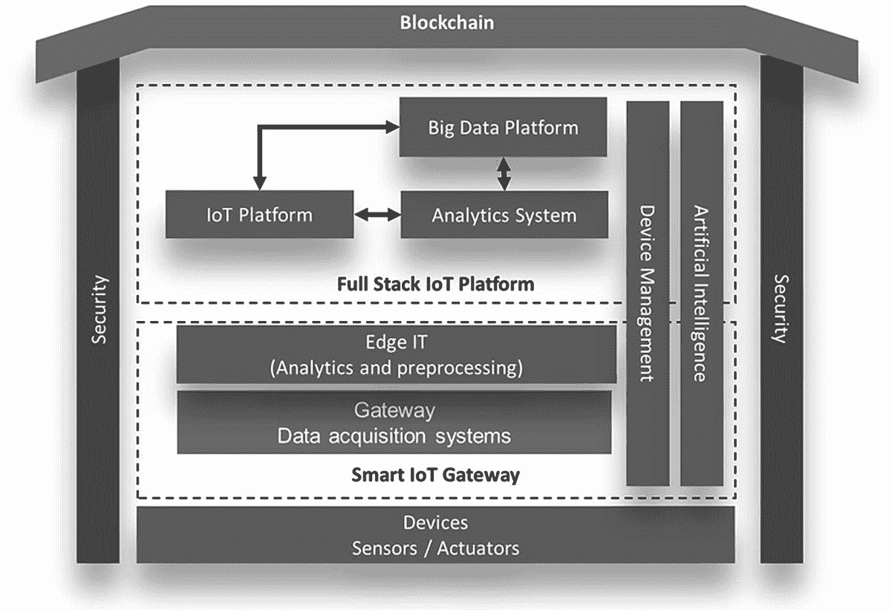
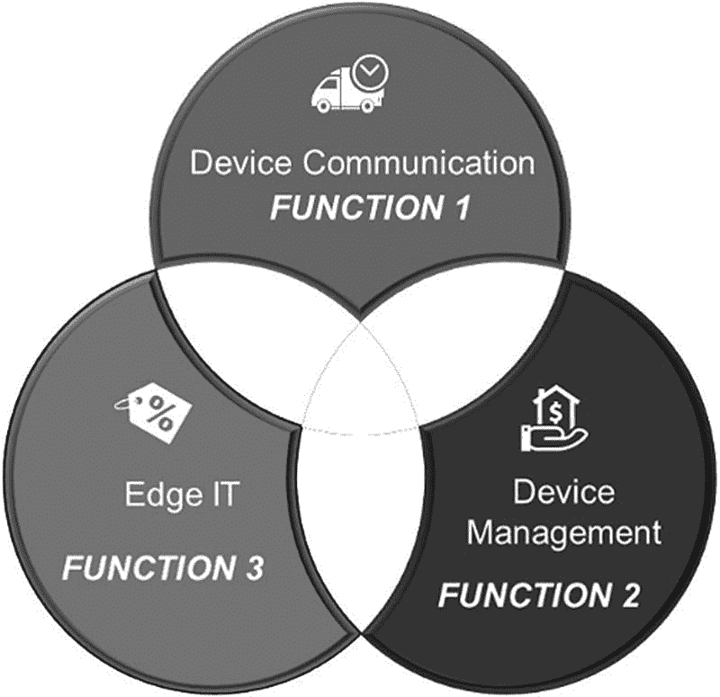

# 4. 物联网标准参考模型

连接至互联网的设备数量（包括构成物联网的机器、传感器和摄像头）持续稳定增长。^(¹²) 根据 IDC 的最新预测，到 2025 年，将有 416 亿台物联网连接设备（即“物”）产生 79.4 泽字节的数据。

随着物联网连接设备数量的增长，这些设备产生的数据量也在增加。其中一些数据具有小型突发性特点，仅反映机器健康状况的单一指标；而另一些设备（例如使用计算机视觉分析人群的视频监控摄像头）则会产生大量数据。

所有“物”与这些物所创造的数据之间存在明显的直接关系。IDC 预测，在 2018 年至 2025 年的预测期内，这些物联网连接设备所创造的数据量将实现 28.7%的年复合增长率。大部分数据由视频监控应用生成，但工业、医疗等其他类别随着时间的推移也将产生越来越多的数据。

随着市场日趋成熟，物联网正逐步成为支撑“物”、人员和流程之间信息交换的基石。数据成为共同的主线——通过在网络最近端和最远端进行捕获、处理和使用，为行业、政府和个人生活创造价值。

物联网领域涵盖了广泛的技术，因此无法用单一架构适用于所有可能的物联网实施方案。不同企业的物联网实施方式也各不相同。例如，制造业物联网与医疗保健领域的物联网实施方案就存在差异。事实上，物联网就像一把大伞，覆盖了我们周围所有可能支持或不支持互联网的设备和计算机。因此，物联网架构需要具备足够的开放性，并采用开放协议，以支持各种现有的网络应用和用例。此外，还应包含用于可扩展性、安全性和语义表示的中间件，以促进来自不同设备的设备与数据集成。

本章定义了物联网标准参考模型，它是一个抽象的框架或特定领域的本体论，由一组相互关联、定义明确的组件组成，企业可以借此成功实施物联网解决方案。物联网标准参考模型可应用于任何行业的物联网用例。该模型保持抽象性，以便基于它实现多种可能的不同物联网架构。

## 模型概述

要开启物联网之旅，企业需要选择合适的设备作为物联网实施的一部分，同时选择合适的网络、物联网平台等。最后，需要以最安全的方式进行集成。好消息是，通过尽早关注安全性，企业可以主动进行安全设计，而不是事后被动应对。

图 4-1 描绘了物联网标准参考模型，该模型大致分为三个水平服务。^(¹³) 安全是一个垂直服务，贯穿所有水平服务，是在决策设备、智能物联网网关或全栈物联网平台时需要考虑的最重要方面之一。设备管理和人工智能是两个特定的服务，它们要么是智能物联网网关的一部分，要么是全栈物联网平台的一部分。这些服务应位于何处取决于物联网用例，因此在参考模型中被视为一个垂直功能。最后，区块链是一个支撑整个物联网标准参考模型的总体功能，它是一个跨越所有水平和垂直服务的水平服务。

**图 4-1** 物联网标准参考模型

## 模型架构

### 设备（传感器与执行器）

作为每个物联网系统的基础，联网设备或联网对象负责提供数据，而数据正是物联网的核心。为了获取外部世界或物体自身的物理参数，设备需要传感器。

从根本上说，物联网设备由硬件和软件组成，包括操作系统、计算单元、存储和连接功能。设备与计算机之间的主要区别在于，物联网设备的输入和输出与传统计算机截然不同。设备由传感器和执行器构成。

传感器可以嵌入设备内部，也可以作为独立对象来测量和收集遥测数据。例如，农业传感器的任务是测量空气和土壤温湿度、土壤 pH 值或作物光照时长等参数。

并非所有物联网设备都有输出功能。具备输出功能的设备可以对事件执行操作，比如通过蜂鸣器告知有人按下了按钮，或者按下按钮后液压升降机可以提升数吨重物。

该层的另一个组成部分是执行器。执行器与传感器紧密配合，将设备生成的数据转化为物理动作。例如，设想一个配备了所有必要传感器的智能灌溉系统。根据传感器提供的输入，设备实时分析情况，并命令执行器打开位于土壤湿度低于设定值区域的选定水阀。阀门保持开启状态，直到传感器报告数值恢复正常。

设备必须保持连接，以便传输和接收数据并执行指令。

在新的联网设备世界中，设备之间相互通信以收集和共享信息，并实时协作以发挥整个物联网部署的价值，这一点也至关重要。然而，由于企业中许多旧式设备资源受限且依靠电池供电，实现这一目标并非总是可行，需要创建变通方案——设备间的通信需要大量资源，如计算能力、能量和带宽，而这些正是旧式设备所面临的挑战。除了这些限制，每种设备使用不同的语言（称为协议）进行通信，因此设备之间直接相互通信并不总是容易。这就是智能物联网网关得以发挥作用的主要原因，它是任何设备（无论是现代还是旧式）以最安全、最优的方式与其他设备通信的变通方案。

### 智能物联网网关

智能物联网网关通常执行如图 4-2 所示的三大主要功能。^(¹⁵)

**图 4-2** 智能物联网网关的功能

首先，它充当数据采集层，使设备能够相互通信并共享数据，并能与物联网架构中的其他系统进行通信；其次，它执行物联网设备的管理功能。物联网网关之所以被称为智能，是因为它们还执行另一项重要功能：对从物联网设备接收的数据进行预处理和分析，这也被称为边缘 IT 或边缘分析。

并非所有物联网网关都是智能的。标准物联网网关仅执行第一个功能，即实现设备通信。一些网关制造商使其网关能够执行设备管理。而智能网关则在网关层面执行数据处理和分析，减少了向物联网平台发送和接收数据的开销。它将计算和数据存储置于更靠近设备所在的位置，以缩短响应时间并节省网络带宽。

需要明确的是，并非所有物联网架构都需要配备智能物联网网关。企业需要根据自身需求和物联网用例，选择合适的网关。

#### 设备通信是网关的首要功能

在物联网生态系统中，企业会拥有多种设备，所有这些设备都需要连接并交换信息。并非所有设备都能直接相互通信，因为每种设备使用不同的语言（即通信协议），因此物联网（智能）网关变得至关重要。物联网网关的功能是使物联网架构中的设备能够相互通信，无论它们使用何种通信协议。我们将在第 6 章中详细讨论通信协议。

物联网（智能）网关表示该网关可以是物联网网关或智能物联网网关。

物联网网关意味着该网关不具备智能特性，即没有数据存储、数据预处理和分析能力。

通信协议是一套规则系统，允许通信系统中的两个或多个实体传输信息。

物联网（智能）网关是实现物联网通信的解决方案，通常用于设备到设备或设备到云的通信。物联网网关是执行以下功能的设备：协议转换至通用标准、数据处理、数据存储、数据过滤和设备安全。

鉴于数百万设备产生的海量输入和输出，数据的聚合、选择和传输能力至关重要。作为联网事物与云端及分析系统之间的中介，网关充当数据采集系统，并提供必要的连接点，将剩余各层连接在一起。物联网网关通过将传感器数据转换为易于传输且可供其他系统组件使用的格式，促进传感器与其余系统之间的通信。

#### 设备管理是某些网关执行的另一项基本功能

设备管理是指对物联网设备进行自动且安全地配置、认证、设置、控制、监控和维护的过程。一些企业选择通过物联网（智能）网关执行设备管理，而另一些企业则根据其目标实现的具体用例，倾向于使用全栈物联网平台来执行设备管理。

#### 边缘计算是智能物联网网关的第三大重要功能

边缘计算是一种分布式计算范式，它将计算和数据存储更紧密地集中到需要的位置附近，以改善响应时间并节省带宽。

边缘计算正在改变全球数百万设备处理、传输数据的方式。互联网连接设备（即物联网）的爆炸式增长，以及对实时计算能力的新应用需求，持续推动着边缘计算系统的发展。

更快的网络技术，例如 [5G](https://www.networkworld.com/article/3330603/5g-versus-4g-how-speed-latency-and-application-support-differ.html) 无线技术，使得边缘计算能够加速创建或支持实时应用，例如视频处理与分析、自动驾驶汽车、人工智能和机器人技术等。

### 定义

`工作负载` 是本书中使用的一个术语，指应用程序、连接性和数据的组合（可以是全部或部分）。

在网络中，延迟衡量的是某些数据通过网络到达目的地所需的时间。它通常以往返延迟来衡量，即信息到达目的地并返回源点所需的时间。

Gartner 将边缘计算定义为“分布式计算拓扑的一部分，其中信息处理位于靠近边缘的位置，即事物和人产生或消费这些信息的地方。” 在基本层面上，边缘计算将计算和数据存储更靠近收集数据的设备，而不是依赖于可能远在数千英里之外的中心位置。这意味着数据（尤其是实时数据）由位于设备附近的智能物联网网关进行处理。因此，企业不会面临延迟问题，因为数据在设备附近来回共享和处理。此外，借助智能物联网网关，公司可以节省资金，因为处理在本地进行，这减少了需要发送到集中式或基于云的位置进行处理的数据量。

由于连接到互联网以从云端接收信息或将数据传回云端的物联网设备呈指数级增长，支持边缘计算的智能物联网网关变得非常重要。许多物联网设备在其运行过程中会产生大量数据。智能物联网网关主要致力于将处理工作从云端移出，更靠近终端设备或最终用户。这也涉及对时间敏感型应用的延迟问题，例如需要实时响应的物联网应用。

智能物联网网关边缘计算的主要驱动因素包括：

- 网络和带宽 – 边缘计算可以最大限度地降低移动大量数据的成本，并减少对网络的依赖。
- 数据隐私与安全 – 边缘计算帮助组织遵守数据主权法律，并确保知识产权保留在本地。
- 推动边缘计算采用的另一个因素是希望在设备或本地实现本地计算。
- 在往返延迟问题上，边缘计算已经颠覆了整个市场。云技术完全涉及在互联网上访问系统，这意味着数据和通信需要在互联网上来回移动。而借助边缘计算，数据驻留在智能物联网网关中，从而减轻了网络延迟问题。

尽管人们可能不会将边缘设备视为每个物联网架构的一部分，但它是决定当前为特定企业和用例实施的任何物联网未来成功与否的最重要元素之一。边缘计算带来了显著的好处，尤其是对于大规模物联网实施而言。

### 智能网关面临的挑战

智能物联网网关搭载了边缘计算，可提供数据存储和计算能力。它们在网关本身进行数据处理，但在网关级别可处理的数据量和计算量是有限的。拥有数百万设备连接到网关且需要大规模计算能力的企业，需要就哪些数据需要在智能物联网网关级别进行处理做出选择，而其余数据和流程则需要由通常驻留在云端的全栈物联网平台来执行。

为了克服物联网边缘网关级别在数据存储和计算方面的限制，一些企业正在尝试采用专门的模型，以在智能物联网网关或设备附近提供无限的计算能力。这些公司正试图在区域层面维护和管理服务器，以确保企业无需在互联网上来回迁移工作负载，从而保持企业的应用和业务团队期望从云端获得的延迟水平。此外，这些公司更进一步，允许连接跨多个云提供商（例如 AWS、Azure 或 Google Cloud）以及跨私有云和公有云的应用程序和数据。这对于那些选择在托管环境中建立自己的私有云来处理关键任务或敏感应用及数据，并将其余部分迁移到公有云的大型企业尤其重要。这些公司实现了私有云和公有云之间协作与通信的需求。Equinix 的 Cloud Interconnect Fabric 就是这样一个例子。

许多私有云和公有云提供商都积极参与，致力于使无限边缘计算取得成功。

西门子提出了工业边缘的概念。工业边缘解决方案允许企业在机器上分析所有数据，同时快速、即时地对数据进行预处理。然后，优化后的数据点可以被传输到云端，在那里企业可以获得更强大的计算能力和更大的存储容量。

### 全栈物联网平台

全栈物联网平台旨在通过强大的数据分析引擎和机器学习机制，存储、处理和分析海量数据，以获得更深入的洞察。它是一个用于创建和管理应用程序、运行分析、以及存储和保护企业物联网数据的平台。一些企业选择在物联网平台层面执行设备管理，这取决于所考虑的用例，而在所有此类情况下，都需要选择能够支持此功能的正确物联网平台。

目前市场上存在多种物联网平台，并且大多数平台都支持设备管理。有针对特定行业的平台，例如商业地产和家庭健康。有些平台专注于单一类型的设备：例如，至少有几个平台专注于增强现实头戴设备。还有一些平台专注于特定功能，如制造业，以及某些专注于医疗保健领域。

不存在一种放之四海而皆准的全栈物联网平台，可以跨任何行业使用或解决任何业务问题；因此，要选择正确的物联网平台，需要从充分理解企业物联网战略、企业试图通过物联网解决的问题和机遇（以及相应的用例）、以及企业的主要行业（如制造业、零售业或医疗保健）开始。基于此，需要选择一个物联网平台。

任何物联网平台都应能够跟踪数据从设备收集（使用智能物联网网关）到从数据中生成洞察的整个过程。将设备数据转换为物联网平台数据的关键，始于来自特定机器工业协议或医疗设备的高度特定数据，当数据被摄入平台后，会经过处理、规范化和标准化，形成非常适合分析平台生成洞察的结构。这也是需要选择一个具有强大数据和分析能力的物联网平台的原因之一，该平台能够支持从设备涌入的海量数据中生成正确的洞察。

### 人工智能是物联网平台执行的一项重要功能，在某些情况下也在物联网网关层面（称为边缘 IT）执行

人工智能构成了物联网标准参考模型中最重要的特性之一。

人工智能是指机器对人类智能的模拟，这些机器被编程为像人类一样思考并模仿其行为。该术语也可应用于任何表现出与人类思维相关的特质（如学习和解决问题）的机器。

机器学习是人工智能的一个子集，它利用数据并运用统计技术来帮助其“学习”如何逐渐更好地完成一项任务，而无需专门针对该任务进行编程。随着大数据成为物联网架构的一部分，人工智能在物联网背景下已变得相当强大。

作为物联网生态系统一部分的设备会产生海量数据。借助大数据，我们拥有了存储 PB 级数据的数据湖。关键点在于理解如何利用这些数据并使其价值最大化。这就是人工智能发挥作用的地方，它可以执行诸如异常检测、根本原因分析等多种功能。

人工智能非常适合工业自动化和预测性维护的场景。在传统老旧的物联网实现中，架构中有一个执行重复性任务的规则引擎，例如，如果传感器数据达到某个设定阈值，它就会执行一个特定的预设任务。例如，如果熔炉温度超过 70 摄氏度，它就会关闭熔炉。然而，所有这些规则和数值都是硬编码的。随着人工智能引入物联网架构，企业不再需要硬编码这些规则，而是可以部署一个模型，让系统在一段时间内进行训练，从而无需硬编码业务逻辑或规则。借助人工智能，我们让机器从一段时间内的模式中学习，以便能够基于这些学习成果执行操作。这有助于多种用例，例如预测性维护。例如，我们为一家大型汽车制造商部署了基于物联网的预测性维护解决方案，该方案能够预测主轴损坏，以及识别旋转设备的开裂和剥落、齿轮和电机缺陷。结果，他们将诊断时间缩短了高达 70%，维修时间缩短了超过 20%，从而提高了整体设备效率(OEE)。这为企业增加了巨大价值。

我在物联网人工智能方面遇到的一个挑战是，有大量数据需要发送到云端，而在许多行业中，基于人工智能算法执行命令所需时间太长，因为数据需要在云端来回传输以供机器学习。我遇到的另一个挑战是，一些受监管行业的企业认为数据敏感，不宜发送到云端。为了克服这个挑战，企业需要让人工智能算法在靠近数据生成的设备附近执行。这意味着此类任务需要由智能物联网网关执行，这也被称为边缘人工智能。但并非所有智能网关都具备在边缘运行人工智能算法的计算能力。已经有一些企业推出了能够在设备附近运行人工智能算法的智能物联网网关。

企业在物联网架构中启用人工智能会采用不同的模式。在某些情况下，人工智能直接由智能物联网网关使用来自设备的数据执行，这称为边缘人工智能。在某些情况下，当设备产生海量数据时，部分人工智能在智能物联网网关层面执行，其余部分在全栈物联网平台层面执行。而在另一些情况下，企业选择在全栈物联网平台层面执行人工智能。企业需要根据数据和正在实施的用例来选择执行人工智能的最佳位置。对于一家制造公司，我们使用了亚马逊 AWS Snowball Edge 在靠近物联网设备（即智能物联网网关）的位置执行重型计算操作。Snowball Edge 能够在物联网网关上运行完整的机器学习模型。其工作方式是，你在公有云中训练模型，然后将模型带至物联网网关并运行它。当它检测到预测不够准确时，它会返回到托管在全栈物联网平台层面的数据湖进行进一步训练，然后再次部署到物联网网关，这个循环会持续进行，直到算法能够以 100%的准确率执行操作。

借助物联网中的人工智能和机器学习，静态规则引擎被动态的机器学习规则所取代，这意味着被动维护被预测性维护所取代。

物联网与人工智能的整体融合为物联网实现卓越性能开辟了许多途径。例如，当我们谈论车联网时，联网汽车实际上就是一个带轮子的边缘计算设备。它拥有强大的计算能力，能够实时处理传入的数据。这就是带轮子的边缘计算的一个经典例子，同样地，飞机也在运行边缘计算，未来，许多车辆和工业设备都将运行边缘计算。

# 智能物联网网关与全栈物联网平台的典型活动

我们已讨论了智能物联网网关和全栈物联网平台的重要性。供应商在这两个领域开发的产品在功能上有诸多相似之处，且很多时候这些产品执行的活动与其他产品相同。因此，企业往往难以判断某个流程应在哪一层执行。以下是一份典型的职责划分指南，明确了智能物联网网关与全栈物联网平台之间的分工。

| 智能物联网网关 | 全栈物联网平台 |
| --- | --- |
| 基础数据可视化 | 复杂分析 |
| 基础数据分析与短期数据历史记录功能 | 大数据挖掘 |
| 数据缓存、缓冲与流式处理 | 业务逻辑来源 |
| 数据预处理、清洗、过滤与优化 | 机器学习规则 |
| 部分数据聚合 | 高级可视化 |
| 设备间通信/机器对机器通信 | 长期数据存储/数据仓库 |
| 人工智能（边缘 AI） | 人工智能 |

## 安全

物联网环境中的安全性需从物联网标准参考模型的所有三个层面进行审视——第一层是设备级安全，第二层是智能网关级安全，第三层是物联网平台级安全。除了这三个层面的硬件和软件安全外，网络级安全也至关重要，并且必须做到万无一失，因为物联网标准参考模型中三个层面之间的通信均通过互联网进行。

在数起引人注目的事件中，普通物联网设备被用于渗透和攻击更大规模的网络，此后物联网安全便成为关注的焦点。实施安全措施对于确保网络及其连接的物联网设备的安全至关重要。

我们将在第 13 章中，作为物联网核心团队的一部分，讨论安全顾问的角色。该角色需确保选择正确的设备、平台、网关和网络，以满足企业的安全态势。在物联网环境中，除了应用安全外，设备、网关和平台安全是最重要的考量因素。

### 设备安全

在物联网生态系统的设备安全方面，企业需确保在其运营技术（OT）资产中部署的设备内置了安全功能，这一点必不可少。不仅设备本身需要内置安全功能，还应有通过软件更新或升级来修复任何安全问题的途径。

与传统物联网设备相关的一个问题是，它们通常资源受限，不具备实施强安全性所需的计算资源。因此，许多设备无法提供高级安全功能。例如，大多数监测湿度或温度的传感器无法处理高级加密或其他安全措施。传统上，大量物联网设备被设计为安装于现场或机器上，直至生命周期结束，几乎从未接收过安全更新或补丁。因此，从某些企业的角度看，从一开始就构建安全性成本高昂，且会拖慢开发进度。然而，对于希望将物联网应用于业务的企业而言，在设备中构建安全性是必须的。不过，设备所需的安全级别也取决于用例和行业。例如，黑客对入侵农业物联网设备的兴趣较低，而更倾向于入侵制造工厂。

企业还需确保对设备的访问以及通过这些设备产生的所有数据，均受授权用户或系统的控制。存储在设备上或通过通信路径传输的任何数据，都必须是加密且安全的。

### 智能物联网网关安全

网关是物联网生态系统的重要组成部分，但却是一个脆弱的单点攻击入口。物联网网关通常是首先被攻击的目标，因为它们拥有更强的处理能力来运行更密集的应用程序。更强的处理能力意味着更复杂的软件，而更复杂的软件则意味着黑客有更多漏洞可利用。物联网网关成为众多黑客攻击热点的另一个关键原因，在于其作为连接互联网与内部网的边缘设备位置。网关通常是任何安全威胁的首要入口点（同时也是系统的第一道防线）。

市场上存在许多成熟的物联网网关，需要谨慎选择，并始终将安全性牢记于心。以下是选择物联网网关时需考虑的一些因素。

**消息安全**：物联网网关需要具备强大的端到端加密方法。消息应经过加密，且只能由接收方使用加密密钥解密。这允许网关设备仍然接收和转发数据，但无法读取数据内容。因此，即使安全受到破坏，黑客也无法从网关设备解析和读取数据。

**设备接入安全**：设备接入发生在物联网生态系统中新增设备时。密钥管理实践以及新设备接入时密钥的交换方式，是一个重大的安全漏洞。物理篡改也可能导致私钥泄露。了解网关制造商在设备接入层面如何处理安全性至关重要。

**集成安全**：物联网应用程序接口（API）安全是一个重要考量。物联网系统传输和接收大量数据和信息，确保设备、网关和后端数据库之间的数据安全移动至关重要。由于集成环节较为脆弱，必须持续扫描和测试，以确保系统内数据的完整性。

**空中安全更新**：物联网生态系统内需要进行固件更新，有必要了解这些更新的具体方式以及物联网网关如何安全地处理它们。

### 物联网平台安全

物联网平台是所有物联网数据汇集的核心，在许多情况下，设备管理也在其中进行，这是物联网生态系统的重要组成部分。物联网平台层面的安全性极其重要；不过，好消息是，在这一领域，众多产品供应商已在安全方面做了大量工作。几乎所有大型平台供应商，如亚马逊、微软和谷歌，都提供涵盖所有安全层面的服务，包括预防性安全机制（如加密和对设备数据的访问控制），以及持续监控和审计配置的服务。

## 区块链

信任是人类交换行为中最关键的要素。信任始终是核心要素，它使个人能够有效地与他人交往、企业得以开展业务，甚至推动文明的建设。传统上，我们依赖中心化机构来管理每笔交易中的信任环节。以货币兑换交易为例，由于我们不信任未知的个人或企业，就会由银行这类我们信赖的中介机构居中协调支付事宜。这种模式让我们能够解决信任问题，从而放心地与他人进行交换。然而，中介机构在带来诸多交易挑战的同时，也增加了大量摩擦和成本。区块链技术正试图以更安全、更低成本的方式解决这一信任问题，且无需任何人依赖中介机构。这不仅限于银行领域，也适用于存在某种形式双方交换的公共事业和机构管控场景。

区块链是一种去中心化的分布式数字账本，由称为区块的记录构成，用于在多台计算机上记录交易，因此任何涉及的区块都无法在不更改所有后续区块的情况下被追溯修改。它是一种分布式账本技术（DLT），允许数据全局存储在数千台服务器上，同时让网络上的任何人近乎实时地查看其他人的条目。这使得单一用户很难控制或更改网络。

区块链是一种记录信息的系统，其方式使得篡改或攻击系统变得困难甚至不可能。从本质上讲，区块链是一个交易的数字账本，它在区块链计算机系统的整个网络中复制和分发。链上的每个区块都包含多笔交易，每当区块链上发生新交易时，该交易的记录就会添加到每个（参与者的）账本中。

围绕区块链试图解决所有市场问题的争论很多，但区块链是一种仅适用于解决少数问题的技术。在成本方面，区块链要解决的根本问题是降低交易成本。例如，A 先生醒来后进行身份验证，在线购买某物，并参与某种数字交易。每笔此类交易都需要验证，例如涉及谁、交换的金额等，而社会花费大量资源和金钱来确保这些属性（交易和行为者）是正确的，并且交易能够顺利执行。目前，每笔此类交易都包含多个中介机构。区块链是一种能大幅降低验证特定属性是否真实可信成本的技术。

简单来说，区块链是一种新的去中心化分布式信息管理方式，适用于那些互不信任但对共同结果有利益的各方之间。

例如，食品供应链中“从农场到餐桌”过程的共同结果，始于农业生产，经过零售商销售产品，最终由消费者消费。在这样的体系中，涉及不同的参与者，例如生产水果蔬菜的农民、使用适当温控冷藏车将产品从农场运输到商店的货运管理公司、销售这些产品的零售商，以及购买和消费这些产品的消费者。以透明且防篡改的方式管理所有这些参与者之间的信息，是这个用例中最重要的要素。该用例的共同结果是，消费者可以信任产品质量并购买这些产品，从而使供应链中的每个参与者都能获利，而这可以通过物联网和区块链技术实现。这也是区块链成为物联网标准参考模型不可或缺部分的主要原因。

一方面，有许多例子表明物联网通过区块链创造了巨大价值；另一方面，也有相反的案例显示区块链为物联网增添了巨大价值。

让我用一个食品安全案例来解释。当你走进沃尔玛超市购买水果时，作为消费者，我们目前如何判断产品的质量？我们仅仅是基于对沃尔玛的信任来做出质量假设。我们不知道水果是谁生产的、种植过程中使用了多少化学物质、水果是否在特定时间范围内以合适温度运输，以及水果在哪里包装、测试和加工。借助区块链和物联网，“从农场到餐桌”的整个步骤序列可以透明地呈现给客户，而无需依赖任何中介机构。因此，这可以认为是一项值得探索的伟大技术。

该案例的关键在于确定如何确保进入区块链的信息准确可信。只要有人员发送信息（例如产品存储的温度），数据就可能被篡改。如果信息来自防篡改的端点，例如物联网设备定期将温度信息发送到区块链，这就会为基于区块链的可追溯性解决方案增加更大的信任度。这是物联网为基于区块链的解决方案贡献巨大价值的例子之一。

另一个区块链为物联网增加巨大价值的例子是制药行业。制药行业的假药问题是一个价值 2000 亿美元的问题，可以通过区块链和物联网从质量上加以解决。如果所有交易，从采购原材料到药品制造，再到运输和将药品交给客户，都能使用防篡改标签通过区块链记录，那么假药问题就能得到解决。借助区块链，除了可追溯性之外，还增加了信任，因为在区块链世界中，没有任何交易可以被更改。

反过来，我们再看一个互联汽车的例子。我们听说过多个案例，某些第三方欺诈者在我们驾驶时找到了侵入汽车的方法。在大约 70%的案件中，这是由于软件升级过程中，黑客试图假冒合法行为者进入汽车系统并控制系统造成的。如果这种软件升级的协调可以通过区块链来进行，企业就可以确保只有拥有正确权限的合法行为者才能向汽车系统发送交易，同时确保发送的软件经过签名且未被篡改。这种方法开始显示出区块链为基于物联网的解决方案增添的价值。

区块链解决了信任这一基本要素。然而，对于任何企业而言，端到端交易的核心问题在于，交易涉及多种不同利益的相关方和企业，他们需要订阅同一个区块链模型才能完成交易，但这并非强制性的。如果并非所有参与方都从行业视角订阅该模型，企业将无法获得该技术的全部价值。因此，制造商、运输公司、零售商和物流公司都订阅该模型至关重要。

假设各方都订阅了该模型，由于有如此多的参与方来支持一笔端到端交易，那么明确以下问题就非常关键：谁拥有数据所有权、谁拥有区块链上运行的业务逻辑、谁可以在现有区块链上添加新服务，以及谁来决定谁能加入或退出网络。这引出了区块链治理中最重要的元素，而这一元素需要在将区块链解决方案集成到`IoT`标准参考模型时予以解决。

公有区块链是无许可的。任何人都可以加入网络，并在区块链内进行读取、写入或参与操作。公有区块链是去中心化的，没有一个单一实体控制网络。公有区块链上的数据是安全的，因为一旦数据在区块链上得到验证，就不可修改或更改。

私有区块链是一种许可链。私有区块链基于访问控制进行工作，这些控制限制了可以参与网络的人员。网络由一个或多个实体控制，这导致交易依赖于第三方。在私有区块链中，只有参与交易的实体才能知晓交易信息，而其他实体无法访问。

`IoT`与区块链的结合，能够在完全安全的前提下实现端到端的业务洞察。然而，值得注意的是，在`IoT`的背景下，私有区块链最为适合，因为`IoT`以行业和企业为中心，公众通常不被允许参与其中。

## 总结

在本章中，我们讨论了`IoT`标准参考模型，该模型大致分为三个水平服务和两个垂直服务。

水平服务包括全栈`IoT`平台、智能`IoT`网关和设备：
- 设备层是物理对象所在的车间层。
- 智能`IoT`网关负责从设备收集数据，并将其传输给系统的其他部分。在许多场景中，智能`IoT`网关会对从设备收集的数据（包括分析数据）进行预处理。智能`IoT`网关的另一个功能是设备管理。一些企业选择在智能`IoT`网关层面进行设备管理，而另一些企业则更倾向于在下一环节，即全栈`IoT`平台层面进行设备管理。
- 全栈`IoT`平台是将通过智能`IoT`网关从设备发来的`IoT`数据，与其他非`IoT`数据结合，利用分析系统或应用程序生成有用洞察的场所。

两个垂直服务是区块链和安全：
- 尽管区块链在`IoT`背景下仍在发展中，但企业在决定其`IoT`架构时必须规划此功能，因为区块链将成为未来企业借助`IoT`取得成功的最重要元素。
- 设备、智能`IoT`网关和全栈`IoT`平台都需要得到安全保障，这是`IoT`标准参考模型的关键隐性需求之一。

在下一章，我们将讨论不同的`IoT`设备及其通信协议，包括它们的局限性和挑战。

脚注 1 2 3 4