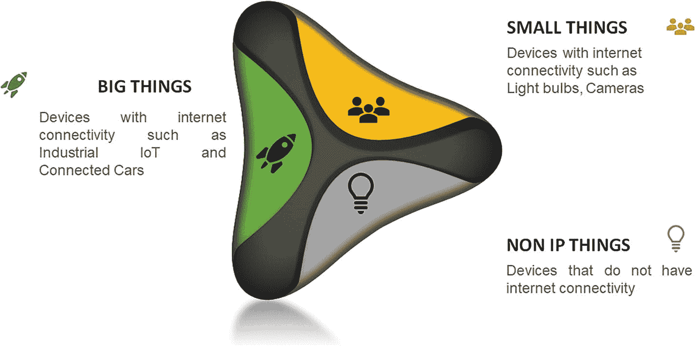

# 5. IoT 设备及其通信

`IoT`设备是能够无线连接到网络并具备传输数据能力的非标准计算设备。`IoT`涉及将互联网连接从标准设备（如台式机、笔记本电脑、智能手机和平板电脑）扩展到非互联网连接的物理设备和日常物品。这些设备嵌入了技术，可以通过互联网进行通信和交互，还可以被远程监控和控制。

`IoT`设备，也称为连接设备，会与环境中的其他相关设备进行通信，以实现家庭和工业任务的自动化。这些设备通常分为三大类：消费类、企业类和工业类。

消费类连接设备包括智能电视、智能音箱、玩具、可穿戴设备和智能家电。智能电表、商用安防系统、智慧城市技术以及制造业自动化是工业和企业`IoT`设备的例子。其他技术，如智能空调、智能恒温器、智能照明和智能安防，则横跨家庭、企业和工业应用场景。

例如，在智能家居场景中，一旦用户到家，他们的汽车会与车库通信以开门。进入家门后，恒温器已调整到他们偏好的温度，灯光也调暗并调色，因为他们的心脏起搏器数据表明今天是压力很大的一天。

在企业场景中，位于会议室的智能传感器可以帮助员工定位并预定一个可用的会议室，确保合适的会议室类型、大小和功能可用。当与会者进入房间时，温度会根据人数自动调节，当合适的`PowerPoint`在屏幕上加载时，灯光会变暗，演讲者可以直接开始演示。

在工厂车间，装有传感器的装配线机器会向工厂操作员提供传感器数据，告知异常情况并预测何时需要更换零件。此类信息可以防止意外停机以及随之而来的生产力损失和利润损失。

每个行业都有若干此类用例，`IoT`市场正变得越来越受欢迎。`IoT`已经催生了许多企业使用的应用，包括工厂自动化、智慧城市、智能家居、联网汽车和电子健康。

`IoT`在企业中的采用正在以非常快的速度增长；然而，挑战也同样巨大。`IoT`行业面临的一个挑战是设备连接性。设备连接性是`IoT`实施中最大的挑战之一，这是因为`IoT`生态系统需要集成许多传统设备，而每个设备都使用不同且独特的有线和无线协议进行通信。`IoT`设备分为三类，下文将逐一讨论。

## 设备类型

图 5-1 描绘了`IoT`生态系统中存在的三种类型的`IoT`设备。第一种设备是“小物件”，第二种称为“大物件”，第三种是“复杂物件”。

图 5-1 设备类型

### 小物件（1 类设备）

小物件（亦称 1 类设备）指的是可连接至互联网的物体，例如带有小型传感器的设备。这些设备内存较小，能耗和网络带宽消耗极低，且通常通过`SIM`卡进行连接。其数据模型简单，多数情况下依靠电池供电。

小物件的典型例子包括智能灯泡和智能门锁。一个智能灯泡并无成千上万个参数需要控制，它仅具备开关、调光功能，部分型号还能发送功耗数据。

### 大物件（2 类设备）

大物件可能指重型机械或工业`IoT`联网汽车等设备。这些设备拥有充足的电力供应、稳定的互联网连接，在大多数情况下能够接入互联网。尽管它们具备连接 `IoT`网络的全部必要条件，但其数据模型极其复杂，包含成千上万个待控制参数。这些参数涵盖基于特定事件做出复杂决策以及执行复杂算法等功能。

### 复杂物件（3 类设备）

第三类也是最为有趣的设备是 3 类设备，即所谓的“复杂物件”。复杂物件虽被称为 `IoT`设备，但实际上并非真正的物联网设备，因为其缺少“`IoT`”中的“互联网（`I`）”部分。此类设备包括 Philips Hue、Amazon Echo Plus（集成 Alexa 语音控制）、Honeywell 恒温器等。3 类设备通过非互联网协议（如`Zigbee`和`Z-Wave`）进行通信，因此无法直接连接互联网。然而在物联网领域，所有设备（无论类型）都必须能够联网。制造或医疗行业的大多数企业生态系统中都存在若干复杂物件。企业内复杂物件数量越多，其物联网部署的难度就越大。

## 通信协议

物联网领域的通信协议可分为七大标准类别，下文将逐一介绍。每种标准各有其优缺点，并适用于特定的应用场景与行业。

### LPWAN（低功耗广域网）

`LPWAN`是一种通信协议，能够在体积小巧、价格低廉且续航数年的电池上实现远距离通信。该技术系列专为支持覆盖大型工业和商业园区的大规模物联网网络而设计。

`LPWANs`可连接各类物联网传感器——支持从资产追踪、环境监测、设施管理到占用检测和耗材监控等多种应用。

`LPWAN`的缺点在于其仅能以低速率发送小块数据，因此采用`LPWAN`连接的设备更适合无需高带宽且对时延不敏感的应用场景。

`LPWAN`适用于多种应用，包括智能计量、智能停车、智能电网控制、智能安防、智慧城市、智慧农业、资产追踪、智能家居自动化、关键基础设施监控、个人物联网应用、物流等。

`LPWAN`包含两个变体：授权频段与非授权频段。授权频段`LPWAN`运行于公共蜂窝网络之上，可由多家电信移动运营商运营管理。它支持漫游，因此不存在互操作性问题，同时由于每个连接使用专属频率，其安全性和可靠性也更高。

非授权频段`LPWAN`使用非授权频谱，每个连接不占用专属频率，任何人都可自由使用。这意味着非授权频谱可能导致使用相同无线电频谱的设备之间产生干扰，且不适用于高速连接。非授权`LPWAN`技术包括`LoRaWAN`、`Sigfox`等。

### 卫星通信网络（3G/4G/5G）

卫星通信使手机等设备能够与约 10-15 英里外的下一个基站进行通信。在物联网语境中，这种通信形式通常被称为“`M2M`”（机器对机器），因为它允许手机等设备通过蜂窝网络发送和接收数据。卫星通信网络提供可靠的宽带通信，支持多种语音通话和视频流应用。但其缺点在于运营成本极高且功耗需求大。

虽然蜂窝网络对于大多数由电池供电的传感器网络 `IoT`应用而言并不可行，但它们非常适合特定的工业物联网应用场景，例如制造工厂、联网汽车或交通运输与物流领域的车队管理。

例如，车载信息娱乐系统、交通路线规划、高级驾驶辅助系统（`ADAS`）以及车队远程信息处理和追踪服务，都可以依赖高带宽的蜂窝连接。

支持高速移动性和超低延迟的下一代 5G 蜂窝网络被定位为自动驾驶汽车和增强现实的未来技术。5G 还有望在未来实现公共安全领域的实时视频监控、互联健康领域的医疗数据集实时移动传输，以及多种对时延敏感的工业自动化应用。

**注：** 网格拓扑是一种网络设置方式，其中每台计算机和网络设备都相互连接。这种拓扑设置允许即使其中一个连接出现故障，大部分传输仍能分布进行。它是无线网络常用的拓扑结构。信息娱乐（亦称软新闻）是一种媒体形式（通常是电视），提供信息与娱乐的结合。

### 射频网络

射频通信或许是设备之间最简单的通信形式。`Zigbee`或`Z-Wave`等协议使用嵌入或改造到电子设备和系统中的低功耗射频无线电。

`Zigbee`是一种短距离、低功耗的无线标准。与`LPWAN`相比，`Zigbee`提供更高的数据传输速率，但同时能效更低。

由于其物理距离短，`Zigbee`以及`Z-Wave`、`Thread`等类似协议最适用于节点分布均匀且距离较近的中程 `IoT`应用。通常，`Zigbee`适用于各种家庭自动化场景，如智能照明、`HVAC`（供暖、通风和空调）控制、安防和能源管理，并借助家庭传感器网络实现这些功能。

### 蓝牙

`Bluetooth` 是一种无线技术标准，用于在短距离内的固定设备和移动设备之间交换数据。

`Bluetooth Classic` 最初旨在实现消费类设备之间的点对点或点对多点数据交换。为了优化功耗，后来推出了`低功耗蓝牙`（`BLE`），以应对小型消费级物联网应用。

支持`BLE`的设备大多与电子设备（通常是作为数据传输至云端枢纽的智能手机）配合使用。如今，`BLE`已广泛应用于健身和医疗可穿戴设备（例如智能手表、血糖仪、脉搏血氧仪等）以及智能家居设备（例如门锁），数据能便捷地传输到智能手机上并实现可视化呈现。

`Beacon`（信标）是一种小型无线发射器，利用低功耗蓝牙技术向附近的其它智能设备发送信号。简而言之，它们与智能设备连接并传输信息，使基于位置的搜索和交互更加便捷和精确。

2017 年发布的名为`蓝牙 Mesh`的新规范，旨在支持`BLE`设备更可扩展的部署，尤其是在零售场景中。`BLE`信标已被用于解锁新的服务创新，如店内导航、个性化促销和内容推送。

### Wi-Fi

`Wi-Fi` 是一种无线局域网（`WLAN`），可为覆盖范围（距接入点约 66 英尺）内的设备提供互联网接入。

在物联网领域，`Wi-Fi` 在覆盖范围、可扩展性和功耗方面的主要局限性使其普及度大大降低。由于能耗要求高，`Wi-Fi` 通常不适用于由电池供电的物联网传感器组成的大型网络，尤其是在工业物联网和智能建筑场景中。相反，它更适用于连接那些可以方便地接入电源插座的设备，如智能家居小工具和电器、数字标牌或安防摄像头。

`Wi-Fi 6`是最新一代的`Wi-Fi`技术，它带来了大幅增强的网络带宽，以提高拥塞环境下每位用户的数据吞吐量。`Wi-Fi 6`标准正在通过零售和大众娱乐领域的全新数字移动服务改变客户体验。此外，用于信息娱乐和车载诊断的车载网络有望成为`Wi-Fi 6`最具颠覆性的应用场景。

### RFID

`射频识别`（`RFID`）利用无线电波在极短距离内将少量数据从`RFID`标签传输到读取器。迄今为止，该技术已在零售和物流领域引发了一场重大革命。

通过在产品及设备上粘贴`RFID`标签，企业可以实时追踪其库存和资产，从而实现更优的库存和生产规划以及优化的供应链管理。随着物联网应用的日益普及，`RFID`在零售领域持续扎根，催生了诸如智能货架、自助结账和智能试衣镜等新的物联网应用。

### 有线网络

有线网络使用以太网电缆连接到网络。以太网电缆又连接到`数字用户线`（`DSL`）或互联网网关。有线网络技术成熟，且易于接入，因为企业通常已铺设电话线、电力线和同轴电缆线。

即使在无线网络的情况下，这些网络通常也会在某个点连接到有线网络；因此，最常用的是有线和无线网络连接的混合体。

例如，`PROFINET`是用于工业以太网数据通信的行业技术标准之一，旨在收集工业系统设备的数据并对其进行控制。`PROFINET`基于标准以太网，可与任何无线标准（如`WLAN`或`Bluetooth`）无缝连接。

另一个例子是`Modbus`协议。`Modbus`是一种串行通信协议，用于可编程逻辑控制器（`PLC`）。`PLC`用于制造过程，通常用于将来自仪器仪表的信号传输回主控制器或数据采集系统，例如，一个测量温湿度并将结果传送到计算机的系统。

`DSL`是一种通过电话电缆在电话网络上传输数据的连接类型。

`Coax`是同轴电缆的简称，是一种用于传输数据、互联网、视频和语音通信的电缆类型。

可编程逻辑控制器或可编程控制器是一种工业数字计算机，经过加固和适配，用于控制制造过程，例如装配线、机器人设备，或任何需要高可靠性、易于编程和过程故障诊断的活动。

## 为行业应用案例选择合适的智能物联网网关

每个垂直行业都有其独特的网络需求集。智能物联网网关将设备连接到物联网标准参考模型中的其它层，因此选择合适的智能物联网网关意味着要准确权衡该特定行业领域内使用何种类型的设备，然后深入到企业针对其特定应用案例想要连接哪些设备的具体细节。表 5-1 提供了各行业最常用的通信协议概览。

**表 5-1 协议与特定行业应用案例对照**

| 物联网垂直领域 | LPWAN | 卫星网络 | RFID | 无线网络 | 蓝牙/BLE | Wi-Fi | 有线网络 |
| --- | --- | --- | --- | --- | --- | --- | --- |
| 工业物联网 | ▸ | ⊳ |   | ⊳ |   |   | ▸ |
| 智能电表 | ▸ |   |   |   |   |   | ▸ |
| 智慧城市 | ▸ |   |   |   |   |   | ⊳ |
| 智能楼宇 | ▸ |   |   |   | ⊳ |   | ⊳ |
| 智能家居 |   |   |   | ▸ | ▸ | ▸ |   |
| 可穿戴设备 | ⊳ |   |   |   | ▸ |   |   |
| 网联汽车 |   |   |   |   |   | ⊳ |   |
| 互联健康 |   | ▸ |   |   | ▸ |   | ⊳ |
| 智能零售 |   | ⊳ | ▸ |   | ▸ | ⊳ |   |
| 物流与资产追踪 | ⊳ | ▸ | ▸ |   |   |   |   |
| 智慧农业 | ▸ |   |   |   |   |   |   |

`⊳` 中等适用  `▸` 高度适用

对于一家名为 A 公司的工业设备制造企业，我们部署了戴尔的`Edge Gateway 5000`作为其智能物联网网关。A 公司的需求是将其智能物联网网关安置在一个能够承受高温、高湿度并能全天候运行的位置。另一方面，作为一家制造企业，智能物联网网关需要连接多种设备，例如其运行在`Modbus`协议上的`PLC`系统，此外还要连接使用`Zigbee`和`6LoWPAN`协议的设备。基于这一需求，为该企业选择了`Edge Gateway 5000`。

**要点**

*   小型物体，也称为类型 1 设备，是指可连接到互联网的物体，例如带有小型传感器的设备。
*   大型物体可以是像重型机械或工业物联网网联汽车这样的东西。这些设备具有足够的电源、充足的互联网连接，并且在大多数情况下能够连接到互联网。
*   复杂物体，虽然被称为物联网设备，但实际上并非真正的物联网，因为它们缺少其中的“互联网”部分。

### 概述

在本章中，我们讨论了三种类型的设备，分别称为：小型设备（即简单的支持互联网的设备）、大型设备（如重型机械）以及复杂设备（即不支持互联网的设备）。

-   小型设备，也称为第一类设备，是指能够连接互联网的物件，例如带有小型传感器的设备。
-   大型设备可能是重型机械或工业物联网连接的汽车等。这些设备拥有充足的电力供应、良好的互联网连接性，并且在大多数情况下能够连接到互联网。
-   复杂设备虽然被称为物联网设备，但并非真正的物联网设备，因为它们不具备“物联网”中的“互联网”部分。

接着，我们讨论了这些设备使用的不同通信协议，并提供了关于如何根据需要与物联网生态系统连接的设备来选择合适的智能物联网网关的指南。

在下一章中，我们将讨论智能物联网网关，这是一种将多种设备（使用不同协议）连接到物联网生态系统的系统。