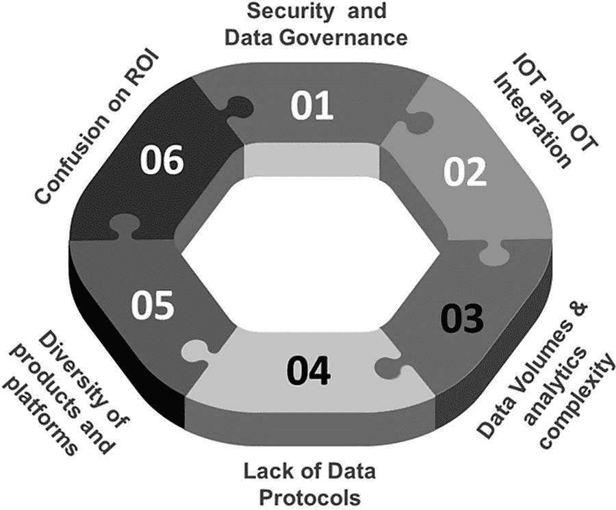
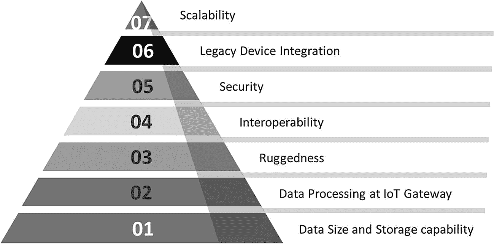

# 6. 智能物联网网关

实施物联网的组织正日益关注利用技术带来的业务成果，物联网计划不再仅仅是为了内部运营改进而驱动。IT 部门和业务利益相关者正在合作，将物联网项目与提升收入和改善客户体验的业务成果相结合。但由于遗留系统和方法的限制，他们正面临挑战。遗留系统不会消失，这是一个事实，但有一些赋能因素正在帮助企业克服这些挑战——智能物联网网关就是这样的一个赋能因素。

技术分析公司 IDC 预测，到 2025 年，总共将有 416 亿个连接的物联网设备，即“物”。它还指出，工业和汽车设备代表了连接“物”的最大机遇，但同时也预见短期内智能家居和可穿戴设备将被广泛采用。另一家技术分析公司 Gartner^(¹⁶)预测，今年企业和汽车领域将拥有 58 亿台设备，比 2019 年增长近四分之一。随着智能电表的推广，公用事业将成为物联网的最大用户。以入侵探测和网络摄像头形式存在的安防设备，将成为物联网设备的第二大用例。楼宇自动化（如智能照明）将是增长最快的领域，其次是汽车（联网汽车）和医疗保健（慢性病监测）。这清楚表明，尽管企业面临诸多挑战，但物联网将成为企业开展业务的未来，物联网成熟度高的组织在其物联网采用过程中将取得更高的成功率。

物联网的核心在于让个人和企业的工作与生活更轻松、更可信赖——它可能涉及使用家庭安防设备保护住宅，或自动切换大型建筑内的空调和供暖系统，也可能涉及预测性维护以减少工厂停机时间。在采矿业，物联网可以帮助避免每月派遣技术人员乘坐卡车或直升机去检查设备是否运行正常。借助物联网，企业可以预测设备故障周期，当设备预计在未来一两周内发生故障、真正需要维护时，技术人员可及时到达采矿点。这不仅为企业节省了成本，而且使他们能够变得更加高效。

在物联网世界中，有两个部门需要协同合作，而传统和文化上它们迄今并未过多共事——即信息技术（IT）部门和运营技术（OT）部门。典型的 IT 部门考核指标是系统正常运行时间、应用程序和 IT 基础设施的可用性、安全漏洞数量以及 IT 成本降低。另一方面，OT 部门由工厂经理、生产经理甚至农业种植者组成。他们是生产食物、控制油气流程、从地下抽取石油，或负责维护公司卡车车队的人。OT 部门的考核标准则完全不同，例如作物产量、创造该产量所消耗的水量、工厂的生产运行时间、如何为数百辆卡车的车队节省燃料、如何提高驾驶员的安全性、如何阻止人们从卡车或仓库中偷窃物品等等。

IT 和 OT 部门是两个不同的世界，每个部门的成功衡量标准差异巨大。随着物联网的到来，这两个部门必须走到一起，这正是连接人与连接物同等重要的地方。在物联网世界中，IT 和 OT 绝对必须共同协作才能开展这些项目，然后企业还需要引入支持职能部门，如财务、营销和销售部门。所有这些部门合力才能打造出最佳的物联网解决方案。这是企业在踏上企业级物联网之旅前需要解决的众多关键方面之一。

几年前，当物联网的讨论刚刚兴起时，专家们通常会解释物联网的基础知识及其相关益处。另一方面，一些企业的 IT 和 OT 人员是初次会面。时至今日，在物联网讨论中需要从头解释基础知识的情况已经非常罕见；其次，我们看到 IT 和 OT 团队之间的协同效应越来越多。

然而，障碍依然存在，企业在踏上物联网之旅时仍面临诸多挑战。在企业级物联网实施中，企业需要应对的六大挑战如图 6-1^(¹⁷) 所示。

图 6-1

物联网面临的挑战

#### 安全性

在物联网背景下，每个企业始终优先考虑的首要挑战就是安全性。作为物联网实施的一部分，企业正将原本并非为互联网通信设计的机器和传感器等设备暴露在互联网上，因此在设计这些设备时从未考虑过网络安全问题。我们正试图让运营技术领域中的每一个设备都能通过互联网访问，这意味着我们极大地拓宽了攻击面。尽管在这方面已做了很多工作，但安全性仍然是第一大挑战。我们将在第 8 章详细讨论安全性以及如何解决这个问题。

## IT-OT 团队整合

第二大挑战是让 IT 和 OT 员工协同合作，以实现物联网愿景。尽管这两个团队最近开始走到一起，但确保该团队完全围绕一个共同目标——使物联网用例取得成功——对企业来说至关重要。我们将在第 13 章讨论物联网核心团队，并尝试解决这一挑战。

## 数据量与数据分析

第三大障碍在于数据量及分析复杂性。物联网数据的激增带来了巨大的经济价值，预计到 2025 年将达到约 11 万亿美元。但海量数据也带来了重大挑战，使得数据整合和数据分析变得复杂，导致难以从物联网用例中快速、轻松地提取战略价值。

物联网数据的主要挑战在于其实时性。根据 IDC^(¹⁸)数据，到 2025 年，30%的数据将是实时数据，其中物联网占比近 95%；20%的数据将是关键数据，10%的数据将是超关键数据。企业要从中获益，就必须进行实时分析。虽然物联网显然会产生海量数据，但这并非主要挑战。关键问题在于，许多企业尚未建立数据驱动文化——这意味着企业在内部尚未建立成熟的大数据管理流程。挑战不在于数据量，而在于：我该从哪里获取数据？如何将数据整合起来形成有价值的见解？如何管理和维护这些数据？如何以最恰当的方式做到这一切？第`11`章将讨论大数据平台，帮助确保选择正确的平台和工具来有效管理和治理数据。

## 缺乏标准通信（数据）协议

第四个挑战源于企业内部存在大量传统设备，每种设备都有自己的协议，这使得物联网标准参考模型中不同层之间的通信变得非常困难。我们将在后续章节讨论物联网网关如何解决这一挑战。

## 产品与平台的多样性

第五大挑战是构成完整物联网生态系统的多元化产品和平台。如果任何供应商或服务商声称无需合作伙伴生态即可部署端到端物联网解决方案，那么他们的解决方案一定存在根本性问题。物联网解决方案需要庞大的生态系统支撑——从设备供应商到物联网网关制造商，再到物联网云服务提供商——才能构成完整的解决方案。企业需要在每个领域寻找最佳解决方案，从而使整体解决方案既具成本效益又高效。

## 投资回报率

最近出现的最后一个挑战是关于投资回报率。企业内部围绕物联网的讨论已从 IT 层面（首席信息官层面）转向财务层面（首席财务官层面）。CFO 对物联网实施的投资回报率提出了明确要求，这需要认真思考和明确阐述。毕竟，物联网需要先进行资本支出投资，随后再进行运营支出投资。

资本支出指的是长期开销，而运营支出则是公司的日常开支。资本支出通常是任何项目启动时所需的成本，而运营支出则分摊到项目周期中。

数据中心是指一栋建筑、建筑内的专用空间或一组建筑，用于在企业场所内安置计算机系统及相关组件。它是通过本地网络连接的计算和存储资源网络，能够提供共享软件应用程序和数据的交付。

云数据服务（简称云服务或云）是数据中心的远程版本，位于企业实体场所之外的某处，使企业能够通过互联网访问其数据。传统数据中心指的是部署在企业内部的服务器硬件，通过本地网络存储和访问数据。

企业在踏上物联网之旅时，需要仔细分析上述每个挑战。此外，企业还需明白，不存在一种可以作为物联网实施指南的通用架构。企业需要根据自身身份（即所属行业）、业务内容（即制造产品、研发药物还是销售杂货）、连接对象及连接方式来定制物联网架构——这些都是决定物联网架构的巨大依赖因素。

企业需要在物联网生态系统中连接多种设备，而这些设备并非它们自己制造。但如果你看看这些现场设备的多样性，就不难发现它们使用多种不同的协议进行通信，导致物联网生态系统极为复杂。我们目前讨论的大多数挑战，都可以通过将（智能）物联网网关引入物联网标准参考模型来解决。

## IoT 网关

设备和其协议存在诸多复杂性。正如第 5 章所述，设备使用多种协议，例如 Zigbee、Z-Wave、Wi-Fi、蓝牙等。另一方面，多个标准组织和联盟每天都在制定新的标准和协议。IoT 网关正是在此背景下应运而生。

IoT 网关是一种用于实现 IoT 通信（通常是设备到设备通信或设备到云通信）的解决方案。在最简单的形式下，传统的 IoT 网关是一种硬件或软件，用于使用多种通信协议从多个 I/O 设备收集和聚合数据。然后，网关将数据通信到本地数据中心或云中的服务器。在这种简化的背景下，网关充当“代理”的角色。在此背景下，网关直接连接到 IoT 现场设备（传感器、执行器等），或通过可编程逻辑控制器（PLC）或监控与数据采集系统（SCADA）连接，这些系统负责聚合现场数据。这些网关支持多种 I/O 接口，包括有线和无线连接。

在此类场景中，网关服务于两个主要目标：

1.  允许更多设备在工业规模上连接到互联网
2.  支持不同的协议——从 Zigbee 到 Wi-Fi 再到 4G/5G

可编程逻辑控制器或可编程控制器是一种工业数字计算机，经过加固和适配，用于控制制造过程，例如装配线、机器人设备，或任何需要高可靠性、易于编程和过程故障诊断的活动。

监控与数据采集系统（SCADA）是一种控制系统架构，由计算机、网络化数据通信和图形用户界面（GUI）组成，用于高级过程监督管理。

然而，在 Gartner 预计到 2020 年将有 200 亿台 IoT 设备投入使用的市场中，传统网关面临着诸多挑战。因为如果所有数据都需要从 IoT 设备发送到云端或数据中心，我们谈论的是每秒大量的数据，在某些用例中，每分钟的数据传输量可达数太字节甚至拍字节。IoT 设备会产生海量的原始数据，如果这些数据直接从 IoT 网关发送到云端，会引入许多低效问题，因为从设备到云端的数据传输会导致延迟和高成本，并且除了在某些情况下引发数据隐私问题外，还容易堵塞网络连接。因此，尽管网关是为了连接未连接设备而构建的，但网关需要执行的另一项主要任务是在网关层面启动分析过程。这就是边缘计算颠覆市场之处。

边缘计算是一种分布式计算模型，它将计算和数据存储带到更靠近需要它们的位置，以改善响应时间并节省带宽。在边缘计算中，关键数据处理发生在数据源，而不是集中的云端位置。边缘计算通过在 IoT 网关自身执行重要任务来解决数据传输架构的低效难题。采用边缘计算技术构建的网关被称为智能 IoT 网关。

因此，从本质上讲，在 OT 端，当我们更多地谈论智能 IoT 网关时，它实际上就像管理一件事一样轻松地管理数百万台设备，此外还要消费来自设备的所有数据，提炼洞察，然后基于这些洞察执行操作。对于智能 IoT 网关而言，关键在于管理边缘的易失数据，并且仅将那些从长期来看实际需要存储或用于在非常专业的数据上执行分析的数据移动到 IoT 云平台。

### 智能 IoT 网关

边缘计算获得重视的原因之一是因为它可以避免高延迟，有时甚至可以降低存储成本。

有些用例涉及个人的生死，例如在医疗保健领域，在这些用例中，人们的生命、安全和巨额资金都处于风险之中。这些是企业寻求几乎零延迟的例子，因此没有意愿将所有数据传回云端进行处理。企业需要通过使用智能 IoT 网关，尽可能快地在数据源处处理数据。智能 IoT 网关应能够提供我们传统上期望从云端或数据中心的 IoT 平台获得的那种高功率、高性能和低延迟。

智能 IoT 网关应能够执行从外部管理 OT 和从内部管理 IT 的任务。这意味着，在一个 IoT 用例中，企业需要处理多种不同类型的设备，并且每个行业使用不同的设备。楼宇管理中所用的设备与汽车行业或制药环境中使用的设备截然不同。这些设备使用多种协议和输入/输出，并且它们将在未来许多年中与我们共存。IoT 解决方案必须与这些设备和协议共存。这意味着智能 IoT 网关应能够支持并与此类海量 OT 设备进行通信，以便企业能够从这些设备中检索所有数据——因此，智能 IoT 网关的第一个预期特性是具备正确的连接能力，以便能够连接并与任何类型的设备进行通信。

第二个方面是，这些智能 IoT 网关不会放置在数据中心、办公桌下或家庭环境中。这些设备需要非常坚固耐用，因为它们可能必须放置在高温环境下的风车或锅炉房中，这些环境并不十分友好，同时，它们必须使用寿命长，并在此类条件下高效运行。通常，网关会成为 IoT 架构中任务关键的部分，因为大多数使用 IoT 的企业将依赖这些设备来预测未来，因此这些网关的任何停机都可能导致业务问题。

总之，当企业在筛选 IoT 网关时，他们需要首先根据其企业内拥有的设备来查看网关支持的协议。IoT 网关应能够连接企业环境中的多种类型设备（包括旧式设备），其次，它们需要足够坚固，以便企业能够在苛刻和恶劣的环境中部署这些 IoT 网关，例如高温或多尘的地点。

一些 IoT 用例需要网关持续连接设备，并且能够根据从这些设备接收的数据做出时间敏感和实时的决策。在这种情况下，引入延迟是不可接受的，而延迟通常发生在数据往返于云端传输时。这意味着 IoT 网关应能够执行分析和做出实时决策。

最后，也是最重要的一点是安全性。许多行业，如医疗保健、制药、银行和金融服务，都受到监管，对于所有这些企业而言，数据必须保持在场内，因此 IoT 网关应具备存储数据的能力。

市场上有大量的物联网网关，根据企业的特定需求选择正确的网关对于物联网之旅的成功至关重要。物联网网关对物联网解决方案的成功部署有重大影响。由于网关选择不当，相当高比例的物联网项目会面临实施和可扩展性问题。因此，需要根据企业希望实现的物联网用例，仔细评估并选择合适的网关。

### 选择正确的智能物联网网关

选择正确的网关取决于多个因素，并基于企业选择实施的用例。七个关键考量因素如图 6-2 所示。

图 6-2
选择智能物联网网关的七个考量因素

#### 数据大小与存储能力

许多工业物联网用例需要部署数百个传感器，在某些情况下，一个地点可能部署超过一万个传感器，每个传感器每秒采集并传输数百次读数。分析数据量是网关选择过程中的重要一步。其次，许多网关供应商对可加载到物联网网关上的设备数量有限制，安装多个物联网网关来实现规模化可能并非最明智的解决方案。

部署在工厂中的工业网关通常每秒钟收集多个传感器读数。然而，可能会出现网络故障等情况，因此网关需要在网络问题修复期间将数据本地存储。

目前市场上大多数网关型号都具有存储能力，但在典型工业环境中安装的网关需要能够存储大量数据，并且存储时间更长。因此，建议选择允许扩展存储的网关。

#### 物联网网关级别的数据处理能力是另一项要求

我们曾讨论过，传统的物联网网关处理从传感器或物联网设备收集的数据的能力非常有限。许多传统网关制造商会开发不具备数据处理或数据存储能力的网关，这意味着所有数据都需要发送到数据中心或云端进行处理。现在，随着物联网用例的新需求，边缘端的数据处理已成为一项要求，因此智能物联网网关成为常态。

在大多数物联网解决方案中，并非所有来自传感器的数据都需要发送到云端进行处理。网关需要在将数据发送到云端进行大规模分析处理或数据存储之前，对从传感器获取的数据执行一些预处理操作。

需要根据企业需求选择合适的网关。

#### 物联网网关的坚固性

一些企业需要将网关安装在暖通空调（HVAC）机组或高海拔地区，因此网关需要足够坚固，能够在极端条件下运行。

某些网关型号设计用于在严苛条件下运行，例如温度范围为 –30°C 到 70°C，海拔范围为 15 米到 5000 米，并能承受高冲击和振动情况。企业需要确保选择适合其运行环境的网关。

#### 互操作性（连接性要求）

许多物联网平台利用近距离连接选项，例如蓝牙和以太网，而 Wi-Fi 和无线局域网则用于更远距离的连接需求。随着物联网在工业环境中的兴起，几乎所有企业都选择使用智能手机远程监控其工厂或车间的运营。有一些智能物联网网关型号确实支持更广范围的连接选项，以连接到移动设备。然而，并非所有物联网网关在这方面都同样出色，一般来说，网关价格越低，提供的连接选项就越少，这是一个需要考虑的重要因素。

作为一般规则，网关除了支持企业内设备使用的协议外，还应支持标准协议，如`TCP/IP`和`HTTP`。更具体地说，在工业物联网背景下，除了协议连接外，网关还必须能够与以下系统进行集成和互操作：

*   企业资产管理（EAM）
*   计算机化维护管理系统（CMMS）
*   车队管理
*   基于状态的维护（CBM）
*   制造执行系统（MES）
*   维护、维修和大修（MRO）
*   产品生命周期管理（PLM）
*   应用组合管理（APM）
*   现场服务管理（FSM）
*   楼宇管理系统（BMS）

#### 安全性

保护网关安全对于整个物联网平台[至关重要](https://www.techrepublic.com/article/9-best-practices-to-improve-security-in-industrial-iot/)。虽然大多数现代网关都内置了安全选项，但仍需检查网关使用的加密标准、网关是否提供强认证过程，以及网关是否能检测篡改。此外，选择在物联网网关级别进行设备管理的企业需要了解产品在设备管理方面提供的安全解决方案。诸如空中升级（`SOTA`）或安全的`DTLS`数据加密等功能是设备管理中必须具备的特性。

空中升级（`SOTA`）更新是一种通过无线方式安全地向设备交付新软件、固件或其他数据的方式。数据报传输层安全（`DTLS`）使企业能够加密在设备和智能物联网网关之间发送的数据包。

#### 遗留设备集成

许多企业拥有无法替换的遗留设备，这在制造业和医疗保健行业等工业环境中尤为普遍。

遗留设备基于传统的连接方式运行，因此需要选择能够与这些遗留设备通信的合适网关。

工厂使用的遗留设备和机械寿命较长。为了直接连接到互联网而升级或替换这些设备，在经济上通常不可行或不可能。在这些情况下，网关应能够连接这些遗留设备，以确保来自工厂的所有数据都能被集成。

### 可扩展性

可扩展性将是应对物联网（IoT）爆发式增长的关键。智能物联网网关必须能够在不降低服务质量的前提下，支持不断增长的连接设备数量、用户数量、应用特性和分析能力。

## IoT 网关对比

目前市场上存在多家专注于智能物联网网关的公司。在本书中，我们将讨论商用和工业物联网供应商。

商用物联网面向我们家庭之外的日常环境（消费物联网）。有一系列应用可以部署在我们经常光顾的场所，例如商业办公楼、超市、商店、酒店、医疗设施或娱乐场所。

工业物联网网关在设计上坚固耐用，适用于关键系统和工业环境。

几乎所有工业和商业物联网解决方案都需要智能物联网网关，因为许多物联网设备（如传感器和执行器）无法连接到 IT 基础设施。设备限制，例如体积小、采用传统协议、环境条件极端、位置偏远、电池供电、需要快速响应以及成本低廉，都需要专用的智能物联网网关来执行协议转换，并实现设备间的数据通信。智能物联网网关的另一个重要功能是在网关层面进行本地分析，从而缩短响应时间、提高可靠性并减少上游带宽。智能物联网网关另一个最关键的功能是安全性。很少有物联网设备具备企业级安全，尤其是传统设备在设计时从未考虑过网络安全。智能物联网网关应提供防火墙保护，能够将这些易受攻击的设备与企业资产以及开放互联网上的威胁隔离开来。

虽然物联网市场仍在发展，但戴尔和 HPE 拥有功能最强大的商用智能物联网网关，目前被认为是市场领导者。这些网关最适合需要大量计算和带宽的企业，例如实施视频监控。戴尔最近推出了一款针对视频监控的捆绑包。通常，任何能够处理视频数据点密度的网关也能处理工厂自动化和预测性分析。戴尔和惠普物联网网关的某些版本还支持人工智能和机器学习。

### 慧与 (HPE)

慧与认识到低端物联网网关市场的商品化趋势，将其 `Edgeline` 品牌保留用于其自给自足的融合边缘系统。这些网关聚合传感器数据，将其转换，并发送到云端进行进一步处理。这些网关还在网关层面执行自动化决策、存储和控制。慧与的 `EL1000` 和 `EL4000` 融合边缘系统是慧与提供的网关示例。

### 戴尔

戴尔提供 `Edge Gateway 5000 系列`，这是一种坚固耐用的网关，配备用于本地分析的双核 Atom 处理器。Atom 处理器是英特尔公司设计的一种超低电压微处理器，旨在与英特尔酷睿系列的普通处理器相比降低功耗和散热。

`Edge Gateway 5000 系列`专为工业温度、灰尘和湿度范围而设计。它们提供 Linux 0、Ubuntu Snappy 或 Windows 10 等操作系统。

尽管戴尔和惠普领跑物联网网关领域，但还有其他一些中端物联网网关供应商专门服务于特定行业和用例，以下将提及其中一些示例。

### 研扬科技 (AAEON)

研扬科技提供四款适用于室外应用的物联网网关，支持低功耗 LoRa 无线网络以及 4G 和 LTE 蜂窝网络。

凭借宽工作温度范围、防水连接器和防尘性能，研扬科技网关旨在用于能源计量、交通和其他户外应用。

### 迪进国际 (Digi International)

迪进国际是一家美国工业物联网技术公司，总部位于明尼苏达州霍普金斯市。

迪进国际的 `SmartSense` 等网关是为特定垂直行业开发的，例如餐饮服务与酒店、设施管理、教育、医疗保健、运输与物流以及零售。对于这些垂直行业，`SmartSense` 网关可与 Wi-Fi 和低功耗蓝牙等协议良好配合。

### 华为

华为拥有专门用于视频监控和智慧城市应用（例如路灯和计量）的专业网关。

## 总结

在本章中，我们首先讨论了企业在踏上物联网之旅时面临的挑战以及如何缓解这些挑战——这些挑战包括安全性、数据量、多样化的产品和平台、IT 与 OT 集成的挑战、缺乏标准化的通信协议和衡量物联网项目投资回报率的方法。

然后，我们讨论了在为物联网用例选择合适的智能物联网网关时发挥重要作用的七个因素，具体列举如下：

1. 数据大小与存储
2. 物联网网关的数据处理能力
3. 物联网网关的坚固性
4. 互操作性
5. 安全性
6. 网关与传统设备的集成能力
7. 可扩展性

最后，我们讨论了智能物联网网关应能够支持 OT 设备的规模，以便企业能够从作为企业 OT 生态系统一部分的所有设备中检索数据。除了规模之外，虽然大多数现代网关都内置了安全选项，但仍然需要检查网关使用的加密标准——网关是否提供强身份验证流程，以及网关是否能够检测篡改。很少有物联网设备具备企业级安全，由于传统设备在设计时从未考虑过网络安全，智能物联网网关应具备防火墙保护，能够将这些易受攻击的设备与企业资产以及开放互联网上的威胁隔离开来。

在下一章中，我们将讨论物联网云平台，它是物联网标准参考模型的核心。

脚注 1   2   3

