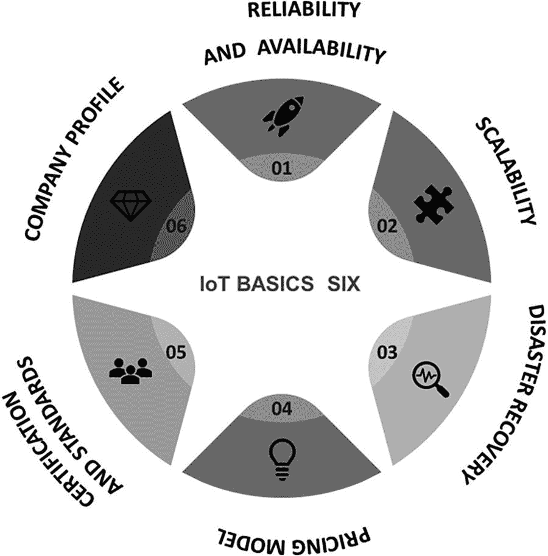
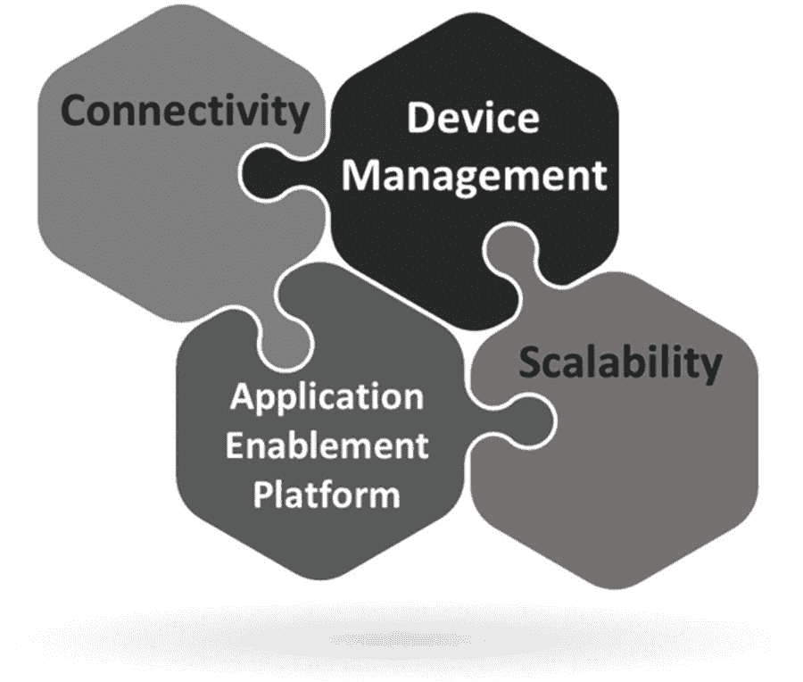
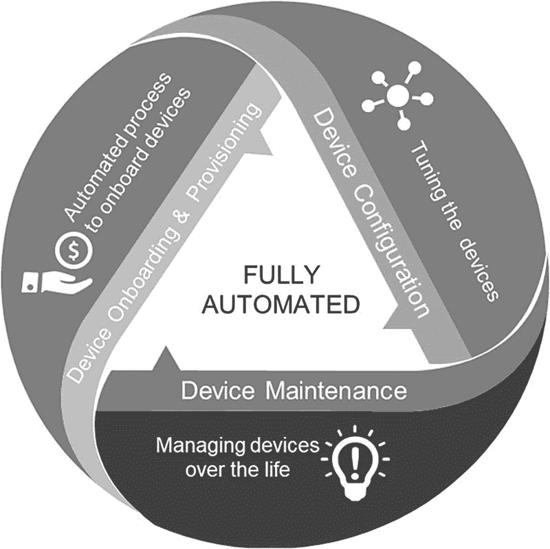

# 7. 物联网云平台

平台是软件与硬件的结合体，包含运行环境、存储、计算能力、安全性、开发工具及诸多其他通用功能。平台将大量通用功能从具体的应用逻辑中抽象出来。例如，无论你是要编写一个优化油耗的应用程序，还是管理教室空间的程序，底层技术的许多需求本质上是相同的。企业只需专注于解决具体的业务问题，而将计算能力、存储或安全等通用能力交由平台处理。一个优秀的平台能大幅降低开发和维护应用的成本。就像笔记本电脑的操作系统一样，平台在后台处理了大量事务，让开发者、管理者和用户的工作更轻松、成本更低。

专为创建物联网解决方案而构建的平台称为物联网平台。物联网平台使企业能够更快、更便宜、更优质地构建物联网解决方案。物联网平台形态各异、规模不一。有针对特定行业的平台，如商业地产和家庭健康；有的专注于某一类设备，例如至少存在一些专注于为增强现实头显创建物联网解决方案的平台；还有的聚焦于特定功能，如制造。不同的物联网设备需要安全、高效地连接并实现互操作。物联网平台满足了这一需求，因此已成为物联网部署的支柱。尽管物联网平台的重要性显著提升，但市场上也涌现出大量的物联网平台。截至 2019 年底，已知的公开物联网平台约有 620 个，是 2015 年的两倍多。随着物联网平台数量的激增，企业必须选择能够支持其特定行业用例，同时又能满足未来十年物联网需求的正确平台。毕竟，企业不希望每隔几年就更换物联网平台，而是需要一个能长期使用的解决方案。

物联网平台所需的基本能力涵盖：连接与网络管理、物联网设备管理、数据采集、处理分析与可视化、应用开发（创建和管理物联网应用）、存储以及安全性。

随着智能物联网网关在物联网标准参考模型中的引入，部分功能由物联网网关来处理。例如，在大多数物联网场景中，除了数据采集、处理和部分分析外，连接与网络管理也是由物联网网关执行的。然而，这需要根据具体情况进行评估，必须仔细评估以确定最优、最有效的模型，从而决定哪些任务应由智能物联网网关执行，哪些应由物联网平台执行。基于此评估，才能选择合适的物联网平台。

## 物联网六项基本要素

性能是选择物联网平台的关键考量之一，但还有其他重要因素需要考虑。选择哪个物联网云平台并没有简单的答案；然而，在深入探讨某个特定平台开发得如何高效以支持物联网解决方案的细节之前，有必要根据如图 7-1 所示的六项通用特性（称为“物联网六项基本要素”）来筛选物联网云平台提供商。

图 7-1 选择云平台时的六项通用特性

### 可靠性与可用性

可靠且高可用的 IT 平台是任何企业开展业务的基本需求。可靠性是指系统或组件（托管在云端）在一段时间内无故障执行所需功能的概率。可用性是指平台提供商保证在给定时间段内数据和服务可用的时间。

例如，当你访问托管在云端或数据中心的应用程序或服务时，从可靠性的角度来看，以下是基本期望：

- 应用或服务正在运行。
- 你可以随时随地通过任何设备访问所需内容。
- 不会出现中断或停机。
- 你的连接是安全的。
- 你将能够执行完成任务所需的工作。

从定义来看，很明显，云平台的可靠性和可用性对于任何希望使用云来开展业务的企业都至关重要，因为停机将直接影响业务。

筛选云平台的工作便从这里开始。企业需要明确寻找那些不仅同意高可用性和可靠性服务等级协议（SLA），而且在过去几年中持续兑现这些 SLA 的提供商。

在理想世界中，系统应该 100%可靠且可用，但这可能是一个无法实现的目标。许多云提供商的服务等级协议（SLA）目标是 99.99%的可靠性。可用性通常以每年时间的百分比来记录，例如，99.999%的正常运行时间意味着企业每年无法访问资源的时间不超过约五分钟。

### 可扩展性

影响云提供商选择的第二个最重要因素是可扩展性。云可扩展性指的是系统应对和适应需求变化的能力。随着企业的发展，他们希望能够无缝地添加资源，而不会损失服务质量或出现中断。当资源需求减少时，企业希望能够快速高效地缩减系统规模，从而无需为不需要的资源付费。资源指的是操作系统、应用程序、特定硬件、工具或设备。

然而，云中的可扩展性不仅仅是根据需要添加或移除资源那么简单，以下几点值得关注。

#### 云弹性

云弹性这个术语用来描述云服务按需添加和移除资源的能力。弹性很重要，因为企业希望确保其客户和员工能够访问所需数量的资源，并且只需为所使用的资源付费。云弹性应该是自动且无缝的。访问云服务的用户应该察觉不到资源的增加或减少。他们只需确信能够不间断地访问和使用资源即可。

#### 垂直扩展

垂直扩展（或称“向上扩展”）指的是升级单个资源。例如，为现有服务器安装更多内存或存储容量。在物理本地部署环境中，企业需要关闭服务器才能安装更新，但在云端，这可以在不关闭服务器的情况下完成。

#### 水平扩展

这个术语用于描述通过添加更多组件来“扩展”系统。例如，企业可以通过将服务器与其他服务器链接来增加处理能力或内存。在选择云提供商时，水平扩展是需要验证的必要能力。企业应能以最小的影响添加额外的硬件或软件资源，以提供冗余，并确保服务保持可靠和可用。

#### 自动伸缩

自动伸缩是一项重要的云计算功能，能让企业自动管理云中不同类型的可扩展性。亚马逊云服务、微软 Azure、谷歌云等云提供商都提供自动伸缩功能，以确保无论资源当前负载如何，都能保持一致的性能，这也是选择云平台时需要验证的另一个关键要素。

### 灾难恢复

决定平台选择的第三个基本特性是云提供商在灾难发生时的应对能力。灾难恢复是安全规划的一个领域，旨在保护组织免受洪水、火灾及其他自然灾害等重大负面和意外事件的影响。建立灾难恢复机制能使组织在中断后维持或快速恢复关键业务功能。云计算中的灾难恢复意味着将关键数据和应用程序存储在云存储中，并在发生灾难时故障转移至辅助站点。在选择云提供商时，灾难恢复是一个需要纳入考量的关键特性。企业需要了解提供商的灾难恢复条款、流程及其支持数据保存预期（包括恢复时间目标）的能力。

静态数据通常指存储在持久性存储（磁盘、磁带）中的数据，而使用中的数据则指正在被计算机中央处理器处理或位于随机存取存储器中的数据。

传输中的数据，也称为动态数据或飞行中数据，分为两类：一类是通过公共或不安全网络（如互联网）传输的信息，另一类是在私有网络（如公司或企业局域网）范围内流动的数据。

### 数据安全

数据安全是第四个关键考量因素，也是选择物联网平台时最重要的元素。云数据保护是指在云环境中保护企业数据安全的实践，无论这些数据位于何处，是静态还是动态，也不论是由公司内部管理还是由第三方外部管理。企业需要确保所选提供商能满足基于其区域和行业需求的严格安全标准。企业需要核实云提供商是否符合 ISO 27000 系列等基本标准，以及其认证是否有效。企业还需要考察平台提供商是否符合欧盟的《通用数据保护条例》、美国的 1996 年《健康保险流通与责任法案》等数据保护与隐私法律法规的合规性。

企业数据和应用程序所驻留的服务器位置也至关重要，因为不同地方法律可能适用，企业需要百分之百确保能够控制其数据存储、处理及管理所辖的司法管辖区。

除了数据安全，云安全也是平台选择过程中需要了解的基本要素。云安全由一系列协同工作的政策、控制措施、程序和技术组成，旨在保护基于云的系统、数据和基础设施。从身份验证访问到流量过滤，平台提供商需要具备可根据业务确切需求配置的云安全能力。

平台即服务是一种云计算服务类型，其中服务提供商向客户提供一个平台，使他们能够开发、运行和管理业务应用程序，而无需构建和维护软件开发生命周期通常所需的基础设施。

基础设施即服务是一种通过互联网提供虚拟化计算资源的云计算形式。IaaS 是云计算的三个主要类别之一，另外两个是软件即服务（SaaS）和平台即服务（PaaS）。

软件即服务是一种软件许可和交付模式，其中软件以订阅方式授权并集中托管。它有时被称为“按需软件”，微软曾将其称为“软件加服务”。

对于企业而言，验证自身需求与平台提供商在安全领域（例如认证、加密和监控能力）的能力是否匹配至关重要。

### 定价模式

云计算的优点之一是企业只需为其使用的服务和资源付费。云提供商采用按使用量付费的定价模式，而非收取固定费用。每家云服务提供商都有独特的服务组合和定价模式。不同提供商在不同产品上具有独特的价格优势。通常，定价变量基于使用时长，一些提供商允许按分钟计费，并为长期承诺提供折扣。

基于 SaaS 的产品最常见的模式是按用户按月计费，不过根据存储需求、合同承诺或高级功能访问权限，也可能存在不同的层级。

PaaS 和 IaaS 的定价模式更为精细，成本针对特定资源或“资源集”的消耗。除了财务上的竞争力，企业还需要考察资源变量以及配置和取消配置速度方面的灵活性。允许企业独立扩展不同组件的应用架构意味着可以更高效地利用云资源。

### 认证与标准

符合公认标准和质量框架的提供商表明其遵循行业最佳实践和标准。虽然标准可能不会直接决定选择哪个平台，但在筛选潜在的物联网平台提供商时，它们可能非常有帮助。例如，如果安全是首要任务，企业需要寻找获得 ISO 27001 或政府网络保障计划或 COBIT 等认证的物联网平台。

### 公司概况

始终建议与声誉良好、稳定性记录强且无法律问题或数据泄露历史的公司合作。平台提供商的选择应取决于其公司健康的财务状况。市场上存在超过 500 家承诺提供物联网云解决方案的云提供商，因此根据其公司概况来衡量服务提供商变得极为重要。

### 特定能力

到目前为止，我们讨论了帮助企业预筛选云平台提供商的基本六大能力。根据我对这六项基本功能的经验，企业可以将其物联网平台提供商筛选到不足十家。虽然这是达到的第一个良好里程碑，但必须理解，任何企业在物联网领域取得成功的最关键步骤，是基于提供商在物联网领域的专业性和能力来选择平台。一个物联网平台应当具备足够的广度和深度，以涵盖针对物联网解决方案的特定能力，这些能力需基于企业的业务和用例。如果这步出错，企业将面临物联网项目失败的风险。

如今，不存在一种“一刀切”的物联网解决方案平台。选择平台应始于对企业物联网战略的充分理解。识别企业试图通过物联网解决哪类问题、列出可能的解决方案和用例的短名单，并尝试确定你在哪些方面需要专业性和深度，这些都至关重要。如果企业清楚自己正在解决哪种业务问题以及最大的挑战在哪里，你就能快速筛选出少量候选平台。

好消息是，随着物联网标准参考模型中引入了物联网网关，一些核心功能在该层级得到处理，而物联网平台所需的其他能力则得到提醒。这种架构很有意义，因为它带来了架构内部的自主性。根据特定需求，企业可以选择哪些能力需要在物联网网关层面实现，哪些需要在物联网平台层面实现。

指导企业选择物联网平台的四大核心能力如图 7-2 所示，并列举如下：

图 7-2 选择云平台时的四大核心能力

1. 连接性
2. 设备管理
3. 应用使能平台
4. 可扩展性（设备层面、数据存储和分析）

### 连接性

第一个是连接性。在大多数用例中，智能物联网网关管理着与物联网设备的通信。物联网平台应能够与智能物联网网关无缝通信，并以实时和批处理两种方式收发数据。

批处理是一种处理大量数据的模式，即在一段时间内收集一组事务，然后批量传输到物联网平台。相比之下，实时数据处理涉及数据从智能物联网网关到物联网平台的持续输入、处理和输出。数据必须在很短的时间内（或接近实时地）得到处理。

### 设备管理

设备管理是物联网标准参考模型中一个非常重要的功能，它涉及对作为物联网生态系统一部分运行的连接设备进行配置和认证、配置、维护、监控和诊断的过程。一些企业选择由物联网网关来执行设备管理，而另一些则更倾向于在物联网平台层面进行。需要根据企业业务和用例做出适当的决策。设备管理大致包含三个不同的功能，如图 7-3 所示。

图 7-3 设备管理功能

#### 设备接入与配置

许多企业遵循手动流程：在现场激活设备，使用 IT 手段在网络中进行配置，并在物联网平台上向设备所有者注册。这是一个耗时密集的过程，同时可能导致安全漏洞，正如近期的大规模攻击所证明的那样——设备制造商出厂时设置了默认凭证，这些凭证被黑客利用僵尸网络攻击所攻破。僵尸网络是受恶意软件感染的联网设备集合，允许黑客控制它们。网络犯罪分子利用僵尸网络发起攻击，包括凭证泄露、未授权访问、数据窃取和拒绝服务攻击等恶意活动。

拒绝服务（DoS）攻击是一种网络攻击，攻击者试图通过暂时或无限期地中断服务，使机器或网络资源对其预期用户不可用。

一些企业声称，手动添加一台设备每台可能需要超过 30 分钟。想象一下，一个工厂安装了 10,000 个智能灯泡，所有这些都需要在物联网平台上进行接入。这意味着，通过手动方式，企业将需要花费 300,000 个工时来完成安装。如今，许多企业的关键需求是减少物联网设备在平台上的接入时间。在一个工业物联网案例研究中，某企业需要接入数万台设备，在如此大规模的环境下，手动流程会导致巨大的成本和努力。在选择物联网平台时，企业需要寻找那些能够缩短安装时间、让物联网设备以安全且自动化的方式更快上线的平台。市场上已有一些物联网平台采用了零接触方法，使得物联网设备在通电时能够动态发现物联网平台并进行自动注册。并非所有企业都需要此类功能，需要根据实际情况进行仔细分析，以选择适合的物联网平台。

在添加物联网设备时，企业需要确保只有受信任的设备才能加入企业的物联网生态系统。因此，设备认证至关重要，它是安全建立设备身份并确保其可被信任的行为。通过设备认证，企业可以确信设备是正品，运行着受信任的软件，并且代表受信任的用户工作。

企业需要确保他们选择的平台能够支持自动、安全的设备接入。例如，现场的一台新设备通电后，物联网平台应能定位该设备，并采用公钥加密等方法，以完全安全的方式自动将设备接入到物联网平台。公钥加密，也称为非对称加密，使用两个独立的密钥（公钥和私钥）而不是一个共享密钥。公钥加密是保障互联网安全的一项重要技术。

#### 设备配置

一旦设备成功接入，设备配置就开始发挥作用。设备配置是调整已接入设备超出其默认设置的过程，例如更改密码或升级到最新固件。物联网平台应提供灵活直观的配置机制，使企业不仅能在设备按计划运行时设计其智能设备群的行为，还能在出现故障时即时做出反应。企业中所有作为物联网生态系统一部分的物联网设备的总和被称为智能设备群。

#### 设备维护

设备维护涉及提升设备性能或消除设备技术问题的流程。这包括远程安装软件补丁或修复程序，或在无需人工干预的情况下，同时向所有物联网设备推送升级。

设备维护还涉及在设备故障时推荐或执行修复操作。当设备停机时，可从不同来源实时收集、聚合和分析故障数据，物联网平台可自动触发修复操作，或在必要时向技术人员提出行动建议。企业需要验证物联网平台提供商在这方面所提供解决方案的完备性。

对于资产密集型行业而言，在确保关键任务工厂和设备以最高效率和最长正常运行时间运行，并履行客户服务承诺方面，面临着诸多挑战，因为即使是服务中最微小的中断也可能导致高昂的罚款，甚至更糟的是客户流失。企业需要了解其产品和资产的运行状况，以便优化其使用并更好地预测问题和故障。这就是远程监控和维护在物联网生态系统中发挥重要作用的主要原因。监控和诊断不仅使企业能够更好地监控其产品和工厂机械的正常运行，还能防止代价高昂的故障和维修，并改善客户服务。

### 应用使能平台（具有卓越应用开发能力的物联网平台）

物联网平台所需的一个非常重要的特性是支持开发者轻松创建物联网应用的能力。企业需要选择一个具有卓越应用开发能力的物联网平台，该平台应能提供在最短时间内启动并运行物联网应用所需的全套工具。该平台应具备使开发者能够快速创建、测试和部署物联网应用或服务的解决方案。平台应提供预编写的应用程序，开发者可用其来加速开发。这些平台通常应包括软件和设备，以及更易于启动和运行物联网应用的开发和部署解决方案。其好处在于，此类平台负责通常由开发者完成的开发、网络配置和安装工作，这有可能节省大量的时间和开发精力。

选择一个具有卓越应用开发能力的物联网平台，可以通过缩短创建物联网解决方案或产品所需的时间并降低总拥有成本，从而简化物联网用例实现中的许多复杂性。

选择物联网平台时需验证的另一个重要方面是平台连接和集成其他企业应用程序的能力，例如 ERP（企业资源规划）或 MES（制造执行系统）应用。制造执行系统是制造过程中用于跟踪和记录原材料转变为成品过程的计算机化系统。ERP 是一个自动化生产、销售报价和会计等业务功能的系统。

物联网平台中的应用开发能力影响价值实现。需要谨慎选择物联网平台，同时考虑到开发者使用该平台进行开发的便捷性。除了开发的便捷性和与其他应用集成的能力外，可扩展性也至关重要。例如，该平台应能支持开发者创建固定应用，如基于 Web 的应用以及移动或桌面应用。

选择具有卓越开发能力的平台可以缩短上市时间并降低开发风险。有许多成熟的物联网平台供应商提供有价值的服务，可简化物联网应用的开发。它们为运动传感器等流行设备提供了预构建模型，同时为独特用例的自定义模块设计提供了平台。与传统自定义编码相比，使用这些平台，开发者可以轻松连接不同的物联网设备和服务，确定它们的交互方式，并更快地构建物联网应用。

总而言之，选择平台时，三个主要的应用考量因素是：

1. 开箱即用提供哪些应用程序？
2. 应用开发环境如何？
3. 有哪些常见的企业应用接口？

许多平台将包含一个或多个可能具有开箱即用价值的应用程序，例如 iPhone 附带的股票市场或天气应用程序。有时，最简单的应用程序是最受欢迎和最有效的。一位商店经理告诉我们：“如果能有一个应用程序，只需告诉我商店里哪些设备是开启或关闭的，我就很高兴了。”

### 可扩展性

可扩展性是每个企业在选择物联网平台时需要彻底验证的另一个重要特性。在物联网平台的背景下，可扩展性主要来自三个方面。

首先是物联网平台接入大量使用不同连接协议的设备的能力，其次是物联网平台存储海量数据的能力，第三是执行大规模分析处理的能力。这三个要素共同构成了物联网项目成功的核心。

#### （大规模）设备接入能力

如果企业决定通过物联网平台进行设备接入，那么选择一个能够根据需要接入尽可能多设备的平台至关重要，其上限可由企业业务及其所在行业决定。例如，特斯拉在 2004 年有数千台物联网设备，但如今其单位内拥有超过一百万台设备，任何像特斯拉这样规模的公司都会有类似数量的设备。为此类行业选择的物联网平台应具备一次扩展并连接数百万台设备的能力。再举一个例子，智能建筑可能需要数千个小型的物联网设备（如智能灯泡）接入物联网平台，而在工厂环境中，许多用例可能需要数百个大型物联网设备。

如今，许多商业级物联网平台都能灵活地在其平台上按需接入尽可能多的设备。

除了在平台上接入多个物联网设备的能力之外，执行设备管理的便捷性也是选择物联网平台时需要验证的关键因素。

### 数据存储与物联网分析

从可扩展性的角度来看，物联网平台另一个至关重要且必备的能力是数据存储的可扩展性。可扩展性是应对数据爆炸式增长的关键，因为物联网的核心就是设备产生的海量数据。物联网平台必须拥有卓越的数据存储和分析能力。物联网分析的目标是从通过物联网（IoT）连接的设备所产生的海量数据中获取价值。

借助云，数据存储可以按需提供，因此企业几乎无需为数据存储操心。几乎所有物联网平台提供商都使用云进行数据存储，因此默认情况下会有足够的存储空间来收集和处理海量的物联网数据流。

`数据湖`是一个集中式存储库，允许你存储任意规模的所有结构化数据和非结构化数据。

`数据沼泽`指的是用途有限的数据。

然而，在物联网生态系统中，存储本身并非挑战，关键在于物联网平台是否具备解决方案，能够以正确的方式存储正确的数据。在物联网架构中，成千上万的传感器收集着海量的结构化和非结构化数据，例如温度读数以及视频和音频素材。几乎所有物联网平台都使用数据湖来存储这些原始数据。数据湖的优势在于它们可以无限扩展，能与众多处理和分析工具集成，并且存储成本相对较低。然而，为了实现对物联网数据的分析，企业需要仔细规划其存储策略。仅仅将数据不加处理地倾倒入数据湖可能会形成数据沼泽。企业需要确保只将必要的数据保存到数据湖中，其次，数据应以便于分析的格式存储，而无需对数据进行大量修正。物联网平台应能支持此类需求。

虽然我们讨论的是物联网平台层面的数据存储，但这并非意味着企业必须将所有数据（处理工作）都迁移到云端。在许多场景中，云端物联网平台与智能物联网网关的组合方案会被用来在规模、成本、延迟和数据隐私之间取得恰当的平衡。某些数据存储和分析流程可能需要发生在智能网关上，而其余部分则在云端完成，反之亦然。考虑到这一点，企业需要确保其连接的系统能够支持此类混合工作流，从而实现从边缘（智能物联网网关）到云端（物联网云平台）的无缝迁移。

无论数据存储和分析发生在何处（即在物联网网关层级还是物联网平台层级），物联网平台都需要一个强大的数据处理引擎（管道），能够对流式数据执行数据整理（清洗、丰富、转换）功能。数据管道需要具备良好的平衡能力，以维持流式数据的持续流动。它还必须能够应对诸如数据临时激增、性能问题以及下游系统中断等情况。

## 概念验证

在筛选出平台供应商后，企业必须运行若干概念验证，使用不同的技术标准（例如功能、工具和服务的数量和质量、可用性、安全性以及互操作性）来测试平台性能和能力。在此步骤中，还应验证平台的成本。

不应要求平台供应商展示某些假设性的能力，企业应搭建一个接近其实际产品或生产流程、并包含来自其产品或工厂的实际数据集的真实测试环境，然后进行概念验证。

本质上，企业需要创建概念验证来探索和“试用”这些平台，了解它们的工作原理，以及基于实际使用场景能从中获得哪些优势。

## 总结

本章主要讨论了如何为企业选择合适的物联网云平台，以助力其物联网之旅取得成功。虽然对于选择哪个物联网云平台没有简单的答案，但本章基于六个通用特性和四个核心能力提供了一些指导：

*   在选择物联网云平台时需要验证的六个通用特性包括：可靠性、可用性、可扩展性，以及云提供商支持灾难恢复的能力。安全性是另一个需要验证的重要元素。定价模式、平台拥有的认证和标准是另外两个需要验证的方面。

*   指导企业选择物联网平台的四个核心能力包括：连接性、设备管理、应用使能平台，以及可扩展性（设备层面、数据存储和分析层面）。

基于上述指导，企业可以选择合适的物联网云平台。

在下一章中，我们将讨论安全性的重要性及其在物联网标准参考模型每一层中的适用性。

脚注 1 2