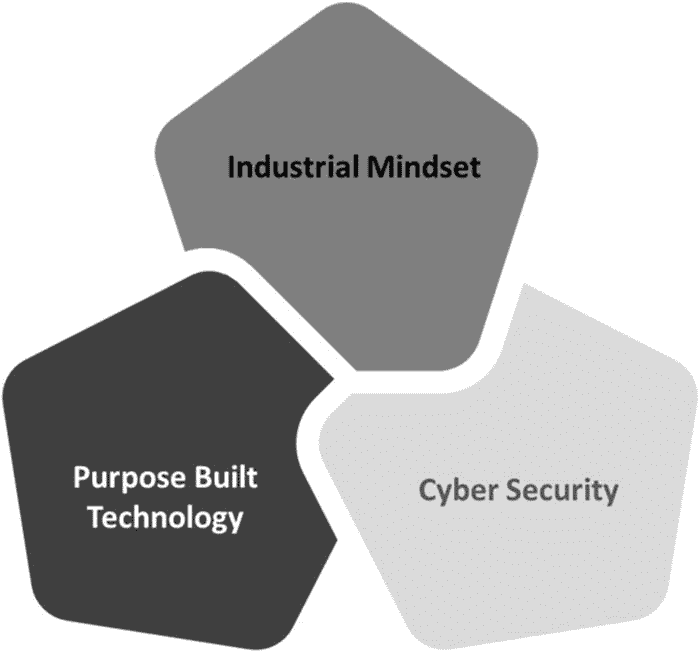

# 物联网中的安全

企业中的 OT 系统就如同收银机——无论是发电机组、汽车制造单元、炼油厂还是化学研发，OT 系统都在为企业创造财富。因此，传统上所有关注点都集中在确保生产最终产品的 OT 系统设计得极其安全、高效且具备"长生命周期任务"的生产力上。长生命周期任务意味着关键基础设施的 OT 系统需要全年无休、每天 24 小时连续运行数十年。由于这种需求，重大的补丁或升级周期可能多年都不会发生，因此系统中存在的漏洞类型会长期存在。

在 IT 时代，我们已遭遇过多次安全事件。每当出现新漏洞，制造商就会推送补丁进行修复。这是一种被动响应方式——每次新攻击发生后，企业通过取证调查，最终打补丁并持续监控以防止问题重现。然而，这种方法在 OT 世界中行不通。一个小事故不仅可能导致工厂停产造成数百万美元损失，还可能因网络攻击导致人员伤亡和意外事故。另一方面，OT 控制系统中常加载着需要保护的商业机密（如配方）。这也是为什么 OT 安全在物联网安全关注度中处于最高优先级的原因之一。与 IT 世界不同，OT 系统存在以下特点：

*   未从网络攻击中吸取教训
*   不像 IT 系统那样进行升级
*   基础设施更陈旧、控制措施更少，因为 OT 系统从未被设计成暴露于外部世界
*   缺少为应对网络攻击而开发的工具和系统

这是 OT 世界当前面临的最大挑战。显然，在 IT-OT 融合之后，网络攻击者将试图通过 IT 系统进入 OT 系统。这是当今物联网行业面临的最大挑战。

过去我们见证了 IT 与 OT 融合的仓促做法。一个例子是 2008-2011 年的智能电表支付浪潮。当时行业大量投资于运营侧的新型技术。无线系统使得收集信息以降低运营成本成为可能，从而实现了运营效率。在此期间，OT 系统的安全性被搁置，随后行业便出现了针对智能电表的网络攻击。例如，有人通过在电表上放置大型磁铁来改变智能电表设置，使读数不再增加。这就是物联网演化过程中网络安全被视为次要需求的案例，一些公用事业提供商因此损失了数百万美元。

你在启动物联网之旅时，可以选择一开始就考虑网络安全，也可以以后再做。不幸的是，事后补救可能会导致灾难性局面，比如完全关闭业务，因为无疑会有许多不可预见的后果最终导致灾难。

目前行业对物联网的安全意识水平仍然差异很大。根据我与多家 OT 企业的交流经验，近 40%的企业认为与外部威胁隔离就是安全的解决方案，因此它们倾向于与外部世界断开连接。这些企业将隔离视为防范网络风险的策略，因此从未能够利用市场上现有的技术。它们面临着失去业务的风险，因为存在更优、更便宜的运营方式，而竞争对手很可能已经采用了这些方式。

在光谱的另一端，有少数企业（约 10%）对 IT 行业的进步具有认知并保持警惕，它们年复一年地提升网络安全态势，以领先于新兴威胁。还有一些组织介于这两类之间——它们属于受监管行业，必须在使命中满足合规要求。它们提升网络安全态势仅仅是为了满足合规需求。由于这些企业没有考虑合规之外的网络安全问题，它们极易沦为网络攻击的受害者。

IT 世界拥有成熟的网络安全实践，随着物联网在过去几年中的普及，这些实践在 OT 世界中也日趋成熟。因此，当今物联网领域的网络安全实践能够解决许多复杂问题，保护物联网世界中的关键基础设施和数据。

物联网是未来的现实。企业若想达到更高成熟度、实现更高生产力、交付更好更快的成果并降低成本，将物联网应用于其商业模式是唯一选择。许多企业已经认识到这一事实；然而，在一个从未从网络安全角度思考过 OT 系统的互联世界中，企业面临最高程度的风险。我经常遇到两类企业——一类是通过牺牲安全来追求生产力成果，另一类则根本不想向物联网迈进。这两种选择都不正确。唯一的选择是正视网络安全，采取行动同时保护 IT 和 OT，这是每个企业的使命。

在大多数针对 OT 系统的网络攻击案例中，黑客通过反复试验来破解系统。他们只是看看能远程访问什么，并试图找到进入运营系统的方法。我也见过相反的情况——在某些案例中，攻击从 OT 侧发起，然后被攻破的系统被用来获取 IT 系统的访问权限。我称之为"枢纽攻击"，这类攻击正呈上升趋势。

正如我们迄今所讨论的，物联网中的安全不能将 IT 和 OT 割裂开来。它们需要协同运作以防止网络攻击，这就引出了下一个问题：保护物联网系统安全意味着什么？如图 8-1 所示，有效保护物联网生态系统中的关键基础设施需要三个主要组件。

**图 8-1** 保护 OT 基础设施的组件

**工业思维**——在物联网中，工业思维排在首位。这意味着踏上物联网之旅的企业需要考虑 OT 系统的使命等因素，这些使命通常围绕零停机时间和安全性作为实践。它还关注工程纪律和质量焦点——这通常是设计这些工业系统时的核心考量，并认识到这些系统是企业的"收银机"。

### 网络安全

企业在处理运维技术（OT）系统时，第二个关键方面是拥有网络安全专业知识。网络安全人员需要了解信息技术（IT）与 OT 之间的异同，并应成为该特定领域的专家。OT 或关键基础设施某些层级所使用的技术类型与 IT 非常相似，例如工作站、标准软件堆栈或标准应用程序。但随着我们深入 OT 系统，会遇到不同类型的技术堆栈、嵌入式设备（如实时操作系统）以及用于连接这些系统的工业专有协议。网络安全专家需要理解技术上的差异以及 OT 系统所面临漏洞的差异——因为这些是任务周期长的遗留产品，需要引入恰当的解决方案来应对挑战。一旦系统受损，后果可能危及生命。

### 专用技术

第三个需要关注的领域是专用技术。这意味着企业需要关注那些专为工业互联系统（将成为物联网实施的一部分）提供深度可视性和保护的技术。网络安全专家需要审视 OT 系统每一层的具体风险性质，并确保在该系统内部署的保护措施能够支持每一项特定任务。他们需要深入理解用于连接这些系统的协议、数据传输速度和信息传递方式，并且不能引入任何意外的延迟或抖动，因为这些效率低下可能导致 OT 系统宕机。例如，在补丁更新周期上，IT 端通常比 OT 端更频繁。许多 OT 系统可能需要数月甚至数年才能完成补丁部署或实施保护，这完全取决于特定 OT 系统的运营任务。从专用技术的角度来看，我们看到的主要区别是：IT 端存在大量标准化协议，而 OT 端则有许多围绕专有技术和专有协议构建的设备——正是这些协议将 OT 系统粘合在一起，并连接它们以实现机器对机器的交互。IT 世界中采用的保护措施通常基于标准化协议，而在 OT 端，我们会遇到各种深奥且专有的协议，这些是系统用于相互通信的协议。因此，企业必须使用专为所有此类 OT 系统打造的安防技术和平台，这一点至关重要。

## 安全设计一体化（保护整个物联网生态系统）

安全设计一体化是指在物联网旅程的每个阶段以及物联网标准参考模型的所有层级中纳入安全设计原则、技术和治理。当组织考虑创建、部署和利用互联技术来推动业务时，安全必须集成到每个组件、层级和应用程序中，以维护物联网解决方案的完整性并最大限度地降低网络威胁风险。

物联网系统极其复杂，需要跨云层和连接层的端到端安全解决方案，并且应能够支持资源受限的物联网设备——这些设备通常性能不足，无法支持传统的安全解决方案。没有单一的万能解决方案，安全性必须在物联网生态系统中的每个层级都做到全面，否则攻击者只需利用最薄弱的一环即可突破。尽管传统的 IT 系统驱动并处理来自物联网设备的数据，但物联网设备本身将具有需要处理的独特附加安全需求。

物联网安全需要从设备采购（购买内置安全功能的设备）开始考虑，涵盖设备保护、API 安全、智能物联网网关安全、补丁管理、硬件安全以及物联网云平台安全。

这些基础要素可以组合起来，在物联网生态系统中形成强大且易于部署的安全基础，从而缓解对物联网的绝大多数安全威胁，包括高级和复杂的威胁。然而，企业需要认识到，没有任何单一解决方案能够完全覆盖物联网安全。每个用例和每个行业（汽车、能源、制造、医疗、金融服务、政府、零售、物流、航空、消费电子等）都是独一无二的，需要根据特定行业和用例面临的威胁来决定安全解决方案。

### 购买内置安全功能的设备

设备制造商需要确保安全内置于设备之中，而采购新设备的企业应仔细选择那些内置安全功能的产品。购买新设备时的另一个方面是，要了解那些具有硬编码凭证的设备并非企业物联网生态系统的理想候选。企业应在设备投入运行前能够更新默认凭证。设备应使用强密码、多重身份验证或在可能的情况下使用生物识别技术进行更新。

诸如椭圆曲线密码学之类的技术已经彻底改变了行业，特别是对于资源受限设备相关的安全领域，企业需要确保此类启用了安全功能的设备成为其物联网生态系统的一部分。领先的证书颁发机构（CA）赛门铁克已经将这些安全功能嵌入到超过十亿台物联网设备中，帮助实现对包括蜂窝基站、电视等在内的各种设备进行相互认证。

在物联网环境中，设备的身份管理至关重要。每个物联网设备都需要有一个唯一标识符，以便了解设备是什么、其行为方式、与之交互的其他设备，以及应对该设备采取的适当安全措施。

并非所有企业都能部署新的物联网设备，他们需要与现有设备和装备共存，其中许多是遗留设备。许多此类遗留设备和装备仍然需要连接到物联网生态系统。没有单一的解决方案来保护此类设备，企业需要根据正在连接到互联网的设备和装备来制定安全解决方案。

表`8-1`概述了传统 IT 和 OT 安全解决方案，以及这两者如何结合可以在 IT-OT 融合后保障企业安全。这是一个不完整的列表，为企业在 IT-OT 融合世界中管理其安全状况提供了一个起点。每个企业都需要根据当前使用的运营系统来量身定制自己的网络安全解决方案。

**表 8-1**

传统 IT 与 OT 安全解决方案

| 服务 | 描述 | 传统 IT | 传统 OT | IT-OT 集成（物联网） |
| --- | --- | --- | --- | --- |
| 防火墙 | 充当网络与更广泛互联网之间的守门人。通过将数据包与预定义规则和策略进行比较，过滤传入（某些情况下也包括传出）的流量。 |  |   |  |
| 入侵防护服务与入侵检测服务 | 深度包检测；防止恶意软件进入网络。 |  |   |  |
| 访问控制 | 控制哪些用户可以访问网络或网络中的敏感区域。 |  |   |  |
| 防病毒与反恶意软件 | 用于预防、检测和移除恶意软件的软件。 |  |   |  |
| 应用安全 | 指企业中用于在应用开发和运维过程中监控安全问题与风险的硬件、软件及最佳实践的集合。 |  |   |  |
| 行为分析 | 一种识别并解决异常行为的方法。 |  |   |  |
| 数据丢失防护 | 一种技术，用于防止员工在不知情或心怀恶意的情况下，将宝贵的公司信息或敏感数据泄露到网络之外。 |  |   |  |
| 网络监控与可视化 | 一种自动生成所有网络通信视图的技术，支持策略创建和自动执行。 |   |  |  |
| 网络分段 | 一种管理 IT 网络与 OT 环境之间数据流的能力。 |   |  |  |
| ICS 漏洞情报 | 一种自动检测工业恶意软件（包括零日漏洞）的平台。零日漏洞是指软件供应商已知但尚未提供补丁修复的软件安全缺陷。 |   |  |  |
| OT 防火墙 | 一种提供策略驱动和集中管理能力的技术，使企业能够掌控其工业环境。 |   |  |  |

### 保护设备

保护设备免受攻击需要同时采用代码签名和运行时保护。

代码签名是对可执行文件和脚本进行数字签名的过程，用于确认软件作者身份，并保证代码在签名后未被篡改或损坏。运行时自保护（RSP）是一种安全解决方案，旨在为设备上运行的应用程序提供个性化保护。它利用对应用程序内部数据和状态的洞察，使其能够在运行时识别其他安全解决方案可能忽略的威胁。代码签名通过加密方式确保代码在被“签名”为设备安全后未被篡改。所有关键设备，无论是传感器还是集线器，都应配置为仅运行已签名的代码，绝不运行未签名的代码。尽管如此，在代码开始运行后很长一段时间内，设备仍然需要受到保护。基于主机的防护在此发挥作用。基于主机的安全性是一种运行在连接到网络的个人计算机或设备上的防火墙软件。这类防火墙是一种精细化的方式，用于保护单个主机免受病毒和恶意软件的侵害，并控制这些有害感染在网络中的传播。

基于主机的防护为各种物联网设备提供了加固、锁定、白名单、沙箱、面向网络的入侵防御以及许多此类安全功能。

### API 安全

应用程序（或编程）接口（API）将设备与整个物联网生态系统连接起来。物联网 API 是物联网设备与互联网和/或物联网网络内其他元素及系统之间的交互点。

API 安全关注的是通过连接至互联网的 API 进行数据传输的过程。企业必须保护从物联网设备发送到智能物联网网关、再到物联网云平台或后端系统的数据完整性，并确保仅有经过授权的设备和应用程序才能与 API 通信。

以下列出了企业寻求加强 API 安全性时最常见的几种方式示例：

*   **使用令牌** – 建立可信身份，然后通过分配给这些身份的令牌来控制对服务和资源的访问。
*   **使用加密和签名** – 使用 TLS 等方法对数据进行加密。传输层安全是一种密码协议，旨在为计算机网络提供通信安全。带有签名的设备将确保正确的用户在解密和修改数据。
*   **升级与漏洞识别** – 企业需要定期升级其操作系统、网络、驱动程序和 API 组件。他们需要了解所有组件如何协同工作，并识别可能被用于入侵 API 的薄弱环节。一些企业使用嗅探器来检测安全问题并追踪数据泄露。嗅探是监控和捕获通过特定网络的所有数据包的过程。
*   **使用配额和限流** – 企业通常需要设置 API 可被调用的频率配额，并追踪其历史使用情况。API 调用次数过多可能表明其正在被滥用。这也可能是编程错误，例如在无限循环中调用 API。企业需要制定限流规则，以保护 API 免受流量激增和拒绝服务攻击。
*   **使用 API 网关** – 建议将 API 网关作为 API 流量执行的主要节点。一个好的网关将能够认证流量，同时控制和分析 API 的使用方式。

### 智能物联网网关安全

物联网网关是一种解决方案，能够实现与设备的通信，无论其协议如何；同时，它还能作为资源受限的物联网设备、传感器和执行器的安全代理，这些设备因缺乏处理复杂加密安全功能（如安全访问认证和加密）所需的 CPU 算力、电池续航和存储空间而需要保护。然而，在物联网环境中，不仅设备本身，网关自身也容易受到各种安全威胁，因为网关暴露于互联网。如果网关不安全，一旦网关被攻破，所有配套的安全技术都将变得毫无用处。企业需要确保部署的智能物联网网关具有万无一失的安全控制措施，并且至少具备端点安全控制功能，例如身份与访问控制、无线升级以及威胁检测功能。

#### 身份与访问控制 (IAC)

身份管理和访问控制是管理对企业资源访问权限、确保系统和数据安全的规程。作为安全架构的关键组成部分，IAC 有助于在授予设备或用户对系统和数据的适当访问级别之前，验证其身份。

网关在参与数据交换之前，需要有一个信任根来在网络中标识自身。网关应被设计为信任锚点，并配备基于密钥的访问控制，以授权经过授权的用户和设备进行访问。为了保护秘密（密钥和证书），应实施安全存储。

通常情况下，网关暴露于极端的室外环境。防篡改硬件可以保护其免受物理损坏。

#### 无线升级与安全启动

无线升级可确保网关运行的是最新的软件和固件，且无常见漏洞和风险。安全启动使网关能够启动其完整性和真实性已通过加密验证的固件映像。此预防措施可防止网关使用恶意固件启动。

#### 可视性与威胁检测

细粒度的事件日志记录为网关中运行的程序提供了足够的可视性，这对于安全审计非常有用，并且还能自动进行威胁检测和故障排除。在访问可能受限的物联网环境中，使用机器学习或人工智能来自动化威胁检测更为实用。机器学习使企业能够识别行为基线，并检测甚至预防异常情况，在选择物联网网关之前，应对此类功能进行验证。

### 补丁管理/持续软件更新

提供通过网络连接或自动化方式更新设备和软件的方法至关重要。协调漏洞披露对于尽快更新设备也很重要。同时还应考虑设备生命终结策略。

### 硬件安全

端点加固包括使设备具有防篡改或篡改可察觉的特性。当设备将在恶劣环境中使用或无法进行物理监控时，这一点尤其重要。

### 物联网平台安全

几乎所有大型物联网平台供应商，如 AWS、Google 或 Azure，都已通过最全面的安全态势保护其平台，并在平台层面内置了保护功能。这些平台构建于安全且经过验证的云基础设施之上，并且可以扩展以支持数十亿台设备和数万亿条消息。

使用这些产品的企业需要确保充分利用这些供应商提供的安全功能，来服务于其物联网生态系统。

## 利用区块链保障物联网安全

区块链是一种分布式账本，类似于数据库，但其并非由中心化权威机构（例如谷歌这样的公司、小型企业或个人）控制，而是分散在多台计算机上，这些计算机可以遍布全球，任何有网络连接的人都可以运行。

我们将在第 9 章中探讨如何从创造商业影响力的角度（而非网络安全角度）运用区块链。然而，区块链也为物联网安全提供了一种引人入胜的解决方案。区块链具备强大的数据篡改防护能力，能锁定对物联网设备的访问权限，并允许关闭物联网网络中受损的设备。不过，物联网-区块链技术目前仍处于初级阶段，少数几家大型科技公司已开始在这一领域寻求机遇。例如，IBM 区块链平台允许企业将区块链扩展到认知物联网——这是一套融合了物联网与认知计算的技术。

由于技术问题和运营挑战，物联网-区块链技术的采用尚未普及。在维护大型中心化账本的区块链系统中，可扩展性和存储是主要问题。将账本存储在边缘节点上被认为是低效的，因为设备目前尚无法存储大量数据或处理相对较高的计算需求。这些因素是将物联网网络迁移到区块链平台所面临的部分挑战。

尽管该概念仍处于萌芽阶段，但在未来几年可能会产生巨大影响。标准安全规则和法规的实施将推动物联网-区块链技术的采用。通过引入数据隐私和对等通信的新标准，区块链可以为联网设备增加新的安全层级。对等通信指的是两个对等设备或系统之间通过网络进行的传输。

基于这些原因，已开启物联网之旅的企业应采用内置安全设计原则来保护其物联网生态系统，而非使用区块链。

## 总结

本章内容围绕安全展开。我们讨论了传统运营技术系统在设计和实施其系统时，通常未考虑网络安全。然而，随着物联网的出现，信息技术和运营技术系统正在融合，因此，同时保障信息技术和运营技术的网络安全变得极为重要。

我们谈到了物联网中安全设计（即安全设计原则、技术和治理贯穿物联网之旅的每个阶段以及物联网标准参考模型的所有层级）的重要性。

安全设计的首要方面是采购具备安全功能的设备，例如多因素认证或生物识别技术。第二个要素是保护应用程序编程接口——对于企业而言，保护从物联网设备发送到智能物联网网关、物联网云平台或后端系统的数据完整性至关重要，并要确保只有经授权的设备和应用程序才能与 API 通信。使用标准的安全 API 网关是保护 API 的最佳方式之一。我们讨论的最后一个方面是，企业应部署具有万无一失安全控制的智能物联网网关，并且网关至少应具备端点安全控制功能，例如身份与访问控制、空中升级以及威胁检测特性。同样地，企业需要部署内置安全功能的物联网云平台。

在下一章中，我们将详细了解区块链，以及它如何为物联网应用场景带来益处。我们还将讨论企业可用于其物联网应用场景实施的不同区块链模式。

