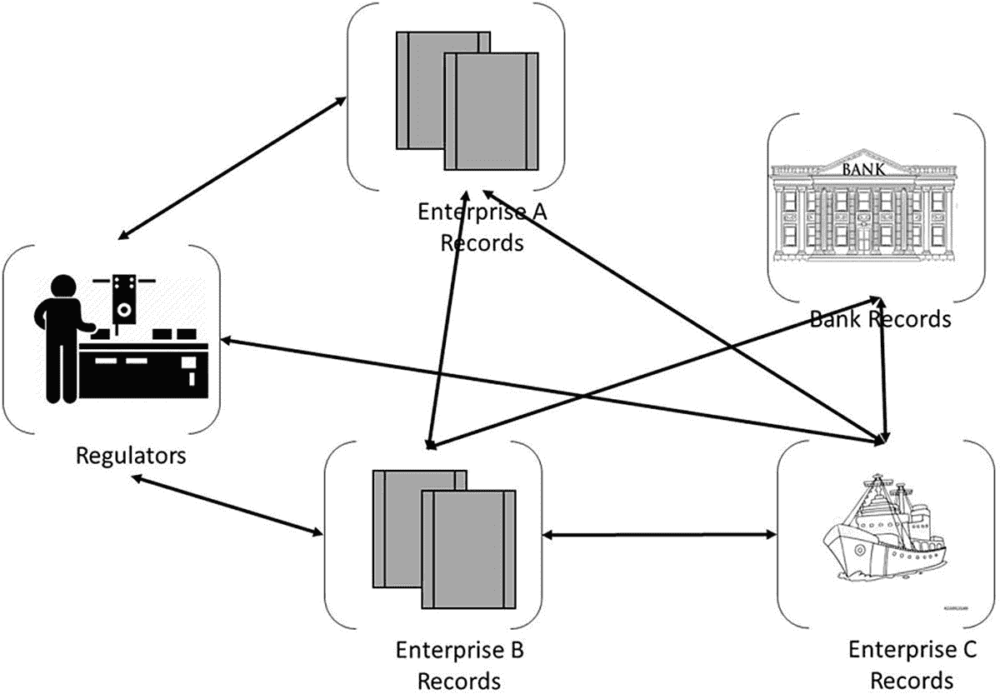
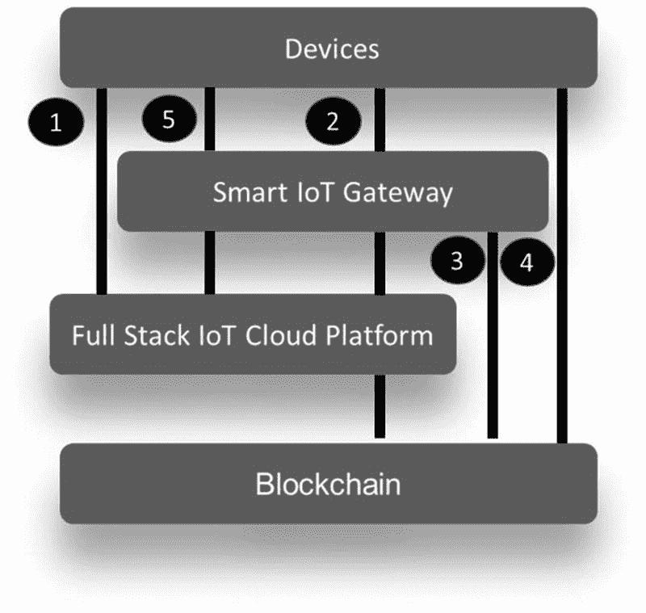

# 9. 区块链与物联网

`Blockchain` 是科技界最热门的话题之一，它正在彻底改变未来企业的商业模式。尽管该技术仍处于实验阶段，但许多企业已经从中获得了诸多益处。从基础讲起，`Blockchain` 最初是由一些年轻数学家开发的一种用于交换货币的技术，如今它已走到舞台中央，几乎所有商业交易都可以安全、经济地执行。区块链有望促成企业间的协作，能够以标准化、结构化和安全的方式，在整个生态系统中共享事实数据和业务逻辑。

`Blockchain` 是一个共享的、经加密且不可篡改的账本，用于记录交易历史。`Cryptography`（密码学）与将普通明文转换为无法理解的文本（以及反向过程）相关联。它是一种以特定形式存储和传输数据的方法，只有预期对象才能读取和处理这些数据。

`Blockchain` 并非中心化的，这是最有趣的部分——这意味着它不归某一方或个人所有。它是民主化的，这一点很重要，正因如此，它增加了各方的信任，因为没有单一实体拥有该区块链。它提高了问责性（因为每个授权方都参与决策过程），最重要的是提高了透明度（因为每个授权方都能看到每一笔交易）。有了这种透明度和问责性，该技术得以大幅减少摩擦。

让我用简单的语言解释一下区块链。

你可以把区块链看作一本书。一本书有很多页，所有页面都用装订线粘合在一起。这本书归一人所有，或在某些情况下归多人共有。每一页都有多个条目或交易——例如，A 持有 X 值，B 持有 Y 值——并且每个交易都用于计算该页的一个唯一值，这个值被称为唯一标识符。这意味着，如果页面中的任何值发生改变，唯一标识符也会随之改变。

用区块链的语言来说，一本书被称为账本，页面被称为区块，装订线就是区块链的链。如果这本书由一人拥有和管理，则称为中心化账本管理；如果由多人拥有和管理，则称为分布式账本管理。唯一标识符被称为哈希。如果区块中的任何内容发生变化，哈希值就会改变，因为哈希是通过使用区块中的每个条目生成的。区块链的一个重要特性是不可变性，这意味着任何交易一旦记录便无法更改。如果有人试图篡改或更改现有区块的内容，这些更改只会反映在他们自己的副本中，而其他人看到的仍是未经篡改的区块版本，这意味着区块链是不可变的。这使得区块链具有防篡改性和高度安全性。现在，向区块链添加新区块类似于向书中添加新页面。这就是区块链的全部要义。

区块链有两种变体。一种称为公有区块链，另一种称为私有区块链。

## 公有区块链

公有区块链是一种任何人在任何时间都可以加入的区块链网络。基本上，参与没有限制。更重要的是，任何人都可以查看账本并参与流程。例如，`Ethereum` 就是一个公有区块链平台。

如果企业寻求完全去中心化的网络系统，那么公有区块链是一条可行的道路。然而，当企业试图将公有区块链网络与企业内部的区块链流程整合时，公有区块链可能会变得非常棘手。

公有区块链的最大优点在于其所有参与者都拥有平等权利的理念。每个人也能查看账本，从而始终保持透明度。然而，公有区块链也同样存在相当的缺陷。实际上，这些平台比通常情况更慢；安全性较低，且常常违反数据隐私法。此外，由于其匿名特性，可能会吸引恶意人士利用该平台进行非法活动。

尽管公有区块链有其自身的优势，但企业通常倾向于采用私有区块链来运营业务。更重要的是，在物联网和人工智能的背景下，私有区块链是最受欢迎且被推荐的模式。

所以简单来说，公有区块链遵循的是分布式账本管理，而非中心化账本。在中心化账本中，由一个人或实体负责管理区块链；而在分布式账本中，所有参与区块链的个人或实体都会获得完整账本的一份副本，并共同对账本负责。

在公有区块链环境中，任何人都可以向区块链添加新区块，但他们必须解决一个非常复杂的难题。这种方法的问题在于，解决难题会消耗大量的算力。

## 私有区块链

私有区块链是一种特殊类型的区块链技术，其中只有单一组织或组织联盟对网络拥有管理权。网络不向公众开放加入。所有私有区块链解决方案都会采用某种形式的授权方案来识别进入平台的实体。

私有区块链网络需要邀请，并且必须由网络发起者或由网络发起者制定的一套规则进行验证。建立私有区块链的企业通常会建立一个许可网络。这限制了谁有权参与网络以及谁可以执行哪种交易。参与者需要获得邀请或许可才能加入。访问控制机制可能有所不同——现有参与者可以决定未来的进入者，或者监管机构可以发放参与许可，又或者由联盟来做决定。一旦实体加入网络，它将在以去中心化方式维护区块链的过程中发挥作用。

在私有区块链环境中，企业无需花费算力来向区块链添加新区块，因为网络发起者或业务所有者可以直接将区块添加到区块链中。

在一个典型的场景中，如果我们审视任何企业业务的端到端流程，会发现它是多个参与方相互沟通以完成一笔商业交易或一个业务流程的集合，如图 9-1 所示。

图 9-1

典型商业交易示例

这里有生产商、财务部门、监管机构、运输机构和零售商，每个参与方都使用自己的系统来维护记录，并基于这些记录与其他方沟通。随着这种沟通和记录过程变得复杂，可能会出现许多分歧，为了证明自身数据和记录的正确性，企业在中介、审计和合规等方面花费了数百万美元。这就是当今的现实，意味着一个低效的系统，而这种低效的主要原因在于，我们经济中的每个实体都维护着自己的记录，并且在许多情况下，这些记录并未与其他实体共享或公开透明。私有区块链正是为解决当前经济中企业间交易和沟通的低效问题而提供的一种方案。

### Hyperledger

区块链是一个与每个直接或间接关联的企业共享的单一数据库，每个企业都拥有区块链上所有交易的相同副本。

在谈论区块链时，一个经常出现的概念是`Hyperledger`。`Hyperledger`是一个开源区块链及相关工具的伞式项目，于 2015 年 12 月由 Linux 基金会发起，并获得了 IBM、英特尔和 SAP 的贡献，以支持基于区块链的分布式账本的协作开发。

`Hyperledger`是一个全球性的企业区块链项目，提供必要的框架、标准、指南和工具，用于构建开源区块链及相关应用，并适用于各个行业。`Hyperledger`是一个专为使用区块链进行业务的企业而设计的许可链。在该环境中，同意加入许可链联盟的每一方都能看到其拥有权限的所有数据，从而能够查看区块链上记录的所有允许交易。例如，零售商能够看到其产品的位置；即使产品由第三方物流公司配送，他们也能找到货物或产品的运输位置、状况等信息。由于链不由单一方控制，因此不会有分歧，也没有人能篡改数据——只有一种真实状态，该状态在全体成员间分布式且透明地共享，每个成员在数据和交易方面拥有同等的优先级和问责权。一旦输入的任何内容都将永久保存，这意味着数据的准确性不存在争议或疑问。

广义上，加密货币是一种以代币或“硬币”形式存在，并由区块链驱动的分布式去中心化账本支持的货币。

智能合约是一种自动执行的合约，买卖双方之间的协议条款直接写入代码行。代码及其包含的协议存在于分布式、去中心化的区块链网络中。

### 区块链如今几乎惠及所有行业

尽管其最初目的是作为加密货币的底层机制，但如今的区块链技术已远远超越了仅为比特币交易提供动力的范畴。区块链是一种强大且安全的技术，正渗透到几乎所有行业，从银行业、医药业甚至到政府部门。结合物联网，区块链正在重新定义未来企业开展业务的方式。

例如，在航运和物流领域，我们考虑一个贸易场景：从生产点开始，到通过船舶或卡车运输，最终到达仓库再送至商店，每件物品都变得可追踪。如果供应链中的每个企业，如物品生产商、负责运输的货运管理公司、存储产品的仓库以及最终销售产品的零售商，都能随时追踪物品的位置、状况以及当前负责人，这将使整个端到端的供应链变得非常透明和高效。

让我们讨论另一个案例，关于食物如何从农场到达餐桌，以及区块链如何成为一项颠覆性技术，使其更安全、更可持续。

你可能听说过 2018 年在美国发生的沙门氏菌污染事件，由一家名为“美国花生公司”的企业引发，导致 9 人死亡，46 个州报告了超过 700 例沙门氏菌中毒病例。这家公司在美国生产的花生酱产量非常小，仅占全美产量的 2%。花生酱是许多产品中使用的原料。由于许多产品使用这种花生酱，在疫情爆发期间，几乎所有使用该原料的产品都被视为受到污染。连锁反应是，任何含有来自任何供应商的花生颗粒的产品都被召回，产品范围包括饼干、巧克力棒、冰淇淋，甚至宠物食品。总共有 3913 种不同的食品被召回，而这仅仅是因为一家生产了 2%花生酱的小制造商发货了受沙门氏菌污染的花生酱。该公司首席执行官斯图尔特·帕内尔因此被判多年监禁。其中一些召回事件在最初疫情被检测到后，长达两个月才发生。你能想象吗？受污染的产品在货架上放置了两个月，因为人们不知道他们的产品中含有受污染的原料！这种情况不仅限于美国，亚洲和欧洲也发生过多次类似的疫情。

关键在于了解存在哪些解决方案可以克服此类灾难——物联网与区块链的结合就是解决方案。我们需要一个能够提供完全透明且数字化视图的食品系统，基于此，在前述案例中，只有受影响的产品才需要被召回。

让我们再举一个从农场到餐桌的例子，比如一个简单的切片芒果或苹果。芒果通常由中美洲或南美洲的小农户种植。

芒果树从种子种起，需要五到八年才能结果。一旦树木结果，通常在果实完全成熟前的一到两周内进行采摘。果实成熟后，芒果通过空运、陆运或海运运输，在许多情况下会跨国运输，经过海关清关，然后被运送到零售商店的加工设施，在那里进行清洗，最后切片并摆上零售商的货架进行销售。

当顾客走进商店时，他们并不知道芒果是谁采摘的、在什么条件下运输的，以及如何到达商店的漫长过程。这是一段复杂的旅程。然而，从食品安全的角度来看，了解从农场到餐桌的每一个环节至关重要，尤其是在出现类似花生酱丑闻事件时。如今，追溯任何食品从购物车到农场的源头需要数天时间，而且目前这种可追溯性大多是通过整个生命周期中的各种不同方法实现的，很多情况下还是用纸笔记录的。

物联网与区块链的结合可以通过引入全程可追溯性来克服这一传统挑战，并且这种水平的可追溯性在几分钟内即可实现。该解决方案可以超越可追溯性，实现透明度，而透明度正是食品安全受监管行业中最重要的方面之一。

可追溯性具有以下属性：三个 W——是什么（what）、在何时（when）、在何处（where）。这是一颗芒果，它从何处来，到何处去，在什么时间，在哪些日期位于何处，等等。使用现有系统，人们永远无法获得从农场到餐桌的完整端到端视图。

透明度所设想的是，企业可以对整个系统拥有一个完全互联的视图。透明度属性包括：它是如何生产的，采摘产品时是否使用了农药，或者是否是有机种植的，等等。

借助物联网和区块链，企业可以同时实现透明度和可追溯性。可以在农场、包装厂和配送中心部署物联网传感器，用于追踪和追溯从农场到餐桌的物品，所有这些数据都可以通过区块链技术得到安全保障，供应链中的所有参与方都可以参与其中。使用这种模式，企业甚至可以做到让顾客扫描包装上的二维码，就能知道产品来自何处、如何保存、保存温度、生产过程中使用了多少化学物质，以及他们选择了解的任何其他属性。

最后，这样的系统能为企业以及整个食品体系带来大量的客户信任。

## 物联网区块链实施模式

到目前为止，我们已经讨论了区块链的重要性，以及使区块链在物联网环境中成为强大技术的不同用例。然而，考虑到物联网中存在的不同挑战，例如传统设备和协议、这些设备产生的海量数据，以及市场上种类繁多的物联网工具和技术，在物联网用例中应用区块链需要仔细规划。

工业互联网联盟（IIC）的成立旨在加速互联机器与设备以及智能分析技术的发展、采用和广泛使用。基于某些简单的指导原则，IIC 定义了物联网设备、智能物联网网关和物联网平台与区块链之间通信的四种模式^(²¹)，如图 9-2 所示。作为物联网标准的一部分，还增加了第五种模式，有助于在将区块链应用于物联网时实现互操作性。

*图 9-2 物联网区块链模式*

### 模式 1：设备 ➤ 物联网云平台 ➤ 区块链

此模式侧重于具备 Wi-Fi 和/或蜂窝网络连接能力、并能使用各种物联网数据协议直接与物联网云平台通信的物联网设备。在此模式中，物联网云管理所有设备数据，而区块链充当数据完整性层。物联网云平台选择哪些数据和事件将存储在区块链中。

### 模式 2：设备 ➤ 物联网网关 ➤ 物联网云平台 ➤ 区块链

此模式专门针对资源受限的物联网设备（例如传感器、RFID、智能电表等）而定义，这些设备只能通过低功耗无线通信协议（例如 Zigbee、Z-Wave、LoRa 等）连接到物联网网关，然后由网关将收集到的数据转发给物联网云平台。此模式中的区块链扮演着与模式 1 中相同的角色。

### 模式 3：设备 ➤ 物联网网关 ➤ 区块链

此模式适用于重型边缘计算场景，其中物联网网关以分布式方式直接处理连接、存储、处理和分析。在此模式中，区块链取代了物联网云平台，用于控制和管理物联网设备与网关，以实现各种与资产相关的核心功能。

### 模式 4：设备 ➤ 区块链

此模式主要针对机器对机器通信和支付场景，其中配备了 Wi-Fi/蜂窝模块的物联网设备需要以去中心化的方式与其他设备通信。此模式广泛使用智能合约来定义物联网设备之间的交互规则和策略。物联网设备监控区块链上的特定事件，并据此采取行动。

### 模式 5：设备 ➤ 物联网网关 ➤ 物联网平台

模式 5 是作为物联网标准参考模型的一部分引入的，该模式不包括与区块链的通信。对于任何遵循物联网标准参考模型实施的物联网用例，此模式必须与我们讨论过的四种模式之一共存。引入此模式的原因是为了让企业明白，并非每笔交易、也并非物联网设备生成的每条数据都需要记录在区块链上，否则会导致数据爆炸。很少有孤立的用例可以直接应用模式 1 到 4，并且需要非常谨慎地识别此类用例。

#### 明智地应用集成模式

随着区块链的引入，整个网络中的信任度得到了提升；然而，并非物联网设备和交易生成的所有数据都必须记录在区块链上，这也是引入模式 5 的原因之一。理解哪些内容需要记录在区块链上，哪些内容仍可直接存储在物联网云平台或智能物联网网关上至关重要。

当需要机器对机器通信时，模式 4 与模式 5 的结合（称为模式 45）是一种广泛使用的模式。应用此模式的前提是设备必须能够连接互联网并具备计算能力。该模式应用于联网汽车技术中，例如一家公司制造的汽车需要与另一家公司的汽车通信，或者需要由机器发起电子支付（例如，当电动汽车使用充电站时，汽车无需人工干预即可自动向充电站支付费用）。

模式 45 也可应用于更简单的用例，例如家庭摄像头安全系统。这些系统用于监控和告警不同类型的事件，如未经授权的闯入或入室盗窃。然而，现有的大多数家庭摄像头系统在设计时并未考虑抵御网络攻击，因此我们总能在媒体上看到针对家庭系统的各种攻击报道。

`Credential stuffing`是一种网络攻击，攻击者利用被盗的账户凭证（通常是用户名和/或电子邮件地址及对应密码的列表），通过对 Web 应用发起大规模自动化登录请求，来非法访问用户账户。

`Multifactor authentication`是一种电子认证方法，计算机用户只有在成功向认证机制提供两个或更多证据（知识、拥有和固有属性）后，才能被授予对网站或应用的访问权限。

当我们分析针对家庭摄像头的网络安全攻击时，存在许多安全顾虑：

- 首先是用户名和密码被破解。许多家庭摄像头系统采用传统的基于用户名和密码的登录方案，且未使用多因素认证。这种漏洞很容易成为黑客的攻击目标，从而引发诸如`credential stuffing`之类的攻击。
- 第二个安全顾虑是数据库泄露。通过入侵家庭安全系统的数据库，导致密码泄露和所有权被篡改。
- 第三种攻击类型称为不安全的设备绑定，黑客通过伪装成真正的所有者来接管摄像头所有权。
- 最后，本地或云存储的数据完整性也是一种常见于家庭摄像头的安全漏洞。这意味着黑客可以入侵本地存储（如 SD 卡）或远程存储（如云存储），这些地方存放着视频文件。在此类攻击中，数据可能被篡改，例如插入新片段，或删除、修改现有视频片段。

通过引入基于区块链的模式 45，此类攻击可以被完全消除。例如，一种解决方案是用基于区块链的无密码方案取代传统的用户名密码登录方式，让设备和房主参与区块链，实现防黑客的通信。另一个例子是基于区块链的所有权管理。在该方案中，当摄像头首次启动时，会生成一个区块链地址（唯一标识符）来识别设备所有者，并在设备所有者和链上的家庭安全系统之间建立无懈可击的配对。此解决方案通过区块链技术而非中心化服务器来保护设备所有权。

在智能工厂这类用例中，由于工厂环境中存在许多无法直接与物联网云平台或区块链通信的遗留设备，模式 2 与模式 5 的结合（模式 25）以及模式 3 与模式 5 的结合（模式 35）被广泛使用。

另一个广泛使用模式 35 的行业是医疗保健领域。医疗行业的物联网被称为`IoMT`，即医疗物联网。我遇到过许多企业为其`IoMT`实现选择了模式 1（有些使用了区块链，有些没有），因为它看起来很容易实现。然而，这些企业在不久的将来要么需要重新架构和现代化其物联网系统，要么可能已经开始了这一旅程。如果企业寻求可扩展的`IoMT`解决方案，模式 1 并非正确选择。有人争论说，`FHIR（快速医疗互操作性资源）`已成为健康行业的标准，几乎所有设备制造商都在设备制造过程中使用该标准，因此采用模式 1 应该没有问题。我个人不同意这种说法，我们将在后续讨论中探讨为什么采用模式 1 是一条通往失败的道路。

`FHIR`是在系统之间传递医疗数据的全球行业标准。`FHIR`定义了医疗信息如何在不同计算机系统之间交换，而无论这些信息在这些系统中如何存储。`FHIR`基于医疗领域广泛使用的互联网标准。在医疗领域，存在多种医疗设备类别。

一类设备用于对患者进行远程患者监护（`RPM`）——`RPM`是医疗保健中最常见的应用，物联网设备自动从不在医疗机构的患者那里收集心率、血压、体温等健康指标，无需患者前往医院。数据随后被转发给医疗专业人员和/或患者，以进行后续处理。这类设备包括如`Fitbit`和`Apple Watch`，个人可随时佩戴，它们被动地监测活动并传输患者数据以供处理或分析。

还有另一类环境类设备，例如医院病床中的传感器，或用于监测病房温度、患者行为的设备。这些设备会采集医疗读数或记录患者行为报告。

此外，还有一类可摄入式监测医疗设备，它们是小型药片状的传感器，用于测量`pH`值（氢离子浓度指数）、温度、压力，或监测患者是否已服药。

以上只是医疗行业中存在的几类设备中的一小部分，其范围从处理能力极小的微型设备到具备充足数据存储和处理能力的大型设备不等。

### `IoMT`的构建块及相关挑战

#### 数据接入

并非所有设备都能以高频率发送数据。有些设备每天仅运行一次读数，而另一些设备则能以极高的速率（如每秒甚至亚秒级）生成数据。企业需要设计一个能够与这两类设备交互的标准解决方案。模式 25 和 45 可能是正确的选择。

#### 延迟

医疗领域某些类别设备面临的挑战是它们由电池供电，在设备层面进行数据处理会导致延迟问题。模式 25 和模式 35 可能是正确的选择。

#### 设备数量

健康生态系统中有大量设备，缺乏足够的标准化，每个设备都以自己独特的方式报告数据。模式 25 可能是正确的选择。

#### 互操作性

医疗行业在物联网设备方面面临的最大挑战之一，是大多数设备无法与其他设备互操作。这是在实施医疗物联网用例时需要考量的关键因素。`FHIR` 正成为医疗保健领域的通用标准，它提供了一种在多个医院系统间共享数据的标准化方式；然而，该标准仍在发展中，且许多旧式设备尚未采用此标准。在此场景下，模式 25 可能是一个合适的选择。

#### 数据延迟到达

我在医疗物联网用例中遇到的主要挑战之一，是来自设备（例如可穿戴设备）的数据延迟到达，因为大多数此类设备都通过网关（例如智能手机）连接互联网。这些设备会持续收集数据数小时甚至数天，一旦建立互联网连接，数据便会发送到后端系统。因此，此类场景下的第一个挑战是系统应能处理数据突发，第二个挑战是系统应能理解数据并将其与正确的时间段关联起来。

目前，对于设备应如何发送数据，尚未定义真正的标准，因此每个设备制造商都定义了自己的标准。所以，如果设备正在离线收集数据，有些设备可能先发送最新数据，而有些可能先发送旧数据。这意味着医疗物联网解决方案需要应对这一挑战。这使得模式 1 效率极低，因为需要重写设备软件来嵌入此类标准。在此场景下，模式 25 和 35 最为适用。

#### 数据重复

在医疗物联网背景下遇到的第二大挑战是数据重复。由于没有定义标准，在预期故障期间，不同设备选择重新发送数据的方式各不相同。有些设备选择再次重新发送完整数据，因为它们是在传输数据中途失去连接，或者未收到特定数据块已成功接收的确认。无论原因如何，由于每台设备在没有标准机制的情况下独立运行，当大量不同设备汇集在一起时，这就成了一项挑战。在此场景下，模式 25 和 35 最为适用。

#### 数据格式

除了数据重复和延迟到达，物联网设备还有自己表示数据的方式，且缺乏清晰的标准化。物联网设备捕获的数据以多种数据格式混合产生，包括结构化、半结构化和非结构化数据。

鉴于物联网设备在医疗行业带来的巨大标准化挑战，如果企业试图使用模式 1 在设备层面创建解决方案，那么管理和维护这些设备显然不仅会带来大量的运营支出成本，还会产生巨大的资本支出成本。资本支出成本将用于使设备适应标准化的操作方式，这可能意味着重写或升级这些设备上的软件。运营支出成本则用于补丁和升级。成本只是一方面，但还有其他挑战，例如设备使用不同的通信协议与外部世界通信，这需要一种解决方案。所有这些挑战使得模式 1 在医疗物联网场景中不合适。通过使用模式 35，设备可以保持原样，而物联网网关将在网关层面解决这些挑战。已有多种商业级物联网网关解决了这些问题，因此在大规模医疗物联网用例中，模式 35 被认为是最合适的。

## 总结

区块链是一种共享的、加密不可篡改的分类账，用于记录交易历史。在本章中，我们了解了区块链的工作原理以及不同类型的区块链，例如私有区块链和公有区块链：

*   私有区块链是一种仅由单个组织或组织联盟拥有网络权限的技术。该网络不向公众开放加入，是物联网用例的首选。

*   公有区块链是一种任何人都可以随时加入的区块链网络。参与没有任何限制。

随后，我们通过几个示例和案例研究，讨论了区块链如何利用五种区块链物联网模式（企业可根据自身用例进行选择）来赋能物联网用例：

1.  在第一种模式中，设备与物联网云平台通信，后者再与区块链通信。

2.  在第二种模式中，设备与智能物联网网关通信。网关随后与物联网云平台通信，后者再与区块链通信。

3.  第三种模式是设备直接与智能物联网网关通信，网关再与区块链通信。

4.  在第四种模式中，设备直接与区块链通信。

5.  在第五种模式中，设备与智能物联网网关通信。网关随后与物联网云平台通信。此模式中无区块链交互。

在下一章中，我们将讨论如何在物联网中应用人工智能。

脚注 1

