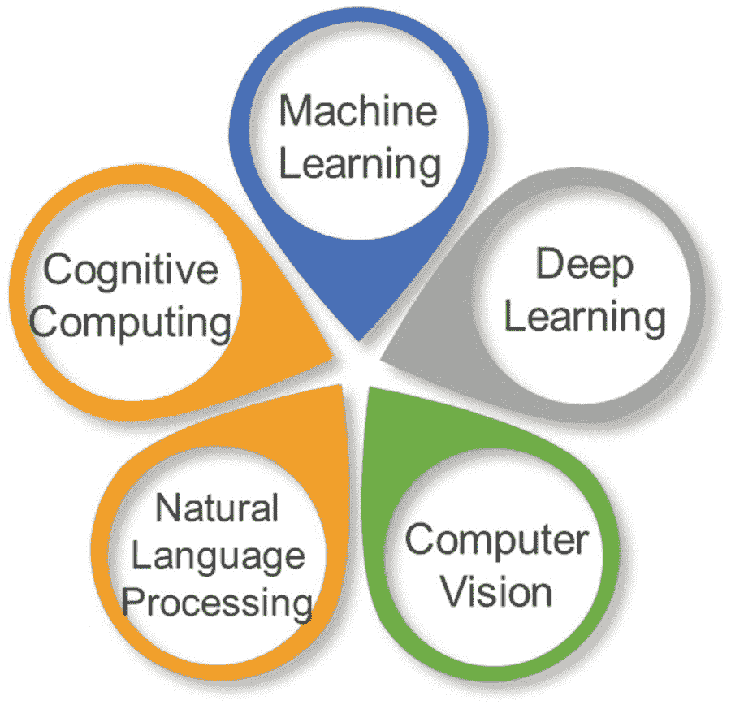
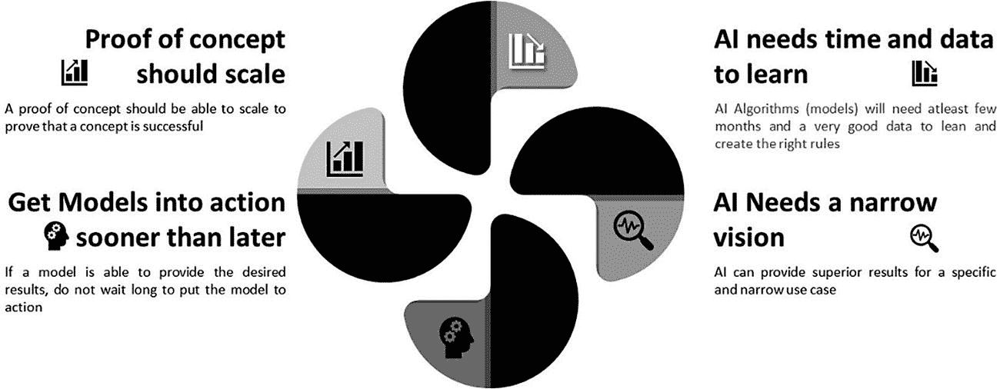

# 10. 物联网世界中的人工智能（应用型物联网）

自动化是指将机器应用于以前由人类执行的任务。虽然"机械化"一词通常用于指单纯用机器替代人力，但"自动化"通常意味着将机器整合到一个自主运行的系统中。自动化已经彻底改变了它所引入的领域，现代生活的方方面面几乎都受其影响。

数字化转型与自动化相辅相成。数字化转型是指将业务流程与当前基于自动化的技术相协调，使跨企业工作流的全貌变得便捷、优化且错误更少。换言之，它将原本孤立、部门专属、手工完成的任务转变为流程化、可普遍访问且战略性自动化的模式。它通过向现有系统引入新软件来实现这一点。该软件作为已有系统的扩展，执行许多重复单调的功能，而这些功能以前需要跨多个部门的多个员工来完成。这正是业务流程滞后时间和瓶颈产生的主要原因，因为工作流的某些部分在部门队列之间停滞不前。然而，借助数字化转型技术，员工无需再花费大量时间以"旧方式"做事。在自动化技术和简化的跨部门软件的支持下，企业现在可以将注意力转移到更高层次、更高阶的工作上，从而形成精细调整的企业工作流流程，最大限度地减少浪费，并最大限度地提高资源生产力。

世界正在走向自动化，企业在多大程度上实现自动化并没有技术上的限制。然而，在做出决策之前，始终需要分析自动化带来的收益与所付出的成本。简单来说，高度重复性的任务需要自动化。

有多种工具和技术可以实现自动化。机器人流程自动化（RPA）就是其中之一，该术语用于指代那些部分或完全自动化人类活动中那些手动、基于规则且重复性工作的软件工具。它们通过模拟真实人类与一个或多个软件应用程序交互的动作来执行任务，例如数据输入、处理标准交易或响应简单的客户服务查询。

机器人流程自动化工具并非要取代底层业务应用程序；相反，它们只是将人类员工的已有手动任务自动化。

机器人流程自动化的一大关键优势在于，这些工具不会改变现有系统或基础设施。传统的自动化工具和技术使用应用程序编程接口（API）与系统交互，这意味着需要编写代码，而这可能会引发关于质量保证、代码维护以及应对底层应用程序变更的担忧。

使用机器人流程自动化，需要对重复性任务进行脚本编写或编程，这需要一位了解如何手动完成工作的主题专家（SME）。此外，数据源和目标必须高度结构化且保持不变——机器人流程自动化工具无法运用智能来处理错误或异常情况。但即便如此，机器人流程自动化仍能带来切实、具体的益处。伦敦政治经济学院的研究表明，RPA 可以带来 30% 到 200% 的潜在投资回报率——而这仅仅是第一年。^(²²) 如此规模的节省将令人难以抗拒。去年，德勤发现，虽然只有 9% 的受访公司实施了 RPA，但近 74% 的公司计划在未来 12 个月内研究这项技术。

RPA 的局限性在于，它们以静态方式模仿人类行为，缺乏人类适应变化的能力或智能。人工智能是下一项重大技术，它通过使机器能够在学习和解决问题等功能上模仿人类，从而补充了 RPA。与只能执行重复性任务的 RPA 相比，人工智能可以从过去的数据中学习，并以更智能的方式执行任务。

RPA 和人工智能正在融合，其所带来的成本节约和收益对企业来说极具吸引力，不容忽视。例如，机器人流程自动化（RPA）可以捕获并解释现有业务流程应用程序（如理赔处理或客户支持）的操作。一旦"机器人软件"理解了这些任务，它就可以接管它们的运行，并且其速度、准确性和持久性远超任何人类。用 AI 算法补充 RPA 可以带来额外的好处，即机器人可以从数据和自身错误中学习，从而随着时间的推移提高其准确性和性能。

RPA 和 AI 结合的应用范围可以扩展到降低成本以及为企业带来新的洞察，从而做出明智的决策。RPA 和人工智能的结合可以为企业提供最大程度的自动化能力，是数字化转型过程中需要考虑的最重要因素之一。这些优势在物联网环境中会进一步放大，我们将在后续章节中讨论。将物联网与人工智能相结合，可以创造出"智能机器"，它们模拟智能行为，在很少或无需人工干预的情况下做出明智的决策。其结果是加速创新，从而显著提高相关企业的生产力。物联网和人工智能市场正在同步快速发展。

## 机器人流程自动化

如前所述，机器人流程自动化（RPA）是一种技术，它允许配置计算机软件或"机器人"来模拟和整合人类在与数字系统交互时的操作，以执行业务流程。RPA 利用用户界面来捕获数据并操作应用程序，就像人类所做的那样。它们进行解释、触发响应并与其他系统通信，以执行大量重复性任务。

许多企业正在转向 RPA 以简化企业运营并降低成本。通过 RPA，企业可以自动化基于规则的单调业务流程，使业务用户能够将更多时间用于服务客户或其他更高价值的工作。被称为虚拟 IT 支持团队的 RPA 机器人正在取代人类处理重复单调的流程。企业还通过将机器学习、语音识别和自然语言处理等认知技术注入 RPA，进一步增强其自动化能力，实现过去需要人类感知和判断能力的高阶任务的自动化。这被称为人工智能。

区分 RPA 与业务流程管理（BPM）等企业自动化工具的关键区别在于，RPA 使用软件或认知机器人来执行和优化流程操作，而不是人工操作员。与 BPM 不同，RPA 是一种快速且高效的解决方案，无需侵入式集成或更改底层系统，使组织能够主要通过用软件"机器人"替代人类来快速实现效率和成本节约。

RPA 非常适合自动化，但仍需注意其局限性。例如，由于 RPA 通常与用户界面交互，即使这些界面的微小变化也可能导致流程中断。

## 人工智能

人工智能（AI）是“让机器变聪明的科学”。如今，我们可以教机器像人类一样行事，赋予它们看、听、说、写和移动的能力。

人工智能是一个涵盖众多子领域的广义术语，这些子领域旨在构建能够完成人类需要智能才能完成的任务的机器。这些子领域如图 10-1 所示，并列举如下：

图 10-1  
人工智能子领域

**机器学习** – 机器学习使系统能够自动从经验中学习和改进，而无需进行显式编程。它专注于开发能够访问数据并利用数据自行学习的计算机程序。机器学习是计算机系统通过接触数据来提升性能的能力，无需遵循显式编程指令。这是一个自动从海量数据中发现模式的过程，这些模式随后可用于进行预测。

**深度学习** – 这是一种相对较新且非常强大的技术，涉及一系列算法，这些算法在深度“神经”网络中处理信息，其中一层的输出成为下一层的输入。神经网络是受构成动物大脑的生物神经网络启发而设计的计算系统。神经网络的数据结构和功能旨在模拟联想记忆。深度学习算法已被证明在例如检测癌细胞或预测疾病方面非常成功，但有一个重要的前提：无法确定深度学习程序依据哪些因素得出其结论。

**计算机视觉** – 这是计算机识别图像中物体、场景和活动的能力，它使用技术将分析图像的任务分解为可管理的部分，检测图像中物体的边缘和纹理，并将图像与已知物体进行比较以进行分类。

**自然语言/语音处理** – 这是计算机像人类一样处理文本和语言的能力，例如从文本/语音中提取含义，甚至生成可读、风格自然且语法正确的文本。

**认知计算** – 这是一个相对较新的术语，受到 IBM 的青睐。认知计算应用认知科学的知识来构建包含多个人工智能子系统的架构，包括机器学习、自然语言处理、视觉和人机交互，旨在模拟人类思维过程，从而在复杂情境中做出高级决策。根据 IBM 的说法，其目的是帮助人类做出更好的决策，而不是替他们做决策。

### 数据科学

物联网的概念在过去几年中已经成熟，并且仍在继续成熟。人们越来越关注安全性、边缘分析以及其他对物联网项目成功至关重要的技术和平台的重要性。然而，物联网用例取得成果所需的最重要元素之一是数据。事实上，“物联网”这个短语中缺失的一个关键元素，或许是整个拼图中最重要的一块——数据本身。

物联网的核心就是数据。几乎所有企业都在收集海量数据，并基于这些数据做出业务决策。企业拥有的数据越多，就能产生越多的业务洞察。利用数据科学，企业可以发现数据中那些甚至未曾知晓存在的模式。例如，人们可以根据前方车辆发送的数据，发现自己面临事故风险。在这样的场景中，数据科学被广泛应用。企业利用数据科学构建推荐引擎、预测机器行为等等。这一切只有在企业拥有足够数量的数据时才有可能实现，从而可以在这些数据上应用各种算法，以获得更准确的结果。数据科学的核心就是利用机器学习算法，在庞大的数据集上应用人工智能，进行预测并发现数据中的模式。

### 人工智能与数据科学之间的联系

正如我们之前讨论的，数据科学与人工智能之间的联系是一一对应的。这意味着数据科学通过关联相似的数据以供将来使用，帮助人工智能找出问题的解决方案。从根本上说，数据科学使人工智能能够更快、更高效地从那些庞大的数据池中找到恰当且有价值的信息。没有数据科学，人工智能便不复存在。人工智能是一系列技术的集合，这些技术擅长从大量数据集中提取洞察和模式，然后基于这些信息进行预测。

一个例子是 Facebook 的面部识别系统，它会随着时间的推移收集大量现有用户的数据，并将相同的技术应用于新用户的面部识别。另一个例子是谷歌的无人驾驶汽车，它实时收集周围环境的数据，并处理这些数据以在道路上做出智能决策。

一个典型的非人工智能系统，如同会计软件一样，依赖人工输入来工作。系统通过手动硬编码规则。然后，它严格遵循这些规则来帮助处理税务。系统只有在人类程序员改进它时才能得到提升。但机器学习工具可以自我提升。这种提升源于机器根据新数据评估自身性能。

#### 高质量数据的重要性

人工智能成功的关键在于拥有高质量的数据。只有当人工智能能从与企业使用 AI 自动化的用例高度相关的优质且高质量的数据中学习时，才能提供卓越的结果。例如，要解决一个物理问题，如果你向人工智能系统提供与数学相关的数据，那么结果可能并不理想。你的系统会学到一些东西，但这些努力可能无法帮助系统正确回答你的测试问题。再举一个例子，如果你用人行道被错误标记为街道的图像来训练用于自动驾驶车辆的计算机视觉系统，结果可能是灾难性的。为了利用机器学习算法得出准确的结果，你需要高质量的训练数据。要生成高质量的数据，你需要熟练的标注员仔细标注你计划在算法中使用的信息。

如果数据质量不佳，人工智能将无法提供预期的结果，因为人工智能通过机器学习从数据中学习，因此企业需要高质量的数据。如果数据不好，人工智能系统就无法很好地学习，从而也就无法给出良好的结果。这意味着使用人工智能的组织必须投入大量资源，以确保拥有足够数量的高质量数据，从而使他们的人工智能工具能够产生预期结果。但这并不一定意味着企业需要一个功能齐全的企业级大数据平台来开启其人工智能之旅。人工智能可以针对特定用例的质量数据子集进行工作，企业可以创建一个能够满足该特定用例需求的数据存储库，并使用这些数据来训练系统。

如今，市场上几乎所有产品，无论其工具专长是什么，都声称工具内置了人工智能功能，这在技术市场上造成了很大的困惑，即对于人工智能驱动的用例应该使用哪些工具。然而，需要理解的是，几乎所有主要工具能力并非人工智能或机器学习的产品，只提供通用的人工智能能力，并且只能执行非常有限的人工智能任务。如果某公司需要在其内部跨广泛的物联网用例应用人工智能，那么他们需要寻找能够针对该特定用例对物联网数据执行人工智能的物联网云平台。Azure IoT Platform 就是这样一个例子。

### 人工智能与物联网

我们在前面的章节中讨论过，RPA 使用预定义的规则来执行活动，并且在过去几年中，RPA 在多个用例中取得了巨大成功。即使我们考虑像 NASA 这样的组织解决的一些世界上最大的问题，也是通过传统的规则或理论实现的。例如，为了从地球飞往火星，NASA 的目标不是火星当前的位置，而是要找出火星九个月后将在哪里，因为宇航员从地球飞到火星需要九个月时间。NASA 用于预测火星九个月后位置的规则是基于已有 300 年历史的牛顿运动定律。牛顿定律适用于我们太阳系中的所有行星，除了水星。水星是另一个故事，因为它离太阳太近等等，还有其他原因。股票市场也有类似的情况。像“如果股票的短期均线上穿长期均线，则买入股票”这样的预定义规则，效果相当不错。在过去几年，当人工智能还不是企业战略一部分时，这类预定义规则曾是常态，但现在已经不是这样了。人工智能正成为大多数组织的主流，并且有越来越多的用例证明了人工智能的好处。由于这种广为人知的关注，企业已经开始摆脱对传统规则和基于规则的系统的思考。新的常态是——给我数据，我将通过从数据中学习来创建模型，我学得越多，创建的模型就越好。这就是人工智能的全部意义所在。对于物联网用例，人工智能正在将收益放大到企业能够超越其利润率的程度，而同时许多其他企业正在进入他们过去从未想过的新业务领域。

物联网会产生大量数据。设备以高速发送大量且种类繁多的信息，这使得物联网数据管理非常复杂。我们将在第`11`章详细讨论物联网中的数据管理。管理如此复杂的物联网数据需要强大且量身定制的数据架构、策略、实践和程序，以恰当地满足物联网数据生命周期的需求。传统的大数据方法和基础架构是不够的，企业在评估过程中需要验证物联网云平台或物联网网关是如何解决物联网特定数据挑战的。

当涉及到物联网数据时，可扩展性和敏捷性是最大的担忧之一。物联网数据流量的庞大规模及其即时性使得物联网用例的数据管理变得复杂。物联网云平台或物联网网关需要从物联网数据角度解决的一些关键挑战如下所列：

*   考虑到物联网设备的数量会随着时间的推移而增加，比如说从 40 个增加到 40 万个，物联网数据架构将如何适应这种变化？

*   大多数物联网数据的保质期很短——这意味着需要在设备生成数据后立即采取行动。例如，如果设备记录到熔炉温度极高，则需要立即关闭熔炉，并且只有在该时间点采取行动时，这个温度数据才有用。企业需要了解物联网产品供应商提供的用于实时处理和分析的物联网解决方案。

*   一旦接收到物联网数据，将如何存储它，以确保为新信息留出足够的空间？

*   输入和输出将如何在设备中流动而不会发生堵塞？

*   对于需要将设备数据与非设备数据（例如，关于用户和密码的元数据）结合起来的物联网用例，存在哪些解决方案可以结合这些不同的数据以使数据有意义？

#### 在物联网用例中应用人工智能的经验教训（应用物联网）

人工智能高度依赖高质量的数据来做出正确的预测。一旦企业拥有足够的高质量数据，人工智能的工作方式是：向机器学习模型提供一组数据。利用这第一组数据，模型执行计算并预测一个结果。如果结果错误，它会重新调整规则，并将该规则应用于第二组数据并预测结果。这个循环持续进行，直到结果正确为止。一旦结果正确，数据会被多次输入以确定结果的准确性。在将规则应用于数千个数据集并消耗海量数据之后，一个能够做出正确预测的模型就被创建出来了。这就是机器学习的本质。

在物联网用例中应用人工智能并非一件非常简单的事情，并可能导致若干挑战。如果规划不当，应用物联网项目很多时候可能会变成一个繁琐而漫长的工程。我个人在应用物联网用例中学到了四个关键的经验教训，如图`10-2`所示。

图 10-2

应用物联网用例的重点领域

-   **POC 未成功，除非它能扩展**

第一条规则是，不能仅凭概念验证就认为一个概念已经成功。只有当概念验证能够扩展时，这个概念才算成功。

让我用一个案例研究来解释这一点。美国一家拥有 2000 多家零售店的顶级奢侈品牌希望我们利用机器学习创建一个人工智能工具，该工具能够在任何名人光顾其门店时，在五秒内向门店经理发出警报。门店经理随后将能够迎接名人，并给予他们热情的欢迎。我们开发了应用人工智能用例，并使用 400 个摄像头在阿拉斯加的五家门店进行了部署，结果令人鼓舞，成功率超过 95%。我们使用面部识别技术和机器学习模式，基于数百万数据集对大约 5000 位名人实施了概念验证。它在阿拉斯加表现非常出色。

我们在密歇根州和其他城市使用了相同的技术，部署了 10000 个摄像头，但结果并不理想。我们错过了进入密歇根州和底特律门店的 32% 的名人，因为所使用的数据不足以识别该地区的所有名人。这个案例研究教会我们，如果一个概念验证证明它能在五秒内用 400 个摄像头和 5000 位名人正常工作，并不意味着它能在 40000 个摄像头和 50000 位名人场景下正常工作。因此，第一个教训是，除非概念验证被证明能够扩展，否则它不算成功。

-   **人工智能需要足够的数据和时间来学习**

为了预测并提供准确结果，人工智能模型需要大量的数据和时间。一个中等复杂度的应用人工智能用例需要至少六到九个月的学习时间才能达到 95% 的准确率。一家名为`Seagate`的制造业客户要求我们在其整个生产线上部署多个设备，以实时了解其生产线故障情况，因为传统上如果某个设备出现故障，整个生产线就会停止，这可能导致数百美元的损失。但客户的关键要求是，我们不能过早或过晚告知他们这些故障；他们需要在任何事故即将发生之前得到通知。为了实现这种近乎实时的故障警报，我们需要海量的数据，并且模型需要几个月的时间学习才能预测故障。在将数百万物联网数据集输入机器学习模型超过九个月后，该模型能够在大约 85% 的情况下预测故障。

-   **明确要实现的目标**

如果给人工智能分配一个特定的、狭窄的任务，它就会非常有效。

我们被叫到一家医院，该城市肺结核发病率很高。政府决定对该市所有 40 岁以上的人进行肺结核检测。虽然全市正在大规模进行扫描检查，但医院面临的挑战是，在拍摄胸部 X 光片后，医生需要两周时间才能确认一个人是肺结核阳性还是阴性。对于阳性病例，在这两周内，存在感染者将疾病传播给周围其他人的风险。人工智能被用来解决这个问题。我们请医生分享所有患者的 X 光片，并将它们分为两类：肺结核阳性与肺结核阴性。肺结核阳性是感染了肺结核的患者，其余的被归类为肺结核阴性。机器学习模型对从全市实验室提取的数千张 X 光片进行了训练。模型基于阳性和阴性报告反复训练。在学习了数百万张 X 光片后，最终的人工智能模型能够在一秒钟内根据 X 光片预测一个人是肺结核阳性还是阴性。该算法达到了 95% 的成功率。

因此，从这个案例研究中得到的关键教训是，企业需要非常明确他们希望从人工智能中实现（预测）什么。在医院的案例研究中，我们仅使用 X 光片作为预测患者肺结核的手段——我们没有使用`MRI`或`CT`扫描。

-   **如果模型工作正常，就付诸行动，而不是追求做更多的人工智能**

如果一个模型工作良好，强烈建议根据用例将模型付诸行动。

我们在哥本哈根时，有人向我展示了一个移动应用。这个移动应用显示，在我位置周围 100 公里范围内，有多少家食品店在接下来的两天内有即将过期的食品。利用这些数据，商店对即将过期的食品提供 50% 到 70% 的折扣。我发现从我酒店周围 7 公里范围内有大约 2000 种食品，一旦我点击某个特定商店，它就会列出该商店所有即将过期的商品。我还可以点击某个特定商品，应用会告诉我附近所有有该过期商品出售的商店。这是一个简单的应用，不需要人工智能来完成工作，一些简单的规则就足够了。开发这个应用的公司最初立志要使用人工智能算法，但他们很快意识到这个应用并不需要人工智能，一些简单的规则就足以从食品中提取过期日期信息并分享给用户。这意味着，一旦你花足够的时间收集数据并看到结果，最好实施这些规则，而不是强迫自己去做应用人工智能。

从这个例子中学到的教训是，企业并不总是需要强迫自己用收集到的数据去做人工智能，即使他们获得了资金支持。如果你已经能够使用预定义规则很好地利用现有数据，那么就请使用这些规则来实现业务成果。

## 总结

在本章中，我们讨论了机器人流程自动化与人工智能之间的关键区别。我们还讨论并理解了人工智能内部的不同子领域，如机器学习、深度学习、计算机视觉、自然语言/语音处理和认知计算，这些领域旨在构建能够做事情的机器。

大数据在人工智能中的重要性在本章中得到了清晰的阐述。数据科学通过链接相似数据以供将来使用，帮助人工智能找出问题的解决方案。从根本上说，数据科学使人工智能能够更快、更有效地从海量数据池中找到合适且有意义的信息。不言而喻，企业只有在拥有高质量数据并能够以正确方式使用数据的情况下，才能成功地将人工智能应用于物联网用例。

在物联网用例中应用人工智能并非一项非常直接的工作，如果规划不当，可能会导致若干挑战。我们讨论了应用物联网用例场景中的四个关键经验：

1.  物联网不能仅仅因为概念验证成功就被视为成功；概念验证必须能够扩展，这是第一条法则。

2.  第二条法则是给人工智能模型足够的数据和时间去学习。

3.  第三条法则是为人工智能模型设定一个明确的目标。

4.  第四条是，如果人工智能模型已经产生结果，就应开始使用它们，而不是追求做更多人工智能。

企业必须确保选择支持人工智能的正确智能物联网网关和物联网云平台。其次，需要谨慎选择人工智能可以发挥作用的物联网用例。

在下一章中，我们将讨论数据和数据分析在物联网生态系统中的重要性，之后我们将讨论大数据参考模型。

脚注 1

