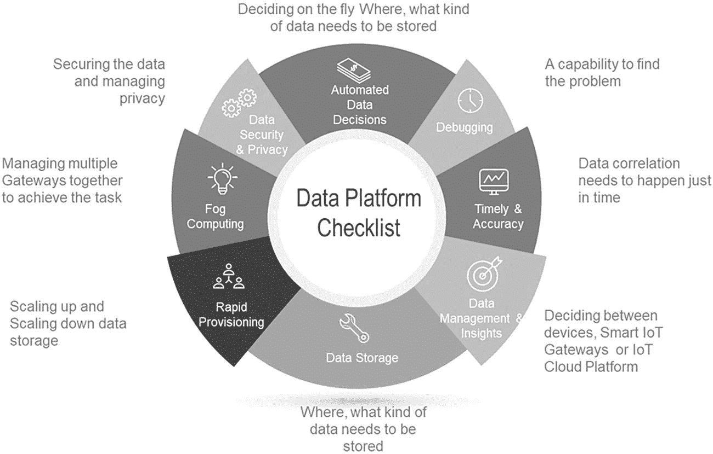
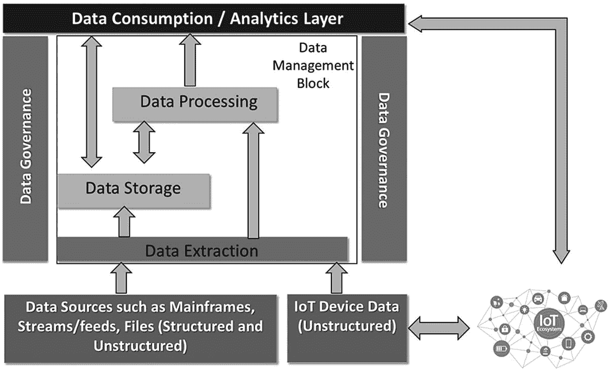

# 11. 大数据与分析

20 世纪 90 年代初，信息时代兴起。联网计算机和数字通信使企业能够收集并利用客户数据来开发新的商业模式。这带来了更高效的客户互动，而在线服务的兴起则为许多行业开辟了全新的工作方式。过去 20 年间，数据战略已成为基石，数字化转型如今在很大程度上依赖于数据。

数字化转型不仅仅是将渠道数字化或简单地以数字方式完成更多工作；其范围要广泛得多。数字化转型关乎改善客户体验、更好地理解客户与竞争对手，并利用技术满足业务需求。另一方面，企业也可以通过数字化实现运营效率。要实现这些目标，企业需要洞察力，而这种洞察力完全来自数据。这也是数据变得如此重要的核心原因之一，因此"数据优先"理念变得如此流行。数据优先实质上意味着，对于任何企业而言，在做出任何业务决策时，数据是首要考虑因素。

获取更好的数据是消除数字化转型中不确定性的关键。正如首席数据官罗布·罗伊在 Sprint 公司所解释的那样，领导者呼吁"建立一种将数据放在首位的新公司文化"。^(²³)

拥有数据优先思维是至关重要的第一步；然而，企业确实需要建立相应的流程和能力，以便能够以最及时、最高效的方式收集数据并使其可用。数据还需要以足够快的速度提供，使企业能够做出正确的决策，并从数据生成的洞察中获益。

随着技术的发展，近年来数据在类型、数量和速度方面都发生了巨大变化。过去我们有固定电话，而现在我们有了智能手机——它们让我们的生活以及手机本身都更加智能。过去我们用软盘存储数据，而现在我们用云存储数 TB 的数据。过去我们通过电话交谈，而现在我们通过`WhatsApp`发送短信、图片并进行视频通话。随着技术的进步，我们产生了海量的数据，这就是所谓的大数据。大数据是一个术语，描述的是从结构化、半结构化到非结构化数据的大规模数据集合。

结构化数据是组织成格式化存储库（通常是数据库）的数据。它涉及所有可以以行和列的表格形式存储在数据库中的数据。它具有关系键，并且可以轻松映射到预先设计的字段中，例如关系型数据。

半结构化数据是不存在于关系型数据库中，但具有某些使其更易于分析的属性的信息。通过某些处理，可以将它们存储在关系型数据库中，例如`XML`数据。

非结构化数据是指未以预定义方式组织或没有预定义数据模型的数据，例如`Word`、`PDF`、文本、媒体日志。

对于大数据而言，关键在于这些数据并非传统数据库系统所能处理的格式。除此之外，数据量也非常庞大，传统数据库系统同样无法处理。这催生了大数据平台的出现，这些平台为任何类型的数据提供海量存储、强大的处理能力，以及处理几乎无限并发任务或作业以及任何类型数据（结构化、半结构化和非结构化）的能力。然而，大数据环境下存在若干挑战，四大挑战（`Big 4 Cs`）描述如下：

## 大数据挑战

大数据需要大量的存储空间，组织必须不断扩展其硬件和软件，以适应数据的增长。随着这些数据集随时间呈指数级增长，处理它们变得极其困难。

第二个挑战是数据的**高速性**。这意味着新数据的生成速度非常快，组织需要拥有能够实时响应的解决方案。

第三个挑战是数据的**多样性**。数据以多种不同的格式存在，例如文本、图像、视频和电子表格。将这些数据整合起来，理解其含义并生成报告，是一项需要解决的艰巨任务。

企业面临大数据的第四个关键挑战是**安全性**。保护海量数据集是大数据平台面临的严峻挑战之一。

市场上存在许多成熟的解决方案来应对上述挑战，但在将其引入企业之前，需要仔细评估这些方案。

## 工业 4.0 与物联网数据

工业 4.0，也称为第四次工业革命，是我们在过去几年里在物联网背景下经常听到的术语。该术语围绕传统制造业和工业实践中的自动化和人工智能，以及 IT 和 OT 行业正在发生的整体技术创新。第四次工业革命也正扩展到其他更广泛的行业，并通过使机器变得更智能、能力更强大来改变商业格局，而这一切都依赖于这些机器注入的海量数据。随着物联网引领数字化转型，管理数据的复杂性增加了数倍，因为到目前为止我们谈论的还是`TB`（太字节）和`PB`（拍字节）级别的数据，而有了物联网，我们将要处理的是`ZB`（泽字节）级别的数据。物联网数据的大小对所有"四大 C"特性（可能指容量、速度、多样性和价值等）都产生重大影响，因此需要一种非常优雅的解决方案来处理和管理物联网数据。

一兆字节（`MB`）等于 1024 千字节。一千兆字节（`GB`）等于 1024 兆字节，一太字节（`TB`）等于 1024 千兆字节，一拍字节等于 1000 太字节，而 1 泽字节等于 1,000,000 拍字节，以此类推。仅举一例，所有美国学术研究图书馆的总存储量约为 2 拍字节。

数据管理是一个管理过程，包括获取、验证、存储、保护和处理必要的数据，以确保其用户能够访问数据，并保证数据的可靠性和及时性。

数据延迟是指数据从一个地方传输到另一个地方所需的时间。

## 物联网数据的关键考量

一方面，许多企业正在推出各种平台、工具和解决方案来实现物联网用例；另一方面，企业却在努力理解来自设备的海量数据，导致他们无法从物联网用例中获取价值。在数据层面，物联网中需要解决的关键点是：理解如何存储如此海量的数据、将这些数据存储在哪里（设备端、智能物联网网关还是物联网云平台）、如何处理数据，以及随后如何以及何时分析这些数据。从概念上看，这似乎相当简单，但事实并非如此，因为需要有非常强大的解决方案来应对每项针对物联网数据的具体挑战，并非所有传统的大数据解决方案都能满足物联网数据的需求。

图 11-1 描绘了企业需要从数据角度验证的八项关键能力。^(²⁴) 根据具体用例，企业应决定这些能力需要存在于何处，即是在智能物联网网关端还是物联网云平台端，并据此购买相应的产品。

**图 11-1** 在决定数据平台时需要验证的八项能力

### 调试能力

在物联网用例中，有大量设备被连接，每个设备都会发送海量数据。物联网实施过程中一项紧迫的挑战就是调试。这意味着，如果整个物联网架构中出现问题（例如物联网用例的性能问题，或设备故障导致无法发送正确数据），则需要有强大的解决方案，可以是在物联网网关层面，也可以是在物联网云平台层面，来帮助调试问题。问题可能出现在设备层、网络层、智能物联网网关层或物联网平台层，而定位问题所在极其困难。企业需要寻找拥有合适解决方案的供应商来解决此问题。

### 数据的及时性与准确性

物联网最重要的方面之一是数据需要及时和准确。这意味着来自不同设备和系统的相关数据需要同时汇集，并实时关联起来，以便理解数据。例如，如果我们从一个与环境相关的传感器读取温度数据，同时某个设备发生故障，那么必须将确切的故障时间与确切的温度数据关联起来，才能从数据中得出有意义的洞察。如果我们无法关联这两个数据点，那么收集这些数据就毫无意义，甚至毫无价值。这意味着来自不同设备的数据必须以最小或零延迟到达，否则这些数据后续就没有价值。除了数据的及时性和准确性之外，企业还需要寻找能够恰好在关键时刻将这两个数据点汇集在一起的解决方案，以确保能够根据从数据中生成的洞察采取行动。

这引出了企业在选择任何物联网平台或网关之前需要验证的另一个重要解决方案——哪家供应商拥有最佳解决方案，能够精准地汇集实时数据，并在恰当时机从数据中生成洞察，以便及时采取行动。

### 数据管理与洞察应在何处进行

企业在开启物联网之旅时需要关注的第三个领域，是确定复杂的数据管理过程在何处进行。一旦从传感器获取数据，数据就会被摄入智能物联网网关，在某些情况下，还会被发送到物联网云平台，在那里进行数据清洗和转换，然后从数据中生成洞察。这究竟需要在智能物联网网关层面、物联网云平台层面，还是在设备自身进行？这个问题需要根据具体用例来回答，并据此选择适当的解决方案。这样的决策取决于正在开发的用例本身以及所属行业。例如，在智慧农业用例中，如果某株植物没有得到足够的水分，我们可以第二天再去给它浇水。即使稍后采取行动，或者分析出错，也不会产生重大影响——在所有这类情况下，由物联网云平台进行数据管理在经济上仍然是可行的，因为数据延迟不会对该物联网用例产生重大影响。然而，在诸如采矿等行业中，我们需要实际控制从管道中流出的原油，就必须能够在正确的时间将原油分流到正确的单元进行处理，否则企业可能会遭受巨大损失。此外，在自动驾驶汽车用例中，延迟可能导致死亡或事故。对于所有这类时间至关重要的用例，数据管理和洞察必须在物联网网关层面进行，并且要求这些网关必须部署在靠近设备的位置。在某些情况下，数据管理和洞察甚至需要由设备本身来执行。

### 数据存储考量（哪些数据需要存储，哪些需要丢弃）

我们讨论过，物联网用例会产生海量数据。然而，重要的是要明白，并非设备生成的所有数据都对企业有价值，这引出了一些企业需要从数据角度验证的关键点，具体如下：

- 哪些数据需要存储
- 哪些数据需要丢弃，何时丢弃
- 哪些数据需要短期保留
- 哪些数据需要长期保留

在企业开始开发物联网用例之前，所有这些都需从数据角度得到解决，否则将导致物联网实施失败。智能物联网网关或物联网云平台的硬件和存储规格，是根据存储需求、数据处理与数据清洗能力需求以及计算与分析能力来确定的。更具体地说，根据短期和长期数据存储需求，企业可以确定其所需的智能物联网网关和物联网云平台。

### 存储的快速配置是另一项关键需求

在过去，当数据从卫星上收集时，我们常常要等待卫星运行到我们国家上空。我们收集数据的时间窗口和带宽都非常有限，在此期间，会尽可能多地收集所需数据，然后释放存储空间以准备下一轮卫星数据收集。然而，当时所需的敏捷性并非达到分钟或微秒级别。如今，物联网用例对敏捷性的要求要高得多。数据在秒级甚至亚秒级传输并需要被收集，在许多用例中，数据仅在那一刻有价值，例如温度数据。因此，企业需要能够在接收到数据后立即进行处理、执行分析并采取行动，然后丢弃数据，释放存储空间以接收下一组数据。这引出了物联网用例在数据方面的一个关键期望，即平台支持快速配置存储的能力。企业需要能够在需要时扩展存储、任务完成后缩减存储的解决方案。

### 利用雾计算进行数据管理

由于物联网生态系统中每个设备都会产生海量数据，单个智能物联网网关将无法处理这样的负载，尤其是在大规模物联网用例中，例如制造业或石油天然气行业。对于所有这些用例，需要从数百万台设备收集数据，并基于数据产生的洞察及时采取行动。需要部署由多个物联网网关构成的集群以实现物联网用例的目标。这就是雾计算发挥作用的地方。雾计算或雾网络，也称为雾化，是一种架构，它利用边缘设备或物联网网关在本地执行大量的计算、存储和通信，并通过互联网骨干网进行路由。

企业需要寻找能够处理此类复杂架构的数据解决方案，在这种架构中，数据和数据分析需要在多个系统之间进行。

### 自动化数据决策

我们讨论过，企业需要确定哪些数据需要存储、哪些需要丢弃、哪些需要短期保留以及哪些需要长期保留。目前，管理和存储所有这些数据是手动完成的，市场上很少有能够自动执行此任务的解决方案。更准确地说，企业需要寻找能够自动在智能物联网网关或物联网云平台上执行数据存储和删除操作的解决方案。利用人工智能可以完成这项任务，机器可以学习企业过去如何管理数据，并预测未来应如何管理数据。已有公司开始研究此类解决方案，但距离完美的解决方案还很远。

### 数据安全与隐私仍是各行各业在物联网领域的重大关切

从数据角度理解物联网环境下的安全解决方案至关重要。企业需要寻找高效的方案，以对数据加密，使除接收方之外的任何人都无法读取数据。需要有强大的数据保护解决方案，因为大量数据将存储在物联网网关或物联网平台上。企业需要寻找能够解决数据清除问题的方案，并且清除后的数据无法恢复，因为企业数据始终非常敏感。另一个类似的领域是数据隐私。从数据角度出发，企业需要寻找解决方案，确保一个部门用户的数据不被其他用户访问。

# （大）数据优先参考模型

任何组织成功的关键在于，如何在其内部充分利用大数据来制定业务决策。为了做出正确的决策，企业需要在正确的时间将正确且相关的数据送达业务部门。这也是“数据优先”这一术语变得如此突出的原因之一。数据优先策略是我们如何使企业走向数据驱动型组织，让每一个重大业务决策都源于从数据中获得的洞察。为了实现数据优先策略，需要巧妙地管理数据旅程。在物联网领域，数据优先策略是强制性的，因为物联网用例将数据作为成功的主要载体。

尽管企业理解数据的重要性并已尝试开启数据之旅，但其中许多都遭遇了失败。如果没有完全实现的数据平台和标准架构，组织就不能指望拥有完善的数据规范实践来帮助他们取得成功。`图 11-2` 展示了数据优先参考模型的概览，企业可以利用该模型定义一个标准的运营模型，从而帮助他们在物联网用例的数据之旅中取得成功。

`图 11-2` 数据优先参考架构

第一个模块是数据源，来自外部和内部源的数据在此到达企业。在物联网生态系统中，物联网数据将来自设备，其他数据集将来自外部流、数据馈送、大型机系统、数字孪生或简单的 `Excel` 文件等源。这些数据有时直接存储在数据湖中，或者经过处理后存储在数据湖中。

第二个模块是数据存储和数据处理发生的地方。数据在此被获取（数据提取层），然后被清洗和提炼以使其可用。然后，这些数据以适当的格式可供消费。数据管理是一个包括获取、验证、存储和处理数据的过程，以确保数据对其用户的可用性、可靠性和及时性。

第三个模块是数据治理，它是基于控制数据使用的内部数据标准和策略，管理企业系统中数据的可用性、完整性、一致性和安全性的过程。

第四个模块称为消费层，数据在此被不同的参与者消费，例如分析平台、报告工具，或者直接由数据科学家或业务用户使用。

## 数据源

数据源简言之就是数据进入企业的地方。它可以是结构化数据，包含模式易于搜索的明确定义的数据类型；也可以是非结构化数据，即“其他所有”，包含通常不易搜索的数据，包括音频、视频和社交媒体帖子等格式；或是半结构化数据。作为物联网生态的一部分，除了常规来源的数据，还有大量由设备发送的机器数据，这些数据被称为**被动数据**、**主动数据**或**动态数据**。

被动数据由带有传感器的设备发送，这些传感器不会主动通信。它们必须先被激活才能传输数据，并且仅在被请求时才会产生数据。例如，测量地下水饱和度的传感器仅在调用 `API` 时才会产生当前数据。在被动数据收集中，由于需要管理传感器，应用程序必须承担相应的逻辑。这类传感器通常是低功耗的，并且位于偏远地区。

主动数据（也称为流式数据）意味着传感器持续传输数据，例如来自联网汽车或温度传感器的数据。与被动数据不同，这些传感器会按预定义的时间间隔持续发送数据。对于所有此类设备，物联网网关必须能够近乎实时地接收数据，应用程序则需要具备复杂的物联网数据通信能力。数据不能丢失，必须及时从流中正确解析，并以正确的格式存储和处理，以便根据生成的洞察采取行动。

动态数据是最复杂的数据，由与物联网应用程序动态通信（双向）的设备（传感器）发送，例如智能恒温器。这类设备与物联网应用程序进行“对话”。这使得其具备一系列功能，包括能够更改生成的数据、更改数据格式、更改频率，甚至处理安全问题，并提供自动化的软件更新以动态处理问题。

如今为物联网用例制造的大多数新型物联网设备都是为了处理动态数据而设计的。

在企业的物联网实施中，我们当前所有的物联网用例都可能会处理所有三种类型的物联网数据——被动数据、主动数据和动态数据。

数据管理模块是数据从数据源到达企业的位置。制定数据策略的首要步骤之一，是评估企业在数据源中拥有什么，以及物联网网关是否具备从所有类型的设备及其他来源中检索三种类型数据（即主动数据、被动数据和动态数据）的能力。

## 数据存储层

数据存储层是从不同来源和设备收集数据后，企业数据存放的位置。它从各种数据源接收数据，并以最适合组织需求的特定方式进行存储。根据用例，在某些情况下，来自来源的数据会直接存储在存储中（称为**原始数据**），而在其他情况下，数据会经过转换后再存储到数据存储中（称为**黄金数据**）。

如 `图 11-1` 所示，数据存储层位于参考模型的底部。这些技术用于存储来自传统来源（如在线事务处理 (`OLTP`) 数据库）和海量原始数据，以及来自结构较弱的来源（如日志文件、传感器、网络分析、文档和媒体档案）的数据。

越来越多的存储发生在云端或虚拟化的本地资源上。企业正从传统存储转向商品化硬件，最近又转向亚马逊 (`Amazon`) 等公司提供的托管服务，例如 `Amazon S3`。

随着公司生成和存储的数据量开始激增，复杂而易于访问的系统和工具正在被开发出来。

## 数据提取层与数据处理层

数据提取是将由组织外部来源创建的相关数据导入进来的过程。物联网数据，尤其是来自物联网设备的流式数据，无法通过传统的数据提取方案处理。企业需要寻找能够有效提取主动、被动和动态物联网数据的解决方案。例如，微软 `Azure` 的 `Stream Analytics` 可以执行物联网数据的提取。

数据处理是为企业使用而清理和精炼数据的过程。对于任何类型的数据，当它进入一个组织时（在大多数情况下，存在多个数据源），它很可能是不干净的，或者其格式无法被组织内外的用户直接报告或分析。因此，首先需要进行数据处理，这通常包括数据清洗、标准化、转换和聚合。`Apache Spark`、`PostgreSQL` 和 `Amazon Redshift` 是能够执行此任务的工具的好例子。

## 数据消费层

该层消费数据处理层提供的输出。企业可以使用众多高级工具之一来运行查询，以回答业务提出的问题，对数据进行切片和切块，构建仪表板，并创建可视化图表。在某些情况下，该层的数据由组织内的用户以及组织外部的实体（如客户、供应商、合作伙伴和提供商）直接消费。

在物联网用例中，基于数据消费层生成的洞察采取行动。例如，如果某台特定机器的温度超出一定范围，消费层内的工具会实时检测到此类事件，并向物联网设备发送命令以关闭机器。

物联网用例需要先在每个设备级别执行基于时间的分析，然后聚合成总体数字，以提供设备集群整体状态的视图。这是一个跨设备资产进行汇总的复杂案例。例如，在某些情况下，一个单一的温度数据就可能触发一个动作；而在某些用例中，一段时间内的平均温度对于执行一项任务则变得至关重要。市场上有多种分析工具，例如 `AWS IoT Analytics` 和 `AWS IoT SiteWise`，它们可以基于物联网数据执行特定操作。

## 数据治理

数据治理是基于内部数据标准及控制数据使用的策略，对企业系统中数据的可用性、完整性、一致性和安全性进行管理的过程。有效的数据治理能确保数据一致、可信且不被滥用。随着组织面临新的数据隐私法规，并越来越依赖数据分析来优化运营和驱动业务决策，数据治理变得日益关键。

数据管理是数据管理与治理中的一个职能角色，负责确保企业内数据策略和标准得到执行与遵守。

数据完整性是指在整个数据生命周期中维护并确保数据的准确性和一致性，这是任何存储、处理或检索数据的系统在设计、实施和使用过程中的关键方面。

一个设计良好的数据治理项目通常包括一个治理团队、一个作为治理机构的指导委员会，以及一组数据管理员。他们共同制定数据治理的标准和策略，以及主要由数据管理员执行和落实的流程。大数据环境的搭建与治理应在企业层面而非业务部门孤岛中进行——这是企业成功的必要条件。

虽然数据治理是整体数据管理战略的核心组成部分，但组织应关注治理项目期望达成的业务成果，而非数据本身。没有有效的数据治理，组织内不同系统中的数据不一致问题将无法解决。例如，客户名称在销售、物流和客户服务系统中可能以不同方式列出。这会增加数据集成的复杂性，并产生数据完整性问题，影响企业报告和分析应用的准确性。此外，数据错误可能无法被识别和修复，进一步影响分析精度。

不良的数据治理还会阻碍合规举措，这可能给需要遵守新数据隐私和保护法律（如欧盟《通用数据保护条例》及美国《加州消费者隐私法案》）的公司带来问题。企业数据治理项目通常会形成适用于所有业务系统的通用数据定义和标准数据格式，从而提升业务和合规两方面数据的一致性。

数据治理的一个关键目标是打破组织中的数据孤岛。当各个业务部门在没有集中协调或企业数据架构的情况下部署独立系统时，此类孤岛通常就会出现。数据治理旨在通过一个协作流程——有来自各业务部门的利益相关者参与——来协调这些系统中的数据。

数据治理的另一个目标是确保数据得到合理使用，既要避免将数据错误引入系统，又要防止客户个人数据及其他敏感信息被滥用。这可以通过制定统一的数据使用策略，并辅以持续监控使用情况、执行策略的流程来实现。此外，数据治理有助于在数据收集实践与隐私要求之间取得平衡。

除了更精准的分析和更强的法规遵从性，数据治理提供的好处还包括提升[数据质量](https://searchdatamanagement.techtarget.com/definition/data-quality)、降低数据管理成本，以及让数据科学家、分析师和业务用户更便捷地获取所需数据。

最终，数据治理能通过为管理层提供更优质的信息来帮助改善业务决策。

## 总结

在本章中，我们讨论了“数据优先”思维模式，这是企业成功运用物联网的关键要素之一。企业需要建立相应的流程和能力，以便能够收集数据，并以最及时、最高效的方式让物联网用例能够使用这些数据。数据还需要以足够的速度可用，使企业能够做出正确的决策，并从数据生成的洞察中获益。

我们还讨论了在物联网的数据语境中需要解决的关键领域，即围绕如何存储大数据集、数据应存储在哪里（设备、智能物联网网关或物联网云平台）、如何处理数据，以及如何以及何时分析数据来定义解决方案。

我们讨论了企业需要从数据角度验证的八项关键能力，如下所列。根据具体用例，企业应决定这些能力需要在哪些层面存在（即智能物联网网关还是物联网云平台），并据此采购相应的产品。

1.  平台的调试能力
2.  来自设备数据的时效性和准确性
3.  决定数据管理和分析应在何处进行
4.  数据存储考量
5.  数据的快速供应
6.  雾计算能力
7.  自动化数据决策能力（哪些数据需要在短期和长期内存储或丢弃）
8.  数据安全解决方案

最后，在最后一节中，我们讨论了数据优先参考模型，该模型由四个模块构成。第一个模块是数据源，来自外部和内部的数据进入企业。第二个模块是数据存储和数据处理发生的地方。在此处，数据被获取（数据提取层），然后被清洗和精炼以使其可用。第三个模块是数据治理，即管理企业系统中数据的可用性、完整性、一致性和安全性的过程；第四个模块称为消费层，数据在此被不同方消费，例如分析平台、报告工具，或直接由数据科学家或业务用户使用。

从基于项目的组织转变为基于产品的组织，对于企业成功实施物联网至关重要，我们将在下一章讨论这一点。我们将讨论为实现物联网用例而转型为产品化组织及其相关益处。

脚注 1   2