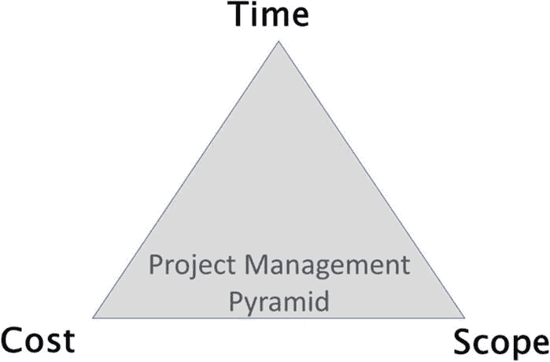
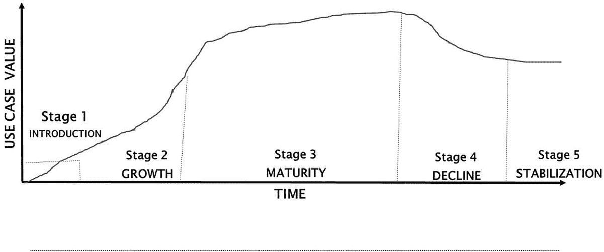
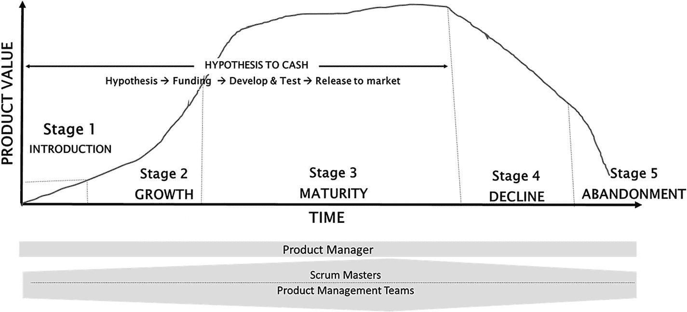
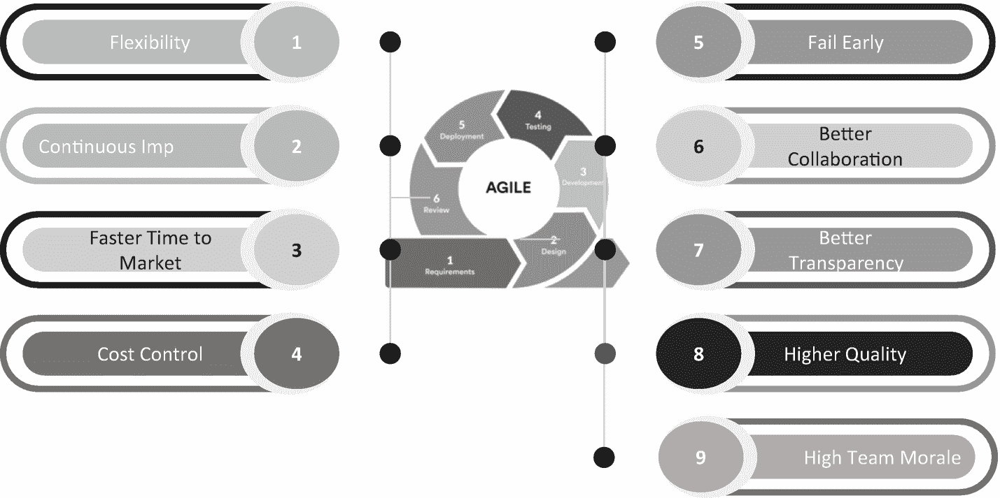

# 12. 面向物联网用例实现的产品思维

数字化转型对不同企业可能意味着不同的事情。对某些企业而言，数字化转型是采用人工智能、机器人流程自动化或大数据等技术。对其他组织来说，数字化转型是利用新兴技术而非传统技术，来构建可扩展的 IT 环境。还有一种解读是，数字化转型意味着达到组织将新功能推向市场所需的理想速度。

上述所有定义在其各自的语境中都是正确的；然而，数字化转型的本质在于从整体上（而非局部地）实现速度、敏捷性、可靠性和成本效益，以达成业务成果。借助物联网，所有这些优势都能以更快的速度和更卓越的方式实现，因此物联网已成为企业最广泛尝试的数字化转型举措之一。

在本章中，我们将探讨以产品为中心的企业与以项目为中心的企业的不同之处，以及为什么以产品为中心的运营模式对于开启物联网之旅的企业来说是必不可少的。

## 什么是项目或项目型组织？

简单来说，项目是一个容器，用于容纳所有按顺序排列的活动。我们先规划，然后分析、设计、实施，最后测试所有内容。最终，交付所有运行良好的成果。一个项目有三个相互依赖的主要约束条件，即时间、成本和范围。这也被称为项目管理三角，如图 12-1 所示。

图 12-1

项目管理金字塔

这意味着要交付一个项目，需要先确定固定的范围，然后根据范围决定固定的成本和工期。作为一名优秀的项目经理，你的目标是在时间、范围和预算内交付项目。

一个典型项目的运行周期在六个月到几年之间。如果在项目执行过程中，项目基线（例如需求）不会发生变化，那么基于项目的方法会运作良好。但在物联网背景下，基线是不断变化的——例如，今天可能需要连接 100 台设备，明天可能就变成了一万台。这就是为什么采用项目模式实施物联网用例的组织，即使能够在成本、时间和范围内完成交付，也仍然会失败的原因之一。在物联网环境下，范围是无法长期固定的。

不仅在物联网背景下，即使在普通的软件开发项目中，基于项目的方法也已被证明是行不通的。在讨论这一点时，我想起了前大型手机制造商 ABC Mobile（其业务被竞争对手苹果公司夺走）CEO 的一句话。他说他并没有做错什么，但不知何故却输了。他公司正在进行的项目都运行良好，他们采用了敏捷方法论，并且在手机开发方面有着辉煌的业绩记录。但就在 ABC Mobile 以项目方式开发手机时，市场发生了变化，人们不再购买该公司正在销售的手机类型，他们的整个用户基础流失到了另一家公司（苹果）。

这就是以项目为中心的组织面临的最大挑战。项目经理制定出关于范围、进度和预算的计划，该计划获得指导委员会批准后，几周后项目启动，然后执行，其唯一目标就是基于既定范围交付项目，而忽略了市场动态。等到项目交付时，市场已经变了。

以上是关于 ABC Mobile 的一种观点。与前述讨论相反，关于 ABC Mobile 的另一个有趣的观点是，他们在一年前就已经意识到手机行业将发生根本性变革。他们知道将会出现带有大玻璃屏幕的手机，并且苹果公司将推出一款名为 iPhone 的产品。据此，ABC Mobile 意识到手机的用户体验将主要由软件驱动（通过小部件和应用商店），而不再是物理按键。

很多人认为 ABC Mobile 未能认识到需要大玻璃屏幕，从而错失了革命性的机遇。然而，事实是他们在一年前就已经预见到行业将向软件驱动型手机转变。意识到这一点后，他们聘请了一些顶尖的顾问，招聘了更多的开发人员，并认识到自己需要成为软件创新者，并以更迭代的方式进行开发——他们确实这么做了。他们采用了敏捷方法论来开发手机。我记得在 2009 年，ABC Mobile 是采用敏捷方法论的典范，他们的员工接受了敏捷培训，每个人都开始使用敏捷方法论进行开发。当时 ABC Mobile 的主要精力集中在敏捷培训和拥抱敏捷方法论上。这就是 ABC Mobile 所谓的转型。在公司内部，开发人员接受了敏捷培训，他们使用敏捷工具、敏捷方法，并开发手机，但一切进展并没有加快。CEO 通过这些指标来衡量转型是否成功：员工是否接受了敏捷培训，是否使用了敏捷工具包。基于这些指标，高管层认为整个转型进展顺利。

但实际上，这种工作方式并未解决他们的核心问题。ABC Mobile 的核心问题在于他们的软件架构。他们的操作系统无法有效适配大屏幕，也无法支持应用商店。等他们意识到这一差距时，iPhone 已经发布，ABC Mobile 也随之退出市场。ABC Mobile 采用了基于项目的结构，尽管他们采用了敏捷方法，但这正是其失败的主要原因。他们以项目制结构运作，拥有固定的范围、时间和成本（使用敏捷方法），结果导致他们在衡量敏捷性以及价值在组织中的实际流动方式方面出现了严重脱节。

从上述讨论中可以非常清楚地看出，技术或流程无法解决业务问题。理解市场并适应变化是所有企业成功的秘诀，而这些在基于项目的结构中是无法实现的。

## 产品组织

产品组织旨在以更短的周期交付业务成果或业务价值，同时关注市场变化或企业内部变化，并立即适应这些变化。Forrester 将成果定义为可通过可衡量的结果加以验证的最终状态。^(²⁵) 成果可能包括额外营收、更高的客户满意度、新客户获取等。

成果示例如下：

*到 2022 年 7 月，我们旨在通过为因购买产品耗时过长而感到沮丧的购物者提供更快捷、更透明的结账流程，将服装销售额提高 25%。*

一旦我们定义了想要达成的成果，在短时间内可能难以全部实现，因此我们必须真正思考：哪些是最高优先级的价值，以及能在最短时间内交付的最小可行产品是什么，以便能发布到市场上验证该功能或产品的接受度。

最高优先级价值与最小可行产品成果示例如下：

*在未来三个月内，我们旨在通过为购物者增加快速结账选项，将儿童服装销售额提高 60%。这可以通过在自助服务亭安装物联网设备并支持非接触式支付选项来实现。*

许多企业仍在以项目模式运作。从项目型组织转型为成果导向的产品型组织，是企业获得成功的必要条件。

谈论业务成果以及从项目型组织转型为产品型组织很容易。但现实情况却大相径庭，尤其是对于许多已运营数十年的企业而言。

当我们谈论从项目到产品的转变时，每个企业都面临四大阻碍：

-   **IT 与业务和愿景脱节** —— 这意味着让 IT 和运营技术与业务协同工作，几乎是所有企业面临的最大障碍。
-   **高管追踪的是活动而非业务成果** —— 这显然是因为企业中 IT 经理的成功与否，是由其完成任务的数量与计划相比来决定的。
-   **项目资金机制存在缺陷** —— 这是大型企业面临的主要问题之一。项目仍按年度资金周期进行资助，通常周期为 12 到 18 个月。
-   **业务部门认为 IT 在解决自身问题** —— 这是因为 IT 通常专注于提高开发人员生产力、减少缺陷、确保业务连续性等，而这些都无法直接交付业务成果。

如今，大多数企业都希望从线性项目转向更多的产品和产品开发。当我谈及产品组织时，我记得一位首席信息官问我，像谷歌、亚马逊和微软这样的独角兽公司，规模如此庞大，是如何进行长期规划的。答案是这些公司从不做长期规划，它们的预算周期是 3 到 6 个月。这意味着董事会每 3 到 6 个月就会根据市场需求聚集在一起分配预算，并以产品为中心的心态运作。

要应对变化的市场或内部企业需求，采用 12 个月或 18 个月这样冗长的预算周期是极其困难的。如果有人试图在如此长的周期内取得成功，他们必须具备绝对的预测能力，以确定未来 18 个月需要做什么，而没有人拥有这种能力。因此，企业注定会对结果感到失望。

在产品组织中，企业会资助一个假设；这个假设被转化为原型，在市场上进行测试，一旦市场反应积极，就会进行进一步的改进，并在非常短的周期内将功能发布到市场。这个概念被称为“从假设到变现”。我们将在后续章节讨论“从假设到变现”及其对物联网用例的重要性。为了使“从假设到变现”的概念成为现实，业务和 IT 需要协同工作，并共享业务成果这一共同目标。IT 需要开始与业务部门就业务成果进行对话，并使技术解决方案与这些业务成果保持一致。企业需要摆脱业务与 IT 之间的合同关系，转向单一团队模式。单一团队模式是指 IT 和业务拥有相同的目标——这就是产品组织的全部内涵。

这样的转型不可能在一两周或一两个月内完成；它需要时间，并且业务和 IT 团队都需要接受这种模式。在产品组织模式中，业务部门起主导作用，IT 团队与业务部门合作以实现业务成果。从技术角度来看，IT 团队引入能够更快交付结果的方法。在物联网背景下，IT 团队是指 IT 和运营技术在一起组成的团队，也称为物联网团队。

在物联网术语中，一个产品就是一个物联网用例。与普通的产品组织一样，物联网产品组织也具有可衡量的成果，能提供更快的业务结果、改善的客户体验、提升的效率、减少组织内部摩擦以及更高的灵活性。所有这些都能增加整个业务部门的信任度，因为每个物联网用例都有其自身的可衡量业务收益。以产品为中心的架构允许物联网团队与业务部门之间实现更好的互动和完全的所有权，因为来自业务方的产品负责人是端到端交付物联网用例团队的一部分。在基于产品的组织中，每项功能增强或新业务功能的可衡量成果，取决于新功能发布到市场的速度、新功能能够吸引多少新客户，以及为整体产品添加新功能后客户满意度是否得到提升。或者，如果开发物联网用例是为了提高运营效率，那么成果的衡量标准是产品为业务带来了多少收益，例如在制造业环境中减少机器停机时间或提高机器利用率，或在医疗保健环境中准确自动检测疾病。这种衡量方式与项目组织中的传统指标形成对比，在项目组织中，对于每项新业务功能的开发，团队是根据生产中的缺陷数量、资源质量等来衡量的。产品组织中的传统指标并未消失，而是被视为产品成功的次要衡量标准。

## 以产品思维看待物联网产品生命周期

到目前为止，我们讨论了产品组织。在物联网世界中，企业将不再是开发产品，而是开发物联网用例。至关重要的是，要以**产品思维**而非项目思维来思考物联网用例的开发。这意味着物联网用例的开发需要遵循产品生命周期，并应用产品开发的所有原则。产品思维意味着物联网用例的开发方式与任何新产品类似。在物联网世界中，产品被替换为物联网用例。

物联网用例的生命周期与产品生命周期类似，包含五个阶段：引入期、成长期、成熟期、衰退期和稳定期。如图 12-2 所示。

图 12-2 物联网用例生命周期

*   第一阶段是引入期。在此阶段，物联网用例以最少功能启动。这也是开发物联网概念验证的阶段。物联网用例被投入实际运行，并鼓励用户开始衡量用例带来的收益。

*   一段时间后，物联网用例开始为企业业务带来可衡量的效益，随后用例进入成长期，在此阶段会添加新功能。在成长期，用户会对更丰富的功能感到满意，这些功能使物联网用例越来越具吸引力。根据用例的不同，物联网要么可以增加企业收入，要么提高企业效率，例如减少制造设备的停机时间或实现设备的预测性维护。

*   在成熟期，会添加能为企业带来价值的新功能，但每个功能都会从效益角度进行彻底验证。这是因为在此阶段，销售额或效率保持相当稳定，因此对于添加到用例中的每一个新功能，都需要有可衡量的效益。

*   一段时间后，物联网用例成为常规业务。为用例添加的新功能无法再为企业带来更多价值。这便是衰退期，物联网用例产品团队将被缩减到最低限度。

*   最后一个阶段是稳定期，在此阶段，用例的开发被冻结，仅保留运营团队负责该特定用例。运营团队管理用例的日常运营，在对用例进行任何新的增强之前，都会从成本效益角度进行彻底验证。

### 从假设到变现

引入期、成长期和成熟期是绝大多数物联网用例开发和增强发生的三个阶段，并且针对添加到用例中的每个新功能，都会应用“从假设到变现”模型。

如图 12-3 所示，“从假设到变现”模型包含四个阶段。业务、IT 和运营团队在物联网用例开发的所有阶段协同工作至关重要。

图 12-3 从假设到变现

**假设** – 这是一个对新用例想法或增强功能进行头脑风暴的阶段。在物联网产品组织中，假设是指提出一个想法（更确切地说是用例）以便进行测试，验证其是否具有为企业创造价值的潜力。

**资金** – 这是一个基于假设被接受而批准资金的阶段。

**开发与测试** – 一旦资金获批，想法就被转化为原型（概念验证）。原型是为了测试假设而构建的物联网用例的早期样品、模型或发布版本。物联网用例需要具备合理功能，以便能够验证其效益。

**发布到生产环境（并创造价值）** – 开发完成后，原型被发布到生产环境中，以验证用户对想法的接受度以及相关收益。根据已实现的收益，应用“从假设到变现”模型，以完整功能来增强该特性。

如您所见，物联网用例有其自身的生命周期，并且通过产品思维，可以将企业业务分解为多个物联网用例。所有这些用例的累积构成了企业的运营模式。

### 物联网用例开发中的敏捷软件开发方法

项目和产品管理已经存在了几十年，许多不同的软件开发生命周期模型也同样历史悠久。随着时间的推移，人们发展出了今日的标准，这些标准被视为 IT 行业的指导原则。在现代世界，技术挑战和客户需求彻底改变了人们对更优生命周期模型的需求，以跟上不断变化的需求。现代实践和原则与过去已有所不同。

传统的软件方法论大约在十年前就已失去吸引力，因为它们无法适应不断变化的需求，也无力控制大型复杂项目。

任何在行业中有一定资历并参与过大型开发项目的人，可能都经历过“预先大规模设计”（BDUF）的软件开发方法，这种方法风险极高，因为它不支持变更。大多数人在一开始无法精确描述整个系统应该如何运作。通常情况下，业务部门起初认为自己做对了，但随着进行更多分析并接触到细节，他们就开始改变主意。虽然传统方法论过去在某些组织中行之有效，并且在某些情况下可能仍然有效，但对于许多组织来说，它们只会增加因难以管理的变化需求而产生的挫败感，最终导致不可预测的项目成果。

当前快速变化的环境在质量、时间和成本方面，以及在法律、文化和逻辑参数上施加了限制。此外，一些原则正在被现代化以跟上行业步伐。敏捷就是其中一种方法论，它已从所谓的“新兴方法论”转变为主流的“开发方法论”，尤其是在产品开发领域。它通过提供更好的透明度、更好的需求权衡、更快的上市时间、更少的缺陷，并帮助构建成熟、高质量的产品，从而为客户创造价值。

敏捷是一种软件开发方法论，它通过增量方式构建系统，需求和解决方案在跨职能团队的协作下，随着时间的推移而演进。敏捷方法通常倡导轻量级的产品管理流程，包括频繁监控和快速适应变化，鼓励团队合作、自组织和自我负责。此外，还有一套良好实践能够实现高质量产品的快速交付，以及一种将开发与业务需求和组织目标对齐的商业方法。Scrum 就是其中一种敏捷方法论，它将软件构建成更小的增量单元，称为冲刺。冲刺是一个较短且有时间限制的周期，Scrum 团队在此期间致力于完成一定量的工作。冲刺是 Scrum 和敏捷方法论的核心。多个冲刺的组合被称为一个发布版本。

#### 敏捷——物联网用例开发的事实标准

物联网的核心在于以最敏捷的方式开发面向未来的用例，从而革新业务运营模式，使企业能够适应持续变化的内部因素、外部竞争、行业趋势与新兴技术，并最终降低成本。

基于此，企业必须采用敏捷方法来部署新的物联网用例。

图 12-4 展示了敏捷方法论的优势，表明敏捷是任何数字化转型企业的最佳路径。

**图 12-4** 敏捷的优势

**灵活性**

敏捷的核心在于其灵活性，允许迭代开发物联网用例的功能，并部署到生产环境或类生产基础设施上。

传统上，新业务计划通常基于详尽的需求制定，而变更空间很小，尤其是在项目启动之后。敏捷流程则接受变更，甚至预期变更。如果团队发现另一种解决方案能更有效地应对特定挑战，他们可以灵活切换。同样，如果业务优先级中途发生变化，采用敏捷方法也能更快地调整。

**持续学习与发展**

敏捷团队在整个常规迭代过程中不断学习、协作和调整，审视哪些方面进展顺利、哪些可以改进。这意味着每个人都不仅有时间拓展自身知识，还能在每个阶段识别、分享并应用所学内容，推动物联网用例开发，然后再进入下一阶段。

**频繁交付价值**

在短周期、高效能的冲刺中工作，意味着随着物联网用例的演变，其功能会逐步交付。听说物联网用例生命周期预期持续一到两年甚至更长时间，并不令人意外。采用敏捷方式可确保企业的数字化转型之旅与物联网用例开发同步进行，并在频繁的间隔中应用所学经验。同时，能够更频繁地运用最新的学习成果和最佳实践，持续交付有价值的用例。

**定义**

*`冲刺（Sprint）`* 是指产品团队在限定的短周期内致力于完成一定量工作的时段。

**成本控制**

在整个物联网用例开发过程中保持冲刺周期长度一致，可以让团队精确了解每个冲刺能完成多少工作量，从而明确每个冲刺的成本。这也使得预算可以定期优化，并在通常无需承受过高成本的情况下进行调整。

**尽早失败或零失败**

敏捷方法在物联网用例开发中几乎消除了在流程后期失败的可能性，这意味着整个项目不会遭遇彻底失败。每日更新、持续沟通、定期测试、协作反馈，以及每个冲刺结束时交付可运行的用例，确保没有任何遗漏，每个问题都能被及时发现并尽早处理。

**更高的协作、沟通与参与度**

物联网用例的实现绝非单一团队之功。要取得成功，运营技术团队、业务部门和信息技术部门需要围绕需要解决的组织挑战达成清晰愿景，并协同工作。产品型企业中的敏捷方法鼓励定期沟通、持续协作、反馈会议以及利益相关者持续管理，这些对任何产品团队的成功都至关重要。

**完全透明**

多个敏捷团队之间的定期协作、沟通与更新，使整个业务具有更高的可见性。随着可运行的用例以更短的间隔交付，这种关于物联网用例开发进展的透明度和可见性变得更加明显。敏捷确保从每个团队成员到关键利益相关者都有机会了解用例开发的进展。每日更新和进度图表提供了具体、切实的方式，用于跟踪进度并在各个层面管理预期。

**高质量**

在敏捷环境中，工作质量得以提升，因为测试和优化从项目伊始就开始了。这自然能够尽早发现问题，并快速进行相关调整。从物联网角度来看，敏捷还鼓励团队拥抱创新和技术卓越。

**更高的团队士气**

没有人的参与，变革和创新就无从谈起。要打造一支积极性高、表现卓越的物联网用例开发团队，需要一定程度的自主管理、鼓励创造力、提供反思时间、定期知识共享和持续学习——这些都是敏捷流程的优势。那些持续加班以满足不切实际截止日期的团队，必然缺乏思考手头任务以外事项的意愿或时间，从而扼杀了任何新创意的产生。

## 总结

在本章中，我们讨论了企业采用项目型组织所面临的挑战，以及向以产品为中心的组织转型的重要性。我们阐述了产品型组织的核心在于，在较短的间隔内交付业务成果或业务价值，同时关注市场变化或企业内部变化，并对此迅速做出调整。在物联网世界中，必须以产品思维而非项目思维来思考物联网用例开发。

随后，我们讨论了物联网用例生命周期的五个阶段：引入期、成长期、成熟期、衰退期和终止期。其中，引入期、成长期和成熟期是大多数物联网用例开发和增强发生的阶段，这也是“假设到现金”模型应用于用例中每个新功能的地方。该模型包含四个阶段：假设（新想法生成）、资金支持（想法资助）、开发与测试，以及最终的生产发布。

最后，我们讨论了敏捷软件开发方法论及其为企业带来的好处。敏捷是一种软件开发方法论，它通过增量方式构建系统，需求和解决方案通过跨职能团队之间的协作，在一段时间内逐步演变。

在下一章中，我们将讨论如何为企业组建成功的物联网产品团队，以从物联网中获得预期收益。

**脚注** 1

