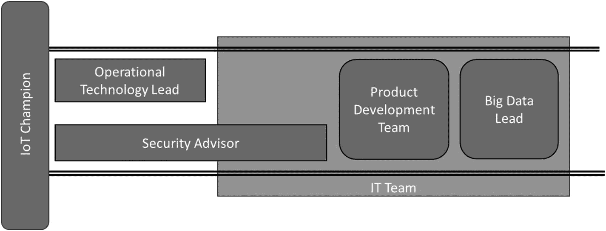
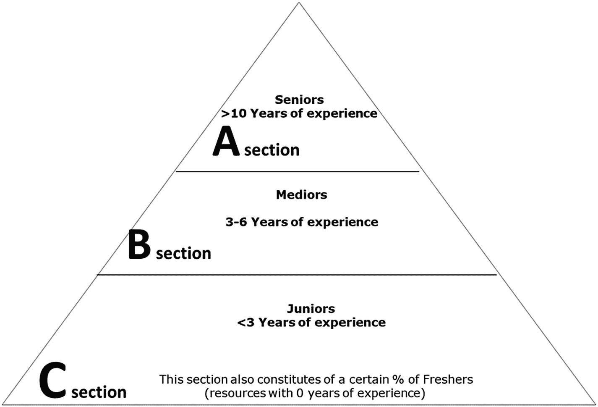
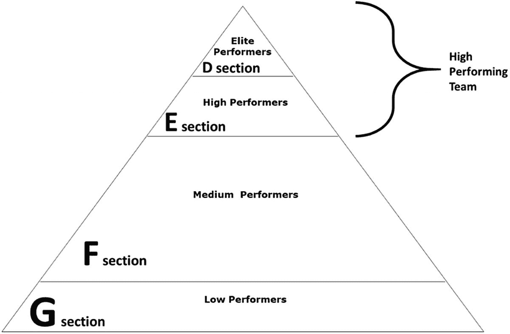
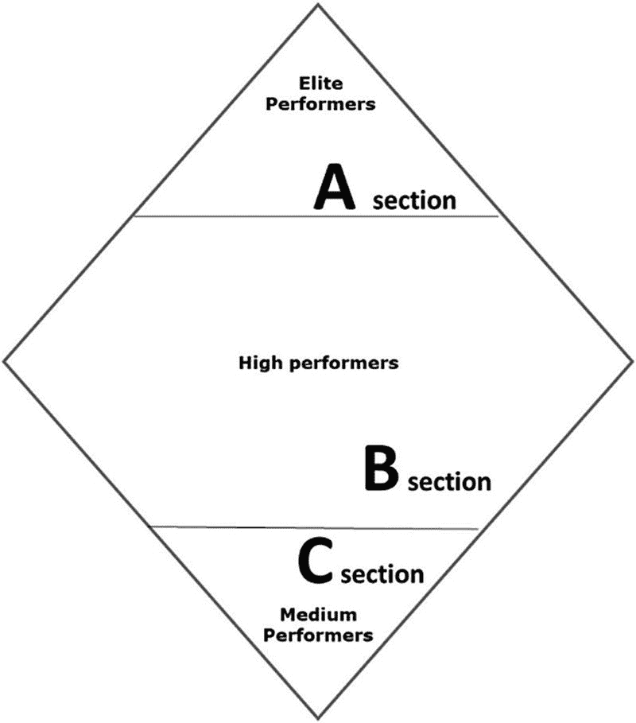
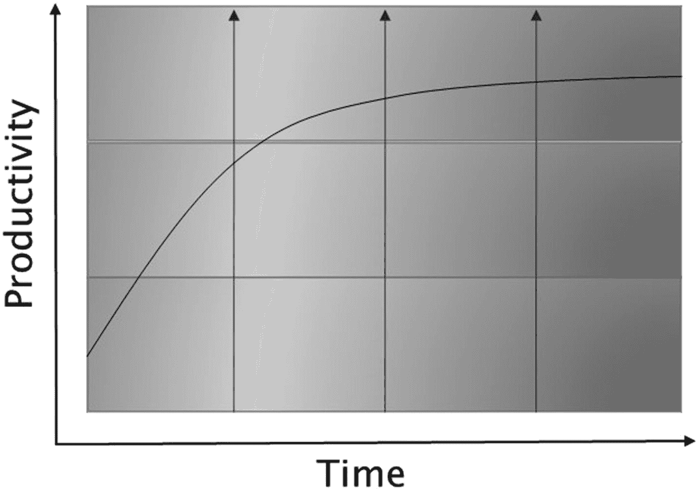
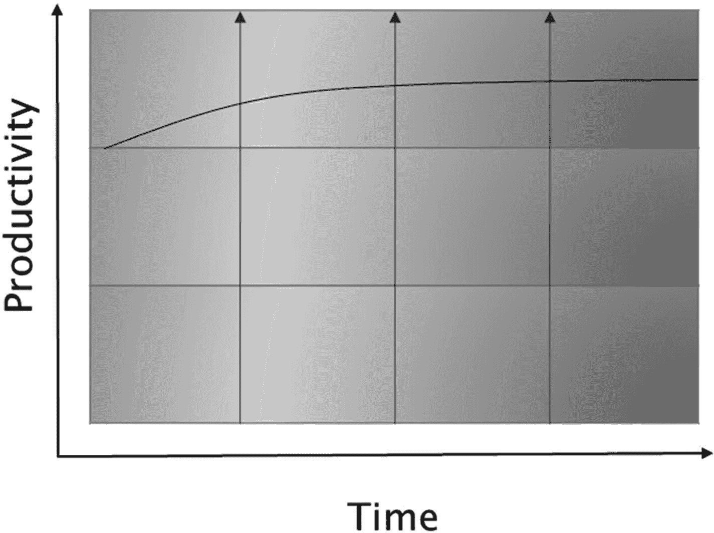
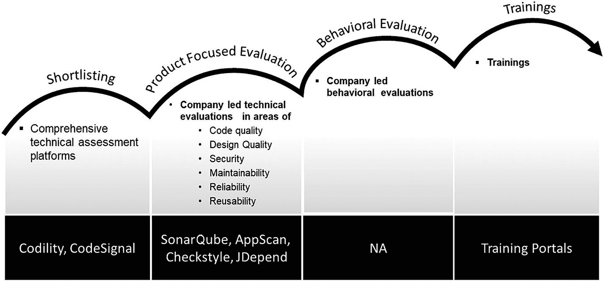

# 13. IoT 产品团队

传统上，OT（运营技术）团队在维持和扩展精益工厂运营方面发挥着关键作用。他们确保所有控制和自动化技术能够实现无缝的生产和运营流程。OT 被有意地与 IT 部门分离，二者拥有不同的人员、目标、政策和项目。这种独立性驱使 OT 团队在车间内保持敏捷和高效。近年来，IT-OT 融合席卷了多个行业，代表着一种新的数据来源，可利用 IT 技术提高工厂效率。这个全新的互联时代为 OT 团队带来了众多机遇，使他们能够进一步管理、自动化和优化车间及生产流程。遗憾的是，如果没有 IT 和 OT 团队的融合，这些机遇就无法在 IoT 应用场景中被充分利用。试想：如果车间数据与 IT 系统的数据无法集成，那么由于当前业务流程中的缺口难以被识别，运营卓越和生产优化将难以实现。

这为 IoT 的运营模式带来了新视角，即整合 IT 和 OT 团队，使企业的 IoT 愿景获得成功。正如我们之前讨论的，安全性是 IoT 的主要关注点之一，但这并不能阻止企业走向融合。企业需要找到从 IT 和 OT 两个角度提升安全态势的方法，并继续推进其 IoT 之旅。

另一方面，OT 设备会产生海量数据，传统的数据管理系统根本无法处理如此大的负载。对于如此庞大且异构的数据集，使用传统 IT 系统进行实时决策是不可能的。通过 IoT，企业将拥有互联的机器，这些机器会产生大量需要实时分析的数据，以便全面了解车间甚至单台机器上正在发生的事情。例如，在一家制鞋厂，制造鞋底的机器可以在出现意外延迟或积压时通知负责鞋底缝合的团队，让他们在维护期间切换到其他任务。没有数据连接，这种全厂范围的可见性是根本无法实现的。因此，拥有一个大数据平台对于踏上 IoT 之旅的企业来说是必需的。正如我们在第 11 章中讨论的，通过大数据平台，企业将能够从运营设备中引入各种数据，并创建一个集中的 IoT 网络。随后，该网络可以与现有的 IT 系统连接，以生成洞察。

## IoT 产品团队

基于以上讨论，图 13-1 列出了使 IoT 取得成功所需的关键角色。

图 13-1

IoT 产品团队

### 运营技术负责人

OT 负责人带来车间专业知识，并且对车间内用于特定实施用例的机械和生产流程有全面的理解。要将 OT 系统集成到 IT 世界中，需要理解 IT 通常未曾考虑到的方方面面，例如：

-   车间使用的自动化技术
-   环境因素（温度、化学品暴露等）
-   实时智能系统
-   冗余协议
-   法规要求
-   车间设置和基础设施

只有当规划和执行集成的团队理解运营和业务问题如何运作，并发现 IT 可以帮助 OT 部署新技术以改善运营的方法时，企业才能着手进行 IoT 产品开发。这是为什么团队中需要 OT 负责人的主要原因之一。在 IoT 之旅中，OT 负责人是核心团队的一部分。

### 安全顾问

IoT 中的安全性至关重要。几十年前，当企业刚开始利用客户端/服务器网络和互联网时，它们并未考虑安全问题，直到犯罪分子意识到他们可以入侵 IT 系统进行操控并窃取资金和数据。如今，当将工业控制系统 (ICS) 技术连接到互联网时，OT 环境面临着类似的挑战。直到最近，OT 还是通过专有的、基于供应商的封闭连接和协议进行互联，无法远程访问。现在，随着 ICS 技术逐渐暴露于互联网，IT 安全挑战已成为 OT 环境的一部分。这就是为什么在 IoT 项目中，安全考量应从第一天开始规划的原因之一，而安全顾问正是扮演这一角色的人。

任何需要与 IT 系统集成的 OT 系统都需要从网络安全角度进行彻底分析。在 IoT 背景下，安全意味着 IT 系统将如何与属于 OT 系统一部分的设备交互，以及涉及这些系统、传感器和设备的安全问题。选择具有内置安全功能的设备，并筛选出能够制造这些设备的、有能力的 IoT 设备供应商，是安全顾问履行的另一个重要职责。理解车间迄今为止是如何实现安全的，以及在新的 IoT 世界中安全将如何得到保障，这一点至关重要。

例如，在一家大型制造公司的案例研究中，遗留设备存在多个安全漏洞，如果要将它们连接到 IoT 网关，这会进一步放大安全顾虑。这是因为 IoT 网关连接到互联网，黑客有可能通过网关将 IoT 设备作为攻击目标。安全顾问反对将这些设备以其现有状态使用，并建议采购新设备以继续开发。我们从 Particle IO（一家广泛使用的物联网公司，推出了功能强大且安全、内置蜂窝连接的 IoT 设备）引入了新设备。除了设备安全之外，安全顾问还负责验证智能 IoT 网关以及 IoT 云平台的安全态势。

### 产品开发团队

物联网产品开发团队由 DevSecOps 团队组成，该团队包括应用开发人员、应用安全专家以及运维团队。

`DevOps` 是一种软件开发方法，它通过使用自动化来加速构建生命周期（旧称发布工程）。`DevOps` 专注于软件的持续集成和[持续交付](https://en.wikipedia.org/wiki/Continuous_delivery)，通过利用按需 IT 资源（基础设施即代码）以及自动化代码的集成、测试和部署来实现。这种软件开发（`Dev`）与 IT 运维（`Ops`）的融合缩短了部署时间、降低了产品上市时间、最大限度减少了缺陷，并缩短了解决问题所需的时间。通过在 `DevOps` 周期中引入安全控制措施，企业可以在提升安全性的同时实现开发速度，这种做法被称为 `DevSecOps`。

使用 [DevSecOps](https://en.wikipedia.org/wiki/DevOps)，领先的公司已经能够将其产品发布周期从几个月缩短到（毫不夸张地说）几天。这使它们得以在快节奏的新兴市场中成长并保持领先，而物联网正是 [DevSecOps](https://en.wikipedia.org/wiki/DevOps) 带来巨大价值的领域之一。像 Google、Amazon 等许多公司现在每天都会多次发布软件。通过提高产品发布的质量和周期，并在 `DevOps` 中引入安全性，`DevSecOps` 日益流行，并已在许多企业的物联网产品开发中取得了巨大成功。传统上，在旧式开发模式中，开发人员编写代码后将其交给质量保证或测试团队，他们测试代码、识别错误，然后再将代码交回给开发人员。开发人员修复代码后再次提交测试，之后才交给运维团队进行产品的支持和维护。这是瀑布式开发方法中常见的做法。敏捷软件开发流程也部分遵循此模型，区别在于开发周期内的开发人员和测试人员协同工作，无交接，但测试完成后仍会将代码交接给运维团队进行部署。这清楚地表明开发、测试和部署团队之间缺乏协作，最终导致开发和部署周期缓慢。`DevSecOps` 完全消除了这一挑战，因为开发、安全和运维同属一个团队，因此不存在交接。

物联网“始终在线”的特性意味着，组织可以使用 `DevSecOps`，根据来自连接设备的反馈，以安全的方式持续更新软件。日常生活中，人们使用联网车辆和机器人；企业正在部署联网工厂，并在生产车间使用物联网。如果来自连接设备有反馈意见，那么在 `DevSecOps` 环境中解决该反馈相当容易。这意味着企业可以在问题出现时立即修复。

### DevSecOps 实现更快的交付速度

`DevOps` 的主要原则是自动化、持续交付和快速的反馈周期，旨在使物联网产品开发过程更快、更安全、更高效。作为敏捷方法论的演进延伸，`DevSecOps` 利用自动化确保产品开发流程的顺畅。通过促进协作文化，它提供了快速持续反馈的空间，以便及时修复任何故障，并更快地完成发布。

### DevSecOps 管理规模并具备主动安全性

对于物联网用例，必须保护来自设备和装置的信息安全，以防止其遭到破坏。所有物联网系统都必须在几分钟内修补软件漏洞，并保持主动安全。此外，它们应该在几周内从少量设备（试点阶段）快速扩展到数千台设备（生产阶段）；因此，系统设计应能管理这种负载。一旦企业在物联网用例中启用了 `DevSecOps`，该配置便可扩展到任意数量的用例和设备。此外，物联网 `DevSecOps` 通过实时自动化发布、漏洞和补丁管理，并在不中断用户体验的情况下安装补丁和更新，来帮助开发人员、测试人员、QA 以及物联网运维团队。

### 管理严格的互操作性测试并确保可用性

物联网应用在解决方案中可能包含多种软件和硬件配置。对数百万台设备测试其安全性、性能、连接性以及众多参数并非易事。在部署到生产环境之前，需要对这些不同的配置和属性进行测试。作为 `DevSecOps` 实施的一部分所采用的自动化测试方法，可确保 QA 流程在这些不同的配置和属性上具有相当的测试覆盖率。

### 信息技术主管

信息技术主管来自 IT 组织。在物联网背景下，信息技术主管不仅熟悉 IT 系统，还能清晰理解作为物联网用例一部分的 OT 系统的细微差别。信息技术主管需要与 OT 主管合作，并能够为 IT 与 OT 的集成定义技术路线图。该角色需要全面掌握 IT 合规性、治理、安全、数据中心或云需求、企业内部使用的 IT 系统类型及其集成等。

信息技术主管需要具备的另一项重要能力是理解端到端的物联网标准参考模型。除了定义包括 `DevSecOps` 流水线在内的端到端开发平台之外，他们还应能够帮助企业筛选和选择合适的智能物联网网关和物联网云平台。在大多数情况下，信息技术主管会带领一个由资深架构师组成的团队，以实现其角色期望的目标。

### 大数据主管

大数据主管是物联网实施中最重要的角色之一。只有以能够为企业决策提供有用见解的方式捕获、过滤和分析来自设备或 OT 系统的数据，物联网用例才能成功。因此，大数据主管是物联网实施核心团队的一部分，他们与信息技术主管共同决定特定用例的数据管理和分析应在何处进行，并据此选择智能物联网网关和物联网云平台。

数据主管负责引入专业知识，以定义大数据存储需求以及数据应如何存储和管理。大数据主管还组建数据科学团队，使企业能够基于从物联网设备收集的数据获得洞察。

### 定义

`工业控制系统 (ICS)` 是一个通用术语，涵盖用于[工业过程控制](https://en.wikipedia.org/wiki/Process_control)的几种类型的[控制系统](https://en.wikipedia.org/wiki/Control_system)及相关[仪器仪表](https://en.wikipedia.org/wiki/Instrumentation)。

此类系统的规模范围可以从几个模块化面板安装式控制器，到拥有数千个现场连接的大型互联交互式分布式控制系统。

### IoT 负责人

物联网负责人是负责实现企业物联网愿景的产品主管。此人需要能够与 IT 和 OT 两个团队沟通并建立联系。这位 IT-OT 融合负责人深谙如何传达信息，以鼓励参与融合的所有相关方（包括 OT 主管和车间员工）之间的合作与协作。这个角色至关重要，其职责在于定义并重新定义 OT 部门的目标与成功标准，以促进协作。挑战在于，IT 与 OT 拥有不同的目标、理念和工作文化。而 IT-OT 融合负责人正是要将所有这些目标和人员汇聚在一起，共同实现 IT-OT 融合成功的统一目标。

### 确定物联网产品团队

到目前为止，我们讨论了物联网实施中产品团队所需扮演的不同角色。在本节中，我们将讨论如何确定一个高绩效的物联网团队。

一个高绩效的团队能够一次又一次地交付卓越成果，无论他们遇到何种挑战。我们将通过一个框架来讨论如何创建高绩效的物联网团队，该框架能够吸引具备适当能力的人才，以支持企业利用物联网进行数字化转型。

传统上，企业遵循如图 13-2 所示的三角金字塔结构，其中初级人员位于金字塔底部，高级人员位于顶部。这就是传统企业的运作方式，并且在当时，由于技术稳定且未知因素较少，这确实是正确的模式。项目执行本质上非常系统化，项目生命周期中的自动化程度为低到中等。

参照图 13-2，C 部分由经验不足三年的员工组成，通常还包括一定比例的应届毕业生。这被称为金字塔的*底部*。这些人通常是初级开发人员和测试人员。

图 13-2

典型的项目执行金字塔，由不同经验水平的员工组成

B 部分由具有中等经验水平（三到六年）的员工组成，也称为中级人员。这些人通常是物联网开发人员和测试人员，以及一些初级设计师、高级开发人员和高级测试人员。这部分也被称为金字塔的*底部 +1*。

A 部分由经验丰富的技术、职能和管理人员组成，包括产品主管、企业架构师、运营技术负责人、高级设计师、高级开发人员和高级测试人员。该部分通常被称为金字塔的*顶部 –1*。A 部分还包括 Scrum Master 和产品经理，以及企业和业务架构师，他们被称为金字塔的*顶部*。

随着时间的推移，这种金字塔结构已经根植于企业内部员工的能力体系中。如图 13-3 所示，这意味着团队中只存在一小部分高绩效个人，他们正是位于金字塔顶部的人员。

图 13-3

带有能力层级的典型金字塔

D 部分由精英员工组成，他们是任何企业或项目成功的关键。这些人擅长自己所做的工作，并且能够付出额外努力去学习和适应行业或企业中的任何新变化，无论是技术方面还是业务方面。他们具有很高的学习和贡献欲望，旨在推动产品和企业的整体成功。

E 部分由高绩效员工组成，他们对产品团队至关重要。这些人擅长自己的工作，并在其专业领域内支持企业，为产品的整体成功做出贡献。

F 部分由中等能力员工组成。这些人擅长自己所做的工作，但不一定会付出额外努力来支持项目，这并非因为他们不愿意，而是因为他们缺乏这样做的技术能力。

G 部分由低绩效员工组成。尽管许多组织会不同意这种说法，但一个众所周知的事实是，几乎所有企业在年度评估或绩效评审周期中都会将 G 部分的员工从组织中解雇。

一些企业仍在使用前面描述的传统金字塔结构运营，同时又渴望转型整个组织并实现盈利。对于渴望利用物联网等技术支持其数字化转型成功的企业来说，传统的金字塔结构并非正确的模式。

企业必须改变其结构，以确保在物联网之旅中取得成功。与传统的金字塔结构相反，产品型组织需要转向钻石型结构。企业还需要摆脱根据经验水平来衡量员工能力的做法。在基于钻石型结构的组织中，唯一的衡量标准是个人能力，这些能力被归类为如图 13-4 所示的三个象限之一。在钻石型结构中没有低绩效员工的位置。

图 13-4

带有能力层级的钻石型结构

A 部分由精英员工组成。B 部分由能力强、绩效高的员工组成，C 部分由中等能力的员工组成。

在整个钻石型结构的三个部分中，都可以找到各种角色的成员，例如敏捷教练、Scrum Master、产品经理、企业与业务架构师以及产品工程团队。

### 传统金字塔模式的成本影响

在传统的三角形金字塔结构中，初级人员位于底部，占团队的 50%-60%；中级人员位于中部，占团队的 30%-40%；其余为高级人员，约占团队的 10%。

图 13-5

传统金字塔模式的生产力水平

这种模式已存在数十年，企业通常从低成本基线起步，因为它被认为是高度优化的金字塔结构。由于这种结构中初级人员占比较大，最初几个月的初始生产力水平往往较低，因为学习曲线通常较高。此外，根据我 20 多年的经验，我观察到在头六个月内，至少有约 20%-30%的团队成员会因个人能力与项目需求不匹配而被替换。正因如此，我个人发现一个 20 到 30 人的团队通常需要三到五个月才能稳定下来，并交付合理水平的生产力。

图 13-5 展示了在传统金字塔结构中，生产力水平如何随时间推移而提高并趋于稳定。从图 13-5 可以清楚地看出，初始生产力水平相当低，然后逐渐成熟至稳定状态。这意味着，与团队所交付的价值或生产力相比，产品团队在初始阶段的成本更高。

与传统金字塔结构相反，图 13-6 所示的菱形结构从第一个月起就能保证更高的生产力水平。这是因为从一开始，只有胜任工作的合格人才被引入产品团队。

图 13-6

菱形结构的生产力水平

总而言之，一旦企业开始衡量团队随时间推移的生产力，菱形结构的成本并不会高于传统的三角形金字塔。

根据我亲身经历的多家从传统金字塔结构转型为菱形结构的企业（超过六家），事实证明，采用菱形结构的成本比传统金字塔结构可节省超过 30%。这些数据是在为期 12 个月的案例研究中测量得出的。

通过采用如前所述的菱形结构，与传统的金字塔结构相比，企业在平均资源成本方面将获得更佳的效果。需要在以下领域进行至少 12 个月的成果衡量：

-   磨合成本 – 任何新引入产品团队的资源都会产生磨合成本，例如相比现有资源增加的工资、新旧资源交接的成本、了解新产品所需的时间等。
-   团队内个人的生产力。

对于正在踏上物联网之旅的企业来说，菱形结构是必不可少的。关键在于要识别出一个积极主动且能力出众的产品工程团队，该团队将以最敏捷且最具成本效益的方式为企业开发出最佳产品。而 Hackfest 模式有助于识别合适的产品工程团队，这将在后续内容中详细讨论。

### 用于识别产品开发团队的 Hackfest 模式

`Hackfest`是一种模式，它提供了一种关于如何识别物联网产品开发团队的方法。`Hackfest`遵循一种循序渐进的方法，从为产品组织初选个人，到识别具备能力的人才，直至他们接受培训并被部署到各个产品开发团队。

`Hackfest`模式评估和选拔过程摒弃了主观评价，完全基于客观标准。因此，与传统的招聘流程相比，招募到积极主动且技能娴熟的人才的机会翻倍。

`Hackfest`模式的四个阶段如图 13-7 所示。

图 13-7

Hackfest 模式的四个阶段

每个企业都需要根据自身的组织架构，按照下文所述的指导方针来定制`Hackfest`模式。

#### 初选

第一阶段是初选阶段，在此阶段，物联网产品团队的所有潜在人选都将基于其核心技能进行全面评估。企业需要准备一个技术评估工具包，以支持为下一阶段筛选人选。此外，有许多行业领先的平台，如`Codility`、`CodeSignal`和`HackerRank`，可以通过针对物联网的在线编码测试帮助企业筛选资源。

#### 产品聚焦评估

第二阶段是产品聚焦评估，此阶段通过要求个人开发针对实际物联网用例的概念验证，来评估其技术技能。在初选阶段，个人是根据行业标准对其核心技能进行评估的；而在产品聚焦评估阶段，则是在特定于产品的实时场景中评估个人的表现。企业需要确保提供一个端到端的物联网平台，该平台配备所有能复制物联网产品开发团队实际工作环境的技术和工具。这样的平台被称为产品聚焦评估（PFE）平台。

在我曾合作过的一家名为 ABC Corporation 的企业，我们开发了一个`PFE`平台，该平台复制了实际的产品开发环境，设备连接到`IoT Gateway`和`IoT Platform`。同时还提供了一个完整的数据平台，用于评估数据团队和数据科学家。

建议创建一个`PFE`平台，用以复制产品团队将要工作的实际环境。这样的平台有助于评估个人一旦被部署到产品团队后，能够交付多高的生产力。个人需要利用完整的`PFE`平台为物联网用例进行开发。一旦个人完成开发，将对以下方面进行评估：

-   代码质量
-   设计质量
-   代码中考量的安全级别
-   从可维护性角度看代码编写的好坏程度
-   从可靠性角度看代码编写的好坏程度等
-   为物联网用例生成的报告/洞察

市场上有多种工具可以执行上述验证。在 ABC Corporation 前述的案例研究中，使用了诸如`SonarQube`等工具进行静态代码质量分析；使用`jDepend`来验证设计质量（涉及可维护性、性能和可靠性）；并使用`AppScan`进行代码安全性分析。

#### 行为评估

所有成功完成产品导向评估的申请者，都将进一步接受其行为技能的评估。行为评估是一种探索面试者在特定工作相关情境中如何表现的过程。个人过去的行为逻辑很可能预测其未来的行为方式，即过去的表现预示未来的表现。市场上有多种工具可供使用，例如用于评估个人行为技能的 `Chally Assessment`，企业也可以自行创建特定的内部评估机制。

#### 培训

一旦个人成功完成行为评估，`Hackfest` 模型的下一步就是为个人部署到产品团队做好准备。为了确保从第一天起就能达到预期的生产力水平，如有需要，应通过支持技能培训为个人提供支持。个人应被培训至能够在极少需要上级和同事监督的情况下运用支持技能的水平。

*核心技能是指完成工作或任务所不可或缺的技能。*

*支持技能是核心技能的一种变体。这意味着个人需要将其作为一项必备技能；然而，他们在这项技能上可以处于初级水平，并且这项技能可以通过培训或在职学习来获得。例如，在 `Java` 开发人员的背景下，核心技能是 `Java` 和 `J2EE`。支持技能可以包括 `C++` 编程语言经验、特定安全工具的知识、云基础设施操作系统的专业知识、在云基础设施上安装工具、监控基础设施等。每个产品团队都应根据产品需求定义核心技能和支持技能，只有具备这些技能的个人才应被引入产品工程团队。*

`Hackfest` 模型可能看起来是一个冗长的四阶段面试流程，但如果你理解了这个模型的细微差别，就会发现每个领域实际上只有一轮全面的评估。通过这种方式，可以对每个个人进行 360 度评估。例如，通过产品导向的评估，可以从代码质量、安全性、可靠性和可维护性等多个角度评估个人的开发技能。这清晰地阐述了个人的编码风格，并展示了他们的优势和劣势，从而可以据此做出决策。这意味着，如果能为产品开发团队引入合适的人才，项目将会成功得多。

借助 `Hackfest` 模型，企业可以一次性评估数百名人才，前提是能按需提供必要的配套基础设施，例如 `PFE` 平台。我个人的经验表明，一次精心策划的 `Hackfest` 可以在两天内完成对大约 200 名申请者的评估，这对于需要在紧迫期限内满足大规模人才需求的情况来说，是一个极具吸引力的前景。

## 总结

在本章中，我们讨论了一个 `IoT` 产品团队所需的关键角色，列举如下：

1.  `IoT` 负责人 – 领导整个物联网项目
2.  运营技术负责人 – 能够带来车间专业知识
3.  安全顾问 – 涵盖 IT 和 OT 系统
4.  产品开发团队 – 由 `DevSecOps` 团队构成，该团队包括应用程序开发人员、应用程序安全专家和运维团队
5.  信息技术负责人 – 熟悉 IT 系统并理解 OT 系统的细微差别
6.  大数据负责人 – 搭建并选择数据平台

既然我们了解了实施物联网所需的产品团队中的关键角色，下一步就是识别一个高绩效的物联网团队。我们讨论了企业需要遵循钻石形结构（而非传统的三角金字塔形结构），并随后使用 `Hackfest` 模型来识别产品团队。`Hackfest` 模型包含四个阶段，即：初选阶段、产品导向评估阶段、行为评估阶段和培训阶段。通过 `Hackfest` 模型，企业从基于主观的评估过程转变为完全基于客观的评估。

遵循本章阐述的原则和模型，任何企业都将能够创建高绩效的产品团队。

