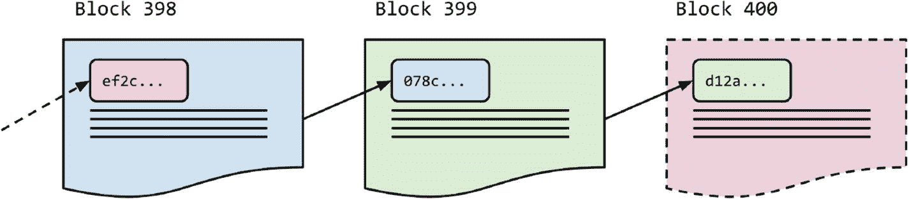

# 3. 区块链

在本章中，我们将通过使用 Python 中的简单数据类型，一头扎进区块链的世界。学完本章后，你将从根本上理解区块链是什么、其内部结构，以及哈希函数如何使其具有韧性。

上一章的概念对于理解为什么区块链被认为是不可篡改的至关重要。我们已经了解了如何发送不可篡改的电子邮件。我们将扩展这些想法，从头构建一个区块链，并清晰理解所涉及的数据结构，从而说明为什么在区块链上进行欺诈是不可能的。

让我们开始吧。

## 区块长什么样？

我们的区块是简单的 Python 字典。以下是一个区块在 Python 中的示例：

```python
block_1038 = {
'index': 1038,
'timestamp': "2020-02-25T08:07:42.170675",
'data': [
{
'sender': "bob",
'recipient": "alice",
'amount': "$5",
}
],
'hash': "83b2ac5b",
'previous_hash': "2cf24ba5f"
}
```

每个区块都有上述基本结构，但我希望你关注最后两个字段：`hash` 和 `previous_hash`。每个区块内部都包含前一个区块的哈希值。区块 1038 包含区块 1037 的哈希值，区块 1037 包含区块 1036 的哈希值，依此类推……一直追溯到第一个区块——“创世”区块。

区块可以包含任何数据：文件、图片、交易、记录等。在上述示例中，我们的区块包含一笔从 Bob 到 Alice 的 5 美元交易。这个区块与大多数加密货币区块（如比特币）的结构类似。你可能听说过有人将以太坊描述为“世界计算机”。这是因为以太坊区块的数据中还包含可执行代码，指示网络上的参与者在区块链本身上执行操作。

## 不可变性与哈希的重要性

区块链的概念并不难以理解——每个区块内部都包含前一个区块的哈希值，从而形成一条链。这种哈希的“链接”赋予了区块链不可变性和防欺诈的特性。

更具体地说，`previous_hash` 字段是区块之间的链接，用于创建链。如果攻击者以某种方式破坏了链中较早的区块，那么所有后续区块都会发生变化，因为它们的哈希值会变得不正确。例如，如果我们必须修改区块#1037 中的单个数据，那么#1037 的哈希值会不同，因此#1038 中的 `previous_hash` 值也会不同。因此，如果任何较早区块中的单个比特被篡改，整个后续区块链都将失效。这就是区块链的链式特性——它们通过使用 `previous_hash` 的哈希链来确保安全：



图 3-1 区块哈希形成链

这就是比特币的“独门秘方”——将一切联系在一起的粘合剂。如果有人通过更改链中某处交易的金额来欺诈一个区块，下一个区块的 `previous_hash` 字段就会不同，从而导致所有后续哈希值都不同。而比特币网络中的每个人都会立即发现这种差异并忽略该更改！

## 用 Python 实现基础区块链

打开你喜欢的文本编辑器或 IDE（我个人使用 PyCharm），创建一个名为 `blockchain.py` 的新文件。我们现在只使用一个文件，但如果遇到困难，你可以随时参考源代码：[`https://github.com/dvf/blockchain`](https://github.com/dvf/blockchain)。

### 使用类表示区块链

我们首先创建一个简单的区块链类。到本书结束时，这个类会变得更加复杂，但现在我们将通过向类中添加不同的方法来逐步介绍各种概念。

让我们先搭建一些方法，创建一个蓝图：

*清单 3-1. blockchain.py*

```python
class Blockchain(object):
    def __init__(self):
        self.chain = []

    def new_block(self):
        # Generates a new block and adds it to the chain
        pass

    @staticmethod
    def hash(block):
        # Hashes a Block
        pass

    def last_block(self):
        # Gets the latest block in the chain
        pass
```

我们的蓝图有一个构造函数，它创建一个初始的空列表 `chain`（用于存储区块链），以及额外的方法 `new_block`、`create_block`、`hash` 和 `last_block`，用于创建新区块、对区块进行哈希处理以及获取最新区块。

这里的思路是 `new_block` 方法负责创建区块并将其添加到链中。我们的 `Blockchain` 类将负责维护区块链所需的所有操作。让我们开始充实其中一些方法。

### 支持交易

在本书后面的章节中，交易将占据整整一章。它们涉及大量密码学知识，并且包含数字签名。开始时，我们的区块链将支持简单的未签名交易——仅用于说明目的——因此我们将创建一个名为 `new_transaction` 的方法：

*清单 3-2. blockchain.py*

```python
class Blockchain(object):
    def __init__(self):
        self.chain = []
        self.pending_transactions = []

    def new_block(self):
        # Generates a new block and adds it to the chain
        pass

    @staticmethod
    def hash(block):
        # Hashes a Block
        pass

    def last_block(self):
        # Gets the latest block in the chain
        pass

    def new_transaction(self, sender, recipient, amount):
        # Adds a new transaction to the list of pending transactions
        self.pending_transactions.append({
            "recipient": recipient,
            "sender": sender,
            "amount": amount,
        })
```

但目前，我们会保持交易简单。稍后，在第 6 章中，我们将了解更多关于交易背后的密码学知识，以及它们如何在生产级区块链（如比特币）中得到支持。

### 添加区块

当我们的 `Blockchain` 被实例化时，我们需要用创世块（genesis block）来播种它——一个没有前驱区块且索引为 0 的区块。这是一种特殊的区块，几乎总是硬编码到软件中。在比特币中，创世块由中本聪创建，并以包含了 2009 年 1 月 3 日发表于 *The Times*（泰晤士报）头版文章的以下文本（十六进制）而闻名：

*The Times* 2009 年 1 月 3 日 财政大臣面临第二次银行救助

现在，我们开始添加一些功能；我们将：

*   充实 `new_block()` 方法。
*   充实 `hash()` 方法（像比特币一样，我们将使用 SHA-256 哈希函数进行哈希运算）。
*   在构造函数方法中添加创世块。

```python
import json

from datetime import datetime
from hashlib import sha256

class Blockchain(object):
    def __init__(self):
        self.chain = []
        self.pending_transactions = []

        # 创建创世块
        print("Creating genesis block")
        self.new_block()

    def last_block(self):
        # 返回链中的最后一个区块（如果存在区块）
        return self.chain[-1] if self.chain else None

    def new_block(self, previous_hash=None):
        block = {
            'index': len(self.chain),
            'timestamp': datetime.utcnow().isoformat(),
            'transactions': self.pending_transactions,
            'previous_hash': previous_hash,
        }
        # 获取新区块的哈希，并将其添加到区块中
        block_hash = self.hash(block)
        block["hash"] = block_hash

        # 重置待处理交易列表
        self.pending_transactions = []
        # 将区块添加到链中
        self.chain.append(block)

        print(f"Created block {block['index']}")
        return block

    @staticmethod
    def hash(block):
        # 确保字典已排序，否则哈希值将不一致
        block_string = json.dumps(block, sort_keys=True).encode()
        return sha256(block_string).hexdigest()
```

此时，您可以在交互模式下打开 Python 并开始试验您的 `Blockchain` 类：

```bash
$ poetry shell
$ python -i blockchain.py
```

实例化区块链：

```python
>>> bc = Blockchain()
Creating genesis  block
Created block 0
```

我们应该看到链中只有一个区块——即创世块（为简洁起见，我已截断了哈希值）：

```python
>>> bc.chain
[{"index": 0, "timestamp": "2019-02-25T14:23:08.853678", "transactions": [], "previous_hash": None, "hash": "80ad...01bd"}]
```

尝试添加一个新区块：

```python
>>> bc.new_block(previous_hash="80ad...01bd")
Created block 1
```

继续在区块链上进行试验。

### 完整的 `blockchain.py` 代码

```python
import json

from datetime import datetime
from hashlib import sha256

class Blockchain(object):
    def __init__(self):
        self.chain = []
        self.pending_transactions = []

        # 创建创世块
        print("Creating genesis block")
        self.new_block()

    def new_block(self, previous_hash=None):
        block = {
            'index': len(self.chain),
            'timestamp': datetime.utcnow().isoformat(),
            'transactions': self.pending_transactions,
            'previous_hash': previous_hash,
        }

        # 获取新区块的哈希，并将其添加到区块中
        block_hash = self.hash(block)
        block["hash"] = block_hash

        # 重置待处理交易列表
        self.pending_transactions = []
        # 将区块添加到链中
        self.chain.append(block)

        print(f"Created block {block['index']}")
        return block

    @staticmethod
    def hash(block):
        # 确保字典已排序，否则哈希值将不一致
        block_string = json.dumps(block, sort_keys=True).encode()
        return sha256(block_string).hexdigest()

    def last_block(self):
        # 返回链中的最后一个区块（如果存在区块）
        return self.chain[-1] if self.chain else None
```

代码应该很直观。我在代码中添加了一些注释以帮助保持清晰。请注意，当我们的 `Blockchain` 类被实例化时，我们会用一个创世块（一个没有前驱区块的区块）来播种它。

此时，您应该会好奇网络中的参与者如何就向各自的区块链添加新区块达成一致。由于我们想要一个完全去中心化的点对点网络，因此需要有一套所有参与者都遵守的共同规则（一种协议）；这就是游戏的规则。向区块链添加新区块是挖矿的结果。让我们深入了解一下。