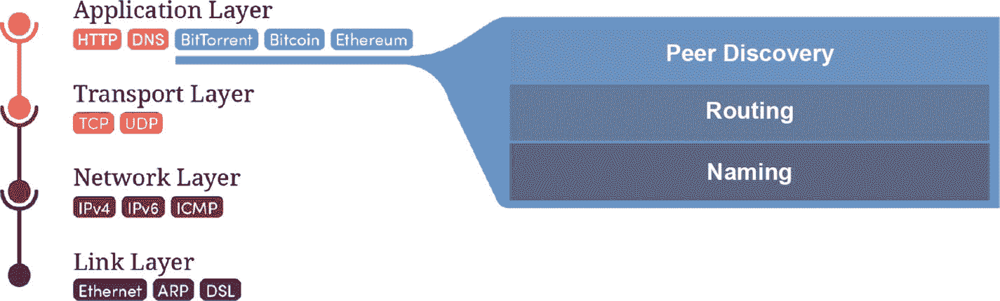

# 5. 网络

本章是关于套接字编程的实用技术章节。我们将通过构建一个可用的在线聊天室应用，学习如何通过互联网发送和接收信息包，这将在深入探讨点对点网络之前帮我们积累一些经验。

但既然本书不是关于编写优秀 Python 代码的，我们将抛开顾虑，通过反复试验和示例来理解理论。在本章中，请你多多包涵，从一万英尺的高空视角关注重点，而非纠结于细枝末节，因为这些都是复杂的内容。同时请准备好你的搜索技能，以便深入探究更多细节。

## 简要回顾互联网

我时常对互联网感到敬畏，尤其是在底层使用它时——我能在纽约打开一个连接，仅以 180 毫秒的延迟就将数据包发送到我在南非的兄弟手中，这简直令人振奋——它居然能如此顺畅地工作，实在是太神奇了。

互联网的韧性源于其主要协议（我们即将进一步了解）的简洁性：`TCP`（传输控制协议）和 `UDP`（用户数据报协议）。在微观层面，它们构成了简单、原子化的规则，但当所有参与者都在宏观层面遵循这些规则时，它们便创建了一个健壮、全球性的网络，我们在发送电子邮件、进行视频会议或相互发送比特币时，几乎不假思索地使用着这个网络。

理解网络协议类似于洋葱很重要：互联网由抽象层构成——电信号聚集成组；这些组形成模式，进而被封装成数据包；如此类推。这些模式由协议定义，协议决定了它们的形式和用途。协议本身是经过多年研究最终形成的开源文档，称为 RFC（请求评议），并拥有丰富的历史；我鼓励你阅读它们。这里提供一些灵感，这是 1980 年定义的 `UDP`（用户数据报协议）RFC：[`https://tools.ietf.org/html/rfc768`](https://tools.ietf.org/html/rfc768)。

以下是网络栈大致的分层结构图：

图 5-1

网络栈的各层

- **应用层**中的协议最接近用户，逻辑上定义了用户/客户端如何与服务（例如网站 HTTP）通信。
- **传输层**封装了应用层——应用层发送的消息被分解成段和数据包，并在网络中的两台主机之间建立连接（传输）。
- **网络层**封装了传输层，并抽象了“网络”的概念——互联网由许多互联网络组成，这些网络需要一个协议来在它们之间路由数据。
- **链路层**负责通过物理介质（如光缆）传输原始的、非结构化数据。以光缆为例，它负责将数字比特转换为光脉冲。

就本章而言，我们将专注于传输层，它允许我们在互联网上的两台主机之间发送和接收信息。这意味着我们将使用传输层的两个主要协议：`UDP` 和 `TCP`。它们的主要区别在于 `TCP` 是“有状态”的，这意味着在信息双向流动之前，两台主机会先建立连接——就像电话通话，两台主机保持相互连接。连接会一直保持开放，直到发送关闭信号。

另一方面，`UDP` 是一种“无状态”协议，这意味着信息包被发送给接收方，而发送方不等待确认；这就是为什么 `UDP` 常被称为“发射后不管”协议——它有点像通过邮政服务向某人发送邮件，但速度要快得多。

## Python 中的并发

网络编程属于并发编程的范畴，这对于新程序员来说是一个难以掌握的概念。这是因为需要网络通信的程序通常必须同时执行多项操作；例如，聊天服务器必须同时与多个客户端交互，或者比特币节点必须同时与多个对等节点通信。

处理并发的方式有很多种，最流行的两种是**线程**（在一个运行进程内的多条执行路径）或完全独立的**并行**进程。但我们将采用一种不同的方法，称为协作式多任务或通常简称为“异步”。在 Python 中，异步编程由 `asyncio` 库支持。

异步编程是通过足够快速地暂停和恢复来实现的，使得程序看起来像是在并行运行。但实际上，它只是在不同的命令之间快速切换，每次计算一小部分，然后切换到另一个。这有点像切蔬菜，不是把洋葱完全切完再处理土豆，而是切一点洋葱，然后切一点土豆，如此反复，直到两者都被切完。

你可能会认为这会影响性能，因为我们的程序并不是真正的并行运行，但对于网络（或输入/输出操作）而言，事实证明它极其高效，并且将使我们的服务器能够同时处理海量连接。

### 异步代码 vs. 多线程

编写异步代码是现代 Web 应用程序非常流行的方法——主要原因是你能编写快速、无状态的代码，且发生竞态条件的可能性很小。例如，`Node.js` 就是在单线程中异步编写的。而多线程代码则难以测试，并且需要细致的架构规划以避免竞态条件。